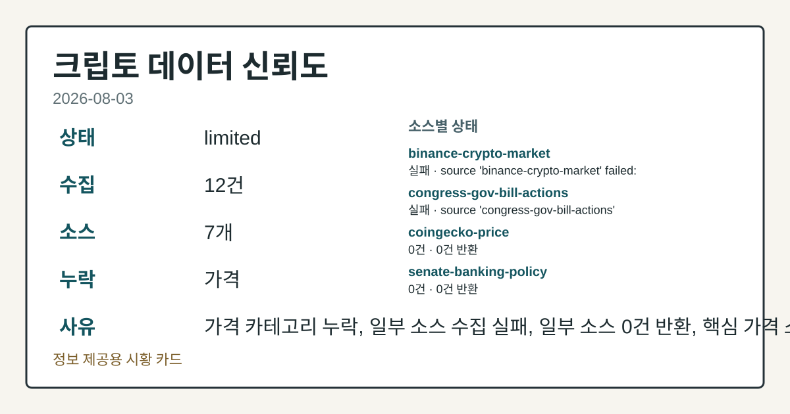
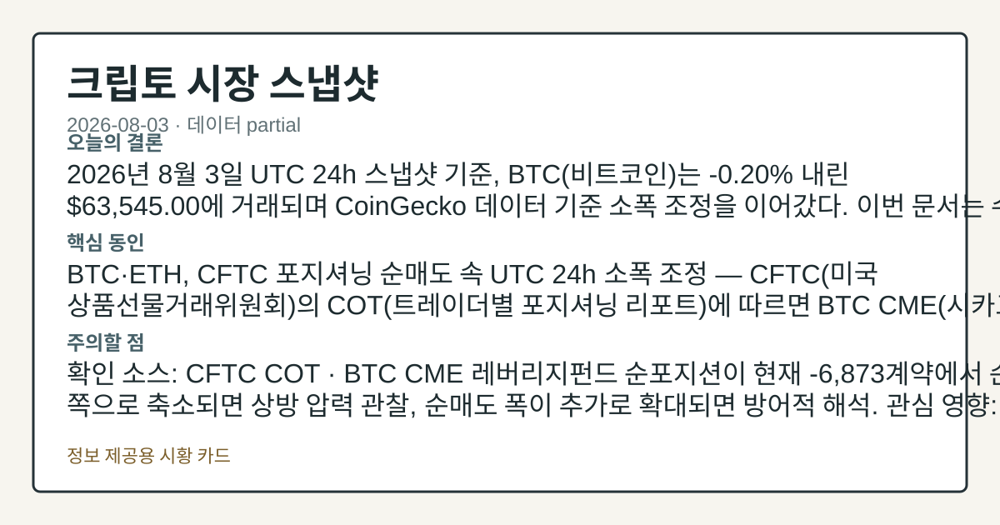
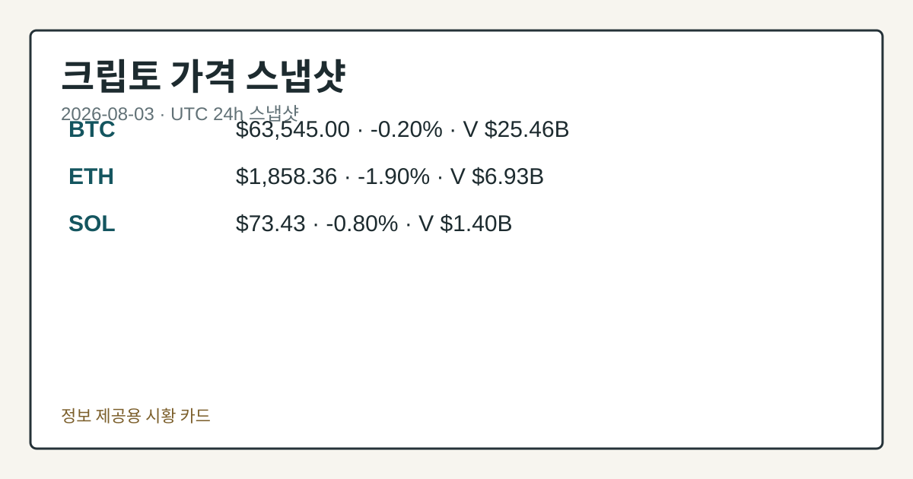
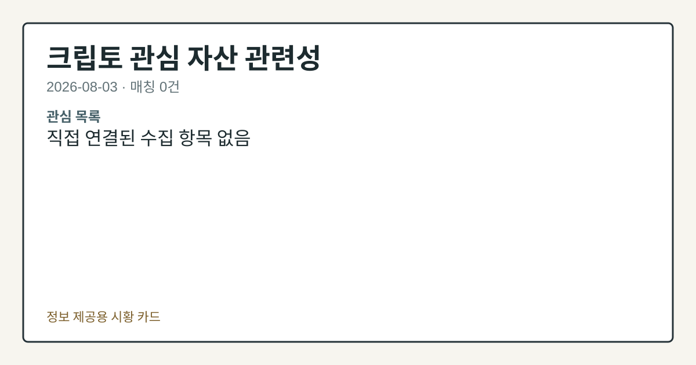

# 2026-08-03 크립토 시황
> 정보 제공용 자동 시황이며 가상자산 매매 권유가 아닙니다. 가상자산은 가격 변동성이 매우 큽니다.
# 2026-08-03 크립토 시황
**기준 시각**: 2026-08-03 UTC · 수집창 2026-08-03T00:00Z ~ 2026-08-04T00:00Z (종료 미포함)
| 종목 | 스냅샷(UTC 24h) | 구간 변동 | 비고 |
|------|------|------|------|
| BTC-USD | 63,505.74 | +0.04% | +8.45% from 52w low · -28.43% YTD |
| ETH-USD | 1,856.78 | -1.37% | +18.66% from 52w low · -38.12% YTD |
**세그먼트**: 국내 증시(미발행) | 미국 증시(미발행) | [크립토](2026-08-03.md)
<!-- investo:block visual:crypto.visual.curated-context-image -->

*이미지: 큐레이션 시황 이미지 · 출처: 외부 라이선스 이미지 · 생성: investo 0.1.0 · 2026-08-03 UTC*
<!-- /investo:block visual:crypto.visual.curated-context-image -->
> **내 관심 자산 영향**: 14건 확인 (기본 바스켓) — BTC: 직접 관련 · [cftc-cot-positioning] CFTC Bitcoin CME leveraged_money net -6873 contracts; BTC: 직접 관련 · [coingecko-global-market] Global crypto market cap **$2,260,866,516,425**; BTC dominance **56.39%**; BTC: 직접 관련 · [coingecko-price] BTC **$63,545.00** (**-0.20%**); BTC: 직접 관련 · [okx-derivatives] BTC 미결제약정 **$465,062,790** (OKX, UTC 24h); BTC: 직접 관련 · [okx-derivatives] BTC 펀딩비 0.0000571318458058 (OKX, UTC 24h) 외
> **오늘의 결론**: 2026년 8월 3일 UTC 24h 스냅샷 기준, BTC(비트코인)는 **-0.20%** 내린 **$63,545.00**에 거래되며 본문 참고.
> **핵심 동인**: BTC·ETH, CFTC 포지셔닝 순매도 속 UTC 24h 소폭 조정 — CFTC(미국 상품선물거래위원회)의 COT(트레이더별 포지셔닝 리포트)에 본문 참고.
> **주의할 점**: 본문 §②·§④ 참조
## 한눈에 보기
BTC가 UTC 24h 기준 **-0.20%** 하락한 **$63,545.00**에 거래되며 ETH(**-1.90%**) 본문 참고.
CFTC COT 리포트에서 BTC·ETH CME 선물의 레버리지펀드 순포지션이 각각 -6,873계약, -5,396계약으로 순매도 우위 확대.
공포·탐욕지수 28(Fear), UST 10Y 금리 **4.70%**로 관망 심리 짙어짐 — 본문 §④ 참조.
## ⓪ 오늘의 매크로
**미 국채 수익률** — UST curve 2026-08-03: 10Y 4.70%, 2Y10Y +0.45pp
## ⓪-A 크립토 지표 (UTC 24h 스냅샷)
| 지표 | 값 |
|------|------|
| 공포·탐욕 | 28 (Fear) |
| BTC 도미넌스 | 56.39% |
| 전체 시총 | $2.26T (-0.07% 24h) |
| BTC 펀딩비 | 0.0000571318458058 (okx) |
| BTC 미결제약정 | $465.1M (okx) |
| DeFi TVL | $74.5B |
| 스테이블코인 공급 | $307.0B |
| 24h 청산 / 거래소 순유출입 | 무료 검증 소스 미확정 |
## ⓪-B 채널 기준선
| 기준선 | 값 |
|------|------|
| 비트코인 | 63,505.74 (+0.04%) |
| 이더리움 | 1,856.78 (-1.37%) |
| BTC 도미넌스 | 56.39% |
| 공포·탐욕 | 28 |
| 펀딩/OI/청산 | 펀딩 0.0000571318458058 · OI 수집됨 |
| CFTC 코인 포지셔닝 | Bitcoin CME 순포지션 -6873계약 (-34.33% OI), 2026-07-28 기준/2026-07-31 공개 · Ether CME 순포지션 -5396계약 (-22.62% OI), 2026-07-28 기준/2026-07-31 공개 · 주간 지연 |
> **크로스마켓 연결 고리**: 금리 이벤트가 할인율/달러 경로의 공통 변수로 남아 있습니다.
## ① 요약

<!-- investo:block visual:crypto.visual.data-confidence -->

*이미지: 데이터 신뢰도 · 출처: investo 자체 생성 · 생성: investo 0.1.0 · 2026-08-03 UTC*
<!-- /investo:block visual:crypto.visual.data-confidence -->

<!-- investo:block visual:crypto.visual.market-snapshot -->

*이미지: 시장 스냅샷 · 출처: investo 자체 생성 · 생성: investo 0.1.0 · 2026-08-03 UTC*
<!-- /investo:block visual:crypto.visual.market-snapshot -->

2026년 8월 3일 UTC 24h 스냅샷 기준, BTC는 **-0.20%** 내린 **$63,545.00**에 거래되며 CoinGecko 데이터 기준 소폭 조정을 이어갔다. ETH는 **-1.90%** 하락한 **$1,858.36**, SOL은 **-0.80%** 내린 **$73.43**을 기록해 주요 자산이 동반 약세를 보였다. CFTC 최신 포지셔닝 리포트에서는 BTC·ETH CME(시카고상업거래소) 선물의 레버리지펀드 순포지션이 각각 **-6,873**계약, **-5,396**계약으로 순매도 우위를 이어갔고, 공포·탐욕지수는 28(Fear) 구간에 머물렀다. 전체 시가총액은 **$2.26T**로 24h 기준 **-0.07%** 소폭 축소됐고 BTC 도미넌스는 **56.39%**를 유지했다. [하락 관찰]

## ② 전일 핵심 이슈

### BTC·ETH, CFTC 포지셔닝 순매도 속 UTC 24h 소폭 조정

CFTC의 COT에 따르면 BTC CME 선물의 레버리지펀드 순포지션은 **-6,873**계약(전체 미결제약정의 **-34.3%**)으로 집계됐다([CFTC](https://www.cftc.gov/MarketReports/CommitmentsofTraders/index.htm)). ETH CME 선물 역시 레버리지펀드 순매도가 **-5,396**계약으로 나타나 BTC와 함께 파생시장에서 방어적 포지셔닝이 이어졌다. 같은 구간 BTC는 CoinGecko 기준 **$63,545.00**로 **-0.20%** 하락했고([CoinGecko](https://www.coingecko.com/en/coins/bitcoin)) ETH는 **-1.90%** 내린 **$1,858.36**을 기록했다. 지난 이틀간 이어졌던 반등 흐름(7/30 **+1.50%**, 7/31 시총 **+1.0%**대)에서 이탈해 관망 심리가 다시 짙어진 하루였다.

> **그래서 의미는?** 선물시장 큰손 투자자들의 매도 우위가 이어지며 현물 가격도 함께 눌리는 모습입니다.

## ③ 섹터/수급 동향

### DEX(탈중앙화 거래소) 거래 비중 사상 최고, CEX(중앙화 거래소) 물량은 위축

The Block 보도에 따르면 DEX가 현물 거래대금의 24%를 차지하며 사상 최고 비중을 기록했고, 전체 현물 거래대금은 연중 고점 **$2.23** trillion 대비 크게 낮아진 **$670** million 수준으로 12개월 최저치를 향하고 있다([The Block](https://www.theblock.co/post/410476/dexs-capture-record-spot-crypto-trading-as-cex-volumes-sink)). 예측시장인 Kalshi와 Polymarket의 7월 합산 거래량도 **$50** billion을 넘어서며 사상 최고치를 기록했다([The Block](https://www.theblock.co/post/410382/kalshi-polymarket-volume-july)).

> **그래서 의미는?** 거래 인프라의 무게중심이 탈중앙화 채널과 예측시장 쪽으로 옮겨가는 흐름을 보여줍니다.

### 스테이블코인·기관 인프라 확장

BlackRock은 스테이블코인 준비자산용 토큰화 MMF(머니마켓펀드) 2종을 출시하며 Morgan Stanley, State Street, Fidelity 등이 이미 내놓은 유사 상품 대열에 합류했다([The Block](https://www.theblock.co/post/410469/blackrock-launches-two-tokenized-money-market-funds-stablecoin-reserves)). American Bitcoin은 준비금을 8,002 BTC로 늘렸다.

### 규제 동향: Clarity Act 논의

Blockchain Association은 National Sheriffs' Association의 주장에 반박하며 관련 입법이 법 집행을 지원할 것이라고 밝혔고([The Block](https://www.theblock.co/post/410507/blockchain-association-counters-sheriffs-associations-claims-pivotal-week-clarity-act)), Bernstein은 Clarity Act가 올해 통과되지 못할 경우 SEC·CFTC의 자체 규정 제정이 오히려 가속화될 수 있다고 평가했다([The Block](https://www.theblock.co/post/410395/bernstein-says-clarity-act-failure-could-accelerate-sec-cftc-crypto-rulemaking)).

## ④ 지표·이벤트

UST(미국 국채) 10Y 금리는 **4.70%**, 2Y10Y 스프레드는 **+0.45pp**로 집계됐다([Treasury](https://home.treasury.gov/resource-center/data-chart-center/interest-rates)). 공포·탐욕지수는 28([alternative.me](https://alternative.me/crypto/fear-and-greed-index/)), DeFi(탈중앙화 금융) TVL(총예치자산)은 **$74.5B**로 Ethereum이 최대 비중을 차지했고([DefiLlama](https://defillama.com/)), 스테이블코인 총 공급은 **$307.0B**로 USDT가 선두다. BTC 펀딩비는 0.0000571318458058, 미결제약정은 **$465,062,790**으로 나타났다([OKX](https://www.okx.com/trade-swap/btc-usd-swap)). 24h 정리 규모와 거래소 순유출입은 데이터 미수집이다.

> **그래서 의미는?** 파생·유동성 지표는 안정적이지만 국채금리 상승과 공포 심리가 위험자산 전반에 부담 요인으로 작용할 수 있습니다.

## ⑤ 주요 종목
<!-- investo:block chart:crypto.chart.market -->

<!-- u50 lightweight-charts-embed: placeholders consumed by site_docs/assets/investo-chart-init.js -->

<noscript><em>인터랙티브 차트는 JavaScript가 활성화된 환경에서 표시됩니다. 위 정적 카드가 동일한 정보를 담고 있습니다.</em></noscript>

<!-- /investo:block chart:crypto.chart.market -->

<!-- investo:block visual:crypto.visual.price-snapshot -->

*이미지: 가격 스냅샷 · 출처: investo 자체 생성 · 생성: investo 0.1.0 · 2026-08-03 UTC*
<!-- /investo:block visual:crypto.visual.price-snapshot -->

### 가격 동향

BTC **$63,545.00**(**-0.20%**), ETH **$1,858.36**(**-1.90%**), SOL **$73.43**(**-0.80%**)로 3개 자산 모두 UTC 24h 기준 하락했다([CoinGecko BTC](https://www.coingecko.com/en/coins/bitcoin), [ETH](https://www.coingecko.com/en/coins/ethereum), [SOL](https://www.coingecko.com/en/coins/solana)).

> **그래서 의미는?** BTC·ETH(이더리움)·SOL 등 주요 자산이 동반 조정을 보이며 단기 매도 우위를 시사합니다.

### 기업 보유·투자 동향

American Bitcoin은 준비금이 8,002 BTC로 늘었고 2분기 채굴량이 932 BTC로 사상 최대, 매출은 8% 증가한 **$67** million을 기록했다([The Block](https://www.theblock.co/post/410426/eric-trumps-american-bitcoin-treasury-tops-8000-btc-as-q2-mining-production-hits-record)). Strategy(마이클 세일러)는 1,638 BTC를 **$104.7** million에 매도해 보유량이 842,138 BTC로 줄었다고 공시했다([The Block](https://www.theblock.co/post/410414/michael-saylors-strategy-sells-another-1638-btc-for-105-million-reducing-total-holdings-to-842138-btc)); 세일러 본인은 개인 보유 비트코인을 매도한 적이 없다고 밝혔다([The Block](https://www.theblock.co/post/410451/michael-saylor-says-never-sold-his-personal-bitcoin-strategy-dumps-more-btc)). Bitmine(톰 리)은 ETH 보유량을 5.8 million ETH로 늘렸으며 10,399 ETH를 추가 매입했다고 밝혔다([The Block](https://www.theblock.co/post/410441/tom-lee-says-ether-outperformed-nasdaq-100-july-bitmine-adds-10399-eth)).

### 인프라 투자

Ripple은 ZILO, Licuido에 투자해 토큰화 자본시장 인프라 확대를 추진한다고 밝혔다([The Block](https://www.theblock.co/post/410397/ripple-invests-zilo-licuido)).

## ⑥ 오늘의 관전 포인트

<!-- investo:block visual:crypto.visual.watchlist-relevance -->

*이미지: 관심 자산 관련성 · 출처: investo 자체 생성 · 생성: investo 0.1.0 · 2026-08-03 UTC*
<!-- /investo:block visual:crypto.visual.watchlist-relevance -->

#### 관찰 신호: BTC CME 레버리지펀드 순포지션

- 출처: CFTC COT
- 현재: CFTC COT · BTC CME 레버리지펀드 순포지션이 현재 -6,873계약에서 순매수 쪽으로 축소되면 상방 압력 관찰, 순매도 폭이 추가로 확대되면 방어적 해석. 관심 영향: 파생시장 수급 흐름 점검.
- 확인 조건: 상방 BTC CME 레버리지펀드 순포지션이 현재 -6,873계약에서 순매수 쪽으로 축소되면 상방 압력 관찰; 하방 순매도 폭이 추가로 확대되면 방어적 해석
- 신뢰도: 보통
- 관심 영향: 파생시장 수급 흐름 점검.

#### 관찰 신호: alternative.me 공포·탐욕지수

- 출처: alternative.me 공포
- 현재: 탐욕지수
- 확인 조건: 상방 현재 28에서 반등하면 투자심리 회복 관찰; 하방 추가로 낮아지면 방어적 해석
- 신뢰도: 보통
- 관심 영향: 단기 변동성 흐름 점검.

#### 관찰 신호: 현재 **$307.0B**에서 증가세

- 출처: DefiLlama 스테이블코인 공급
- 현재: DefiLlama 스테이블코인 공급 · 현재 **$307.0B**에서 증가세가 이어지면 온체인 유동성 확대 관찰, 감소 전환 시 자금 이탈 신호로 해석. 관심 영향: DeFi TVL 방향성 점검.
- 확인 조건: 상방 현재 **$307.0B**에서 증가세가 이어지면 온체인 유동성 확대 관찰; 하방 감소 전환 시 자금 이탈 신호로 해석
- 신뢰도: 높음
- 관심 영향: DeFi TVL 방향성 점검.

> **데이터 상태**: 부분 · 이번 문서는 수집 근거가 제한적입니다. · 수집 상세는 진단 섹션에서 확인할 수 있습니다.

수집/품질 진단

> **데이터 상태**: 부분 — 수집 31건 / 소스 8개 / 누락: 없음 · 부분 — 일부 카테고리 미수집, 본문 일부 결론 보강 필요
> **소스 카운트**: 수집 대상 13 / 성공 9 / 0건 2 / 실패 2 / 본문 사용 9
> **소스 등급 분포**: S=2 / A=2 / B=5
> **상세 사유**: 일부 소스 수집 실패, 일부 소스 0건 반환
> **소스별 상태**: binance-crypto-market 실패 (접근 제한), congress-gov-bill-actions 실패 (설정 미완료(미수집)), senate-banking-policy 0건, house-financial-services-policy 0건, 정상 9개

## ⑦ 면책조항
본 시황은 일반 정보 제공을 목적으로 자동 생성된 자료이며,
특정 가상자산에 대한 매매 권유나 투자 자문이 아닙니다.
가상자산은 가상자산이용자보호법(2024-07-19 시행) §10·§19의 적용 대상으로,
24시간 거래되는 비제도권 자산이며 가격 변동성이 매우 크고 원금 전액 손실이 가능합니다.
투자 결정과 그 결과에 대한 책임은 전적으로 본인에게 있으며,
본 시황의 내용에 따라 발생한 손실에 대해 작성자는 일체의 책임을 지지 않습니다.