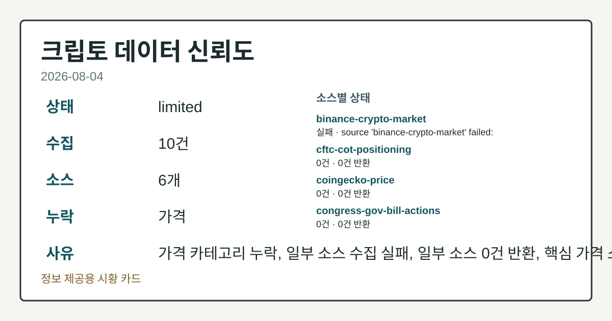
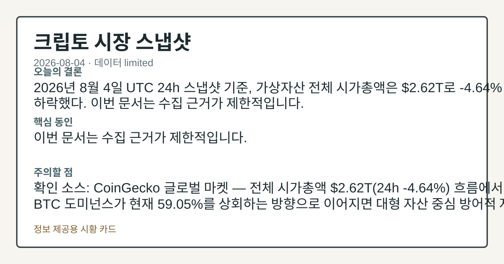
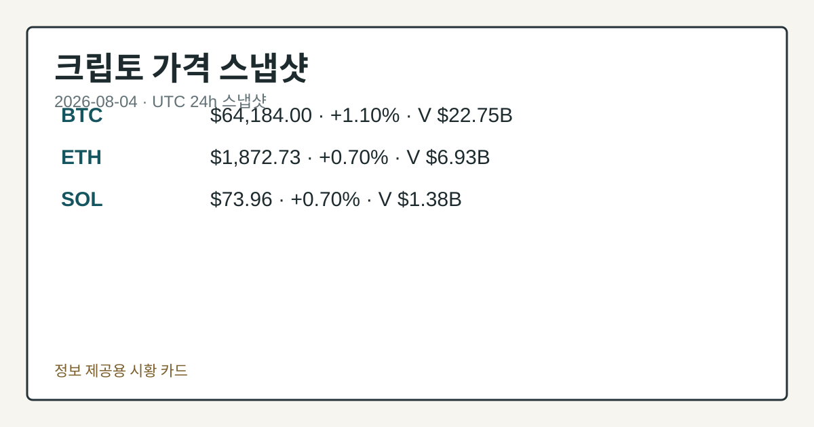
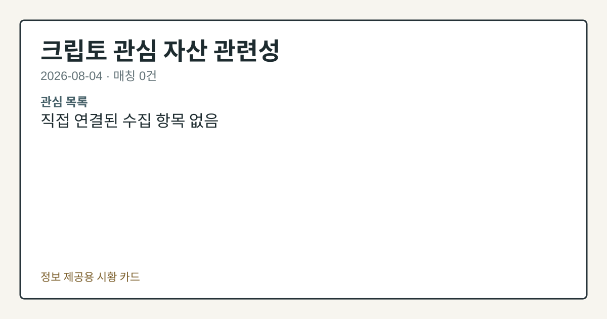

# 2026-08-04 크립토 시황
> 정보 제공용 자동 시황이며 가상자산 매매 권유가 아닙니다. 가상자산은 가격 변동성이 매우 큽니다.
# 2026-08-04 크립토 시황
**기준 시각**: 2026-08-04 UTC · 수집창 2026-08-04T00:00Z ~ 2026-08-05T00:00Z (종료 미포함)
| 종목 | 스냅샷(UTC 24h) | 구간 변동 | 비고 |
|------|------|------|------|
| BTC-USD | 64,297.59 | +1.32% | +9.80% from 52w low · -27.54% YTD |
| ETH-USD | 1,874.92 | +0.90% | +19.82% from 52w low · -37.51% YTD |
**세그먼트**: 국내 증시(미발행) | [미국 증시](../../../us-equity/2026/08/2026-08-04.md) | [크립토](2026-08-04.md)
<!-- investo:block visual:crypto.visual.curated-context-image -->

*이미지: 큐레이션 시황 이미지 · 출처: 외부 라이선스 이미지 · 생성: investo 0.1.0 · 2026-08-04 UTC*
<!-- /investo:block visual:crypto.visual.curated-context-image -->
> **내 관심 자산 영향**: 17건 확인 (기본 바스켓) — BTC: 직접 관련 · [cftc-cot-positioning] CFTC Bitcoin CME leveraged_money net -6873 contracts; BTC: 직접 관련 · [coingecko-global-market] Global crypto market cap **$2,276,931,020,082**; BTC dominance **56.58%**; BTC: 직접 관련 · [coingecko-price] BTC **$64,184.00** (**+1.10%**); BTC: 직접 관련 · [okx-derivatives] BTC 미결제약정 **$450,771,530** (OKX, UTC 24h); BTC: 직접 관련 · [okx-derivatives] BTC 펀딩비 -0.0000124966169559 (OKX, UTC 24h) 외
> **용어 가이드**: 이번 시황에서 처음 등장한 용어 — 스테이킹(예치보상), 시가총액(시장가치)
> **오늘의 결론**: 2026년 8월 4일 UTC 24h 스냅샷 기준, BTC(비트코인)는 **$64,184.00**(**+1.10%**), ETH(이더리움)는 본문 참고.
> **핵심 동인**: BTC 하드웨어 지갑 익스플로잇, 거래소 유입 급증과 정책 이슈 겹쳐 — OKX는 Coldcard 익스플로잇을 계기로 중앙화 거래소로의 유입이 본문 참고.
> **주의할 점**: 본문 §②·§④ 참조
## 한눈에 보기
BTC·ETH·SOL 등 주요 코인이 UTC 24h 기준 **+0.70%**~**+1.10%** 동반 상승했고, 전체 시가총액은 본문 참고.
**BTC** 하드웨어 지갑 Coldcard 익스플로잇발 거래소 유입이 '기록적' 수준으로 급증했고, Galaxy Research는 손실 규모가 본문 참고.
BTC CME 레버리지드머니 순매도(-6,873계약)와 **4.63%** 10Y 국채금리가 위험선호 압력 변수로 남아있다 — 본문 §③·§④ 참조.
## ⓪ 오늘의 매크로
**미 국채 수익률** — UST curve 2026-08-04: 10Y 4.63%, 2Y10Y +0.43pp
## ⓪-A 크립토 지표 (UTC 24h 스냅샷)
| 지표 | 값 |
|------|------|
| 공포·탐욕 | 25 (Extreme Fear) |
| BTC 도미넌스 | 56.58% |
| 전체 시총 | $2.28T (+0.80% 24h) |
| BTC 펀딩비 | -0.0000124966169559 (okx) |
| BTC 미결제약정 | $450.8M (okx) |
| DeFi TVL | $75.1B |
| 스테이블코인 공급 | $307.2B |
| 24h 청산 / 거래소 순유출입 | 무료 검증 소스 미확정 |
## ⓪-B 채널 기준선
| 기준선 | 값 |
|------|------|
| 비트코인 | 64,297.59 (+1.32%) |
| 이더리움 | 1,874.92 (+0.90%) |
| BTC 도미넌스 | 56.58% |
| 공포·탐욕 | 25 |
| 펀딩/OI/청산 | 펀딩 -0.0000124966169559 · OI 수집됨 |
| CFTC 코인 포지셔닝 | Bitcoin CME 순포지션 -6873계약 (-34.33% OI), 2026-07-28 기준/2026-07-31 공개 · Ether CME 순포지션 -5396계약 (-22.62% OI), 2026-07-28 기준/2026-07-31 공개 · 주간 지연 |
> **크로스마켓 연결 고리**: 금리 이벤트가 할인율/달러 경로의 공통 변수로 남아 있습니다.
> **오늘의 큰 그림:** 금리와 달러 변수가 공통 변수지만, BTC·ETH 유동성를 먼저 확인해야 합니다.
## ① 요약

<!-- investo:block visual:crypto.visual.data-confidence -->

*이미지: 데이터 신뢰도 · 출처: investo 자체 생성 · 생성: investo 0.1.0 · 2026-08-04 UTC*
<!-- /investo:block visual:crypto.visual.data-confidence -->

<!-- investo:block visual:crypto.visual.market-snapshot -->

*이미지: 시장 스냅샷 · 출처: investo 자체 생성 · 생성: investo 0.1.0 · 2026-08-04 UTC*
<!-- /investo:block visual:crypto.visual.market-snapshot -->

2026년 8월 4일 UTC 24h 스냅샷 기준, BTC는 **$64,184.00**(**+1.10%**), ETH는 **$1,872.73**(**+0.70%**), SOL은 **$73.96**(**+0.70%**)로 주요 코인이 동반 상승했다. 전체 가상자산 시가총액은 **$2,276,931,020,082**(약 **$2.28T**, **+0.80%** 24h)로 확대됐고 BTC 도미넌스는 **56.58%**를 유지했다. 다만 공포·탐욕 지수는 25(Extreme Fear, 극단적 공포)에 머물러 가격 상승과 투자 심리가 엇갈리는 모습이다. 어제(2026-08-03) BTC가 CFTC 포지셔닝 순매도 속 소폭 조정(**-0.20%**)을 기록했던 흐름에서 이탈해 오늘은 반등세로 전환됐다. [상승 관찰]

## ② 전일 핵심 이슈

### BTC 하드웨어 지갑 익스플로잇, 거래소 유입 급증과 정책 이슈 겹쳐

[OKX는 Coldcard 익스플로잇을 계기로 중앙화 거래소로의 유입이 '기록적' 수준으로 급증했다고 밝혔다](https://www.theblock.co/post/410515/okx-says-coldcard-exploit-record-inflows-centralized-exchanges). 같은 사안과 관련해 [Galaxy Research는 아직 미확인된 4차 공격 파도까지 포함할 경우 손실 규모가 **$130M**까지 늘어날 수 있다고 추정했다](https://www.theblock.co/post/410533/coldcard-hack-130-million-galaxy-research). OKX는 올해 상반기 중 의심 거래를 차단해 **$26.3** million 규모의 스캠 관련 손실을 막았다고 밝혔다. 어제 CFTC 포지셔닝 순매도 속 소폭 조정 흐름에서 이탈해, 오늘은 하드웨어 지갑 보안 이슈가 자금 이동을 자극하는 국면으로 전환됐다.

> **그래서 의미는?** 해킹발 자금 이동과 정책 이슈가 겹치며 단기 심리에 영향을 줄 수 있어 확인이 필요합니다.

<!-- investo:block visual:crypto.visual.image-source-card -->
> **📷 오늘의 시장 이미지(원문)**
> OKX says Coldcard exploit triggers ‘record’ inflows to centralized exchanges — theblock-crypto · [원문 보기](https://www.theblock.co/post/410515/okx-says-coldcard-exploit-record-inflows-centralized-exchanges)
<!-- /investo:block visual:crypto.visual.image-source-card -->

### 정책·규제 트랙: Clarity Act·SEC(증권거래위원회) 이슈 부각

[상원 의원과 부족 게이밍 규제 당국은 예측시장 조항을 Clarity Act에 포함시키려는 움직임을 이어가고 있다](https://www.theblock.co/post/410668/tribal-gaming-regulators-senators-make-renewed-push-add-prediction-markets-provision-clarity-act). 이더리움 연구자들은 스테이킹 비율이 50%에 근접할수록 밸리데이터 보상을 점진적으로 소각하는 EIP(이더리움 개선안)-8361을 제안했다(https://www.theblock.co/post/410643/ethereum-researchers-propose-burning-validator-rewards-cap-staking-50). 워런·블루먼솔 상원의원은 [트럼프 대통령의 밈코인에 대한 SEC(증권거래위원회) 조사를 요구했다](https://www.theblock.co/post/410624/senators-seek-sec-probe-president-trump-memecoin-crypto-bill-enters-pivotal-week).

## ③ 섹터/수급 동향

### DeFi(탈중앙화 금융)·스테이블코인 자금 규모는 유지, 파생 포지셔닝은 순매도

[DeFi TVL(총예치자산)은 **$75.1B**로 이더리움이 **$41.1B**로 선두를 유지](https://defillama.com/)했고, BSC **$4.9B**, Tron **$4.9B**, Solana **$4.8B**, Base **$4.6B** 순이다. [스테이블코인 공급은 **$307.2B**로 USDT가 **$183.1B**로 가장 크고](https://defillama.com/), USDC **$72.4B**, USDS **$6.7B**, DAI **$4.8B**, USD1 **$4.0B**가 뒤를 잇는다. 반면 파생 포지셔닝은 순매도 우위다 — [CFTC(미국 상품선물거래위원회) 코미트먼트 오브 트레이더스 보고서에 따르면 BTC CME(시카고상업거래소) 레버리지드머니는 롱 3,295·숏 10,168로 순매도 -6,873계약(미결제약정의 **-34.3%**)](https://www.cftc.gov/MarketReports/CommitmentsofTraders/index.htm), [ETH CME 레버리지드머니 역시 롱 1,828·숏 7,224로 순매도 -5,396계약(**-22.6%**)](https://www.cftc.gov/MarketReports/CommitmentsofTraders/index.htm)을 기록했다(주간 보고서, 인트라데이 흐름 아님).

> **그래서 의미는?** 파생 포지셔닝은 순매도 우위지만 스테이블코인·DeFi 자금 규모는 유지돼 자금 흐름을 점검할 필요가 있습니다.

### 인프라·기관 참여 확대

[Cloudflare는 AI 에이전트가 API·콘텐츠 결제에 쓸 수 있는 스테이블코인 지갑 롤아웃을 시작했다](https://www.theblock.co/post/410629/cloudflare-kicks-off-stablecoin-wallet-rollout-ai-agents-pay-apis-online-content). [BlackRock은 JPMorgan의 Kinexys를 활용해 **$311** billion 규모의 유럽 머니마켓펀드 일부에 이더리움 기반 토큰화 주식클래스를 출시했다](https://www.theblock.co/post/410554/blackrock-debuts-tokenized-share-classes-for-select-european-money-market-funds-with-311-billion-in-assets). [Dinari는 USDC를 활용해 셀프커스터디 지갑용 토큰화 S&P 500 주식을 출시했다](https://www.theblock.co/post/410588/dinari-tokenized-sp-500-stocks-self-custody-wallets-using-usdc). [BitGo는 WBTC(랩드비트코인) **$7.4** billion을 Chainlink CCIP(체인링크 크로스체인 상호운용성 프로토콜)로 이전해 LayerZero 이탈 총액이 **$15** billion에 근접했다](https://www.theblock.co/post/410594/bitgo-moves-7-4-billion-wrapped-bitcoins-to-chainlink-ccip-in-latest-layerzero-exodus).

## ④ 지표·이벤트

### 매크로·심리 지표 동시 확인

[전체 가상자산 시가총액은 **$2,276,931,020,082**, BTC 도미넌스 **56.58%**](https://www.coingecko.com/en/global-charts)를 기록했다. [미국 국채 금리(UST)는 10Y **4.63%**, 2Y10Y **+0.43pp**](https://home.treasury.gov/resource-center/data-chart-center/interest-rates)이며, 3M **3.89%**, 2Y **4.20%**, 30Y **5.18%**, 3M10Y **+0.74pp**를 나타냈다. [공포·탐욕 지수는 25](https://alternative.me/crypto/fear-and-greed-index/)로 극단적 공포 구간에 머물렀다. [BTC 미결제약정(OI)은 **$450.8M**(OKX), BTC 펀딩비는 -0.0000124966169559](https://www.okx.com/trade-swap/btc-usd-swap)로 소폭 마이너스를 유지했다.

> **그래서 의미는?** 금리·펀딩비·심리지표가 동시에 부담 신호를 보내고 있어 변동성 확대 가능성을 점검합니다.

## ⑤ 주요 종목
<!-- investo:block chart:crypto.chart.market -->

<!-- u50 lightweight-charts-embed: placeholders consumed by site_docs/assets/investo-chart-init.js -->

<noscript><em>인터랙티브 차트는 JavaScript가 활성화된 환경에서 표시됩니다. 위 정적 카드가 동일한 정보를 담고 있습니다.</em></noscript>

<!-- /investo:block chart:crypto.chart.market -->

<!-- investo:block visual:crypto.visual.price-snapshot -->

*이미지: 가격 스냅샷 · 출처: investo 자체 생성 · 생성: investo 0.1.0 · 2026-08-04 UTC*
<!-- /investo:block visual:crypto.visual.price-snapshot -->

### 가격 스냅샷

[BTC는 **$64,184.00**(**+1.10%**)](https://www.coingecko.com/en/coins/bitcoin), 24h 거래량 **$22,751,912,560**, 시가총액 **$1,287,957,575,589**, 고가 **$64,347.00**·저가 **$63,295.00**을 기록했다. [ETH는 **$1,872.73**(**+0.70%**)](https://www.coingecko.com/en/coins/ethereum), 24h 거래량 **$6,934,919,270**, 시가총액 **$226,023,526,387**, 고가 **$1,878.93**·저가 **$1,847.64**다. [SOL은 **$73.96**(**+0.70%**)](https://www.coingecko.com/en/coins/solana), 24h 거래량 **$1,382,025,320**, 시가총액 **$42,994,188,061**, 고가 **$74.35**·저가 **$73.00**이다.

> **그래서 의미는?** BTC·ETH·SOL 모두 상승세지만 관련 상장사 주가는 엇갈려 개별 흐름을 확인할 필요가 있습니다.

### 관련 상장사 확인 항목

[BlackRock의 스팟 이더리움 ETF(상장지수펀드) ETHA는 10월 1대3 역병합을 진행](https://www.theblock.co/post/410663/blackrocks-spot-ethereum-etfs-to-undergo-1-for-3-reverse-share-split-in-october)해 순자산가치를 높일 예정이다. [Robinhood와 Coinbase는 시장 전반의 거래 위축 속에서도 한쪽이 이를 상쇄했다고 보도됐다](https://www.theblock.co/post/410478/robinhood-shrugs-off-crypto-slump-coinbase-activity-remains-tied-trading-cycle). [Hut 8은 2분기 매출이 예상치를 소폭 밑돌며 주가가 하락했고, CEO는 향후 비트코인 익스포저가 American Bitcoin 자회사를 통해 이뤄질 것이라고 밝혔다](https://www.theblock.co/post/410581/hut-8-shares-slip-mild-q2-revenue-miss-ai-data-center-pipeline-grows). [Cathie Wood의 Ark Invest는 Coinbase·Circle 주식을 약 **$10** million 규모로 매입했다](https://www.theblock.co/post/410558/cathie-woods-ark-invest-snaps-up-nearly-10-million-in-coinbase-and-circle-stock). [Bitdeer는 노르웨이 Volta와 **$4.7** billion 규모 AI 데이터센터 임대 조건을 공개한 뒤 주가가 등락했다](https://www.theblock.co/post/410578/bitdeer-stock-pops-drops-4-7-billion-ai-data-center-lease-norway).

## ⑥ 오늘의 관전 포인트

<!-- investo:block visual:crypto.visual.watchlist-relevance -->

*이미지: 관심 자산 관련성 · 출처: investo 자체 생성 · 생성: investo 0.1.0 · 2026-08-04 UTC*
<!-- /investo:block visual:crypto.visual.watchlist-relevance -->

#### 관찰 신호: 10Y 금리

- 출처: 미국 재무부 국채 금리 데이터
- 현재: 미국 재무부 국채 금리 데이터 · 10Y 금리가 **4.70%**를 상회하면 위험자산 압박 확대로 해석하고, **4.60%**를 하회하면 압박 완화로 해석한다. 관심 영향: 크립토 위험선호 흐름 점검.
- 확인 조건: 상방 10Y 금리가 **4.70%**를 상회하면 위험자산 압박 확대로 해석하고; 하방 **4.60%**를 하회하면 압박 완화로 해석한다
- 신뢰도: 높음
- 관심 영향: 크립토 위험선호 흐름 점검.

#### 관찰 신호: alternative.me 공포·탐욕 지수

- 출처: alternative.me 공포
- 현재: 탐욕 지수
- 확인 조건: 상방 지수가 30을 상회하면 심리 개선으로 해석하고; 하방 20을 하회하면 극단적 공포 심화로 해석한다
- 신뢰도: 보통
- 관심 영향: 단기 변동성 구간 점검.

> **데이터 상태**: 부분 · 이번 문서는 수집 근거가 제한적입니다. · 수집 상세는 진단 섹션에서 확인할 수 있습니다.

수집/품질 진단

> **데이터 상태**: 부분 — 수집 33건 / 소스 8개 / 누락: 없음 · 부분 — 일부 카테고리 미수집, 본문 일부 결론 보강 필요
> **소스 카운트**: 수집 대상 13 / 성공 9 / 0건 2 / 실패 2 / 본문 사용 9
> **소스 등급 분포**: S=2 / A=2 / B=5
> **상세 사유**: 일부 소스 수집 실패, 일부 소스 0건 반환
> **소스별 상태**: binance-crypto-market 실패 (접근 제한), congress-gov-bill-actions 실패 (설정 미완료(미수집)), senate-banking-policy 0건, house-financial-services-policy 0건, 정상 9개

## ⑦ 면책조항
본 시황은 일반 정보 제공을 목적으로 자동 생성된 자료이며,
특정 가상자산에 대한 매매 권유나 투자 자문이 아닙니다.
가상자산은 가상자산이용자보호법(2024-07-19 시행) §10·§19의 적용 대상으로,
24시간 거래되는 비제도권 자산이며 가격 변동성이 매우 크고 원금 전액 손실이 가능합니다.
투자 결정과 그 결과에 대한 책임은 전적으로 본인에게 있으며,
본 시황의 내용에 따라 발생한 손실에 대해 작성자는 일체의 책임을 지지 않습니다.