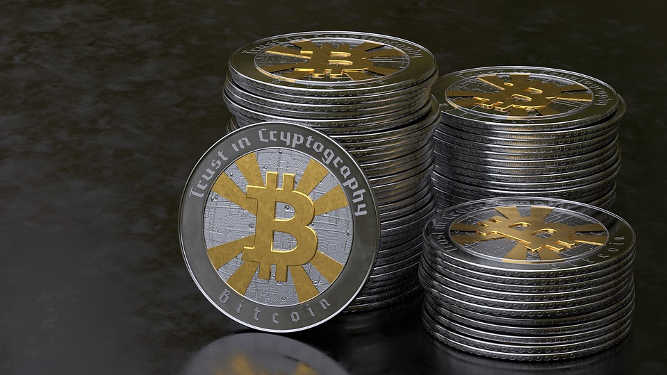

# 2026-09-17 크립토 시황

> 정보 제공용 자동 시황이며 가상자산 매매 권유가 아닙니다. 가상자산은 가격 변동성이 매우 큽니다.

# 2026-09-17 크립토 시황

**기준 시각**: 2026-09-17 UTC · 수집창 2026-09-17T00:00Z ~ 2026-09-18T00:00Z (종료 미포함)

| 종목 | 스냅샷(UTC 24h) | 구간 변동 | 비고 |
|------|------|------|------|
| BTC-USD | 76,337.74 | +0.25% | -21.24% from 52w high · -13.97% YTD |
| ETH-USD | 2,445.11 | +1.20% | -27.11% from 52w high · -18.51% YTD |

**세그먼트**: [국내 증시](../../../domestic-equity/2026/09/2026-09-17.md) | [미국 증시](../../../us-equity/2026/09/2026-09-17.md) | [크립토](2026-09-17.md)

<!-- investo:block visual:crypto.visual.curated-context-image -->

*이미지: 큐레이션 시황 이미지 · 출처: 외부 라이선스 이미지 · 생성: investo 0.1.0 · 2026-09-18 UTC*
<!-- /investo:block visual:crypto.visual.curated-context-image -->

> **내 관심 자산 영향**: 14건 확인 (기본 바스켓) — BTC: 직접 관련 · [cftc-cot-positioning] CFTC Bitcoin CME leveraged_money net -7892 contracts; BTC: 직접 관련 · [coingecko-global-market] Global crypto market cap **$2,636,289,877,602**; BTC dominance **58.10%**; BTC: 직접 관련 · [coingecko-price] BTC **$76,407.00** (**+0.33%**); BTC: 직접 관련 · [okx-derivatives] BTC 미결제약정 **$503,518,070** (OKX, UTC 24h); BTC: 직접 관련 · [okx-derivatives] BTC 펀딩비 0.0000683914186336 (OKX, UTC 24h) 외
> **용어 가이드**: 이번 시황에서 처음 등장한 용어 — 시가총액(시장가치)
> **오늘의 결론**: 확인된 요약이 부족합니다.
> **핵심 동인**: 핵심 동인은 추가 확인이 필요합니다.
> **주의할 점**: 본문 §②·§④ 참조

## 한눈에 보기

요약은 본문을 참고하세요.
**BTC** CME 파생포지션이 CFTC 기준 순매도 -7,892계약으로 집계됐다.
10Y 금리 **4.94%**와 BTC 펀딩비 0.0000683914186336 — 본문 §④ 참조.

## ⓪ 오늘의 매크로

**FOMC 일정** — 2026-10-07 — FOMC Minutes
**미 국채 수익률** — UST curve 2026-09-17: 10Y **4.94%**, 2Y10Y **+0.27pp**

## ⓪-A 크립토 지표 (UTC 24h 스냅샷)

| 지표 | 값 |
|------|------|
| 공포·탐욕 | 56 (Greed) |
| BTC 도미넌스 | 58.10% |
| 전체 시총 | $2.64T (-1.11% 24h) |
| BTC 펀딩비 | 0.0000683914186336 (okx) |
| BTC 미결제약정 | $503.5M (okx) |
| DeFi TVL | $88.5B |
| 스테이블코인 공급 | $312.2B |
| 24h 청산 / 거래소 순유출입 | 무료 검증 소스 미확정 |

## ⓪-B 채널 기준선

| 기준선 | 값 |
|------|------|
| 비트코인 | 76,337.74 (+0.25%) |
| 이더리움 | 2,445.11 (+1.20%) |
| BTC 도미넌스 | 58.10% |
| 공포·탐욕 | 56 |
| 펀딩/OI/청산 | 펀딩 0.0000683914186336 · OI 수집됨 |
| CFTC 코인 포지셔닝 | Bitcoin CME 순포지션 -7892계약 (-37.43% OI), 2026-09-08 기준/2026-09-11 공개 · Ether CME 순포지션 -7286계약 (-27.43% OI), 2026-09-08 기준/2026-09-11 공개 · 주간 지연 |

> **크로스마켓 연결 고리**: 금리 이벤트가 할인율/달러 경로의 공통 변수로 남아 있습니다.

> **오늘의 큰 그림:** 이 세그먼트의 공통 신호는 제한적입니다. 본문 수급·지표 항목을 먼저 확인하세요.

## ① 요약

<!-- investo:block visual:crypto.visual.data-confidence -->

*이미지: 데이터 신뢰도 · 출처: investo 자체 생성 · 생성: investo 0.1.0 · 2026-09-18 UTC*
<!-- /investo:block visual:crypto.visual.data-confidence -->

<!-- investo:block visual:crypto.visual.market-snapshot -->

*이미지: 시장 스냅샷 · 출처: investo 자체 생성 · 생성: investo 0.1.0 · 2026-09-18 UTC*
<!-- /investo:block visual:crypto.visual.market-snapshot -->

BTC이 UTC 24h 기준 **$76,407.00**(**+0.33%**)로 **$75,972.00**~**$77,024.00** 구간에서 움직였고, ETH는 **$2,447.05**(**+1.28%**), SOL은 **$101.61**(**+3.07%**)로 주요 자산이 동반 상승했다. 반면 전체 시가총액은 **$2,636,289,877,602**로 24시간 기준 **-1.11%** 하락했고, BTC 도미넌스는 **58.10%**를 기록했다. CFTC(상품선물거래위원회) COT(투자자별 포지션 보고서) 기준 BTC CME(시카고상업거래소) 레버리지드머니 순포지션은 -7,892계약으로 순매도 우위를 유지했고, 크립토 공포·탐욕지수는 56(Greed)이다. 가격은 상승했지만 파생 포지셔닝과 전체 시총 흐름은 엇갈린 신호를 보이고 있다. [혼재]

## ② 전일 핵심 이슈

### BTC 파생 포지셔닝과 JPMorgan 코멘트

CFTC COT 데이터에 따르면 BTC CME 레버리지드머니 포지션은 롱 5,146계약, 숏 13,038계약으로 순매도 -7,892계약을 기록했다 ([cftc.gov](https://www.cftc.gov/MarketReports/CommitmentsofTraders/index.htm)). 이는 주간 단위 집계로 즉각적인 인트라데이 흐름을 반영하지는 않는다. 이런 가운데 JPMorgan은 ETF(상장지수펀드) 헤지 수요가 완화되면 비트코인이 금보다 더 큰 지지를 받을 수 있다고 진단했다 ([The Block](https://www.theblock.co/news/markets/2026-09-17-jpmorgan-bitcoin-gold-415421)).

> **그래서 의미는?** 파생시장 숏 쏠림과 ETF 헤지 완화 기대가 동시에 나타나는 구간으로 봅니다.

<!-- investo:block visual:crypto.visual.image-source-card -->
> **📷 오늘의 시장 이미지(원문)**
> JPMorgan says bitcoin could get more support than gold if ETF hedging eases — theblock-crypto · [원문 보기](https://www.theblock.co/news/markets/2026-09-17-jpmorgan-bitcoin-gold-415421)
<!-- /investo:block visual:crypto.visual.image-source-card -->

### 규제 트랙: SEC 혁신 면제·CFTC 노액션·Clarity Act

SEC(증권거래위원회)는 상원의 크립토 입법 부진에 대응해 '혁신 면제(innovation exemption)'를 공개했고 ([The Block](https://www.theblock.co/news/regulation/2026-09-17-sec-releases-innovation-exemption-415324)), CFTC도 개발자 친화적 노액션 방침을 SEC 뒤이어 내놓았다 ([The Block](https://www.theblock.co/news/regulation/2026-09-17-regulators-keep-moving-crypto-cftc-follows-sec-developer-friendly-no-action-stance-415425)). Gillibrand 상원의원은 Clarity Act 통과 의지가 여전하다고 밝혔으나 ([The Block](https://www.theblock.co/news/regulation/2026-09-16-sen-gillibrand-still-committed-to-clarity-415326)), Bitwise CIO Hougan은 입법 없이도 강세장이 이어질 수 있다며 비트코인이 9월 초 **$80,000**를 상회했던 점을 짚었다 ([The Block](https://www.theblock.co/news/markets/2026-09-17-bitwise-cio-hougan-revises-clarity-act-outlook-says-crypto-bull-market-may-continue-without-legislation-415339)). 하원 금융서비스위원회는 트럼프 행정부의 전략 비트코인 준비금 법제화를 위한 법안을 진전시켰다 ([The Block](https://www.theblock.co/news/regulation/2026-09-16-house-committee-moves-bitcoin-reserve-bill-415317)). 한편 미 재무부는 이란 크립토 거래소 BitBank를 IRGC(이란 혁명수비대)向 자금 이체 혐의로 제재했고 ([The Block](https://www.theblock.co/news/regulation/2026-09-17-us-sanctions-iranian-crypto-exchange-bitbank-alleged-bitcoin-transfers-to-irgc-415462)), 한국 경찰은 Polymarket 이용자 26명을 불법 도박 혐의로 입건했다 ([The Block](https://www.theblock.co/news/regulation/2026-09-17-south-korean-police-charge-polymarket-users-415333)).

## ③ 섹터/수급 동향

### DeFi(탈중앙화금융) TVL(총예치자산)과 스테이블코인 공급

DeFi TVL은 **$88.5B**로 Ethereum이 **$50.2B**로 선두를 유지했고, Solana **$5.9B**, Base **$5.6B**, BSC **$5.6B**, Tron **$5.4B** 순이다 ([DefiLlama](https://defillama.com/)). 스테이블코인 공급은 **$312.2B**로 USDT가 **$183.3B**, USDC **$74.9B**, USDS **$6.5B**, DAI **$4.8B**, USDe **$4.7B** 순으로 나타났다 ([DefiLlama](https://defillama.com/)).

> **그래서 의미는?** 온체인 유동성과 스테이블코인 공급 규모의 체인별 분포를 보여줍니다.

### 생태계·기업 동향

Crypto.com은 단일 종목 선물 취급을 위해 SEC에 등록했고 미국 내 주식 무기한선물(perp) 출시도 준비 중이라고 밝혔다 ([The Block](https://www.theblock.co/news/business/2026-09-17-crypto-com-registers-with-sec-for-single-stock-futures-plans-us-stock-perps-415355)). S&P Global은 온체인 보안 강화를 위해 OpenZeppelin 인수에 합의했다 ([The Block](https://www.theblock.co/news/business/2026-09-17-sp-global-agrees-to-acquire-openzeppelin-in-onchain-security-push-415360)). Dragonfly의 Qureshi는 Hyperliquid에서 RWA(실물자산 연계) 거래가 급증한 점을 들어 멀티체인 미래를 전망했고 ([The Block](https://www.theblock.co/news/ecosystems/2026-09-17-as-rwa-trading-surges-hyperliquid-dragonflys-qureshi-makes-case-multichain-future-415406)), Avalanche Treasury CEO는 AI 에이전트 확산이 L1(레이어1) 블록체인 용량을 소진할 수 있다고 짚었다 ([The Block](https://www.theblock.co/news/ecosystems/2026-09-17-not-enough-block-space-avalanche-treasury-ceo-says-ai-agents-crunch-blockchain-capacity-415397)). World는 스테이블코인·Stripe 연동을 갖춘 'World Money' 슈퍼앱을 출시했다 ([The Block](https://www.theblock.co/news/business/2026-09-17-world-launches-world-money-super-app-stablecoins-stripe-integration-boosted-rewards-415394)).

## ④ 지표·이벤트

### 글로벌 시총과 국채 금리

글로벌 암호화폐 시가총액은 **$2,636,289,877,602**로 BTC 도미넌스는 **58.10%**다 ([CoinGecko](https://www.coingecko.com/en/global-charts)). 같은 날 UST(미국 국채) 금리는 3M **4.12%**, 2Y **4.67%**, 10Y **4.94%**, 30Y **5.29%**로 2Y10Y 스프레드(장단기 금리차)는 **+0.27pp**(퍼센트포인트), 3M10Y 스프레드는 **+0.82pp**를 기록했다 ([미 재무부](https://home.treasury.gov/resource-center/data-chart-center/interest-rates)).

> **그래서 의미는?** 국채 금리 구간과 시가총액 변화를 함께 보면 위험자산 환경을 가늠할 수 있습니다.

### 파생·심리 지표

크립토 공포·탐욕지수는 56이며 ([Alternative.me](https://alternative.me/crypto/fear-and-greed-index/)), OKX 기준 BTC 미결제약정은 **$503.5M**, 펀딩비는 0.0000683914186336으로 집계됐다 ([OKX](https://www.okx.com/trade-swap/btc-usd-swap)).

## ⑤ 주요 종목
<!-- investo:block chart:crypto.chart.market -->

<!-- u50 lightweight-charts-embed: placeholders consumed by site_docs/assets/investo-chart-init.js -->

<noscript><em>인터랙티브 차트는 JavaScript가 활성화된 환경에서 표시됩니다. 위 정적 카드가 동일한 정보를 담고 있습니다.</em></noscript>

<!-- /investo:block chart:crypto.chart.market -->

<!-- investo:block visual:crypto.visual.price-snapshot -->

*이미지: 가격 스냅샷 · 출처: investo 자체 생성 · 생성: investo 0.1.0 · 2026-09-18 UTC*
<!-- /investo:block visual:crypto.visual.price-snapshot -->

### 주요 자산 가격 스냅샷

| 자산 | 가격 | 변동 | 24h 고가 | 24h 저가 |
|------|------|------|------|------|
| BTC | $76,407.00 | +0.33% | $77,024.00 | $75,972.00 |
| ETH | $2,447.05 | +1.28% | $2,478.98 | $2,412.84 |
| SOL | $101.61 | +3.07% | $101.92 | $98.44 |

(출처: [CoinGecko](https://www.coingecko.com/en/coins/bitcoin))

> **그래서 의미는?** BTC·ETH·SOL 모두 24시간 구간 내 상승세를 유지하고 있습니다.

### 확인 항목

Grayscale의 Pandl은 비트코인이 **$58,000** 부근에서 저점을 형성했다는 기존 견해를 유지하며 고객들에게 배분 '그린라이트'를 제시했다 ([The Block](https://www.theblock.co/news/markets/2026-09-17-grayscales-pandl-still-sees-bitcoins-58k-low-as-the-bottom-gives-clients-green-light-415346)).

## ⑥ 오늘의 관전 포인트

<!-- investo:block visual:crypto.visual.watchlist-relevance -->

*이미지: 관심 자산 관련성 · 출처: investo 자체 생성 · 생성: investo 0.1.0 · 2026-09-18 UTC*
<!-- /investo:block visual:crypto.visual.watchlist-relevance -->

#### 관찰 신호: BTC CME 레버리지드머니 순포지션

- 출처: CFTC COT
- 현재: BTC CME 레버리지드머니 순포지션이 -7,892계약으로 집계됐는데
- 확인 조건: 상방 이 비중이 축소되면 숏 커버링에 따른 상방 압력 관찰; 하방 확대되면 하방 압력 관찰
- 신뢰도: 보통
- 관심 영향: 기관 파생 포지션 흐름 비교.

#### 관찰 신호: Ether CME 레버리지드머니 순포지션

- 출처: CFTC COT
- 현재: Ether CME 레버리지드머니 순포지션이 -7,286계약(미결제약정 대비 **-27.4%**)으로 나타났는데
- 확인 조건: 상방 비중이 줄어들면 상방 재평가 관찰; 하방 늘어나면 하방 압력 지속 관찰
- 신뢰도: 높음
- 관심 영향: ETH 파생 수급 추세 확인.

> **데이터 상태**: 부분 · 이번 문서는 수집 근거가 제한적입니다. · 수집 상세는 진단 섹션에서 확인할 수 있습니다.

수집/품질 진단

> **데이터 상태**: 부분 — 수집 32건 / 소스 9개 / 누락: 없음 · 부분 — 일부 카테고리 미수집, 본문 일부 결론 보강 필요
> **소스 카운트**: 수집 대상 13 / 성공 10 / 0건 2 / 실패 1 / 본문 사용 10
> **소스 등급 분포**: S=3 / A=2 / B=5
> **상세 사유**: 일부 소스 수집 실패, 일부 소스 0건 반환
> **소스별 상태**: binance-crypto-market 실패 (접근 제한), congress-gov-bill-actions 0건, senate-banking-policy 0건, 정상 10개

## ⑦ 면책조항
본 시황은 일반 정보 제공을 목적으로 자동 생성된 자료이며,
특정 가상자산에 대한 매매 권유나 투자 자문이 아닙니다.
가상자산은 가상자산이용자보호법(2024-07-19 시행) §10·§19의 적용 대상으로,
24시간 거래되는 비제도권 자산이며 가격 변동성이 매우 크고 원금 전액 손실이 가능합니다.
투자 결정과 그 결과에 대한 책임은 전적으로 본인에게 있으며,
본 시황의 내용에 따라 발생한 손실에 대해 작성자는 일체의 책임을 지지 않습니다.