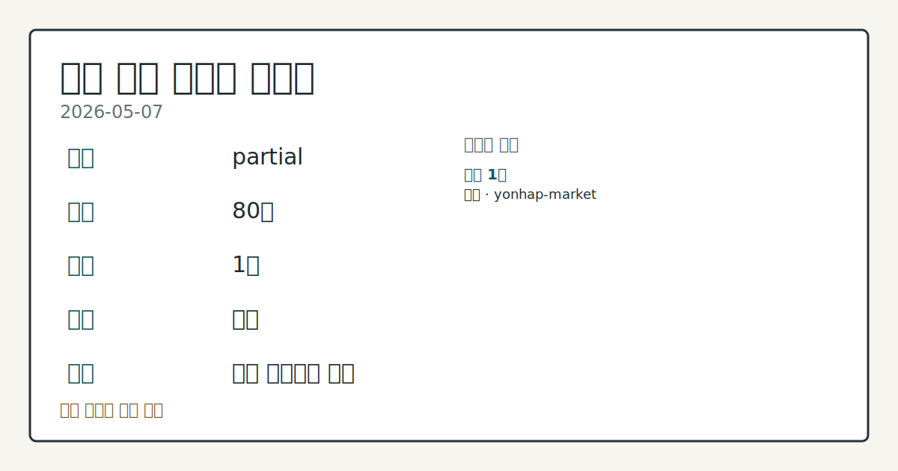
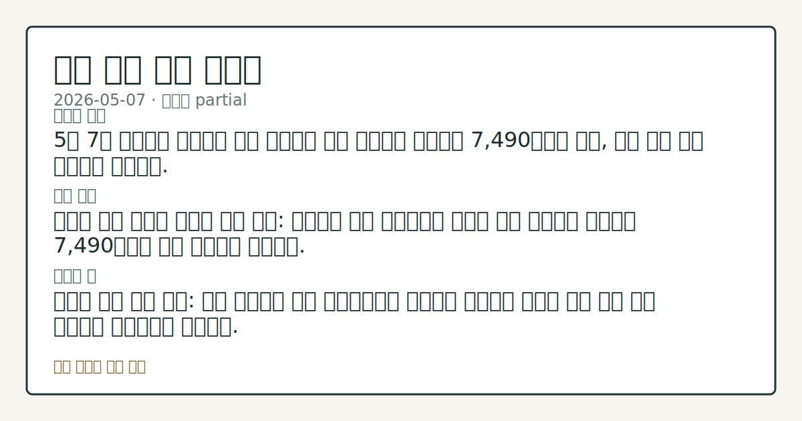
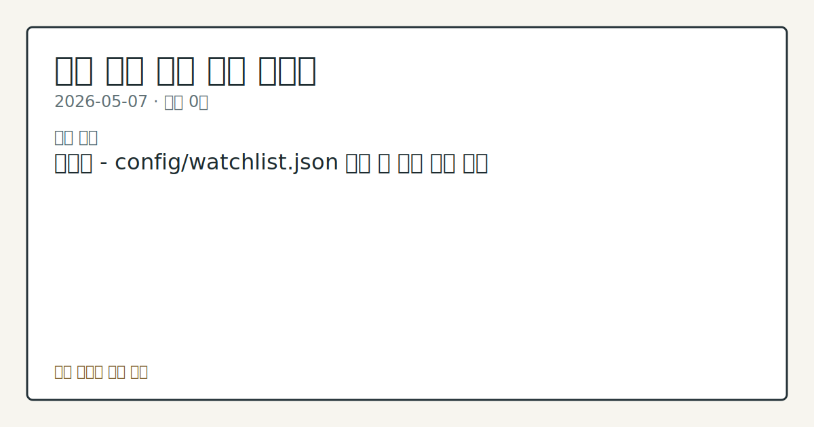

# 2026-05-07 국내 증시 시황

**기준 시각**: 2026-05-07 KST · [2026-05-06T15:00Z, 2026-05-07T15:00Z)

**세그먼트**: [국내 증시](2026-05-07.md) | [미국 증시](../../../us-equity/2026/05/2026-05-07.md) | [크립토](../../../crypto/2026/05/2026-05-07.md)

*이미지: 데이터 신뢰도 · 출처: investo 자체 생성 · 생성: investo 0.1.0 · 2026-05-08 UTC*

> **데이터 상태**: 부분 — 수집 80건 / 소스 1개 / 누락: 가격
> **상세 사유**: 가격 카테고리 누락
> **소스별 상태**: 정상 1개
> **내 관심 자산 영향**: 관심 목록 미설정 — `config/watchlist.json`을 추가하면 보유 종목 영향이 표시됩니다.
> **오늘의 결론**: 5월 7일 코스피는 외국인의 대거 매도에도 개인 매수세가 받쳐주며 7,490대에서 마감, 다시 한번 사상 최고치를 경신했다.
> **핵심 동인**: 코스피 사상 최고치 경신과 수급 공방: 외국인이 대거 매도했지만 개인이 이를 받아내며 코스피는 7,490대에서 역대 최고치로 마감했다.
> **주의할 점**: 외국인 수급 복귀 여부: 오늘 외국인이 대거 매도했음에도 코스피가 최고치를 기록한 것은 개인 수급 의존도가 높아졌음을 의미한다.

## ① 요약

*이미지: 시장 스냅샷 · 출처: investo 자체 생성 · 생성: investo 0.1.0 · 2026-05-08 UTC*

5월 7일 코스피는 [외국인의 대거 매도에도 개인 매수세가 받쳐주며 7,490대에서 마감, 다시 한번 사상 최고치를 경신](https://www.yna.co.kr/view/AKR20260507143751008)했다. 미·이란 종전 협상 기대감과 글로벌 AI 붐 지속 전망이 맞물리며 지수를 끌어올렸고, [NH투자증권(연내 9,000)·씨티그룹(8,500) 등 국내외 증권사들이 코스피 목표치를 잇따라 상향 조정](https://www.yna.co.kr/view/AKR20260507123251008)했다. 전일(2026-05-06)은 데이터 부족으로 시황 파악이 어려웠으나, 오늘은 조선·방산 실적 호조, 채권 강세, 다수 종목 애프터마켓 급등 등 뚜렷한 시장 시그널이 집중 확인됐다.

---

## ② 전일 핵심 이슈

**코스피 사상 최고치 경신과 수급 공방**: [외국인이 대거 매도했지만 개인이 이를 받아내며 코스피는 7,490대에서 역대 최고치로 마감](https://www.yna.co.kr/view/AKR20260507143751008)했다. 수급 주체 간 치열한 공방이 이어지는 가운데 [NH투자증권은 연내 9,000, 씨티그룹은 8,500을 제시](https://www.yna.co.kr/view/AKR20260507123251008)하며 상승 기대를 높였다.

**AI 강세장 지속 전망**: [폴 튜더 존스 튜더인베스트먼트 창립자는 AI 붐이 1~2년 더 이어질 것이라고 전망](https://www.yna.co.kr/view/AKR20260507190700072)했다. 이 발언은 글로벌 위험자산 선호를 지지하는 배경으로 작용했다.

**미·이란 종전 협상과 아시아 증시 급등**: 협상 진행에 주목하며 [닛케이225는 5.58% 폭등하고 장중 63,000선을 처음 돌파](https://www.yna.co.kr/view/AKR20260507050851073)했다. 반면 [뉴욕증시 3대 지수는 혼조 출발](https://www.yna.co.kr/view/AKR20260507189400009)하며 협상 결과를 관망하는 흐름을 보였다.

**전쟁의 소비 위축 효과**: [월풀은 미·이란 전쟁에 따른 소비심리 위축으로 경기침체 수준의 어려움을 겪고 있다고 밝혔다](https://www.yna.co.kr/view/AKR20260507188400072). 종전 협상 기대와 실물 소비 냉각이 공존하는 이중적 국면이다.

---

## ③ 섹터/수급 동향

**수급**: [외국인의 대규모 매도에도 코스피가 사상 최고치를 유지](https://www.yna.co.kr/view/AKR20260507143751008)한 것은 개인 매수세가 시장을 사실상 단독 지탱했음을 의미한다. 외국인 이탈이 지속될 경우 개인의 수급 여력이 지수 방어선의 핵심 변수로 부상할 전망이다.

**조선**: [국내 조선 빅3(HD한국조선해양[009540], 한화오션[042660], 삼성중공업)의 1분기 영업이익 합산은 2조원으로 전년 동기 대비 48% 증가](https://www.yna.co.kr/view/AKR20260507155600003)했다. 선가 상승과 수주 잔고가 실적으로 현실화되며 섹터 펀더멘털을 뒷받침했다.

**방산**: LIG D&A와 KAI 모두 분기 호실적을 발표하며 방산 섹터의 실적 가시성을 재확인했다(상세 수치는 ⑤ 참조).

**증권업 정책**: [금융위원회가 중소·벤처기업에 자금을 공급하는 중기특화 증권사 지정을 확대하겠다고 발표](https://www.yna.co.kr/view/AKR20260507068851002)했다. 모험자본 공급 확대 방향이 중소형 증권업종의 수혜 기대로 연결될 수 있다.

---

## ④ 지표·이벤트

**국고채 금리 일제히 하락**: [미·이란 종전 기대감에 국고채 금리가 전 구간 하락하며 3년물은 연 3.546%로 마감](https://www.yna.co.kr/view/AKR20260507152551008)했다. 안전자산 수요보다는 지정학적 리스크 프리미엄 완화에 기인한 채권 강세로 해석된다.

**미국 신규 실업수당 청구**: [지난주(4월 26일~5월 2일) 신규 청구 건수는 20만 건으로 전주 대비 1만 건 증가했으나, 시장 전망을 밑돌았다](https://www.yna.co.kr/view/AKR20260507185300072). 미국 고용 시장이 여전히 견조하다는 신호다.

**노르웨이 금리 인상**: [노르웨이 중앙은행이 기준금리를 연 4.25%로 0.25%p 인상했다](https://www.yna.co.kr/view/AKR20260507172600082). 글로벌 산유국·자원국으로 긴축 기조가 확산되는 흐름이 관찰된다.

**국내 석유 최고가격 동결**: [정부는 5월 8일 0시부터 적용되는 5차 석유 최고가격을 동결했다](https://www.yna.co.kr/view/AKR20260507173000003). 물가·민생 고려가 배경으로 언급됐다.

**가상자산 과세 논란**: [국회 토론에서 내년 도입 예정인 가상자산 과세가 금투세 폐지와의 형평성 문제 및 과세 인프라 미비를 이유로 실효성에 의문이 제기됐다](https://www.yna.co.kr/view/AKR20260507164200002). 과세 정책의 불확실성은 관련 시장 참여자 심리에 영향을 줄 수 있다.

---

## ⑤ 주요 종목

**실적 발표**

| 종목 | 주요 내용 |
|------|----------|
| LIG D&A | [1분기 영업이익 1,711억원, 전년 동기 대비 56.1% 증가](https://www.yna.co.kr/view/AKR20260507098951527) |
| KAI | [완제기 수출 호조로 1분기 기준 역대 최대 매출 달성, 영업이익 43.4% 증가](https://www.yna.co.kr/view/AKR20260507136051527) |
| 넷마블[251270] | [신작 출시 효과·자체 결제 비중 확대로 1분기 영업이익 6.8% 증가](https://www.yna.co.kr/view/AKR20260507134852527) |
| 카페24[042000] | [1분기 영업이익 62억원, 전년 동기 대비 4.6% 증가](https://www.yna.co.kr/view/AKR20260507158900527) |

**애프터마켓 급등 관찰**

당일 정규장 마감 후 급등한 종목들로, 급등 직접 원인은 공시된 입력 데이터만으로 특정하기 어렵다.

- [나우로보틱스[459510]: 10%대 급등](https://www.yna.co.kr/view/AKR20260507180100008)
- [인바디[041830]: 10%대 급등](https://www.yna.co.kr/view/AKR20260507166400008)
- [한스바이오메드[042520]: 11%대 급등](https://www.yna.co.kr/view/AKR20260507157700008)
- [대웅제약[069620]: 10%대 급등](https://www.yna.co.kr/view/AKR20260507156600008)

**확인 항목**

- [지엔코[065060]: 채무상환자금 조달 목적으로 35억원 규모의 크레오에스지 등 제3자배정 유상증자 결정 공시](https://www.yna.co.kr/view/AKR20260507157400008). 신주 발행에 따른 지분 희석 효과 주의.

---

## ⑥ 오늘의 관전 포인트

*이미지: 관심 자산 관련성 · 출처: investo 자체 생성 · 생성: investo 0.1.0 · 2026-05-08 UTC*

1. **외국인 수급 복귀 여부**: 오늘 외국인이 대거 매도했음에도 코스피가 최고치를 기록한 것은 개인 수급 의존도가 높아졌음을 의미한다. 내일 외국인 순매수 전환 여부와 프로그램 매매 방향이 단기 지수 안정성을 가름할 핵심 변수다.

2. **미·이란 협상 진전 속도**: 종전 기대감은 오늘 국고채 금리 하락과 아시아 증시 강세의 주요 원인이었다. 협상의 구체적 진전 또는 결렬 여부에 따라 채권·주식·유가가 동시 반응할 수 있다.

3. **코스피 7,490대 이후 추가 상승 여력**: NH투자(9,000)·씨티(8,500) 등 목표치 상향 발표가 잇따르는 가운데, 현 수준에서 단기 차익 실현 압력과 추가 매수 여력 간 균형을 주시해야 한다.

4. **방산·조선 실적 시즌 마무리 점검**: LIG D&A, KAI, 조선 빅3의 호실적이 확인된 만큼, 추가 종목 실적 발표가 남아 있다면 섹터 모멘텀의 연속성을 재확인하는 계기가 될 것이다.

5. **바이오·헬스케어 애프터마켓 급등 후속 흐름**: 나우로보틱스, 인바디, 한스바이오메드, 대웅제약이 애프터마켓에서 일제히 급등한 배경이 구체화될 경우, 다음 정규 거래일 바이오·헬스케어 섹터 전반의 수급 동향에 주목할 필요가 있다.

## ⑦ 면책조항
본 시황은 일반 정보 제공을 목적으로 자동 생성된 자료이며,
특정 종목·자산에 대한 매매 권유나 투자 자문이 아닙니다.
투자 결정과 그 결과에 대한 책임은 전적으로 본인에게 있으며,
본 시황의 내용에 따라 발생한 손실에 대해 작성자는 일체의 책임을 지지 않습니다.