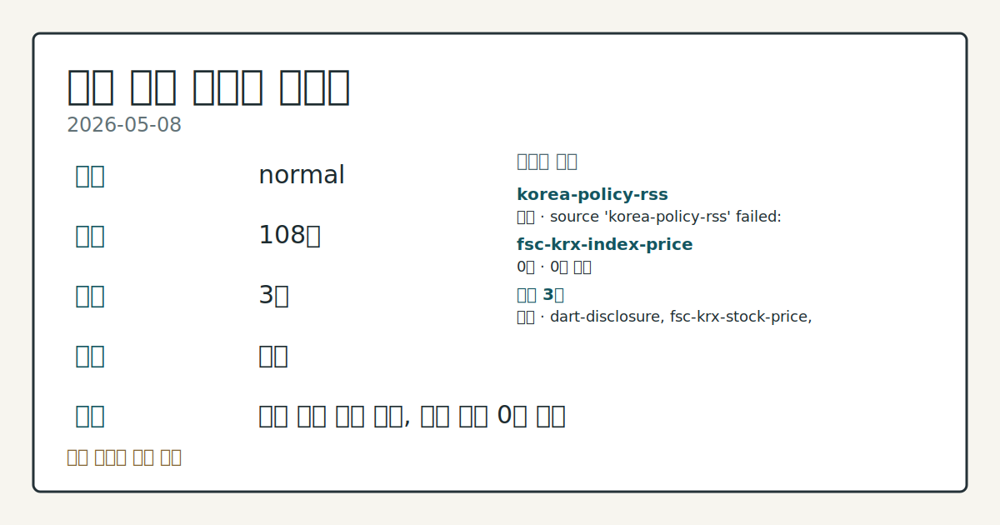
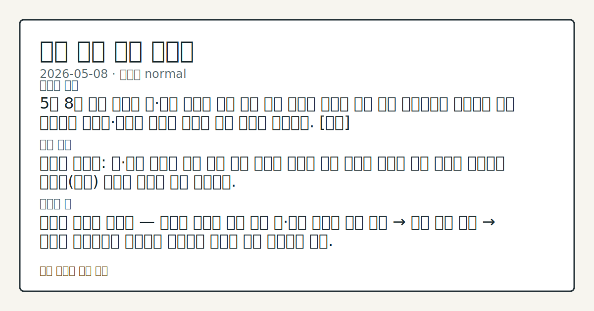
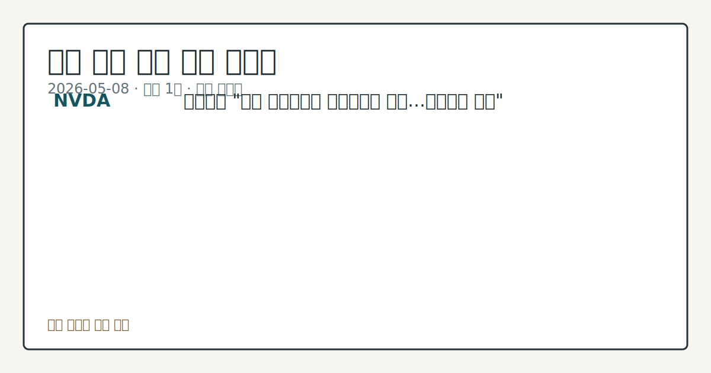

# 2026-05-08 국내 증시 시황

**기준 시각**: 2026-05-08 KST · [2026-05-07T15:00Z, 2026-05-08T15:00Z)

**세그먼트**: [국내 증시](2026-05-08.md) | [미국 증시](../../../us-equity/2026/05/2026-05-08.md) | [크립토](../../../crypto/2026/05/2026-05-08.md)

*이미지: 데이터 신뢰도 · 출처: investo 자체 생성 · 생성: investo 0.1.0 · 2026-05-09 UTC*

> **데이터 상태**: 정상 — 수집 111건 / 소스 2개 / 누락: 없음
> **소스 등급 분포**: S=1 / B=1
> **상세 사유**: 일부 소스 수집 실패, 일부 소스 0건 반환
> **소스별 상태**: korea-policy-rss 실패 (source 'korea-policy-rss' failed: malformed XML: syntax error: line 1, column 49), fsc-krx-index-price 0건, 정상 2개
> **내 관심 자산 영향**: 1건 확인 (기본 바스켓) — NVDA: 엔비디아 "코닝 공장건설에 수십억달러 투자…지분확보 별개"
> **오늘의 결론**: 5월 8일 국내 증시는 미국의 4월 비농업(非農業) 고용 지표 호조와 AI(인공지능)·반도체 섹터 강세를 발판 삼아 주요 대형주 전반에서 상승세를 기록했다. [강세]
> **핵심 동인**: 미국 노동부는 4월 비농업 일자리가 전월 대비 11만5천명 증가했다고 발표했다.
> **주의할 점**: 미·이란 지정학 리스크: 유가 급등이 국내 채권 금리 상승으로 직결된 만큼, 중동 상황의 전개가 코스피 대형주 추가 상승 여력을 좌우할 핵심 변수다.

## ① 요약

*이미지: 시장 스냅샷 · 출처: investo 자체 생성 · 생성: investo 0.1.0 · 2026-05-09 UTC*

5월 8일 국내 증시는 미국의 4월 비농업(非農業) 고용 지표 호조와 AI(인공지능)·반도체 섹터 강세를 발판 삼아 주요 대형주 전반에서 상승세를 기록했다. 삼성전자가 +2.07%, SK하이닉스가 +3.31% 오른 데 이어 현대차와 셀트리온도 각각 +4.00%, +4.01%의 강한 상승을 보이며 전일(5월 7일) 외국인 매도 압력 속 개인 매수세가 지수를 받쳐내던 구도에서 벗어나, 대형주들이 직접 상승을 주도하는 흐름으로 전환됐다. 다만 미·이란 군사 충돌로 유가가 급등하며 국고채 금리가 일제히 상승하는 채권 약세가 동반됐고, 지정학적 불확실성은 상존하는 상황이다. [강세]

## ② 전일 핵심 이슈

미국 노동부는 4월 [비농업 일자리가 전월 대비 11만5천명 증가](https://www.yna.co.kr/view/AKR20260508171851072)했다고 발표했다. 시장 예상치를 상회한 결과로, 실업률은 4.3%를 유지해 노동 시장 견조함을 재확인했다. 뉴욕 증시의 3대 주가지수는 해당 지표를 소화하며 [상승 출발했으나](https://www.yna.co.kr/view/AKR20260508174600009), 고용 호조는 Federal Reserve의 조기 금리 인하 기대를 낮추는 양면성도 함께 내포했다.

국내 채권 시장에서는 미·이란 전쟁에 따른 국제 유가 급등이 인플레이션 우려를 자극하면서 [국고채(정부발행채권) 금리가 일제히 상승](https://www.yna.co.kr/view/AKR20260508140751008)했다. 3년물 기준 연 3.569%로 마감했으며, 중·장기물도 동반 상승했다.

## ③ 섹터/수급 동향

2026년 5월 4~8일 주간 기준으로 코스피(KOSPI)와 코스닥 시장의 외국인·기관 순매수도 상위 종목 집계가 공표됐다([코스피 외국인](https://www.yna.co.kr/view/AKR20260508158300008) / [코스피 기관](https://www.yna.co.kr/view/AKR20260508158600008) / [코스닥 외국인](https://www.yna.co.kr/view/AKR20260508158500008) / [코스닥 기관](https://www.yna.co.kr/view/AKR20260508158400008)). 종목별 세부 순매수 수치는 해당 표에 수록돼 있다.

섹터 흐름에서는 AI·반도체 관련주가 두드러졌다. TSMC의 4월 역대 최대 매출 발표(전년 대비 +17.5%)가 [아시아 반도체주 전반의 매수 심리를 자극](https://www.yna.co.kr/view/AKR20260508170000009)하면서 삼성전자와 SK하이닉스가 동반 강세를 보였다. 자동차 섹터에서는 현대차가 대형주 중 가장 높은 상승폭을 기록했으며, 바이오 쪽에서는 셀트리온이 동반 강세를 이어받았다.

오는 12일에는 AI·반도체 기술주와 코스닥 바이오를 편입하는 ETF(상장지수펀드) 8종이 [신규 상장될 예정](https://www.yna.co.kr/view/AKR20260508149700008)이다. KB·현대·삼성·한화·미래에셋·키움·NH아문디 자산운용이 각각 참여한다.

## ④ 지표·이벤트

**미국 4월 고용지표**: 비농업 일자리 11만5천명 증가, 실업률 4.3% 유지. 예상치를 상회한 수치로 뉴욕 증시는 긍정적으로 반응했으나, 미·이란 충돌에 따른 유가 급등이 경기 둔화를 초래할 수 있다는 우려가 동시에 지속되고 있다([상세 기사](https://www.yna.co.kr/view/AKR20260508171852072)).

**국내 채권 시장**: 국고채 3년물 금리가 연 3.569%로 마감하며 상승 마감했다. 유가 급등이 장기화될 경우 금리 인상 압력과 경기 둔화 우려가 동시에 부상하는 복합 국면이 전개될 수 있다.

**항공·에너지**: EU(유럽연합)는 중동 전쟁으로 항공유 비용이 급등했음에도 이미 구입된 항공권에 유류할증료를 추가 부과할 수 없다는 입장을 재확인했다. 소비자 보호 원칙이 에너지 비용 전가보다 우선한다는 판단이다([관련 기사](https://www.yna.co.kr/view/AKR20260508176200098)).

## ⑤ 주요 종목

**실적 발표**

- **TSMC**: 4월 매출이 전년 동기 대비 17.5% 증가하며 월간 기준 역대 최대치를 기록했다. AI 수요 수혜가 지속되는 가운데 국내 반도체주 투자 심리 개선에 직접적으로 기여했다([기사](https://www.yna.co.kr/view/AKR20260508170000009)).
- **동원산업[006040]**: 1분기 연결 기준 영업이익 1,462억원으로 전년 동기 대비 17.1% 증가했다([기사](https://www.yna.co.kr/view/AKR20260508147000030)).
- **제주항공**: 1분기 별도 기준 영업이익 644억원으로 전년 동기 대비 흑자 전환, 2개 분기 연속 흑자를 달성했다([기사](https://www.yna.co.kr/view/AKR20260508147100003)).
- **CGV**: 영화 '왕과 사는 남자' 흥행에 힘입어 1분기 영업이익 87억원을 기록하며 전년보다 개선됐다([기사](https://www.yna.co.kr/view/AKR20260508146600005)).
- **도요타(Toyota)**: 순이익이 3년 연속 감소할 것으로 예상되지만, 매출은 일본 기업 최초로 50조 엔을 돌파할 전망이다([기사](https://www.yna.co.kr/view/AKR20260508117251073)).

**주가 동향**

- **삼성전자[005930]** 271,500원 (+2.07%, +5,500원): 거래량 41,404,687주를 소화하며 반도체 대장주 역할을 했다.
- **SK하이닉스[000660]** 1,654,000원 (+3.31%, +53,000원): TSMC 호실적 발표 이후 AI 메모리 수혜 기대가 반영됐다.
- **현대차[005380]** 572,000원 (+4.00%, +22,000원): 이날 주요 대형주 가운데 가장 높은 상승률을 기록했다.
- **셀트리온[068270]** 202,500원 (+4.01%, +7,800원): 바이오 섹터에서 두드러진 강세를 보였다.
- **NAVER[035420]** 207,500원 (-0.24%, -500원): 주요 대형주 가운데 유일하게 소폭 하락했다.
- **잇츠한불[226320]**: 애프터마켓에서 10%대 급등을 기록 중이다([기사](https://www.yna.co.kr/view/AKR20260508151900008)).
- **마녀공장[439090]**: 코스닥 종목으로 애프터마켓 10%대 급등이 관찰됐다([기사](https://www.yna.co.kr/view/AKR20260508147700008)).

**기업 이벤트**

- **NVDA**: 젠슨 황 CEO가 유리·광섬유 제조사 코닝(Corning)의 공장 건설에 최대 30억달러를 투자하되, 지분 확보는 별도 사안으로 구분한다고 밝혔다([기사](https://www.yna.co.kr/view/AKR20260508148700009)).
- **계양전기[012200]**: 채무상환자금 마련을 위해 약 410억원 규모의 주주배정 유상증자를 결정했다([기사](https://www.yna.co.kr/view/AKR20260508148600008)).
- **푸드나무[290720]**: 운영자금 조달을 위한 약 10억원 규모의 제3자배정 유상증자를 공시했다([기사](https://www.yna.co.kr/view/AKR20260508157700008)).
- **스피어[347700]**: 싱가포르 니켈 등 특수합금 사업 투자 종속회사(Sphere Nickel Cobalt) 지분을 247억원에 추가 취득했다([기사](https://www.yna.co.kr/view/AKR20260508143300008)).
- **한국콜마**: 토스증권 MTS(모바일트레이딩시스템)에서 1분기 실적이 잘못 표기되는 오류가 발생해 투자자 항의가 이어졌다([기사](https://www.yna.co.kr/view/AKR20260508175700008)).

## ⑥ 오늘의 관전 포인트

*이미지: 관심 자산 관련성 · 출처: investo 자체 생성 · 생성: investo 0.1.0 · 2026-05-09 UTC*

**미·이란 지정학 리스크**: 유가 급등이 국내 채권 금리 상승으로 직결된 만큼, 중동 상황의 전개가 코스피 대형주 추가 상승 여력을 좌우할 핵심 변수다. 채권·주식 간 자금 이동 여부를 함께 주시할 필요가 있다.

**반도체 섹터 연속성**: TSMC 역대 최대 매출과 NVDA의 코닝(Corning) 투자 확대는 AI 수요 강도를 재확인하는 신호다. 삼성전자·SK하이닉스가 금일 상승폭을 유지하거나 확대하는지가 다음 거래일 지수 방향성의 가늠자가 될 전망이다.

**5월 12일 ETF 8종 상장**: AI·반도체 기술주와 코스닥 바이오를 편입하는 신규 ETF가 상장을 앞두고 있어, 해당 섹터 종목들의 단기 수급 변동 가능성을 점검할 필요가 있다.

**애프터마켓 급등주 추적**: 잇츠한불[226320]과 마녀공장[439090]이 10%대 급등 상태로 거래를 마쳤다. 정규장 개장 후 이 모멘텀이 유지되는지, 아니면 차익 매물이 쏟아지는지가 중·소형주 투자자들의 주요 관전 포인트다.

**유상증자 종목 수급**: 계양전기(약 410억원)와 푸드나무(약 10억원)의 유상증자 진행 과정에서 발행 조건 확정 및 주가 희석 우려에 따른 변동성이 나타날 수 있어 개별 종목 단위의 확인이 필요하다.

📑 트레이스 + 서명 (Stage 1/2)

- `input_hash`: `2fe41b283869`
- `stage1_hash`: `6711c8880f8a`
- `stage2_hash`: `580de7da2a2b`

| 항목 ID | 소스 | 카테고리 | 섹션 | 제목 |
|---------|------|----------|------|------|
| 0 | fsc-krx-stock-price | price | — | 삼성전자[005930] 271,500원 (+2.07%, +5,500) |
| 1 | fsc-krx-stock-price | price | 5 | SK하이닉스[000660] 1,654,000원 (+3.31%, +53,000) |
| 2 | fsc-krx-stock-price | price | 5 | NAVER[035420] 207,500원 (-0.24%, -500) |
| 3 | fsc-krx-stock-price | price | 5 | 현대차[005380] 572,000원 (+4.00%, +22,000) |
| 4 | fsc-krx-stock-price | price | 5 | 셀트리온[068270] 202,500원 (+4.01%, +7,800) |
| 5 | yonhap-market | news | 5 | EU "항공권 이미 구입한 승객에 유류할증료 추가 안돼" |
| 6 | yonhap-market | news | 4 | 토스증권, MTS에 한국콜마 실적 표기 오류…투자자들 항의 |
| 7 | yonhap-market | news | 5 | 뉴욕증시, 비농업 고용 소화하며 상승 출발 |
| 8 | yonhap-market | news | 2 | 이란전쟁에도 美 4월 고용 11만5천명↑'호조'…실업률도 안정(종합) |
| 9 | yonhap-market | news | 4 | [2보] 미 4월 고용 11만5천명 증가…실업률 4.3% 유지 |
| 10 | yonhap-market | news | 4 | [1보] 미 4월 고용 11만5천명 증가…예상치 상회 |
| 11 | yonhap-market | news | 4 | TSMC 4월 기준 역대 최대 매출…전년 대비 17.5% 늘어 |
| 12 | yonhap-market | news | 5 | 도요타, 순이익 3년 연속 감소 예상…매출은 日기업 첫 50조엔(종합) |
| 13 | yonhap-market | news | 5 | [표] 주간 코스닥 외국인 순매수도 상위종목 |
| 14 | yonhap-market | news | 3 | [표] 주간 코스닥 기관 순매수도 상위종목 |
| 15 | yonhap-market | news | 3 | [표] 주간 거래소 외국인 순매수도 상위종목 |
| 16 | yonhap-market | news | 3 | [표] 주간 거래소 기관 순매수도 상위종목 |
| 17 | yonhap-market | news | 3 | 푸드나무, 10억원 제3자배정 유상증자 |
| 18 | yonhap-market | news | 5 | 잇츠한불, 애프터마켓서 10%대 급등 |
| 19 | yonhap-market | news | 5 | AI·반도체기술주, 코스닥 바이오 등 ETF 8종 12일 상장 |
| 20 | yonhap-market | news | 3 | 계양전기, 410억원 주주배정 유상증자 |
| 21 | yonhap-market | news | 5 | 엔비디아 "코닝 공장건설에 수십억달러 투자…지분확보 별개" |
| 22 | yonhap-market | news | 5 | CGV 1분기 영업이익 87억원…'왕사남' 흥행에 실적 개선 |
| 23 | yonhap-market | news | 5 | 마녀공장, 애프터마켓서 10%대 급등 |
| 24 | yonhap-market | news | 5 | 동원산업 1분기 영업익 1천462억원…작년 동기 대비 17.1% 증가 |
| 25 | yonhap-market | news | 5 | 제주항공, 1분기 영업이익 644억원…2개 분기 연속 흑자 |
| 26 | yonhap-market | news | 5 | 스피어 "종속회사 주식 247억원에 추가취득" |
| 27 | yonhap-market | news | 5 | 美·이란 충돌에 국고채 금리 일제히↑…3년물 연 3.569%(종합) |
| 28 | yonhap-market | news | 2 | 국고채 금리 일제히 상승…3년물 연 3.569% |

## ⑦ 면책조항
본 시황은 일반 정보 제공을 목적으로 자동 생성된 자료이며,
특정 종목·자산에 대한 매매 권유나 투자 자문이 아닙니다.
투자 결정과 그 결과에 대한 책임은 전적으로 본인에게 있으며,
본 시황의 내용에 따라 발생한 손실에 대해 작성자는 일체의 책임을 지지 않습니다.