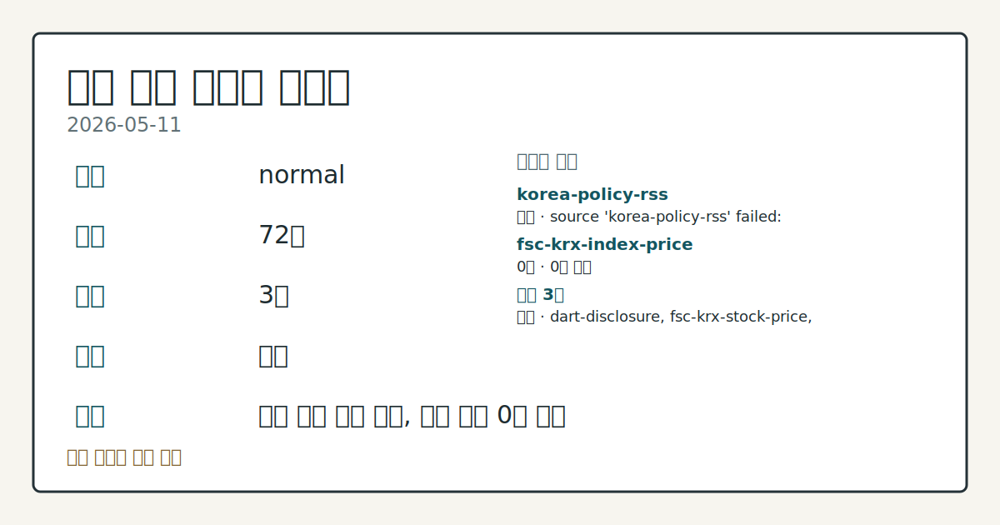
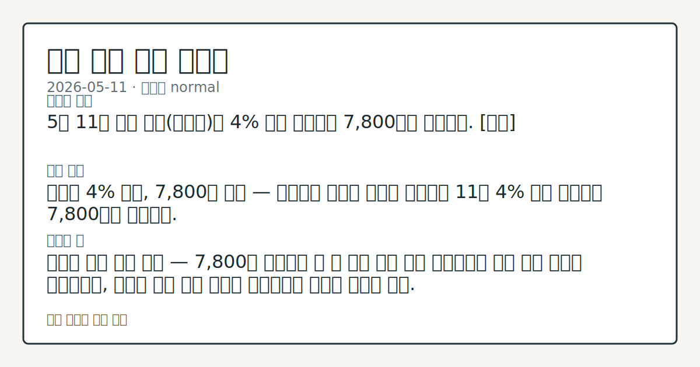
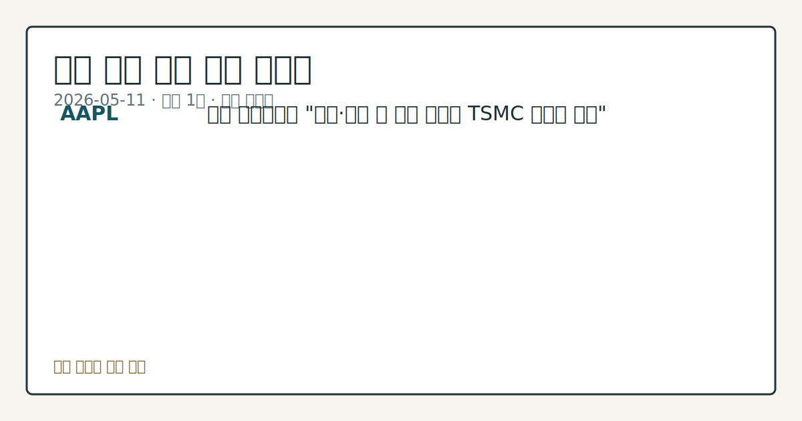

# 2026-05-11 국내 증시 시황

**기준 시각**: 2026-05-11 KST · [2026-05-10T15:00Z, 2026-05-11T15:00Z)

**세그먼트**: [국내 증시](2026-05-11.md) | [미국 증시](../../../us-equity/2026/05/2026-05-11.md) | [크립토](../../../crypto/2026/05/2026-05-11.md)

*이미지: 데이터 신뢰도 · 출처: investo 자체 생성 · 생성: investo 0.1.0 · 2026-05-12 UTC*

> **데이터 상태**: 정상 — 수집 72건 / 소스 3개 / 누락: 없음
> **소스 등급 분포**: S=2 / B=1
> **상세 사유**: 일부 소스 수집 실패, 일부 소스 0건 반환
> **소스별 상태**: korea-policy-rss 실패 (source 'korea-policy-rss' failed: malformed XML: syntax error: line 1, column 49), fsc-krx-index-price 0건, 정상 3개
> **내 관심 자산 영향**: 1건 확인 (기본 바스켓) — AAPL: 대만 경제전문가 "애플·인텔 칩 생산 합의에 TSMC 위기감 고조"
> **오늘의 결론**: 5월 11일 국내 증시(코스피)는 4% 넘게 급등하며 7,800선을 돌파했다. [강세]
> **핵심 동인**: 코스피 4% 급등, 7,800선 돌파 — 연합뉴스 보도에 따르면 코스피가 11일 4% 넘게 급등하며 7,800선을 회복했다.
> **주의할 점**: 코스피 급등 지속 여부 — 7,800선 돌파라는 큰 폭 상승 이후 다음 거래일에서 추가 상승 여력이 이어지는지, 아니면 차익 실현 매물이 나오는지를 주목할 필요가 있다.

## ① 요약

*이미지: 시장 스냅샷 · 출처: investo 자체 생성 · 생성: investo 0.1.0 · 2026-05-12 UTC*

5월 11일 국내 증시(코스피)는 4% 넘게 급등하며 7,800선을 돌파했다. 직전 거래일인 5월 8일 미·이란 충돌에 따른 지정학 리스크와 국고채 금리 상승이 누른 흐름에서 뚜렷이 이탈하며 강한 반등 장세를 연출했다. 반도체·자동차 대형주가 지수 상승을 이끌었고, 애프터마켓에서도 다수 종목이 10% 이상 급등했다. 한편 글로벌 무대에서는 미·이란 종전 협상이 교착 상태에 빠지고 사우디 아람코(Saudi Aramco)가 에너지 공급난 심화를 경고하는 등 지정학적 불확실성이 여전히 상존한다. 유가 상승 압력에 국고채 금리도 재차 오름세를 보여 채권 시장은 약세 마감했다. [강세]

## ② 전일 핵심 이슈

**코스피 4% 급등, 7,800선 돌파** — [연합뉴스 보도](https://www.yna.co.kr/view/AKR20260511144700003)에 따르면 코스피가 11일 4% 넘게 급등하며 7,800선을 회복했다. 이재용 삼성전자 회장의 주식 재산이 50조 원을 넘어서고 삼성가(家) 4인 합산 주식 재산이 100조 원을 상회하는 등 국내 대형주의 시총 팽창이 두드러졌다. 이는 5월 8일 지정학 리스크에 눌렸던 흐름에서 뚜렷이 이탈한 것이다.

**미·이란 종전협상 교착 — 뉴욕증시 하락 출발** — [뉴욕증시 보도](https://www.yna.co.kr/view/AKR20260511165300009)에 따르면 미국과 이란의 종전 협상이 교착 상태에 빠지면서 뉴욕증시 3대 지수가 하락 출발했다. 지정학적 불확실성이 글로벌 위험 선호 심리에 재차 부담을 주고 있다.

**아람코 "에너지 쇼크, 5~6월 공급난 더 커질 것"** — [아람코 관련 보도](https://www.yna.co.kr/view/AKR20260511164900079)에 따르면 사우디 아람코의 아민 나세르(Amin Nasser) CEO는 이란 전쟁으로 시작된 에너지 시장 혼란이 5~6월 더욱 심화될 수 있다고 경고했다. 유럽 3대 정유사인 셸(Shell), BP, 토탈에너지스(TotalEnergies)가 [중동전쟁 트레이딩으로 최대 7조 원 수익](https://www.yna.co.kr/view/AKR20260511124900009)을 거뒀다는 보도도 나왔다.

**국고채 금리 일제히 상승** — [채권시장 보도](https://www.yna.co.kr/view/AKR20260511138351008)에 따르면 유가 상승 영향으로 11일 국고채(국내 정부 발행 채권) 금리가 일제히 올랐고, 3년물은 연 3.598%로 마감했다. 영국에서도 스타머 총리의 사임 거부 속 [영국 국채금리가 상승](https://www.yna.co.kr/view/AKR20260511159000085)하며 글로벌 채권 약세 기류가 이어졌다.

**일본 닛케이225(닛케이지수) 63,000선 돌파 후 하락 마감** — [도쿄발 보도](https://www.yna.co.kr/view/AKR20260511053451073)에 따르면 닛케이225가 장중 63,000선을 넘어 최고점을 찍었으나 하락 마감했다. 아시아 증시에서 한국과 일본 모두 역사적 고점 수준에서 장중 변동성이 컸던 하루였다.

## ③ 섹터/수급 동향

**반도체·대형 IT 주도의 코스피 급등** — 삼성전자[005930]와 SK하이닉스[000660]가 각각 +6.33%, +11.51%로 시장 상승을 견인했다. 애프터마켓에서도 삼성에스디에스[018260]가 10%대 급등하며 반도체·IT 섹터(업종) 전반의 강한 수급 유입이 확인됐다.

**자동차** — 현대차[005380]가 +5.38% 상승하며 수출 관련 업종에도 순매수세가 유입됐다.

**헬스케어 혼조** — 셀트리온[068270]은 -3.58% 하락해 바이오·헬스케어 섹터는 지수 상승에 동참하지 못했다. 반면 지씨셀[144510]은 애프터마켓에서 11%대 급등을 기록해 종목 간 차별화가 뚜렷했다.

**DART(전자공시시스템) 대량보유 공시 집중** — 드림어스컴퍼니, 콜마비앤에이치, 푸드나무, 콜마홀딩스, 핑거, KB스타리츠, 한울앤제주, 아이티센피엔에스 등 복수의 종목에서 주식 대량보유 상황 보고서가 접수됐다. 공시 내용 상 지분 변동 방향(순매수·매도)은 본 입력 데이터에서 확인되지 않는다.

## ④ 지표·이벤트

**국고채 금리 상승 — 3년물 연 3.598%** — 유가 상승 압력이 인플레이션(물가 상승) 우려를 자극하며 채권 약세로 이어졌다. 이는 5월 8일과 동일한 금리 상승 패턴의 연장선이다.

**코스피 지수선물·옵션 시세표 발표** — 11일 코스피(KOSPI) 지수선물·옵션 정규 시세표가 공표됐다. 개별주식선물 기초자산 기준 시총 상위 100개 종목의 선물 거래가 포함됐으며, 콜옵션(Call Option, 매수 권리)·풋옵션(Put Option, 매도 권리) 시세도 확인됐다.

**KRX(한국거래소) '퓨처스타' 43명 선발** — 한국거래소는 부산 지역 대학생을 대상으로 파생상품(선물·옵션 등 기초자산 연계 금융상품) 교육 지원 프로그램인 'KRX 퓨처스타'의 올해 참가자 [43명을 선발](https://www.yna.co.kr/view/AKR20260511148800008)했다고 발표했다.

**AAPL·TSMC 관련 동향** — [연합뉴스 보도](https://www.yna.co.kr/view/AKR20260511165300009)에 따르면 대만 경제전문가들 사이에서 AAPL·인텔(Intel)의 칩 생산 합의를 둘러싸고 TSMC(대만 반도체 파운드리)의 위기감이 고조되고 있다는 분석이 나왔다. 국내 반도체 공급망 수혜 가능성에 대한 시장의 관심이 이어질 전망이다.

## ⑤ 주요 종목

**실적 발표**

| 종목 | 결과 |
|------|------|
| 한샘[009240] | 1분기 영업이익 101억 원, 전년 동기 대비 +56.4% |
| 롯데케미칼 | 1분기 영업이익 735억 원, 전년 동기 대비 흑자전환 |
| 시프트업[462870] | 1분기 영업이익 전년 대비 -18.1% (신작 개발 비용 증가) |

**애프터마켓 급등 확인 항목**

| 종목 | 등락 |
|------|------|
| 한샘[009240] | 12%대 급등 |
| 지씨셀[144510] | 11%대 급등 |
| 대덕[008060] | 11%대 급등 |
| 펨트론[168360] | 10%대 급등 |
| 삼성에스디에스[018260] | 10%대 급등 |
| 엠로[058970] | 10%대 급등 |

**정규장 종가 관전 분류**

| 종목 | 종가 | 등락 |
|------|------|------|
| SK하이닉스[000660] | 1,880,000원 | +11.51% (+194,000) |
| 삼성전자[005930] | 285,500원 | +6.33% (+17,000) |
| 현대차[005380] | 646,000원 | +5.38% (+33,000) |
| NAVER[035420] | 211,500원 | -1.63% (-3,500) |
| 셀트리온[068270] | 191,300원 | -3.58% (-7,100) |

**주주가치 제고 및 자본시장 이슈**

- NHN[181710]: 자사주(자기주식) 167억 원어치 취득 후 소각 결정 ([공시](https://dart.fss.or.kr/dsaf001/main.do?rcpNo=20260511000704)), 43만1천525주 장내 직접 취득 예정(5월 12일~8월 11일)
- NXC(넥슨 그룹 지주사): 정부 물납 지분 1조 원어치 자사 매입
- RF머트리얼즈: 유상증자(주식 발행으로 자금 조달) 관련 권리락(權利落, 유상증자 기준일 경과 후 신주인수권이 소멸된 상태) 발생
- 블루산업개발, 알엔티엑스: 유상증자 결정 기재정정 공시 접수
- 더블유씨피, 다이나믹솔루션: CB(전환사채권, 채권을 주식으로 전환할 수 있는 사채) 발행 결정 기재정정 공시 접수
- 아이씨디: BW(신주인수권부사채, 사채에 신주 인수 권리가 부가된 채권) 발행 결정 공시 접수
- 아이벡스메디칼시스템즈: 코스닥 상장예비심사 신청 접수

## ⑥ 오늘의 관전 포인트

*이미지: 관심 자산 관련성 · 출처: investo 자체 생성 · 생성: investo 0.1.0 · 2026-05-12 UTC*

**코스피 급등 지속 여부** — 7,800선 돌파라는 큰 폭 상승 이후 다음 거래일에서 추가 상승 여력이 이어지는지, 아니면 차익 실현 매물이 나오는지를 주목할 필요가 있다. 지수 급등 시 기관 프로그램매매(기관자동주문)의 방향 전환 여부도 함께 살펴볼 지점이다.

**유가·지정학 리스크 연동** — 사우디 아람코의 경고대로 5~6월 에너지 공급난이 심화될 경우 유가 재상승 → 국고채 금리 추가 상승 → 밸류에이션(기업 가치 평가) 부담 확대 경로가 재활성화될 수 있다. 미·이란 협상 진전 여부가 당분간 국내 증시의 핵심 외생 변수로 작용할 전망이다.

**반도체 섹터 수급 흐름** — SK하이닉스[000660]의 +11.51% 급등이 외국인·기관 순매수 주도였는지, 아니면 개인 매수세 기반이었는지는 본 입력 데이터에서 확인되지 않는다. 다음 거래일 외국인 수급 데이터 확인이 요점이다.

**TSMC·AAPL 칩 협상 여파** — 대만 전문가들이 경고한 TSMC 위기감이 현실화될 경우, 국내 삼성전자·SK하이닉스의 파운드리(반도체 위탁생산) 및 메모리 수혜 기대가 더 구체화될 수 있다. 관련 공급망 뉴스 흐름을 모니터링할 필요가 있다.

**자본시장 이벤트** — NHN[181710] 자사주 취득이 5월 12일부터 시작되며, 한샘[009240]의 실적 호조(+56.4%)에 따른 애프터마켓 급등이 정규장에서 어떻게 이어지는지도 확인 사항이다.

📑 트레이스 + 서명 (Stage 1/2)

- `input_hash`: `d72a0c5a9649`
- `stage1_hash`: `cf55994cc9dc`
- `stage2_hash`: `4b6cba402e24`

| 항목 ID | 소스 | 카테고리 | 섹션 | 제목 |
|---------|------|----------|------|------|
| 0 | dart-disclosure | news | — | [DART] 블루산업개발 - [기재정정]주요사항보고서(유상증자결정) |
| 1 | dart-disclosure | news | 5 | [DART] RF머트리얼즈 - 권리락 (유상증자) |
| 2 | dart-disclosure | news | 5 | [DART] 더블유씨피 - [기재정정]주요사항보고서(전환사채권발행결정) |
| 3 | dart-disclosure | news | 5 | [DART] 드림어스컴퍼니 - 주식등의대량보유상황보고서(일반) |
| 4 | dart-disclosure | news | 3 | [DART] 알엔티엑스 - [기재정정]주요사항보고서(유상증자결정) |
| 5 | dart-disclosure | news | 5 | [DART] 다이나믹솔루션 - [기재정정]주요사항보고서(전환사채권발행결정) |
| 6 | dart-disclosure | news | 5 | [DART] 삼성물산 - 임원ㆍ주요주주특정증권등소유상황보고서 |
| 7 | dart-disclosure | news | 5 | [DART] 블루산업개발 - [기재정정]주요사항보고서(전환사채권발행결정) |
| 8 | dart-disclosure | news | 5 | [DART] 콜마비앤에이치 - 주식등의대량보유상황보고서(일반) |
| 9 | dart-disclosure | news | 3 | [DART] 푸드나무 - 주식등의대량보유상황보고서(일반) |
| 10 | dart-disclosure | news | 3 | [DART] 콜마홀딩스 - 주식등의대량보유상황보고서(일반) |
| 11 | dart-disclosure | news | 3 | [DART] NHN - 주요사항보고서(자기주식취득결정) |
| 12 | dart-disclosure | news | 5 | [DART] 드림어스컴퍼니 - 주식등의대량보유상황보고서(일반) |
| 13 | dart-disclosure | news | 3 | [DART] 아이씨디 - 주요사항보고서(신주인수권부사채권발행결정) |
| 14 | dart-disclosure | news | 5 | [DART] 아이티센피엔에스 - 주식등의대량보유상황보고서(약식) |
| 15 | dart-disclosure | news | 3 | [DART] KB스타리츠 - 주식등의대량보유상황보고서(약식) |
| 16 | dart-disclosure | news | 3 | [DART] 한울앤제주 - 주식등의대량보유상황보고서(일반) |
| 17 | dart-disclosure | news | 3 | [DART] 케이티 - 임원ㆍ주요주주특정증권등소유상황보고서 |
| 18 | dart-disclosure | news | 5 | [DART] 케이티 - 임원ㆍ주요주주특정증권등소유상황보고서 |
| 19 | dart-disclosure | news | 5 | [DART] 케이티 - 임원ㆍ주요주주특정증권등소유상황보고서 |
| 20 | dart-disclosure | news | 5 | [DART] 케이티 - 임원ㆍ주요주주특정증권등소유상황보고서 |
| 21 | dart-disclosure | news | 5 | [DART] 유한양행 - [기재정정]유상증자결정(종속회사의주요경영사항) |
| 22 | dart-disclosure | news | 5 | [DART] 스피어 - 임원ㆍ주요주주특정증권등소유상황보고서 |
| 23 | dart-disclosure | news | 5 | [DART] 핑거 - 주식등의대량보유상황보고서(일반) |
| 24 | fsc-krx-stock-price | price | 3 | 삼성전자[005930] 285,500원 (+6.33%, +17,000) |
| 25 | fsc-krx-stock-price | price | 5 | SK하이닉스[000660] 1,880,000원 (+11.51%, +194,000) |
| 26 | fsc-krx-stock-price | price | 5 | NAVER[035420] 211,500원 (-1.63%, -3,500) |
| 27 | fsc-krx-stock-price | price | 5 | 현대차[005380] 646,000원 (+5.38%, +33,000) |
| 28 | fsc-krx-stock-price | price | 5 | 셀트리온[068270] 191,300원 (-3.58%, -7,100) |
| 29 | yonhap-market | news | 5 | 뉴욕증시, 지지부진한 미-이란 종전협상에 하락 출발 |
| 30 | yonhap-market | news | 2 | 사우디 아람코 "최악 에너지 쇼크…5∼6월 공급난 더 커질 것" |
| 31 | yonhap-market | news | 2 | 펨트론, 애프터마켓서 10%대 급등 |
| 32 | yonhap-market | news | 5 | '지방선거 참패' 스타머, 사임 압박 거부…영국 국채금리 상승 |
| 33 | yonhap-market | news | 4 | 캄보디아 '후이원페이'로 범죄자금 7천억 세탁한 30대 구속 |
| 34 | yonhap-market | news | 2 | NHN, 자사주 167억어치 취득 후 소각…"주주가치 제고" |
| 35 | yonhap-market | news | 5 | 지씨셀, 애프터마켓서 11%대 급등 |
| 36 | yonhap-market | news | 5 | 한샘, 애프터마켓서 12%대 급등 |
| 37 | yonhap-market | news | 5 | 거래소, 대학생 파생상품 스터디그룹 '퓨처스타' 43명 선발 |
| 38 | yonhap-market | news | 4 | 한샘 1분기 영업이익 101억원…작년 동기 대비 56.4% 증가 |
| 39 | yonhap-market | news | 5 | 롯데케미칼 1분기 영업익 735억원…"실적 개선세 지속"(종합2보) |
| 40 | yonhap-market | news | 5 | 이재용 주식재산 50조 넘어…삼성가 4명 합산 100조 시대 |
| 41 | yonhap-market | news | 2 | 日닛케이지수 장중 63,000선 넘어…최고점 찍고 하락 마감(종합) |
| 42 | yonhap-market | news | 2 | 삼성에스디에스, 애프터마켓서 10%대 급등 |
| 43 | yonhap-market | news | 5 | 엠로, 애프터마켓서 10%대 급등 |
| 44 | yonhap-market | news | 5 | '유가 상승'에 국고채 금리 일제히↑…3년물 연 3.598%(종합) |
| 45 | yonhap-market | news | 4 | 아이벡스메디칼시스템즈, 코스닥 상장 예비심사 신청 |
| 46 | yonhap-market | news | 5 | 대덕, 애프터마켓서 11%대 급등 |
| 47 | yonhap-market | news | 5 | 시프트업, 비용 증가에 1분기 영업익 전년 대비 18.1%↓ |
| 48 | yonhap-market | news | 5 | 유럽 3대 정유사, '중동전쟁 트레이딩' 최대 7조원 수익 |
| 49 | yonhap-market | news | 2 | 국고채 금리 일제히 상승…3년물 연 3.598% |
| 50 | yonhap-market | news | 4 | 넥슨 지주사 엔엑스씨, 정부 물납 지분 1조원어치 되샀다 |
| 51 | yonhap-market | news | 5 | [표] 코스피 지수선물·옵션 시세표(11일)-3 |
| 52 | yonhap-market | news | 3 | [표] 코스피 지수선물·옵션 시세표(11일)-2 |

## ⑦ 면책조항
본 시황은 일반 정보 제공을 목적으로 자동 생성된 자료이며,
특정 종목·자산에 대한 매매 권유나 투자 자문이 아닙니다.
투자 결정과 그 결과에 대한 책임은 전적으로 본인에게 있으며,
본 시황의 내용에 따라 발생한 손실에 대해 작성자는 일체의 책임을 지지 않습니다.