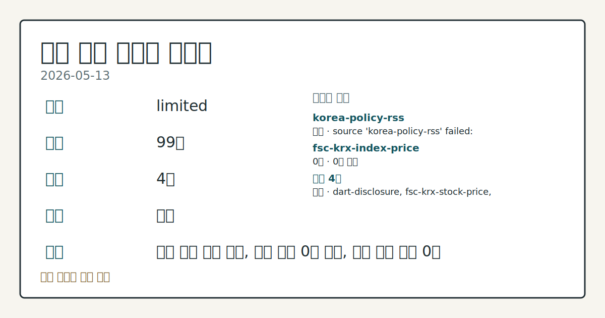
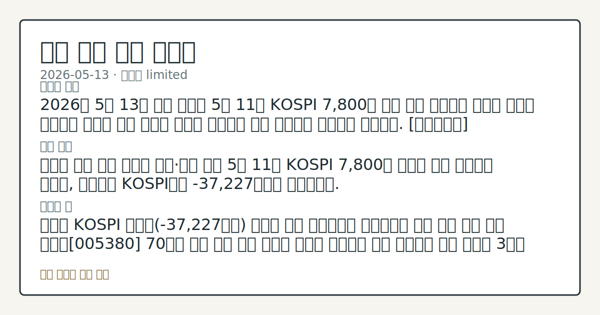
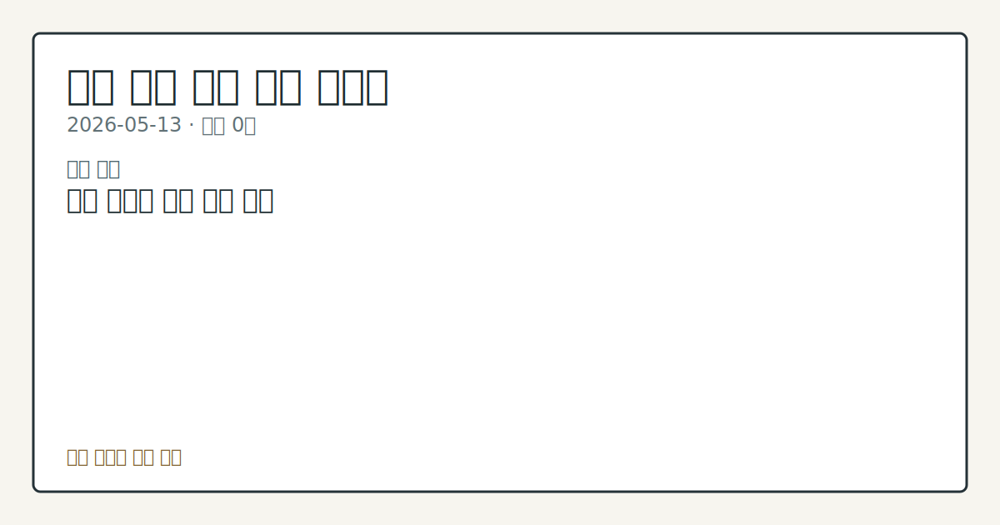

# 2026-05-13 국내 증시 시황

**기준 시각**: 2026-05-13 KST · [2026-05-12T15:00Z, 2026-05-13T15:00Z)

**세그먼트**: [국내 증시](2026-05-13.md) | [미국 증시](../../../us-equity/2026/05/2026-05-13.md) | [크립토](../../../crypto/2026/05/2026-05-13.md)

*이미지: 데이터 신뢰도 · 출처: investo 자체 생성 · 생성: investo 0.1.0 · 2026-05-14 UTC*

> **데이터 상태**: 제한 — 수집 99건 / 소스 4개 / 누락: 없음 · 제한 — 핵심 가격 소스 0건/실패/stale, 본문 결론 신뢰도 낮음
> **소스 카운트**: 수집 대상 6 / 성공 4 / 0건 1 / 실패 1 / 본문 사용 0
> **소스 등급 분포**: S=2 / A=1 / B=1
> **상세 사유**: 일부 소스 수집 실패, 일부 소스 0건 반환, 핵심 가격 소스 0건
> **소스별 상태**: korea-policy-rss 실패 (source 'korea-policy-rss' failed: malformed XML: syntax error: line 1, column 49), fsc-krx-index-price 0건, 정상 4개
> **내 관심 자산 영향**: 데이터 수집 부족으로 매칭 판단 보류 — 추가 수집 후 재평가됩니다.
> **오늘의 결론**: 2026년 5월 13일 국내 증시는 5월 11일 KOSPI 7,800선 돌파 이후 처음으로 외국인 대규모 순매도와 글로벌 긴축 우려가 동시에 부각되며 상승 기조에서 혼조세로 이동했다. [데이터부족]
> **핵심 동인**: ### 외국인 수급 이탈 지속과 개인·기관 방어 5월 11일 KOSPI 7,800선 돌파의 강세 흐름에서 이탈해, 외국인은 KOSPI에서 -37,227억원을 순매도했다.
> **주의할 점**: 외국인 KOSPI 순매도(-37,227억원) 기조가 다음 세션에서도 이어지는지 수급 방향 추세 확인 현대차[005380] 70만원 돌파 이후 로봇 관련주 전반의 연속성을 시장 흐름으로 점검 국고채 3년물 **3.635%** 수준이 미 PPI 충격 및 ECB 긴축 신호 이후 어떻게 움직이는지 금리 방향 데이터 비교 미·이란 협상 진전 속도(carryover 발원 2026-05-07, 미확인)와 IEA 원유 공급 부족 전망을 에너지 섹터 수급 흐름과 연계 관찰 HLB제약[047920] 유상증자 공시 이후 바

> 정보 제공용 자동 시황이며 매매 권유가 아닙니다.

## 한눈에 보기

- SK하이닉스[000660] **+7.68%**, 현대차[005380] 사상 첫 70만원 돌파로 반도체·로봇 대형주 중심 상승
- 외국인이 KOSPI에서 **-37,227억원** 순매도했으나 개인(**+18,868억원**)·기관(**+16,876억원**)이 수급 방어
- 미 4월 PPI(생산자물가지수) 전년대비 **+6.0%** 급등 — 국내 금리 경로 변수로 본문 §④ 참조

## ⓪ 오늘의 매크로

- **미 국채 수익률** — Immunefi to absorb Code4rena bug bounty customers after shutdown decision

## ① 요약

*이미지: 시장 스냅샷 · 출처: investo 자체 생성 · 생성: investo 0.1.0 · 2026-05-14 UTC*

2026년 5월 13일 국내 증시는 5월 11일 KOSPI 7,800선 돌파 이후 처음으로 외국인 대규모 순매도와 글로벌 긴축 우려가 동시에 부각되며 상승 기조에서 혼조세로 이동했다. 외국인은 KOSPI에서 **-37,227억원**을 순매도하며 5월 7일부터 이어진 수급 공방을 재연했고, 개인(**+18,868억원**)과 기관(**+16,876억원**)이 이를 받아내는 구도가 반복됐다. 대형주에서는 SK하이닉스[000660]가 **+7.68%** 급등하고 현대차[005380]가 사상 처음 70만원을 돌파하며 지수를 지탱했다. 한편 미국 4월 PPI가 전년대비 **+6.0%** 상승(2022년 이후 최대폭)을 기록하고 ECB(유럽중앙은행)가 6월 금리인상 신호를 발신하면서 대외 긴축 기류가 재부상했으며, 국내 국고채 3년물은 장중 상승 후 하락 전환해 연 **3.635%**로 마감됐다. [혼재]

## ② 전일 핵심 이슈

### 외국인 수급 이탈 지속과 개인·기관 방어

5월 11일 KOSPI 7,800선 돌파의 강세 흐름에서 이탈해, 외국인은 KOSPI에서 [**-37,227억원**](https://finance.naver.com/sise/investorDealTrendDay.naver?bizdate=20260513&sosok=01)을 순매도했다. 5월 7일 시황 이후 '미확인' 상태를 유지하던 외국인 수급 복귀 이슈는 이날도 해소되지 않았으며, 외국인 순매도 자금의 일부가 개인·기관 순매수로 전이되는 흐름이 관찰됐다. 개인과 기관의 합산 순매수가 외국인 순매도 규모를 하회하는 수급 불균형 구조가 이날도 이어졌다.

### 홍콩 ELS(주가연계증권) 제재안 이례적 반려와 상장규정 개정

금융위원회가 금감원이 제출한 홍콩 H지수(항셍중국기업지수) ELS 불완전판매 관련 [1.4조원 과징금 제재안을 이례적으로 반려](https://www.yna.co.kr/view/AKR20260513138151002)했다. 관련 은행·증권사의 향후 대응 방향이 금융 섹터 관찰 변수로 부상했다. 별도로 1천원 미만 '동전주' 상장폐지 요건을 담은 [상장규정 개정이 승인](https://www.yna.co.kr/view/AKR20260513160200008)되면서 한국 주식시장의 부실기업 정리 가속화가 예고됐다.

### 중동 전쟁 여파: PPI 급등과 원유 공급 부족 전망 (geopolitical_oil_macro)

미·이란 전쟁에 따른 에너지 가격 급등으로 미국 4월 PPI가 전년대비 [**+6.0%** 상승](https://www.yna.co.kr/view/AKR20260513176052072)(2022년 이후 최대폭), 전월대비 **+1.4%** 상승을 기록했다. IEA(국제에너지기구)는 [연말까지 전 세계 원유 공급 부족이 지속될 것](https://www.yna.co.kr/view/AKR20260513167400081)이라고 전망했다. 국내 증시에서는 이 지정학 리스크가 SK이노베이션[096770] 흑자전환의 주된 동인으로 작용, 원/달러 환율 경로와 에너지 재고 이익 증가를 통한 코스피 연관 효과가 실적으로 확인됐다.

## Watchlist Carryover

| 이벤트 | 발원일 | 기대일 | 상태 |
|--------|--------|--------|------|
| 외국인 수급 복귀 여부 | 2026-05-07 | 미정 | 미확인 |
| 미·이란 협상 진전 속도 | 2026-05-07 | 미정 | 미확인 |
| 코스피 7,490대 이후 추가 상승 여력 | 2026-05-07 | 미정 | 미확인 |
| 방산·조선 실적 시즌 마무리 점검 | 2026-05-07 | 미정 | 미확인 |
| 바이오·헬스케어 애프터마켓 급등 후속 흐름 | 2026-05-07 | 미정 | 미확인 |

## ③ 섹터/수급 동향

### KOSPI·KOSDAQ 투자자별 수급

| 시장 | 개인 | 외국인 | 기관 | 기타 |
|------|------|--------|------|------|
| KOSPI | +18,868억원 | -37,227억원 | +16,876억원 | +1,482억원 |
| KOSDAQ | +5,899억원 | -6,016억원 | +39억원 | +78억원 |

*출처: [Naver Finance KRX 미러](https://finance.naver.com/sise/investorDealTrendDay.naver?bizdate=20260513&sosok=01)*

외국인은 KOSPI·KOSDAQ 양 시장에서 순매도를 유지했다. KOSDAQ은 개인 순매수(+5,899억원)와 외국인 순매도(-6,016억원)가 거의 균형을 이루는 구도로, 기관과 기타(+78억원)의 영향은 미미했다.

### 테마별 관찰

로봇·자동화 테마에서 현대차[005380]의 70만원 돌파가 두드러졌으며, 반도체 섹터는 SK하이닉스[000660]의 **+7.68%** 급등이 주도하고 삼성전자[005930]도 동반 상승했다. 에너지·정유 섹터에서는 SK이노베이션[096770] 흑자전환 및 한국전력 1분기 실적 발표가 관심을 모았다. 바이오 섹터는 HLB제약[047920] 유상증자 공시 후 애프터마켓 급락과 여타 코스닥 종목들의 급등이 혼재하며 종목별 차별화가 진행됐다.

## ④ 지표·이벤트

### 국고채 금리 하락 전환 마감

국고채 금리는 장중 일제히 상승 후 [하락 전환해 마감](https://www.yna.co.kr/view/AKR20260513150000008)했으며, 3년물은 연 **3.635%**를 기록했다. 미국 PPI 충격에도 국내 채권금리가 하락 전환한 점은 내외 금리 방향성의 차별화를 시사하는 흐름이다.

### 미 PPI 발표와 ECB 정책 신호

미 4월 PPI는 전년대비 **+6.0%**(2022년 이후 최대), 전월대비 **+1.4%**(4년 만에 최대) 상승해 [뉴욕증시는 혼조 출발](https://www.yna.co.kr/view/AKR20260513179900009)(us-equity 세그먼트 마감 기준)했다. ECB는 [중동전쟁발 인플레이션을 이유로 6월 금리인상 쪽에 무게를 두고 있다](https://www.yna.co.kr/view/AKR20260513166700082)고 밝혔다.

### DART 주요 공시 동향

케이티, 스마트레이더시스템, DXVX, 한울반도체 등 주요 기업이 임원·주요주주 특정증권 소유 변동 공시를 다수 제출했다. DXVX의 주식 대량보유 상황 보고(일반)도 접수됐다.

## ⑤ 주요 종목

### 실적 발표

| 종목 | 주요 내용 |
|------|-----------|
| 한국전력 | 1분기 영업이익 3조7,842억원 (+0.8% YoY). [2분기부터 중동전쟁 영향 본격화](https://www.yna.co.kr/view/AKR20260513129251527) 전망 |
| SK이노베이션[096770] | [1분기 흑자전환](https://www.yna.co.kr/view/AKR20260513127352527). 중동 분쟁 유가 급등에 따른 재고 이익 증가 반영 |
| SK네트웍스 | [1분기 영업이익 334억원, 전년 대비 +102%](https://www.yna.co.kr/view/AKR20260513170200003) |
| 에이블씨엔씨[078520] | [1분기 영업이익 94억원](https://www.yna.co.kr/view/AKR20260513155200030) (전년 동기 49억원 대비 약 2배 증가) |

### 급등·급락 관찰

| 종목 | 동향 |
|------|------|
| [현대차[005380]](https://www.yna.co.kr/view/AKR20260513128251008) | 로봇 사업 기대감에 약 +10% 급등, 사상 첫 70만원 돌파 |
| SK하이닉스[000660] | +7.68% (+141,000원), 종가 1,976,000원 |
| 삼성전자[005930] | +1.79% (+5,000원), 종가 284,000원 |
| 필에너지[378340] | 애프터마켓 +10%대 급등 |
| 대화제약[067080] | 애프터마켓 +10%대 급등 |
| 윤성에프앤씨[372170] | 애프터마켓 +10%대 급등 |
| 경동나비엔[009450] | 애프터마켓 +10%대 급등 |
| [HLB제약[047920]](https://www.yna.co.kr/view/AKR20260513153100008) | 애프터마켓 -10%대 급락 (1,200억원 유상증자 결정 후) |

### 유상증자 체크리스트

- [HLB제약[047920]](https://www.yna.co.kr/view/AKR20260513148800008): 1,200억원 주주배정 후 실권주 일반공모 유상증자 결정
- [하이퍼코퍼레이션[065650]](https://www.yna.co.kr/view/AKR20260513147900008): 200억원 주주배정 유상증자 결정

## ⑥ 오늘의 관전 포인트

*이미지: 관심 자산 관련성 · 출처: investo 자체 생성 · 생성: investo 0.1.0 · 2026-05-14 UTC*

- 외국인 KOSPI 순매도 기조가 다음 세션에서도 이어지는지 수급 방향 추세 확인
- 현대차[005380] 70만원 돌파 이후 로봇 관련주 전반의 연속성을 시장 흐름으로 점검
- 국고채 3년물 **3.635%** 수준이 미 PPI 충격 및 ECB 긴축 신호 이후 어떻게 움직이는지 금리 방향 데이터 비교
- 미·이란 협상 진전 속도와 IEA 원유 공급 부족 전망을 에너지 섹터 수급 흐름과 연계 관찰
- HLB제약[047920] 유상증자 공시 이후 바이오·헬스케어 섹터 전반 애프터마켓 흐름 데이터 비교

📑 트레이스 + 서명 (Stage 1/2)

- `input_hash`: `f0857b8b51a9`
- `stage1_hash`: `592c5a1fefb2`
- `stage2_hash`: `52508ec8d07d`

| 항목 ID | 소스 | 카테고리 | 섹션 | 제목 |
|---------|------|----------|------|------|
| 0 | dart-disclosure | news | — | [DART] 이지스밸류플러스리츠 - 현금ㆍ현물배당을위한주주명부폐쇄(기준일)결정 |
| 1 | dart-disclosure | news | 5 | [DART] 파크시스템스 - 주요사항보고서(자기주식처분결정) |
| 2 | dart-disclosure | news | 5 | [DART] 다이나믹솔루션 - 주요사항보고서 |
| 3 | dart-disclosure | news | 5 | [DART] 세니젠 - 최대주주변경 |
| 4 | dart-disclosure | news | 5 | [DART] 세니젠 - 증권발행결과(자율공시) (제3자배정 유상증자) |
| 5 | dart-disclosure | news | 5 | [DART] 한국카본 - [기재정정]주요사항보고서 |
| 6 | dart-disclosure | news | 5 | [DART] 스마트레이더시스템 - 임원ㆍ주요주주특정증권등소유상황보고서 |
| 7 | dart-disclosure | news | — | [DART] 신안우이해상풍력 - 유상증자결정 |
| 8 | dart-disclosure | news | 5 | [DART] 케이티 - 임원ㆍ주요주주특정증권등소유상황보고서 |
| 9 | dart-disclosure | news | — | [DART] DXVX - 임원ㆍ주요주주특정증권등소유상황보고서 |
| 10 | dart-disclosure | news | — | [DART] 케이티 - 임원ㆍ주요주주특정증권등소유상황보고서 |
| 11 | dart-disclosure | news | — | [DART] 스마트레이더시스템 - 임원ㆍ주요주주특정증권등소유상황보고서 |
| 12 | dart-disclosure | news | — | [DART] DXVX - 주식등의대량보유상황보고서(일반) |
| 13 | dart-disclosure | news | — | [DART] 빛과전자 - 주식등의대량보유상황보고서 |
| 14 | dart-disclosure | news | — | [DART] 한울반도체 - 주식등의대량보유상황보고서 |
| 15 | dart-disclosure | news | — | [DART] 애머릿지 - [첨부정정]주요사항보고서 |
| 16 | dart-disclosure | news | — | [DART] 젬백스 - 주식등의대량보유상황보고서 |
| 17 | fsc-krx-stock-price | price | — | 삼성전자[005930] 284,000원 (+1.79%, +5,000) |
| 18 | fsc-krx-stock-price | price | 5 | SK하이닉스[000660] 1,976,000원  |
| 19 | fsc-krx-stock-price | price | 5 | NAVER[035420] 201,500원 (-1.23%, -2,500) |
| 20 | fsc-krx-stock-price | price | 5 | 현대차[005380] 710,000원  |
| 21 | fsc-krx-stock-price | price | 5 | 셀트리온[068270] 190,500원  |
| 22 | krx-foreign-flows | price | 5 | KOSPI 개인 순매수 +18,868억원 (2026-05-13) |
| 23 | krx-foreign-flows | price | 3 | KOSPI 외국인 순매도 -37,227억원 (2026-05-13) |
| 24 | krx-foreign-flows | price | 3 | KOSPI 기관 순매수 +16,876억원 (2026-05-13) |
| 25 | krx-foreign-flows | price | 3 | KOSPI 기타 순매수 +1,482억원 (2026-05-13) |
| 26 | krx-foreign-flows | price | 3 | KOSDAQ 개인 순매수 +5,899억원 (2026-05-13) |
| 27 | krx-foreign-flows | price | 3 | KOSDAQ 외국인 순매도 -6,016억원 (2026-05-13) |
| 28 | krx-foreign-flows | price | 3 | KOSDAQ 기관 순매수 +39억원 (2026-05-13) |
| 29 | krx-foreign-flows | price | 3 | KOSDAQ 기타 순매수 +78억원 (2026-05-13) |
| 30 | yonhap-market | news | 3 | 뉴욕증시, 뜨거운 4월 PPI 반영하며 혼조 출발 |
| 31 | yonhap-market | news | 4 | 미 4월 도매물가 전년대비 6.0%↑…2022년이후 최대폭 상승(종합) |
| 32 | yonhap-market | news | 4 | [2보] 미 4월 도매물가 전월대비 1.4%↑…4년 만에 최대폭 |
| 33 | yonhap-market | news | 4 | [1보] 미 4월 도매물가 전월대비 1.4%↑…전망 대폭 상회 |
| 34 | yonhap-market | news | 4 | SK네트웍스 1분기 영업이익 334억원…전년 대비 102％ 증가 |
| 35 | yonhap-market | news | 5 | 日닛산 작년 5조원대 순손실…2년 연속 대규모 적자 |
| 36 | yonhap-market | news | — | IEA "연말까지 원유 공급 부족 전망…중동 전쟁 여파" |
| 37 | yonhap-market | news | 2 | ECB, 6월 금리인상 무게…"전쟁 끝나도 당분간 인플레" |
| 38 | yonhap-market | news | 4 | 금융위, 금감원에 1.4조 홍콩 ELS 과징금 제재안 이례적 반려(종합) |
| 39 | yonhap-market | news | 2 | 1천원 미만 '동전주' 상장폐지 초읽기…韓주식시장 물갈이 예고 |
| 40 | yonhap-market | news | 2 | [특징주] 현대차 사상 첫 70만원 돌파…로봇 관련주 급등(종합) |
| 41 | yonhap-market | news | 5 | SK이노 1분기 흑자전환…"울산단지 개편 최종안 연내 도출"(종합2보) |
| 42 | yonhap-market | news | 5 | 에이블씨엔씨 1분기 영업이익 94억원…전년 동기 대비 2배 증가 |
| 43 | yonhap-market | news | 5 | HLB제약, 애프터마켓서 10%대 급락 |
| 44 | yonhap-market | news | 5 | 국고채 금리 상승후 하락전환 마감…3년물 연 3.635%(종합) |
| 45 | yonhap-market | news | 4 | 하이퍼코퍼레이션, 200억원 주주배정 유상증자 결정 |
| 46 | yonhap-market | news | 5 | HLB제약, 1천200억원 주주배정 유상증자 결정 |
| 47 | yonhap-market | news | 5 | 필에너지, 애프터마켓서 10%대 급등 |
| 48 | yonhap-market | news | 5 | 대화제약, 애프터마켓서 10%대 급등 |
| 49 | yonhap-market | news | 5 | 윤성에프앤씨, 애프터마켓서 10%대 급등 |
| 50 | yonhap-market | news | 5 | 경동나비엔, 애프터마켓서 10%대 급등 |
| 51 | yonhap-market | news | 5 | 국고채 금리 일제히 하락…3년물 연 3.635% |
| 52 | yonhap-market | news | 4 | 한국거래소, '금감원 출신' 파생본부장 선임…노조 반발 격화 |
| 53 | yonhap-market | news | — | 한전 1분기 영업익 3조7천842억원…중동전쟁 영향 2분기 본격화(종합) |

## ⑦ 면책조항
본 시황은 일반 정보 제공을 목적으로 자동 생성된 자료이며,
특정 종목·자산에 대한 매매 권유나 투자 자문이 아닙니다.
투자 결정과 그 결과에 대한 책임은 전적으로 본인에게 있으며,
본 시황의 내용에 따라 발생한 손실에 대해 작성자는 일체의 책임을 지지 않습니다.