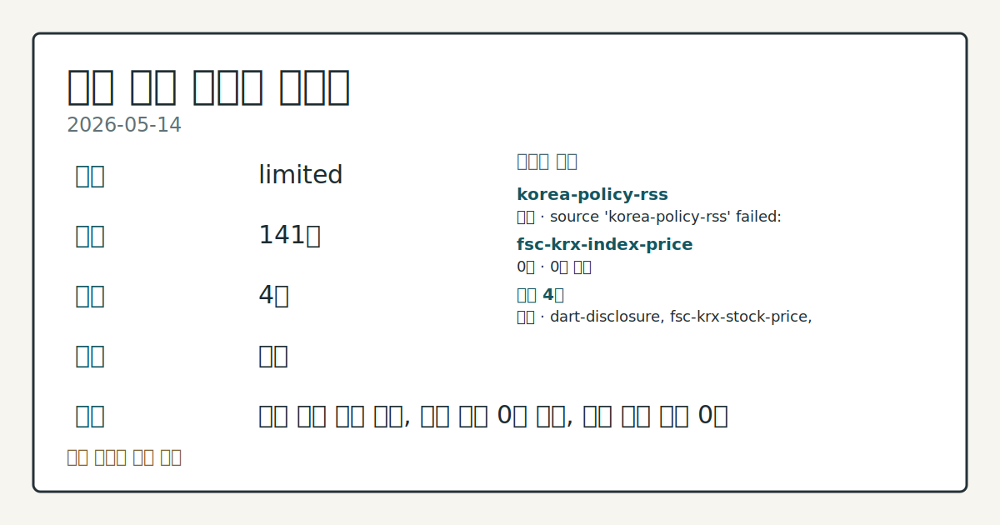
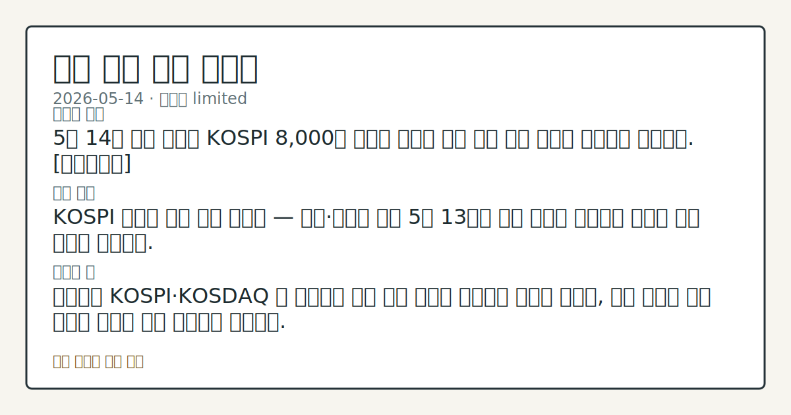
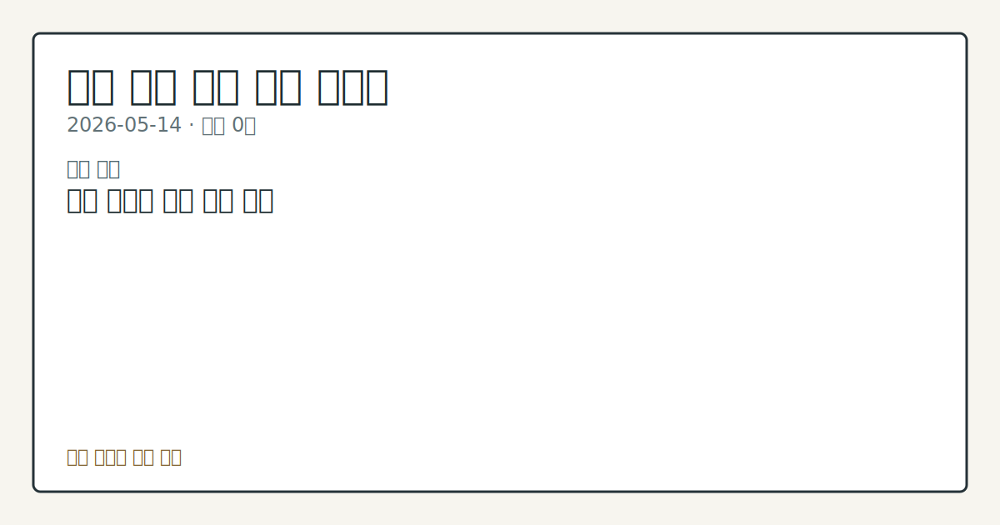

# 2026-05-14 국내 증시 시황

**기준 시각**: 2026-05-14 KST · [2026-05-13T15:00Z, 2026-05-14T15:00Z)

**세그먼트**: [국내 증시](2026-05-14.md) | [미국 증시](../../../us-equity/2026/05/2026-05-14.md) | [크립토](../../../crypto/2026/05/2026-05-14.md)

*이미지: 데이터 신뢰도 · 출처: investo 자체 생성 · 생성: investo 0.1.0 · 2026-05-14 UTC*

> **데이터 상태**: 제한 — 수집 141건 / 소스 4개 / 누락: 없음 · 제한 — 핵심 가격 소스 0건/실패/stale, 본문 결론 신뢰도 낮음
> **소스 카운트**: 수집 대상 6 / 성공 4 / 0건 1 / 실패 1 / 본문 사용 0
> **소스 등급 분포**: S=2 / A=1 / B=1
> **상세 사유**: 일부 소스 수집 실패, 일부 소스 0건 반환, 핵심 가격 소스 0건
> **소스별 상태**: korea-policy-rss 실패 (source 'korea-policy-rss' failed: malformed XML: syntax error: line 1, column 49), fsc-krx-index-price 0건, 정상 4개
> **내 관심 자산 영향**: 데이터 수집 부족으로 매칭 판단 보류 — 추가 수집 후 재평가됩니다.
> **오늘의 결론**: 5월 14일 국내 증시는 KOSPI 8,000선 돌파를 목전에 두며 사상 최고 수준의 분위기를 이어갔다. [데이터부족]
> **핵심 동인**: ### KOSPI 외국인 이틀 연속 순매도 — 개인·기관이 방어 5월 13일에 이어 오늘도 외국인의 대규모 이탈 기조가 이어졌다.
> **주의할 점**: 외국인이 KOSPI·KOSDAQ 양 시장에서 이틀 연속 대규모 순매도를 이어간 가운데, 다음 거래일 수급 방향을 외국인 매매 데이터로 추적한다.

> 정보 제공용 자동 시황이며 매매 권유가 아닙니다.

## 한눈에 보기

- KOSPI 8,000선 돌파를 목전에 두고 사상 최고 수준을 유지하는 가운데, 외국인이 **-21,450억원**을 순매도하고 개인이 **+18,499억원**으로 방어하며 5월 13일에 이어 이틀 연속 수급 공방이 지속됐다.
- 10개 국내 대형 증권사가 1분기 합산 **4.3조원**을 벌어들이며 작년 연간 실적의 **48%**를 단 분기 만에 달성, '투자의 시대' 수혜가 수치로 확인됐다.
- 일본 국채(JGB) 금리 급등이 국내로 전이되며 3년물 국고채 금리가 연 **3.654%**까지 상승 전환 — 밸류에이션(기업가치 산정) 부담 변수로 §④에서 흐름을 점검한다.

## ⓪ 오늘의 매크로

- **미 국채 수익률** — ‘Decisive turning point’: Crypto industry cheers Clarity Act’s progress as ethics questions linger ahead of next vote

## ① 요약

*이미지: 시장 스냅샷 · 출처: investo 자체 생성 · 생성: investo 0.1.0 · 2026-05-14 UTC*

5월 14일 국내 증시는 KOSPI 8,000선 돌파를 목전에 두며 사상 최고 수준의 분위기를 이어갔다. 외국인이 KOSPI에서 **-21,450억원**을 순매도하며 5월 13일에 이어 이탈 기조를 연장했고, 개인이 **+18,499억원**을 순매수해 지수를 지지했다. 증권사 섹터는 1분기 사상 최대 실적을 잇달아 발표하며 증시 호황의 수혜를 실적으로 확인했다. 그러나 JGB 금리 급등이 국내 채권 시장으로 전이되면서 3년물 국고채 금리가 연 **3.654%**로 상승 전환, 지수 상방 기조와 채권 금리 상승 압력이 동시에 존재하는 혼재된 하루였다. [혼재]

## ② 전일 핵심 이슈

### KOSPI 외국인 이틀 연속 순매도 — 개인·기관이 방어

5월 13일에 이어 오늘도 외국인의 대규모 이탈 기조가 이어졌다. [KOSPI에서 외국인이 **-21,450억원**을 순매도](https://finance.naver.com/sise/investorDealTrendDay.naver?bizdate=20260514&sosok=01)한 반면, 개인은 **+18,499억원**, 기관은 **+1,927억원**을 각각 순매수해 지수를 받쳤다. KOSDAQ에서도 같은 패턴이 반복됐다 — 외국인 **-1,349억원** 순매도 대비 개인 **+911억원** + 기관 **+595억원** 순매수. KOSPI 8,000선 목전에서 외국인이 매도 우위를 유지하면서도 지수가 지지되는 흐름이 이틀째 관찰됐다.

### 증권사 1분기 사상 최대 실적 — '투자의 시대' 수혜 수치화

[국내 10개 대형 증권사가 1분기 합산 **4.3조원**을 벌어들이며 작년 1년치 실적의 **48%**를 단 분기 만에 달성했다](https://www.yna.co.kr/view/AKR20260514163100008)고 연합뉴스가 보도했다. KOSPI 8,000선 목전까지 오른 환경에서 위탁매매 수수료와 자기매매 수익이 동시에 크게 개선된 결과다. [은행 중심 금융권의 위상을 흔들 만큼 증권사 실적이 격차를 벌리고 있다](https://www.yna.co.kr/view/AKR20260514153600008)는 분석도 제기됐다.

### 미·중 정상회담 기대 — KOSPI 수출주 수급 연결 경로

미·중 정상회담 기대감에 따른 리스크 온(위험자산 선호) 분위기가 형성되며, KOSPI 반도체·자동차 등 수출 관련 종목의 외국인 수급 전환 여부가 연결 고리로 확인되는 흐름이다.

## ③ 섹터/수급 동향

### 투자자별 수급 — KOSPI·KOSDAQ 동반 공방 구도

[KOSPI 기준](https://finance.naver.com/sise/investorDealTrendDay.naver?bizdate=20260514&sosok=01) 외국인 **-21,450억원** 순매도, 개인 **+18,499억원** + 기관 **+1,927억원** + 기타 **+1,024억원** 순매수. [KOSDAQ 기준](https://finance.naver.com/sise/investorDealTrendDay.naver?bizdate=20260514&sosok=02) 외국인 **-1,349억원** 순매도, 개인 **+911억원** + 기관 **+595억원** 순매수, 기타 **-158억원** 순매도. 양 시장 모두 외국인이 이탈하고 개인·기관이 흡수하는 구조가 유지됐다.

### 1분기 실적 시즌 — 섹터별 양극화

금융·증권 섹터 호실적이 두드러진 가운데, 게임 섹터에서는 넥슨·크래프톤[259960] 중심의 실적 양극화가 확인됐다. 레저·관광 섹터에서 롯데관광개발[032350]이 전년 동기 대비 대폭 개선된 실적을 발표했고, 항공 섹터에서는 아시아나항공이 적자 폭이 확대됐다.

### 대량보유 공시 동향

DART(금융감독원 전자공시시스템)에 엘티씨와 청담글로벌이 [주식 대량보유상황보고서(일반)](https://dart.fss.or.kr)를 각각 제출했다. 보유 목적 및 지분율 변동 세부 내역은 공시 원문 기준으로 확인한다.

## ④ 지표·이벤트

### 국고채 금리 상승 전환 — JGB 급등 전이

[일본 국채 금리 급등의 영향으로 국내 국고채 금리가 일제히 상승 전환했다.](https://www.yna.co.kr/view/AKR20260514153151008) 3년물 국고채 금리는 연 **3.654%**를 기록했다. 금리 상승은 고PER(주가수익비율) 성장주의 할인율 상승 요인으로 작용할 수 있어 밸류에이션 부담 변수로 점검한다.

### 해외 매크로 배경 지표 — 국내 수출 환경과의 연결

미국 4월 소매판매는 [전월 대비 **+0.5%** 증가에 그쳐](https://www.yna.co.kr/view/AKR20260514184200072) 고유가 영향으로 증가세가 크게 둔화됐다. 프랑스 1분기 실업률은 [**8.1%**로 코로나19 이후 최고 수준](https://www.yna.co.kr/view/AKR20260514172700081)을 기록했다. 두 지표는 국내 수출 기업의 해외 수요 환경을 비교하는 배경 데이터로 확인한다.

## ⑤ 주요 종목

### 실적 발표 — 어닝 시즌(기업 실적 발표 시기) 주요 결과

| 종목 | 주요 내용 |
|------|-----------|
| SK스퀘어[402340] | 1분기 영업익 **8조2천783억원** — 분기 기준 사상 최대 (SK하이닉스 호실적 반영) |
| 한국투자증권 | 1분기 영업익 1조원 육박 — 전년 대비 **+85%** 증가 |
| 메리츠금융지주[138040] | 1분기 순이익 **6,802억원** — 전년 동기 대비 **+9.6%** 증가 |
| 롯데관광개발[032350] | 1분기 영업익 **288억원** — 전년 동기 대비 **2.2배** 증가 |
| 아시아나항공 | 1분기 영업손실 **1,013억원** — 전년(79억원 손실) 대비 적자 폭 확대 |
| 넥슨·크래프톤[259960] | 게임업계 1분기 양극화 — NK 쌍두마차 체제 흐름 유지 확인 |

### 주요 공시 체크리스트

- **금호타이어[073240]**: 폴란드 타이어 제조·판매 자회사 주식 **596억원**에 추가 취득 공시
- **이마트**: 종속회사 신세계건설에 **5,000억원** 규모 유상증자(신주 발행을 통한 자금 조달) 추진 — 재무구조 개선 목적
- **일양약품[007570]**: 중국 건강기능식품 제조·판매 자회사에 **176억원** 출자 결정
- **SV인베스트먼트**: 현금·현물 배당 결정 공시
- **블루산업개발**: 전환사채권 발행 결정 기재 정정 공시

### 시간외 거래 동향

- **대명에너지[389260]**: 애프터마켓(시간외 거래)에서 **10%**대 급등 관찰
- **서흥[008490]**: 애프터마켓에서 **10%**대 급등 관찰

## ⑥ 오늘의 관전 포인트

*이미지: 관심 자산 관련성 · 출처: investo 자체 생성 · 생성: investo 0.1.0 · 2026-05-14 UTC*

- 외국인이 KOSPI·KOSDAQ 양 시장에서 이틀 연속 대규모 순매도를 이어간 가운데, 다음 거래일 수급 방향을 외국인 매매 데이터로 추적한다.
- 3년물 국고채 금리 **3.654%** 수준이 KOSPI 8,000선 전후 고밸류에이션 종목의 투자 심리에 미치는 파급을 채권·주식 병행 흐름으로 점검한다.
- 증권 섹터 역대급 실적 발표 이후 금융주 수급 변화와 섹터 내 종목별 편차를 관찰한다.
- 미·중 정상회담 후속 내용이 국내 반도체·수출 관련 KOSPI 종목의 외국인 수급에 어떻게 반영되는지 매매 데이터를 확인한다.
- 대명에너지[389260]·서흥[008490]의 시간외 급등 배경 요인을 다음 거래일 공시 내용과 비교한다.

📑 트레이스 + 서명 (Stage 1/2)

- `input_hash`: `5bc0fd870ff6`
- `stage1_hash`: `457d1cb4a914`
- `stage2_hash`: `a85fbf7cb45c`

| 항목 ID | 소스 | 카테고리 | 섹션 | 제목 |
|---------|------|----------|------|------|
| 0 | dart-disclosure | news | — | [DART] SV인베스트먼트 - 현금ㆍ현물배당결정 |
| 1 | dart-disclosure | news | 5 | [DART] 블루산업개발 - [기재정정]주요사항보고서(전환사채권발행결정) |
| 2 | dart-disclosure | news | 5 | [DART] 엔피 - [기재정정]주요사항보고서 |
| 3 | dart-disclosure | news | 5 | [DART] 에스아이리소스 - [기재정정]주요사항보고서 |
| 4 | dart-disclosure | news | 5 | [DART] 대양금속 - 유상증자또는주식관련사채등의청약결과(자율공시) |
| 5 | dart-disclosure | news | 5 | [DART] 고려제강 - 임원ㆍ주요주주특정증권등소유상황보고서 |
| 6 | dart-disclosure | news | 5 | [DART] 젬백스 - [기재정정]최대주주변경을수반하는주식담보제공계약체결 |
| 7 | dart-disclosure | news | 5 | [DART] 이노스페이스 - 임원ㆍ주요주주특정증권등소유상황보고서 |
| 8 | dart-disclosure | news | 5 | [DART] 이노스페이스 - 임원ㆍ주요주주특정증권등소유상황보고서 |
| 9 | dart-disclosure | news | 5 | [DART] 고려제강 - 임원ㆍ주요주주특정증권등소유상황보고서 |
| 10 | dart-disclosure | news | 5 | [DART] 이노스페이스 - 임원ㆍ주요주주특정증권등소유상황보고서 |
| 11 | dart-disclosure | news | 5 | [DART] 이노스페이스 - 임원ㆍ주요주주특정증권등소유상황보고서 |
| 12 | dart-disclosure | news | 5 | [DART] 엘티씨 - 주식등의대량보유상황보고서(일반) |
| 13 | dart-disclosure | news | 3 | [DART] 애머릿지 - [기재정정]주요사항보고서 |
| 14 | dart-disclosure | news | 5 | [DART] 엑스페릭스 - 기타경영사항(자율공시) (제3회 신주인수권부사채 만기전 취득 후 재매각) |
| 15 | dart-disclosure | news | 5 | [DART] 알엔티엑스 - [기재정정]주요사항보고서 |
| 16 | dart-disclosure | news | 5 | [DART] 알엔티엑스 - [기재정정]주요사항보고서 |
| 17 | dart-disclosure | news | 5 | [DART] 청담글로벌 - 주식등의대량보유상황보고서 |
| 18 | fsc-krx-stock-price | price | 3 | 삼성전자[005930] 284,000원 (+1.79%, +5,000) |
| 19 | fsc-krx-stock-price | price | 5 | SK하이닉스[000660] 1,976,000원  |
| 20 | fsc-krx-stock-price | price | 5 | NAVER[035420] 201,500원 (-1.23%, -2,500) |
| 21 | fsc-krx-stock-price | price | 5 | 현대차[005380] 710,000원  |
| 22 | fsc-krx-stock-price | price | 5 | 셀트리온[068270] 190,500원  |
| 23 | krx-foreign-flows | price | 5 | KOSPI 개인 순매수 +18,499억원 (2026-05-14) |
| 24 | krx-foreign-flows | price | 3 | KOSPI 외국인 순매도 -21,450억원 (2026-05-14) |
| 25 | krx-foreign-flows | price | 3 | KOSPI 기관 순매수 +1,927억원 (2026-05-14) |
| 26 | krx-foreign-flows | price | 3 | KOSPI 기타 순매수 +1,024억원 (2026-05-14) |
| 27 | krx-foreign-flows | price | 3 | KOSDAQ 개인 순매수 +911억원 (2026-05-14) |
| 28 | krx-foreign-flows | price | 3 | KOSDAQ 외국인 순매도 -1,349억원 (2026-05-14) |
| 29 | krx-foreign-flows | price | 3 | KOSDAQ 기관 순매수 +595억원 (2026-05-14) |
| 30 | krx-foreign-flows | price | 3 | KOSDAQ 기타 순매도 -158억원 (2026-05-14) |
| 31 | yonhap-market | news | 3 | 뉴욕증시, 미·중 정상회담 주목하며 상승 출발 |
| 32 | yonhap-market | news | 2 | 美 4월 소매판매 0.5%↑…고유가에 증가세 둔화 |
| 33 | yonhap-market | news | 4 | 증권사들 역대급 실적…'투자의 시대'에 은행 중심 금융권 흔들 |
| 34 | yonhap-market | news | 3 | 프랑스 1분기 실업률 8.1%…코로나19 이후 최고 |
| 35 | yonhap-market | news | 4 | 금호타이어 "폴란드 자회사 주식 596억원에 추가취득" |
| 36 | yonhap-market | news | 5 | AI 방산 시장 주름잡는 팔란티어…퇴짜 놓은 독일 |
| 37 | yonhap-market | news | 2 | SK스퀘어, 하이닉스 호실적에 1분기 영업익 사상 최대 |
| 38 | yonhap-market | news | 5 | 넥슨·크래프톤 또 날았다…게임업계 실적 양극화 |
| 39 | yonhap-market | news | 5 | '불장'에 10개 증권사 1분기 4.3조 벌었다…작년 1년치의 48% |
| 40 | yonhap-market | news | 3 | 메리츠금융 1분기 순이익 6천802억원…작년 동기대비 9.6%↑(종합2보) |
| 41 | yonhap-market | news | 5 | 아시아나항공, 1분기 영업손실 1천13억원…적자 확대 |
| 42 | yonhap-market | news | 5 | 대명에너지, 애프터마켓서 10%대 급등 |
| 43 | yonhap-market | news | 5 | 롯데관광개발 1분기 영업익 288억원…전년 동기 대비 2.2배 증가 |
| 44 | yonhap-market | news | 5 | 일양약품 "자회사 일양약품에 176억원 출자" |
| 45 | yonhap-market | news | 5 | 이마트, 신세계건설에 5천억 규모 유상증자…"재무구조 개선"(종합) |
| 46 | yonhap-market | news | 5 | 日금리 급등에 국고채 금리 상승 전환…3년물 연 3.654%(종합) |
| 47 | yonhap-market | news | 4 | [부고] 임정욱(금융감독원 선임조사역)씨 모친상 |
| 48 | yonhap-market | news | — | 서흥, 애프터마켓서 10%대 급등 |
| 49 | yonhap-market | news | 5 | 한투증권, 1분기 영업익 1조원 육박…전년 대비 85% 증가(종합) |
| 50 | yonhap-market | news | 5 | 국고채 금리 일제히 상승…3년물 연 3.654% |
| 51 | yonhap-market | news | 4 | [표] 코스피 지수선물·옵션 시세표(14일)-3 |
| 52 | yonhap-market | news | — | [표] 코스피 지수선물·옵션 시세표-2 |
| 53 | yonhap-market | news | — | [표] 코스피 지수선물·옵션 시세표-1 |
| 54 | yonhap-market | news | — | 메리츠금융 1분기 순이익 6천802억원…작년 동기대비 9.6%↑(종합) |

## ⑦ 면책조항
본 시황은 일반 정보 제공을 목적으로 자동 생성된 자료이며,
특정 종목·자산에 대한 매매 권유나 투자 자문이 아닙니다.
투자 결정과 그 결과에 대한 책임은 전적으로 본인에게 있으며,
본 시황의 내용에 따라 발생한 손실에 대해 작성자는 일체의 책임을 지지 않습니다.