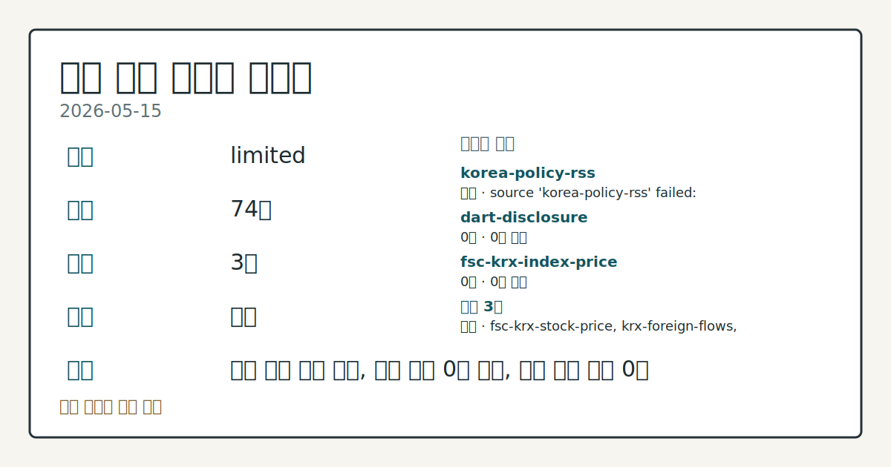
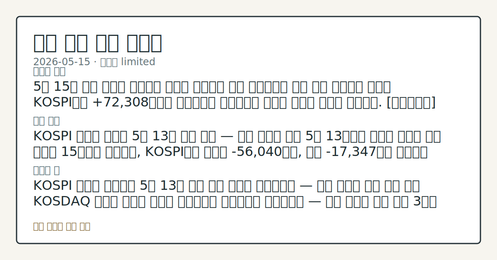
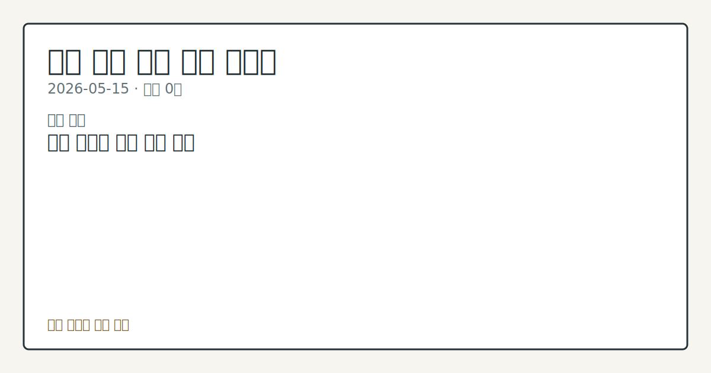

# 2026-05-15 국내 증시 시황

**기준 시각**: 2026-05-15 KST · [2026-05-14T15:00Z, 2026-05-15T15:00Z)

**세그먼트**: [국내 증시](2026-05-15.md) | [미국 증시](../../../us-equity/2026/05/2026-05-15.md) | [크립토](../../../crypto/2026/05/2026-05-15.md)

*이미지: 데이터 신뢰도 · 출처: investo 자체 생성 · 생성: investo 0.1.0 · 2026-05-17 UTC*

> **데이터 상태**: 제한 — 수집 74건 / 소스 3개 / 누락: 없음 · 제한 — 핵심 가격 소스 0건/실패/stale, 본문 결론 신뢰도 낮음
> **소스 카운트**: 수집 대상 6 / 성공 3 / 0건 2 / 실패 1 / 본문 사용 0
> **소스 등급 분포**: S=1 / A=1 / B=1
> **상세 사유**: 일부 소스 수집 실패, 일부 소스 0건 반환, 핵심 가격 소스 0건
> **소스별 상태**: korea-policy-rss 실패 (source 'korea-policy-rss' failed: malformed XML: syntax error: line 1, column 49), dart-disclosure 0건, fsc-krx-index-price 0건, 정상 3개
> **내 관심 자산 영향**: 데이터 수집 부족으로 매칭 판단 보류 — 추가 수집 후 재평가됩니다.
> **용어 가이드**: 이번 시황에서 처음 등장한 용어 — ETF(상장지수펀드)
> **오늘의 결론**: 5월 15일 국내 증시는 외국인의 대규모 순매도와 금리 급등이라는 이중 압박 속에서도 개인이 KOSPI에서 +72,308억원을 순매수하며 지난주부터 이어진 버티기 흐름을 연장했다. [데이터부족]
> **핵심 동인**: ### KOSPI 외국인 순매도 5월 13일 이후 연속 — 개인 역대급 방어 5월 13일부터 이어진 외국인 매도 기조가 15일에도 지속되며, KOSPI에서 외국인 -56,040억원, 기관 -17,347억원 순매도가 기록됐다.
> **주의할 점**: KOSPI 외국인 순매도가 5월 13일 이후 연속 기조를 이어가는지 — 매도 강도와 기간 추세 확인 KOSDAQ 외국인 순매수 전환이 단발성인지 연속성으로 이어지는지 — 일별 데이터 흐름 비교 3년물 국고채 **3.766%** 이후 추가 금리 변동 — 글로벌 인플레이션 지표 및 원자재 가격 변동 관찰 애프터마켓에서 10%대 급락한 한미반도체[042700]·에이디테크놀로지[200710]·비나텍[126340]의 정규장 반응 흐름 점검 5월 27일 단일종목 레버리지 ETF 출시를 앞두고 기초 종목들의 단기 거

> 정보 제공용 자동 시황이며 매매 권유가 아닙니다.

## 한눈에 보기

- KOSPI(한국종합주가지수) 개인 **+72,308억원** 순매수 vs. 외국인 **-56,040억원** 순매도 — 5월 둘째 주 내내 이어진 대규모 수급 공방
- 3년물 국고채(국가 발행 채권) 금리 **3.766%**, 하루 **+11bp**(베이시스포인트) 급등 — 이란발 지정학 압박이 국내 채권시장까지 전이
- 한미반도체[042700] 애프터마켓 **10%대** 급락 vs. 오리온홀딩스[001800] **10%대** 급등 — 실적 발표 후 종목 차별화 흐름 점검 (§⑤)

## ⓪ 오늘의 매크로

- **미 국채 수익률** — Forward Industries posts over 300% revenue growth but wider quarterly net loss amid SOL markdowns

## ① 요약

*이미지: 시장 스냅샷 · 출처: investo 자체 생성 · 생성: investo 0.1.0 · 2026-05-17 UTC*

5월 15일 국내 증시는 외국인의 대규모 순매도와 금리 급등이라는 이중 압박 속에서도 개인이 KOSPI에서 **+72,308억원**을 순매수하며 지난주부터 이어진 버티기 흐름을 연장했다. 어제(5월 14일) KOSPI 8,000선 돌파를 목전에 두었던 상황에서, 글로벌 인플레이션 압력이 국내 3년물 국고채 금리를 **3.766%**(**+11bp**)까지 끌어올리며 금리 민감 섹터에 직접 충격을 줬다. 한편 KOSDAQ(코스닥시장)에서는 외국인이 **+4,081억원** 순매수로 전환하며 KOSPI와 다른 방향을 보였고, 실적 발표 시즌에서는 종목별 급등락이 심화되며 차별화가 확인됐다. [혼재]

## ② 전일 핵심 이슈

### KOSPI 외국인 순매도 5월 13일 이후 연속 — 개인 역대급 방어

5월 13일부터 이어진 외국인 매도 기조가 15일에도 지속되며, KOSPI에서 [외국인 **-56,040억원**, 기관 **-17,347억원** 순매도](https://finance.naver.com/sise/investorDealTrendDay.naver?bizdate=20260515&sosok=01)가 기록됐다. 이에 맞서 개인이 **+72,308억원**을 순매수하고, 기타 투자자도 **+1,079억원**을 보탰다. KOSDAQ에서는 [외국인이 **+4,081억원** 순매수로 전환](https://finance.naver.com/sise/investorDealTrendDay.naver?bizdate=20260515&sosok=02)한 반면, 개인(-1,448억원)·기관(-1,673억원)·기타(-959억원)는 모두 순매도했다. 이번 주 수급의 핵심 구도는 KOSPI 개인 방어, KOSDAQ 외국인 유입으로 요약된다.

### 이란 지정학 압박 — 국내 채권·보험 섹터 영향 확인

글로벌 인플레이션 압력의 파동이 국내 3년물 국고채 금리를 **3.766%**(**+11bp**)까지 끌어올렸으며, 이는 국내 증시에서 금리 민감 섹터 실적으로 직접 연결됐다. 롯데손해보험[000400]은 중동발 금리 급등에 따른 투자영업 손실로 1분기 [당기순손실 **198억원**을 기록](https://www.yna.co.kr/view/AKR20260515158800002)하며 영향 경로를 구체적으로 확인시켰다. [뉴욕증시 또한 인플레이션 우려에 하락 출발](https://www.yna.co.kr/view/AKR20260515200900009)하며 외국인 자금의 리스크 회피 심리를 자극한 것으로 관찰된다.

### 주요 금융지주 '생산적·포용금융' 공동 성명 — 정책 협력 기조 전환 신호

[주요 금융지주들이 정부의 생산적·포용금융 정책 방향에 이례적으로 공동 공감을 표명](https://www.yna.co.kr/view/AKR20260515176600002)했다. 규제 부담보다 정책 협력 방향으로 무게 중심이 이동하는 신호로, 금융 섹터 수급 변화를 촉발할 수 있는 이벤트로 관찰된다.

## ③ 섹터/수급 동향

### 주간 수급 흐름 — KOSPI와 KOSDAQ 간 외국인 방향 분기

이번 주(2026-05-11~15) 수급 흐름의 가장 두드러진 특징은 대형주 시장과 성장주 시장 간 외국인 방향의 분기(分岐)다. KOSPI에서 외국인이 대규모 순매도를 지속하는 동안, KOSDAQ에서는 외국인이 순매수로 전환해 흐름이 엇갈렸다. 주간 거래소·코스닥 [외국인](https://www.yna.co.kr/view/AKR20260515163000008) 및 [기관](https://www.yna.co.kr/view/AKR20260515162900008) 순매수 상위 종목 표가 공개됐으나, 세부 종목별 금액은 입력에 포함되지 않아 정량 인용은 제한적이다.

### 단일종목 레버리지 ETF 출시 예고 — 시장 구조 변화

특정 1개 종목의 수익률을 ±2배 추종하는 단일종목 레버리지 ETF(상장지수펀드)가 [5월 27일 출시된다](https://www.yna.co.kr/view/AKR20260515157900002). 발행사는 "하루 60% 손실도 가능한 단기투자용"임을 명시했다. 출시 전후 해당 기초 종목들의 단기 수급 변동성 확대 가능성이 배경 변수로 부각된다.

### 글로벌 채권 변동성 — 배경 환경 참고

키어 스타머 영국 총리의 교체 가능성을 둘러싼 노동당 내 혼란으로 [영국 국채와 파운드화가 급락](https://www.yna.co.kr/view/AKR20260515164000085)했다. 이란 지정학 리스크와 겹쳐 글로벌 채권시장 변동성이 확대되는 환경을 형성하며, 국내 외국인 자금의 리스크 회피 경향에 압력을 더하는 맥락이다. 또한 LVMH의 마크 제이콥스 매각은 글로벌 명품 시장 한파를 재확인한 사례로, 국내 소비재 수출 수요 흐름의 배경 환경으로 참고된다.

## ④ 지표·이벤트

### 3년물 국고채 금리 **3.766%** — +11bp 상승 마감

[미국·일본 국채 금리 상승과 유가 고공행진](https://www.yna.co.kr/view/AKR20260515143251008)이 맞물리며 국내 국고채 금리가 일제히 상승 마감했다. 3년물 기준 **3.766%**로, 전일 대비 **11bp** 올랐다. 금리 민감 금융·보험주 실적 및 기업 채권 발행 여건에 직접 영향을 미치는 변수로, LG전자의 3년 만 회사채 발행 추진이 이 환경 속에서 이뤄진다.

### 주간 투자자별 거래 동향 공개 (2026-05-11~15)

이번 주 거래소·코스닥 외국인 및 기관 순매수 상위 종목 표가 발표됐다. 세부 종목별 수치는 입력 데이터에 포함되지 않아 정성적 흐름 확인에 그친다.

## ⑤ 주요 종목

### 실적 발표

- **오리온[271560]**: 1분기 영업이익 **1,655억원**, 전년 동기 대비 **+26%** — [해외 법인이 견인](https://www.yna.co.kr/view/AKR20260515082751030). 지주사 오리온홀딩스[001800]는 애프터마켓에서 **10%대** [급등](https://www.yna.co.kr/view/AKR20260515167200008) 중.
- **교보생명**: 1분기 당기순이익 **4,587억원**, 전년 대비 **+60.7%** [증가](https://www.yna.co.kr/view/AKR20260515165900002).
- **토스증권**: 1분기 영업이익 전년 대비 **+34%** 증가, [분기 사상 최대 매출(영업수익)](https://www.yna.co.kr/view/AKR20260515168500008) 기록.
- **매일유업[267980]**: 1분기 영업이익 **188억원**, 전년 대비 **+44.6%** [증가](https://www.yna.co.kr/view/AKR20260515157400030).
- **남양유업[003920]**: 1분기 영업이익 **5억원**, 전년 대비 **+572%** — [수출 증가로 흑자 기조 유지](https://www.yna.co.kr/view/AKR20260515160000030).
- **휴온스글로벌[084110]**: 1분기 영업이익 **92억원**, 전년 대비 **-64.1%** [감소](https://www.yna.co.kr/view/AKR20260515169300017).
- **롯데손해보험[000400]**: 1분기 당기순손실 **198억원** — 중동발 금리 급등에 따른 투자영업 손실 [기록](https://www.yna.co.kr/view/AKR20260515158800002).

### 애프터마켓 변동

- **한미반도체[042700]**: 애프터마켓 **10%대** [급락](https://www.yna.co.kr/view/AKR20260515162600008) 중. 구체적 원인은 입력에 명시되지 않음.
- **에이디테크놀로지[200710]**: 코스닥 상장사, 애프터마켓 **10%대** [급락](https://www.yna.co.kr/view/AKR20260515159900008) 중.
- **비나텍[126340]**: 코스닥 상장사, 애프터마켓 **10%대** [급락](https://www.yna.co.kr/view/AKR20260515157800008) 중.

### 기업 이벤트 확인 항목

- **삼성전자[005930]**: 1분기 글로벌 시장 점유율 전반 [상승](https://www.yna.co.kr/view/AKR20260515155100003) — TV 부문 **30%**로 회복.
- **LG전자**: 3년 만에 회사채를 통한 자금 조달에 나서며 **2,500억원** 규모 [발행 추진](https://www.yna.co.kr/view/AKR20260515159400003).
- **한국투자증권**: 글로벌 가상자산 거래소 OKX와 코인원 지분 공동 [인수 추진](https://www.yna.co.kr/view/AKR20260515102651002).

## ⑥ 오늘의 관전 포인트

*이미지: 관심 자산 관련성 · 출처: investo 자체 생성 · 생성: investo 0.1.0 · 2026-05-17 UTC*

- KOSPI 외국인 순매도가 5월 13일 이후 연속 기조를 이어가는지 — 매도 강도와 기간 추세 확인
- KOSDAQ 외국인 순매수 전환이 단발성인지 연속성으로 이어지는지 — 일별 데이터 흐름 비교
- 3년물 국고채 **3.766%** 이후 추가 금리 변동 — 글로벌 인플레이션 지표 및 원자재 가격 변동 관찰
- 애프터마켓에서 **10%대** 급락한 한미반도체[042700]·에이디테크놀로지[200710]·비나텍[126340]의 정규장 반응 흐름 점검
- 5월 27일 단일종목 레버리지 ETF 출시를 앞두고 기초 종목들의 단기 거래량 및 수급 변화 데이터 체크

📑 트레이스 + 서명 (Stage 1/2)

- `input_hash`: `81a3ee55d552`
- `stage1_hash`: `f01f3b2c260f`
- `stage2_hash`: `ce861cd25858`

| 항목 ID | 소스 | 카테고리 | 섹션 | 제목 |
|---------|------|----------|------|------|
| 0 | fsc-krx-stock-price | price | — | 삼성전자[005930] 296,000원 (+4.23%, +12,000) |
| 1 | fsc-krx-stock-price | price | 5 | SK하이닉스[000660] 1,970,000원  |
| 2 | fsc-krx-stock-price | price | 5 | NAVER[035420] 213,000원  |
| 3 | fsc-krx-stock-price | price | 5 | 현대차[005380] 712,000원  |
| 4 | fsc-krx-stock-price | price | 5 | 셀트리온[068270] 195,100원 (+2.41%, +4,600) |
| 5 | krx-foreign-flows | price | 5 | KOSPI 개인 순매수 +72,308억원 (2026-05-15) |
| 6 | krx-foreign-flows | price | 3 | KOSPI 외국인 순매도 -56,040억원 (2026-05-15) |
| 7 | krx-foreign-flows | price | 3 | KOSPI 기관 순매도 -17,347억원 (2026-05-15) |
| 8 | krx-foreign-flows | price | 3 | KOSPI 기타 순매수 +1,079억원 (2026-05-15) |
| 9 | krx-foreign-flows | price | 3 | KOSDAQ 개인 순매도 -1,448억원 (2026-05-15) |
| 10 | krx-foreign-flows | price | 3 | KOSDAQ 외국인 순매수 +4,081억원 (2026-05-15) |
| 11 | krx-foreign-flows | price | 3 | KOSDAQ 기관 순매도 -1,673억원 (2026-05-15) |
| 12 | krx-foreign-flows | price | 3 | KOSDAQ 기타 순매도 -959억원 (2026-05-15) |
| 13 | yonhap-market | news | 3 | 뉴욕증시, 인플레 우려에 하락 출발 |
| 14 | yonhap-market | news | 2 | 금융지주들 "생산적·포용금융에 깊이 공감"…이례적 발표 |
| 15 | yonhap-market | news | 2 | 휴온스글로벌 1분기 영업이익 92억원…전년 대비 64%↓ |
| 16 | yonhap-market | news | 5 | 토스증권, 1분기 영업익 작년보다 34%↑…매출은 분기 사상 최대 |
| 17 | yonhap-market | news | 5 | 오리온홀딩스, 애프터마켓서 10%대 급등 |
| 18 | yonhap-market | news | 5 | 교보생명, 1분기 순이익 4천587억원…작년 대비 60.7%↑ |
| 19 | yonhap-market | news | 5 | 영국 총리 불확실성에 채권시장 출렁…파운드화도 급락 |
| 20 | yonhap-market | news | 2 | 명품 시장은 한파…LVMH, 마크 제이콥스 판다 |
| 21 | yonhap-market | news | 2 | [표] 주간 코스닥 외국인 순매수도 상위종목 |
| 22 | yonhap-market | news | 3 | [표] 주간 코스닥 기관 순매수도 상위종목 |
| 23 | yonhap-market | news | 3 | [표] 주간 거래소 외국인 순매수도 상위종목 |
| 24 | yonhap-market | news | 3 | [표] 주간 거래소 기관 순매수도 상위종목 |
| 25 | yonhap-market | news | 3 | 한미반도체, 애프터마켓서 10%대 급락 |
| 26 | yonhap-market | news | 5 | 에이디테크놀로지, 애프터마켓서 10%대 급락 |
| 27 | yonhap-market | news | 5 | 남양유업, 1분기 영업이익 5억원…"수출 증가에 흑자 기조 유지" |
| 28 | yonhap-market | news | 5 | 단일종목 레버리지 27일 출시…"하루 60% 손실도, 단기투자용" |
| 29 | yonhap-market | news | 2 | 롯데손보, 1분기 순손실 198억원…"금리 급등에 투자영업 손실" |
| 30 | yonhap-market | news | 5 | 매일유업, 1분기 영업이익 188억원…전년 대비 44.6% 증가 |
| 31 | yonhap-market | news | 5 | 한투, 해외 거래소 OKX와 코인원 지분 공동 인수 추진(종합) |
| 32 | yonhap-market | news | 5 | LG전자 3년만에 회사채 발행…2천500억원 규모 |
| 33 | yonhap-market | news | 5 | 비나텍, 애프터마켓서 10%대 급락 |
| 34 | yonhap-market | news | 5 | 美·日 국채 급등·유가 상승에 3년물 국고채 연 3.766%…11bp↑(종합) |
| 35 | yonhap-market | news | 4 | 오리온, 1분기 영업익 전년비 26% 증가…"해외 법인 견인"(종합) |
| 36 | yonhap-market | news | 5 | 삼성전자, 1분기 글로벌 시장 점유율 전반 상승…TV 30%로 회복 |

## ⑦ 면책조항
본 시황은 일반 정보 제공을 목적으로 자동 생성된 자료이며,
특정 종목·자산에 대한 매매 권유나 투자 자문이 아닙니다.
투자 결정과 그 결과에 대한 책임은 전적으로 본인에게 있으며,
본 시황의 내용에 따라 발생한 손실에 대해 작성자는 일체의 책임을 지지 않습니다.