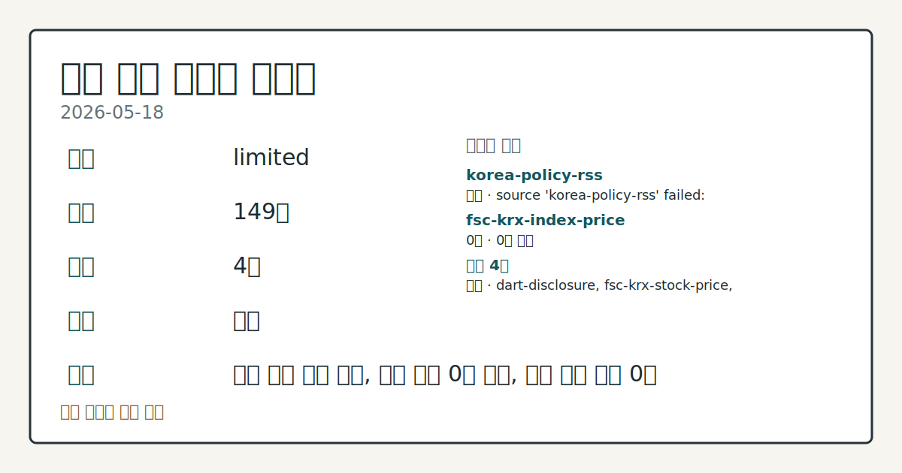
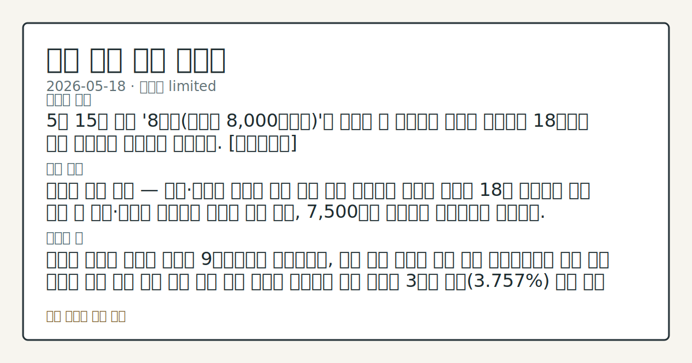
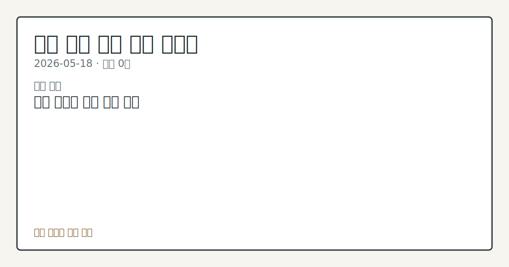

# 2026-05-18 국내 증시 시황

**기준 시각**: 2026-05-18 KST · [2026-05-17T15:00Z, 2026-05-18T15:00Z)

**세그먼트**: [국내 증시](2026-05-18.md) | [미국 증시](../../../us-equity/2026/05/2026-05-18.md)

*이미지: 데이터 신뢰도 · 출처: investo 자체 생성 · 생성: investo 0.1.0 · 2026-05-18 UTC*

> **데이터 상태**: 제한 — 수집 149건 / 소스 4개 / 누락: 없음 · 제한 — 핵심 가격 소스 0건/실패/stale, 본문 결론 신뢰도 낮음
> **소스 카운트**: 수집 대상 6 / 성공 4 / 0건 1 / 실패 1 / 본문 사용 0
> **소스 등급 분포**: S=2 / A=1 / B=1
> **상세 사유**: 일부 소스 수집 실패, 일부 소스 0건 반환, 핵심 가격 소스 0건
> **소스별 상태**: korea-policy-rss 실패 (source 'korea-policy-rss' failed: malformed XML: syntax error: line 1, column 49), fsc-krx-index-price 0건, 정상 4개
> **내 관심 자산 영향**: 데이터 수집 부족으로 매칭 판단 보류 — 추가 수집 후 재평가됩니다.
> **오늘의 결론**: 5월 15일 장중 '8천피(코스피 8,000포인트)'를 터치한 뒤 급락세를 보이던 코스피가 18일에도 하락 출발하며 변동성을 이어갔다. [데이터부족]
> **핵심 동인**: ### 코스피 상승 마감 — 개인·기관이 외국인 매도 압력 방어 연합뉴스 보도에 따르면 18일 코스피는 하락 출발 후 개인·기관의 순매수에 힘입어 상승 전환, 7,500선을 회복하며 강보합으로 마감했다.
> **주의할 점**: 외국인 코스피 순매도 기조가 9거래일째로 이어지는지, 이탈 규모 변화를 추세 확인 신용거래융자 잔고 사상 최고치 경신 이후 추가 증가 또는 정체 흐름을 데이터로 점검 국고채 3년물 금리(**3.757%**) 안정 전환 또는 추가 상승 흐름 관찰 KOSDAQ 외국인 순매수(+2,369억원) 지속 여부 — KOSPI 이탈·KOSDAQ 유입 분리 흐름 비교 삼성전자(005930)·SK하이닉스(000660) 대비 CXMT 추격 구도의 추가 전개를 보도 흐름으로 점검

> 정보 제공용 자동 시황이며 매매 권유가 아닙니다.

## 한눈에 보기

- 코스피가 장초반 급락 후 개인·기관의 순매수로 **7,500**선을 회복하며 상승 마감
- 외국인이 코스피에서 **-36,492**억원을 순매도하는 8거래일 연속 이탈 속에 신용거래융자(증권사 자금 차입 투자) 잔고가 사상 최고치 경신
- 국고채(국내 정부 채권) 3년물 금리 **3.757%** — 미국발 금리 불안의 국내 채권 시장 전이 강도를 본문 §②·④에서 확인

## ⓪ 오늘의 매크로

- **FOMC 일정** — 월가 유명 리서치 "연준, 6월에 통화완화 기조 폐기해야"
- **미 국채 수익률** — Revolut unveils first physical crypto card as industry-wide card usage grows

## ① 요약

*이미지: 시장 스냅샷 · 출처: investo 자체 생성 · 생성: investo 0.1.0 · 2026-05-18 UTC*

5월 15일 장중 '8천피'를 터치한 뒤 급락세를 보이던 코스피가 18일에도 하락 출발하며 변동성을 이어갔다. 장중 낙폭이 확대되는 국면에서 개인 투자자(**+22,094**억원)와 기관(**+13,904**억원)이 순매수에 나서며 지수를 방어했고, 코스피는 **7,500**선을 회복해 강보합으로 마감했다. 외국인은 **-36,492**억원 순매도로 5월 13일 이후 이탈 기조를 유지했으며, 신용거래융자 잔고는 사상 최고치를 다시 경신해 시장 내부 레버리지 위험이 높아진 상태다. 한국형 공포지수(국내 변동성 지표)도 장중 이란 전쟁 발발 당시 수준까지 치솟은 것으로 알려져 불안 심리가 일시 극대화됐으나, 지수는 이를 소화하며 마감했다. [변동성 확대]

## ② 전일 핵심 이슈

### 코스피 상승 마감 — 개인·기관이 외국인 매도 압력 방어

[연합뉴스 보도](https://www.yna.co.kr/view/AKR20260518119951008)에 따르면 18일 코스피는 하락 출발 후 개인·기관의 순매수에 힘입어 상승 전환, **7,500**선을 회복하며 강보합으로 마감했다. 외국인은 이날 코스피에서 **-36,492**억원을 순매도하며 5월 13일 이후 이어온 이탈 흐름을 유지했다. [연합뉴스의 관련 기사](https://www.yna.co.kr/view/AKR20260518104800008)는 '외국인 vs 개인' 수급 대결이 8거래일째 지속되고 있다고 짚었으며, 5월 15일 예고됐던 이 구도가 이날도 구조화되고 있음이 확인됐다.

### 삼성전자·SK하이닉스 — CXMT 추격 보도 속 장중 급반등

[연합뉴스 보도](https://www.yna.co.kr/view/AKR20260518031452008)에 따르면 삼성전자(005930)와 SK하이닉스(000660)는 장초반 급락 이후 상승 전환해 마감했으며, 000660은 **+1%** 상승했다. 중국 최대 메모리 반도체 업체 CXMT(창신메모리테크놀로지)가 AI(인공지능) 붐 속 1분기에 고성장을 기록하며 005930·000660을 [추격하는 구도가 부각](https://www.yna.co.kr/view/AKR20260518138251009)됐으나, 국내 양대 반도체주는 이를 소화하며 반등했다.

### Fed 정책 기조 변화 우려 — 코스피 변동성의 외부 촉매

[월가 유명 리서치](https://www.yna.co.kr/view/AKR20260518116400009)가 Fed(미국 연방준비제도)의 6월 통화완화 기조 폐기를 주장하며 미국 국채금리 급등 불안이 고조됐다. 이 흐름이 국내 채권 시장으로 전이되며 한국형 공포지수가 장중 급등했고, 코스피 변동성 확대의 외부 촉매로 작용했다는 것이 국내 증시에 대한 직접적 의미다.

### 신용거래융자 잔고 사상 최고 — 레버리지 리스크 부각

[연합뉴스 보도](https://www.yna.co.kr/view/AKR20260518122700008)에 따르면 신용거래융자 잔고가 다시 사상 최고치를 기록한 반면 투자자예탁금은 감소했다. 개인이 자기 자금 감소 속에서도 차입으로 매수를 이어가는 구조가 확인되며, 지수 급락 시 반대매매 압력으로 연결될 수 있는 구조적 취약성이 부각된다.

## ③ 섹터/수급 동향

### KOSPI 수급 — 외국인 대규모 이탈, 개인·기관 대응 매수

18일 KOSPI 투자자별 순매수([출처](https://finance.naver.com/sise/investorDealTrendDay.naver?bizdate=20260518&sosok=01)):

| 투자자 | 순매수 (억원) |
|--------|-------------|
| 개인   | **+22,094** |
| 외국인 | **-36,492** |
| 기관   | **+13,904** |
| 기타   | **+494**    |

외국인 이탈 규모가 개인·기관 합산 순매수를 상회하는 수급 불균형이 이날도 지속됐다.

### KOSDAQ 수급 — 외국인 순매수 전환, 기관 이탈

18일 KOSDAQ 투자자별 순매수([출처](https://finance.naver.com/sise/investorDealTrendDay.naver?bizdate=20260518&sosok=02)):

| 투자자 | 순매수  |
|--------|-------------|
| 개인   | **-84**      |
| 외국인 | **+2,369**  |
| 기관   | **-2,540**  |
| 기타   | **+255**    |

KOSDAQ에서는 외국인이 **+2,369**억원 순매수로 전환한 반면 기관이 **-2,540**억원 순매도해 KOSPI와 역방향 흐름을 보였다. [코스닥 외국인 순매수 상위 종목](https://www.yna.co.kr/view/AKR20260518122000008)에 대한 세부 내역도 이날 보도됐다.

## ④ 지표·이벤트

### 국고채 금리 혼조 — 3년물 연 **3.757%**

[연합뉴스 보도](https://www.yna.co.kr/view/AKR20260518133951008)에 따르면 급등세를 이어가던 국고채 금리가 18일 혼조세로 마감했다. 단기물을 중심으로 금리가 하락한 반면 장기물은 상승 마감했으며, 3년물은 연 **3.757%**를 기록했다. 미국 국채금리 급등 여파가 배경으로 거론되며 시장에서 '너무 올랐나' 하는 논란이 불거진 장세였다.

### 코스피 지수선물·옵션

코스피 지수선물(주가지수선물 / 개별주식선물)과 주가지수옵션 시세(2026-05-18)는 연합뉴스 시세표([선물](https://www.yna.co.kr/view/AKR20260518132200008) / [개별선물](https://www.yna.co.kr/view/AKR20260518132400008) / [옵션](https://www.yna.co.kr/view/AKR20260518132300008))에서 확인할 수 있다. 입력 데이터에 세부 가격 수치가 포함되지 않아 구체적 수치 인용은 생략한다.

## ⑤ 주요 종목

### 실적 확인

- **현대해상(001450)**: 1분기 보험손익 개선이 확인되며 [**15%** 가까이 급등](https://www.yna.co.kr/view/AKR20260518039451008)해 마감.

### 반도체 동향

- **삼성전자(005930)**: 장초반 급락 후 [상승 전환 마감](https://www.yna.co.kr/view/AKR20260518031452008). CXMT AI 고성장 보도 속 반등 흐름 확인.
- **SK하이닉스**: 장중 상승 전환해 **+1%** 마감.

### 기업 이벤트

- **두산그룹 / SK실트론 인수**: 한국산업은행이 두산그룹의 SK실트론 인수 관련 [**2조5천억원** 규모 금융 주선](https://www.yna.co.kr/view/AKR20260518160200002) 추진.
- **하이트진로(000080)**: 장인섭 대표 및 임원진이 [자사주 매입](https://www.yna.co.kr/view/AKR20260518133500030) 실시, 책임경영 강화 명분.

### 애프터마켓 동향

- **엑스게이트(356680)**: [애프터마켓 10%대 급등](https://www.yna.co.kr/view/AKR20260518134700008).
- **비츠로셀(082920)**: [애프터마켓 10%대 급등](https://www.yna.co.kr/view/AKR20260518130200008).
- **영원무역(111770)**: [애프터마켓 10%대 급등](https://www.yna.co.kr/view/AKR20260518121700008).

### 공시 확인

- **한국유니온제약(080720)**: 제3자배정 유상증자 결정([공시](https://www.yna.co.kr/view/AKR20260518151400008)).
- **졸스(018700)**: 운영자금 목적 약 **100**억원 규모 제3자배정 유상증자 결정([공시](https://www.yna.co.kr/view/AKR20260518143200008)).
- **오토핸즈**: 코스닥 상장 예비심사 신청서 접수([보도](https://www.yna.co.kr/view/AKR20260518137300008)).

## ⑥ 오늘의 관전 포인트

*이미지: 관심 자산 관련성 · 출처: investo 자체 생성 · 생성: investo 0.1.0 · 2026-05-18 UTC*

- 외국인 코스피 순매도 기조가 9거래일째로 이어지는지, 이탈 규모 변화를 추세 확인
- 신용거래융자 잔고 사상 최고치 경신 이후 추가 증가 또는 정체 흐름을 데이터로 점검
- 국고채 3년물 금리(**3.757%**) 안정 전환 또는 추가 상승 흐름 관찰
- KOSDAQ 외국인 순매수(**+2,369**억원) 지속 여부 — KOSPI 이탈·KOSDAQ 유입 분리 흐름 비교
- 삼성전자·SK하이닉스 대비 CXMT 추격 구도의 추가 전개를 보도 흐름으로 점검

📑 트레이스 + 서명 (Stage 1/2)

- `input_hash`: `fec4d306db1c`
- `stage1_hash`: `533ba5409fca`
- `stage2_hash`: `dbd17886a2af`

| 항목 ID | 소스 | 카테고리 | 섹션 | 제목 |
|---------|------|----------|------|------|
| 0 | dart-disclosure | news | — | [DART] 휴마시스 - 최대주주변경 |
| 1 | dart-disclosure | news | 5 | [DART] 모바일어플라이언스 - 최대주주변경을수반하는주식담보제공계약해제ㆍ취소등 |
| 2 | dart-disclosure | news | 5 | [DART] 블루산업개발 - 유상증자또는주식관련사채등의발행결과(자율공시) |
| 3 | dart-disclosure | news | 5 | [DART] 모바일어플라이언스 - 최대주주변경 |
| 4 | dart-disclosure | news | 5 | [DART] THE E&M - 주요사항보고서(자기전환사채매도결정) |
| 5 | dart-disclosure | news | 5 | [DART] 블루산업개발 - 주요사항보고서 |
| 6 | dart-disclosure | news | 5 | [DART] THE E&M - 주요사항보고서 |
| 7 | dart-disclosure | news | 5 | [DART] 슈피겐코리아 - 주식등의대량보유상황보고서(일반) |
| 8 | dart-disclosure | news | 5 | [DART] 코스모로보틱스 - 임원ㆍ주요주주특정증권등소유상황보고서 |
| 9 | dart-disclosure | news | 5 | [DART] 모바일어플라이언스 - 최대주주변경을수반하는주식담보제공계약체결 |
| 10 | dart-disclosure | news | 5 | [DART] 폴레드 - 주식등의대량보유상황보고서 |
| 11 | dart-disclosure | news | 5 | [DART] 신테카바이오 - 임원ㆍ주요주주특정증권등소유상황보고서 |
| 12 | dart-disclosure | news | 5 | [DART] 신테카바이오 - 주식등의대량보유상황보고서 |
| 13 | dart-disclosure | news | 5 | [DART] 코웨이 - 주식등의대량보유상황보고서 |
| 14 | dart-disclosure | news | 5 | [DART] 비욘드바이오 - 주요사항보고서 |
| 15 | dart-disclosure | news | 5 | [DART] 위지트 - 주권매매거래정지해제 (감자 주권 변경상장) |
| 16 | dart-disclosure | news | 5 | [DART] 레이 - 주식등의대량보유상황보고서 |
| 17 | dart-disclosure | news | 5 | [DART] 싸이토젠 - 주요사항보고서 |
| 18 | dart-disclosure | news | 5 | [DART] DKME - [기재정정]주식등의대량보유상황보고서 |
| 19 | dart-disclosure | news | 5 | [DART] 졸스 - 주요사항보고서 |
| 20 | dart-disclosure | news | 5 | [DART] 랩지노믹스 - 전환사채(해외전환사채포함)발행후만기전사채취득 |
| 21 | dart-disclosure | news | 5 | [DART] DKME - 임원ㆍ주요주주특정증권등소유상황보고서 |
| 22 | dart-disclosure | news | 5 | [DART] 코스모로보틱스 - 임원ㆍ주요주주특정증권등소유상황보고서 |
| 23 | dart-disclosure | news | 5 | [DART] 소룩스 - [기재정정]주요사항보고서 |
| 24 | fsc-krx-stock-price | price | 5 | 삼성전자[005930] 270,500원 (-8.61%, -25,500) |
| 25 | fsc-krx-stock-price | price | 5 | SK하이닉스[000660] 1,819,000원 (-7.66%, -151,000) |
| 26 | fsc-krx-stock-price | price | 5 | NAVER[035420] 203,500원  |
| 27 | fsc-krx-stock-price | price | 5 | 현대차[005380] 700,000원  |
| 28 | fsc-krx-stock-price | price | 5 | 셀트리온[068270] 188,800원 (-3.23%, -6,300) |
| 29 | krx-foreign-flows | price | 5 | KOSPI 개인 순매수 +22,094억원 (2026-05-18) |
| 30 | krx-foreign-flows | price | 3 | KOSPI 외국인 순매도 -36,492억원 (2026-05-18) |
| 31 | krx-foreign-flows | price | 3 | KOSPI 기관 순매수 +13,904억원 (2026-05-18) |
| 32 | krx-foreign-flows | price | 3 | KOSPI 기타 순매수 +494억원 (2026-05-18) |
| 33 | krx-foreign-flows | price | 3 | KOSDAQ 개인 순매도 -84억원 (2026-05-18) |
| 34 | krx-foreign-flows | price | 3 | KOSDAQ 외국인 순매수 +2,369억원 (2026-05-18) |
| 35 | krx-foreign-flows | price | 3 | KOSDAQ 기관 순매도 -2,540억원 (2026-05-18) |
| 36 | krx-foreign-flows | price | 3 | KOSDAQ 기타 순매수 +255억원 (2026-05-18) |
| 37 | yonhap-market | news | 3 | 뉴욕증시, 유가 하락 속 상승 출발 |
| 38 | yonhap-market | news | 2 | 중국 메모리 CXMT도 AI 타고 날았다…삼전·하닉 추격전(종합) |
| 39 | yonhap-market | news | 2 | 산업은행, 'SK실트론 인수' 두산그룹에 2.5조 금융 주선 |
| 40 | yonhap-market | news | 5 | 한국유니온제약, 유상증자…부광약품 주식회사에 제3자배정 |
| 41 | yonhap-market | news | 5 | 한국유니온제약, 유상증자…박광석 등에 3자 배정 |
| 42 | yonhap-market | news | 5 | '외국인 vs 개인' 전쟁 8거래일째…美국채금리 급등 영향 주목 |
| 43 | yonhap-market | news | 3 | 졸스, 100억원 제3자배정 유상증자 |
| 44 | yonhap-market | news | 5 | '너무 올랐나' 국고채 금리 급등 뒤 혼조 마감…3년물 연 3.757%(종합) |
| 45 | yonhap-market | news | 4 | 하이트진로 장인섭 대표·임원진, 자사주 매입…"책임경영 강화" |
| 46 | yonhap-market | news | 5 | '자동차 판매업' 오토핸즈, 코스닥 상장 예비심사 신청 |
| 47 | yonhap-market | news | 5 | 엑스게이트, 애프터마켓서 10%대 급등 |
| 48 | yonhap-market | news | 5 | 국고채 금리 혼조세…3년물 연 3.757% |
| 49 | yonhap-market | news | 4 | 코스피, 美국채 '발작' 등에 변동성↑…상승마감했지만 불안불안(종합) |
| 50 | yonhap-market | news | 2 | 비츠로셀, 애프터마켓서 10%대 급등 |
| 51 | yonhap-market | news | 5 | [표] 코스피 지수선물·옵션 시세표(18일)-3 |
| 52 | yonhap-market | news | 4 | [표] 코스피 지수선물·옵션 시세표-2 |
| 53 | yonhap-market | news | 4 | [표] 코스피 지수선물·옵션 시세표-1 |
| 54 | yonhap-market | news | 4 | 코스피, 장초반 '출렁'하다 상승전환…7,500선 회복 강보합(종합) |
| 55 | yonhap-market | news | 2 | '빚투' 신용융자잔고 또 사상 최대…투자자예탁금은 감소 |
| 56 | yonhap-market | news | 2 | [특징주] 삼성전자, 장중 상승전환해 급등마감…하닉도 1%↑(종합2보) |
| 57 | yonhap-market | news | 5 | 월가 유명 리서치 "연준, 6월에 통화완화 기조 폐기해야" |
| 58 | yonhap-market | news | 4 | 영원무역, 애프터마켓서 10%대 급등 |
| 59 | yonhap-market | news | 5 | [특징주] 현대해상, 1분기 보험손익 개선 '호실적'에 15% 급등(종합) |
| 60 | yonhap-market | news | 5 | [표] 코스닥 외국인 순매수도 상위종목(18일) |

## ⑦ 면책조항
본 시황은 일반 정보 제공을 목적으로 자동 생성된 자료이며,
특정 종목·자산에 대한 매매 권유나 투자 자문이 아닙니다.
투자 결정과 그 결과에 대한 책임은 전적으로 본인에게 있으며,
본 시황의 내용에 따라 발생한 손실에 대해 작성자는 일체의 책임을 지지 않습니다.