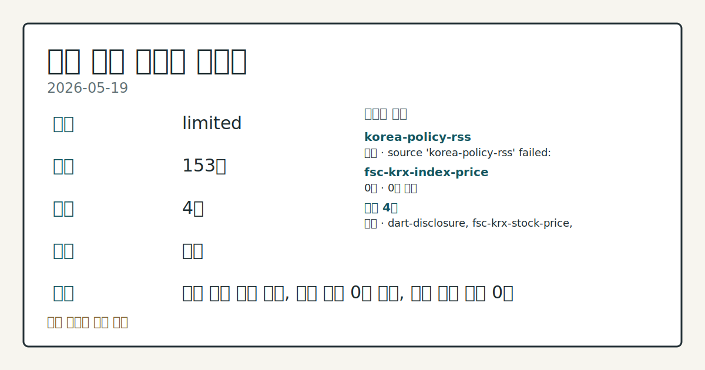
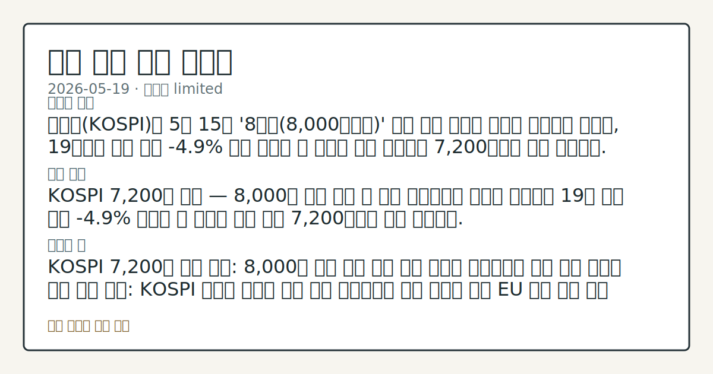
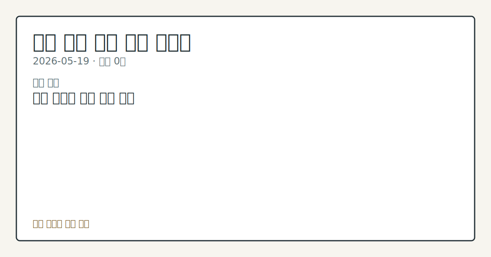

# 2026-05-19 국내 증시 시황

**기준 시각**: 2026-05-19 KST · [2026-05-18T15:00Z, 2026-05-19T15:00Z)

**세그먼트**: [국내 증시](2026-05-19.md) | [미국 증시](../../../us-equity/2026/05/2026-05-19.md) | [크립토](../../../crypto/2026/05/2026-05-19.md)

*이미지: 데이터 신뢰도 · 출처: investo 자체 생성 · 생성: investo 0.1.0 · 2026-05-19 UTC*

> **데이터 상태**: 제한 — 수집 153건 / 소스 4개 / 누락: 없음 · 제한 — 핵심 가격 소스 0건/실패/stale, 본문 결론 신뢰도 낮음
> **소스 카운트**: 수집 대상 6 / 성공 4 / 0건 1 / 실패 1 / 본문 사용 0
> **소스 등급 분포**: S=2 / A=1 / B=1
> **상세 사유**: 일부 소스 수집 실패, 일부 소스 0건 반환, 핵심 가격 소스 0건
> **소스별 상태**: korea-policy-rss 실패 (source 'korea-policy-rss' failed: malformed XML: syntax error: line 1, column 49), fsc-krx-index-price 0건, 정상 4개
> **내 관심 자산 영향**: 데이터 수집 부족으로 매칭 판단 보류 — 추가 수집 후 재평가됩니다.
> **오늘의 결론**: 코스피(KOSPI)가 5월 15일 '8천피(8,000포인트)' 달성 이후 변동성 장세를 이어가는 가운데, 19일에는 장중 최대 **-4.9%** 까지 급락한 뒤 낙폭을 일부 회복하며 7,200선에서 하락 마감했다. [데이터부족]
> **핵심 동인**: ### KOSPI 7,200선 마감 — 8,000선 이후 조정 폭 최대 연합뉴스에 따르면 코스피는 19일 장중 한때 **-4.9%** 급락한 뒤 낙폭을 다소 줄여 7,200선에서 하락 마감했다.
> **주의할 점**: KOSPI 7,200선 하단 지지: 8,000선 이후 조정 폭이 수렴 국면에 들어서는지 추세 확인 외국인 수급 규모 변화: KOSPI 순매도 흐름이 확대 또는 축소되는지 일별 데이터 비교 EU 철강 관세 파급 범위: 국내 철강 수출 관련주의 코스피 연관 수급 변동 관찰 반도체 섹터 글로벌 동조화: 삼성전자[005930]·SK하이닉스[000660]의 글로벌 기술주 흐름 동조 패턴 점검 카카오[035720] 자사주 매수 효과: 낙폭 장세에서 내부자 매수 신호가 주가 흐름에 반영되는지 관찰

> 정보 제공용 자동 시황이며 매매 권유가 아닙니다.

## 한눈에 보기

- KOSPI 장중 최대 **-4.9%** 급락 후 7,200선 마감 — 8,000선 돌파 이후 조정 폭이 가장 깊었던 거래일
- 외국인 KOSPI 순매도 **-57,242억원** 대비 개인 **+56,289억원** 맞매수 — 방어 수급 재현에도 7,200선 사수에 그침
- SK하이닉스[000660] **-5%**, 삼성전자[005930] **-2%** — 반도체 양대 축 동반 하락, 원인은 본문 §⑤ 참조

## ⓪ 오늘의 매크로

- **미 국채 수익률** — Senator Warren criticizes OCC over Ripple, Coinbase and other crypto trust charters

## ① 요약

*이미지: 시장 스냅샷 · 출처: investo 자체 생성 · 생성: investo 0.1.0 · 2026-05-19 UTC*

코스피가 5월 15일 '8천피' 달성 이후 변동성 장세를 이어가는 가운데, 19일에는 장중 최대 **-4.9%** 까지 급락한 뒤 낙폭을 일부 회복하며 7,200선에서 하락 마감했다. 시가총액은 5,000조 원대로 축소됐다. EU(유럽연합)의 철강 관세 **25%**→**50%** 인상 발표가 수출주 심리를 꺾었고, 글로벌 채권 투매에 따른 금리 급등 압박이 위험자산 전반의 회피 분위기를 자극했다. 외국인의 대규모 순매도를 개인이 역대급 맞매수로 방어했으나 7,200선을 지키는 데 그쳤으며, 5월 18일 반등 흐름은 하루 만에 재차 꺾였다. [하락 관찰]

## ② 전일 핵심 이슈

### KOSPI 7,200선 마감 — 8,000선 이후 조정 폭 최대

[연합뉴스](https://www.yna.co.kr/view/AKR20260519079951008)에 따르면 코스피는 19일 장중 한때 **-4.9%** 급락한 뒤 낙폭을 다소 줄여 7,200선에서 하락 마감했다. 5월 11일 7,800선 돌파 → 5월 15일 8,000선 터치 이후 단계적 조정이 이어졌으며, ["과속 부담 해소가 덜 됐다"는 시장 진단](https://www.yna.co.kr/view/AKR20260519117051008)이 반복됐다. 5월 18일 개인·기관 연합 방어로 일시 반등했던 흐름이 오늘 다시 하락 전환되며 변동성 장세가 지속됐다. 인플레이션(물가 상승) 우려와 미국 기술주 약세가 국내 수급에 추가 부담으로 작용했다.

### EU 철강 관세 50%로 인상 — 수출주 비용 부담 부각

[유럽의회가 19일(현지시간) 철강제품 관세를 **25%**에서 **50%**로 대폭 인상하고 무관세 수입 할당량도 절반으로 줄이기로 결의했다](https://www.yna.co.kr/view/AKR20260519180700082). 국내 철강 수출 관련주의 채산성 악화 우려가 수급에 반영될 수 있는 정책 이벤트로, 오늘 하락 장세에서 수출주 심리를 추가로 압박했다.

### G7(주요 7개국) 재무·중앙은행 — "중동 분쟁, 성장·물가 위험 고조"

[G7 재무장관·중앙은행 총재들은 중동 분쟁 속 경제적 불강한성이 성장과 인플레이션에 위험을 고조시킨다고 경고했다](https://www.yna.co.kr/view/AKR20260519179700081). 국내 증시의 관점에서는 이 같은 글로벌 불강한성이 외국인의 신흥국(이머징 마켓) 위험 회피 심리를 강화해 코스피 순매도 지속의 배경 요인으로 작용하는 흐름이다.

## ③ 섹터/수급 동향

### KOSPI 수급 — 외국인 대규모 순매도 vs. 개인 방어

[KOSPI에서 외국인은 **-57,242억원** 순매도](https://finance.naver.com/sise/investorDealTrendDay.naver?bizdate=20260519&sosok=01)로 매도 압력을 주도했다. 개인은 **+56,289억원** 순매수로 맞대응했고, 기관은 **+1,575억원** 순매수, 기타는 **-622억원** 순매도를 기록했다. 외국인 매도와 개인 매수 규모가 거의 일치했음에도 지수 반등으로는 이어지지 못해, 5월 중순 이후 반복되는 수급 구도에서 방어 한계가 확인됐다.

### KOSDAQ 수급 — 외국인 순매수 전환이 특이 동향

코스닥(KOSDAQ)에서는 [외국인이 **+1,307억원** 순매수](https://finance.naver.com/sise/investorDealTrendDay.naver?bizdate=20260519&sosok=02)로 KOSPI와 반대 방향을 보였고, 개인도 **+1,032억원** 순매수를 기록했다. 반면 기관은 **-659억원**, 기타는 **-1,680억원** 순매도로 이탈했다. KOSPI에서 대규모 순매도를 이어간 외국인이 KOSDAQ에서는 순매수로 전환된 점은 오늘 수급의 주요 특이점이다.

### 대량보유 공시 — SK, HDC, 모비데이즈

DART(금융감독원 전자공시시스템)에서 [SK](https://dart.fss.or.kr/dsaf001/main.do?rcpNo=20260519000293), [HDC](https://dart.fss.or.kr/dsaf001/main.do?rcpNo=20260519000288), [모비데이즈](https://dart.fss.or.kr/dsaf001/main.do?rcpNo=20260519000294) 등이 주식 대량보유상황보고서를 접수했다. 세부 지분 변동 내역은 원문 공시를 통한 확인이 필요하다.

## ④ 지표·이벤트

### 국고채 금리 대체로 하락 — 3년물 연 **3.751%**

[국고채 금리는 19일 대체로 하락했으며 3년물은 연 **3.751%**를 기록했다](https://www.yna.co.kr/view/AKR20260519145351008). 글로벌 채권 투매 흐름과 달리 국내 단기물은 강세(금리 하락)를 나타내며 '숨 고르기' 국면으로 해석됐다. 글로벌 장기금리 급등 현황은 ⓪ 매크로 블록 참조.

### KOSPI 지수선물·옵션 시세

코스피 지수선물·옵션(기초자산 기준 시총 상위 100개 개별주식선물 포함) 19일 시세가 공시됐다. 세부 수치는 연합뉴스 시세표([선물](https://www.yna.co.kr/view/AKR20260519142700008), [개별주식선물](https://www.yna.co.kr/view/AKR20260519142500008), [옵션](https://www.yna.co.kr/view/AKR20260519142600008))에서 확인 가능하다.

## ⑤ 주요 종목

### 확인 항목 — 반도체 양대 축 동반 하락

[삼성전자[005930] **-2%**, SK하이닉스[000660] **-5%** 하락 마감](https://www.yna.co.kr/view/AKR20260519038251008)이 확인됐다. 글로벌 기술주 약세 흐름이 국내 반도체 수급 영향으로 연결됐다. TSMC가 젠슨 황(Jensen Huang) NVIDIA(엔비디아) CEO의 'AI 5단 케이크' 구상에 '3단 케이크' 비전으로 화답한 가운데, 이 파운드리(반도체 위탁생산) 전략 경쟁이 코스피 연관 수급에 미치는 영향은 추가 흐름 점검이 필요하다.

### 관전 분류 — 카카오[035720] 임원 자사주 매수

[카카오[035720] 임원 28명이 **5억원** 규모의 자사주를 매입하며 "책임 경영 실천"을 선언했다](https://www.yna.co.kr/view/AKR20260519160300017). 하락 장세에서 내부자 매수 신호로 시장 관심을 끌었으며, DART에는 관련 임원·주요주주 소유상황보고서가 다수 접수됐다([공시](https://dart.fss.or.kr/dsaf001/main.do?rcpNo=20260519000309)).

### 체크리스트 — 시간 외·인수설 특징주

[STX엔진[077970]은 장 마감 후 애프터마켓(시간 외 거래)에서 **11%**대 급등](https://www.yna.co.kr/view/AKR20260519143200008) 중임이 보고됐다. [실리콘투[257720]는 장중 한때 **10%** 가까이 급등한 뒤 최종 **+2%**대로 마감했으며, 인수설 루머가 변동성의 주 원인으로 분석됐다](https://www.yna.co.kr/view/AKR20260519061151008). 두 종목 모두 개별 이슈에 따른 단기 변동성이 확인됐다.

### 공시 이벤트 — 유상증자 정정·최대주주 변경

[광진실업](https://dart.fss.or.kr/dsaf001/main.do?rcpNo=20260519000306)과 [졸스](https://dart.fss.or.kr/dsaf001/main.do?rcpNo=20260519000274)는 유상증자(신주 발행을 통한 자금 조달) 결정 기재정정 공시를 접수했고, [공구우먼](https://dart.fss.or.kr/dsaf001/main.do?rcpNo=20260519900768)은 최대주주 변경을 수반하는 주식양수도계약 기재정정을 제출했다.

## ⑥ 오늘의 관전 포인트

*이미지: 관심 자산 관련성 · 출처: investo 자체 생성 · 생성: investo 0.1.0 · 2026-05-19 UTC*

- KOSPI 7,200선 하단 지지: 8,000선 이후 조정 폭이 수렴 국면에 들어서는지 추세 확인
- 외국인 수급 규모 변화: KOSPI 순매도 흐름이 확대 또는 축소되는지 일별 데이터 비교
- EU 철강 관세 파급 범위: 국내 철강 수출 관련주의 코스피 연관 수급 변동 관찰
- 반도체 섹터 글로벌 동조화: 삼성전자[005930]·SK하이닉스[000660]의 글로벌 기술주 흐름 동조 패턴 점검
- 카카오[035720] 자사주 매수 효과: 낙폭 장세에서 내부자 매수 신호가 주가 흐름에 반영되는지 관찰

📑 트레이스 + 서명 (Stage 1/2)

- `input_hash`: `87051ccc3422`
- `stage1_hash`: `68ad9c1f8c01`
- `stage2_hash`: `21b8960a6109`

| 항목 ID | 소스 | 카테고리 | 섹션 | 제목 |
|---------|------|----------|------|------|
| 0 | dart-disclosure | news | — | [DART] 공구우먼 - [기재정정]최대주주변경을수반하는주식양수도계약체결 |
| 1 | dart-disclosure | news | 5 | [DART] 카카오 - 임원ㆍ주요주주특정증권등소유상황보고서 |
| 2 | dart-disclosure | news | 5 | [DART] 광진실업 - [기재정정]주요사항보고서(유상증자결정) |
| 3 | dart-disclosure | news | 5 | [DART] 졸스 - [첨부정정]주요사항보고서 |
| 4 | dart-disclosure | news | 5 | [DART] 카카오 - 임원ㆍ주요주주특정증권등소유상황보고서 |
| 5 | dart-disclosure | news | 5 | [DART] 카카오 - 임원ㆍ주요주주특정증권등소유상황보고서 |
| 6 | dart-disclosure | news | 5 | [DART] 젬백스 - [기재정정]최대주주변경을수반하는주식담보제공계약체결 |
| 7 | dart-disclosure | news | 5 | [DART] 카카오 - 임원ㆍ주요주주특정증권등소유상황보고서 |
| 8 | dart-disclosure | news | 5 | [DART] 슈피겐코리아 - 자기주식처분결과보고서 |
| 9 | dart-disclosure | news | 5 | [DART] 카카오 - 임원ㆍ주요주주특정증권등소유상황보고서 |
| 10 | dart-disclosure | news | 5 | [DART] 폴레드 - 주식등의대량보유상황보고서(약식) |
| 11 | dart-disclosure | news | 3 | [DART] 하이브 - 주요사항보고서 |
| 12 | dart-disclosure | news | 5 | [DART] 엘케이켐 - 임원ㆍ주요주주특정증권등소유상황보고서 |
| 13 | dart-disclosure | news | 5 | [DART] 신한제12호스팩 - 주식등의대량보유상황보고서 |
| 14 | dart-disclosure | news | 3 | [DART] 졸스 - 임원ㆍ주요주주특정증권등소유상황보고서 |
| 15 | dart-disclosure | news | 5 | [DART] 모비데이즈 - 주식등의대량보유상황보고서 |
| 16 | dart-disclosure | news | 3 | [DART] SK - 주식등의대량보유상황보고서 |
| 17 | dart-disclosure | news | 3 | [DART] HDC - 주식등의대량보유상황보고서 |
| 18 | dart-disclosure | news | 3 | [DART] 카카오 - 임원ㆍ주요주주특정증권등소유상황보고서 |
| 19 | dart-disclosure | news | 5 | [DART] 하나머티리얼즈 - 주식등의대량보유상황보고서 |
| 20 | dart-disclosure | news | 3 | [DART] 초록뱀미디어 - 주식등의대량보유상황보고서 |
| 21 | dart-disclosure | news | 3 | [DART] 카카오 - 임원ㆍ주요주주특정증권등소유상황보고서 |
| 22 | dart-disclosure | news | 5 | [DART] 초록뱀미디어 - 임원ㆍ주요주주특정증권등소유상황보고서 |
| 23 | dart-disclosure | news | 5 | [DART] 카카오 - 임원ㆍ주요주주특정증권등소유상황보고서 |
| 24 | fsc-krx-stock-price | price | 5 | 삼성전자[005930] 281,000원 (+3.88%, +10,500) |
| 25 | fsc-krx-stock-price | price | 5 | SK하이닉스[000660] 1,840,000원  |
| 26 | fsc-krx-stock-price | price | 5 | NAVER[035420] 200,000원  |
| 27 | fsc-krx-stock-price | price | 5 | 현대차[005380] 663,000원  |
| 28 | fsc-krx-stock-price | price | 5 | 셀트리온[068270] 183,200원 (-2.97%, -5,600) |
| 29 | krx-foreign-flows | price | 5 | KOSPI 개인 순매수 +56,289억원 (2026-05-19) |
| 30 | krx-foreign-flows | price | 3 | KOSPI 외국인 순매도 -57,242억원 (2026-05-19) |
| 31 | krx-foreign-flows | price | 3 | KOSPI 기관 순매수 +1,575억원 (2026-05-19) |
| 32 | krx-foreign-flows | price | 3 | KOSPI 기타 순매도 -622억원 (2026-05-19) |
| 33 | krx-foreign-flows | price | 3 | KOSDAQ 개인 순매수 +1,032억원 (2026-05-19) |
| 34 | krx-foreign-flows | price | 3 | KOSDAQ 외국인 순매수 +1,307억원 (2026-05-19) |
| 35 | krx-foreign-flows | price | 3 | KOSDAQ 기관 순매도 -659억원 (2026-05-19) |
| 36 | krx-foreign-flows | price | 3 | KOSDAQ 기타 순매도 -1,680억원 (2026-05-19) |
| 37 | yonhap-market | news | 3 | EU 철강 관세 50％로 인상…무관세 쿼터 대폭 축소 |
| 38 | yonhap-market | news | 2 | 글로벌 국채투매에 미국채 30년 금리 5.18%…2007년 이후 최고 |
| 39 | yonhap-market | news | 4 | G7 재무·중앙은행 총재 "중동 분쟁에 성장·물가 위험 고조" |
| 40 | yonhap-market | news | 4 | 뉴욕증시, 기술주 약세·인플레 우려에 하락 출발 |
| 41 | yonhap-market | news | 2 | 이란 증시 전쟁 이후 80일만에 거래 재개(종합) |
| 42 | yonhap-market | news | 2 | "세계 4대 회계법인, 감사인보다 AI 전문가 더 뽑았다" |
| 43 | yonhap-market | news | 2 | 허리띠 졸라매는 뉴질랜드…공무원 8천700명 줄인다 |
| 44 | yonhap-market | news | 2 | 이란 증시 전쟁 이후 80일만에 거래 재개 |
| 45 | yonhap-market | news | 2 | 카카오 임원 28명, 5억원 규모 주식 매수…"책임 경영 실천" |
| 46 | yonhap-market | news | 5 | 2006년 노벨경제학상 수상 펠프스 교수 별세 |
| 47 | yonhap-market | news | 2 | 코스콤, 고객만족도 향상위해 AI·클라우드 적용 확대 |
| 48 | yonhap-market | news | 5 | '숨고르기 지속' 국고채 금리 대체로 하락…3년물 연 3.751%(종합) |
| 49 | yonhap-market | news | 4 | STX엔진, 애프터마켓서 11%대 급등 |
| 50 | yonhap-market | news | 5 | 국고채 금리 대체로 하락…3년물 연 3.751% |
| 51 | yonhap-market | news | 4 | [표] 코스피 지수선물·옵션 시세표(19일)-3 |
| 52 | yonhap-market | news | 4 | [표] 코스피 지수선물·옵션 시세표-2 |
| 53 | yonhap-market | news | 4 | [표] 코스피 지수선물·옵션 시세표-1 |
| 54 | yonhap-market | news | 4 | 변동성 이어진 코스피, 7,200선으로 밀려…시총 5천조원대로 축소(종합) |
| 55 | yonhap-market | news | 2 | TSMC, 젠슨 황 'AI 5단 케이크' 개념에 '3단 케이크' 비전 화답 |
| 56 | yonhap-market | news | 5 | '연일 널뛰기' 코스피, 변동성 장세 지속…"과속부담 해소 덜돼"(종합) |
| 57 | yonhap-market | news | 2 | 행안장관, 고유가지원금 지급현장 점검…"기한내 꼭 사용" 당부 |
| 58 | yonhap-market | news | 2 | [특징주] 실리콘투, 2%대 상승 마감…인수설 루머 영향?(종합) |
| 59 | yonhap-market | news | 5 | '주식 사고팔기' 누가 더 자주?…70대 이상이 20대의 4배 |
| 60 | yonhap-market | news | 3 | [특징주] SK하이닉스, 5%대 급락 마감…삼전은 2% 내려(종합) |

## ⑦ 면책조항
본 시황은 일반 정보 제공을 목적으로 자동 생성된 자료이며,
특정 종목·자산에 대한 매매 권유나 투자 자문이 아닙니다.
투자 결정과 그 결과에 대한 책임은 전적으로 본인에게 있으며,
본 시황의 내용에 따라 발생한 손실에 대해 작성자는 일체의 책임을 지지 않습니다.