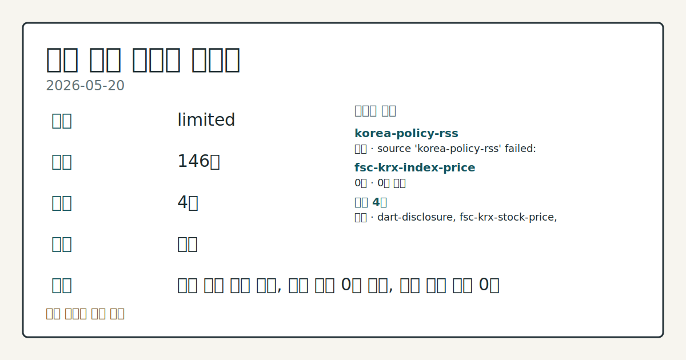
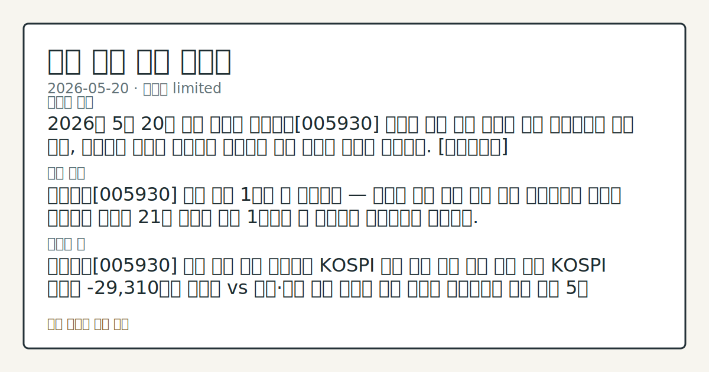
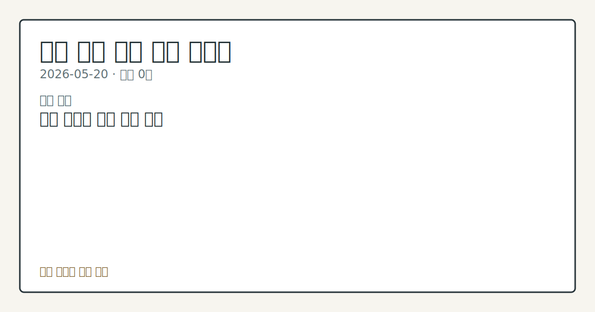

# 2026-05-20 국내 증시 시황

**기준 시각**: 2026-05-20 KST · [2026-05-19T15:00Z, 2026-05-20T15:00Z)

**세그먼트**: [국내 증시](2026-05-20.md) | [미국 증시](../../../us-equity/2026/05/2026-05-20.md) | [크립토](../../../crypto/2026/05/2026-05-20.md)

*이미지: 데이터 신뢰도 · 출처: investo 자체 생성 · 생성: investo 0.1.0 · 2026-05-20 UTC*

> **데이터 상태**: 제한 — 수집 146건 / 소스 4개 / 누락: 없음 · 제한 — 핵심 가격 소스 0건/실패/stale, 본문 결론 신뢰도 낮음
> **소스 카운트**: 수집 대상 6 / 성공 4 / 0건 1 / 실패 1 / 본문 사용 0
> **소스 등급 분포**: S=2 / A=1 / B=1
> **상세 사유**: 일부 소스 수집 실패, 일부 소스 0건 반환, 핵심 가격 소스 0건
> **소스별 상태**: korea-policy-rss 실패 (source 'korea-policy-rss' failed: malformed XML: syntax error: line 1, column 49), fsc-krx-index-price 0건, 정상 4개
> **내 관심 자산 영향**: 데이터 수집 부족으로 매칭 판단 보류 — 추가 수집 후 재평가됩니다.
> **용어 가이드**: 이번 시황에서 처음 등장한 용어 — 시가총액(시장가치), 시간외거래(장외거래)
> **오늘의 결론**: 2026년 5월 20일 국내 증시는 삼성전자[005930] 노사의 극적 파업 합의로 단기 불강한성이 걷힌 반면, 외국인의 대규모 순매도가 지속되며 수급 공방이 이어진 하루였다. [데이터부족]
> **핵심 동인**: ### 삼성전자[005930] 노사 파업 1시간 전 잠정합의 — 코스피 연관 수급 변수 해소 연합뉴스에 따르면 삼성전자 노사는 21일 총파업 개시 1시간여 전 극적으로 잠정합의에 도달했다.
> **주의할 점**: 삼성전자[005930] 노사 합의 이후 외국인의 KOSPI 수급 방향 전환 여부 추세 확인 KOSPI 외국인 -29,310억원 순매도 vs 개인·기관 방어 구도가 이번 주에도 이어지는지 흐름 점검 5월 28일 한국은행 금통위에서 모건스탠리가 예고한 금리 인상 사이클 전환 시그널 등장 여부 일정 체크 금양[001570] 상장폐지 이후 이차전지 섹터 내 수급 재편 양상 관찰 국고채 3년물 **3.760%** 수준 유지 여부와 미국 국채 연동 변동성 추가 확인

> 정보 제공용 자동 시황이며 매매 권유가 아닙니다.

## 한눈에 보기

- KOSPI(한국종합주가지수) 외국인 **-29,310억원** 순매도, 개인 **+17,104억원**·기관 **+11,070억원** 방어 매수로 수급 공방 구도 지속
- 삼성전자[005930] 노사, 총파업 1시간 전 잠정합의 도달로 대형주 주가 하방 리스크 요인 해소
- 국고채 3년물 **3.760%** + 모건스탠리 5월 28일 금통위(금융통화위원회) 금리 인상 시그널 전망 — 본문 §④ 참조

## ⓪ 오늘의 매크로

- **FOMC 일정** — 中, '사실상 기준금리' LPR 12개월째 동결…시장 예상 부합
- **미 국채 수익률** — Catena Labs lands $30 million Series A, files for national trust bank charter to underpin agentic finance

## ① 요약

*이미지: 시장 스냅샷 · 출처: investo 자체 생성 · 생성: investo 0.1.0 · 2026-05-20 UTC*

2026년 5월 20일 국내 증시는 삼성전자[005930] 노사의 극적 파업 합의로 단기 불강한성이 걷힌 반면, 외국인의 대규모 순매도가 지속되며 수급 공방이 이어진 하루였다. 개인·기관이 각각 **+17,104억원**, **+11,070억원**을 순매수하며 외국인 이탈을 방어하는 구도는 5월 초 이후 반복되는 패턴의 연장이다. 여기에 모건스탠리(IB·투자은행)의 금통위 금리 인상 전망, 금양[001570] 상장폐지 결정, NH투자증권[005940] 임원 검찰 고발 등이 더해지며 방향성을 단정짓기 어려운 장세였다. [혼재]

## ② 전일 핵심 이슈

### 삼성전자[005930] 노사 파업 1시간 전 잠정합의 — 코스피 연관 수급 변수 해소

[연합뉴스에 따르면](https://www.yna.co.kr/view/AKR20260520127751008) 삼성전자 노사는 21일 총파업 개시 1시간여 전 극적으로 잠정합의에 도달했다. 5월 내내 KOSPI 상단을 눌러왔던 핵심 불강한성이 제거됨으로써, 외국인 매매 흐름과 코스피 연관 수급에 영향을 줄 수 있는 리스크 요인이 소멸한 것으로 평가된다.

### 금양[001570] 상장폐지 결정 — 이차전지 대장주의 마감

[한국거래소(KRX)는 20일 금양[001570]의 상장폐지를 최종 결정했다.](https://www.yna.co.kr/view/AKR20260520147400051) 감사의견 거절에 따른 주식거래 정지 이후 폐지가 확정된 것으로, [한때 시가총액 9조원을 넘어 이차전지 섹터를 이끌던 종목](https://www.yna.co.kr/view/AKR20260520164900051)이 거래소를 떠나게 됐다. 섹터 내 수급 재편과 투자심리에 영향을 미칠 수 있는 사건이다.

### NH투자증권[005940] 임원 검찰 고발 + 포상금 상한 폐지

[연합뉴스는 NH투자증권[005940] 임원이 공개매수 업무 주관 중 미공개정보를 이용해 수십억원 규모의 부당 이득을 취한 혐의로 검찰에 고발됐다고 보도했다.](https://www.yna.co.kr/view/AKR20260520190800002) 같은 날 금융당국은 [주가조작·회계부정 신고 포상금 상한을 폐지하고, 가담자 신고도 요건 충족 시 수령 가능하도록 제도를 개편](https://www.yna.co.kr/view/AKR20260520183500002)해 자본시장 감시 강화 방향을 명확히 했다.

## ③ 섹터/수급 동향

### KOSPI 수급 — 외국인 대규모 이탈, 개인·기관 방어

[20일 KOSPI 투자자별 수급](https://finance.naver.com/sise/investorDealTrendDay.naver?bizdate=20260520&sosok=01)은 개인 **+17,104억원**, 기관 **+11,070억원**, 기타 **+1,135억원** 순매수인 반면 외국인은 **-29,310억원** 순매도를 기록했다. [연합뉴스는 외국인이 올해 들어 국내 주식을 **94조원** 순매도했음에도 지분율은 오히려 상승하는 '기현상'이 이어지고 있다고 보도했다.](https://www.yna.co.kr/view/AKR20260520031351008)

### KOSDAQ(코스닥) 수급 — 외국인 순유입, 기관 이탈

[KOSDAQ에서는 외국인이 **+2,009억원** 순매수](https://finance.naver.com/sise/investorDealTrendDay.naver?bizdate=20260520&sosok=02)로 KOSPI와 반대 흐름을 보였으며, 기관 **-1,367억원**, 개인 **-580억원**, 기타 **-62억원** 순매도였다. KOSPI의 외국인 이탈 자금이 코스닥 중소형주로 일부 유입되는 패턴인지, 추가 추세 확인이 필요하다.

## ④ 지표·이벤트

### 국고채 3년물 **3.760%** — 상승 출발 후 혼조 전환

[국고채 금리는 미국 국채 급등 영향으로 상승 출발했으나 환율 안정 및 당국의 국채 발행 축소 발언 영향으로 일부 하락 전환하며 3년물 기준 연 **3.760%**로 마감됐다.](https://www.yna.co.kr/view/AKR20260520157751008) 금리 방향성이 혼재된 가운데 시장 참여자들의 신호 대기 국면이 이어졌다.

### 모건스탠리 "5월 28일 금통위 금리 인상 시그널, 10월 인상 가능성"

[모건스탠리(Morgan Stanley)는 오는 28일 열리는 한국은행 금통위에서 금리 인상 사이클 전환 신호가 나올 수 있으며, 실제 인상은 10월로 예상한다는 전망을 제시했다.](https://www.yna.co.kr/view/AKR20260520170000008) 금리 인상 사이클 접근 여부는 채권·부동산·성장주 수급 모두에 연관되는 변수로, 28일 금통위 결과가 다음 주 시장의 핵심 확인 지점이 된다.

## ⑤ 주요 종목

### 실적·공시 확인 항목

- **제룡전기[033100]**: 애프터마켓(시간외거래)에서 **10%대** 급등 관찰. [관련 보도](https://www.yna.co.kr/view/AKR20260520182300008)
- **한화투자증권[003530]**: 두나무 주식 136만1,050주를 **5,978억원**에 추가 취득해 3대주주 등극. [관련 보도](https://www.yna.co.kr/view/AKR20260520169051008)
- **현대글로비스[086280]**: 에이치엠지퓨처콤플렉스 주식 67만2,000주를 **6,720억원**에 취득 공시. [관련 보도](https://www.yna.co.kr/view/AKR20260520156400008)

### 수급·테마 흐름 항목

- **이마트·신세계** 등: 스타벅스코리아 '탱크데이' 프로모션 논란 여파로 관련주 하락 흐름 지속. [관련 보도](https://www.yna.co.kr/view/AKR20260520133400008)
- **미래에셋증권[006800]**: '세이지 비욘드(Sage Beyond)' 플랫폼 출범, 혁신성장 행사 개최. [관련 보도](https://www.yna.co.kr/view/AKR20260520121351008)
- **NH투자증권[005940]**: GS동해전력과 온실가스 배출권거래제(탄소배출권 거래 제도) 관련 MOU(업무협약) 체결. [관련 보도](https://www.yna.co.kr/view/AKR20260520171400008)

### 유상증자·상장폐지 체크리스트

- **금양[001570]**: 상장폐지 결정으로 거래 종료 절차 접근.
- **비케이홀딩스[050090]**: 운영자금 조달 목적 **30억원** 제3자배정 유상증자 결정. [공시](https://www.yna.co.kr/view/AKR20260520161400008)
- **코다코[046070]**: 한국산업은행 등 대상 제3자배정 유상증자 결정. [공시](https://www.yna.co.kr/view/AKR20260520154900008)

## ⑥ 오늘의 관전 포인트

*이미지: 관심 자산 관련성 · 출처: investo 자체 생성 · 생성: investo 0.1.0 · 2026-05-20 UTC*

- 삼성전자[005930] 노사 합의 이후 외국인의 KOSPI 수급 방향 전환 여부 추세 확인
- KOSPI 외국인 **-29,310억원** 순매도 vs 개인·기관 방어 구도가 이번 주에도 이어지는지 흐름 점검
- 5월 28일 한국은행 금통위에서 모건스탠리가 예고한 금리 인상 사이클 전환 시그널 등장 여부 일정 체크
- 금양[001570] 상장폐지 이후 이차전지 섹터 내 수급 재편 양상 관찰
- 국고채 3년물 **3.760%** 수준 유지 여부와 미국 국채 연동 변동성 추가 확인

📑 트레이스 + 서명 (Stage 1/2)

- `input_hash`: `1027f4cb1f70`
- `stage1_hash`: `bcfa4b1715aa`
- `stage2_hash`: `3e07d85995d9`

| 항목 ID | 소스 | 카테고리 | 섹션 | 제목 |
|---------|------|----------|------|------|
| 0 | dart-disclosure | news | — | [DART] 웨이버스 - 주식등의대량보유상황보고서(일반) |
| 1 | dart-disclosure | news | 5 | [DART] 바른손이앤에이 - 임원ㆍ주요주주특정증권등소유상황보고서 |
| 2 | dart-disclosure | news | 5 | [DART] 공구우먼 - [기재정정]주식등의대량보유상황보고서 |
| 3 | dart-disclosure | news | 5 | [DART] 졸스 - 임원ㆍ주요주주특정증권등소유상황보고서 |
| 4 | dart-disclosure | news | 5 | [DART] 판타지오 - 최대주주변경 |
| 5 | dart-disclosure | news | 5 | [DART] 웨이버스 - 임원ㆍ주요주주특정증권등소유상황보고서 |
| 6 | dart-disclosure | news | 5 | [DART] GRT - [기재정정]주요사항보고서(유상증자결정) |
| 7 | dart-disclosure | news | 5 | [DART] 엔시스 - 주식등의대량보유상황보고서 |
| 8 | dart-disclosure | news | 5 | [DART] 에스와이스틸텍 - 임원ㆍ주요주주특정증권등소유상황보고서 |
| 9 | dart-disclosure | news | 5 | [DART] 에이전트AI - [기재정정]주요사항보고서 |
| 10 | dart-disclosure | news | 5 | [DART] 판타지오 - 증권발행결과(자율공시) (제3자배정 유상증자) |
| 11 | dart-disclosure | news | 5 | [DART] 에코볼트 - 주식등의대량보유상황보고서 |
| 12 | dart-disclosure | news | 5 | [DART] 플루토스 - 주식등의대량보유상황보고서 |
| 13 | dart-disclosure | news | 5 | [DART] 에스와이스틸텍 - 주식등의대량보유상황보고서 |
| 14 | dart-disclosure | news | 5 | [DART] 에코볼트 - 임원ㆍ주요주주특정증권등소유상황보고서 |
| 15 | dart-disclosure | news | 5 | [DART] 부국증권 - 주식등의대량보유상황보고서 |
| 16 | dart-disclosure | news | 5 | [DART] 파라텍 - [기재정정]주요사항보고서 |
| 17 | dart-disclosure | news | 5 | [DART] 삼성바이오로직스 - 임원ㆍ주요주주특정증권등소유상황보고서 |
| 18 | dart-disclosure | news | 5 | [DART] 범한퓨얼셀 - 주식등의대량보유상황보고서 |
| 19 | dart-disclosure | news | 5 | [DART] 한창 - 주식등의대량보유상황보고서 |
| 20 | dart-disclosure | news | 5 | [DART] 에스에이엠티 - 임원ㆍ주요주주특정증권등소유상황보고서 |
| 21 | dart-disclosure | news | 5 | [DART] 스맥 - 주식등의대량보유상황보고서 |
| 22 | dart-disclosure | news | 5 | [DART] 펀진 - [기재정정]주요사항보고서 |
| 23 | dart-disclosure | news | 5 | [DART] 엔시스 - 임원ㆍ주요주주특정증권등소유상황보고서 |
| 24 | fsc-krx-stock-price | price | 5 | 삼성전자[005930] 275,500원 (-1.96%, -5,500) |
| 25 | fsc-krx-stock-price | price | 5 | SK하이닉스[000660] 1,745,000원 (-5.16%, -95,000) |
| 26 | fsc-krx-stock-price | price | 5 | NAVER[035420] 198,100원 (-0.95%, -1,900) |
| 27 | fsc-krx-stock-price | price | 5 | 현대차[005380] 604,000원  |
| 28 | fsc-krx-stock-price | price | 5 | 셀트리온[068270] 182,500원  |
| 29 | krx-foreign-flows | price | 5 | KOSPI 개인 순매수 +17,104억원 (2026-05-20) |
| 30 | krx-foreign-flows | price | 3 | KOSPI 외국인 순매도 -29,310억원 (2026-05-20) |
| 31 | krx-foreign-flows | price | 3 | KOSPI 기관 순매수 +11,070억원 (2026-05-20) |
| 32 | krx-foreign-flows | price | 3 | KOSPI 기타 순매수 +1,135억원 (2026-05-20) |
| 33 | krx-foreign-flows | price | 3 | KOSDAQ 개인 순매도 -580억원 (2026-05-20) |
| 34 | krx-foreign-flows | price | 3 | KOSDAQ 외국인 순매수 +2,009억원 (2026-05-20) |
| 35 | krx-foreign-flows | price | 3 | KOSDAQ 기관 순매도 -1,367억원 (2026-05-20) |
| 36 | krx-foreign-flows | price | 3 | KOSDAQ 기타 순매도 -62억원 (2026-05-20) |
| 37 | yonhap-market | news | 3 | "주가 누르던 리스크 털었다"…삼성노사 극적 합의에 투자자 안도(종합) |
| 38 | yonhap-market | news | 2 | 뉴욕증시, 엔비디아 실적발표 앞두고 상승 출발 |
| 39 | yonhap-market | news | 2 | '주가조작 패가망신 2호' NH證 임원 檢 고발…미공개정보 이용 |
| 40 | yonhap-market | news | 2 | 주가조작·회계부정 포상금 상한 폐지…가담 신고자도 받는다 |
| 41 | yonhap-market | news | 2 | 제룡전기, 애프터마켓서 10%대 급등 |
| 42 | yonhap-market | news | 5 | 유정복 아내 코인 신고누락 의혹…"신고대상 아냐", "의혹 여전"(종합) |
| 43 | yonhap-market | news | 2 | 한화證, 두나무 지분 약 6천억원 추가 취득…3대주주(종합) |
| 44 | yonhap-market | news | 5 | 중동전쟁에도…영국 4월 물가상승률 2.8%로 둔화 |
| 45 | yonhap-market | news | 4 | '이차전지 대장주' 금양의 부침…장밋빛 전망이 상장폐지 악몽으로 |
| 46 | yonhap-market | news | 2 | 거래소, '감사의견 거절' 금양 상장폐지 결정 |
| 47 | yonhap-market | news | 2 | 유정복측 "아내 가상자산, 재산 신고 대상 아니다" |
| 48 | yonhap-market | news | 2 | 이억원 "회수 아닌 회생이 중요…5∼7년 연체채권도 심각" |
| 49 | yonhap-market | news | 2 | NH투자, GS동해전력과 '온실가스 배출권거래제 상호 협력' MOU |
| 50 | yonhap-market | news | 5 | 모건스탠리 "5월 금통위서 금리 인상 신호…10월 인상 가능성" |
| 51 | yonhap-market | news | 4 | 한화투자증권 "두나무 주식 5천978억원에 추가취득" |
| 52 | yonhap-market | news | 5 | 국고채 금리, 환율 안정 등에 일부 하락전환…3년물 연 3.760%(종합) |
| 53 | yonhap-market | news | 4 | 비케이홀딩스, 30억원 유상증자…한국문화진흥에 제3자배정 |
| 54 | yonhap-market | news | 5 | 코다코, 유상증자…한국산업은행 등에 3자 배정 |
| 55 | yonhap-market | news | 5 | 현대글로비스 "에이치엠지퓨처콤플렉스 주식 6천720억원에 취득" |
| 56 | yonhap-market | news | 5 | 스벅 '탱크데이' 여파? 이마트·신세계 등 관련주 줄줄이 하락 |
| 57 | yonhap-market | news | 5 | 미래에셋, '세이지비욘드' 출범…박현주 회장, 젊은 경영인과 비전공유(종합) |
| 58 | yonhap-market | news | 5 | 국고채 금리 혼조세…3년물 연 3.760% |
| 59 | yonhap-market | news | 4 | 외국인 올해 韓주식 94조원 팔았는데…지분율은 상승 '기현상'(종합) |
| 60 | yonhap-market | news | 3 | [표] 코스피 지수선물·옵션 시세표(20일)-3 |

## ⑦ 면책조항
본 시황은 일반 정보 제공을 목적으로 자동 생성된 자료이며,
특정 종목·자산에 대한 매매 권유나 투자 자문이 아닙니다.
투자 결정과 그 결과에 대한 책임은 전적으로 본인에게 있으며,
본 시황의 내용에 따라 발생한 손실에 대해 작성자는 일체의 책임을 지지 않습니다.