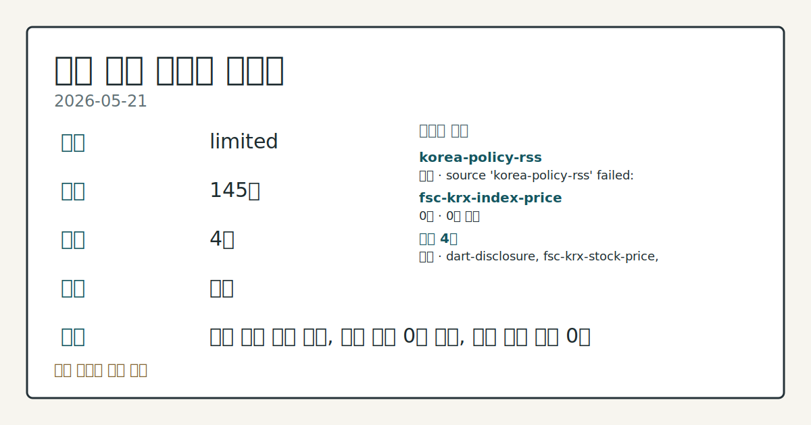
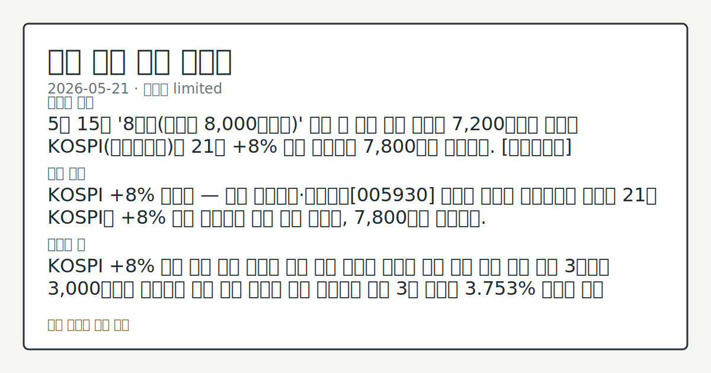
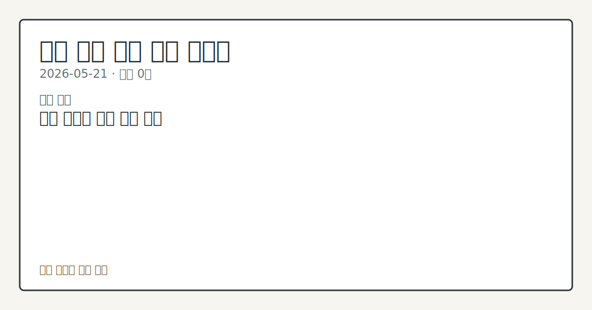

# 2026-05-21 국내 증시 시황

**기준 시각**: 2026-05-21 KST · [2026-05-20T15:00Z, 2026-05-21T15:00Z)

**세그먼트**: [국내 증시](2026-05-21.md) | [미국 증시](../../../us-equity/2026/05/2026-05-21.md)

*이미지: 데이터 신뢰도 · 출처: investo 자체 생성 · 생성: investo 0.1.0 · 2026-05-21 UTC*

> **데이터 상태**: 제한 — 수집 145건 / 소스 4개 / 누락: 없음 · 제한 — 핵심 가격 소스 0건/실패/stale, 본문 결론 신뢰도 낮음
> **소스 카운트**: 수집 대상 6 / 성공 4 / 0건 1 / 실패 1 / 본문 사용 0
> **소스 등급 분포**: S=2 / A=1 / B=1
> **상세 사유**: 일부 소스 수집 실패, 일부 소스 0건 반환, 핵심 가격 소스 0건
> **소스별 상태**: korea-policy-rss 실패 (source 'korea-policy-rss' failed: malformed XML: syntax error: line 1, column 49), fsc-krx-index-price 0건, 정상 4개
> **내 관심 자산 영향**: 데이터 수집 부족으로 매칭 판단 보류 — 추가 수집 후 재평가됩니다.
> **용어 가이드**: 이번 시황에서 처음 등장한 용어 — 시가총액(시장가치)
> **오늘의 결론**: 5월 15일 '8천피(코스피 8,000포인트)' 달성 후 사흘 연속 급락해 7,200선까지 밀렸던 KOSPI(코스피지수)가 21일 **+8%** 이상 급등하며 7,800선을 회복했다. [데이터부족]
> **핵심 동인**: ### KOSPI **+8%** 급반등 — 기관 집중매수·삼성전자[005930] 급등이 쌍끌이 연합뉴스에 따르면 21일 KOSPI가 **+8%** 이상 상승하며 사흘 만에 급반등, 7,800선을 회복했다.
> **주의할 점**: KOSPI **+8%** 반등 이후 기관 순매수 기조 지속 여부와 외국인 복귀 흐름 추세 관찰 최근 3거래일 3,000억원대 반대매매 소화 완료 신호를 수급 데이터로 확인 3년 국고채 **3.753%** 금리가 추가 하락하는지 미·이란 종전 협상 뉴스와 연동해 점검 삼성전자[005930] 급등·삼성그룹 시총 2,200조원 회복 이후 대형주 밸류에이션 변동 흐름 관찰 EU 성장률 하향(**1.4%**→**1.1%**)이 수출 대형주 실적 전망에 미치는 영향을 원/달러 환율 경로로 비교

> 정보 제공용 자동 시황이며 매매 권유가 아닙니다.

## 한눈에 보기

- KOSPI가 **+8%** 이상 급등하며 7,800선 회복 — 8,000선 돌파 후 사흘 만의 반등
- 기관이 KOSPI에서 **+29,008억원** 순매수 집중, 개인·외국인 쌍방 순매도 속 반등 주도
- 최근 3거래일 **3,000억원**대 반대매매(강제정리) 소화 이후 수급 안정 여부 — §③ 참조

## ⓪ 오늘의 매크로

- **미 국채 수익률** — UST curve 2026-05-21: 10Y 4.57%, 2Y10Y +0.49pp

## ① 요약

*이미지: 시장 스냅샷 · 출처: investo 자체 생성 · 생성: investo 0.1.0 · 2026-05-21 UTC*

5월 15일 '8천피' 달성 후 사흘 연속 급락해 7,200선까지 밀렸던 KOSPI가 21일 **+8%** 이상 급등하며 7,800선을 회복했다. 반등의 중심에는 기관의 **+29,008억원** 대규모 순매수가 있었고, 삼성전자[005930]의 급등이 지수 상승을 견인했다. 직전 영업일(5월 20일) 삼성전자 노사 잠정합의로 불강한성이 일부 해소된 흐름이 이어졌으며, 미·이란 종전(전쟁 종결) 기대감이 국내 채권 금리 하락으로 연결되며 위험 자산 선호 분위기를 강화했다. 반면 최근 3거래일간 **3,000억원**대 반대매매 압력이 누적된 바 있어, 반등 지속성은 이후 수급 흐름으로 추가 확인이 필요하다. [상승 관찰]

## ② 전일 핵심 이슈

### KOSPI **+8%** 급반등 — 기관 집중매수·삼성전자[005930] 급등이 쌍끌이

[연합뉴스](https://www.yna.co.kr/view/AKR20260521142851008)에 따르면 21일 KOSPI가 **+8%** 이상 상승하며 사흘 만에 급반등, 7,800선을 회복했다. 기관이 **+29,008억원** 순매수로 반등을 사실상 단독 주도했으며, 외국인은 **-2,212억원** 순매도를 기록했으나 낙폭이 직전 영업일 대비 크게 축소됐다. 삼성전자[005930]가 주가 급등을 기록하면서 [삼성그룹 상장사 시가총액 합산이 2,200조원을 돌파](https://www.yna.co.kr/view/AKR20260521065151008)했다.

### 반대매매 **3,000억원** — 급락장 레버리지 소화 규모 확인

[연합뉴스](https://www.yna.co.kr/view/AKR20260521153200008) 보도에 따르면 8,000선 돌파 직후 급락이 이어진 최근 3거래일 동안 **3,000억원** 규모의 반대매매(미수거래 강제정리)가 발생했다. 레버리지 정리이 하락 폭을 확대한 구조적 요인으로 지목되며, 오늘 반등과 함께 이 압력이 얼마나 소화됐는지는 이후 수급 데이터로 추이를 추적할 수 있다.

## ③ 섹터/수급 동향

### KOSPI 수급 — 기관 독주, 개인·외국인 동반 순매도

[네이버 파이낸스 KRX 자료](https://finance.naver.com/sise/investorDealTrendDay.naver?bizdate=20260521&sosok=01)에 따르면 5월 21일 KOSPI 수급은 기관이 **+29,008억원** 순매수를 기록한 반면, 개인은 **-26,754억원**, 외국인은 **-2,212억원** 순매도했다. 기타 투자자는 **-43억원**으로 중립에 가까웠다. 기관이 반등 폭을 전담하는 구조인 만큼, 외국인 복귀 여부가 상승 기조 지속의 핵심 수급 변수로 관찰된다.

### KOSDAQ 수급 — 외국인·기관 동반 순매수 전환

KOSDAQ(코스닥지수)에서는 외국인이 **+1,366억원**, 기관이 **+1,391억원** 순매수로 전환하며 KOSPI와 방향을 같이했다. 개인은 **-2,509억원** 순매도를 기록했다.

### 지주사株 — 할인율 축소 기대에 일제 강세

[연합뉴스](https://www.yna.co.kr/view/AKR20260521046451008)에 따르면 지주사 및 복합기업 종목이 21일 강세 마감했으며, 일부 종목은 두 자릿수 급등을 기록했다. 지주사 할인율(순자산가치 대비 시가 괴리율) 축소 기대감이 섹터 전반 수급을 이끈 것으로 분석된다.

### DART(전자공시시스템) 공시 동향

팬오션, 하나마이크론, 나우로보틱스 등 다수 종목에서 대량보유상황보고서가 제출됐다. 주요 주주 지분 변동 내역은 각 공시를 통해 개별 확인이 필요하다.

## ④ 지표·이벤트

### 국고채 금리 하락 — 3년물 연 **3.753%** 기록

[연합뉴스](https://www.yna.co.kr/view/AKR20260521150400008)에 따르면 미·이란 종전 기대감을 반영해 21일 국고채 금리가 대체로 하락했으며, 3년물은 연 **3.753%**를 기록했다. 장기물의 낙폭은 일부 축소됐다.

### 석유 최고가격 4회 연속 동결 — 조정 주기 2주→4주 확대

[연합뉴스](https://www.yna.co.kr/view/AKR20260521169400003)에 따르면 정부가 22일 0시부터 적용하는 6차 석유 최고가격을 동결하기로 했다. 중동전쟁발 유가 상승 압력이 지속되는 환경에서 가격 조정 주기를 2주에서 4주로 연장해 에너지 가격 안정 정책 기조를 이어갔다.

### EU 성장률 전망 하향 — **1.4%**→**1.1%**

[연합뉴스](https://www.yna.co.kr/view/AKR20260521176600082)에 따르면 EU(유럽연합)가 중동전쟁의 에너지 공급난과 물가 상승을 반영해 올해 성장률 전망을 **1.4%**에서 **1.1%**로 하향 조정했다. IMF(국제통화기금)도 프랑스에 지출 억제·연금 개혁을 촉구하는 등 유럽 재정 리스크가 부각됐다. 국내 수출 대형주 측면에서는 유럽 수요 위축이 원/달러 환율 경로를 통해 수급 영향으로 연결될 수 있어 추이 관찰이 필요하다.

## ⑤ 주요 종목

### 실적·이슈 확인 항목

| 종목 | 내용 |
|------|------|
| 삼성전자[005930] | 급등 — 삼성그룹 상장사 시총 합산 2,200조원 돌파 |
| 엑스게이트[356680] | 애프터마켓(시간외 거래)에서 **10%대** 급등 |
| 이마트 / 신세계푸드 | 이마트, 신세계푸드 주식을 기준 시가 대비 **30%** 인상가로 취득 공시 |
| 롯데렌탈[089860] | **2,119억원** 제삼자 배정 유상증자(신주 발행) 철회 — 주가 희석 우려 해소 |
| 경남제약[053950] | **190억원** 주주배정 유상증자 결정 |

### 체크리스트

| 종목·이슈 | 확인 포인트 |
|-----------|------------|
| 인제니아테라퓨틱스 | 코스닥 상장예비심사 통과 — 이후 공모 일정 추이 관찰 |
| 다이나믹디자인[145210] | 인도네시아 자회사 주식 **30억원** 추가 취득 |
| 지주사 종목 전반 | 두 자릿수 급등 후 수급 지속 여부 점검 |
| 셀레믹스 / 에이프로젠 계열 | 유상증자 정정·전환사채(CB, 주식 전환 가능 채권) 발행 공시 — 희석 규모 개별 확인 |

## ⑥ 오늘의 관전 포인트

*이미지: 관심 자산 관련성 · 출처: investo 자체 생성 · 생성: investo 0.1.0 · 2026-05-21 UTC*

- KOSPI **+8%** 반등 이후 기관 순매수 기조 지속 여부와 외국인 복귀 흐름 추세 관찰
- 최근 3거래일 **3,000억원**대 반대매매 소화 완료 신호를 수급 데이터로 확인
- 3년 국고채 **3.753%** 금리가 추가 하락하는지 미·이란 종전 협상 뉴스와 연동해 점검
- 삼성전자[005930] 급등·삼성그룹 시총 2,200조원 회복 이후 대형주 밸류에이션 변동 흐름 관찰
- EU 성장률 하향(**1.4%→1.1%**)이 수출 대형주 실적 전망에 미치는 영향을 원/달러 환율 경로로 비교

📑 트레이스 + 서명 (Stage 1/2)

- `input_hash`: `6a4b70f28c22`
- `stage1_hash`: `0cd5ed247200`
- `stage2_hash`: `3a73d1611644`

| 항목 ID | 소스 | 카테고리 | 섹션 | 제목 |
|---------|------|----------|------|------|
| 0 | dart-disclosure | news | — | [DART] 셀레믹스 - [기재정정]주요사항보고서(유상증자결정) |
| 1 | dart-disclosure | news | 5 | [DART] 팬오션 - 주식등의대량보유상황보고서(일반) |
| 2 | dart-disclosure | news | 3 | [DART] 플루토스 - 주요사항보고서 |
| 3 | dart-disclosure | news | 5 | [DART] 에이프로젠 - 주요사항보고서(자회사의 주요경영사항) |
| 4 | dart-disclosure | news | 5 | [DART] 사토시홀딩스 - 주식등의대량보유상황보고서 |
| 5 | dart-disclosure | news | 3 | [DART] 에이프로젠바이오로직스 - 주요사항보고서 |
| 6 | dart-disclosure | news | 5 | [DART] 코디 - 임원ㆍ주요주주특정증권등소유상황보고서 |
| 7 | dart-disclosure | news | 3 | [DART] 롯데렌탈 - [기재정정]주요사항보고서 |
| 8 | dart-disclosure | news | 5 | [DART] 나우로보틱스 - 주식등의대량보유상황보고서 |
| 9 | dart-disclosure | news | 3 | [DART] 이노뎁 - 임원ㆍ주요주주특정증권등소유상황보고서 |
| 10 | dart-disclosure | news | 3 | [DART] 하나마이크론 - 주식등의대량보유상황보고서 |
| 11 | dart-disclosure | news | 3 | [DART] iM금융지주 - 임원ㆍ주요주주특정증권등소유상황보고서 |
| 12 | dart-disclosure | news | 3 | [DART] 부국증권 - 임원ㆍ주요주주특정증권등소유상황보고서 |
| 13 | dart-disclosure | news | 3 | [DART] 모바일어플라이언스 - 주식등의대량보유상황보고서 |
| 14 | dart-disclosure | news | 3 | [DART] 에이프로젠 - 주요사항보고서 |
| 15 | dart-disclosure | news | 5 | [DART] 지투지바이오 - 임원ㆍ주요주주특정증권등소유상황보고서 |
| 16 | dart-disclosure | news | 3 | [DART] 파인엠텍 - 주요사항보고서 |
| 17 | dart-disclosure | news | 5 | [DART] 에스디생명공학 - 전환사채발행후만기전사채취득 (제4회차) |
| 18 | dart-disclosure | news | 5 | [DART] 아이티엠반도체 - 주식등의대량보유상황보고서 |
| 19 | dart-disclosure | news | 3 | [DART] 지투지바이오 - 임원ㆍ주요주주특정증권등소유상황보고서 |
| 20 | dart-disclosure | news | 3 | [DART] 서울전자통신 - 주식등의대량보유상황보고서 |
| 21 | dart-disclosure | news | 3 | [DART] 오로라 - 주식등의대량보유상황보고서 |
| 22 | dart-disclosure | news | 3 | [DART] 서울전자통신 - 임원ㆍ주요주주특정증권등소유상황보고서 |
| 23 | fsc-krx-stock-price | price | 3 | 삼성전자[005930] 276,000원 (+0.18%, +500) |
| 24 | fsc-krx-stock-price | price | 5 | SK하이닉스[000660] 1,745,000원  |
| 25 | fsc-krx-stock-price | price | 5 | NAVER[035420] 191,500원 (-3.33%, -6,600) |
| 26 | fsc-krx-stock-price | price | 5 | 현대차[005380] 592,000원  |
| 27 | fsc-krx-stock-price | price | 5 | 셀트리온[068270] 179,400원 (-1.70%, -3,100) |
| 28 | krx-foreign-flows | price | 5 | KOSPI 개인 순매도 -26,754억원 (2026-05-21) |
| 29 | krx-foreign-flows | price | 3 | KOSPI 외국인 순매도 -2,212억원 (2026-05-21) |
| 30 | krx-foreign-flows | price | 3 | KOSPI 기관 순매수 +29,008억원 (2026-05-21) |
| 31 | krx-foreign-flows | price | 3 | KOSPI 기타 순매도 -43억원 (2026-05-21) |
| 32 | krx-foreign-flows | price | 3 | KOSDAQ 개인 순매도 -2,509억원 (2026-05-21) |
| 33 | krx-foreign-flows | price | 3 | KOSDAQ 외국인 순매수 +1,366억원 (2026-05-21) |
| 34 | krx-foreign-flows | price | 3 | KOSDAQ 기관 순매수 +1,391억원 (2026-05-21) |
| 35 | krx-foreign-flows | price | 3 | KOSDAQ 기타 순매도 -248억원 (2026-05-21) |
| 36 | yonhap-market | news | 3 | 美 월마트, 고객 발길은 늘었는데…물류비 급등에 이익 '발목' |
| 37 | yonhap-market | news | 2 | 뉴욕증시, 이란 농축 우라늄 반출 반대설에 하락 출발 |
| 38 | yonhap-market | news | 2 | 프랑스 재정 경고음…IMF "지출 억제·연금 개혁" 촉구 |
| 39 | yonhap-market | news | 4 | 엑스게이트, 애프터마켓서 10%대 급등 |
| 40 | yonhap-market | news | 5 | EU, 올해 성장률 전망 1.4→1.1％ 낮췄다…중동전쟁 여파 |
| 41 | yonhap-market | news | 4 | 인제니아테라퓨틱스, 코스닥 상장예심 통과 |
| 42 | yonhap-market | news | 5 | 석유 최고가격, 4회 연속 동결…조정 주기 '2주→4주'로 늘린다 |
| 43 | yonhap-market | news | 4 | 롯데렌탈, 제삼자 배정 유상증자 철회…"주가 희석 우려 해소" |
| 44 | yonhap-market | news | 5 | 다이나믹디자인 "인도네시아 자회사 주식 30억원에 추가취득" |
| 45 | yonhap-market | news | 5 | 상장 앞둔 스페이스X, 투자설명서 살펴보니…"달에 도시 짓겠다" |
| 46 | yonhap-market | news | 2 | '재무장' 독일, 전차 제작사 지분 놓고 프랑스와 신경전 |
| 47 | yonhap-market | news | 2 | '종전 기대' 3년·10년물 국고채 금리↓…낙폭은 축소(종합) |
| 48 | yonhap-market | news | 4 | 경남제약, 190억원 주주배정 유상증자 결정 |
| 49 | yonhap-market | news | 5 | '8천피' 돌파후 급락장에…최근 3일간 3천억 반대매매로 강제청산 |
| 50 | yonhap-market | news | 2 | 이마트, 신세계푸드 매수가 인상 공시…스타벅스 리스크도 적시 |
| 51 | yonhap-market | news | 5 | 코스피, 8% 급등하며 7,800 회복…외인, 순매도 크게 축소했다(종합2보) |
| 52 | yonhap-market | news | 2 | 한국산업은행 'KDB V:Launch 2026 남부권펀드 세션' 개최 |
| 53 | yonhap-market | news | 4 | 국고채 금리 대체로 하락…3년물 연 3.753% |
| 54 | yonhap-market | news | 4 | [특징주] '할인율 축소' 지주사株 강세 마감…일부 종목 두자릿수 급등(종합) |
| 55 | yonhap-market | news | 5 | [표] 코스피 지수선물·옵션 시세표(21일)-3 |
| 56 | yonhap-market | news | 4 | [표] 코스피 지수선물·옵션 시세표-2 |
| 57 | yonhap-market | news | 4 | [표] 코스피 지수선물·옵션 시세표-1 |
| 58 | yonhap-market | news | 4 | 삼성전자 급등에…그룹 상장사 시총 합계도 2천200조원 돌파(종합) |
| 59 | yonhap-market | news | 5 | 코스피, 8% 급등하며 7,800 회복…외인, 순매도 크게 축소했다 |

## ⑦ 면책조항
본 시황은 일반 정보 제공을 목적으로 자동 생성된 자료이며,
특정 종목·자산에 대한 매매 권유나 투자 자문이 아닙니다.
투자 결정과 그 결과에 대한 책임은 전적으로 본인에게 있으며,
본 시황의 내용에 따라 발생한 손실에 대해 작성자는 일체의 책임을 지지 않습니다.