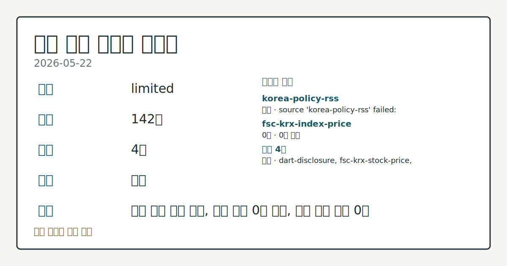
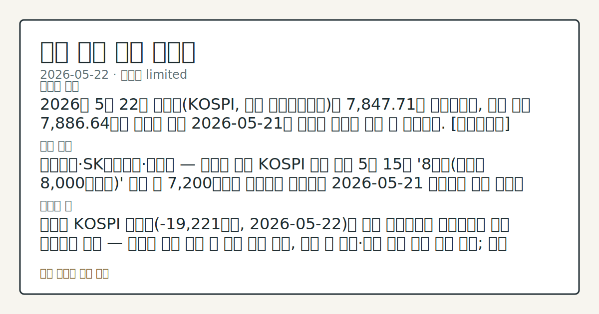
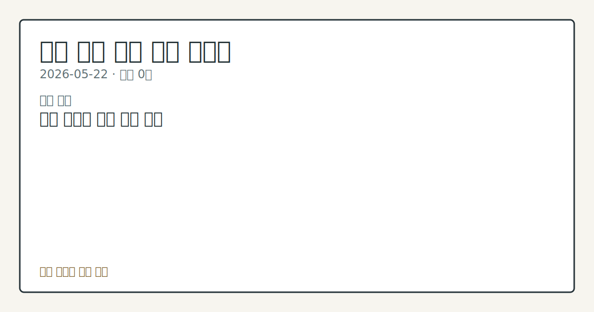

# 2026-05-22 국내 증시 시황

**기준 시각**: 2026-05-22 KST · [2026-05-21T15:00Z, 2026-05-22T15:00Z)

**세그먼트**: [국내 증시](2026-05-22.md) | [미국 증시](../../../us-equity/2026/05/2026-05-22.md) | [크립토](../../../crypto/2026/05/2026-05-22.md)

*이미지: 데이터 신뢰도 · 출처: investo 자체 생성 · 생성: investo 0.1.0 · 2026-05-23 UTC*

> **데이터 상태**: 제한 — 수집 142건 / 소스 4개 / 누락: 없음 · 제한 — 핵심 가격 소스 0건/실패/stale, 본문 결론 신뢰도 낮음
> **소스 카운트**: 수집 대상 6 / 성공 4 / 0건 1 / 실패 1 / 본문 사용 미집계
> **소스 등급 분포**: S=2 / A=1 / B=1
> **상세 사유**: 일부 소스 수집 실패, 일부 소스 0건 반환, 핵심 가격 소스 0건
> **소스별 상태**: korea-policy-rss 실패 (source 'korea-policy-rss' failed: malformed XML: syntax error: line 1, column 49), fsc-krx-index-price 0건, 정상 4개
> **내 관심 자산 영향**: 데이터 수집 부족으로 매칭 판단 보류 — 추가 수집 후 재평가됩니다.
> **오늘의 결론**: 5월 21일 KOSPI **+8%** 급반등 이후 22일에는 투자주체별 수급이 뚜렷하게 갈리는 장세가 이어졌다. [데이터부족]
> **핵심 동인**: KOSPI 외국인 순매도 -19,221억원 — 개인·기관 방어 구조 지속 22일 KOSPI에서 외국인은 -19,221억원을 순매도해 전날 급반등 이후에도 이탈 압력이 꺾이지 않았다.
> **주의할 점**: KOSPI 외국인 순매도 규모 변화와 개인·기관의 방어력 유지 흐름 점검 KOSDAQ 외국인 순매수 지속 여부와 양자컴퓨팅 테마 관련주의 모멘텀 관찰 삼성전기[009150]의 시총 5위 등극 이후 관련 수급 데이터 비교 국민성장펀드 설정 완료 이후 ETF 순자산 및 시장 수급 파급 흐름 점검 국고채 3년물 연 **3.736%** 기준으로 금리 방향성과 외국인 채권·주식 수급 연동 추세 관찰 코스피200 구성종목 변경(DB하이텍 추가·GS건설[006360] 제외)에 따른 패시브 자금 수급 변화 확인 美-이

> 정보 제공용 자동 시황이며 매매 권유가 아닙니다.

## 한눈에 보기

- KOSPI(코스피) 외국인 **-19,221억원** 순매도 지속 속 개인(**+10,655억원**)·기관(**+7,583억원**) 방어, KOSDAQ(코스닥)에서는 외국인 **+5,975억원** 순매수로 수급 분화
- 미국 정부 양자컴퓨팅 기업 지분투자 발표에 국내 관련주 급등, 삼성전기[009150]가 LG에너지솔루션[373220]을 제치고 시총 **5위** 접근
- 국민성장펀드 첫날 한도 **87%** 소진 및 국고채 3년물 연 **3.736%** 하락 — 본문 §③·§④ 참조

## ⓪ 오늘의 매크로

- **FOMC 일정** — 2026-06-17 — FOMC Meeting
- **미 국채 수익률** — UST curve 2026-05-22: 10Y 4.56%, 2Y10Y +0.43pp

## ① 요약

*이미지: 시장 스냅샷 · 출처: investo 자체 생성 · 생성: investo 0.1.0 · 2026-05-23 UTC*

5월 21일 KOSPI **+8%** 급반등 이후 22일에는 투자주체별 수급이 뚜렷하게 갈리는 장세가 이어졌다. KOSPI에서 외국인이 **-19,221억원** 순매도를 지속하는 반면, 개인(**+10,655억원**)과 기관(**+7,583억원**)이 연속으로 방어에 나서 수급 균형이 유지됐다. KOSDAQ에서는 외국인이 **+5,975억원** 순매수로 전환하며 양자컴퓨팅 테마 관련주 상승을 이끌었다. 미국-이란 종전 기대감이라는 지정학적 호재가 시장 심리를 지지하는 가운데, 국민성장펀드의 첫날 **87%** 소진으로 개인 자금의 간접투자 유입도 확인됐다. 외국인 KOSPI 대규모 순매도와 거시 호재가 공존하는 혼재 장세였다. [혼재]

## ② 전일 핵심 이슈

### KOSPI 외국인 순매도 **-19,221억원** — 개인·기관 방어 구조 지속

[22일 KOSPI에서 외국인은 -19,221억원을 순매도](https://finance.naver.com/sise/investorDealTrendDay.naver?bizdate=20260522&sosok=01)해 전날 급반등 이후에도 이탈 압력이 꺾이지 않았다. 개인과 기관이 이를 상쇄하며 하방을 지지했다. KOSDAQ에서는 외국인이 **+5,975억원** 순매수, 기관이 **+3,010억원** 순매수로 가담한 반면 개인은 **-8,793억원** 순매도로 대조를 이뤄, 대형주(KOSPI)와 테마 중소형주(KOSDAQ) 간 수급 온도차가 두드러졌다.

### 美정부 양자컴퓨팅 기업 지분투자 — 국내 관련주 급등

[미국 정부가 양자컴퓨팅 기업들을 지원하고 지분을 확보한다는 소식](https://www.yna.co.kr/view/AKR20260522042652008)이 전해지면서 22일 국내 관련 종목들이 줄줄이 상승했다. KOSDAQ 외국인 순매수와 맞물려 기술 테마 중심의 자금 이동이 확인됐다.

### 美-이란 종전 기대감 — 지정학 리스크 완화, 심리 지지

[미국과 이란의 종전 협의 기대감이 고조](https://www.yna.co.kr/view/AKR20260522164400009)되며 뉴욕증시가 상승 출발했다. 이 지정학적 완화 신호는 KOSPI 투자심리를 지지하는 배경으로 작용했으나, 주식시장 외국인의 대규모 순매도가 동시에 진행된 점에서 직접적인 수급 효과는 제한적으로 확인된다.

### 이재명 대통령 자본시장 경쟁력 강화 발언

[이재명 대통령은 22일 "경제 대도약을 위해 자본시장을 글로벌 경쟁력 플랫폼으로 키울 것"이라고 밝혔다.](https://www.yna.co.kr/view/AKR20260522144200008) 정책 당국의 자본시장 육성 의지가 공식 확인된 것으로, 중장기 정책 동향을 관찰할 배경이 마련됐다.

## ③ 섹터/수급 동향

### KOSPI vs KOSDAQ 수급 분화 — 외국인 방향 엇갈림

KOSPI에서 [외국인 **-19,221억원** 순매도](https://finance.naver.com/sise/investorDealTrendDay.naver?bizdate=20260522&sosok=01)가 이어지는 반면, KOSDAQ에서는 외국인이 **+5,975억원** 순매수를 기록했다. ETF(상장지수펀드) 중심으로 집중되는 개인 매기가 KOSPI 간접투자 채널로 흡수되면서 KOSDAQ 개인 순매도(**-8,793억원**)와 맞물리는 수급 구조가 형성됐다.

### 국민성장펀드 첫날 **87%** 소진 — 내수 자금 유입 확인

[국민참여형 국민성장펀드가 출시 첫날 판매물량의 87% 가까이 소진](https://www.yna.co.kr/view/AKR20260522158300002)됐으며 은행 10곳 중 7곳이 완판을 기록했다. [다올증권은 이 같은 ETF 중심 개인 매기 집중이 과거 강세장을 보였던 대만 증시 수급 구조와 유사하다며 코스피 '1만피(10,000포인트)' 가능성을 제시](https://www.yna.co.kr/view/AKR20260522126200008)했다.

### 코스피200 구성종목 변경 — DB하이텍 추가·GS건설[006360] 제외

[코스피200(코스피 상위 200종목 지수)에 DB하이텍 등 4개 종목이 새로 포함되고 GS건설[006360] 등 4개 종목이 제외](https://www.yna.co.kr/view/AKR20260522130000008)된다. 지수 추종 자금의 수급 이동이 수반되는 구조 변화로 확인된다.

## ④ 지표·이벤트

### 국고채 3년물 연 **3.736%** — 외국인 채권 순매수에 동반 하락

[외국인의 국채 순매수세에 힘입어 22일 국고채(국고채권) 금리가 일제히 하락했다.](https://www.yna.co.kr/view/AKR20260522128151008) 3년물이 연 **3.736%**를 기록했다. KOSPI 주식시장에서 외국인이 대규모 순매도를 이어가는 동시에 채권시장에서는 순매수로 접근한 복합 자금 흐름이 포착됐다.

### 전남광주통합특별시 1금고 — NH농협은행 선정 (약 21조원 규모)

[약 21조원 규모의 전남광주통합특별시 1금고 첫 운영기관으로 NH농협은행이 선정](https://www.yna.co.kr/view/AKR20260522141501054)됐다. 대규모 공공자금 유치로 NH농협은행의 운용 자산 규모 변동이 확인되는 이벤트다.

### 독일 외국 자본 투자 급감 — 글로벌 자본 흐름 배경 지표

[독일로 유입되는 외국 자본 투자가 크게 감소](https://www.yna.co.kr/view/AKR20260522162800082)한 것으로 나타났다. 에너지 비용 부담과 관료주의가 주요 원인으로 지목됐다. 글로벌 자본 이동 패턴의 배경 지표로 점검된다.

## ⑤ 주요 종목

### 시총 변동 확인

- **삼성전기[009150]**: [주가 상승세가 빨라지며 LG에너지솔루션[373220]을 제치고 시총 5위에 접근](https://www.yna.co.kr/view/AKR20260522138300008)했다고 보도됐다.

### 테마 동향 관찰

- **양자컴퓨팅 관련주**: 미국 정부 지분투자 소식에 국내 관련 종목들이 급등 흐름을 보였다. 개별 종목별 수치는 입력 데이터에 미포함.
- **삼성전자[005930]·SK하이닉스[000660]**: [단일종목 레버리지·인버스 ETF 18종이 5월 27일 유가증권시장에 상장](https://www.yna.co.kr/view/AKR20260522140100008) 예정이다.

### 자본 조달 확인

- **아모텍[052710]**: [시설자금 등 약 350억원 조달을 위한 주주배정후 실권주 일반공모 유상증자를 결정](https://www.yna.co.kr/view/AKR20260522147300008)했다.
- **오에스피[368970]**: [운영자금 등 약 10억원 조달을 위한 제3자배정 유상증자를 결정](https://www.yna.co.kr/view/AKR20260522140200008)했다.
- **EDGC**: DART(전자공시시스템) 공시에 따르면 유상증자 및 감자 관련 기재정정 보고서가 접수됐다.

### 지분·구조 변동 확인

- **티이엠씨[425040]**: [에이텍솔루션 주식 약 350억원 어치를 취득해 지분율 **31.2%**를 확보](https://www.yna.co.kr/view/AKR20260522141800008)했다고 공시했다.
- **롯데에너지머티리얼즈**: [자회사 롯데에코월을 1,708억원 규모에 매각](https://www.yna.co.kr/view/AKR20260522140300003)하고 핵심사업 경쟁력 강화에 속도를 낸다.
- **크레버스**: DART 공시 기준으로 최대주주변경을 수반하는 주식담보계약 기재정정이 접수됐다.

## ⑥ 오늘의 관전 포인트

*이미지: 관심 자산 관련성 · 출처: investo 자체 생성 · 생성: investo 0.1.0 · 2026-05-23 UTC*

- KOSPI 외국인 순매도 규모 변화와 개인·기관의 방어력 유지 흐름 점검
- KOSDAQ 외국인 순매수 지속 여부와 양자컴퓨팅 테마 관련주의 모멘텀 관찰
- 삼성전기[009150]의 시총 5위 등극 이후 관련 수급 데이터 비교
- 국민성장펀드 설정 완료 이후 ETF 순자산 및 시장 수급 파급 흐름 점검
- 국고채 3년물 연 **3.736%** 기준으로 금리 방향성과 외국인 채권·주식 수급 연동 추세 관찰
- 코스피200 구성종목 변경(DB하이텍 추가·GS건설[006360] 제외)에 따른 패시브 자금 수급 변화 확인
- 美-이란 종전 협의 진행 상황이 국내 증시 투자심리에 미치는 영향 관찰

📑 트레이스 + 서명 (Stage 1/2)

- `input_hash`: `908ad69cd9ae`
- `stage1_hash`: `c06f8599d323`
- `stage2_hash`: `363a983ed0a9`

| 항목 ID | 소스 | 카테고리 | 섹션 | 제목 |
|---------|------|----------|------|------|
| 0 | dart-disclosure | news | — | [DART] 아모텍 - 주요사항보고서(유무상증자결정) |
| 1 | dart-disclosure | news | 5 | [DART] EDGC - [기재정정]주요사항보고서 |
| 2 | dart-disclosure | news | 5 | [DART] EDGC - [기재정정]주요사항보고서 |
| 3 | dart-disclosure | news | 5 | [DART] EDGC - [기재정정]주요사항보고서 |
| 4 | dart-disclosure | news | 5 | [DART] CS - [첨부정정]주요사항보고서 |
| 5 | dart-disclosure | news | 5 | [DART] 크레버스 - [기재정정]최대주주변경을수반하는주식담보제공계약체결 |
| 6 | dart-disclosure | news | 5 | [DART] SKC - 임원ㆍ주요주주특정증권등소유상황보고서 |
| 7 | dart-disclosure | news | 5 | [DART] KC그린홀딩스 - 주식등의대량보유상황보고서(약식) |
| 8 | dart-disclosure | news | 3 | [DART] 코이즈 - 주요사항보고서 |
| 9 | dart-disclosure | news | 5 | [DART] 에이프로젠바이오로직스 - 주식등의대량보유상황보고서 |
| 10 | dart-disclosure | news | 3 | [DART] 바이넥스 - 임원ㆍ주요주주특정증권등소유상황보고서 |
| 11 | dart-disclosure | news | 3 | [DART] 한국첨단소재 - 주요사항보고서 |
| 12 | dart-disclosure | news | 5 | [DART] 유티아이 - 전환사채(해외전환사채포함)발행후만기전사채취득 (제1회차) |
| 13 | dart-disclosure | news | 5 | [DART] 엠젠솔루션 - [첨부정정]주요사항보고서 |
| 14 | dart-disclosure | news | 5 | [DART] 코미코 - 권리락 (무상증자) |
| 15 | dart-disclosure | news | 5 | [DART] 오에스피 - 주요사항보고서 |
| 16 | dart-disclosure | news | 5 | [DART] 천보 - 전환사채권발행결정(자회사의 주요경영사항) |
| 17 | dart-disclosure | news | 5 | [DART] 대한광통신 - 임원ㆍ주요주주특정증권등거래계획보고서 |
| 18 | dart-disclosure | news | 5 | [DART] 대한광통신 - 임원ㆍ주요주주특정증권등거래계획보고서 |
| 19 | dart-disclosure | news | 5 | [DART] 디디아이와이에스40위탁관리부동산투자회사 - 특수관계인의유상증자참여 |
| 20 | dart-disclosure | news | 5 | [DART] 제이에스티나 - 주식등의대량보유상황보고서 |
| 21 | dart-disclosure | news | 3 | [DART] 바이넥스 - 주식등의대량보유상황보고서 |
| 22 | dart-disclosure | news | 3 | [DART] 이노스페이스 - 임원ㆍ주요주주특정증권등소유상황보고서 |
| 23 | dart-disclosure | news | 5 | [DART] 지투지바이오 - [기재정정]임원ㆍ주요주주특정증권등소유상황보고서 |
| 24 | fsc-krx-stock-price | price | 5 | 삼성전자[005930] 299,500원 (+8.51%, +23,500) |
| 25 | fsc-krx-stock-price | price | 5 | SK하이닉스[000660] 1,940,000원 (+11.17%, +195,000) |
| 26 | fsc-krx-stock-price | price | 5 | NAVER[035420] 199,500원  |
| 27 | fsc-krx-stock-price | price | 5 | 현대차[005380] 666,000원  |
| 28 | fsc-krx-stock-price | price | 5 | 셀트리온[068270] 189,600원 (+5.69%, +10,200) |
| 29 | krx-foreign-flows | price | 5 | KOSPI 개인 순매수 +10,655억원 (2026-05-22) |
| 30 | krx-foreign-flows | price | 3 | KOSPI 외국인 순매도 -19,221억원 (2026-05-22) |
| 31 | krx-foreign-flows | price | 3 | KOSPI 기관 순매수 +7,583억원 (2026-05-22) |
| 32 | krx-foreign-flows | price | 3 | KOSPI 기타 순매수 +984억원 (2026-05-22) |
| 33 | krx-foreign-flows | price | 3 | KOSDAQ 개인 순매도 -8,793억원 (2026-05-22) |
| 34 | krx-foreign-flows | price | 3 | KOSDAQ 외국인 순매수 +5,975억원 (2026-05-22) |
| 35 | krx-foreign-flows | price | 3 | KOSDAQ 기관 순매수 +3,010억원 (2026-05-22) |
| 36 | krx-foreign-flows | price | 3 | KOSDAQ 기타 순매도 -192억원 (2026-05-22) |
| 37 | yonhap-market | news | 3 | 뉴욕증시, 美-이란 종전 합의 기대감에 상승 출발 |
| 38 | yonhap-market | news | 2 | 독일 투자유치 반토막…"에너지 비싸고 관료주의 발목" |
| 39 | yonhap-market | news | 4 | CJ그룹 여직원 330명 개인정보, 텔레그램서 가상화폐로 팔려 |
| 40 | yonhap-market | news | 2 | 국민성장펀드 출시 첫날 한도 87% 소진…은행 10곳 중 7곳 완판 |
| 41 | yonhap-market | news | 3 | 전남광주 통합특별시 1금고 첫 운영기관 '농협은행'(종합) |
| 42 | yonhap-market | news | 2 | [표] 주간 코스닥 외국인 순매수도 상위종목 |
| 43 | yonhap-market | news | 3 | [표] 주간 코스닥 기관 순매수도 상위종목 |
| 44 | yonhap-market | news | 3 | [표] 주간 거래소 외국인 순매수도 상위종목 |
| 45 | yonhap-market | news | 3 | [표] 주간 거래소 기관 순매수도 상위종목 |
| 46 | yonhap-market | news | 3 | 아모텍, 350억원 주주배정 유상증자 결정 |
| 47 | yonhap-market | news | 5 | [특징주] 美정부, 양자컴퓨팅 기업 지분투자에 관련株 급등(종합2보) |
| 48 | yonhap-market | news | 2 | 李대통령 "경제 대도약 위해 자본시장 글로벌 경쟁력 플랫폼으로 키울것" |
| 49 | yonhap-market | news | 2 | 롯데에너지머티, 자회사 롯데에코월 매각…1천708억원 규모 |
| 50 | yonhap-market | news | 5 | 전남광주통합시 1금고 첫 운영기관 '농협은행' |
| 51 | yonhap-market | news | 2 | '삼전·닉스 단일종목 레버리지·인버스' 18종 27일 상장 |
| 52 | yonhap-market | news | 5 | 티이엠씨 "에이텍솔루션 주식 350억원어치 취득…지분율 31.2%" |
| 53 | yonhap-market | news | 5 | 오에스피, 10억원 제3자배정 유상증자 |
| 54 | yonhap-market | news | 5 | 삼성전기, LG엔솔 제치고 시총 5위…급등장에 시총 '대전' |
| 55 | yonhap-market | news | 5 | 국고채 금리, 외인 순매수에 동반 하락…3년물 연 3.736%(종합) |
| 56 | yonhap-market | news | 4 | 코스피200 DB하이텍 포함되고, GS건설 빠진다…4개종목 맞교체 |
| 57 | yonhap-market | news | 3 | [표] 코스피 지수선물·옵션 시세표(22일)-3 |
| 58 | yonhap-market | news | 4 | [표] 코스피 지수선물·옵션 시세표-2 |
| 59 | yonhap-market | news | 4 | [표] 코스피 지수선물·옵션 시세표-1 |
| 60 | yonhap-market | news | 4 | 다올증권 "최근 코스피 수급, 대만과 유사…'1만피' 가능" |

## ⑦ 면책조항
본 시황은 일반 정보 제공을 목적으로 자동 생성된 자료이며,
특정 종목·자산에 대한 매매 권유나 투자 자문이 아닙니다.
투자 결정과 그 결과에 대한 책임은 전적으로 본인에게 있으며,
본 시황의 내용에 따라 발생한 손실에 대해 작성자는 일체의 책임을 지지 않습니다.