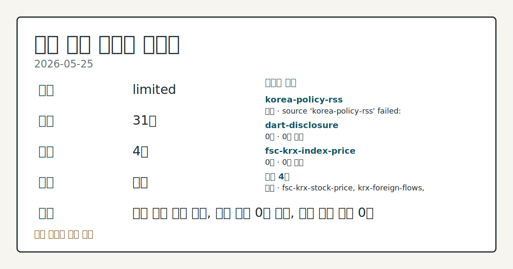
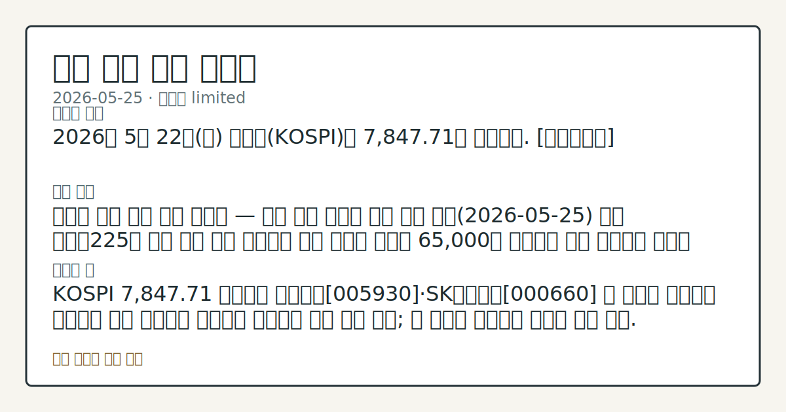

> 정보 제공용 자동 시황이며 매매 권유가 아닙니다.

# 2026-05-25 국내 증시 시황

**기준 시각**: 2026-05-25 KST · [2026-05-24T15:00Z, 2026-05-25T15:00Z)

| 종목 | 종가 | 변동 | 비고 |
|------|------|------|------|
| ^KOSPI | 7,847.71 | — | — |
| KRW=X | 1,510.97 | — | — |

**세그먼트**: [국내 증시](2026-05-25.md) | [미국 증시](../../../us-equity/2026/05/2026-05-25.md) | [크립토](../../../crypto/2026/05/2026-05-25.md)

*이미지: 데이터 신뢰도 · 출처: investo 자체 생성 · 생성: investo 0.1.0 · 2026-05-25 UTC*

> **내 관심 자산 영향**: 데이터 수집 부족으로 매칭 판단 보류 — 추가 수집 후 재평가됩니다.
> **용어 가이드**: 이번 시황에서 처음 등장한 용어 — 거래대금(거래총액)
> **오늘의 결론**: 2026년 5월 22일(금) 코스피(KOSPI)는 7,847.71로 마감했다. [데이터부족]
> **핵심 동인**: 아시아 증시 동반 사상 최고치 — 국내 개장 환경에 우호 신호 오늘(2026-05-25) 일본 닛케이225가 이란 전쟁 종전 기대감과 유가 하락에 힘입어 65,000을 돌파하며 사상 최고치를 연달아 경신했다.
> **주의할 점**: KOSPI 7,847.71 기준으로 삼성전자[005930]·SK하이닉스[000660] 등 반도체 대형주의 급등세가 오늘 개장에서 연속성을 확인하면 상방 압력...

> **데이터 상태**: 제한 · 본문 사용 미집계 · 실패 1 · 0건 2

수집/품질 진단

> **데이터 상태**: 제한 — 수집 31건 / 소스 4개 / 누락: 없음 · 제한 — 핵심 가격 소스 0건/실패/stale, 본문 결론 신뢰도 낮음
> **소스 카운트**: 수집 대상 7 / 성공 4 / 0건 2 / 실패 1 / 본문 사용 미집계
> **소스 등급 분포**: S=1 / A=1 / B=2
> **상세 사유**: 일부 소스 수집 실패, 일부 소스 0건 반환, 핵심 가격 소스 0건
> **소스별 상태**: korea-policy-rss 실패 (수집 불가), dart-disclosure 0건, fsc-krx-index-price 0건, 정상 4개

## 한눈에 보기

- 전일(2026-05-22) KOSPI(한국 종합주가지수) **7,847.71** 마감, 삼성전자[005930] **+8.51%**·SK하이닉스[000660] **+11.17%**·현대차[005380] **+12.50%** 등 대형주 동반 급등
- 오늘(2026-05-25) 일본 닛케이225(일본 대표 평균주가지수)가 **65,000**을 돌파하며 사상 최고치를 연달아 경신, 대만 증시도 ATH 갱신 — AI 열풍·중동 긴장 완화 배경
- 외국인이 지난주 KOSPI에서 삼성전자·SK하이닉스를 중심으로 10조원 순매도한 가운데 27일 단일종목 레버리지 ETF(상장지수펀드) 상장에 따른 변동성 확대 여부 점검

## ⓪ 오늘의 매크로

- **미 국채 수익률** — UST curve 2026-05-22: 10Y 4.56%, 2Y10Y +0.43pp

## ⓪-B 채널 기준선

| 기준선 | 값 |
|------|------|
| 코스피 | 7,847.71 (—) |
| 코스닥 | 미수집 |
| 원/달러 | 1,510.97 (—) |

> **크로스마켓 연결 고리**: 금리 이벤트가 할인율/달러 경로의 공통 변수로 남아 있습니다.

## ① 요약

*이미지: 시장 스냅샷 · 출처: investo 자체 생성 · 생성: investo 0.1.0 · 2026-05-25 UTC*

2026년 5월 22일 코스피는 **7,847.71**로 마감했다. 삼성전자[005930] **+8.51%**, SK하이닉스[000660] **+11.17%**, 현대차[005380] **+12.50%** 등 시가총액 상위 대형주가 동반 급등하며 지수를 견인했다. 원/달러 환율은 **1,510.97**원에 마감했다. 이달 코스피 일평균 거래대금이 사상 처음 40조원을 돌파하며 활황세가 수치로도 확인됐다. 오늘 개장을 앞두고 일본 닛케이225가 65,000을 돌파하며 사상 최고치를 경신했고 대만 증시도 ATH를 갱신해 아시아 전반에서 우호적 외부 환경이 형성됐다. 전일 미국장의 흐름은 오늘 오전 국내 개장에서 외국인 수급 방향과 함께 확인이 필요하다. 다만 외국인은 KOSPI에서 12거래일 연속 순매도를 이어가고 있어 수급 방향이 엇갈리는 국면이 관찰된다. [상승 관찰]

## ② 전일 핵심 이슈

### 아시아 증시 동반 사상 최고치 — 국내 개장 환경에 우호 신호

오늘 일본 닛케이225가 [이란 전쟁 종전 기대감과 유가 하락에 힘입어 65,000을 돌파하며 사상 최고치를 연달아 경신](https://www.yna.co.kr/view/AKR20260525016152073)했다. [대만 증시 역시 AI(인공지능) 열풍과 중동 긴장 완화 분위기 속에 사상 최고치를 갈아치웠다](https://www.yna.co.kr/view/AKR20260525046000009). 반도체·AI 종목을 공유하는 국내 증시에서 삼성전자[005930]·SK하이닉스[000660] 등 코스피 수급과의 연관 영향이 관찰되는 배경이다. 어제(2026-05-22) 대형주 주도 KOSPI 회복이 확인된 데 이어, 오늘 아시아 동조화 신호가 추가되며 상승 흐름의 연장선상에 있다.

> **그래서 의미는?** 아시아 반도체·AI 테마 동조화가 국내 대형주 수급을 지지하는 흐름으로 관찰되며, 외국인 순매도 지속 여부와 함께 확인이 필요합니다.

### 코스피 일평균 거래대금 40조원 첫 돌파 — 활황 속 회전율은 하락

[이달 코스피의 하루 평균 거래대금이 사상 처음 40조원을 넘어섰다](https://www.yna.co.kr/view/AKR20260523029000008). 다만 '손바뀜'(주식 보유자 교체 회전율)은 오히려 줄어들어, 거래대금 증가가 단기 투기보다 보유 중심 매매 구조에서 비롯되고 있다는 해석이 가능하다. 직전 영업일(2026-05-22) 삼성전자·SK하이닉스·현대차가 대형주 주도 회복 흐름을 이끌었다는 최근 컨텍스트와 방향이 일치한다.

## ③ 섹터/수급 동향

### 반도체 투톱 레버리지 ETF 27일 상장 — 당국 경고와 변동성 점검

오는 27일 삼성전자[005930]·SK하이닉스[000660]를 기초자산으로 하는 [단일종목 레버리지 ETF가 상장](https://www.yna.co.kr/view/AKR20260524022500002)된다. 기초자산 주가 흐름을 ±2배로 추종하는 구조로, 금융당국은 '고위험상품 투자주의'를 경고했다. 일부 운용사는 [당국 경고에 따라 상장 이벤트 계획을 철회](https://www.yna.co.kr/view/AKR20260522131300008)했다.

> **그래서 의미는?** 레버리지 ETF 상장이 기초 종목 삼성전자·SK하이닉스의 단기 변동폭을 확대하는 구조적 요인으로 작용하는지 관찰이 필요합니다.

### 수급 흐름 — 외국인 KOSPI 순매도 지속, KOSDAQ(코스닥)에선 순매수 전환

[2026-05-22 기준](https://finance.naver.com/sise/investorDealTrendDay.naver?bizdate=20260522&sosok=01) KOSPI에서 외국인은 **-19,221억원** 순매도했고, 개인은 **+10,655억원**, 기관은 **+7,583억원** 순매수로 이를 맞받았다. [연합뉴스에 따르면 외국인은 12거래일 연속 KOSPI 순매도를 이어가며 지난주 삼성전자·SK하이닉스를 중심으로 10조원 순매도를 집행](https://www.yna.co.kr/view/AKR20260524021500008)했다. 반면 로봇·ESS(에너지저장시스템) 관련 종목은 같은 기간 외국인이 순매수한 것으로 확인됐다. [KOSDAQ에서는 외국인이 **+5,975억원** 순매수](https://finance.naver.com/sise/investorDealTrendDay.naver?bizdate=20260522&sosok=02)로 방향을 달리했고, 기관도 **+3,010억원** 순매수로 가담했다. 개인만 KOSDAQ에서 **-8,793억원** 순매도를 기록했다.

### K-ETF 해외 상장 — 외국인 접근성 확대 예정

[하반기 홍콩·미국 시장에 국내 대표지수와 삼성전자·SK하이닉스 연계 K-ETF가 추가 상장될 예정](https://www.yna.co.kr/view/AKR20260522115600008)으로, 국내 증시 활황을 배경으로 해외 투자자의 접근성 확대 논의가 구체화된 흐름을 확인할 수 있다.

## ④ 지표·이벤트

### 원/달러 환율 **1,510.97**원 마감

원/달러 환율(달러 대비 원화 환율)은 장중 고가 **1,515.30**원에서 저가 **1,506.22**원 구간을 경유한 후 **1,510.97**원으로 마감했다([출처: stooq](https://stooq.com/q/?s=usdkrw)). 반도체·자동차 등 주요 수출주 실적과 외국인 KOSPI 수급에 동시에 영향을 미치는 변수로, 환율이 1,510원대를 유지하는 동안 외국인의 원화 자산 환차손 부담 경감 여부가 수급 방향을 결정짓는 관건으로 남는다.

> **그래서 의미는?** 환율이 1,510원 이상을 유지하는 한 원화 약세 기조가 이어지며 외국인 KOSPI 수급 복귀의 핵심 관찰 변수로 점검이 필요합니다.

## ⑤ 주요 종목

### 급등 확인 종목 (2026-05-22 종가 기준)

| 종목 | 종가 | 등락 | 등락률 |
|------|------|------|--------|
| 삼성전자[005930] | 299,500원 | +23,500 | **+8.51%** |
| SK하이닉스[000660] | 1,940,000원 | +195,000 | **+11.17%** |
| 현대차[005380] | 666,000원 | +74,000 | **+12.50%** |
| NAVER[035420] | 199,500원 | +8,000 | **+4.18%** |
| 셀트리온[068270] | 189,600원 | +10,200 | **+5.69%** |

> **그래서 의미는?** 삼성전자(반도체)·SK하이닉스(반도체)·현대차(자동차) 등 코스피 시총 상위 대형주의 동반 급등은 지수 상방을 이끈 핵심 동인임을 확인합니다.

### 체크리스트

- **삼성전자[005930]**: 전일 **+8.51%** 급등 마감. 오는 27일 단일종목 레버리지 ETF 기초자산으로 상장 이후 추가 변동 흐름 확인 예정.
- **SK하이닉스[000660]**: 전일 **+11.17%** 급등, 장중 **1,954,000**원 고가 터치. 외국인 순매도 환경에서 기관·개인 매수가 지지한 구조 확인.
- **현대차[005380]**: 전일 **+12.50%** 급등. 이란 종전 기대에 연동된 글로벌 경기 회복 기대 반영 여부 점검.
- **NAVER[035420]**: 전일 **+4.18%** 상승. AI 테마 연동 흐름 여부 확인.
- **셀트리온[068270]**: 전일 **+5.69%** 상승. 개별 모멘텀 지속 흐름 확인.

## ⑥ 오늘의 관전 포인트

| 관찰 신호 | 현재 | 상방 확인 조건 | 하방 확인 조건 | 신뢰도 | 섹션 내 관심 영향 |
| --- | --- | --- | --- | --- | --- |
| KOSPI **7,847.71** 기준으로 삼성전자[0… | — | 데이터부족 | 데이터부족 | 데이터부족 | — |
| 5월 27일 단일종목 레버리지 ETF 상장 이후 기초자… | — | 데이터부족 | 데이터부족 | 데이터부족 | — |
| 외국인 KOSPI 순매도(**-19,221억원**, 2… | — | 데이터부족 | 데이터부족 | 데이터부족 | — |
| 원/달러 환율이 장중 저가 | — | 데이터부족 | 데이터부족 | 데이터부족 | — |
| 일본 닛케이225의 사상 최고치 경신 이후 추가 | — | 데이터부족 | 데이터부족 | 데이터부족 | — |
| `input_hash`: `aa03eed7fbe3` | — | 데이터부족 | 데이터부족 | 데이터부족 | — |

_관전 신호 2건 추가 — 본문 참조._
## ⑦ 면책조항
본 시황은 일반 정보 제공을 목적으로 자동 생성된 자료이며,
특정 종목·자산에 대한 매매 권유나 투자 자문이 아닙니다.
투자 결정과 그 결과에 대한 책임은 전적으로 본인에게 있으며,
본 시황의 내용에 따라 발생한 손실에 대해 작성자는 일체의 책임을 지지 않습니다.