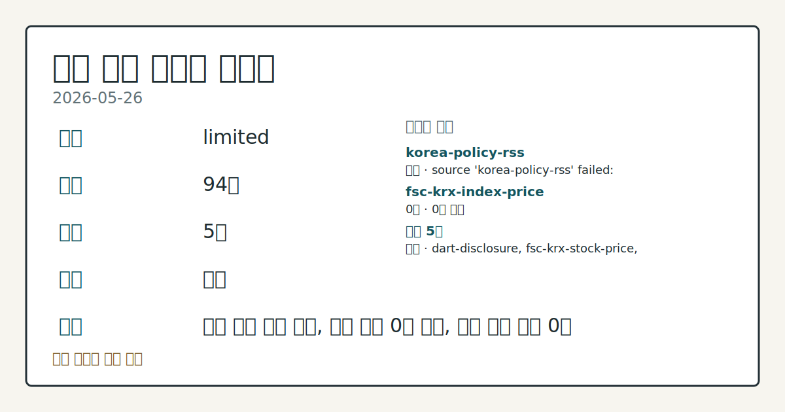
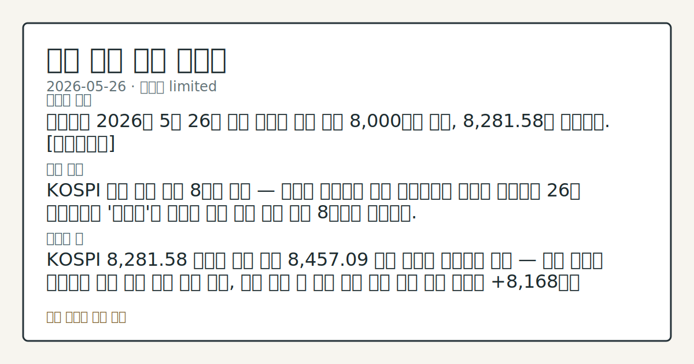

> 정보 제공용 자동 시황이며 매매 권유가 아닙니다.

# 2026-05-26 국내 증시 시황

**기준 시각**: 2026-05-26 KST · [2026-05-25T15:00Z, 2026-05-26T15:00Z)

| 종목 | 종가 | 변동 | 비고 |
|------|------|------|------|
| ^KOSPI | 8,281.58 | — | — |
| ^KOSDAQ | 140.00 | — | — |
| KRW=X | 1,499.83 | — | — |

**세그먼트**: [국내 증시](2026-05-26.md) | [미국 증시](../../../us-equity/2026/05/2026-05-26.md) | [크립토](../../../crypto/2026/05/2026-05-26.md)

*이미지: 데이터 신뢰도 · 출처: investo 자체 생성 · 생성: investo 0.1.0 · 2026-05-27 UTC*

> **내 관심 자산 영향**: 데이터 수집 부족으로 매칭 판단 보류 — 추가 수집 후 재평가됩니다.
> **오늘의 결론**: 코스피가 2026년 5월 26일 사상 최초로 종가 기준 8,000선을 돌파, 8,281.58로 마감했다. [데이터부족]
> **핵심 동인**: KOSPI 사상 최초 종가 8천피 돌파 — 반도체 쌍두마차 주도 연합뉴스에 따르면 코스피는 26일 반도체주가 '불기둥'을 뿜으며 사상 처음 종가 기준 8천피를 돌파했다.
> **주의할 점**: KOSPI 8,281.58 종가가 장중 고점 8,457.09 대비 격차를 좁히는지 확인 — 격차 축소를 확인하면 상방 지속 압력 관찰 가능, 격차 유지 시 단기...

> **데이터 상태**: 제한 · 본문 사용 미집계 · 실패 1 · 0건 1

수집/품질 진단

> **데이터 상태**: 제한 — 수집 94건 / 소스 5개 / 누락: 없음 · 제한 — 핵심 가격 소스 0건/실패/stale, 본문 결론 신뢰도 낮음
> **소스 카운트**: 수집 대상 7 / 성공 5 / 0건 1 / 실패 1 / 본문 사용 미집계
> **소스 등급 분포**: S=2 / A=1 / B=2
> **상세 사유**: 일부 소스 수집 실패, 일부 소스 0건 반환, 핵심 가격 소스 0건
> **소스별 상태**: korea-policy-rss 실패 (수집 불가), fsc-krx-index-price 0건, 정상 5개

## 한눈에 보기

- KOSPI(한국 종합주가지수) 종가 기준 사상 최초 **8,281.58** 돌파, 장중 최고치 **8,457.09** 경신
- SK하이닉스[000660]가 **+5.72%** 상승해 **2,052,000원** '200만닉스' 사상 최초 달성
- 기관 단독 순매수 **+8,168억원** 독주 — 외국인·개인 동반 이탈 지속 여부가 수급 핵심 관찰 포인트

> **용어 가이드**: KOSPI, KOSDAQ(코스닥 시장 지수), KRX(한국거래소), KTB(국고채권), CCI(소비자신뢰지수), T+1(체결 다음 영업일 결제), JV(합작회사)

## ⓪ 오늘의 매크로

- **미 국채 수익률** — UST curve 2026-05-26: 10Y 4.50%, 2Y10Y +0.49pp

## ⓪-B 채널 기준선

| 기준선 | 값 |
|------|------|
| 코스피 | 8,281.58 (—) |
| 코스닥 | 140.00 (—) |
| 원/달러 | 1,499.83 (—) |

> **크로스마켓 연결 고리**: 금리 이벤트가 할인율/달러 경로의 공통 변수로 남아 있습니다.

## ① 요약

*이미지: 시장 스냅샷 · 출처: investo 자체 생성 · 생성: investo 0.1.0 · 2026-05-27 UTC*

코스피가 2026년 5월 26일 사상 최초로 종가 기준 8,000선을 돌파, **8,281.58**로 마감했다. 장중에는 **8,457.09**까지 오르며 최고치를 경신했다. 5월 15일 처음 8천피를 달성한 뒤 7,200선까지 급락했던 조정 구간을 완전히 회복한 것으로, 직전 22일 마감가 7,847.71에서 닷새 만에 8천피 돌파 및 안착을 확인했다. SK하이닉스[000660]의 사상 첫 '200만닉스' 달성과 삼성전자[005930] 동반 상승이 반도체 섹터 전체를 끌어올렸고, 미-이란 종전 협상 기대감이 전반적 리스크 선호 환경을 뒷받침했다. 원/달러 환율은 **1,499.83원**으로 1,500원선을 소폭 하회해 마감했다. 코스닥은 **140.00**으로 집계됐다. [상승 관찰]

## ② 전일 핵심 이슈

### KOSPI 사상 최초 종가 8천피 돌파 — 반도체 쌍두마차 주도

[연합뉴스](https://www.yna.co.kr/view/AKR20260526067551008)에 따르면 코스피는 26일 반도체주가 '불기둥'을 뿜으며 사상 처음 종가 기준 8천피를 돌파했다. SK하이닉스[000660]가 **+5.72%** 급등해 '200만닉스'를 사상 최초 달성했고, 삼성전자[005930]는 **+2.22%** 상승했다. KRX 이사장은 이를 두고 ["코리아 프리미엄(Korea Premium) 시대를 향한 출발점"](https://www.yna.co.kr/view/AKR20260526148700008)이라고 평가했다.

> **그래서 의미는?** 외국인·개인이 동시 순매도를 기록한 가운데도 기관 집중매수만으로 사상 최고치를 경신했다는 점에서 수급 주체 편중 여부는 확인 필요 항목으로...

### 미-이란 종전 기대 — 지정학적 리스크 완화와 국내 연동

[연합뉴스](https://www.yna.co.kr/view/AKR20260526176200009)에 따르면 미-이란 종전 합의 기대감이 고조되며 뉴욕증시 3대 지수가 26일 상승 출발했다. 이 지정학적 완화 신호는 국내 시장에서 KTB 금리 하락과 유가 하락으로 연동돼 나타났으며, 기관의 공격적 순매수 배경으로 작용한 것으로 관찰된다.

## ③ 섹터/수급 동향

### 기관 독주 순매수 — 개인·외국인 동시 이탈

[네이버 파이낸스 KRX 미러](https://finance.naver.com/sise/investorDealTrendDay.naver?bizdate=20260526&sosok=01) 기준 KOSPI 주체별 수급:

| 주체 | 순매수(억원) |
|------|-------------|
| 기관 | **+8,168** |
| 개인 | **-5,745** |
| 외국인 | **-1,321** |
| 기타 | **-1,102** |

KOSDAQ에서는 [개인이 **+2,306억원**](https://finance.naver.com/sise/investorDealTrendDay.naver?bizdate=20260526&sosok=02) 순매수로 유입됐으나, 외국인 **-1,031억원**, 기관 **-256억원**, 기타 **-1,018억원**으로 나머지 3주체는 이탈했다.

> **그래서 의미는?** KOSPI 최고치 경신의 실질 동력은 기관 단독 매수였으며, 개인·외국인은 고가권 이탈 흐름을 보였다는 점에서 상승 지속 여부 재평가 여지가...

### 반도체·자동차 섹터 동반 상승

SK하이닉스[000660] **+5.72%**, 삼성전자[005930] **+2.22%**로 반도체 섹터가 지수를 견인했다. 현대차[005380]도 **+5.19%** 상승하며 자동차 섹터가 동참했다. LG이노텍[011070]은 기판 수익성 개선 기대감에 주가가 크게 올라 ['황제주(주가 1,000,000원 이상)'](https://www.yna.co.kr/view/AKR20260526056951008) 반열에 올랐다.

### 국민성장펀드 — 이틀 만에 **97.5%** 소진

[연합뉴스](https://www.yna.co.kr/view/AKR20260526169500002)에 따르면 국민참여형 국민성장펀드가 출시 이틀 만에 전체 판매물량의 **97.5%**가 소진됐다. 은행 온·오프라인 채널 모두 완판에 근접한 수준이다.

## ④ 지표·이벤트

### 원/달러 환율 1,499.83원 — 1,500원선 하회 마감

[stooq](https://stooq.com/q/?s=usdkrw) 기준 USD/KRW(원/달러) 환율은 고가 **1,506.83원**에서 저가 **1,498.13원**까지 하락한 뒤 **1,499.83원**으로 마감했다.

> **그래서 의미는?** 원화 강세는 달러 환산 자산 가치 관점에서 외국인 유입 환경에 유리하게 작용할 수 있으나, 이날 외국인 KOSPI 순매도 기록과 직접 연결...

### 국고채 금리 일제히 하락 — 3년물 연 **3.664%**

[연합뉴스](https://www.yna.co.kr/view/AKR20260526144451008)에 따르면 미-이란 종전 협상 기대와 유가 하락이 맞물리며 KTB 금리가 26일 일제히 하락, 3년물은 연 **3.664%**를 기록했다.

### 미 CCI 5월 악화 — 고물가 충격 국내 간접 관찰

[연합뉴스](https://www.yna.co.kr/view/AKR20260526178400072)에 따르면 미국 5월 CCI가 중동전쟁발 고물가 충격으로 악화했다. 서구 선진국의 실질임금 감소도 [보고됐다](https://www.yna.co.kr/view/AKR20260526122100009). 국내 영향으로는 대미 수출 기업의 소비 둔화 노출이 관찰 포인트다.

### T+1 결제주기 단축 토론회 — '속도보다 안정적 이행' 논의

[연합뉴스](https://www.yna.co.kr/view/AKR20260526161400008)에 따르면 T+1 결제 단축 토론회가 열려 개인·외국인·증권업계가 속도보다 안정적 이행 필요성을 논의했다.

## ⑤ 주요 종목

### 급등 확인 항목

| 종목 | 종가 | 등락률 | 비고 |
|------|------|--------|------|
| SK하이닉스[000660] | 2,052,000원 | **+5.72%** | 사상 최초 '200만닉스' 달성 |
| 현대차[005380] | 689,000원 | **+5.19%** | 자동차 섹터 동반 강세 |
| 삼성전자[005930] | 299,000원 | **+2.22%** | 프리마켓 주문오류 해프닝 후 정상 마감 |
| LG이노텍[011070] | — | — | 기판 수익성 개선 기대, '황제주' 등극 확인 |
| 한양이엔지[045100] | — | — | 애프터마켓 10%대 급등 확인 |

### 하락·관찰 항목

| 종목 | 종가 | 등락률 | 비고 |
|------|------|--------|------|
| NAVER[035420] | 200,000원 | **-1.48%** | — |
| 셀트리온[068270] | 195,000원 | **-1.86%** | — |
| 솔루스첨단소재[336370] | — | — | 애프터마켓 10%대 급락 확인 |

### 공시·이벤트 체크리스트

- 삼성전자[005930]: 프리마켓 시초가 기준 **18%** 급락 표시 — [연합뉴스](https://www.yna.co.kr/view/AKR20260526160900008)는 주문 실수 가능성을 지적; 본 거래 종가는 **+2.22%** 정상 마감
- LG에너지솔루션(LG Energy Solution): 혼다(Honda) 합작 JV 'L-H 배터리 컴퍼니'에서 토지·장비 제외 건물을 [3조7천억원에 처분 결정](https://www.yna.co.kr/view/AKR20260526160500003)

> **그래서 의미는?** SK하이닉스(반도체)와 현대차(자동차)가 이날 KOSPI 상승을 실질적으로 이끌었으며, NAVER와 셀트리온(바이오)은 지수 상승과 반대...

## ⑥ 오늘의 관전 포인트

| 관찰 신호 | 현재 | 상방 확인 조건 | 하방 확인 조건 | 신뢰도 | 섹션 내 관심 영향 |
| --- | --- | --- | --- | --- | --- |
| KOSPI **8,281.58** 종가가 | — | 데이터부족 | 데이터부족 | 데이터부족 | — |
| 기관 순매수 **+8,168억원** 독주 구도가 | — | 데이터부족 | 데이터부족 | 데이터부족 | — |
| SK하이닉스[000660] '200만닉스' 달성 이후 … | — | 데이터부족 | 데이터부족 | 데이터부족 | — |
| 원/달러 환율 **1,499.83원**이 | — | 데이터부족 | 데이터부족 | 데이터부족 | — |
| 미-이란 종전 협상 추가 | — | 데이터부족 | 데이터부족 | 데이터부족 | — |
| T+1 결제주기 단축 이행 일정 구체화 여부를 관찰 —… | — | 데이터부족 | 데이터부족 | 데이터부족 | — |

_관전 신호 3건 추가 — 본문 참조._
## ⑦ 면책조항
본 시황은 일반 정보 제공을 목적으로 자동 생성된 자료이며,
특정 종목·자산에 대한 매매 권유나 투자 자문이 아닙니다.
투자 결정과 그 결과에 대한 책임은 전적으로 본인에게 있으며,
본 시황의 내용에 따라 발생한 손실에 대해 작성자는 일체의 책임을 지지 않습니다.