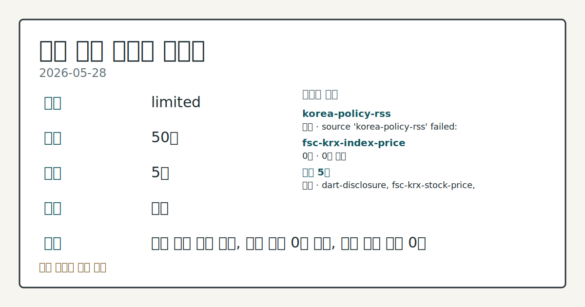
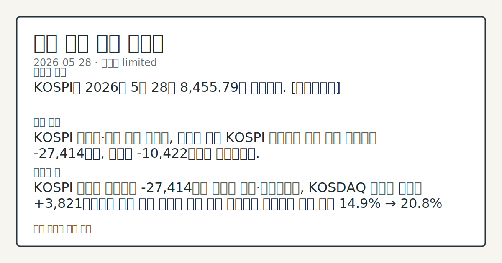

> 정보 제공용 자동 시황이며 매매 권유가 아닙니다.

# 2026-05-28 국내 증시 시황

**기준 시각**: 2026-05-28 KST · [2026-05-27T15:00Z, 2026-05-28T15:00Z)

| 종목 | 종가 | 변동 | 비고 |
|------|------|------|------|
| ^KOSPI | 8,455.79 | — | — |
| ^KOSDAQ | 220.00 | — | — |
| KRW=X | 1,503.13 | — | — |

**세그먼트**: [국내 증시](2026-05-28.md) | [미국 증시](../../../us-equity/2026/05/2026-05-28.md) | 크립토(미발행)

*이미지: 데이터 신뢰도 · 출처: investo 자체 생성 · 생성: investo 0.1.0 · 2026-05-29 UTC*

> **내 관심 자산 영향**: 데이터 수집 부족으로 매칭 판단 보류 — 추가 수집 후 재평가됩니다.
> **오늘의 결론**: KOSPI는 2026년 5월 28일 8,455.79로 마감했다. [데이터부족]
> **핵심 동인**: KOSPI 외국인·기관 동반 순매도, 개인이 방어 KOSPI 투자자별 동향 기준 외국인이 -27,414억원, 기관이 -10,422억원을 순매도했다.
> **주의할 점**: KOSPI 외국인 순매도가 -27,414억원 수준을 지속·확대하는지, KOSDAQ 외국인 순매수 +3,821억원과의 온도 차이 추세를 비교 관찰 국민연금...

> **데이터 상태**: 제한 · 본문 사용 미집계 · 실패 1 · 0건 1

수집/품질 진단

> **데이터 상태**: 제한 — 수집 50건 / 소스 5개 / 누락: 없음 · 제한 — 핵심 가격 소스 0건/실패/stale, 본문 결론 신뢰도 낮음
> **소스 카운트**: 수집 대상 7 / 성공 5 / 0건 1 / 실패 1 / 본문 사용 미집계
> **소스 등급 분포**: S=2 / A=1 / B=2
> **상세 사유**: 일부 소스 수집 실패, 일부 소스 0건 반환, 핵심 가격 소스 0건
> **소스별 상태**: korea-policy-rss 실패 (수집 불가), fsc-krx-index-price 0건, 정상 5개

## 한눈에 보기

- KOSPI(코스피, 한국 종합주가지수)가 **8,455.79**로 마감하며 5월 26일 8,000선 돌파 이후 상승 흐름을 연장했고, 원/달러 환율은 **1,503.13**원을 기록했다.
- [국민연금](https://www.yna.co.kr/view/AKR20260528168051530)이 올해 국내주식 목표 비중을 **14.9%** → **20.8%**로 확대 결정 — 당일 최대 수급 재료로 관찰됐다.
- 미 4월 PCE(개인소비지출) 물가 **+3.8%** 상승(2년 11개월 최고)과 1분기 GDP(국내총생산) **1.6%** 하향 조정이 글로벌 매크로 불강한성을 높이는 변수로 부상 — 본문 §④ 참조.

## ⓪ 오늘의 매크로

- **미 국채 수익률** — UST curve 2026-05-28: 10Y 4.45%, 2Y10Y +0.46pp

## ⓪-B 채널 기준선

| 기준선 | 값 |
|------|------|
| 코스피 | 8,455.79 (—) |
| 코스닥 | 220.00 (—) |
| 원/달러 | 1,503.13 (—) |

> **크로스마켓 연결 고리**: 금리 이벤트가 할인율/달러 경로의 공통 변수로 남아 있습니다.

## ① 요약

*이미지: 시장 스냅샷 · 출처: investo 자체 생성 · 생성: investo 0.1.0 · 2026-05-29 UTC*

KOSPI는 2026년 5월 28일 **8,455.79**로 마감했다. 5월 26일 사상 최초 종가 기준 8,000선 돌파 후 이틀 연속 추가 상승이 확인됐다. 코스닥은 **220.00**에 마감했다. 원/달러 환율은 **1,503.13**원이다.

수급 구조는 개인이 KOSPI에서 **+36,146억원** 순매수로 지수를 방어한 반면, 외국인 **-27,414억원**·기관 **-10,422억원**이 동반 순매도했다. 전일 뉴욕 증시가 미·이란 교전 소식과 PCE·GDP 지표를 소화하며 [하락 출발](https://www.yna.co.kr/view/AKR20260528189600009)한 점이 국내 외국인·기관 매도세와 맞물렸고, 국민연금의 국내주식 노출 변화 점검 결정이 개인 매수 심리를 지지했다. 코스피 자체는 상승했으나 수급 주체 간 방향이 엇갈려 신호가 혼재된 날이었다. [혼재]

## ② 전일 핵심 이슈

### KOSPI 외국인·기관 동반 순매도, 개인이 방어

[KOSPI 투자자별 동향](https://finance.naver.com/sise/investorDealTrendDay.naver?bizdate=20260528&sosok=01) 기준 외국인이 **-27,414억원**, 기관이 **-10,422억원**을 순매도했다. 개인은 **+36,146억원**을 순매수해 지수 하방을 막았다. 전일 뉴욕 증시가 미·이란 교전 소식과 PCE·GDP 발표를 소화하며 하락 출발한 흐름이 국내 외국인·기관 매도로 이어진 것으로 관찰된다.

> **그래서 의미는?** 외국인·기관이 동반 순매도하는 가운데 개인 홀로 지수를 끌어올린 구조로, 상승 지속성에 대한 수급 확인이 필요한 상황입니다.

### 금통위(금융통화위원회) 매파 신호·중동 불안 겹치며 국고채 금리 상승

[연합뉴스](https://www.yna.co.kr/view/AKR20260528152951008)에 따르면 한국은행 금통위가 매파적 성향을 강하게 드러내고 중동 전쟁 불안이 재확산하면서 국고채 금리가 동반 상승했다. 국고채 3년물은 연 **3.766%**를 기록했다. 이는 국내 금리 민감 섹터의 밸류에이션 재평가 여지로 작용할 수 있다는 점에서 국내 영향을 점검할 필요가 있다.

### EU(유럽연합), 중국 테무 과징금·징둥 M&A 제동

[연합뉴스](https://www.yna.co.kr/view/AKR20260528179151098)에 따르면 EU가 중국 전자상거래 플랫폼 테무에 약 3,500억원 규모의 과징금을 부과하고 징둥 M&A에도 제동을 걸었다. 글로벌 플랫폼 규제 강화 흐름이 국내 이커머스·플랫폼주에 미치는 수급 영향을 코스피 연관 측면에서 추가 확인이 필요하다.

## ③ 섹터/수급 동향

### 국민연금 국내주식 목표 비중 **14.9%** → **20.8%** 확대

[연합뉴스](https://www.yna.co.kr/view/AKR20260528168051530)에 따르면 국민연금이 올해 국내주식 보유 목표 비중을 기존 **14.9%**에서 **20.8%**로 확대하기로 결정했다. 목표 비중 상향은 중장기 대형주 중심의 기관 순매수 여력이 확대될 수 있다는 시그널로 해석된다.

> **그래서 의미는?** 국민연금의 노출 변화 점검 결정은 대형주 수급의 중기 지지 요인으로 관찰되지만, 실제 집행 시기와 종목 구성에 대한 추가 확인이 필요합니다.

### KOSDAQ 수급 — 외국인 순매수 vs. 기관 순매도

[KOSDAQ 투자자별 동향](https://finance.naver.com/sise/investorDealTrendDay.naver?bizdate=20260528&sosok=02) 기준 외국인이 **+3,821억원** 순매수해 KOSPI 대비 차별화된 흐름을 보였다. 기관은 **-4,011억원** 순매도했다. KOSPI에서 외국인이 대규모 순매도를 기록한 것과 달리, KOSDAQ에서는 외국인이 매수 우위를 나타낸 점이 눈에 띈다.

### 반도체 — 삼성전자 약세 vs. SK하이닉스 강세

삼성전자[005930]가 **-2.44%** 하락 마감한 반면 SK하이닉스[000660]는 **+2.05%** 상승하며 반도체 섹터 내 종목 간 차별화 흐름이 관찰됐다. 5월 26일 반도체 쌍두마차가 동반 주도한 흐름에서 이탈해 삼성전자 단독 약세가 두드러진 날이다.

## ④ 지표·이벤트

### 미 1분기 GDP **1.6%**로 하향 조정

[연합뉴스](https://www.yna.co.kr/view/AKR20260528186451072)에 따르면 미국 1분기 경제 성장률이 속보치 **2.0%**에서 **1.6%**로 하향 조정됐다. 재고투자와 소비 항목이 모두 하향 반영된 결과다.

> **그래서 의미는?** 미국 성장세 둔화 재확인은 국내 수출 중심 대형주의 실적 전망 재평가 여지를 제공하며, 원/달러 환율 경로와 함께 점검할 필요가 있습니다.

### 미 4월 PCE 물가 전년 대비 **+3.8%** (2년 11개월 만에 최고)

[연합뉴스](https://www.yna.co.kr/view/AKR20260528186151072)에 따르면 미·이란 전쟁에 따른 고유가 충격으로 4월 PCE 가격지수 상승률이 전년 대비 **+3.8%**를 기록해 2년 11개월 만에 최고치를 나타냈다.

### 미 주간 신규 실업수당 청구 21만5천건 — 전망 상회

[연합뉴스](https://www.yna.co.kr/view/AKR20260528189400072)에 따르면 지난주(5월 17~23일) 미국 신규 실업수당 청구 건수가 **21만5천건**으로 한 주 전보다 **5천건** 증가해 전망치를 웃돌았다.

### 국고채 3년물 연 **3.766%**

매파적 금통위 기조와 중동 불안이 겹치며 국고채 금리가 상승했다. 3년물은 연 **3.766%**로 마감했다.

## ⑤ 주요 종목

### 가격 변동 관찰

| 종목 | 종가 | 등락 |
|------|------|------|
| 삼성전자[005930] | 299,500원 | -2.44% (-7,500) |
| SK하이닉스[000660] | 2,289,000원 | +2.05% (+46,000) |
| NAVER[035420] | 205,000원 | +3.12% (+6,200) |
| 현대차[005380] | 677,000원 | -0.59% (-4,000) |
| 셀트리온[068270] | 190,000원 | -2.31% (-4,500) |

> **그래서 의미는?** 삼성전자(005930)·셀트리온(068270) 하락 vs. SK하이닉스(000660)·NAVER(035420) 상승으로 대형주 내 수급...

### 애프터마켓 급등 확인 항목

[플리토[300080]](https://www.yna.co.kr/view/AKR20260528171500008), [한텍[098070]](https://www.yna.co.kr/view/AKR20260528163300008), [애경산업[018250]](https://www.yna.co.kr/view/AKR20260528153400008)이 각각 애프터마켓에서 10%대 급등을 기록했다.

### DART(전자공시시스템) 최대주주 변경 체크리스트

- [알엔티엑스](https://dart.fss.or.kr/dsaf001/main.do?rcpNo=20260528901113): 최대주주 변경 및 주식양수도계약 체결
- [서울전자통신](https://dart.fss.or.kr/dsaf001/main.do?rcpNo=20260528901060): 최대주주 변경 관련 주식담보제공계약 체결
- [신테카바이오](https://dart.fss.or.kr/dsaf001/main.do?rcpNo=20260528901045): 최대주주 변경 관련 주식담보제공계약 체결

## ⑥ 오늘의 관전 포인트

| 관찰 신호 | 현재 | 상방 확인 조건 | 하방 확인 조건 | 신뢰도 | 섹션 내 관심 영향 |
| --- | --- | --- | --- | --- | --- |
| KOSPI 외국인 순매도가 | — | 데이터부족 | 데이터부족 | 데이터부족 | — |
| 국민연금 국내주식 목표 비중 **14.9% → 20.8… | — | 데이터부족 | 데이터부족 | 데이터부족 | — |
| 국고채 3년물 **3.766%**가 | — | 데이터부족 | 데이터부족 | 데이터부족 | — |
| 미 4월 PCE **+3.8%** 고물가 | — | 데이터부족 | 데이터부족 | 데이터부족 | — |
| 삼성전자[005930] **-2.44%** 하락 vs … | — | 데이터부족 | 데이터부족 | 데이터부족 | — |
| `input_hash`: `45f4f8a3450d` | — | 데이터부족 | 데이터부족 | 데이터부족 | — |

_관전 신호 2건 추가 — 본문 참조._
## ⑦ 면책조항
본 시황은 일반 정보 제공을 목적으로 자동 생성된 자료이며,
특정 종목·자산에 대한 매매 권유나 투자 자문이 아닙니다.
투자 결정과 그 결과에 대한 책임은 전적으로 본인에게 있으며,
본 시황의 내용에 따라 발생한 손실에 대해 작성자는 일체의 책임을 지지 않습니다.