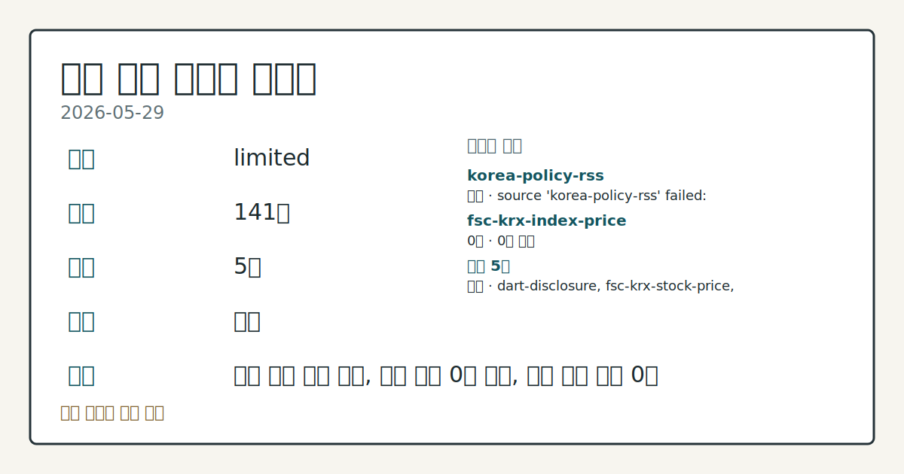
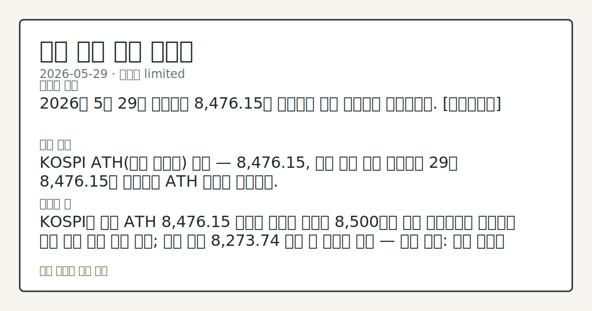

> 정보 제공용 자동 시황이며 매매 권유가 아닙니다.

# 2026-05-29 국내 증시 시황

**기준 시각**: 2026-05-29 KST · [2026-05-28T15:00Z, 2026-05-29T15:00Z)

| 종목 | 종가 | 변동 | 비고 |
|------|------|------|------|
| ^KOSPI | 8,476.15 | — | — |
| ^KOSDAQ | 220.00 | — | — |
| KRW=X | 1,503.13 | — | — |

**세그먼트**: [국내 증시](2026-05-29.md) | [미국 증시](../../../us-equity/2026/05/2026-05-29.md) | 크립토(미발행)

*이미지: 데이터 신뢰도 · 출처: investo 자체 생성 · 생성: investo 0.1.0 · 2026-05-30 UTC*

> **내 관심 자산 영향**: 데이터 수집 부족으로 매칭 판단 보류 — 추가 수집 후 재평가됩니다.
> **오늘의 결론**: 2026년 5월 29일 코스피는 8,476.15로 마감하며 사상 최고치를 재경신했다. [데이터부족]
> **핵심 동인**: KOSPI ATH(사상 최고치) 경신 — 8,476.15, 기관 단독 주도 코스피는 29일 8,476.15로 마감하며 ATH 행진을 이어갔다.
> **주의할 점**: KOSPI가 오늘 ATH 8,476.15 위에서 기사에 언급된 8,500선을 상향 돌파하는지 확인하면 추가 상방 압력 추세 확인; 오늘 저점 8,273.74...

> **데이터 상태**: 제한 · 본문 사용 미집계 · 실패 1 · 0건 1

수집/품질 진단

> **데이터 상태**: 제한 — 수집 141건 / 소스 5개 / 누락: 없음 · 제한 — 핵심 가격 소스 0건/실패/stale, 본문 결론 신뢰도 낮음
> **소스 카운트**: 수집 대상 7 / 성공 5 / 0건 1 / 실패 1 / 본문 사용 미집계
> **소스 등급 분포**: S=2 / A=1 / B=2
> **상세 사유**: 일부 소스 수집 실패, 일부 소스 0건 반환, 핵심 가격 소스 0건
> **소스별 상태**: korea-policy-rss 실패 (수집 불가), fsc-krx-index-price 0건, 정상 5개

## 한눈에 보기

- KOSPI(한국 종합주가지수) **8,476.15** 사상 최고치 경신 마감, KOSDAQ(코스닥지수)는 **2%**대 하락 **220.00** — 지수 간 뚜렷한 대조.
- 삼성전자[005930]가 HBM4E(고대역폭 메모리 7세대) 샘플 첫 출하 소식에 급등, 우선주 포함 시총 **2천조원** 돌파.
- KOSPI 기관 **+23,688억원** 순매수 vs 외국인 **-10,421억원** 순매도 — 수급 주체 엇갈림을 §③에서 점검.

## ⓪ 오늘의 매크로

- **FOMC 일정** — 2026-06-17 — FOMC Meeting
- **미 국채 수익률** — UST curve 2026-05-29: 10Y 4.45%, 2Y10Y +0.47pp

## ⓪-B 채널 기준선

| 기준선 | 값 |
|------|------|
| 코스피 | 8,476.15 (—) |
| 코스닥 | 220.00 (—) |
| 원/달러 | 1,503.13 (—) |

> **크로스마켓 연결 고리**: 금리 이벤트가 할인율/달러 경로의 공통 변수로 남아 있습니다.

## ① 요약

*이미지: 시장 스냅샷 · 출처: investo 자체 생성 · 생성: investo 0.1.0 · 2026-05-30 UTC*

2026년 5월 29일 코스피는 **8,476.15**로 마감하며 [사상 최고치를 재경신](https://www.yna.co.kr/view/AKR20260529122651008)했다. 전일(2026-05-28) **8,455.79**에서 이어진 상승 기조 속에, 미국과 이란의 종전 협상 기대감이 뉴욕증시 상승 출발로 이어지면서 국내 개장 심리에도 우호 신호를 제공했다. 반면 코스닥지수는 **220.00**으로 **2%**대 하락하며 코스피와 극명히 대조를 이뤘다. 원/달러 환율은 **1,503.13**원이었으며, 국고채(정부발행채권) 3년물 금리는 유가 하락과 국채 발행 축소의 영향으로 연 **3.731%**로 하락 마감했다. [혼재]

## ② 전일 핵심 이슈

### KOSPI ATH 경신 — **8,476.15**, 기관 단독 주도

[코스피는 29일 **8,476.15**로 마감하며 ATH 행진을 이어갔다.](https://www.yna.co.kr/view/AKR20260529122651008) 시초가 **8,384.31**에서 출발해 저점 **8,273.74**까지 내려갔다가, 고점이자 종가인 **8,476.15**에 안착하며 강한 장 마감을 연출했다. 전일 **8,455.79** 대비 ATH 재경신으로, 코스피는 5월 중순 8천 피(포인트) 돌파 이후 사상 최고치 경신 흐름을 이어가고 있다. 다만 코스닥지수가 **2%**대 하락해 코스피와 양극화된 흐름을 나타냈다.

> **그래서 의미는?** 코스피 단독 ATH와 코스닥 소외가 공존해, 대형주 집중 수급이 지수 전반으로 확산되는지 확인이 필요합니다.

### 미-이란 종전 협상 기대 — 뉴욕증시 상승 출발, 방산주 하락

[미국과 이란 간 종전 협상이 마무리 단계에 접어들었다는 관측에](https://www.yna.co.kr/view/AKR20260529174900009) 뉴욕증시 3대 지수가 상승 출발했다. 이 지정학(geopolitical) 리스크 완화 흐름은 국내 코스피 개장 심리에 우호적 배경으로 작용한 것으로 관찰된다. 동시에 [국내 방산 관련 종목들은 종전 협상 기대에 일제히 하락](https://www.yna.co.kr/view/AKR20260529052651008)하며, 지정학 프리미엄 해소가 업종별로 수급 방향을 갈랐다.

### 삼성전자[005930] HBM4E 출하 — 시총 **2천조원** 돌파

[삼성전자가 7세대 HBM4E 샘플 첫 출하를 발표하며 주가가 급등, 우선주 포함 시총 **2천조원**을 돌파했다.](https://www.yna.co.kr/view/AKR20260529111751008) 글로벌 AI(인공지능) 인프라 수요 확대와 결합된 메모리 기술 진전 소식이 코스피 대형주 강세를 이끈 핵심 동인으로 확인되며, 국내 반도체 섹터에 대한 수급 영향 흐름과 외국인 매매 방향 변화를 점검할 필요가 있다.

## ③ 섹터/수급 동향

### KOSPI 수급 — 기관 집중 순매수, 외국인·개인 동반 순매도

2026-05-29 코스피 투자자별 순매수 현황([출처: Naver KRX](https://finance.naver.com/sise/investorDealTrendDay.naver?bizdate=20260529&sosok=01)):

| 주체 | 순매수 (억원) |
|------|-------------|
| 기관 | **+23,688** |
| 기타 | **+787** |
| 외국인 | **-10,421** |
| 개인 | **-14,054** |

기관이 **+23,688억원**으로 코스피 지수 상승을 강하게 지지한 반면, 외국인(**-10,421억원**)과 개인(**-14,054억원**)이 동반 순매도했다. 전일 외국인·기관 동반 순매도 흐름에서 기관이 방향을 전환한 점이 오늘 장세의 핵심 변화다.

> **그래서 의미는?** 기관 단독 매수가 코스피 ATH를 이끈 구조로, 외국인 복귀 여부에 따라 상승 지속성이 달라지는 추세를 확인할 필요가 있습니다.

### KOSDAQ 수급 — 개인 방어에도 기관 이탈

코스닥 투자자별 순매수 현황([출처: Naver KRX](https://finance.naver.com/sise/investorDealTrendDay.naver?bizdate=20260529&sosok=02)):

| 주체 | 순매수  |
|------|-------------|
| 개인 | **+3,094** |
| 외국인 | **+115** |
| 기관 | **-3,140** |
| 기타 | **-69** |

개인이 **+3,094억원** 순매수로 방어에 나섰으나, 기관이 **-3,140억원** 순매도하며 코스닥지수가 **2%**대 하락했다. 개인과 기관의 방향이 정반대로 엇갈린 점이 특징이다.

### 반도체·AI 전자부품 강세, 방산 약세

삼성전자[005930]와 삼성전기[009150]가 AI 인프라 수요와 연계된 기술 이슈로 강세를 보이며 코스피를 주도했다. 삼성전기는 AI용 MLCC(적층세라믹콘덴서) 가격 상승 기대감에 주가 **200만원**을 첫 돌파하고 시총 4위로 등극했다([관련 기사](https://www.yna.co.kr/view/AKR20260529046153008)). 반면 방산 관련 종목군은 미-이란 종전 협상 기대로 하락 흐름을 나타냈다. 주간(2026-05-25~2026-05-29) 거래소·코스닥 외국인·기관 순매수도 상위종목 자료는 연합뉴스 표([거래소 외국인](https://www.yna.co.kr/view/AKR20260529155200008), [거래소 기관](https://www.yna.co.kr/view/AKR20260529155100008), [코스닥 외국인](https://www.yna.co.kr/view/AKR20260529155300008), [코스닥 기관](https://www.yna.co.kr/view/AKR20260529155000008))에서 확인 가능하다.

## ④ 지표·이벤트

### 국고채 금리 하락 — 3년물 연 **3.731%**

[국제 유가 하락과 정부의 국채 발행 축소가 맞물려 29일 국고채 금리가 전반적으로 하락 마감했다.](https://www.yna.co.kr/view/AKR20260529138651008) 3년물 기준 연 **3.731%**로, 금리 환경 완화 방향이 확인됐다.

> **그래서 의미는?** 국고채 금리 하락은 주식 시장 밸류에이션(가치평가) 부담을 다소 낮추는 방향이나, 실질 외국인 수급 복귀로 이어지는지 여부는 별도 점검이...

### 유럽 매크로 — ECB(유럽중앙은행) 금리 인상 검토, 프랑스 역성장

[독일의 2026년 5월 CPI(소비자물가지수) 상승률은 **2.6%**로 전월 대비 다소 둔화했으나,](https://www.yna.co.kr/view/AKR20260529171900082) ECB는 내달 금리 인상을 검토 중인 것으로 알려졌다. 아울러 [프랑스 INSEE(프랑스 통계청)는 2026년 1분기 GDP(국내총생산)가 **0.1%** 감소했다고 발표했다.](https://www.yna.co.kr/view/AKR20260529157000081) 유럽 경기 불균형 신호는 글로벌 수출 수요와 환율 경로를 통해 국내 수출주에 간접 영향을 미칠 수 있어 추세를 살필 필요가 있다.

### 코인원 FIU(금융정보분석원) 제재 효력정지

[법원이 금융당국의 코인원 영업 일부정지 제재에 효력정지 결정을 내렸다.](https://www.yna.co.kr/view/AKR20260529128551002) 업비트·빗썸에 이어 세 번째 사례로, 한국투자증권과 OKX벤처스의 코인원 공동 3대 주주 등재([관련 기사](https://www.yna.co.kr/view/AKR20260529116152008))와 맞물려 국내 가상자산 거래소 규제 변화 흐름을 점검할 시점이다.

## ⑤ 주요 종목

### 실적·기술 이슈 관찰

- **삼성전자[005930]**: [HBM4E 샘플 첫 출하 소식에 급등, 우선주 포함 시총 **2천조원** 돌파.](https://www.yna.co.kr/view/AKR20260529111751008) AI 메모리 경쟁에서의 기술 진전을 확인.
- **삼성전기[009150]**: [AI용 MLCC 가격 상승 기대에 주가 **200만원** 첫 돌파, 현대차 제치고 시총 4위 등극.](https://www.yna.co.kr/view/AKR20260529046153008) MLCC 수요 추세를 살필 필요가 있음.

> **그래서 의미는?** 삼성전자(코스피 최대 대형주)·삼성전기가 AI 테마로 동반 강세를 보이며 코스피 ATH를 주도한 구조를 확인할 수 있습니다.

### 애프터마켓 급등 확인 항목

- **LG유플러스[032640]**: [애프터마켓에서 **10%**대 급등.](https://www.yna.co.kr/view/AKR20260529162500008) 구체적 촉매는 입력 데이터에 명시되지 않음.
- **HLB[028300]**: [애프터마켓에서 **10%**대 급등.](https://www.yna.co.kr/view/AKR20260529140200008) 구체적 촉매는 입력 데이터에 명시되지 않음.
- **HLB제약[047920]**: [애프터마켓에서 **10%**대 급등.](https://www.yna.co.kr/view/AKR20260529140300008) 구체적 촉매는 입력 데이터에 명시되지 않음.

### 지분·자본 변동 체크리스트

- **한국투자증권 + OKX벤처스**: [코인원 공동 3대 주주 등재.](https://www.yna.co.kr/view/AKR20260529116152008) S&P글로벌레이팅스는 한국투자증권이 코인원 인수 이후에도 [재무역량을 유지할 것](https://www.yna.co.kr/view/AKR20260529167700008)으로 전망.
- **BGF리테일**: [오너가 홍석준 보광창업투자 회장이 보유 지분 전량 매도.](https://www.yna.co.kr/view/AKR20260529139700030) 매각 구체 배경은 미수집.
- **NH농협금융**: [NH농협은행에 **5천억원** 지원 결정. 자본 비율 관리 목적.](https://www.yna.co.kr/view/AKR20260529138100002)
- **넥스턴앤롤코리아[089140]**: [운영자금 목적 **40억원** 규모 제3자배정 유상증자 결정.](https://www.yna.co.kr/view/AKR20260529149300008)

## ⑥ 오늘의 관전 포인트

| 관찰 신호 | 현재 | 상방 확인 조건 | 하방 확인 조건 | 신뢰도 | 섹션 내 관심 영향 |
| --- | --- | --- | --- | --- | --- |
| KOSPI가 | — | 데이터부족 | 데이터부족 | 데이터부족 | — |
| KOSPI 기관 **+23,688억원** 순매수 기조가 | — | 데이터부족 | 데이터부족 | 데이터부족 | — |
| 코스닥지수 **220.00** 추가 | — | 데이터부족 | 데이터부족 | 데이터부족 | — |
| 원/달러 환율 **1,503.13**원이 | — | 데이터부족 | 데이터부족 | 데이터부족 | — |
| 미-이란 종전 협상의 공식 타결 또는 | — | 데이터부족 | 데이터부족 | 데이터부족 | — |
| `input_hash`: `ae2408968d5c` | — | 데이터부족 | 데이터부족 | 데이터부족 | — |

_관전 신호 2건 추가 — 본문 참조._
## ⑦ 면책조항
본 시황은 일반 정보 제공을 목적으로 자동 생성된 자료이며,
특정 종목·자산에 대한 매매 권유나 투자 자문이 아닙니다.
투자 결정과 그 결과에 대한 책임은 전적으로 본인에게 있으며,
본 시황의 내용에 따라 발생한 손실에 대해 작성자는 일체의 책임을 지지 않습니다.