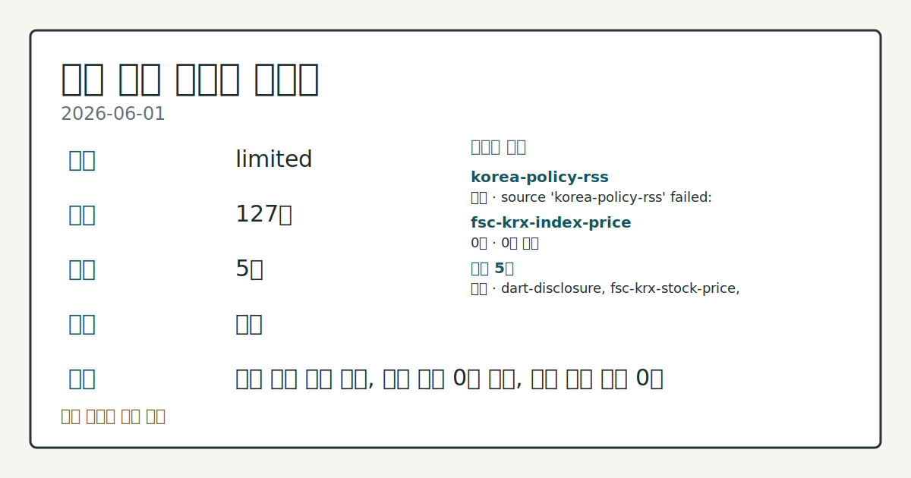
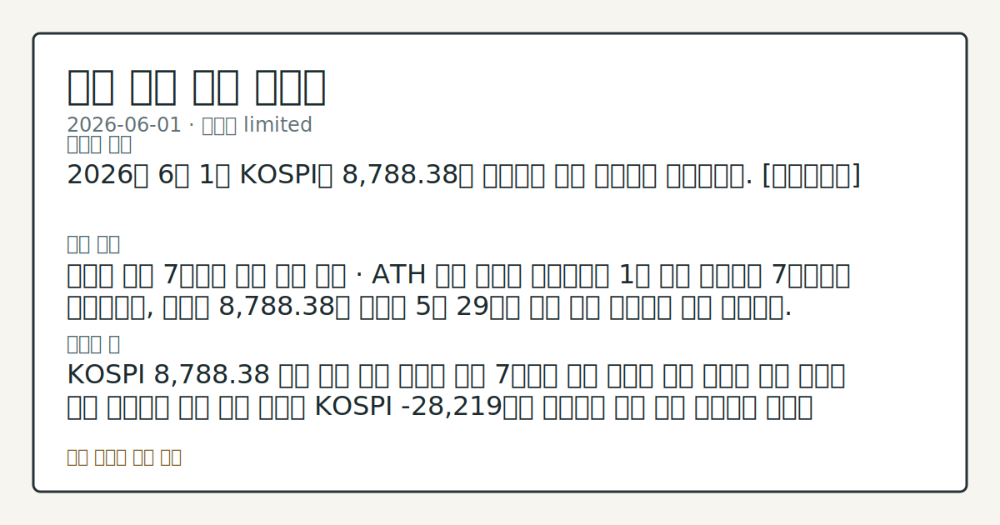

> 정보 제공용 자동 시황이며 매매 권유가 아닙니다.

# 2026-06-01 국내 증시 시황

**기준 시각**: 2026-06-01 KST · [2026-05-31T15:00Z, 2026-06-01T15:00Z)

| 종목 | 종가 | 변동 | 비고 |
|------|------|------|------|
| ^KOSPI | 8,788.38 | — | — |
| ^KOSDAQ | 226.00 | — | — |
| KRW=X | 1,504.54 | — | — |

**세그먼트**: [국내 증시](2026-06-01.md) | [미국 증시](../../../us-equity/2026/06/2026-06-01.md) | [크립토](../../../crypto/2026/06/2026-06-01.md)

*이미지: 데이터 신뢰도 · 출처: investo 자체 생성 · 생성: investo 0.1.0 · 2026-06-02 UTC*

> **내 관심 자산 영향**: 데이터 수집 부족으로 매칭 판단 보류 — 추가 수집 후 재평가됩니다.
> **용어 가이드**: 이번 시황에서 처음 등장한 용어 — 시가총액(시장가치)
> **오늘의 결론**: 2026년 6월 1일 KOSPI는 8,788.38로 마감하며 사상 최고치를 재경신했다. [데이터부족]
> **핵심 동인**: 코스피 시총 7천조원 사상 최초 돌파 · ATH 경신 코스피 시가총액이 1일 사상 처음으로 7천조원을 넘어섰으며, 지수는 8,788.38로 마감해 5월 29일에 이어 사상 최고치를 다시 경신했다.
> **주의할 점**: KOSPI 8,788.38 마감 이후 다음 거래일 시총 7천조원 지지 여부와 기관 순매수 지속 강도를 수급 데이터로 추세 확인 외국인 KOSPI -28...

> **데이터 상태**: 제한 · 본문 사용 미집계 · 실패 1 · 0건 1

수집/품질 진단

> **데이터 상태**: 제한 — 수집 127건 / 소스 5개 / 누락: 없음 · 제한 — 핵심 가격 소스 0건/실패/stale, 본문 결론 신뢰도 낮음
> **소스 카운트**: 수집 대상 7 / 성공 5 / 0건 1 / 실패 1 / 본문 사용 미집계
> **소스 등급 분포**: S=2 / A=1 / B=2
> **상세 사유**: 일부 소스 수집 실패, 일부 소스 0건 반환, 핵심 가격 소스 0건
> **소스별 상태**: korea-policy-rss 실패 (수집 불가), fsc-krx-index-price 0건, 정상 5개

## 한눈에 보기

- KOSPI(한국종합주가지수) **8,788.38** 마감, 시가총액 사상 처음 7천조원 돌파하며 ATH 경신 흐름 연장
- 기관 **+24,427억원** 대규모 순매수가 외국인 **-28,219억원** 이탈 흡수
- 한은(한국은행) 총재 매파 발언에 국고채 3년물 **3.790%** 상승 — §④ 금리 추이 점검

## ⓪ 오늘의 매크로

- **미 국채 수익률** — UST curve 2026-06-01: 10Y 4.47%, 2Y10Y +0.42pp

## ⓪-B 채널 기준선

| 기준선 | 값 |
|------|------|
| 코스피 | 8,788.38 (—) |
| 코스닥 | 226.00 (—) |
| 원/달러 | 1,504.54 (—) |

> **크로스마켓 연결 고리**: 금리 이벤트가 할인율/달러 경로의 공통 변수로 남아 있습니다.

## ① 요약

*이미지: 시장 스냅샷 · 출처: investo 자체 생성 · 생성: investo 0.1.0 · 2026-06-02 UTC*

2026년 6월 1일 KOSPI는 **8,788.38**로 마감하며 사상 최고치를 재경신했다. 직전 영업일(5월 29일) 종가 8,476.15에서 이어진 상승 흐름이 한 단계 더 진전됐고, 코스피 시가총액은 사상 처음으로 7천조원을 돌파했다. KOSDAQ은 **226.00**으로 마감했으며, 원/달러 환율은 **1,504.54원**으로 집계됐다.

수급 면에서는 기관이 **+24,427억원** 순매수로 상승을 이끈 반면 외국인은 **-28,219억원** 순매도를 기록하며 대조를 이뤘다. 전일 뉴욕증시가 미국과 이란의 갈등 재고조 속 혼조세로 마감한 점은 다음 거래일 국내 개장의 잠재적 경계 요인으로 남으며, 한은 총재의 매파적 발언으로 국고채 금리가 일제히 상승한 것도 동반 점검이 필요한 변수다. [상승 관찰]

## ② 전일 핵심 이슈

### 코스피 시총 7천조원 사상 최초 돌파 · ATH 경신

[코스피 시가총액이 1일 사상 처음으로 7천조원을 넘어섰으며](https://www.yna.co.kr/view/AKR20260601148100003), 지수는 **8,788.38**로 마감해 5월 29일에 이어 사상 최고치를 다시 경신했다. 이재용 삼성전자 회장의 주식 재산도 **60조원**을 돌파하며 코스피 시총 15위 수준에 이르렀다. 5월 22일 7,847.71에서 출발해 5월 26일 8,000선 최초 돌파, 5월 29일 ATH(사상 최고치) 경신에 이어 오늘 8,788.38까지 이어진 상승 흐름이 구조적 랠리 양상으로 관찰된다.

> **그래서 의미는?** 코스피 시총 7천조원 돌파는 외국인 대규모 이탈에도 기관이 단독으로 지수를 끌어올린 수급 구조인 만큼, 이 패턴이 지속될 수 있는지 다음...

### 미-이란 갈등 재고조와 국내 영향

[미국과 이란의 갈등이 다시 고조되면서 뉴욕증시 3대 지수는 혼조세로 마감했다](https://www.yna.co.kr/view/AKR20260601165500009). 국제 유가 상방 압력으로 연결될 수 있는 지정학적 리스크로, 에너지 수입 의존도가 높은 국내 제조·수출 기업의 비용 구조 변화를 코스피 연관 관점에서 살피는 것이 필요하다.

## ③ 섹터/수급 동향

### 투자자별 수급 — KOSPI 기관·개인 순매수, KOSDAQ 외국인 전환

[KOSPI 수급](https://finance.naver.com/sise/investorDealTrendDay.naver?bizdate=20260601&sosok=01)(2026-06-01 기준): 기관 **+24,427억원**, 개인 **+3,862억원** 순매수; 외국인 **-28,219억원**, 기타 **-70억원** 순매도.

> **그래서 의미는?** KOSPI에서는 기관이 외국인 대규모 이탈을 흡수하며 지수를 지탱했고, KOSDAQ에서는 반대로 외국인이 순매수로 전환하는 교차 수급 흐름이...

### KOSDAQ 수급 및 IMA·우선주 자금 흐름

[KOSDAQ 수급](https://finance.naver.com/sise/investorDealTrendDay.naver?bizdate=20260601&sosok=02)(2026-06-01 기준): 외국인 **+8,064억원** 순매수 전환; 개인 **-4,916억원**, 기관 **-2,912억원**, 기타 **-236억원** 순매도.

코스피 랠리가 대형주 위주로 전개되면서 보통주 가격이 높아지자 상대적으로 저렴한 우선주로 자금이 이동하는 흐름이 [관찰된다](https://www.yna.co.kr/view/AKR20260601117300008). [NH투자증권(005940)의 IMA(종합투자계좌) 상품 'N2 IMA1 중기형 2호'(**1,200억원** 규모)가 모집 반나절 만에 완판](https://www.yna.co.kr/view/AKR20260601136900008)된 것도 시중 유동성의 상품 다변화 흐름의 일환으로 파악된다.

## ④ 지표·이벤트

### 한은 총재 매파 발언과 국고채 금리 일제 상승

[한은 총재의 매파적 발언과 물가 경계감으로 국고채(국내 정부 발행 채권) 금리가 1일 일제히 상승했다](https://www.yna.co.kr/view/AKR20260601137451008). [국고채 3년물은 연 **3.790%**로 마감](https://www.yna.co.kr/view/AKR20260601137400008)됐다.

> **그래서 의미는?** 한은 총재의 긴축 신호가 채권 금리 상승으로 즉각 연결되어, 부채 비중이 높은 코스피 상장기업과 가계의 이자 비용 경로를 점검할 여지가...

### 원/달러 환율

[원/달러 환율은 **1,504.54원**으로 마감했다](https://stooq.com/q/?s=usdkrw). 장중 저점 **1,502.38원**, 고점 **1,517.84원**을 기록한 뒤 안정됐다.

## ⑤ 주요 종목

### 애프터마켓 급등 관찰 종목

[올릭스(226950)](https://www.yna.co.kr/view/AKR20260601154000008)는 **1,108억원** 규모의 제3자배정 유상증자 결정([DART 공시](https://dart.fss.or.kr/dsaf001/main.do?rcpNo=20260601002040)) 이후 애프터마켓에서 10%대 급등 흐름이 확인됐다. [씨메스로보틱스(475400)](https://www.yna.co.kr/view/AKR20260601147800008), [LG유플러스(032640)](https://www.yna.co.kr/view/AKR20260601146900008), [이엔에프테크놀로지(102710)](https://www.yna.co.kr/view/AKR20260601135400008)도 각각 애프터마켓에서 10%대 급등 중이다.

> **그래서 의미는?** 올릭스, 씨메스로보틱스, LG유플러스, 이엔에프테크놀로지가 업종 구분 없이 동시에 10%대 급등한 것은 섹터 집중이 아닌 개별 종목 재료...

### 하락 관찰 종목

[한화에어로스페이스(012450)](https://www.yna.co.kr/view/AKR20260601089251008)는 대전공장 폭발 사고 영향으로 장 중 하락 전환했다.

### 유상증자·공시 확인 항목

[해성옵틱스(076610)](https://www.yna.co.kr/view/AKR20260601138900008)는 시설자금 목적으로 약 **50억원** 규모의 제3자배정 유상증자를 결정했다. 롯데관광개발의 제주 드림타워 복합리조트는 5월 카지노·호텔 부문 합산 매출 **649억원**으로 역대 최고 수준을 [기록했다](https://www.yna.co.kr/view/AKR20260601137200030).

## ⑥ 오늘의 관전 포인트

| 관찰 신호 | 현재 | 상방 확인 조건 | 하방 확인 조건 | 신뢰도 | 섹션 내 관심 영향 |
| --- | --- | --- | --- | --- | --- |
| KOSPI **8,788.38** 마감 이후 다음 거래… | — | 데이터부족 | 데이터부족 | 데이터부족 | — |
| 외국인 KOSPI **-28,219억원** 순매도가 | — | 데이터부족 | 데이터부족 | 데이터부족 | — |
| 국고채 3년물 **3.790%** 이후 추가 | — | 데이터부족 | 데이터부족 | 데이터부족 | — |
| 미-이란 지정학적 갈등이 국제 유가 | — | 데이터부족 | 데이터부족 | 데이터부족 | — |
| 애프터마켓에서 10%대 급등한 올릭스(226950)·씨… | — | 데이터부족 | 데이터부족 | 데이터부족 | — |
| `input_hash`: `5f7886470061` | — | 데이터부족 | 데이터부족 | 데이터부족 | — |

_관전 신호 2건 추가 — 본문 참조._
## ⑦ 면책조항
본 시황은 일반 정보 제공을 목적으로 자동 생성된 자료이며,
특정 종목·자산에 대한 매매 권유나 투자 자문이 아닙니다.
투자 결정과 그 결과에 대한 책임은 전적으로 본인에게 있으며,
본 시황의 내용에 따라 발생한 손실에 대해 작성자는 일체의 책임을 지지 않습니다.