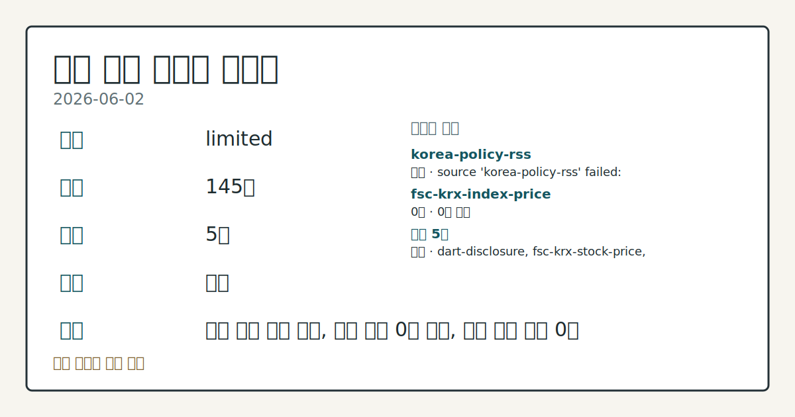
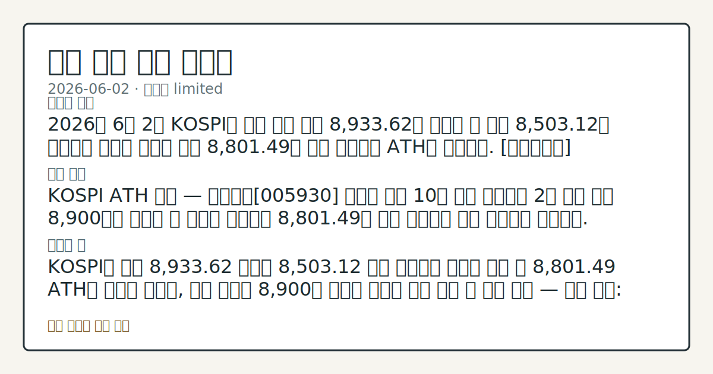

> 정보 제공용 자동 시황이며 매매 권유가 아닙니다.

# 2026-06-02 국내 증시 시황

**기준 시각**: 2026-06-02 KST · [2026-06-01T15:00Z, 2026-06-02T15:00Z)

| 종목 | 종가 | 변동 | 비고 |
|------|------|------|------|
| ^KOSPI | 8,801.49 | — | — |
| ^KOSDAQ | 347.00 | — | — |
| KRW=X | 1,516.89 | — | — |

**세그먼트**: [국내 증시](2026-06-02.md) | [미국 증시](../../../us-equity/2026/06/2026-06-02.md) | [크립토](../../../crypto/2026/06/2026-06-02.md)

*이미지: 데이터 신뢰도 · 출처: investo 자체 생성 · 생성: investo 0.1.0 · 2026-06-03 UTC*

> **내 관심 자산 영향**: 데이터 수집 부족으로 매칭 판단 보류 — 추가 수집 후 재평가됩니다.
> **오늘의 결론**: 2026년 6월 2일 KOSPI는 장중 사상 처음 8,933.62를 기록한 뒤 한때 8,503.12로 급락하는 극심한 변동을 거쳐 8,801.49로 상승 마감하며 ATH를 경신했다. [데이터부족]
> **핵심 동인**: KOSPI ATH 경신 — 삼성전자[005930] 글로벌 시총 10위 접근 코스피가 2일 사상 처음 8,900선을 터치한 뒤 등락을 거듭하다 8,801.49로 상승 마감하며 사상 최고치를 경신했다.
> **주의할 점**: KOSPI가 장중 8,933.62 고점과 8,503.12 저점 사이에서 극심한 변동 후 8,801.49 ATH로 마감한 가운데, 다음 거래일 8,900선 재접근...

> **데이터 상태**: 제한 · 본문 사용 미집계 · 실패 1 · 0건 1

수집/품질 진단

> **데이터 상태**: 제한 — 수집 145건 / 소스 5개 / 누락: 없음 · 제한 — 핵심 가격 소스 0건/실패/stale, 본문 결론 신뢰도 낮음
> **소스 카운트**: 수집 대상 7 / 성공 5 / 0건 1 / 실패 1 / 본문 사용 미집계
> **소스 등급 분포**: S=2 / A=1 / B=2
> **상세 사유**: 일부 소스 수집 실패, 일부 소스 0건 반환, 핵심 가격 소스 0건
> **소스별 상태**: korea-policy-rss 실패 (수집 불가), fsc-krx-index-price 0건, 정상 5개

## 한눈에 보기

- KOSPI(코스피)가 장중 사상 처음 **8,933.62**를 터치한 뒤 한때 **8,503.12**까지 급락했다가 **8,801.49**로 마감하며 ATH(사상 최고치) 경신
- 삼성전자[005930]가 **+10.09%** 급등하며 글로벌 시총 10위에 접근 — 장중 한때 테슬라(Tesla)까지 추월
- KOSPI 외국인 **-63,035억원** 순매도를 개인이 **+63,537억원**으로 홀로 소화한 수급 구조 — 본문 §③ 참조

## ⓪ 오늘의 매크로

- **미 국채 수익률** — UST curve 2026-06-02: 10Y 4.46%, 2Y10Y +0.41pp

## ⓪-B 채널 기준선

| 기준선 | 값 |
|------|------|
| 코스피 | 8,801.49 (—) |
| 코스닥 | 347.00 (—) |
| 원/달러 | 1,516.89 (—) |

> **크로스마켓 연결 고리**: 금리 이벤트가 할인율/달러 경로의 공통 변수로 남아 있습니다.

## ① 요약

*이미지: 시장 스냅샷 · 출처: investo 자체 생성 · 생성: investo 0.1.0 · 2026-06-03 UTC*

2026년 6월 2일 KOSPI는 장중 사상 처음 **8,933.62**를 기록한 뒤 한때 **8,503.12**로 급락하는 극심한 변동을 거쳐 **8,801.49**로 상승 마감하며 ATH를 경신했다. 전날(6월 1일) 종가 **8,788.38**에서 연장된 상승 흐름으로, 등락 진폭이 컸음에도 종가 기준 사상 최고치를 이어갔다. 코스닥(KOSDAQ)은 **347.00**으로 마감했다. 원/달러 환율은 **1,516.89**원 수준에서 거래를 마쳤다. 뉴욕 증시가 미-이란 갈등 속에 혼조 흐름을 나타낸 가운데서도 삼성전자[005930]의 **+10.09%** 급등이 국내 지수 상승을 견인했다. [상승 관찰]

## ② 전일 핵심 이슈

### KOSPI ATH 경신 — 삼성전자[005930] 글로벌 시총 10위 접근

[코스피가 2일 사상 처음 8,900선을 터치한 뒤 등락을 거듭하다 **8,801.49**로 상승 마감하며 사상 최고치를 경신](https://www.yna.co.kr/view/AKR20260602130900008)했다. 6월 1일 종가(8,788.38) 대비 상승이 이어지며 ATH 행진이 연속됐다. 이 흐름의 핵심 동인은 [삼성전자[005930]의 **+10.09%** 급등](https://www.yna.co.kr/view/AKR20260602079851008)으로, 삼성전자는 메타(Meta)를 제치고 글로벌 상장사 시가총액 10위에 접근했으며 장중에는 테슬라까지 추월하는 장면도 연출됐다.

> **그래서 의미는?** 삼성전자의 글로벌 시총 10위 접근은 코스피 전체의 국제적 위상 재평가 신호로, 외국인 수급이 순매도로 돌아선 상황에서도 ATH가 경신된...

### 뉴욕 증시 혼조 — 미-이란 갈등 변수 지속

[뉴욕 증시 3대 지수는 미-이란 갈등에 주목하며 혼조 흐름을 나타냈다](https://www.yna.co.kr/view/AKR20260602169400009). 지정학적 불강한성이 국내 외국인 순매도 전환의 배경 중 하나로 관찰되며, 원/달러 환율 경로를 통해 코스피 연관 수급에 간접적으로 영향을 줄 수 있는 변수로 남아 있다.

## ③ 섹터/수급 동향

### KOSPI 수급: 개인 홀로 순매수, 외국인·기관 동반 순매도

[2026년 6월 2일 KOSPI](https://finance.naver.com/sise/investorDealTrendDay.naver?bizdate=20260602&sosok=01) 수급은 개인이 **+63,537억원** 순매수를 기록한 반면, 외국인은 **-63,035억원**, 기관은 **-546억원** 순매도했다. 개인이 사실상 외국인·기관의 매물 전체를 소화하며 ATH 경신을 이끈 구조였다.

> **그래서 의미는?** 개인 단독 매수로 ATH를 경신한 것은 이례적인 수급 집중을 의미하며, 이 흐름의 지속성과 외국인 복귀 여부가 다음 거래일의 핵심 확인...

### KOSDAQ 수급: 외국인·기관 동반 순매수, 개인 순매도

[코스닥](https://finance.naver.com/sise/investorDealTrendDay.naver?bizdate=20260602&sosok=02)에서는 외국인이 **+3,401억원**, 기관이 **+1,327억원** 순매수한 반면, 개인은 **-4,090억원** 순매도했다. 코스피와 정반대 구조로, 코스닥에서는 외국인·기관이 매수를 주도했다.

### 반도체 섹터 흐름

삼성전자[005930]가 **+10.09%** 급등했고, SK하이닉스[000660]도 **+1.29%** 상승 마감하며 반도체 양대 대형주가 동반 상승했다. 삼성전자의 글로벌 위상 재평가가 반도체 섹터 전반에 상승 온기를 확인시킨 하루였다.

## ④ 지표·이벤트

### 국고채 금리: 물가 지표 발표 후 상승 출발 → 하락 전환, 3년물 연 **3.773%**

[국고채 금리는 물가 지표 발표 후 상승 출발했다가 하락으로 전환해 3년물 기준 연 **3.773%**로 마감](https://www.yna.co.kr/view/AKR20260602137951008)했다. 금리 상승 압력이 장중에 소화된 흐름이 주식 시장 상승 지속의 배경으로 관찰된다.

> **그래서 의미는?** 채권 금리가 상승 출발 후 하락으로 마감한 것은 당장의 금리 부담이 완화됐음을 의미하며, 이후 국내 금리 방향 점검이 필요합니다.

### 원/달러 환율 1,516.89원 마감

[원/달러 환율](https://stooq.com/q/?s=usdkrw)은 장중 고가 **1,519.92**원까지 오른 뒤 **1,516.89**원으로 마감했다. 환율 추가 상승 여부가 외국인 수급 방향과 코스피 연관 흐름에 영향을 줄 수 있는 변수다.

### 유로존 소비자물가 3년 만에 3% 초과 — ECB(유럽중앙은행) 금리 인상 기대 부상

[유로존 소비자물가상승률이 3년 만에 3%를 넘어서며](https://www.yna.co.kr/view/AKR20260602155300082) ECB 금리 인상 채비가 가시화되고 있다. 글로벌 금리 상방 압력 요인으로, 국내 채권 금리 흐름과의 연계 관찰이 필요하다.

### UAE ADNOC(아부다비국영석유공사) 나프타 수출 재개

[UAE 국영석유사 ADNOC이 호르무즈 해협 바깥쪽 오만 항구를 통해 나프타 수출을 재개](https://www.yna.co.kr/view/AKR20260602167700009)했다. 미-이란 갈등 속 원자재 공급 경로 다변화 시도로, 에너지 원자재 공급 안정성 추이 확인이 필요하다.

### 금값 소폭 상승

[미-이란 종전협상 합의 미성립 속에 국제 금값이 소폭 상승](https://www.yna.co.kr/view/AKR20260602125000009)하며 안전자산 수요가 일부 확인됐다.

## ⑤ 주요 종목

### 가격 동향 확인 항목

| 종목 | 종가 | 등락 |
|------|------|------|
| 삼성전자[005930] | 349,000원 | +10.09% (+32,000) |
| SK하이닉스[000660] | 2,363,000원 | +1.29% (+30,000) |

> **그래서 의미는?** 삼성전자(반도체·가전)와 SK하이닉스(메모리 반도체)의 동반 상승이 이날 코스피 ATH 경신의 핵심 동력으로 확인되며, 반도체 섹터 전반의...

### 애프터마켓 급등 관찰 항목

[스피어[347700]](https://www.yna.co.kr/view/AKR20260602153500008), [에이치브이엠[295310]](https://www.yna.co.kr/view/AKR20260602153100008), [노타[486990]](https://www.yna.co.kr/view/AKR20260602147500008), [나이스정보통신[036800]](https://www.yna.co.kr/view/AKR20260602136800008), [감성코퍼레이션[036620]](https://www.yna.co.kr/view/AKR20260602142200008) 등 코스닥 상장사 다수가 2일 애프터마켓에서 10%대 급등 흐름을 나타냈다. 개별 급등 사유는 입력 데이터에서 확인되지 않아 각 공시를 직접 점검할 필요가 있다.

### 공시 확인 항목

- [NH투자증권[005940]](https://www.yna.co.kr/view/AKR20260602145851008): 운영자금 등 약 **4,000억원** 규모, 농협금융지주 대상 제3자배정 유상증자 결정
- [나이스정보통신[036800]](https://www.yna.co.kr/view/AKR20260602138000008): 계열사 KIS정보통신 주식 **449만1천623주**를 약 **1,123억원**에 취득 결정
- [한국첨단소재[062970]](https://www.yna.co.kr/view/AKR20260602160500008): 에스밸류투자조합 주식 **680만주**를 **68억원**에 취득 결정

## ⑥ 오늘의 관전 포인트

| 관찰 신호 | 현재 | 상방 확인 조건 | 하방 확인 조건 | 신뢰도 | 섹션 내 관심 영향 |
| --- | --- | --- | --- | --- | --- |
| KOSPI가 | — | 데이터부족 | 데이터부족 | 데이터부족 | — |
| 삼성전자[005930]가 | — | 데이터부족 | 데이터부족 | 데이터부족 | — |
| KOSPI 외국인이 | — | 데이터부족 | 데이터부족 | 데이터부족 | — |
| 국고채 3년물 연 **3.773%** 마감 이후, 유로… | — | 데이터부족 | 데이터부족 | 데이터부족 | — |
| 원/달러 환율이 | — | 데이터부족 | 데이터부족 | 데이터부족 | — |
| `input_hash`: `41d5afaacb50` | — | 데이터부족 | 데이터부족 | 데이터부족 | — |

_관전 신호 2건 추가 — 본문 참조._
## ⑦ 면책조항
본 시황은 일반 정보 제공을 목적으로 자동 생성된 자료이며,
특정 종목·자산에 대한 매매 권유나 투자 자문이 아닙니다.
투자 결정과 그 결과에 대한 책임은 전적으로 본인에게 있으며,
본 시황의 내용에 따라 발생한 손실에 대해 작성자는 일체의 책임을 지지 않습니다.