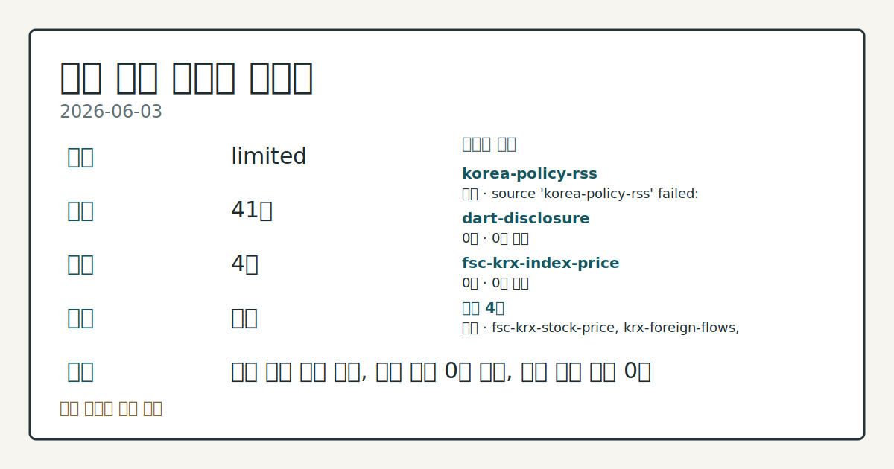
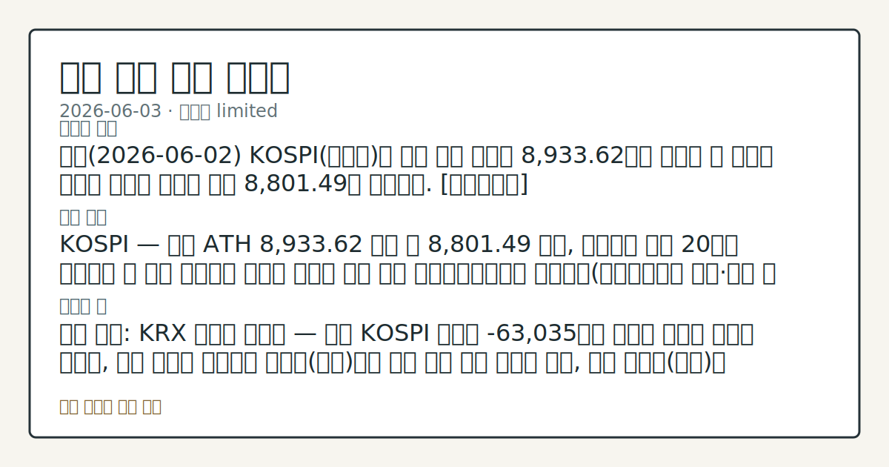

> 정보 제공용 자동 시황이며 매매 권유가 아닙니다.

# 2026-06-03 국내 증시 시황

**기준 시각**: 2026-06-03 KST · [2026-06-02T15:00Z, 2026-06-03T15:00Z)

| 종목 | 종가 | 변동 | 비고 |
|------|------|------|------|
| ^KOSPI | 8,801.49 | — | — |
| ^KOSDAQ | 347.00 | — | — |
| KRW=X | 1,524.53 | — | — |

**세그먼트**: [국내 증시](2026-06-03.md) | [미국 증시](../../../us-equity/2026/06/2026-06-03.md) | [크립토](../../../crypto/2026/06/2026-06-03.md)

*이미지: 데이터 신뢰도 · 출처: investo 자체 생성 · 생성: investo 0.1.0 · 2026-06-04 UTC*

> **내 관심 자산 영향**: 데이터 수집 부족으로 매칭 판단 보류 — 추가 수집 후 재평가됩니다.
> **용어 가이드**: 이번 시황에서 처음 등장한 용어 — 프로그램매매(기관자동주문)
> **오늘의 결론**: 전일(2026-06-02) KOSPI(코스피)는 장중 사상 최초로 8,933.62까지 상승한 뒤 외국인 대규모 순매도 압력을 받아 8,801.49로 마감했다. [데이터부족]
> **핵심 동인**: KOSPI — 장중 ATH 8,933.62 기록 후 8,801.49 마감, 사이드카 연간 20회로 금융위기 후 최다 연합뉴스 보도에 따르면 올해 들어 유가증권시장에서 사이드카(프로그램매매 급등·급락 시 가격 변동을 일시 제동하는 조치)가 20회 발동되며 현행 기준 집계 이후 금융위기 이래 최다를 기록했다.
> **주의할 점**: 확인 소스: KRX 외국인 순매매 — 전일 KOSPI 외국인 -63,035억원 순매도 기조가 이어진 가운데, 오늘 외국인 순매매가 양전환(상방)되면 단기 수급...

> **데이터 상태**: 제한 · 본문 사용 미집계 · 실패 1 · 0건 2

수집/품질 진단

> **데이터 상태**: 제한 — 수집 41건 / 소스 4개 / 누락: 없음 · 제한 — 핵심 가격 소스 0건/실패/stale, 본문 결론 신뢰도 낮음
> **소스 카운트**: 수집 대상 7 / 성공 4 / 0건 2 / 실패 1 / 본문 사용 미집계
> **소스 등급 분포**: S=1 / A=1 / B=2
> **상세 사유**: 일부 소스 수집 실패, 일부 소스 0건 반환, 핵심 가격 소스 0건
> **소스별 상태**: korea-policy-rss 실패 (수집 불가), dart-disclosure 0건, fsc-krx-index-price 0건, 정상 4개

## 한눈에 보기

- 전일 KOSPI가 장중 사상 최고치 **8,933.62**를 기록했으나 **8,801.49**로 마감, 코스닥은 **347.00**으로 대형주·중소형주 간 격차 지속.
- **외국인** KOSPI **-63,035억원** 순매도를 **개인** **+63,537억원**이 수용하며 수급 주도권 역전.
- 골드만삭스가 코스피 목표를 **12,000**으로 상향하는 한편 이란-쿠웨이트 지정학 리스크가 부상 — 오늘 국내 증시 개장 방향성이 교차하는 흐름 점검.

## ⓪ 오늘의 매크로

- **FOMC 일정** — 2026-06-17 — FOMC Meeting
- **미 국채 수익률** — UST curve 2026-06-03: 10Y 4.49%, 2Y10Y +0.41pp

## ⓪-B 채널 기준선

| 기준선 | 값 |
|------|------|
| 코스피 | 8,801.49 (—) |
| 코스닥 | 347.00 (—) |
| 원/달러 | 1,524.53 (—) |

> **크로스마켓 연결 고리**: 금리 이벤트가 할인율/달러 경로의 공통 변수로 남아 있습니다.

## ① 요약

*이미지: 시장 스냅샷 · 출처: investo 자체 생성 · 생성: investo 0.1.0 · 2026-06-04 UTC*

전일 KOSPI는 장중 사상 최초로 **8,933.62**까지 상승한 뒤 외국인 대규모 순매도 압력을 받아 **8,801.49**로 마감했다. 코스닥은 **347.00**으로, 반도체·AI(인공지능) 대형주 레버리지로 자금이 집중된 코스피 랠리와의 격차를 좁히지 못했다. 원/달러 환율은 이란-쿠웨이트 지정학 리스크를 반영해 **1,524.53**원으로 상승했다.

뉴욕증시는 2일(현지시간) AI 낙관론에 힘입어 3대 지수가 최고치를 마감했고 다우 **+0.5%** 상승이 긍정적 외생 변수로 남았으나, 이란의 쿠웨이트 공습 소식이 전해지며 3일 뉴욕 개장은 하락 출발했다. 이 지정학 변수는 국내 증시 개장 시 원화 환율 경로 및 외국인 수급에 직접 영향을 줄 수 있다. 골드만삭스가 코스피 목표치를 **12,000**으로 상향하며 중장기 기대를 높이는 한편, ATH(사상 최고치) 대비 종가 조정과 극심한 단기 변동성이 교차하는 구도다. [혼재]

## ② 전일 핵심 이슈

### KOSPI — 장중 ATH 8,933.62 기록 후 8,801.49 마감, 사이드카 연간 20회로 금융위기 후 최다

[연합뉴스 보도](https://www.yna.co.kr/view/AKR20260602160400008)에 따르면 올해 들어 유가증권시장에서 사이드카가 20회 발동되며 현행 기준 집계 이후 금융위기 이래 최다를 기록했다. 단기 급등에 따른 수급 불균형이 심화된 결과로, [증권가 목표주가를 초과한 종목이 속출](https://www.yna.co.kr/view/AKR20260602161000008)했으며 LG전자가 상회율이 가장 큰 종목으로 꼽혔다.

> **그래서 의미는?** 코스피가 장중 사상 최고치를 경신했지만 사이드카 20회 발동과 종가 조정은 단기 급등 이후 수급 피로도가 높아졌음을 시사하며 추세 확인이...

### 골드만삭스 코스피 목표치 9,000 → 12,000 상향, CEO "탐욕이 공포 압도"

[골드만삭스](https://www.yna.co.kr/view/AKR20260603055700008)는 높은 실적 성장과 메모리 업황의 지속된 저평가를 근거로 코스피 목표치를 **12,000**으로 대폭 상향했다. 데이비드 솔로몬 골드만삭스 CEO도 2일(현지시간) ["현 시장 상황에서 공포보다 탐욕이 더 많다"](https://www.yna.co.kr/view/AKR20260603006600072)고 밝혀 글로벌 IB(투자은행)의 위험선호 기조 지속을 확인했다.

### 뉴욕증시 — 3대지수 최고치 마감 후 이란-쿠웨이트 공습 소식에 하락 출발

2일(현지시간) 뉴욕증시는 AI 관련 업종 강세에 힘입어 [3대 주가지수가 최고치로 마감했으며 다우 **+0.5%** 상승했다](https://www.yna.co.kr/view/AKR20260603007251072). 그러나 이란이 쿠웨이트를 공습했다는 소식이 이어지면서 3일 뉴욕 개장은 [하락 출발](https://www.yna.co.kr/view/AKR20260603092300009)했다. 이 지정학 이슈는 국내 코스피 개장 초반 외국인 수급과 원화 환율 경로에 직접 영향을 줄 수 있어 국내 영향 차원에서 주목된다.

## ③ 섹터/수급 동향

### KOSPI 수급 — 개인 +63,537억원 대규모 순매수, 외국인 –63,035억원 이탈

[2026-06-02 KOSPI 투자자별 동향](https://finance.naver.com/sise/investorDealTrendDay.naver?bizdate=20260602&sosok=01) 기준 외국인이 **-63,035억원** 순매도, 기관이 **-546억원** 순매도를 기록한 반면 개인이 **+63,537억원** 순매수로 매도 물량을 대부분 흡수했다. 코스닥은 반대로 외국인 **+3,401억원**, 기관 **+1,327억원** 순매수, 개인 **-4,090억원** 순매도로 코스피와 역전된 수급 구조를 보였다.

> **그래서 의미는?** 코스피에서 외국인이 대규모 이탈하는 동안 개인이 수급을 방어한 구도는 상승 지속성을 점검해야 함을 시사합니다.

### 반도체·AI·로봇 — 한·일 동반 상승, 레버리지 자금 집중

일본 닛케이225(니혼게이자이신문 선정 225종목 평균지수)가 [사상 처음 68,000선을 돌파](https://www.yna.co.kr/view/AKR20260603029751073)했으며, 키옥시아(낸드플래시 메모리 제조사)가 한때 일본 시총 2위로 올라서 AI·반도체 랠리의 광범위한 확산을 확인했다. 국내에서는 로봇주가 올해 [150% 넘게 상승](https://www.yna.co.kr/view/AKR20260602153300008)한 것으로 집계됐다. 반도체 ETF(상장지수펀드)를 중심으로 신용잔고가 한 달 새 [급증](https://www.yna.co.kr/view/AKR20260602146700008)하는 '빚투(빚내서 투자)' 현상도 함께 확인됐다.

### 코스닥 소외·증권주 부진 — 레버리지 수급 코스피로 집중 지속

삼성전자[005930]·SK하이닉스[000660] 단일종목 레버리지 ETF로 자금이 몰리면서 코스닥 관련 종목에서 [자금 유출](https://www.yna.co.kr/view/AKR20260602076000008) 흐름이 관찰됐다. 코스피 랠리 국면임에도 증권주는 [지지부진한 흐름](https://www.yna.co.kr/view/AKR20260602138600008)을 이어가며 업종 내 차별화가 두드러졌다.

## ④ 지표·이벤트

### 원/달러 환율 — 1,524.53원, 지정학 경계심 동반 상승

[달러-원 환율](https://www.yna.co.kr/view/AKR20260603005400002)은 이란-쿠웨이트 긴장 및 달러 강세를 반영해 **1,524.53**원(고가 **1,525.16**원, 저가 **1,515.85**원)으로 마감했다. 고환율은 수출주에 일부 우호적이나 외국인의 원화 자산 매력을 낮추는 양면성이 있다.

> **그래서 의미는?** 1,524원대 고환율이 지속되면 외국인 자금 유입 동력이 약해지고 수입 비용 부담도 함께 상승하는 점을 점검해야 합니다.

### 美 ADP 5월 민간고용 12만2천명 — 예상치 상회

[ADP(오토매틱데이터프로세싱) 5월 민간고용](https://www.yna.co.kr/view/AKR20260603083300072)은 **12만2천명** 증가로 예상치를 상회하며 노동시장 견조함을 확인했다. 이는 Fed(연방준비제도, 미국 중앙은행)의 금리 동결 기조 유지 가능성을 높이는 데이터로 국내 채권·환율 시장 반응과 연동된다.

### 워시 신임 Fed 의장 — 보수 성향 연구자 채용

[워시 신임 Fed 의장](https://www.yna.co.kr/view/AKR20260603091800072)은 취임 후 보수 성향의 정책 연구자 2명을 채용해 향후 통화정책 기조 변화 가능성에 관한 시장 관찰이 이어지고 있다.

### 국제유가 **+1%** — 브렌트 **$96**, 이란 협상 엇갈린 설명

[미국-이란 종전 협상의 엇갈린 발언](https://www.yna.co.kr/view/AKR20260603005700072)에 브렌트유(북해산 원유 가격 기준)가 **$96**로 **+1%** 상승했다. 유가 상승은 국내 에너지·정유 섹터 비용 구조 및 물가에 영향을 줄 수 있어 국내 수급 변수로 함께 점검된다.

### 美 사모대출 펀드 환매압박 — 클리프워터 17% 환매요청

[클리프워터 등 미국 사모대출(Private Credit) 펀드](https://www.yna.co.kr/view/AKR20260603009600072)에서 **17%** 환매요청이 이어지고 있어 글로벌 신용시장 유동성 압박 지속 여부가 관찰 대상으로 남아있다.

## ⑤ 주요 종목

> **그래서 의미는?** 삼성전자[005930]·NAVER[035420] 등 AI·반도체 대표주가 두드러진 상승폭을 보이고 셀트리온[068270] 바이오주는 소폭 하락...

### 실적 및 신용 확인 항목

| 종목 | 종가 | 등락 | 비고 |
|------|------|------|------|
| 삼성전자[005930] | 349,000원 | **+10.09%** (+32,000원) | 반도체 랠리, 레버리지 ETF 수급 집중 |
| SK하이닉스[000660] | 2,363,000원 | **+1.29%** (+30,000원) | 메모리 업황 재평가 흐름 |
| NAVER[035420] | 271,500원 | **+16.03%** (+37,500원) | AI 테마 수혜 |
| 현대차[005380] | 750,000원 | **+3.73%** (+27,000원) | 완성차 업종 내 상대 강세 |
| 셀트리온[068270] | 191,700원 | **-0.62%** (-1,200원) | 바이오 섹터 상대 약세 |

### 체크리스트

LG전자는 국제신용평가사 S&P(스탠더드앤드푸어스)로부터 신용등급이 기존 BBB에서 [BBB+로 상향](https://www.yna.co.kr/view/AKR20260603019300003) 조정됐으며 "주력 사업 성장이 견조하다"는 평가를 받았다. 삼성전자[005930]·SK하이닉스[000660] 단일종목 레버리지 ETF에서는 [40대 투자자가 가장 적극적으로 참여](https://www.yna.co.kr/view/AKR20260602158400008)하는 것으로 집계됐다.

## ⑥ 오늘의 관전 포인트

| 관찰 신호 | 현재 | 상방 확인 조건 | 하방 확인 조건 | 신뢰도 | 섹션 내 관심 영향 |
| --- | --- | --- | --- | --- | --- |
| 확인 소스: KRX 외국인 순매매 — 전일 KOSPI… | 확인 소스: KRX 외국인 순매매 — 전일 KOSPI 외국인 **-63,035억원** 순매도 기조가 이어진 가운데, 오늘 외국인 순매매가 양전환되면 단기 수급 회복 흐름을 관찰, 추가 순매도가 지속되면 개인 단독 수급 방어력의 한계와 반도체 대형주 가격 흐름을 점검. 관심 영향: 삼성전자[005930]·SK하이닉스[000660] 수급 연동 추세 확인. | 확인 소스: KRX 외국인 순매매 — 전일 KOSPI 외국인 **-63,035억원** 순매도 기조가 이어진 가운데, 오늘 외국인 순매매가 양전환되면 단기 수급 회복 흐름을 관찰, 추가 순매도가 지속되면 개인 단독 수급 방어력의 한계와 반도체 대형주 가격 흐름을 점검 | 확인 소스: KRX 외국인 순매매 — 전일 KOSPI 외국인 **-63,035억원** 순매도 기조가 이어진 가운데, 오늘 외국인 순매매가 양전환되면 단기 수급 회복 흐름을 관찰, 추가 순매도가 지속되면 개인 단독 수급 방어력의 한계와 반도체 대형주 가격 흐름을 점검 | 보통 | 관심 영향: 삼성전자[005930] |
| 원/달러 환율 — 환율 | 확인 소스: stooq · 원/달러 환율 — 환율이 전일 고점 **1,525.16**원을 상회하면 외국인 자금 이탈 가속 압력을 관찰, 전일 저점 **1,515.85**원을 하회하면 원화 강세 전환과 외국인 순매수 재유입 추세 살피기. 관심 영향: 수출주 및 외국인 수급 변수 연동 점검. | 원/달러 환율 — 환율이 전일 고점 **1,525.16**원을 상회하면 외국인 자금 이탈 가속 압력을 관찰, 전일 저점 **1,515.85**원을 하회하면 원화 강세 전환과 외국인 순매수 재유입 추세 살피기 | 원/달러 환율 — 환율이 전일 고점 **1,525.16**원을 상회하면 외국인 자금 이탈 가속 압력을 관찰, 전일 저점 **1,515.85**원을 하회하면 원화 강세 전환과 외국인 순매수 재유입 추세 살피기 | 보통 | 관심 영향: 수출주 및 외국인 수급 변수 연동 점검. |
| 이란-쿠웨이트 지정학 — 이란 공습 확전 징후(상방 위… | 확인 소스: 연합뉴스 · 이란-쿠웨이트 지정학 — 이란 공습 확전 징후(상방 위험)가 추가 확인되면 브렌트유 **$96** 이상 변동성 확대 및 위험회피 강화 흐름을 관찰, 협상 재개(하방 위험 완화) 소식이 나오면 코스피 개장 초반 낙폭 축소 추세 확인. 관심 영향: 에너지·정유 섹터 및 원화 환율 연동 점검. | 이란-쿠웨이트 지정학 — 이란 공습 확전 징후(상방 위험)가 추가 확인되면 브렌트유 **$96** 이상 변동성 확대 및 위험회피 강화 흐름을 관찰, 협상 재개(하방 위험 완화) 소식이 나오면 코스피 개장 초반 낙폭 축소 추세 확인 | 이란-쿠웨이트 지정학 — 이란 공습 확전 징후(상방 위험)가 추가 확인되면 브렌트유 **$96** 이상 변동성 확대 및 위험회피 강화 흐름을 관찰, 협상 재개(하방 위험 완화) 소식이 나오면 코스피 개장 초반 낙폭 축소 추세 확인 | 높음 | 관심 영향: 에너지 |
| 코스피 목표치 **12,000** — 코스피 | 확인 소스: 골드만삭스 리포트 · 코스피 목표치 **12,000** — 코스피가 전일 장중 고점 **8,933.62**를 재돌파하면 상방 모멘텀 지속을 관찰, 전일 저점 **8,503.12**를 하회하면 단기 조정 심화 여부를 점검. 관심 영향: 외국인 재유입 신호 및 증권사 목표주가 초과 종목 추세 비교. | 코스피 목표치 **12,000** — 코스피가 전일 장중 고점 **8,933.62**를 재돌파하면 상방 모멘텀 지속을 관찰, 전일 저점 **8,503.12**를 하회하면 단기 조정 심화 여부를 점검 | 코스피 목표치 **12,000** — 코스피가 전일 장중 고점 **8,933.62**를 재돌파하면 상방 모멘텀 지속을 관찰, 전일 저점 **8,503.12**를 하회하면 단기 조정 심화 여부를 점검 | 보통 | 관심 영향: 외국인 재유입 신호 및 증권사 목표주가 초과 종목 추세 비교. |
| KRX 주 | 확인 소스: FSC·KRX 주가 데이터 · NAVER[035420] **+16.03%** — 오늘도 AI 테마 강세가 이어지면(상방) 코스닥 AI 관련 종목으로 수급 확산 여부를 관찰, 상승폭이 반납(하방)되면 단기 과열 조정 접근 흐름을 점검. 관심 영향: 코스닥 내 AI 섹터 확산 추세 확인. | NAVER[035420] **+16.03%** — 오늘도 AI 테마 강세가 이어지면(상방) 코스닥 AI 관련 종목으로 수급 확산 여부를 관찰, 상승폭이 반납(하방)되면 단기 과열 조정 접근 흐름을 점검 | NAVER[035420] **+16.03%** — 오늘도 AI 테마 강세가 이어지면(상방) 코스닥 AI 관련 종목으로 수급 확산 여부를 관찰, 상승폭이 반납(하방)되면 단기 과열 조정 접근 흐름을 점검 | 높음 | 관심 영향: 코스닥 내 AI 섹터 확산 추세 확인. |
## ⑦ 면책조항
본 시황은 일반 정보 제공을 목적으로 자동 생성된 자료이며,
특정 종목·자산에 대한 매매 권유나 투자 자문이 아닙니다.
투자 결정과 그 결과에 대한 책임은 전적으로 본인에게 있으며,
본 시황의 내용에 따라 발생한 손실에 대해 작성자는 일체의 책임을 지지 않습니다.