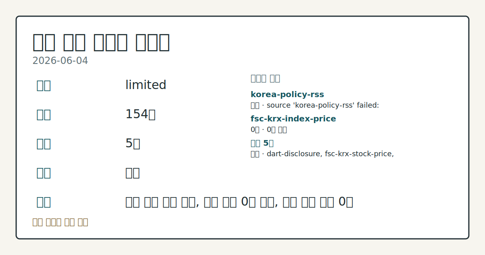
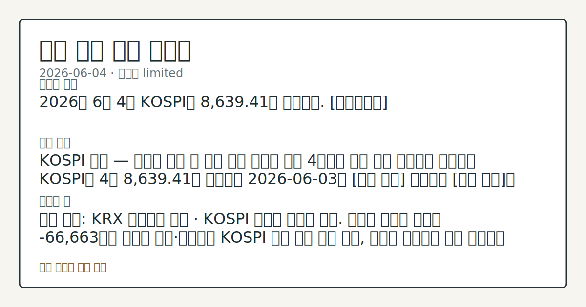

> 정보 제공용 자동 시황이며 매매 권유가 아닙니다.

# 2026-06-04 국내 증시 시황

**기준 시각**: 2026-06-04 KST · [2026-06-03T15:00Z, 2026-06-04T15:00Z)

| 종목 | 종가 | 변동 | 비고 |
|------|------|------|------|
| ^KOSPI | 8,639.41 | — | — |
| ^KOSDAQ | 319.00 | — | — |
| KRW=X | 1,529.75 | — | — |

**세그먼트**: [국내 증시](2026-06-04.md) | [미국 증시](../../../us-equity/2026/06/2026-06-04.md) | [크립토](../../../crypto/2026/06/2026-06-04.md)

*이미지: 데이터 신뢰도 · 출처: investo 자체 생성 · 생성: investo 0.1.0 · 2026-06-05 UTC*

> **내 관심 자산 영향**: 데이터 수집 부족으로 매칭 판단 보류 — 추가 수집 후 재평가됩니다.
> **오늘의 결론**: 2026년 6월 4일 KOSPI는 8,639.41로 마감했다. [데이터부족]
> **핵심 동인**: KOSPI 급락 — 외국인 역대 두 번째 규모 순매도 직전 4거래일 연속 사상 최고치를 경신하던 KOSPI가 4일 8,639.41로 마감하며 2026-06-03의 [상승 관찰] 기조에서 [하락 관찰]로 뚜렷이 전환됐다.
> **주의할 점**: 확인 소스: KRX 투자자별 동향 · KOSPI 외국인 순매도 흐름. 외국인 순매도 규모가 -66,663억원 수준을 지속·확대하면 KOSPI 추가 하락 압력...

> **데이터 상태**: 제한 · 본문 사용 미집계 · 실패 1 · 0건 1

수집/품질 진단

> **데이터 상태**: 제한 — 수집 154건 / 소스 5개 / 누락: 없음 · 제한 — 핵심 가격 소스 0건/실패/stale, 본문 결론 신뢰도 낮음
> **소스 카운트**: 수집 대상 7 / 성공 5 / 0건 1 / 실패 1 / 본문 사용 미집계
> **소스 등급 분포**: S=2 / A=1 / B=2
> **상세 사유**: 일부 소스 수집 실패, 일부 소스 0건 반환, 핵심 가격 소스 0건
> **소스별 상태**: korea-policy-rss 실패 (수집 불가), fsc-krx-index-price 0건, 정상 5개

## 한눈에 보기

- KOSPI **8,639.41** 마감 — 직전 영업일(2026-06-03) ATH(사상 최고치) 도전 흐름에서 이탈, 하락 전환
- 외국인 KOSPI **-66,663억원** 역대 두 번째 규모 순매도, 원/달러 장중 **1,540원** 상회
- 국고채(국내 국가채권) 3년물 **3.858%** 급등·원/달러 종가 **1,529.75원** — 금리·환율 동반 압박 본문 §④ 참조

## ⓪ 오늘의 매크로

- **FOMC 일정** — 2026-06-17 — FOMC Meeting
- **미 국채 수익률** — UST curve 2026-06-04: 10Y 4.47%, 2Y10Y +0.42pp

## ⓪-B 채널 기준선

| 기준선 | 값 |
|------|------|
| 코스피 | 8,639.41 (—) |
| 코스닥 | 319.00 (—) |
| 원/달러 | 1,529.75 (—) |

> **크로스마켓 연결 고리**: 금리 이벤트가 할인율/달러 경로의 공통 변수로 남아 있습니다.

## ① 요약

*이미지: 시장 스냅샷 · 출처: investo 자체 생성 · 생성: investo 0.1.0 · 2026-06-05 UTC*

2026년 6월 4일 KOSPI는 **8,639.41**로 마감했다. 장중 고점 **8,759.05**, 저점 **8,577.30**을 오가며 변동성이 확대됐고, 직전 영업일까지 이어지던 사상 최고치 도전 흐름에서 뚜렷이 이탈했다. 코스닥은 **319.00**으로 [연합뉴스](https://www.yna.co.kr/view/AKR20260604129551008) 보도에 따르면 6거래일 만에 상승 마감에 성공하며 KOSPI와 엇갈린 흐름을 보였다. 원/달러 환율은 장중 **1,540원**을 상회하는 장면이 있었으나 종가는 **1,529.75원**으로 마감됐다. 중동 긴장 재고조 국면에서 외국인이 KRX(한국거래소) 기준 역대 두 번째 규모의 KOSPI 순매도를 단행하며 지수 전반의 하락 압력이 커졌다. [하락 관찰]

## ② 전일 핵심 이슈

### KOSPI 급락 — 외국인 역대 두 번째 규모 순매도

직전 4거래일 연속 사상 최고치를 경신하던 KOSPI가 4일 **8,639.41**로 마감하며 2026-06-03의 [상승 관찰] 기조에서 [하락 관찰]로 뚜렷이 전환됐다. [연합뉴스](https://www.yna.co.kr/view/AKR20260604180600002)는 중동 긴장 재고조를 계기로 외국인이 국내 주식을 역대 두 번째 규모로 순매도했다고 보도했다. KRX 집계 기준 KOSPI 외국인 순매도는 **-66,663억원**에 달했으며, 이 충격이 원/달러 환율을 장중 **1,540원** 이상으로 끌어올리는 흐름으로 이어졌다. 개인(**+50,135억원**)과 기관(**+15,255억원**)이 반대편에서 매수로 대응했으나 낙폭을 방어하기엔 역부족이었다.

> **그래서 의미는?** 4거래일 연속 ATH를 이어온 KOSPI가 외국인 대규모 이탈로 급격히 방향을 전환했으며, 환율·금리의 동반 급등이 국내 금융시장 전반에...

### 뉴욕 증시·지정학 — 국내 영향

[연합뉴스](https://www.yna.co.kr/view/AKR20260604199800009)에 따르면 뉴욕 증시 3대 주가지수는 레바논-이스라엘 휴전 소식과 Broadcom 실적 발표를 소화하며 혼조세로 출발했다. us-equity 세그먼트는 아직 pre-market 단계로 최종 마감 방향이 확정되지 않은 상태다. 레바논-이스라엘 휴전이라는 지정학적 완화 신호와 중동 내 별도 긴장 재고조가 동시에 진행되며, 외국인의 국내 증시 이탈에 복합적 배경으로 작용한 것으로 관찰된다.

## ③ 섹터/수급 동향

### KOSPI 수급 — 개인·기관 방어, 외국인 대규모 이탈

[KRX 투자자별 동향(네이버 파이낸스 미러)](https://finance.naver.com/sise/investorDealTrendDay.naver?bizdate=20260604&sosok=01)에 따르면 4일 KOSPI에서 외국인은 **-66,663억원** 순매도를 기록했다. 개인은 **+50,135억원** 순매수로 외국인 이탈 물량의 상당 부분을 흡수했고, 기관도 **+15,255억원** 순매수로 지지에 가담했다. 기타 투자자는 **+1,273억원** 순매수였다.

> **그래서 의미는?** 개인과 기관이 함께 외국인 매물을 흡수하는 구도였으나, 외국인의 순매도 규모가 역대 두 번째를 기록하며 지수 방어에는 한계가 있었음을 수급...

### KOSDAQ 수급 — 기관 순매수로 6거래일 만에 반등

KOSDAQ에서는 기관이 **+2,066억원** 순매수에 나서며 6거래일 만에 상승 마감을 이끌었다. 외국인은 **-424억원**, 개인은 **-1,633억원** 순매도였으며, 기타는 **-9억원**으로 소폭 매도했다. [연합뉴스](https://www.yna.co.kr/view/AKR20260604129551008) 보도에 따르면 코스닥은 코스피와 달리 그동안 소외됐던 흐름에서 이날 반등에 성공해 향후 상승 탄력 지속 여부에 시장 관심이 집중됐다.

## ④ 지표·이벤트

### 국고채 금리 급등 — 3년물 연 **3.858%**

[연합뉴스](https://www.yna.co.kr/view/AKR20260604170151008)에 따르면 중동 긴장 재고조 등을 배경으로 4일 국고채 금리가 일제히 상승 마감했다. 3년물 기준 연 **3.858%**를 기록했다. 원/달러 환율과 국고채 금리가 동반 급등하는 흐름은 외국인 이탈과 맞물려 국내 자산 가격 전반에 부담 요인으로 관찰된다.

> **그래서 의미는?** 국고채 금리 급등은 채권 가격 하락을 의미하며, 금리 민감 섹터와 성장주의 할인율 상승 압력이 수급 데이터에 반영되는지 점검이 필요합니다.

### 블랙스톤(Blackstone) 사모대출펀드(Private Credit Fund) 환매 제한

[연합뉴스](https://www.yna.co.kr/view/AKR20260604200500072)에 따르면 월가(Wall Street) 대형 투자운용사 블랙스톤이 자사의 사모대출펀드 환매를 **5%**로 제한했다. 사모대출 시장 건전성 우려가 남아있는 가운데 나온 조치로, 글로벌 유동성 흐름 변화 여부를 관찰할 필요가 있다.

### 미국 주간 신규 실업수당 청구 — 22만5천 건

[연합뉴스](https://www.yna.co.kr/view/AKR20260604196900072)에 따르면 미국 노동부가 지난주(5월 24~30일) 신규 실업수당 청구 건수가 **22만5천 건**으로, 한 주 전보다 **1만3천 건** 증가해 시장 전망을 웃돌았다고 발표했다. 미국 노동 시장 냉각 신호로 관찰될 수 있다.

## ⑤ 주요 종목

> **그래서 의미는?** 이날 애프터마켓에서 두산로보틱스(454910), LG이노텍(011070) 등 다수 종목이 10%대 급락한 반면 미래에셋생명(085620)은...

### 애프터마켓 급락 확인 항목

| 종목 | 코드 | 내용 |
|------|------|------|
| LG이노텍 | 011070 | 애프터마켓 **10%대** 급락 |
| 두산로보틱스 | 454910 | 애프터마켓 **10%대** 급락 |
| 이오테크닉스 | 039030 | 애프터마켓 **10%대** 급락 |
| 로보스타 | 090360 | 애프터마켓 **10%대** 급락 |
| 현대무벡스 | 319400 | 애프터마켓 **10%대** 급락 |

### 애프터마켓 급등 확인 항목

| 종목 | 코드 | 내용 |
|------|------|------|
| 미래에셋생명 | 085620 | 애프터마켓 **10%대** 급등 |

### 기업 이벤트 체크리스트

- **미래에셋증권[006800]**: 5일부터 개인·법인 전문투자자 대상 SpaceX(스페이스X) 공모주 청약 개시 예정. [연합뉴스](https://www.yna.co.kr/view/AKR20260604188000008)
- **넷마블[251270]**: 서울 구로구 소재 사옥 지타워 건물 및 토지 일체를 **6,977억원**에 매각 공시. [연합뉴스](https://www.yna.co.kr/view/AKR20260604189300017)
- **코오롱[002020]**: 자회사 코오롱모빌리티그룹이 소프트웨어 업체 핸들 주식 **77억원**어치 취득, 중고차 업체 오토허브셀카 주식 **617억원**어치 취득. [연합뉴스](https://www.yna.co.kr/view/AKR20260604180200008)
- **티사이언티픽[057680]**: 운영자금 조달 목적 제3자배정 유상증자 약 **30억원** 결정 공시. [연합뉴스](https://www.yna.co.kr/view/AKR20260604176800008)
- **FIU(금융정보분석원)**: 가상자산 거래소 대표들과 특금법(특정금융정보법) 시행령 개정안 논의 진행. [연합뉴스](https://www.yna.co.kr/view/AKR20260604173500002)

## ⑥ 오늘의 관전 포인트

| 관찰 신호 | 현재 | 상방 확인 조건 | 하방 확인 조건 | 신뢰도 | 섹션 내 관심 영향 |
| --- | --- | --- | --- | --- | --- |
| KOSPI 외국인 순매도 흐름. 외국인 순매도 규모 | 확인 소스: KRX 투자자별 동향 · KOSPI 외국인 순매도 흐름. 외국인 순매도 규모가 **-66,663억원** 수준을 지속·확대하면 KOSPI 추가 하락 압력 관찰, 외국인 순매도가 축소 전환하면 낙폭 방어 가능성 수급 데이터로 비교. 관심 영향: 개인·기관 대응 매수의 지속성 추세 확인. | 데이터부족 | 확대하면 KOSPI 추가 하락 압력 관찰, 외국인 순매도가 축소 전환하면 낙폭 방어 가능성 수급 데이터로 비교 | 보통 | 관심 영향: 개인 |
| 기관 순매수 흐름. 기관 순매수 | 확인 소스: KRX KOSDAQ 투자자별 동향 · 기관 순매수 흐름. 기관 순매수가 **+2,066억원** 이상으로 유지되면 코스닥 6거래일 반등의 연장 가능성 확인, 기관 매수세가 소멸하면 코스닥 상승 탄력 재점검. 관심 영향: 코스닥 중소형 성장주 수급 흐름 변동 관찰. | 데이터부족 | 데이터부족 | 낮음 | 관심 영향: 코스닥 중소형 성장주 수급 흐름 변동 관찰. |
| 원/달러 환율 실시간 데이터. 원/달러 환율 | 확인 소스: stooq · 원/달러 환율 실시간 데이터. 원/달러 환율이 장중 고점 **1,530.25원**을 재차 상회하거나 **1,540원** 선을 재돌파하면 외국인 이탈 압박 재확산 관찰, **1,522.90원** 이하로 안정되면 환율 부담 완화 신호 데이터로 확인. 관심 영향: 외국인 KOSPI 수급 방향 추세 점검. | 원/달러 환율이 장중 고점 **1,530.25원**을 재차 상회하거나 **1,540원** 선을 재돌파하면 외국인 이탈 압박 재확산 관찰, **1,522.90원** 이하로 안정되면 환율 부담 완화 신호 데이터로 확인 | 원/달러 환율이 장중 고점 **1,530.25원**을 재차 상회하거나 **1,540원** 선을 재돌파하면 외국인 이탈 압박 재확산 관찰, **1,522.90원** 이하로 안정되면 환율 부담 완화 신호 데이터로 확인 | 높음 | 관심 영향: 외국인 KOSPI 수급 방향 추세 점검. |
| 국고채 금리 동향. 국고채 3년물 금리 | 확인 소스: 연합뉴스 · 국고채 금리 동향. 국고채 3년물 금리가 **3.858%** 수준에서 추가 상승하면 채권 시장 불안 심화 여부 관찰, 금리가 안정 반전하면 위험자산 할인율 부담 완화 신호 비교. 관심 영향: 금리 민감 섹터(리츠·금융) 수급 데이터 추세 확인. | 데이터부족 | 데이터부족 | 높음 | 관심 영향: 금리 민감 섹터(리츠 |
| 블랙스톤 사모대출펀드 환매 제한 후속 동향. 유사한 환… | — | 데이터부족 | 데이터부족 | 데이터부족 | — |
## ⑦ 면책조항
본 시황은 일반 정보 제공을 목적으로 자동 생성된 자료이며,
특정 종목·자산에 대한 매매 권유나 투자 자문이 아닙니다.
투자 결정과 그 결과에 대한 책임은 전적으로 본인에게 있으며,
본 시황의 내용에 따라 발생한 손실에 대해 작성자는 일체의 책임을 지지 않습니다.