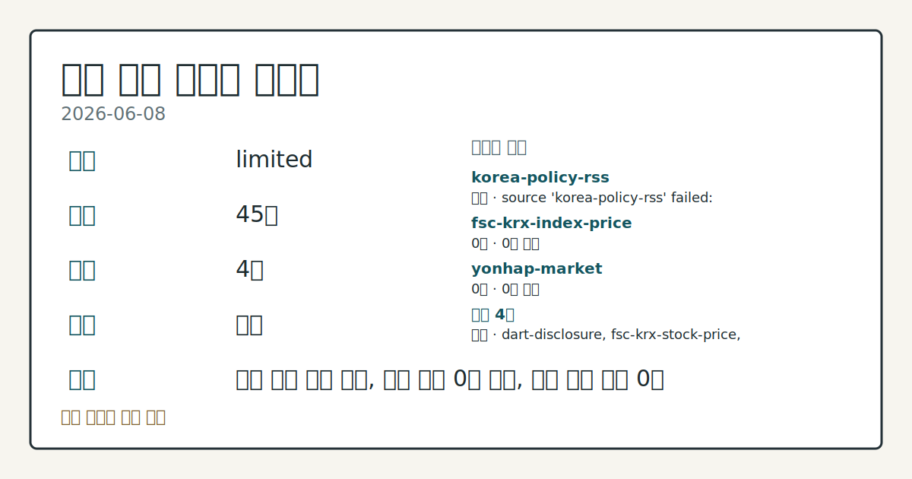
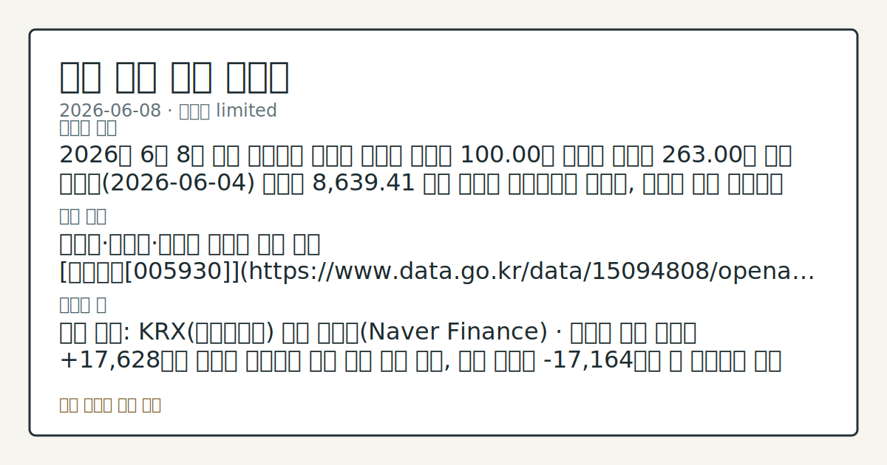

> 정보 제공용 자동 시황이며 매매 권유가 아닙니다.

# 2026-06-08 국내 증시 시황

**기준 시각**: 2026-06-08 KST · [2026-06-07T15:00Z, 2026-06-08T15:00Z)

| 종목 | 종가 | 변동 | 비고 |
|------|------|------|------|
| ^KOSPI | 100.00 | — | — |
| ^KOSDAQ | 263.00 | — | — |

**세그먼트**: [국내 증시](2026-06-08.md) | [미국 증시](../../../us-equity/2026/06/2026-06-08.md) | [크립토](../../../crypto/2026/06/2026-06-08.md)

*이미지: 데이터 신뢰도 · 출처: investo 자체 생성 · 생성: investo 0.1.0 · 2026-06-09 UTC*

> **내 관심 자산 영향**: 데이터 수집 부족으로 매칭 판단 보류 — 추가 수집 후 재평가됩니다.
> **오늘의 결론**: 2026년 6월 8일 국내 증시에서 수집된 코스피 지수값 100.00과 코스닥 지수값 263.00은 직전 거래일(2026-06-04) 코스피 8,639.41 대비 명백히 비정상적인 범위로, 데이터 수집 이상으로 판단되어 지수 등락률 직접 인용이 어렵다. [데이터부족]
> **핵심 동인**: 반도체·자동차·바이오 대형주 동반 급락 [삼성전자[005930]](https://www.data.go.kr/data/15094808/openapi.do)는 295,500원으로 마감하며 **-10.18%**(-33,500원) 하락했고, [SK하이닉스[000660]](https://www.data.go.kr/data/15094808/openapi.do)는 1,911,000원으로 **-7.68%**(-159,000원) 후퇴했다.
> **주의할 점**: 확인 소스: KRX(한국거래소) 수급 데이터(Naver Finance) · 코스피 개인 순매수 +17,628억원 규모가 유지되면 낙폭 지지 흐름 관찰, 기관...

> **데이터 상태**: 제한 · 본문 사용 미집계 · 실패 1 · 0건 2

수집/품질 진단

> **데이터 상태**: 제한 — 수집 45건 / 소스 4개 / 누락: 없음 · 제한 — 핵심 가격 소스 0건/실패/stale, 본문 결론 신뢰도 낮음
> **소스 카운트**: 수집 대상 7 / 성공 4 / 0건 2 / 실패 1 / 본문 사용 미집계
> **소스 등급 분포**: S=2 / A=1 / B=1
> **상세 사유**: 일부 소스 수집 실패, 일부 소스 0건 반환, 핵심 가격 소스 0건
> **소스별 상태**: korea-policy-rss 실패 (일시적 수집 오류), fsc-krx-index-price 0건, yonhap-market 0건, 정상 4개

## 한눈에 보기

- 삼성전자[005930] **-10.18%**, SK하이닉스[000660] **-7.68%**, 현대차[005380] **-8.71%** 등 코스피(KOSPI) 대형주 동반 급락 — 지수 원본값은 수집 이상으로 직접 인용 불가
- NAVER[035420]가 홀로 **+9.20%** 상승하며 대형주 일제 하락 속 예외적 역행 흐름 관찰
- KOSPI 개인 순매수 **+17,628억원** vs. 기관 순매도 **-17,164억원** — 수급 대립 구도를 §③에서 확인

## ⓪ 오늘의 매크로

- **미 국채 수익률** — UST curve 2026-06-08: 10Y 4.56%, 2Y10Y +0.41pp

## ⓪-B 채널 기준선

| 기준선 | 값 |
|------|------|
| 코스피 | 100.00 (—) |
| 코스닥 | 263.00 (—) |
| 원/달러 | 미수집 |

> **크로스마켓 연결 고리**: 금리 이벤트가 할인율/달러 경로의 공통 변수로 남아 있습니다.

## ① 요약

*이미지: 시장 스냅샷 · 출처: investo 자체 생성 · 생성: investo 0.1.0 · 2026-06-09 UTC*

2026년 6월 8일 국내 증시에서 수집된 코스피 지수값 100.00과 코스닥 지수값 263.00은 직전 거래일 코스피 8,639.41 대비 명백히 비정상적인 범위로, 데이터 수집 이상으로 판단되어 지수 등락률 직접 인용이 어렵다. 주요 종목 가격 데이터는 이날 대형주 중심의 광범위한 하락을 명확히 가리킨다: 삼성전자[005930] **-10.18%**(295,500원), SK하이닉스[000660] **-7.68%**(1,911,000원), 현대차[005380] **-8.71%**(639,000원), 셀트리온[068270] **-7.00%**(159,400원). 2026년 6월 1~3일 장중 사상 최고치(ATH) 8,933.62를 경신하며 이어지던 코스피 상승 흐름이 6월 4일 하락 전환된 이후, 이날 대형주 가격 데이터는 추가 하방이 지속됐음을 나타낸다. 반면 NAVER[035420]는 **+9.20%** 상승해 독자적인 강세를 보였다. 수급에서는 코스피 개인이 **+17,628억원** 순매수로 대응하고 기관이 **-17,164억원** 순매도로 받아쳤다. 환율 데이터 미수집. 미국 증시는 2026-06-08 기준 pre-market 상태로 전거래일 마감 데이터가 입력에 없어 국내 개장 영향 경로를 이날 데이터 기반으로 직접 확인하기 어렵다. [하락 관찰]

## ② 전일 핵심 이슈

### 반도체·자동차·바이오 대형주 동반 급락

[삼성전자[005930]](https://www.data.go.kr/data/15094808/openapi.do)는 295,500원으로 마감하며 **-10.18%**(-33,500원) 하락했고, [SK하이닉스[000660]](https://www.data.go.kr/data/15094808/openapi.do)는 1,911,000원으로 **-7.68%**(-159,000원) 후퇴했다. [현대차[005380]](https://www.data.go.kr/data/15094808/openapi.do)는 639,000원으로 **-8.71%**(-61,000원), [셀트리온[068270]](https://www.data.go.kr/data/15094808/openapi.do)는 159,400원으로 **-7.00%**(-12,000원) 하락했다. 최근 컨텍스트에서 코스피는 2026년 6월 1~3일 연속 ATH를 경신하며 상승 흐름을 이어왔으나 6월 4일부터 하락 전환된 이후, 오늘 대형주 가격 데이터가 추가 하락 압력 지속을 보여 준다. 전일 미국 증시 마감 데이터는 현재 입력에 없어 국내 개장 영향 경로를 데이터 기반으로 서술하기 어렵다.

> **그래서 의미는?** 시총 상위 반도체·자동차·바이오 대형주가 동반 급락해 코스피 전반에 강한 하방 압력이 집중된 하루로 관찰됩니다.

### NAVER 단독 역행 상승

[NAVER[035420]](https://www.data.go.kr/data/15094808/openapi.do)는 279,000원으로 마감하며 **+9.20%**(+23,500원) 상승했다. 시가 239,500원에서 출발해 장중 최고 294,000원까지 올라 뚜렷한 상승세를 기록했다. 대형주 일제 하락 속에서 NAVER만 역행한 배경에 대한 공시나 뉴스 데이터는 입력에 없어 원인을 현재 데이터 범위 내에서는 확인하기 어렵다.

## ③ 섹터/수급 동향

### KOSPI 수급 — 개인 대 기관 대립 구도

2026년 6월 8일 [코스피 투자자별 수급](https://finance.naver.com/sise/investorDealTrendDay.naver?bizdate=20260608&sosok=01)은 개인이 **+17,628억원** 순매수로 대거 유입된 반면 기관이 **-17,164억원** 순매도로 대응했다. 외국인은 **-2,644억원** 순매도, 기타는 **+2,181억원** 순매수였다.

> **그래서 의미는?** 대형주 급락 속 개인의 대규모 저가 매수와 기관의 대규모 매도가 맞서는 구도로, 수급 주체 간 방향성 인식 차이가 큰 상태로 관찰됩니다.

### 코스닥 수급 — 외국인 유일 순매수

[코스닥 투자자별 수급](https://finance.naver.com/sise/investorDealTrendDay.naver?bizdate=20260608&sosok=02)에서는 외국인이 **+2,976억원** 순매수를 기록하며 유일한 순매수 주체였다. 개인 **-1,245억원**, 기관 **-1,466억원**, 기타 **-265억원** 으로 나머지 주체가 모두 순매도를 나타냈다.

### NH프라임리츠 대량보유 보고 접수

[NH프라임리츠의 주식 대량보유 상황 보고서(약식)](https://dart.fss.or.kr/dsaf001/main.do?rcpNo=20260608000458)가 DART(전자공시시스템)에 접수됐다. 세부 보유 수량·비율은 입력 데이터에 없어 수치 인용이 어렵다.

## ④ 지표·이벤트

이날 국내 증시 관련 경제지표 발표나 이벤트 항목이 수집되지 않았다. 데이터 부족으로 구체적 지표 수치를 서술할 수 없다.

> **그래서 의미는?** 현재 수집 근거가 부족해 방향보다 확인 필요 항목으로만 봅니다.

## ⑤ 주요 종목

### 관전 분류

| 종목 | 종가 | 등락 |
|---|---|---|
| 삼성전자[005930] | 295,500원 | -10.18% (-33,500) |
| SK하이닉스[000660] | 1,911,000원 | -7.68% (-159,000) |
| 현대차[005380] | 639,000원 | -8.71% (-61,000) |
| 셀트리온[068270] | 159,400원 | -7.00% (-12,000) |
| NAVER[035420] | 279,000원 | +9.20% (+23,500) |

> **그래서 의미는?** 삼성전자(반도체·전자)·SK하이닉스(메모리반도체)·현대차(자동차)·셀트리온(바이오)이 동반 급락한 반면 NAVER(인터넷·플랫폼)만 역행...

### 공시 확인 항목

- [푸드나무 최대주주 변경](https://dart.fss.or.kr/dsaf001/main.do?rcpNo=20260608901074): 최대주주 변경 및 이를 수반하는 주식 담보 제공 계약 체결 공시 동시 접수
- [이마트 자기주식 처분 기재 정정](https://dart.fss.or.kr/dsaf001/main.do?rcpNo=20260608000434): 자기주식처분결정 주요사항보고서 기재 정정 접수
- [서울전자통신 유상증자 결정](https://dart.fss.or.kr/dsaf001/main.do?rcpNo=20260608000438): 유상증자 결정 공시 접수

## ⑥ 오늘의 관전 포인트

| 관찰 신호 | 현재 | 상방 확인 조건 | 하방 확인 조건 | 신뢰도 | 섹션 내 관심 영향 |
| --- | --- | --- | --- | --- | --- |
| 코스피 개인 순매수 **+17,628억원** 규모 | 확인 소스: KRX 수급 데이터 · 코스피 개인 순매수 **+17,628억원** 규모가 유지되면 낙폭 지지 흐름 관찰, 기관 순매도 **-17,164억원** 이 확대되면 추가 하방 압력 추세 확인. 관심 영향: 코스피 단기 방향성 데이터 비교. | 데이터부족 | 코스피 개인 순매수 **+17,628억원** 규모가 유지되면 낙폭 지지 흐름 관찰, 기관 순매도 **-17,164억원** 이 확대되면 추가 하방 압력 추세 확인 | 보통 | 관심 영향: 코스피 단기 방향성 데이터 비교. |
| 삼성전자[005930] 종 | 확인 소스: KRX 주가 데이터 · 삼성전자[005930] 종가 **295,500원** 이 오늘 장중 저점 292,500원을 상회하면 단기 지지 흐름 관찰, 292,500원 이탈 시 반도체 섹터 추가 하방 압력 점검. 관심 영향: SK하이닉스[000660] 연동 가격 흐름 데이터 비교. | 삼성전자[005930] 종가 **295,500원** 이 오늘 장중 저점 292,500원을 상회하면 단기 지지 흐름 관찰, 292,500원 이탈 시 반도체 섹터 추가 하방 압력 점검 | 삼성전자[005930] 종가 **295,500원** 이 오늘 장중 저점 292,500원을 상회하면 단기 지지 흐름 관찰, 292,500원 이탈 시 반도체 섹터 추가 하방 압력 점검 | 높음 | 관심 영향: SK하이닉스[000660] 연동 가격 흐름 데이터 비교. |
| 코스닥 외국인 순매수 **+2,976억원** 흐름 | 확인 소스: KRX 수급 데이터(Naver Finance) · 코스닥 외국인 순매수 **+2,976억원** 흐름이 다음 거래일에도 유지되면 코스닥 방어적 수급 관찰, 외국인 순매도 전환 시 코스닥 하방 압력 점검. 관심 영향: 코스닥 수급 방향성 추세 확인. | 데이터부족 | 코스닥 외국인 순매수 **+2,976억원** 흐름이 다음 거래일에도 유지되면 코스닥 방어적 수급 관찰, 외국인 순매도 전환 시 코스닥 하방 압력 점검 | 보통 | 관심 영향: 코스닥 수급 방향성 추세 확인. |
| NAVER[035420] 종 | 확인 소스: KRX 주가 데이터 · NAVER[035420] 종가 **279,000원** 이 오늘 장중 고점 **294,000원** 방향으로 연장되는지 추세 살피기; 시가 239,500원 수준으로 되돌리면 단기 상승 흐름 약화 흐름 확인. 관심 영향: 인터넷·플랫폼 섹터 독립 강세 지속 추세 비교. | 데이터부족 | 시가 239,500원 수준으로 되돌리면 단기 상승 흐름 약화 흐름 확인 | 높음 | 관심 영향: 인터넷 |
| 푸드나무 최대주주 변경 및 서울전자통신 유상증자 결정… | — | 데이터부족 | 데이터부족 | 데이터부족 | — |
## ⑦ 면책조항
본 시황은 일반 정보 제공을 목적으로 자동 생성된 자료이며,
특정 종목·자산에 대한 매매 권유나 투자 자문이 아닙니다.
투자 결정과 그 결과에 대한 책임은 전적으로 본인에게 있으며,
본 시황의 내용에 따라 발생한 손실에 대해 작성자는 일체의 책임을 지지 않습니다.