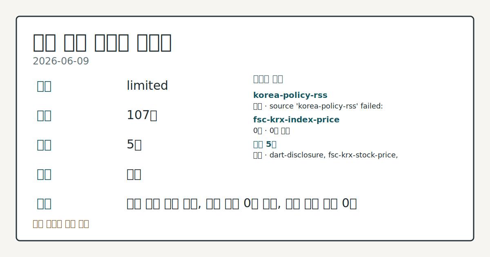
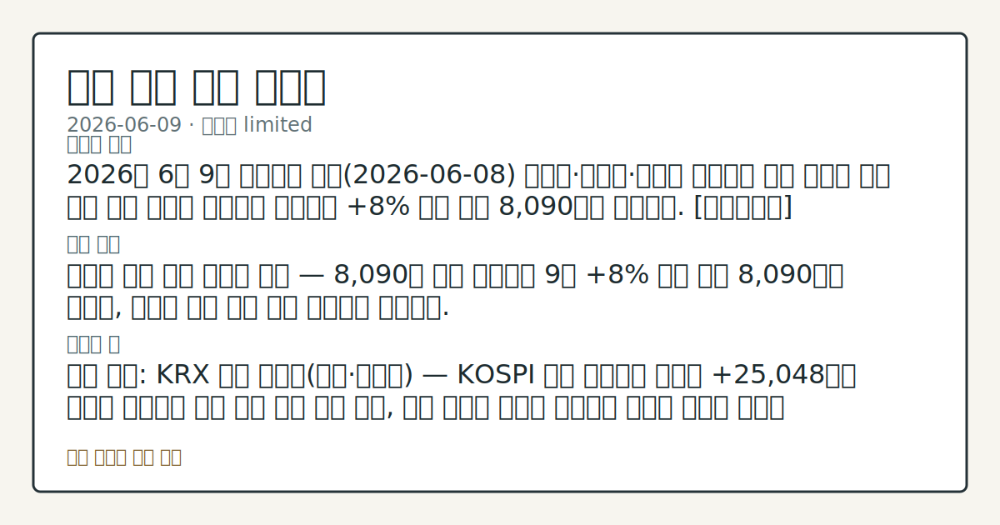

> 정보 제공용 자동 시황이며 매매 권유가 아닙니다.

# 2026-06-09 국내 증시 시황

**기준 시각**: 2026-06-09 KST · [2026-06-08T15:00Z, 2026-06-09T15:00Z)

| 종목 | 종가 | 변동 | 비고 |
|------|------|------|------|
| ^KOSPI | 197.16 | — | — |
| ^KOSDAQ | 263.00 | — | — |

**세그먼트**: [국내 증시](2026-06-09.md) | [미국 증시](../../../us-equity/2026/06/2026-06-09.md) | 크립토(미발행)

*이미지: 데이터 신뢰도 · 출처: investo 자체 생성 · 생성: investo 0.1.0 · 2026-06-10 UTC*

> **내 관심 자산 영향**: 데이터 수집 부족으로 매칭 판단 보류 — 추가 수집 후 재평가됩니다.
> **오늘의 결론**: 2026년 6월 9일 코스피는 전날(2026-06-08) 반도체·자동차·바이오 대형주의 동반 급락을 딛고 역대 최대 단일일 상승폭을 기록하며 **+8%** 넘게 올라 8,090대로 마감했다. [데이터부족]
> **핵심 동인**: 코스피 역대 최대 단일일 상승 — 8,090대 마감 코스피가 9일 **+8%** 넘게 오른 8,090대로 마감해, 단일일 기준 역대 최대 상승폭을 기록했다.
> **주의할 점**: 확인 소스: KRX 수급 데이터(기관·외국인) — KOSPI 기관 순매수가 오늘의 +25,048억원 수준을 유지하면 지수 방어 상방 흐름 관찰, 기관 순매수...

> **데이터 상태**: 제한 · 본문 사용 미집계 · 실패 1 · 0건 1

수집/품질 진단

> **데이터 상태**: 제한 — 수집 117건 / 소스 5개 / 누락: 없음 · 제한 — 핵심 가격 소스 0건/실패/stale, 본문 결론 신뢰도 낮음
> **소스 카운트**: 수집 대상 7 / 성공 5 / 0건 1 / 실패 1 / 본문 사용 미집계
> **소스 등급 분포**: S=2 / A=1 / B=2
> **상세 사유**: 일부 소스 수집 실패, 일부 소스 0건 반환, 핵심 가격 소스 0건
> **소스별 상태**: korea-policy-rss 실패 (일시적 수집 오류), fsc-krx-index-price 0건, 정상 5개

## 한눈에 보기

- KOSPI(코스피 종합주가지수)가 전날 급락에서 역대 최대 단일일 상승폭인 **+8%** 이상 반등해 8,090대로 회복 마감
- **기관**이 KOSPI에서 **+25,048억원** 순매수로 외국인 **-20,064억원** 순매도를 흡수하며 지수 방어
- 삼성전자[005930] 종가 **295,500원** — 반도체 섹터 변동성 지속, 본문 §③ 수급 흐름 점검

## ⓪ 오늘의 매크로

- **미 국채 수익률** — UST curve 2026-06-09: 10Y 4.53%, 2Y10Y +0.40pp

## ⓪-B 채널 기준선

| 기준선 | 값 |
|------|------|
| 코스피 | 197.16 (—) |
| 코스닥 | 263.00 (—) |
| 원/달러 | 미수집 |

> **크로스마켓 연결 고리**: 금리 이벤트가 할인율/달러 경로의 공통 변수로 남아 있습니다.

## ① 요약

*이미지: 시장 스냅샷 · 출처: investo 자체 생성 · 생성: investo 0.1.0 · 2026-06-10 UTC*

2026년 6월 9일 코스피는 전날 반도체·자동차·바이오 대형주의 동반 급락을 딛고 역대 최대 단일일 상승폭을 기록하며 **+8%** 넘게 올라 8,090대로 마감했다. 그러나 장중에는 급등락이 반복되며 공포지수(변동성지수)가 최고치를 기록하는 극심한 '롤러코스터' 장세가 연출됐다. 기관의 대규모 순매수(**+25,048억원**)가 외국인 순매도(**-20,064억원**)와 개인 이탈(**-6,167억원**)을 흡수하며 지수를 지지했다. 뉴욕증시(미국 3대 주가지수)가 미·이란 종전 기대감과 기술주 강세에 힘입어 상승 기조를 보인 점이 국내 개장 분위기에 긍정적으로 연결됐다. NVIDIA(엔비디아) CEO 젠슨 황의 방한 종료로 AI(인공지능) 테마주 수급이 급변한 가운데, NAVER[035420]는 **+9.20%** 반등 마감했다. 원/달러 환율은 당국의 투기거래 점검 속에 안정세를 보였다. [변동성 확대]

## ② 전일 핵심 이슈

### 코스피 역대 최대 단일일 상승 — 8,090대 마감

[코스피가 9일 **+8%** 넘게 오른 8,090대로 마감](https://www.yna.co.kr/view/AKR20260609129951008)해, 단일일 기준 역대 최대 상승폭을 기록했다. 2026년 6월 초 사상 최고치(ATH) 8,933.62 이후 급락 국면에 접근했다가 전날 추가 급락을 만회하는 첫 대규모 반등이 나타난 것이다. 다만 [장중에는 지수가 급등과 급락을 반복하며 공포지수가 최고치를 기록](https://www.yna.co.kr/view/AKR20260609122700008)하는 '지옥과 천당' 패턴이 확인됐다.

> **그래서 의미는?** 역대 최대 상승폭에도 공포지수 최고치 동반은 반등의 지속성보다 변동성 자체가 구조적으로 확대됐음을 시사하므로, 방향보다 변동성 추이 확인이...

### 젠슨 황 NVIDIA CEO 출국 — AI 테마주 수급 급변

NVIDIA CEO 젠슨 황의 방한을 계기로 주가가 요동쳤던 [NAVER[035420]와 LG 그룹주 등 코스피 연관 AI 테마 종목 다수가 동반 급락](https://www.yna.co.kr/view/AKR20260609055651008)했다. 방한 기간 기대감으로 급등했던 수급이 출국과 동시에 이탈하며 수급 영향이 즉각 확인됐다. NAVER[035420]는 최종 **+9.20%**, **279,000원**으로 마감해 낙폭을 일부 만회했으나, 장중 저가는 **238,500원**까지 내려갔다.

### 환율 투기거래 점검 및 자본시장 개혁 평가

미국 금리 인상 전망과 미·이란 종전 불강한성 속에 원/달러 환율 급등세가 이어지자, [당국은 외국계은행 등의 환 투기거래 여부 점검에 착수했다](https://www.yna.co.kr/view/AKR20260608170651002). 한편 이억원 금융위원장은 [ACGA(아시아기업지배구조협회)가 상법 개정 등 한국 자본시장 개혁 성과를 호평하는 이례적 감사서한을 발송했다고 밝혔다](https://www.yna.co.kr/view/AKR20260609171200002). 글로벌 기관의 긍정적 평가는 외국인 수급 경로에서 신호로 작용할 수 있다.

## ③ 섹터/수급 동향

### 투자자별 수급 — 기관 단독 KOSPI 방어

[KOSPI 수급](https://finance.naver.com/sise/investorDealTrendDay.naver?bizdate=20260609&sosok=01)에서 기관이 **+25,048억원** 순매수로 외국인(**-20,064억원** 순매도)과 개인(**-6,167억원** 순매도)의 이탈을 받아내며 지수를 지지했다. [KOSDAQ 수급](https://finance.naver.com/sise/investorDealTrendDay.naver?bizdate=20260609&sosok=02)에서는 외국인 **+3,126억원**, 기관 **+1,996억원** 순매수로 기관·외국인이 동반 매수에 나선 반면, 개인은 **-5,112억원** 순매도로 이탈했다.

> **그래서 의미는?** KOSPI는 기관 단독 방어, KOSDAQ은 기관·외국인 협력 매수 구도가 관찰됐습니다 — 외국인의 KOSPI 이탈 vs KOSDAQ 매수...

### 반도체 섹터 — 장중 회복 시도 후 하락 마감

삼성전자[005930]와 SK하이닉스[000660]는 장중 각각 30만원대·200만원대를 [일시 회복](https://www.yna.co.kr/view/AKR20260609041251008)하며 SK하이닉스 기준 역대 최대 상승률 구간을 연출했으나, 종가 기준 삼성전자는 **295,500원**(**-10.18%**, **-33,500원**), SK하이닉스는 **1,911,000원**(**-7.68%**, **-159,000원**)으로 마감했다. 전날에 이어 반도체 대형주의 장중 변동성이 재차 확인됐다.

## ④ 지표·이벤트

### 국고채(한국 국채) 금리 일제 하락 — 환율 안정과 연동

[원/달러 환율 안정세를 배경으로 국고채 금리가 9일 일제히 하락](https://www.yna.co.kr/view/AKR20260609144951008)했다. 3년물 기준 연 **3.856%**로 마감했다. 전날 급락 이후 채권 시장 불안이 일부 완화되는 양상이다.

> **그래서 의미는?** 국고채 금리와 환율의 동반 안정은 단기 금리 리스크 완화 신호이나, 환율 재급등 시 채권 금리 반등으로 연결될 수 있어 당국 점검 이후 추이...

### 미국 주택거래·무역수지 — 미 경제지표 개선

[미국 5월 주택 거래가 전월 대비 **3%** 증가](https://www.yna.co.kr/view/AKR20260609174800072)해 2025년 12월 이후 최대치를 기록했다. [4월 무역적자는 **559억 달러**로 전월 대비 **7억 달러(**-1.2%**)** 감소](https://www.yna.co.kr/view/AKR20260609172200072)했으며, 석유 수출 증가가 AI 투자 자본재 수입을 상쇄했다. 미국 경제지표 개선은 코스피 연관 수출 환경에서 배경 신호로 작용한다.

## ⑤ 주요 종목

### 관찰 항목 — 반도체·AI·자동차

| 종목 | 종가 | 전일 대비 |
|------|------|----------|
| 삼성전자[005930] | 295,500원 | **-10.18%** (**-33,500원**) |
| SK하이닉스[000660] | 1,911,000원 | **-7.68%** (**-159,000원**) |
| NAVER[035420] | 279,000원 | **+9.20%** (**+23,500원**) |
| 현대차[005380] | 639,000원 | **-8.71%** (**-61,000원**) |

> **그래서 의미는?** 삼성전자(삼성)·SK하이닉스(하이닉스)·현대차(현대자동차)가 하락한 반면 NAVER(네이버)는 상승해, AI 테마 vs 기존 수출 대형주 간...

### 애프터마켓 급등 확인 항목

- [SK오션플랜트[100090]](https://www.yna.co.kr/view/AKR20260609160700008): 애프터마켓 10%대 급등
- [SK이터닉스[475150]](https://www.yna.co.kr/view/AKR20260609159600008): 애프터마켓 10%대 급등
- [한국철강[104700]](https://www.yna.co.kr/view/AKR20260609140700008): 애프터마켓 13%대 급등
- [KISCO홀딩스[001940]](https://www.yna.co.kr/view/AKR20260609144300008): 애프터마켓 10%대 급등
- [티엠씨[217590]](https://www.yna.co.kr/view/AKR20260609145300008): 애프터마켓 10%대 급등

### 공시 체크리스트

- [CSA 코스믹[083660]](https://www.yna.co.kr/view/AKR20260609157300008): 운영자금 **150억원** 제3자배정 유상증자 결정
- [한샘](https://www.yna.co.kr/view/AKR20260609156900030): 분기배당·**500억원** 자사주 매입 추진, 주주환원율 50% 이상 확대 방침
- [휴메딕스[200670]](https://www.yna.co.kr/view/AKR20260609137300017): **50억원** 규모 자사주 취득 결정

## ⑥ 오늘의 관전 포인트

| 관찰 신호 | 현재 | 상방 확인 조건 | 하방 확인 조건 | 신뢰도 | 섹션 내 관심 영향 |
| --- | --- | --- | --- | --- | --- |
| 확인 소스: KRX 수급 데이터 — KOSPI 기관 순… | 확인 소스: KRX 수급 데이터 — KOSPI 기관 순매수가 오늘의 **+25,048억원** 수준을 유지하면 지수 방어 상방 흐름 관찰, 기관 순매수 규모가 축소되고 외국인 순매도 구도가 **-20,064억원** 이상으로 심화되면 하방 압력 확인. 관심 영향: KOSPI 반등 지속력 수급 추세 점검. | 확인 소스: KRX 수급 데이터 — KOSPI 기관 순매수가 오늘의 **+25,048억원** 수준을 유지하면 지수 방어 상방 흐름 관찰, 기관 순매수 규모가 축소되고 외국인 순매도 구도가 **-20,064억원** 이상으로 심화되면 하방 압력 확인 | 확인 소스: KRX 수급 데이터 — KOSPI 기관 순매수가 오늘의 **+25,048억원** 수준을 유지하면 지수 방어 상방 흐름 관찰, 기관 순매수 규모가 축소되고 외국인 순매도 구도가 **-20,064억원** 이상으로 심화되면 하방 압력 확인 | 보통 | 관심 영향: KOSPI 반등 지속력 수급 추세 점검. |
| 확인 소스: KRX 주 | 확인 소스: KRX 주가 — 종가가 오늘의 **295,500원**을 상회하면 반도체 섹터 반등 상방 관찰, 오늘 저가인 **292,500원** 이하로 재하락하면 추가 매물 압력 하방 흐름 관찰. 관심 영향: 반도체 섹터 수급 추세 점검. | 확인 소스: KRX 주가 — 종가가 오늘의 **295,500원**을 상회하면 반도체 섹터 반등 상방 관찰, 오늘 저가인 **292,500원** 이하로 재하락하면 추가 매물 압력 하방 흐름 관찰 | 확인 소스: KRX 주가 — 종가가 오늘의 **295,500원**을 상회하면 반도체 섹터 반등 상방 관찰, 오늘 저가인 **292,500원** 이하로 재하락하면 추가 매물 압력 하방 흐름 관찰 | 높음 | 관심 영향: 반도체 섹터 수급 추세 점검. |
| 확인 소스: 연합뉴스 국고채 데이터 — 3년물 금리 | 확인 소스: 연합뉴스 국고채 데이터 — 3년물 금리가 오늘의 연 **3.856%** 이하를 유지하면 환율·채권 동반 안정 상방 관찰, 환율 재급등 시 금리 반등 여부 추적 필요. 관심 영향: 국고채·환율 연동 추세 확인. | 채권 동반 안정 상방 관찰, 환율 재급등 시 금리 반등 여부 추적 필요 | 데이터부족 | 높음 | 관심 영향: 국고채 |
| 이란 협상 관련 뉴스 — 종전 기대감 | — | 데이터부족 | 데이터부족 | 데이터부족 | — |
| 확인 소스: KRX 주 | 확인 소스: KRX 주가 — NAVER가 오늘 종가 **279,000원** 이상을 유지하면 AI 테마 수급 지속 상방 관찰, 오늘 저가 **238,500원** 이하로 하락하면 방한 이벤트 소멸 후 수급 이탈 하방 관찰. 관심 영향: AI 테마주 코스피 수급 추세 점검. | 확인 소스: KRX 주가 — NAVER가 오늘 종가 **279,000원** 이상을 유지하면 AI 테마 수급 지속 상방 관찰, 오늘 저가 **238,500원** 이하로 하락하면 방한 이벤트 소멸 후 수급 이탈 하방 관찰 | 확인 소스: KRX 주가 — NAVER가 오늘 종가 **279,000원** 이상을 유지하면 AI 테마 수급 지속 상방 관찰, 오늘 저가 **238,500원** 이하로 하락하면 방한 이벤트 소멸 후 수급 이탈 하방 관찰 | 높음 | 관심 영향: AI 테마주 코스피 수급 추세 점검. |
## ⑦ 면책조항
본 시황은 일반 정보 제공을 목적으로 자동 생성된 자료이며,
특정 종목·자산에 대한 매매 권유나 투자 자문이 아닙니다.
투자 결정과 그 결과에 대한 책임은 전적으로 본인에게 있으며,
본 시황의 내용에 따라 발생한 손실에 대해 작성자는 일체의 책임을 지지 않습니다.