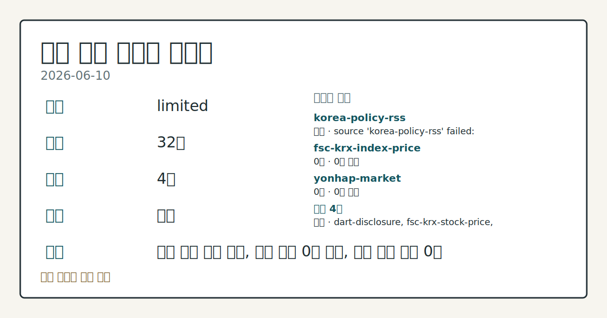
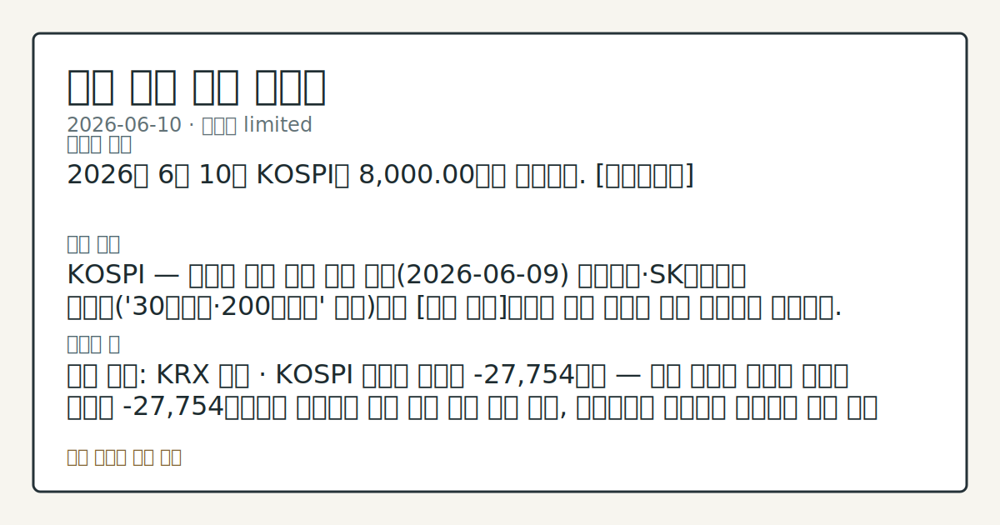

# 2026-06-10 국내 증시 시황
**기준 시각**: 2026-06-10 KST · 2026-06-09T15:00Z, 2026-06-10T15:00Z)
| 종목 | 종가 | 변동 | 비고 |
|------|------|------|------|
| ^KOSPI | 8,000.00 | — | — |
| ^KOSDAQ | 126.00 | — | — |
**세그먼트**: [국내 증시](2026-06-10.md) | [미국 증시](../../../us-equity/2026/06/2026-06-10.md) | [크립토](../../../crypto/2026/06/2026-06-10.md)

*이미지: 데이터 신뢰도 · 출처: investo 자체 생성 · 생성: investo 0.1.0 · 2026-06-11 UTC*
> **내 관심 자산 영향**: 데이터 수집 부족으로 매칭 판단 보류 — 추가 수집 후 재평가됩니다.
> **오늘의 결론**: 2026년 6월 10일 KOSPI는 8,000.00으로 마감했다. [데이터부족]
> **핵심 동인**: KOSPI — 외국인 주도 하락 전환 전날(2026-06-09) 삼성전자·SK하이닉스 급반등('30만전자·200만닉스' 회복)으로 [상승 관찰]이었던 국내 증시가 오늘 하락으로 전환됐다.
> **주의할 점**: 확인 소스: KRX 수급 · KOSPI 외국인 순매도 -27,754억원 — 다음 거래일 외국인 순매도 규모가 -27,754억원보다 확대되면 하락 압력 지속 흐름...
> **데이터 상태**: 제한 · 본문 사용 미집계 · 실패 1 · 0건 2

수집/품질 진단

> **데이터 상태**: 제한 — 수집 32건 / 소스 4개 / 누락: 없음 · 제한 — 핵심 가격 소스 0건/실패/stale, 본문 결론 신뢰도 낮음
> **소스 카운트**: 수집 대상 7 / 성공 4 / 0건 2 / 실패 1 / 본문 사용 미집계
> **소스 등급 분포**: S=2 / A=1 / B=1
> **상세 사유**: 일부 소스 수집 실패, 일부 소스 0건 반환, 핵심 가격 소스 0건
> **소스별 상태**: korea-policy-rss 실패 (수집 불가), fsc-krx-index-price 0건, yonhap-market 0건, 정상 4개

> 정보 제공용 자동 시황이며 매매 권유가 아닙니다.
## 한눈에 보기
KOSPI(코스피 종합주가지수) **8,000.00** 하락 마감 — 전날 반등을 반납하며 삼성전자(005930) **-6.06%**, NAVER(035420) **-11.67%** 등 대형주 일제 하락.
**NAVER[035420]** 하루 **-11.67%** (-30,000원) 낙폭으로 세션 중 시총 상위 최대 낙폭 종목으로 관찰.
확인 소스: KRX(한국거래소) 수급 — KOSPI 외국인 **-27,754억원** 순매도 대 개인 **+48,643억원** 순매수 구도를 §③에서 점검.
> **용어 가이드**: KOSPI, KOSDAQ(코스닥 시장지수), KRX, DART(전자공시시스템)
## ⓪ 오늘의 매크로
**미 국채 수익률** — UST curve 2026-06-10: 10Y 4.55%, 2Y10Y +0.42pp
## ⓪-B 채널 기준선
| 기준선 | 값 |
|------|------|
| 코스피 | 8,000.00 (—) |
| 코스닥 | 126.00 (—) |
| 원/달러 | 미수집 |
> **크로스마켓 연결 고리**: 금리 이벤트가 할인율/달러 경로의 공통 변수로 남아 있습니다.
> **오늘의 큰 그림:** 금리와 달러 변수가 미국·가상자산에 동시에 걸리며, 오늘 독자는 금리·달러 민감도을 먼저 확인해야 합니다.
## ① 요약

*이미지: 시장 스냅샷 · 출처: investo 자체 생성 · 생성: investo 0.1.0 · 2026-06-11 UTC*

2026년 6월 10일 KOSPI는 **8,000.00**으로 마감했다. 전날(2026-06-09) 삼성전자·SK하이닉스 급반등으로 회복됐던 흐름이 하루 만에 되돌려졌으며, 삼성전자·SK하이닉스(000660)·현대차(005380)·NAVER·셀트리온(068270) 등 시총 상위 종목이 하락 마감했다. KOSDAQ는 **126.00**에 마감했다. 환율 데이터 미수집으로 원/달러 환율 수치는 인용하지 않는다. [하락 관찰]

## ② 전일 핵심 이슈

### KOSPI — 외국인 주도 하락 전환

전날 삼성전자·SK하이닉스 급반등으로 [상승 관찰]이었던 국내 증시가 오늘 하락으로 전환됐다. [KRX 수급 데이터(2026-06-10)](https://finance.naver.com/sise/investorDealTrendDay.naver?bizdate=20260610&sosok=01) 기준 KOSPI 외국인 순매도가 **-27,754억원**에 달해 전환의 핵심 수급 요인으로 작용했으며, 개인이 **+48,643억원** 순매수로 대응했으나 지수 방어에 충분하지 않았다.

> **그래서 의미는?** 전날 반등 이후 하루 만에 외국인 대규모 이탈이 재개됐다 — 반등이 추세 회복인지 기술적 반등인지 추가 관찰이 필요하다.

### NAVER[035420] — 대형 낙폭 기록

[NAVER[035420]](https://www.data.go.kr/data/15094808/openapi.do)는 시가 245,000원에서 출발해 종가 **227,000원**으로 **-11.67%** (-30,000원) 하락했다. 장중 저가 222,000원까지 내려갔으며 장중 고가 253,500원 대비 낙폭이 두드러졌다.

### 반도체·완성차 — 동반 약세

[삼성전자](https://www.data.go.kr/data/15094808/openapi.do)는 **-6.06%** (-19,500원) 하락한 **302,500원**, [SK하이닉스](https://www.data.go.kr/data/15094808/openapi.do)는 **-7.54%** (-167,000원) 하락한 **2,048,000원**에 마감했다. [현대차](https://www.data.go.kr/data/15094808/openapi.do)도 **-5.79%** (-37,000원) 내린 **602,000원**이었다. 전날 회복 흐름을 이어가지 못하며 전 섹터에 매도 압력이 작용했다.

BundleContext 기준 us-equity 세그먼트는 post-close 상태로 ORCL(오라클) 어닝이 발표된 상황이다. 이 사실이 국내 IT·인터넷 플랫폼 섹터(NAVER[035420] 등) 외국인 수급에 미칠 영향은 §⑥에서 점검한다.

## ③ 섹터/수급 동향

### KOSPI 투자자별 수급

[KRX 수급(2026-06-10)](https://finance.naver.com/sise/investorDealTrendDay.naver?bizdate=20260610&sosok=01) 기준, KOSPI에서 외국인이 **-27,754억원** 대규모 순매도를 기록했다. 기관도 **-22,665억원** 순매도에 동참했다. 개인은 **+48,643억원** 순매수로 대응했고, 기타는 **+1,776억원** 순매수였다.

> **그래서 의미는?** 외국인·기관이 동시에 이탈하고 개인이 홀로 시장을 받치는 수급 구조가 관찰된다 — 이 구도의 지속 여부가 추세 방향을 가를 관찰 지점이다.

### KOSDAQ 투자자별 수급

[KOSDAQ 수급(2026-06-10)](https://finance.naver.com/sise/investorDealTrendDay.naver?bizdate=20260610&sosok=02) 기준, 외국인이 **+1,420억원** 순매수였으며 개인도 **+1,167억원** 순매수였다. 기관은 **-1,125억원**, 기타는 **-1,462억원** 순매도였다. KOSPI와 달리 KOSDAQ에서는 외국인 순매수가 유지됐다.

### 반도체 섹터

삼성전자와 SK하이닉스(000660)가 각각 **-6.06%**, **-7.54%** 하락하며 반도체 섹터 전반에 하락 압력이 집중됐다. 2차전지 관련 종목은 입력 데이터가 수집되지 않아 별도 흐름 서술이 어렵다.

## ④ 지표·이벤트

이번 세션에 해당하는 국내 거시 지표·이벤트 데이터가 수집되지 않았다. DART에 접수된 주요 공시로는 [케이티앤지 주식등의대량보유상황보고서(약식)](https://dart.fss.or.kr/dsaf001/main.do?rcpNo=20260610000680), [한미사이언스 주식등의대량보유상황보고서(일반)](https://dart.fss.or.kr/dsaf001/main.do?rcpNo=20260610000678), CSA 코스믹의 [유상증자결정 기재정정](https://dart.fss.or.kr/dsaf001/main.do?rcpNo=20260610000674), 모아데이타의 [전환사채권발행결정 기재정정](https://dart.fss.or.kr/dsaf001/main.do?rcpNo=20260610000668) 등이 있다.

> **그래서 의미는?** 현재 수집 근거가 부족해 방향보다 확인 필요 항목으로만 봅니다.

## ⑤ 주요 종목

### 확인 항목

| 종목 | 종가 | 등락률 | 등락 | 장중 고가 | 장중 저가 |
|------|------|--------|------|-----------|-----------|
| [삼성전자[005930]](https://www.data.go.kr/data/15094808/openapi.do) | 302,500원 | **-6.06%** | -19,500 | 314,500 | 295,250 |
| [SK하이닉스[000660]](https://www.data.go.kr/data/15094808/openapi.do) | 2,048,000원 | **-7.54%** | -167,000 | 2,180,000 | 1,992,000 |
| [NAVER[035420]](https://www.data.go.kr/data/15094808/openapi.do) | 227,000원 | **-11.67%** | -30,000 | 253,500 | 222,000 |
| [현대차[005380]](https://www.data.go.kr/data/15094808/openapi.do) | 602,000원 | **-5.79%** | -37,000 | 653,000 | 583,000 |
| [셀트리온[068270]](https://www.data.go.kr/data/15094808/openapi.do) | 167,300원 | **-1.59%** | -2,700 | 168,400 | 162,700 |

> **그래서 의미는?** 반도체(삼성전자·SK하이닉스), 완성차(현대차), 인터넷 플랫폼(NAVER), 바이오(셀트리온) 등 시총 상위 종목 전반이 하락했다.

### 공시 체크리스트

- [케이티앤지](https://dart.fss.or.kr/dsaf001/main.do?rcpNo=20260610000680) — 주식등의대량보유상황보고서(약식)
- [한미사이언스](https://dart.fss.or.kr/dsaf001/main.do?rcpNo=20260610000678) — 주식등의대량보유상황보고서
- [CSA 코스믹](https://dart.fss.or.kr/dsaf001/main.do?rcpNo=20260610000674) — 유상증자결정 기재정정
- [모아데이타](https://dart.fss.or.kr/dsaf001/main.do?rcpNo=20260610000668) — 전환사채권발행결정 기재정정
- [플루토스](https://dart.fss.or.kr/dsaf001/main.do?rcpNo=20260610000628) — 전환사채권발행결정

## ⑥ 오늘의 관전 포인트

#### 관찰 신호: KOSPI 외국인 순매도 **-27,754억원** —…

- 출처: KRX 수급
- 현재: 확인 소스: KRX 수급 · KOSPI 외국인 순매도 **-27,754억원** — 다음 거래일 외국인 순매도 규모가 **-27,754억원**보다 확대되면 하락 압력 지속 흐름 관찰, 축소되거나 순매수로 전환되면 매도 압력 완화 여부 점검. 관심 영향: KOSPI 추세 방향 관찰.
- 확인 조건: 상방 상방 데이터 부족; 하방 하방 데이터 부족
- 신뢰도: 보통
- 관심 영향: 관심 영향: KOSPI 추세 방향 관찰.

#### 관찰 신호: KRX 주

- 출처: FSC
- 현재: 확인 소스: FSC·KRX 주가 · 삼성전자 당일 저가 295,250원 — 다음 거래일 시가가 295,250원을 상회하면 하락 압력 일부 흡수 흐름 확인, 295,250원을 하방 이탈하면 추가 하락 압력 확대 여부 점검. 관심 영향: 반도체 섹터 수급 흐름 확인.
- 확인 조건: 상방 삼성전자 당일 저가 295,250원 — 다음 거래일 시가가 295,250원을 상회하면 하락 압력 일부 흡수 흐름 확인, 295,250원을 하방 이탈하면 추가 하락 압력 확대 여부 점검; 하방 삼성전자 당일 저가 295,250원 — 다음 거래일 시가가 295,250원을 상회하면 하락 압력 일부 흡수 흐름 확인, 295,250원을 하방 이탈하면 추가 하락 압력 확대 여부 점검
- 신뢰도: 높음
- 관심 영향: 관심 영향: 반도체 섹터 수급 흐름 확인.

#### 관찰 신호: KRX 주

- 출처: FSC
- 현재: 확인 소스: FSC·KRX 주가 · SK하이닉스 당일 고가 2,180,000원 / 저가 1,992,000원 — 2,180,000원 상회 시 회복 압력 여부 관찰, 1,992,000원 이탈 시 추가 하방 압력 확대 흐름 확인. 관심 영향: 반도체 대형주 변동성 흐름 점검.
- 확인 조건: 상방 SK하이닉스 당일 고가 2,180,000원 / 저가 1,992,000원 — 2,180,000원 상회 시 회복 압력 여부 관찰, 1,992,000원 이탈 시 추가 하방 압력 확대 흐름 확인; 하방 SK하이닉스 당일 고가 2,180,000원 / 저가 1,992,000원 — 2,180,000원 상회 시 회복 압력 여부 관찰, 1,992,000원 이탈 시 추가 하방 압력 확대 흐름 확인
- 신뢰도: 높음
- 관심 영향: 관심 영향: 반도체 대형주 변동성 흐름 점검.

#### 관찰 신호: KOSDAQ 외국인 순매수 **+1,420억원** —…

- 출처: KRX 수급
- 현재: 확인 소스: KRX 수급 · KOSDAQ 외국인 순매수 **+1,420억원** — 외국인 순매수 흐름이 유지되면 KOSPI 대비 KOSDAQ 상대적 방어력 비교, 역전되어 순매도 전환 시 전 시장 동반 하락 구도 확인. 관심 영향: KOSPI vs KOSDAQ 수급 격차 비교.
- 확인 조건: 상방 상방 데이터 부족; 하방 KOSDAQ 외국인 순매수 **+1,420억원** — 외국인 순매수 흐름이 유지되면 KOSPI 대비 KOSDAQ 상대적 방어력 비교, 역전되어 순매도 전환 시 전 시장 동반 하락 구도 확인
- 신뢰도: 보통
- 관심 영향: 관심 영향: KOSPI vs KOSDAQ 수급 격차 비교.

#### 관찰 신호: KRX 주

- 출처: FSC
- 현재: 확인 소스: FSC·KRX 주가 · NAVER 당일 저가 222,000원 / 고가 253,500원 — 222,000원 하방 이탈 여부와 253,500원 대비 회복폭을 비교하며 인터넷·플랫폼 섹터 낙폭 흐름 점검. 관심 영향: 인터넷 섹터 추세 확인.
- 확인 조건: 상방 NAVER 당일 저가 222,000원 / 고가 253,500원 — 222,000원 하방 이탈 여부와 253,500원 대비 회복폭을 비교하며 인터넷; 하방 NAVER 당일 저가 222,000원 / 고가 253,500원 — 222,000원 하방 이탈 여부와 253,500원 대비 회복폭을 비교하며 인터넷
- 신뢰도: 높음
- 관심 영향: 관심 영향: 인터넷 섹터 추세 확인.
## ⑦ 면책조항
본 시황은 일반 정보 제공을 목적으로 자동 생성된 자료이며,
특정 종목·자산에 대한 매매 권유나 투자 자문이 아닙니다.
투자 결정과 그 결과에 대한 책임은 전적으로 본인에게 있으며,
본 시황의 내용에 따라 발생한 손실에 대해 작성자는 일체의 책임을 지지 않습니다.