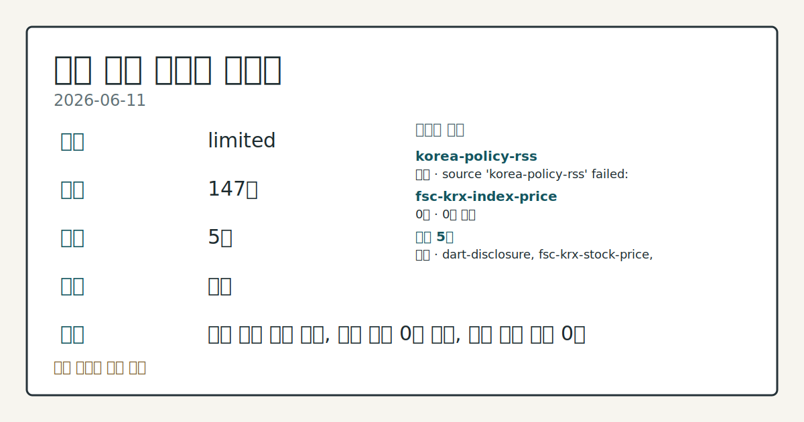
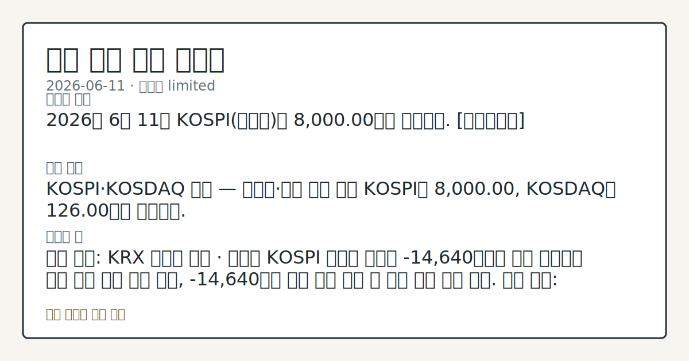

# 2026-06-11 국내 증시 시황
**기준 시각**: 2026-06-11 KST · 2026-06-10T15:00Z, 2026-06-11T15:00Z)
| 종목 | 종가 | 변동 | 비고 |
|------|------|------|------|
| ^KOSPI | 8,000.00 | — | — |
| ^KOSDAQ | 126.00 | — | — |
**세그먼트**: [국내 증시](2026-06-11.md) | [미국 증시](../../../us-equity/2026/06/2026-06-11.md) | [크립토](../../../crypto/2026/06/2026-06-11.md)

*이미지: 데이터 신뢰도 · 출처: investo 자체 생성 · 생성: investo 0.1.0 · 2026-06-12 UTC*
> **내 관심 자산 영향**: 데이터 수집 부족으로 매칭 판단 보류 — 추가 수집 후 재평가됩니다.
> **용어 가이드**: 이번 시황에서 처음 등장한 용어 — 시가총액(시장가치)
> **오늘의 결론**: 2026년 6월 11일 KOSPI(코스피)는 8,000.00으로 마감했다. [데이터부족]
> **핵심 동인**: KOSPI·KOSDAQ 급락 — 외국인·기관 동반 이탈 KOSPI는 8,000.00, KOSDAQ는 126.00으로 마감됐다.
> **주의할 점**: 확인 소스: KRX 외국인 수급 · 외국인 KOSPI 순매도 규모가 -14,640억원을 재차 상회하면 추가 지수 하방 압력 관찰, -14,640억원 대비 축소...
> **데이터 상태**: 제한 · 본문 사용 미집계 · 실패 1 · 0건 1

수집/품질 진단

> **데이터 상태**: 제한 — 수집 147건 / 소스 5개 / 누락: 없음 · 제한 — 핵심 가격 소스 0건/실패/stale, 본문 결론 신뢰도 낮음
> **소스 카운트**: 수집 대상 7 / 성공 5 / 0건 1 / 실패 1 / 본문 사용 미집계
> **소스 등급 분포**: S=2 / A=1 / B=2
> **상세 사유**: 일부 소스 수집 실패, 일부 소스 0건 반환, 핵심 가격 소스 0건
> **소스별 상태**: korea-policy-rss 실패 (일시적 수집 오류), fsc-krx-index-price 0건, 정상 5개

> 정보 제공용 자동 시황이며 매매 권유가 아닙니다.
## 한눈에 보기
KOSPI **8,000.00** 보합 유지 속 삼성전자[005930] **-6.06%**, SK하이닉스[000660] **-7.54%**, NAVER[035420] **-11.67%** 대형주 일제 급락 관찰
외국인 KOSPI 순매도 **-14,640억원**) — 개인 **+20,803억원** 방어에도 반도체·자동차·플랫폼 섹터 동반 하락
ECB(유럽중앙은행) **+**0.25%**p** 금리 인상·미국 5월 PPI(생산자물가지수) **+6.5%** 급등으로 국고채 3년물이 연 **3.904%**로 상승 — 본문 §④ 흐름 확인
## ⓪ 오늘의 매크로
**미 국채 수익률** — UST curve 2026-06-11: 10Y 4.45%, 2Y10Y +0.40pp
## ⓪-B 채널 기준선
| 기준선 | 값 |
|------|------|
| 코스피 | 8,000.00 (—) |
| 코스닥 | 126.00 (—) |
| 원/달러 | 미수집 |
> **크로스마켓 연결 고리**: 금리 이벤트가 할인율/달러 경로의 공통 변수로 남아 있습니다.
> **오늘의 큰 그림:** 금리와 달러 변수가 미국·가상자산에 동시에 걸리며, 오늘 독자는 금리·달러 민감도을 먼저 확인해야 합니다.
## ① 요약

*이미지: 시장 스냅샷 · 출처: investo 자체 생성 · 생성: investo 0.1.0 · 2026-06-12 UTC*

2026년 6월 11일 KOSPI는 [**8,000.00**](https://www.yna.co.kr/market-plus/all)으로 마감했다. 전일(2026-06-10)과 동일한 수준이나 지난주 고점 대비 큰 폭 하락한 흐름이 연장되고 있다. KOSDAQ(코스닥)은 [**126.00**](https://www.yna.co.kr/market-plus/all)으로 마감됐다. 원/달러 환율 데이터는 미수집 상태다.

ECB가 3년 만에 금리를 인상하고 미국 5월 PPI가 **+6.5%** 급등하면서 글로벌 긴축 우려가 확산됐다. 이 여파로 외국인이 KOSPI에서 **-14,640억원** 대규모 순매도를 기록하고 기관도 **-7,561억원** 이탈했다. 삼성전자·SK하이닉스·NAVER·현대차 등 시가총액 상위 대형주가 일제히 급락했다. 미국 증시는 기술주 저가 매수세로 상승 마감(미국 세그먼트 종가 기준)한 것으로 확인되며, 이것이 다음 국내 개장 하방 압력을 일부 상쇄할지 흐름 점검이 필요하다. [하락 관찰]

## ② 전일 핵심 이슈

### KOSPI·KOSDAQ 급락 — 외국인·기관 동반 이탈

[KOSPI](https://www.yna.co.kr/market-plus/all)는 **8,000.00**, KOSDAQ는 **126.00**으로 마감됐다. 외국인은 KOSPI에서 **-14,640억원** 순매도, 기관은 **-7,561억원** 순매도를 기록했다. 개인이 **+20,803억원** 순매수로 지수를 방어하며 현 수준을 유지했다. [증시 대기자금은 나흘 만에 12조원 감소](https://www.yna.co.kr/view/AKR20260611143800008)하며 관망 심리가 확산된 흐름이 관찰된다.

> **그래서 의미는?** 외국인·기관이 동시에 대규모 이탈하고 개인 순매수만으로 지수를 방어하는 구도는 단기 반등 탄력이 제한되는 패턴으로 관찰된다.

### ECB 금리 인상·미 PPI 급등 — 국내 채권금리 동조 상승

[ECB](https://www.yna.co.kr/view/AKR20260611171153082)는 11일(현지시간) 중동발 인플레이션 우려를 이유로 3대 정책금리를 **+**0.25%**p** 인상했다. 이란 전쟁 발발 이후 주요국 중앙은행 중 첫 금리 인상이다. 같은 날 [미국 5월 PPI](https://www.yna.co.kr/view/AKR20260611174051072)가 전년 대비 **+6.5%** 상승해 2022년 11월 이후 최대 폭을 기록했다. 두 데이터가 동시 공개되면서 [국고채 금리가 일제히 상승, 3년물은 연 **3.904%**](https://www.yna.co.kr/view/AKR20260611143651008)로 고시됐다. 채권금리 상승은 국내 고PER(주가수익비율) 성장주 할인율 부담 가중으로 이어지는 경로로 관찰된다.

### 중동 긴장 재고조 — 에너지 불안 지속

미-이란 전쟁으로 호르무즈 해협 봉쇄가 장기화되면서 에너지 수급 불안이 지속됐다. [이탈리아](https://www.yna.co.kr/view/AKR20260611138900109)는 에너지 관련 지출을 EU(유럽연합) 재정규제에서 예외로 인정받는 방안을 추진 중이다. 중동 긴장 재고조 흐름 속에서 글로벌 위험자산 회피 심리가 국내 외국인 이탈과 연결된 것으로 관찰된다.

## ③ 섹터/수급 동향

### KOSPI 수급 — 외국인·기관 동반 매도, 개인 대규모 순매수

[KOSPI 투자자별 동향](https://finance.naver.com/sise/investorDealTrendDay.naver?bizdate=20260611&sosok=01)에서 외국인 **-14,640억원**, 기관 **-7,561억원** 순매도가 확인됐다. 개인은 **+20,803억원**, 기타는 **+1,399억원** 순매수로 맞섰다.

> **그래서 의미는?** 외국인·기관이 동반 매도하는 국면에서 개인의 대규모 역매수가 지수 하단을 받치는 구도가 관찰되며, 외국인 매도세 지속 여부가 수급 변수로...

### KOSDAQ 수급 — 기관 대규모 순매수, 외국인·개인 이탈

[KOSDAQ 투자자별 동향](https://finance.naver.com/sise/investorDealTrendDay.naver?bizdate=20260611&sosok=02)에서 기관이 **+7,149억원** 순매수를 기록한 반면, 외국인 **-3,601억원**, 개인 **-3,634억원** 순매도가 이루어졌다. 기타는 **+86억원** 순매수였다. KOSDAQ에서 기관이 외국인·개인 매물을 대량 흡수하는 구도가 관찰된다.

### 반도체 섹터 — 삼성전자·SK하이닉스 급락

삼성전자[005930]는 **302,500원**(**-6.06%**, **-19,500원**)으로 마감했고, SK하이닉스[000660]는 **2,048,000원**(**-7.54%**, **-167,000원**)으로 낙폭이 더 컸다. 글로벌 긴축 우려와 외국인 대규모 매도세가 반도체 대형주를 중심으로 집중된 것으로 관찰된다. 한편 [우리자산운용 반도체BIG2플러스펀드](https://www.yna.co.kr/view/AKR20260611149300008)는 최근 1년 수익률 **74%**를 기록했다고 밝혔다.

## ④ 지표·이벤트

### ECB 정책금리 **+**0.25%**p** 인상 — 3년 만에 첫 긴축 전환

[ECB](https://www.yna.co.kr/view/AKR20260611171153082)가 3대 정책금리를 **+**0.25%**p** 인상했다. 중동 에너지 인플레이션 대응이 목적으로, 이란 전쟁 발발 이후 주요국 중앙은행 중 첫 인상 사례다. 이 결정이 국내 채권금리와 성장주 할인율에 연결되는 경로를 추적할 필요가 있다.

> **그래서 의미는?** ECB의 긴축 전환은 글로벌 채권금리 상승 압력을 높여 국내 국고채 금리에도 동조화 흐름이 관찰된다.

### 미국 5월 PPI **+6.5%** — 2022년 11월 이후 최대

[미국 5월 PPI](https://www.yna.co.kr/view/AKR20260611174051072)가 전년 대비 **+6.5%** 상승했다. 호르무즈 해협 봉쇄 장기화로 에너지 비용이 급등한 결과다. Fed(미국 연방준비제도) 추가 긴축 기대와 원/달러 환율 상승 압력으로 이어지는 경로 추적이 필요하다.

### 국고채 금리 — 3년물 연 **3.904%** 상승

[중동 긴장 재고조 및 글로벌 긴축 여파로 국고채 금리가 일제히 상승](https://www.yna.co.kr/view/AKR20260611143651008)했다. 3년물은 연 **3.904%**로 고시됐다. 채권금리 상승은 기업 자금조달 비용 부담 가중으로 이어지는 흐름으로 관찰된다.

## ⑤ 주요 종목

### 대형주 급락 종목

| 종목 | 종가 | 등락률 | 등락폭 |
|------|------|--------|--------|
| 삼성전자[005930] | **302,500원** | **-6.06%** | **-19,500원** |
| SK하이닉스[000660] | **2,048,000원** | **-7.54%** | **-167,000원** |
| NAVER[035420] | **227,000원** | **-11.67%** | **-30,000원** |
| 현대차[005380] | **602,000원** | **-5.79%** | **-37,000원** |
| 셀트리온[068270] | **167,300원** | **-1.59%** | **-2,700원** |

> **그래서 의미는?** 삼성전자(005930)·SK하이닉스(000660)·NAVER(035420)·현대차(005380) 등 KOSPI 시가총액 상위 종목이 동반...

### 시간 외 급등 관찰 종목

[한화엔진[082740]](https://www.yna.co.kr/view/AKR20260611156800008), [한화오션[042660]](https://www.yna.co.kr/view/AKR20260611155600008), [삼천당제약[000250]](https://www.yna.co.kr/view/AKR20260611154500008), [자화전자[033240]](https://www.yna.co.kr/view/AKR20260611142500008)가 애프터마켓에서 각각 10%대 급등 중이다. 급등 사유는 현재 입력 데이터 내 구체적으로 확인되지 않아 추가 공시 확인이 필요하다.

### 공시 확인 항목

- [롯데쇼핑[023530]](https://www.yna.co.kr/view/AKR20260611155800030): 2년 연속 중간배당 실시, 배당 규모 확대
- [메리츠금융](https://www.yna.co.kr/view/AKR20260611148700008): MBK파트너스·김병주 회장 보증 전제로 홈플러스 1,000억원 지원 검토
- [고려아연·영풍[000670]](https://www.yna.co.kr/view/AKR20260611143000002): 공정위가 해외 계열사 순환출자 제재 착수

## ⑥ 오늘의 관전 포인트

#### 관찰 신호: 확인 소스: KRX 외국인 수급 · 외국인 KOSPI…

- 출처: 확인 소스 미상
- 현재: 확인 소스: KRX 외국인 수급 · 외국인 KOSPI 순매도 규모가 **-14,640억원**을 재차 상회하면 추가 지수 하방 압력 관찰, **-14,640억원** 대비 축소 전환 시 수급 안정 흐름 확인. 관심 영향: 개인 단독 방어 구도 지속 가능성 점검.
- 확인 조건: 상방 외국인 KOSPI 순매도 규모가 **-14,640억원**을 재차 상회하면 추가 지수 하방 압력 관찰, **-14,640억원** 대비 축소 전환 시 수급 안정 흐름 확인; 하방 외국인 KOSPI 순매도 규모가 **-14,640억원**을 재차 상회하면 추가 지수 하방 압력 관찰, **-14,640억원** 대비 축소 전환 시 수급 안정 흐름 확인
- 신뢰도: 보통
- 관심 영향: 관심 영향: 개인 단독 방어 구도 지속 가능성 점검.

#### 관찰 신호: 확인 소스: 연합뉴스 국고채 금리 · 3년물 금리

- 출처: 확인 소스 미상
- 현재: 확인 소스: 연합뉴스 국고채 금리 · 3년물 금리가 **3.904%**를 추가 상회하면 NAVER[035420] 등 고PER 성장주 할인율 부담 확대 관찰, **3.904%** 하회 시 긴축 우려 완화 흐름 확인. 관심 영향: 플랫폼·바이오 성장주 수급 변동 추적.
- 확인 조건: 상방 3년물 금리가 **3.904%**를 추가 상회하면 NAVER[035420] 등 고PER 성장주 할인율 부담 확대 관찰, **3.904%** 하회 시 긴축 우려 완화 흐름 확인; 하방 3년물 금리가 **3.904%**를 추가 상회하면 NAVER[035420] 등 고PER 성장주 할인율 부담 확대 관찰, **3.904%** 하회 시 긴축 우려 완화 흐름 확인
- 신뢰도: 높음
- 관심 영향: 관심 영향: 플랫폼

#### 관찰 신호: 확인 소스: 연합뉴스 증시 대기자금 · 나흘 새 12조…

- 출처: 확인 소스 미상
- 현재: 확인 소스: 연합뉴스 증시 대기자금 · 나흘 새 12조원 감소한 증시 대기자금이 추가 이탈하면 KOSPI **8,000선** 방어 여력 약화 관찰, 대기자금 유입 전환 시 저점 매수 유인 확인. 관심 영향: 지수 지지선 변동 점검.
- 확인 조건: 상방 상방 데이터 부족; 하방 나흘 새 12조원 감소한 증시 대기자금이 추가 이탈하면 KOSPI **8,000선** 방어 여력 약화 관찰, 대기자금 유입 전환 시 저점 매수 유인 확인
- 신뢰도: 보통
- 관심 영향: 관심 영향: 지수 지지선 변동 점검.

#### 관찰 신호: 확인 소스: 연합뉴스 애프터마켓 보도 · 한화엔진

- 출처: 확인 소스 미상
- 현재: 확인 소스: 연합뉴스 애프터마켓 보도 · 한화엔진[082740]·한화오션[042660]·삼천당제약[000250]·자화전자[033240]의 10%대 급등 사유가 공시로 확인되면 정규장 반응 지속 흐름 추적, 사유 미확인 또는 공시 부재 시 변동성 확대 가능성 관찰. 관심 영향: 개별 이슈 섹터 확산 여부 점검.
- 확인 조건: 상방 상방 데이터 부족; 하방 하방 데이터 부족
- 신뢰도: 높음
- 관심 영향: 관심 영향: 개별 이슈 섹터 확산 여부 점검.
## ⑦ 면책조항
본 시황은 일반 정보 제공을 목적으로 자동 생성된 자료이며,
특정 종목·자산에 대한 매매 권유나 투자 자문이 아닙니다.
투자 결정과 그 결과에 대한 책임은 전적으로 본인에게 있으며,
본 시황의 내용에 따라 발생한 손실에 대해 작성자는 일체의 책임을 지지 않습니다.