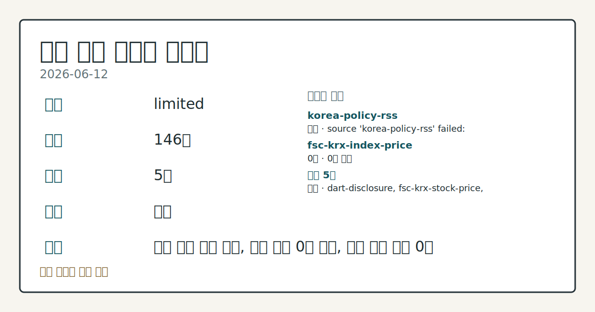
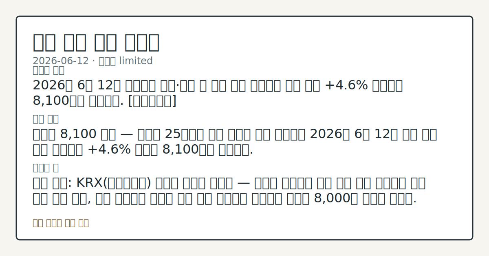

# 2026-06-12 국내 증시 시황
**기준 시각**: 2026-06-12 KST · 2026-06-11T15:00Z, 2026-06-12T15:00Z)
| 종목 | 종가 | 변동 | 비고 |
|------|------|------|------|
| ^KOSPI | 359.67 | — | — |
| ^KOSDAQ | 182.00 | — | — |
**세그먼트**: [국내 증시](2026-06-12.md) | [미국 증시](../../../us-equity/2026/06/2026-06-12.md) | [크립토](../../../crypto/2026/06/2026-06-12.md)

*이미지: 데이터 신뢰도 · 출처: investo 자체 생성 · 생성: investo 0.1.0 · 2026-06-13 UTC*
> **내 관심 자산 영향**: 데이터 수집 부족으로 매칭 판단 보류 — 추가 수집 후 재평가됩니다.
> **용어 가이드**: 이번 시황에서 처음 등장한 용어 — 거래대금(거래총액)
> **오늘의 결론**: 2026년 6월 12일 코스피(KOSPI)는 미국과 이란 간 종전 기대감을 동력으로 **+4.6%** 급등해 '8천피' 선인 8,100을 재탈환했다. [데이터부족]
> **핵심 동인**: 외국인 25거래일 만에 코스피 순매수 전환 외국인 투자자가 12일 코스피 시장에서 +22,041억원 순매수를 기록해 25거래일 만에 순매수로 전환했다.
> **주의할 점**: 확인 소스: KRX 외국인 수급(코스피 +22,041억원 순매수 기준) — 외국인의 코스피 순매수가 이틀 이상 이어질 경우 수급 구조 전환 흐름 관찰, 단일일에...
> **데이터 상태**: 제한 · 본문 사용 미집계 · 실패 1 · 0건 1

수집/품질 진단

> **데이터 상태**: 제한 — 수집 146건 / 소스 5개 / 누락: 없음 · 제한 — 핵심 가격 소스 0건/실패/stale, 본문 결론 신뢰도 낮음
> **소스 카운트**: 수집 대상 7 / 성공 5 / 0건 1 / 실패 1 / 본문 사용 미집계
> **소스 등급 분포**: S=2 / A=1 / B=2
> **상세 사유**: 일부 소스 수집 실패, 일부 소스 0건 반환, 핵심 가격 소스 0건
> **소스별 상태**: korea-policy-rss 실패 (일시적 수집 오류), fsc-krx-index-price 0건, 정상 5개

> 정보 제공용 자동 시황이며 매매 권유가 아닙니다.
## 한눈에 보기
2026년 6월 12일 코스피는 미국과 이란 간 종전 기대감을 동력으로 **+4.6%** 급등해 '8천피' 선인 8,100을 재탈환했다. [데이터부족]
외국인 25거래일 만에 코스피 순매수 전환 외국인 투자자가 12일 코스피 시장에서 +22,041억원 순매수를 기록해 25거래일 만에 순매수로 전환했다.
확인 소스: KRX 외국인 수급 — 외국인의 코스피 순매수가 이틀 이상 이어질 경우 수급 구조 전환 흐름 관찰, 단일일에 그쳐 재매도로 전환될 경우 방어적 해석 필요.
## ⓪ 오늘의 매크로
**미 국채 수익률** — UST curve 2026-06-12: 10Y 4.48%, 2Y10Y +0.39pp
## ⓪-B 채널 기준선
| 기준선 | 값 |
|------|------|
| 코스피 | 359.67 (—) |
| 코스닥 | 182.00 (—) |
| 원/달러 | 미수집 |
> **크로스마켓 연결 고리**: 금리 이벤트가 할인율/달러 경로의 공통 변수로 남아 있습니다.
> **오늘의 큰 그림:** 금리와 달러 변수가 미국·가상자산에 동시에 걸리며, 오늘 독자는 금리·달러 민감도을 먼저 확인해야 합니다.
## ① 요약

*이미지: 시장 스냅샷 · 출처: investo 자체 생성 · 생성: investo 0.1.0 · 2026-06-13 UTC*

2026년 6월 12일 코스피는 미국과 이란 간 [종전 기대감](https://www.yna.co.kr/view/AKR20260612119551008)을 동력으로 **+4.6%** 급등해 '8천피' 선인 8,100을 재탈환했다. 외국인 투자자는 [25거래일 만에 코스피 순매수로 전환](https://www.yna.co.kr/view/AKR20260612069851008)하며 **+22,041억원**을 사들여 지수 상승을 견인했다. 전일(2026-06-11) 외국인·기관이 동반 이탈하던 약세 흐름에서 완전히 이탈한 구도다. SK하이닉스[000660]는 **+2.59%** 로 반도체 섹터 강세를 이끈 반면, 삼성전자[005930]는 **-1.16%** 로 혼조 마감해 대형주 간 온도 차가 확인됐다. 전일 뉴욕증시(S&P 500(스탠더드앤드푸어스 500 지수)·나스닥(Nasdaq Composite))는 같은 기대감 속에서도 혼조세로 출발해, 국내 증시가 지정학적 리스크 완화 변수에 독자적으로 반응했음을 시사한다. [상승 관찰]

## ② 전일 핵심 이슈

### 외국인 25거래일 만에 코스피 순매수 전환

외국인 투자자가 [12일 코스피 시장에서 +22,041억원 순매수](https://www.yna.co.kr/view/AKR20260612069851008)를 기록해 25거래일 만에 순매수로 전환했다. 2026-06-04 역대 두 번째 규모 순매도 이후 이어진 매도 기조가 처음 끊긴 시점이다. 수급 방향의 전환이 지수 상승의 물적 근거로 작용했으며, 어제(2026-06-11) 외국인·기관 동반 이탈 흐름이 단 하루 만에 역전됐다는 점에서 변화 폭이 뚜렷하다.

> **그래서 의미는?** 외국인의 25거래일 만의 순매수 전환은 지정학 완화 기대가 수급 방향을 바꿨다는 단기 신호로, 이 흐름의 지속 여부가 지수 방향을 결정할...

### 이란 종전 기대감 — 코스피 8,100 탈환

[이란 전쟁 종전 기대감](https://www.yna.co.kr/view/AKR20260612119551008)에 코스피는 **+4.6%** 올라 8,100을 탈환했다. 직전 수거래일 8,000 박스권에 머물던 지수가 단번에 이탈한 것이다. 뉴욕증시의 S&P 500·나스닥은 동일한 기대감 속에서도 혼조세를 보여, 국내 시장이 지정학 재료에 더 민감하게 반응했음을 확인할 수 있다. 이는 국내 증시가 이란 리스크 프리미엄을 상대적으로 더 크게 반영해온 결과로 해석된다.

## ③ 섹터/수급 동향

### 코스피 수급 — 외국인·기관 동반 순매수

[2026-06-12 코스피 투자자별 매매](https://finance.naver.com/sise/investorDealTrendDay.naver?bizdate=20260612&sosok=01)에서 외국인이 **+22,041억원**, 기관(기관투자자)이 **+22,870억원** 순매수를 기록한 반면, 개인은 **-43,174억원** 순매도로 대응했다. 기타는 -1,736억원 순매도였다. 외국인·기관의 동반 대규모 순매수가 개인의 이탈을 흡수하며 지수를 끌어올린 수급 구도다.

> **그래서 의미는?** 외국인·기관이 개인의 순매도를 압도한 구조는, 개인의 차익 실현 흐름과 기관·외국인의 포지션 회복이 동시에 진행됐음을 관찰할 수 있다.

### 코스닥 수급 — 기관·외국인 순매수, 개인 이탈

[2026-06-12 코스닥 투자자별 매매](https://finance.naver.com/sise/investorDealTrendDay.naver?bizdate=20260612&sosok=02)에서 기관이 **+6,315억원**, 외국인이 **+2,769억원**, 기타가 **+332억원** 순매수를 기록했고, 개인은 **-9,416억원** 순매도였다. 코스닥에서도 기관·외국인 우위 구도가 나타났으나, 코스피 대비 절대 규모는 제한적이어서 지수 간 탄력 차이가 확인됐다. 주간(2026-06-08~2026-06-12) 코스닥·거래소 외국인·기관 순매수 상위 종목 상세 데이터는 이번 수집에서 개별 종목 구성까지 확인되지 않았다.

### 반도체 섹터 — SK하이닉스 강세·삼성전자 혼조

SK하이닉스[000660]가 **+2.59%** 올라 반도체 섹터 상승을 이끈 반면, 삼성전자[005930]는 **-1.16%** 하락 마감해 대형 반도체 투 톱 사이에서도 온도 차가 나타났다. 삼성전자 DS(반도체) 부문 파운드리(반도체 위탁생산) 사업부장이 [2028년 흑자 기대를 제시](https://www.yna.co.kr/view/AKR20260612137700003)했으나, 이 발언이 당일 주가에 즉각 반영되지는 않은 것으로 보인다.

## ④ 지표·이벤트

### 국고채 금리 일제히 하락 — 3년물 연 **3.808%**

[12일 국고채 금리가 일제히 하락](https://www.yna.co.kr/view/AKR20260612136951008)해 3년물이 연 **3.808%**를 기록했다. 미-이란 종전 기대감이 안전자산인 국고채 수요로도 유입되며 금리를 눌렀다. 종전 기대감이 주식·채권 양 방향에서 동시에 반영된 구도로, 기대가 해소되거나 후퇴할 경우 양 시장 모두 조정 압력을 받을 수 있다는 점이 관찰 포인트다.

> **그래서 의미는?** 국고채 금리 하락은 지정학 완화 기대가 채권 시장에도 선반영됐음을 보여주며, 기대 현실화 여부에 따라 금리 방향이 결정될 수 있다.

### ECB(유럽중앙은행) 긴축 재가동 신호

[ECB가 2년 9개월 만에 정책금리를 인상](https://www.yna.co.kr/view/AKR20260612139000082)했으며, ECB 당국자는 "필요하면 7월에도 금리를 인상할 수 있다"고 발언해 추가 긴축 가능성을 열어뒀다. 글로벌 긴축 기조의 재가동 여부는 국내 금리 및 원/달러 환율 경로에 간접적인 영향을 미칠 수 있다.

### G7 앞두고 무역 불균형 논의

[G7(주요 7개국) 정상회의를 앞두고 프랑스가 중국을 화상회의에 초청](https://www.yna.co.kr/view/AKR20260612148100081)해 세계 무역 불균형 해소 방안을 논의했으나 입장 차는 여전한 것으로 전해졌다. 환율 및 무역 불균형 이슈가 지속될 경우 수출 의존도가 높은 국내 산업 섹터에 간접 영향을 미칠 수 있는 배경으로 관찰된다.

## ⑤ 주요 종목

### 확인 항목

| 종목 | 종가 | 등락률 | 등락폭 |
|------|------|--------|--------|
| SK하이닉스[000660] | 2,101,000원 | **+2.59%** | +53,000 |
| 삼성전자[005930] | 299,000원 | **-1.16%** | -3,500 |
| NAVER[035420] | 224,000원 | **-1.32%** | -3,000 |
| 셀트리온[068270] | 166,200원 | **-0.66%** | -1,100 |
| 현대차[005380] | 597,000원 | **-0.83%** | -5,000 |

> **그래서 의미는?** SK하이닉스(반도체·HBM)가 상승한 반면 삼성전자(005930)·NAVER(035420)·셀트리온(068270)·현대차(005380)는 하락...

### 관전 분류

- **ETF(상장지수펀드) 신규 상장**: 국내 우주항공 기업 투자 관련 ETF 3종이 [오는 16일 유가증권시장에 상장](https://www.yna.co.kr/view/AKR20260612128600008) 예정이다 (신한·키움·BNK자산운용 발행).
- **스페이스X IPO(기업공개) 관련**: [미래에셋증권이 스페이스X 공모물량으로 4,750억원 규모를 확정](https://www.yna.co.kr/view/AKR20260612162000008)했다. 국내 투자자의 해외 대형 IPO 참여 경로로 관찰된다.
- **삼성전자[005930] 파운드리 전략**: [한진만 삼성전자 DS부문 파운드리사업부장이 2028년 흑자 기대를 제시](https://www.yna.co.kr/view/AKR20260612137700003)했으며, 중장기 사업 방향 확인 항목으로 추세 살피기가 필요하다.

## ⑥ 오늘의 관전 포인트

#### 관찰 신호: 확인 소스: KRX 외국인 수급 — 외국인의 코스피 순…

- 출처: KRX 외국인 수급 — 외국인의 코스피 순매수가 이틀 이상 이어질 경우 수급 구조 전환 흐름 관찰
- 현재: 확인 소스: KRX 외국인 수급 — 외국인의 코스피 순매수가 이틀 이상 이어질 경우 수급 구조 전환 흐름 관찰, 단일일에 그쳐 재매도로 전환될 경우 방어적 해석 필요. 관심 영향: 코스피 8,100 선 이상 안착 여부 추세 점검.
- 확인 조건: 상방 상방 데이터 부족; 하방 확인 소스: KRX 외국인 수급 — 외국인의 코스피 순매수가 이틀 이상 이어질 경우 수급 구조 전환 흐름 관찰, 단일일에 그쳐 재매도로 전환될 경우 방어적 해석 필요
- 신뢰도: 보통
- 관심 영향: 관심 영향: 코스피 8,100 선 이상 안착 여부 추세 점검.

#### 관찰 신호: 확인 소스: 연합뉴스 이란-미국 종전 관련 보도 — 공…

- 출처: 연합뉴스 이란-미국 종전 관련 보도 — 공식 합의 발표가 나올 경우 지정학 리스크 완화 재료의 상방 지속 흐름 관찰
- 현재: 확인 소스: 연합뉴스 이란-미국 종전 관련 보도 — 공식 합의 발표가 나올 경우 지정학 리스크 완화 재료의 상방 지속 흐름 관찰, 협상 결렬 또는 후퇴 보도가 출현하면 기대감 반납에 따른 하방 압력 확인. 관심 영향: 코스피 급등분 유지 여부 흐름 점검.
- 확인 조건: 상방 확인 소스: 연합뉴스 이란-미국 종전 관련 보도 — 공식 합의 발표가 나올 경우 지정학 리스크 완화 재료의 상방 지속 흐름 관찰, 협상 결렬 또는 후퇴 보도가 출현하면 기대감 반납에 따른 하방 압력 확인; 하방 확인 소스: 연합뉴스 이란-미국 종전 관련 보도 — 공식 합의 발표가 나올 경우 지정학 리스크 완화 재료의 상방 지속 흐름 관찰, 협상 결렬 또는 후퇴 보도가 출현하면 기대감 반납에 따른 하방 압력 확인
- 신뢰도: 보통
- 관심 영향: 관심 영향: 코스피 급등분 유지 여부 흐름 점검.

#### 관찰 신호: 국고채 3년물 연 **3.808%** 기준 — ECB…

- 출처: FRED
- 현재: 확인 소스: FRED·국고채 3년물 연 **3.808%** 기준 — ECB 7월 추가 금리 인상 현실화 시 국내 채권 금리 상방 압력 흐름 관찰, 종전 기대 지속 시 **3.808%** 이하 안정 흐름 점검. 관심 영향: 국내 성장주·금리 민감주 수급 변동 확인.
- 확인 조건: 상방 국고채 3년물 연 **3.808%** 기준 — ECB 7월 추가 금리 인상 현실화 시 국내 채권 금리 상방 압력 흐름 관찰, 종전 기대 지속 시 **3.808%** 이하 안정 흐름 점검; 하방 하방 데이터 부족
- 신뢰도: 높음
- 관심 영향: 관심 영향: 국내 성장주

#### 관찰 신호: 확인 소스: KRX 코스닥 기관 수급(**+6,315억…

- 출처: KRX 코스닥 기관 수급(**+6
- 현재: 확인 소스: KRX 코스닥 기관 수급(**+6,315억원** 순매수 기준) — 기관 순매수 흐름이 지속되는지, 개인 순매도(**-9,416억원**) 대비 균형이 유지되는지 흐름 점검. 관심 영향: 코스닥 지수의 코스피 대비 독립 방향성 흐름 확인.
- 확인 조건: 상방 상방 데이터 부족; 하방 하방 데이터 부족
- 신뢰도: 보통
- 관심 영향: 관심 영향: 코스닥 지수의 코스피 대비 독립 방향성 흐름 확인.

#### 관찰 신호: 방산 관련 국내 종목 거래대금 변화 관찰, 수급 쏠림…

- 출처: 거래소 공시(우주항공 ETF 3종
- 현재: 확인 소스: 거래소 공시(우주항공 ETF 3종, 상장 예정일 16일) — 테마 ETF 상장 이후 우주항공·방산 관련 국내 종목 거래대금 변화 관찰, 수급 쏠림 여부 비교. 관심 영향: 방산·우주항공 테마 섹터 수급 흐름 확인.
- 확인 조건: 상방 상방 데이터 부족; 하방 하방 데이터 부족
- 신뢰도: 보통
- 관심 영향: 관심 영향: 방산
## ⑦ 면책조항
본 시황은 일반 정보 제공을 목적으로 자동 생성된 자료이며,
특정 종목·자산에 대한 매매 권유나 투자 자문이 아닙니다.
투자 결정과 그 결과에 대한 책임은 전적으로 본인에게 있으며,
본 시황의 내용에 따라 발생한 손실에 대해 작성자는 일체의 책임을 지지 않습니다.