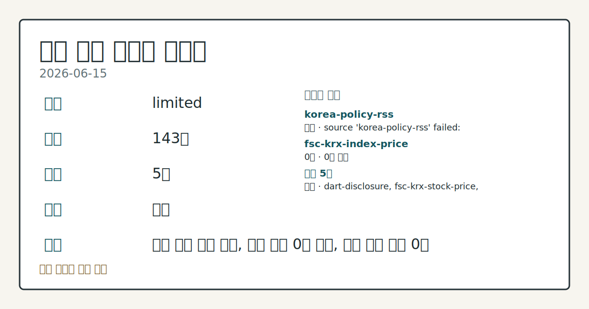
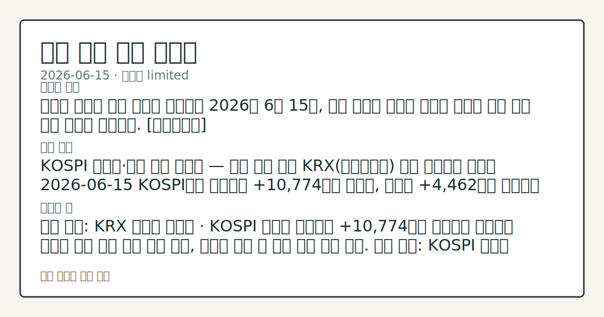

# 2026-06-15 국내 증시 시황
**기준 시각**: 2026-06-15 KST · 2026-06-14T15:00Z, 2026-06-15T15:00Z)
| 종목 | 종가 | 변동 | 비고 |
|------|------|------|------|
| ^KOSPI | 281.00 | — | — |
| ^KOSDAQ | 476.00 | — | — |
**세그먼트**: [국내 증시](2026-06-15.md) | [미국 증시](../../../us-equity/2026/06/2026-06-15.md) | [크립토](../../../crypto/2026/06/2026-06-15.md)

*이미지: 데이터 신뢰도 · 출처: investo 자체 생성 · 생성: investo 0.1.0 · 2026-06-16 UTC*
> **내 관심 자산 영향**: 데이터 수집 부족으로 매칭 판단 보류 — 추가 수집 후 재평가됩니다.
> **오늘의 결론**: 미국과 이란의 종전 합의가 공식화된 2026년 6월 15일, 국내 증시는 지정학 리스크 해소에 따른 안도 상승 흐름을 나타냈다. [데이터부족]
> **핵심 동인**: KOSPI 외국인·기관 동반 순매수 — 수급 주도 확인 KRX(한국거래소) 수급 데이터에 따르면 2026-06-15 KOSPI에서 외국인이 +10,774억원 순매수, 기관이 +4,462억원 순매수를 기록했다.
> **주의할 점**: 확인 소스: KRX 외국인 순매수 · KOSPI 외국인 순매수가 +10,774억원 기준선을 상회하면 외국인 주도 랠리 지속 추세 관찰, 순매도 전환 시 수급...
> **데이터 상태**: 제한 · 본문 사용 미집계 · 실패 1 · 0건 1

수집/품질 진단

> **데이터 상태**: 제한 — 수집 143건 / 소스 5개 / 누락: 없음 · 제한 — 핵심 가격 소스 0건/실패/stale, 본문 결론 신뢰도 낮음
> **소스 카운트**: 수집 대상 7 / 성공 5 / 0건 1 / 실패 1 / 본문 사용 미집계
> **소스 등급 분포**: S=2 / A=1 / B=2
> **상세 사유**: 일부 소스 수집 실패, 일부 소스 0건 반환, 핵심 가격 소스 0건
> **소스별 상태**: korea-policy-rss 실패 (일시적 수집 오류), fsc-krx-index-price 0건, 정상 5개

> 정보 제공용 자동 시황이며 매매 권유가 아닙니다.
## 한눈에 보기
삼성전자[005930] **+7.86%**, NAVER[035420] **+10.27%** 등 KOSPI(코스피) 대형주 전반 강세 — 미-이란 종전 합의 확정 후 지정학 리스크 해소 흐름 관찰
KOSPI 외국인이 **+10,774억원** 순매수, 기관도 **+4,462억원** 가세 — 양방향 수급 집중 확인
국고채 3년물 금리 연 **3.744%**로 하락 — 채권·주식 동반 안도 흐름, §④ 참조
## ⓪ 오늘의 매크로
**미 국채 수익률** — UST curve 2026-06-15: 10Y 4.47%, 2Y10Y +0.40pp
## ⓪-B 채널 기준선
| 기준선 | 값 |
|------|------|
| 코스피 | 281.00 (—) |
| 코스닥 | 476.00 (—) |
| 원/달러 | 미수집 |
> **크로스마켓 연결 고리**: 금리 이벤트가 할인율/달러 경로의 공통 변수로 남아 있습니다.
> **오늘의 큰 그림:** 금리와 달러 변수가 국내·미국·가상자산에 동시에 걸리며, 오늘 독자는 금리·달러 민감도을 먼저 확인해야 합니다.
## ① 요약

*이미지: 시장 스냅샷 · 출처: investo 자체 생성 · 생성: investo 0.1.0 · 2026-06-16 UTC*

미국과 이란의 종전 합의가 공식화된 2026년 6월 15일, 국내 증시는 지정학 리스크 해소에 따른 안도 상승 흐름을 나타냈다. 코스피·코스닥 지수 종가는 이번 데이터 수집에 직접 포함되지 않았으나, 삼성전자[005930] **+7.86%**, NAVER[035420] **+10.27%**, 셀트리온[068270] **+4.09%** 등 대형주의 강한 상승이 확인된다. 원/달러 환율 데이터 미수집. 2026-06-12 종전 기대감에 코스피가 **+4.6%** 급등한 흐름에 이어, 오늘은 합의 확정으로 KOSPI 외국인이 **+10,774억원** 순매수하며 수급 주도권을 이어갔다. [상승 관찰]

## ② 전일 핵심 이슈

### KOSPI 외국인·기관 동반 순매수 — 수급 주도 확인

[KRX(한국거래소) 수급 데이터](https://finance.naver.com/sise/investorDealTrendDay.naver?bizdate=20260615&sosok=01)에 따르면 2026-06-15 KOSPI에서 외국인이 **+10,774억원** 순매수, 기관이 **+4,462억원** 순매수를 기록했다. 반면 개인은 **-15,124억원** 순매도로 차익 흐름을 보였다. 2026-06-12에 외국인이 25거래일 만에 순매수로 전환한 데 이어 오늘도 대규모 순매수가 지속되었다는 점에서, 기대감 선반영에서 합의 확정 이후 수급 지속으로의 전환이 관찰된다.

> **그래서 의미는?** 외국인·기관이 코스피를 대규모로 동시 순매수하는 동안 개인이 물량을 공급하는 구도 — 외국인 주도 랠리의 전형적 수급 패턴으로 확인된다.

### 미-이란 종전 합의 — 국내 시장 촉매

[연합뉴스](https://www.yna.co.kr/view/AKR20260615072451008)에 따르면 미국과 이스라엘의 선제공격으로 시작된 이란과의 전쟁이 106일 만에 사실상 종료되면서 글로벌 주식시장이 안도 랠리를 나타냈다. 지정학 위험 해소라는 글로벌 이벤트가 국내 증시에서는 KOSPI 외국인 대규모 순매수로 직접 연결된 흐름이 확인된다.

### 뉴욕증시 상승 출발 — 국내 개장 선행 신호

[연합뉴스](https://www.yna.co.kr/view/AKR20260615169700009)에 따르면 미-이란 종전 합의를 계기로 뉴욕증시 3대 지수가 상승 출발했다. 이 선행 흐름이 국내 개장 시 투자자 심리에 긍정적 기반을 제공했으며, 삼성전자·SK하이닉스[000660] 등 반도체 대형주 상승과 맞물리는 코스피 연관 흐름으로 관찰된다.

## ③ 섹터/수급 동향

### KOSPI 수급 — 외국인·기관 쌍끌이

[KOSPI 투자자별 순매수](https://finance.naver.com/sise/investorDealTrendDay.naver?bizdate=20260615&sosok=01): 외국인 **+10,774억원**, 기관 **+4,462억원** 순매수, 개인 **-15,124억원** 순매도. 개인의 대규모 순매도는 기관·외국인 주도 랠리 국면에서 나타나는 차익 공급 흐름으로 관찰된다.

> **그래서 의미는?** 코스피에서 외국인·기관이 동시 대규모 순매수에 나선 날, 수급 주도권이 외국인과 기관에 있음이 선명히 드러났다.

### KOSDAQ 수급 — 개인·기관 매수 / 외국인 이탈

[KOSDAQ 투자자별 동향](https://finance.naver.com/sise/investorDealTrendDay.naver?bizdate=20260615&sosok=02): 개인 **+6,162억원**, 기관 **+2,166억원** 순매수 대비 외국인 **-8,164억원** 순매도. KOSPI에서 외국인이 대거 매수한 것과 달리, KOSDAQ에서는 외국인이 이탈하고 국내 투자자가 받아가는 역방향 수급 구도가 관찰된다.

### 반도체·인터넷·바이오·자동차 섹터

삼성전자[005930] **+7.86%**, SK하이닉스[000660] **+2.33%**로 반도체 섹터 강세가 확인된다. NAVER[035420] **+10.27%** 급등은 인터넷 플랫폼 섹터의 두드러진 상승을 나타냈다. 셀트리온[068270] **+4.09%**, 현대차[005380] **+1.68%** 등 바이오·자동차도 상승 흐름에 참여했다.

### 우주항공 ETF(상장지수펀드) 동향

[연합뉴스](https://www.yna.co.kr/view/AKR20260615136300008)에 따르면 SpaceX 상장 이후 시장 관심이 ETF에서 개별 종목으로 분산되면서 우주항공 관련 ETF 주가 대부분이 급락했다. 국내 관련 ETF 수급 동향은 추가 확인이 필요한 항목으로 기록된다.

## ④ 지표·이벤트

### 국고채 금리 일제 하락 — 3년물 연 **3.744%**

[연합뉴스](https://www.yna.co.kr/view/AKR20260615140951008)에 따르면 미-이란 종전 합의 여파로 2026-06-15 국고채 금리가 일제히 하락했으며, 3년물은 연 **3.744%**를 기록했다. 지정학 리스크 완화 국면에서 채권 안도 매수(금리 하락 = 채권 가격 상승)가 주식시장 상승과 동시에 확인되는 흐름이다.

> **그래서 의미는?** 국고채 금리 하락은 안전자산 선호 완화의 신호로, 주식시장 상승 분위기와 방향이 일치하는 흐름으로 확인된다.

### 코스닥 신규 상장 파이프라인

[연합뉴스](https://www.yna.co.kr/view/AKR20260615152500008)에 따르면 제이앤티지 등 6개사가 코스닥 상장예비심사 신청서를 접수했다. 신규 상장 파이프라인 확장은 향후 코스닥 수급 분산 여부와 함께 점검할 항목으로 기록된다.

## ⑤ 주요 종목

### 가격 동향 확인

| 종목 | 종가 | 등락 |
|------|------|------|
| NAVER[035420] | 247,000원 | **+10.27%** (+23,000) |
| 삼성전자[005930] | 322,500원 | **+7.86%** (+23,500) |
| 셀트리온[068270] | 173,000원 | **+4.09%** (+6,800) |
| SK하이닉스[000660] | 2,150,000원 | **+2.33%** (+49,000) |
| 현대차[005380] | 607,000원 | **+1.68%** (+10,000) |

> **그래서 의미는?** NAVER(네이버), 삼성전자, 셀트리온 등 대형주가 동반 상승하며 인터넷·반도체·바이오·자동차 전 업종에서 안도 흐름이 확인된다.

### 공시·이벤트 체크리스트

- **에이루트[096690]**: 운영자금 조달 목적으로 [30억원](https://www.yna.co.kr/view/AKR20260615152100008) 및 [20억원](https://www.yna.co.kr/view/AKR20260615151500008) 제3자배정 유상증자(신주 발행) 공시 — 신주 물량 희석 규모 점검.
- **아시아나항공 / 에어부산[298690]**: [1,000억원 영구전환사채](https://www.yna.co.kr/view/AKR20260615137251008) 주식 전환 결정 — 에어부산 재무구조 개선 목적.
- **케이씨텍[281820]**: 애프터마켓 10%대 [급등 확인](https://www.yna.co.kr/view/AKR20260615151300008).
- **인탑스[049070]**: 애프터마켓 10%대 [급등 확인](https://www.yna.co.kr/view/AKR20260615138900008).
- **알지노믹스[476830]**: 보통주 1주당 1.0주 [무상증자 결정](https://www.yna.co.kr/view/AKR20260615143100008).
- **콘텐트리중앙[036420]**: 법원 회생 절차 개시 신청 중 증권사 투자의견 흐름 [확인 필요](https://www.yna.co.kr/view/AKR20260615147800008).

## ⑥ 오늘의 관전 포인트

#### 관찰 신호: KOSPI 외국인 순매수

- 출처: KRX 외국인 순매수
- 현재: 확인 소스: KRX 외국인 순매수 · KOSPI 외국인 순매수가 **+10,774억원** 기준선을 상회하면 외국인 주도 랠리 지속 추세 관찰, 순매도 전환 시 수급 이완 흐름 점검. 관심 영향: KOSPI 대형주 방향성 추세 확인.
- 확인 조건: 상방 KOSPI 외국인 순매수가 **+10,774억원** 기준선을 상회하면 외국인 주도 랠리 지속 추세 관찰, 순매도 전환 시 수급 이완 흐름 점검; 하방 하방 데이터 부족
- 신뢰도: 보통
- 관심 영향: 관심 영향: KOSPI 대형주 방향성 추세 확인.

#### 관찰 신호: 코스닥 외국인 순매도 **-8,164억원** 규모

- 출처: KRX KOSDAQ 외국인 동향
- 현재: 확인 소스: KRX KOSDAQ 외국인 동향 · 코스닥 외국인 순매도 **-8,164억원** 규모가 축소되면 성장주 반등 가능성 흐름 관찰, 규모 심화 시 코스닥 개인·기관 매수 지속성 점검. 관심 영향: 코스닥 수급 주체 변화 비교.
- 확인 조건: 상방 상방 데이터 부족; 하방 하방 데이터 부족
- 신뢰도: 보통
- 관심 영향: 관심 영향: 코스닥 수급 주체 변화 비교.

#### 관찰 신호: 삼성전자[005930] 종

- 출처: KRX 종가
- 현재: 확인 소스: KRX 종가 · 삼성전자[005930] 종가 **322,500원** 기준, 고가 **339,000원** 재돌파 시 반도체 섹터 추가 상승 압력 추세 관찰, 시가 **326,000원** 하단 이탈 시 단기 되돌림 흐름 점검. 관심 영향: SK하이닉스 연동 반도체 섹터 흐름 비교.
- 확인 조건: 상방 삼성전자[005930] 종가 **322,500원** 기준, 고가 **339,000원** 재돌파 시 반도체 섹터 추가 상승 압력 추세 관찰, 시가 **326,000원** 하단 이탈 시 단기 되돌림 흐름 점검; 하방 삼성전자[005930] 종가 **322,500원** 기준, 고가 **339,000원** 재돌파 시 반도체 섹터 추가 상승 압력 추세 관찰, 시가 **326,000원** 하단 이탈 시 단기 되돌림 흐름 점검
- 신뢰도: 높음
- 관심 영향: 관심 영향: SK하이닉스 연동 반도체 섹터 흐름 비교.

#### 관찰 신호: NAVER[035420] 종

- 출처: KRX 종가
- 현재: 확인 소스: KRX 종가 · NAVER[035420] 종가 **247,000원** 기준, 고가 **263,000원** 재상회 시 인터넷 플랫폼 상방 모멘텀 추세 관찰, 시가 **232,000원** 하단 이탈 시 단기 되돌림 흐름 점검. 관심 영향: 플랫폼 섹터 수급 동향 확인.
- 확인 조건: 상방 NAVER[035420] 종가 **247,000원** 기준, 고가 **263,000원** 재상회 시 인터넷 플랫폼 상방 모멘텀 추세 관찰, 시가 **232,000원** 하단 이탈 시 단기 되돌림 흐름 점검; 하방 NAVER[035420] 종가 **247,000원** 기준, 고가 **263,000원** 재상회 시 인터넷 플랫폼 상방 모멘텀 추세 관찰, 시가 **232,000원** 하단 이탈 시 단기 되돌림 흐름 점검
- 신뢰도: 높음
- 관심 영향: 관심 영향: 플랫폼 섹터 수급 동향 확인.

#### 관찰 신호: 국고채 3년물 **3.744%** 기준, 추

- 출처: 채권시장(연합뉴스)
- 현재: 확인 소스: 채권시장(연합뉴스) · 국고채 3년물 **3.744%** 기준, 추가 하락 시 위험 선호 지속 흐름 관찰, 금리 반등 시 채권·주식 간 자금 이동 재평가 여지. 관심 영향: 안도 랠리 지속성 점검.
- 확인 조건: 상방 상방 데이터 부족; 하방 하방 데이터 부족
- 신뢰도: 높음
- 관심 영향: 관심 영향: 안도 랠리 지속성 점검.
## ⑦ 면책조항
본 시황은 일반 정보 제공을 목적으로 자동 생성된 자료이며,
특정 종목·자산에 대한 매매 권유나 투자 자문이 아닙니다.
투자 결정과 그 결과에 대한 책임은 전적으로 본인에게 있으며,
본 시황의 내용에 따라 발생한 손실에 대해 작성자는 일체의 책임을 지지 않습니다.