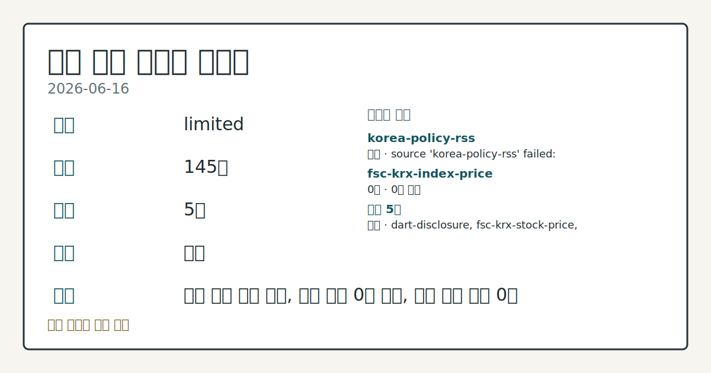
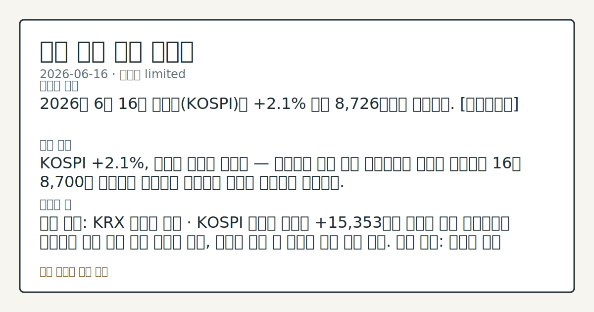

# 2026-06-16 국내 증시 시황
**기준 시각**: 2026-06-16 KST · 2026-06-15T15:00Z, 2026-06-16T15:00Z)
| 종목 | 종가 | 변동 | 비고 |
|------|------|------|------|
| ^KOSPI | 180.62 | — | — |
| ^KOSDAQ | 484.00 | — | — |
**세그먼트**: [국내 증시](2026-06-16.md) | [미국 증시](../../../us-equity/2026/06/2026-06-16.md) | [크립토](../../../crypto/2026/06/2026-06-16.md)

*이미지: 데이터 신뢰도 · 출처: investo 자체 생성 · 생성: investo 0.1.0 · 2026-06-17 UTC*
> **내 관심 자산 영향**: 데이터 수집 부족으로 매칭 판단 보류 — 추가 수집 후 재평가됩니다.
> **오늘의 결론**: 2026년 6월 16일 코스피(KOSPI)는 **+2.1%** 올라 8,726선에서 마감했다. [데이터부족]
> **핵심 동인**: KOSPI **+2.1%**, 외국인 사흘째 순매수 — 상승탄력 둔화 병존 연합뉴스에 따르면 코스피가 16일 8,700선 초반에서 마감하며 외국인이 사흘째 순매수를 이어갔다.
> **주의할 점**: 확인 소스: KRX 외국인 수급 · KOSPI 외국인 순매수 +15,353억원 기조가 다음 거래일에도 유지되면 수급 상방 압력 지속을 관찰, 순매도 전환 시...
> **데이터 상태**: 제한 · 본문 사용 미집계 · 실패 1 · 0건 1

수집/품질 진단

> **데이터 상태**: 제한 — 수집 145건 / 소스 5개 / 누락: 없음 · 제한 — 핵심 가격 소스 0건/실패/stale, 본문 결론 신뢰도 낮음
> **소스 카운트**: 수집 대상 7 / 성공 5 / 0건 1 / 실패 1 / 본문 사용 미집계
> **소스 등급 분포**: S=2 / A=1 / B=2
> **상세 사유**: 일부 소스 수집 실패, 일부 소스 0건 반환, 핵심 가격 소스 0건
> **소스별 상태**: korea-policy-rss 실패 (수집 불가), fsc-krx-index-price 0건, 정상 5개

> 정보 제공용 자동 시황이며 매매 권유가 아닙니다.
## 한눈에 보기
KOSPI **+2.1%** 상승해 8,726선 마감 — 외국인 사흘 연속 순매수 기조 유지
SK하이닉스[000660] **+6.42%** (종가 2,288,000원), 삼성전자[005930] **+4.50%** (337,000원) — 반도체 대형주 동반 강세
국고채(국내 정부 채권) 3년물 연 **3.717%** 혼조세 — BOJ(일본은행) 금리 인상과 FOMC(연방공개시장위원회) 대기 속 채권 방향감 부재 확인
## ⓪ 오늘의 매크로
**FOMC 일정** — 2026-06-17 — FOMC Meeting
**미 국채 수익률** — UST curve 2026-06-16: 10Y 4.43%, 2Y10Y +0.38pp
## ⓪-B 채널 기준선
| 기준선 | 값 |
|------|------|
| 코스피 | 180.62 (—) |
| 코스닥 | 484.00 (—) |
| 원/달러 | 미수집 |
> **크로스마켓 연결 고리**: 금리 이벤트가 할인율/달러 경로의 공통 변수로 남아 있습니다.
> **오늘의 큰 그림:** 금리와 달러 변수가 국내·미국에 동시에 걸리며, 오늘 독자는 금리·달러 민감도을 먼저 확인해야 합니다.
## ① 요약

*이미지: 시장 스냅샷 · 출처: investo 자체 생성 · 생성: investo 0.1.0 · 2026-06-17 UTC*

2026년 6월 16일 코스피는 **+2.1%** 올라 8,726선에서 마감했다. 외국인이 사흘 연속 순매수를 이어가고 기관도 KOSPI에서 순매수로 대응하면서 지수를 지지했다. 반도체 대형주인 삼성전자[005930]와 SK하이닉스[000660]가 각각 **+4.50%**, **+6.42%** 상승했고, 현대차[005380]도 **+6.59%** 강세를 보이며 자동차 섹터가 반도체와 함께 장세를 견인했다. 코스닥(KOSDAQ)에서는 개인 순매수가 집중됐으나 기관·외국인이 동반 이탈해 지수별 수급 구조가 엇갈렸다. 원/달러 환율 데이터는 이번 세그먼트에서 수집되지 않아 별도 확인이 필요하다. [상승 관찰]

## ② 전일 핵심 이슈

### KOSPI **+2.1%**, 외국인 사흘째 순매수 — 상승탄력 둔화 병존

[연합뉴스](https://www.yna.co.kr/view/AKR20260616134200008)에 따르면 코스피가 16일 8,700선 초반에서 마감하며 외국인이 사흘째 순매수를 이어갔다. 직전일(2026-06-15) 외국인·기관 동반 순매수로 확인된 지정학 위험 완화 수급 흐름이 이날도 연장됐다. 다만 연합뉴스는 "상승탄력 다소 둔화"라고 표현해 모멘텀 지속 여부를 관찰할 시점임을 시사했다.

> **그래서 의미는?** 외국인 3거래일 연속 순매수는 미국·이란 종전 이후 외국인 복귀 흐름의 연속성이 단기에 그치지 않는지 점검할 수 있는 관찰 근거다.

### 금융 리스크 — 중앙그룹 신용공여·은행권 빚투 규제 강화

[연합뉴스](https://www.yna.co.kr/view/AKR20260616110551008)에 따르면 JTBC(제이티비씨) 등 중앙그룹 계열사 5곳의 금융권 신용공여(대출·보증 등 익스포저) 규모가 약 8천억원으로 파악됐으며 회생 절차가 진행 중이다. 아울러 [농협은행은 신용대출 한도를 1억원으로 제한](https://www.yna.co.kr/view/AKR20260616140000002)해 증시 호조 국면의 '빚투(빚내서 투자)' 급증세에 대응했다. 지수 상승 이면에서 신용 위험과 레버리지(차입 투자) 급증을 동시에 관리하는 흐름이 확인된다.

### FOMC 대기 — 뉴욕 증시 상승 출발, 국내 수급 연동 관찰

[연합뉴스 인포맥스](https://www.yna.co.kr/view/AKR20260616169700009)에 따르면 뉴욕 3대 주가지수는 케빈 워시 연방준비제도(Fed·연준) 의장의 첫 FOMC 회의 결과를 앞두고 상승 출발했다. 미국 증시의 FOMC 대기 구간이 국내 외국인 수급과 채권 시장 방향에 어떻게 연동될지 추가 관찰이 필요한 시점이다.

## ③ 섹터/수급 동향

### KOSPI 수급 — 외국인·기관 동반 순매수, 개인 대규모 순매도

[KRX(한국거래소) 투자자별 매매 동향](https://finance.naver.com/sise/investorDealTrendDay.naver?bizdate=20260616&sosok=01)에 따르면 2026년 6월 16일 KOSPI에서 외국인은 **+15,353억원** 순매수, 기관은 **+7,076억원** 순매수를 기록했다. 반면 개인은 **-21,841억원** 순매도로 대규모 차익 확정 흐름이 나타났으며 기타도 **-588억원** 순매도였다.

> **그래서 의미는?** 외국인·기관의 동반 순매수를 개인이 대규모 순매도로 받아내는 수급 구조가 관찰되며, 이 구도의 지속 여부가 단기 지수 방향의 핵심 관찰...

### KOSDAQ 수급 — 개인 집중 순매수, 기관·외국인 이탈

[KOSDAQ 투자자별 매매 동향](https://finance.naver.com/sise/investorDealTrendDay.naver?bizdate=20260616&sosok=02)에서는 개인이 **+7,907억원** 순매수한 반면, 기관 **-4,630억원**, 외국인 **-3,095억원**, 기타 **-183억원** 순매도로 기관·외국인이 동반 이탈했다. KOSPI와 달리 KOSDAQ에서는 개인이 유일한 매수 주체였다.

### 반도체 섹터 흐름

SK하이닉스[000660]가 **+6.42%** 상승한 2,288,000원, 삼성전자[005930]가 **+4.50%** 오른 337,000원에 마감하며 반도체 섹터가 KOSPI 상승을 주도했다. [연합뉴스](https://www.yna.co.kr/view/AKR20260616112651008)에 따르면 SK그룹 시가총액이 SK하이닉스 주가 상승에 힘입어 2천조원을 돌파했다. 일본 낸드플래시(NAND Flash) 기업 키옥시아의 주가 급등으로 글로벌 반도체 업황 기대감이 높아진 흐름도 국내 반도체 종목 005930·000660 수급에 긍정적 배경 요인으로 확인된다.

### BOJ 금리 인상 — 채권 시장 배경 흐름

[연합뉴스](https://www.yna.co.kr/view/AKR20260615167952073)에 따르면 일본은행(BOJ)이 6개월 만에 기준금리를 인상해 31년 만에 1%대 금리 수준에 접근했다. 국내 국고채 3년물 혼조세와 맞물리는 대외 배경 요인으로, 엔화 방향 변화가 코스피 연관 수출 섹터(자동차·반도체)에 미치는 환율 경로를 살펴볼 필요가 있다.

## ④ 지표·이벤트

### 국고채 금리 혼조세 — 3년물 연 **3.717%**

[연합뉴스](https://www.yna.co.kr/view/AKR20260616139551008)에 따르면 국내 국고채 금리가 16일 혼조세로 마감했으며 3년물은 연 **3.717%**를 기록했다. 미국·이란 종전 이후 하락세를 이어오던 국고채 금리가 이날 방향감을 잃고 숨 고르기에 들어간 것으로 확인된다.

> **그래서 의미는?** 국고채 3년물 금리 혼조세는 BOJ 금리 인상과 FOMC 대기라는 두 대외 이벤트가 겹치면서 채권 시장의 방향 탐색이 진행 중임을 보여 준다.

### 코스닥 세그먼트 자문단 구성

[한국거래소(KRX)는 '코스닥 세그먼트 자문단'을 구성하고 첫 회의를 개최](https://www.yna.co.kr/view/AKR20260616152100008)했다. 코스닥 종목 분류 및 승강제(등급 이동 제도) 도입을 위한 제도 기반 마련 절차로, 중장기 코스닥 시장 구조 변화를 관찰하는 제도 이벤트다.

## ⑤ 주요 종목

### 확인 항목

| 종목 | 종가 | 등락 |
|------|------|------|
| SK하이닉스[000660] | 2,288,000원 | **+6.42%** (+138,000) |
| 현대차[005380] | 647,000원 | **+6.59%** (+40,000) |
| 삼성전자[005930] | 337,000원 | **+4.50%** (+14,500) |
| 셀트리온[068270] | 175,000원 | **+1.16%** (+2,000) |
| NAVER[035420] | 248,000원 | **+0.40%** (+1,000) |

> **그래서 의미는?** SK하이닉스(반도체)·현대차(자동차)·삼성전자(반도체)가 **+6%**대 이상 상승을 기록하며 대형주 중심의 수급 집중이 관찰된다...

### 관전 항목

- 레인보우로보틱스[277810]: 삼성전자[005930] 로봇 자회사, 장중 약 7% 급락 마감 — [연합뉴스](https://www.yna.co.kr/view/AKR20260616118251008) 보도, 이유 확인 항목
- 한화에어로스페이스[012450]: 한국항공우주산업 지분 약 10%로 확대, 약 5천억원 규모 추가 취득 — [연합뉴스](https://www.yna.co.kr/view/AKR20260616142000008)
- 삼양컴텍[484590]: 애프터마켓 10%대 급등 — 다음 거래일 정규장 흐름 체크
- 한양증권[001750]: 애프터마켓 10%대 급락 — [연합뉴스](https://www.yna.co.kr/view/AKR20260616159700008), 원인 확인 항목
- 가온전선: 무상증자(주당 0.8주), 17일 오전 9시까지 거래 정지 — [연합뉴스](https://www.yna.co.kr/view/AKR20260616129751008)

## ⑥ 오늘의 관전 포인트

#### 관찰 신호: 확인 소스: KRX 외국인 수급 · KOSPI 외국인…

- 출처: 확인 소스 미상
- 현재: 확인 소스: KRX 외국인 수급 · KOSPI 외국인 순매수 **+15,353억원** 기조가 다음 거래일에도 유지되면 수급 상방 압력 지속을 관찰, 순매도 전환 시 외국인 이탈 흐름 점검. 관심 영향: 코스피 수급 구조 연속성 흐름 확인.
- 확인 조건: 상방 KOSPI 외국인 순매수 **+15,353억원** 기조가 다음 거래일에도 유지되면 수급 상방 압력 지속을 관찰, 순매도 전환 시 외국인 이탈 흐름 점검; 하방 KOSPI 외국인 순매수 **+15,353억원** 기조가 다음 거래일에도 유지되면 수급 상방 압력 지속을 관찰, 순매도 전환 시 외국인 이탈 흐름 점검
- 신뢰도: 보통
- 관심 영향: 관심 영향: 코스피 수급 구조 연속성 흐름 확인.

#### 관찰 신호: FOMC

- 출처: 확인 소스 미상
- 현재: 확인 소스: 연합뉴스 · FOMC · 케빈 워시 연준 의장 첫 FOMC 결과가 금리 동결·중립 어조이면 국내 외국인 순매수 환경 유지를 관찰, 예상 외 긴축 발언 시 채권·환율 경로를 통한 코스피 수급 영향 점검. 관심 영향: 외국인 수급 및 국내 채권 금리 방향 추세 확인.
- 확인 조건: 상방 상방 데이터 부족; 하방 하방 데이터 부족
- 신뢰도: 보통
- 관심 영향: 관심 영향: 외국인 수급 및 국내 채권 금리 방향 추세 확인.

#### 관찰 신호: 확인 소스: FSC/KRX 종목 데이터 · SK하이닉스…

- 출처: 확인 소스 미상
- 현재: 확인 소스: FSC/KRX 종목 데이터 · SK하이닉스[000660] 종가 2,288,000원이 당일 고가 2,322,000원을 상회하면 반도체 섹터 추세 연장 관찰, 당일 저가 2,265,000원을 이탈하면 단기 조정 여부 점검. 관심 영향: KOSPI 주도 섹터 흐름 비교.
- 확인 조건: 상방 SK하이닉스[000660] 종가 2,288,000원이 당일 고가 2,322,000원을 상회하면 반도체 섹터 추세 연장 관찰, 당일 저가 2,265,000원을 이탈하면 단기 조정 여부 점검; 하방 SK하이닉스[000660] 종가 2,288,000원이 당일 고가 2,322,000원을 상회하면 반도체 섹터 추세 연장 관찰, 당일 저가 2,265,000원을 이탈하면 단기 조정 여부 점검
- 신뢰도: 높음
- 관심 영향: 관심 영향: KOSPI 주도 섹터 흐름 비교.

#### 관찰 신호: 중앙그룹 신용공여

- 출처: 확인 소스 미상
- 현재: 확인 소스: 연합뉴스 · 중앙그룹 신용공여 · 중앙그룹 5개사 8천억원 회생 절차가 금융권 추가 손실 인식 없이 관리되면 시장 영향 제한적 해석, 신용공여 손실 확대 보도 시 금융 섹터 코스피 연관 영향 흐름 관찰.
- 확인 조건: 상방 상방 데이터 부족; 하방 하방 데이터 부족
- 신뢰도: 보통
- 관심 영향: 중앙그룹 5개사 8천억원 회생 절차가 금융권 추가 손실 인식 없이 관리되면 시장 영향 제한적 해석, 신용공여 손실 확대 보도 시 금융 섹터 코스피 연관 영향 흐름 관찰.

#### 관찰 신호: 확인 소스: KRX KOSDAQ 수급 · KOSDAQ…

- 출처: 확인 소스 미상
- 현재: 확인 소스: KRX KOSDAQ 수급 · KOSDAQ 개인 순매수 **+7,907억원** 기조가 기관·외국인 복귀 없이 지속되면 수급 불균형 심화 여부를 관찰, 기관 순매도 **-4,630억원** 규모가 확대되면 코스닥 단기 약세 흐름 점검. 관심 영향: 코스닥 투자자별 수급 흐름 비교.
- 확인 조건: 상방 상방 데이터 부족; 하방 하방 데이터 부족
- 신뢰도: 보통
- 관심 영향: 관심 영향: 코스닥 투자자별 수급 흐름 비교.
## ⑦ 면책조항
본 시황은 일반 정보 제공을 목적으로 자동 생성된 자료이며,
특정 종목·자산에 대한 매매 권유나 투자 자문이 아닙니다.
투자 결정과 그 결과에 대한 책임은 전적으로 본인에게 있으며,
본 시황의 내용에 따라 발생한 손실에 대해 작성자는 일체의 책임을 지지 않습니다.