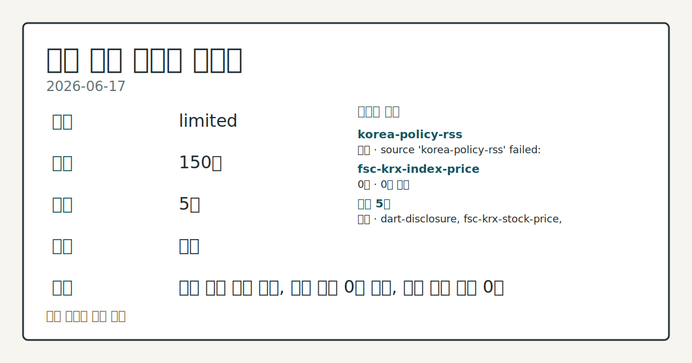
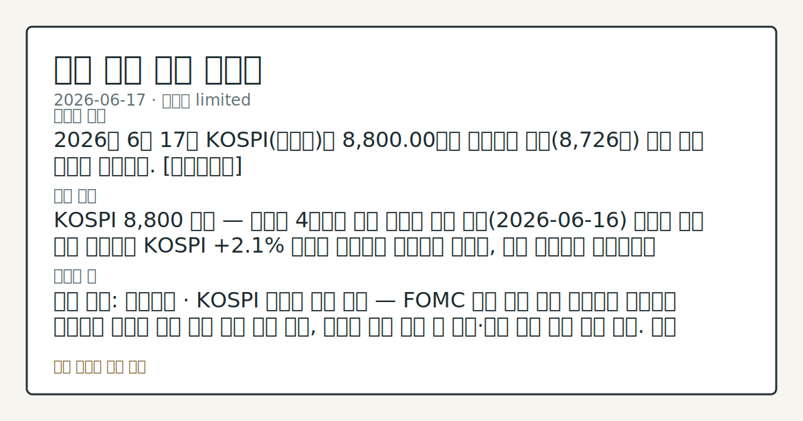

# 2026-06-17 국내 증시 시황
**기준 시각**: 2026-06-17 KST · 2026-06-16T15:00Z, 2026-06-17T15:00Z)
| 종목 | 종가 | 변동 | 비고 |
|------|------|------|------|
| ^KOSPI | 8,800.00 | — | — |
| ^KOSDAQ | 413.00 | — | — |
**세그먼트**: [국내 증시](2026-06-17.md) | [미국 증시](../../../us-equity/2026/06/2026-06-17.md) | [크립토](../../../crypto/2026/06/2026-06-17.md)

*이미지: 데이터 신뢰도 · 출처: investo 자체 생성 · 생성: investo 0.1.0 · 2026-06-18 UTC*
> **내 관심 자산 영향**: 데이터 수집 부족으로 매칭 판단 보류 — 추가 수집 후 재평가됩니다.
> **오늘의 결론**: 2026년 6월 17일 KOSPI(코스피)는 8,800.00으로 마감하며 전일(8,726선) 대비 상승 흐름을 이어갔다. [데이터부족]
> **핵심 동인**: KOSPI 8,800 마감 — 외국인 4거래일 만에 순매도 전환 전일(2026-06-16) 외국인 사흘 연속 순매수로 KOSPI **+2.1%** 상승이 이어졌던 흐름에서 이탈해, 이날 외국인은 코스피에서 -9,952억원 순매도로 전환했다.
> **주의할 점**: 확인 소스: 연합뉴스 · KOSPI 외국인 수급 기준 — FOMC 결과 발표 이후 외국인이 순매수로 복귀하면 코스피 상방 수급 압력 흐름 관찰, 순매도 기조...
> **데이터 상태**: 제한 · 본문 사용 미집계 · 실패 1 · 0건 1

수집/품질 진단

> **데이터 상태**: 제한 — 수집 150건 / 소스 5개 / 누락: 없음 · 제한 — 핵심 가격 소스 0건/실패/stale, 본문 결론 신뢰도 낮음
> **소스 카운트**: 수집 대상 7 / 성공 5 / 0건 1 / 실패 1 / 본문 사용 미집계
> **소스 등급 분포**: S=2 / A=1 / B=2
> **상세 사유**: 일부 소스 수집 실패, 일부 소스 0건 반환, 핵심 가격 소스 0건
> **소스별 상태**: korea-policy-rss 실패 (일시적 수집 오류), fsc-krx-index-price 0건, 정상 5개

> 정보 제공용 자동 시황이며 매매 권유가 아닙니다.
## 한눈에 보기
2026년 6월 17일 KOSPI는 8,800.00으로 마감하며 전일 대비 상승 흐름을 이어갔다. [데이터부족]
KOSPI 8,800 마감 — 외국인 4거래일 만에 순매도 전환 전일 외국인 사흘 연속 순매수로 KOSPI **+2.1%** 상승이 이어졌던 흐름에서 이탈해, 이날 외국인은 코스피에서 -9,952억원 순매도로 전환했다.
확인 소스: 연합뉴스 · KOSPI 외국인 수급 기준 — FOMC 결과 발표 이후 외국인이 순매수로 복귀하면 코스피 상방 수급 압력 흐름 관찰, 순매도 기조 지속 시 기관·개인 매수 버팀 강도 비교. 관심 영향: 코스피 방향성 및 수급 주체 이동 추세 점검. 확인 소스: data.go.kr · SK하이닉스[000660] 종가 2,382,000원 / 삼성전자[005930] 343,000원 기준 — 현 수준 유지 또는 상회 시 반도체 주도 상승 흐름 연장 관찰, 하회 시 섹터 모멘텀 둔화 여부 확인.
## ⓪ 오늘의 매크로
**FOMC 일정** — 2026-06-17 — FOMC Meeting
**미 국채 수익률** — UST curve 2026-06-17: 10Y 4.49%, 2Y10Y +0.29pp
## ⓪-B 채널 기준선
| 기준선 | 값 |
|------|------|
| 코스피 | 8,800.00 (—) |
| 코스닥 | 413.00 (—) |
| 원/달러 | 미수집 |
> **크로스마켓 연결 고리**: 금리 이벤트가 할인율/달러 경로의 공통 변수로 남아 있습니다.
> **오늘의 큰 그림:** 금리와 달러 변수가 국내·미국·가상자산에 동시에 걸리며, 오늘 독자는 금리·달러 민감도을 먼저 확인해야 합니다.
## ① 요약

*이미지: 시장 스냅샷 · 출처: investo 자체 생성 · 생성: investo 0.1.0 · 2026-06-18 UTC*

2026년 6월 17일 KOSPI는 [**8,800.00**](https://www.yna.co.kr/market-plus/all)으로 마감하며 전일(8,726선) 대비 상승 흐름을 이어갔다. KOSDAQ(코스닥)은 [**413.00**](https://www.yna.co.kr/market-plus/all)으로 마감했다. 환율 데이터는 이번 수집 주기에 미수집 상태다.

반도체 대형주 SK하이닉스\[000660\](**+4.11%**)와 삼성전자\[005930\](**+1.78%**)가 지수를 끌어올렸으나, 3거래일 연속 순매수를 이어가던 외국인 투자자가 코스피에서 **-9,952**억원 순매도로 전환해 수급 불확실성이 부상했다. 기관(**+5,957**억원)·개인(**+5,254**억원)이 동반 매수로 외국인 이탈 물량을 받아내며 지수 하락을 방어했다. 케빈 워시 Fed(연방준비제도) 의장의 첫 FOMC(연방공개시장위원회)를 대기하는 뉴욕증시 분위기가 국내 투자심리에 일부 반영됐으나, 외국인 이탈이 지속 상승의 변수로 남았다. [혼재]

## ② 전일 핵심 이슈

### KOSPI 8,800 마감 — 외국인 4거래일 만에 순매도 전환

전일(2026-06-16) 외국인 사흘 연속 순매수로 KOSPI **+2.1%** 상승이 이어졌던 흐름에서 이탈해, 이날 외국인은 코스피에서 [**-9,952**억원 순매도로 전환](https://www.yna.co.kr/view/AKR20260617129700008)했다. 외국인 대규모 이탈이 수급 공백을 만들었으나 기관(**+5,957**억원)·개인의 동반 순매수가 이를 받쳐 코스피는 **8,800.00**으로 마감했다. 수급 구도의 중심이 외국인에서 국내 기관·개인으로 이동한 점이 어제와 비교해 두드러진 변화다.

> **그래서 의미는?** 외국인이 FOMC를 앞두고 코스피에서 관망성 포지션 조정에 나선 것으로 해석되며, 발표 이후 수급 방향 재확인이 필요합니다.

### 대신증권 코스피 목표 11,500 상향 — 8월말∼9월초 변곡점

[대신증권[003540]은 이날 코스피 연간 전망치를 기존 8,800에서 11,500으로 상향 조정했다](https://www.yna.co.kr/view/AKR20260617148400008). 8월말∼9월초를 변곡점으로 제시했으며, 현 코스피 수준에서 중기 상승 기대를 반영한 관측으로 확인된다.

## ③ 섹터/수급 동향

### KOSPI 수급 — 기관·개인 동반 매수, 외국인 대규모 순매도

[2026-06-17 KOSPI 수급](https://finance.naver.com/sise/investorDealTrendDay.naver?bizdate=20260617&sosok=01): 외국인 순매도 **-9,952**억원, 기관 순매수 **+5,957**억원, 개인 순매수 **+5,254**억원, 기타 순매도 **-1,259**억원. 외국인 이탈 규모가 크지만 기관·개인 동반 매수가 수급 공백을 메웠다.

> **그래서 의미는?** 기관·개인이 외국인 이탈 공백을 흡수하며 지수를 지지한 구조로, FOMC 결과 이후 외국인 복귀 여부가 지속 상승의 핵심 변수임을 재확인합니다.

### KOSDAQ 수급 — 외국인 소폭 순매수, 개인·기관 순매도

[2026-06-17 KOSDAQ 수급](https://finance.naver.com/sise/investorDealTrendDay.naver?bizdate=20260617&sosok=02): 외국인 순매수 **+400**억원, 기관 순매도 **-101**억원, 개인 순매도 **-335**억원, 기타 순매수 **+36**억원. 코스닥에서는 외국인이 소폭 순매수를 유지한 반면 개인·기관은 이탈하며 수급 구조가 혼재됐다.

### 섹터 흐름 — 반도체 강세, 방산·금융 내 희비 교차

반도체 섹터는 SK하이닉스\[000660\](**+4.11%**)와 삼성전자\[005930\](**+1.78%**)가 동반 상승하며 이날 코스피를 견인했다. [금리 인상 기조 속 금융주 내 은행·보험주는 강세를 보인 반면 증권주는 약세](https://www.yna.co.kr/view/AKR20260617104951008)로 희비가 갈렸다. [이란 종전 수혜와 캐나다 초계 잠수함 프로젝트(CPSP) 수주 기대감](https://www.yna.co.kr/view/AKR20260617061551008) 속에 한화에어로스페이스가 **+3.5%** 오르는 등 한화 그룹주가 동반 강세를 나타냈다.

## ④ 지표·이벤트

### 케빈 워시 첫 FOMC — 국내 외국인 수급의 관건

[뉴욕증시는 케빈 워시 Fed 의장의 첫 FOMC 결과를 대기하며 상승 출발했다](https://www.yna.co.kr/view/AKR20260617174900009). 코스피 외국인이 이날 대규모 순매도(**-9,952**억원)로 전환한 배경에 FOMC 대기 심리가 작용한 것으로 해석되며, 결과 발표 이후 외국인의 국내 증시 복귀 여부가 수급 방향의 핵심 변수로 확인된다.

> **그래서 의미는?** FOMC 결과가 국내 외국인 수급 재유입의 촉매가 될 수 있어, 발표 후 코스피 수급 변화를 점검할 필요가 있습니다.

### 국고채 금리 일제히 하락 — 3년물 연 **3.710%**

[미국·이란 종전 합의에 따른 국제 유가 하락으로 국고채 금리가 이날 일제히 하락했다](https://www.yna.co.kr/view/AKR20260617142251008). 3년물 국고채 금리는 연 **3.710%**로 마감했다. 유가 하락이 인플레이션 기대를 낮추며 국내 채권시장에 완화적 흐름을 만들었다.

### 금융위 저PBR 기업 리스트 — 10월 발표 예정

[금융위원회 부위원장은 저PBR(주가순자산비율) 기업 리스트를 10월 선정·발표할 예정이라고 밝혔다](https://www.yna.co.kr/view/AKR20260617094651008). 기업 M&A(인수합병) 과정에서 일반주주 권익 보호를 위한 합병가액 산정 절차 및 자발적 상장폐지 관련 정책의 일환이다.

## ⑤ 주요 종목

### 반도체 — 동반 상승

SK하이닉스[000660]: **2,382,000**원(**+4.11%**, +94,000원), 삼성전자[005930]: **343,000**원(**+1.78%**, +6,000원). 두 반도체 대형주의 동반 상승이 이날 KOSPI를 견인했다.

> **그래서 의미는?** SK하이닉스(반도체 메모리 대형주)와 삼성전자(전자·반도체 대형주)의 동반 상승은 반도체 섹터 모멘텀이 유지되고 있음을 보여주며, 외국인...

### 관전 항목

| 종목 | 종가 | 등락 |
|------|------|------|
| NAVER[035420] | 242,000원 | **-2.42%** (-6,000) |
| 현대차[005380] | 640,000원 | **-1.08%** (-7,000) |
| 셀트리온[068270] | 174,500원 | **-0.29%** (-500) |

### 확인 항목 — 애프터마켓·공시

- [한전기술[052690]](https://www.yna.co.kr/view/AKR20260617166500008): 애프터마켓에서 **10%대** 급등
- [태웅[044490]](https://www.yna.co.kr/view/AKR20260617165900008): 애프터마켓에서 **10%대** 급등
- [예스티[122640]](https://www.yna.co.kr/view/AKR20260617136600008): 애프터마켓에서 **10%대** 급등
- [미래에셋증권[006800]](https://www.yna.co.kr/view/AKR20260617156500008): **3천억원** 규모 자사주 취득 결의 (역대 최대 규모)
- [화신[010690]](https://www.yna.co.kr/view/AKR20260617047251008): 로봇 사업 접근 가능성 부각 → 52주 신고가 기록 후 **5%** 급락

## ⑥ 오늘의 관전 포인트

#### 관찰 신호: 확인 소스: 연합뉴스 · KOSPI 외국인 수급 기준…

- 출처: 확인 소스 미상
- 현재: 확인 소스: 연합뉴스 · KOSPI 외국인 수급 기준 — FOMC 결과 발표 이후 외국인이 순매수로 복귀하면 코스피 상방 수급 압력 흐름 관찰, 순매도 기조 지속 시 기관·개인 매수 버팀 강도 비교. 관심 영향: 코스피 방향성 및 수급 주체 이동 추세 점검.
- 확인 조건: 상방 KOSPI 외국인 수급 기준 — FOMC 결과 발표 이후 외국인이 순매수로 복귀하면 코스피 상방 수급 압력 흐름 관찰, 순매도 기조 지속 시 기관; 하방 하방 데이터 부족
- 신뢰도: 보통
- 관심 영향: 관심 영향: 코스피 방향성 및 수급 주체 이동 추세 점검.

#### 관찰 신호: 확인 소스: data.go.kr · SK하이닉스

- 출처: 확인 소스 미상
- 현재: 확인 소스: data.go.kr · SK하이닉스[000660] 종가 **2,382,000**원 / 삼성전자[005930] **343,000**원 기준 — 현 수준 유지 또는 상회 시 반도체 주도 상승 흐름 연장 관찰, 하회 시 섹터 모멘텀 둔화 여부 확인. 관심 영향: KOSPI 지수 기여도 변화 데이터 비교.
- 확인 조건: 상방 SK하이닉스[000660] 종가 **2,382,000**원 / 삼성전자[005930] **343,000**원 기준 — 현 수준 유지 또는 상회 시 반도체 주도 상승 흐름 연장 관찰, 하회 시 섹터 모멘텀 둔화 여부 확인; 하방 SK하이닉스[000660] 종가 **2,382,000**원 / 삼성전자[005930] **343,000**원 기준 — 현 수준 유지 또는 상회 시 반도체 주도 상승 흐름 연장 관찰, 하회 시 섹터 모멘텀 둔화 여부 확인
- 신뢰도: 낮음
- 관심 영향: 관심 영향: KOSPI 지수 기여도 변화 데이터 비교.

#### 관찰 신호: 확인 소스: 연합뉴스 · 국고채 3년물 연 **3.71…

- 출처: 확인 소스 미상
- 현재: 확인 소스: 연합뉴스 · 국고채 3년물 연 **3.710%** 기준 — 이 수준 하회 시 채권·성장주 우호 환경 지속 관찰, 상회 시 FOMC 이후 금리 재상승 압력 흐름 확인. 관심 영향: 은행·보험 vs 성장주 섹터 간 수급 흐름 점검.
- 확인 조건: 상방 성장주 우호 환경 지속 관찰, 상회 시 FOMC 이후 금리 재상승 압력 흐름 확인; 하방 국고채 3년물 연 **3.710%** 기준 — 이 수준 하회 시 채권
- 신뢰도: 높음
- 관심 영향: 관심 영향: 은행

#### 관찰 신호: 확인 소스: 연합뉴스 · 대신증권[003540] 코스피…

- 출처: 확인 소스 미상
- 현재: 확인 소스: 연합뉴스 · 대신증권[003540] 코스피 목표 11,500 / 변곡점 8월말∼9월초 기준 — 코스피가 목표 경로에 부합하는 상승세를 이어가면 중기 기대 수렴 관찰, 이탈 시 전망치 괴리 추세 살피기. 관심 영향: 중기 지수 방향성 흐름 비교.
- 확인 조건: 상방 상방 데이터 부족; 하방 대신증권[003540] 코스피 목표 11,500 / 변곡점 8월말∼9월초 기준 — 코스피가 목표 경로에 부합하는 상승세를 이어가면 중기 기대 수렴 관찰, 이탈 시 전망치 괴리 추세 살피기
- 신뢰도: 보통
- 관심 영향: 관심 영향: 중기 지수 방향성 흐름 비교.

#### 관찰 신호: 확인 소스: 연합뉴스 · 한전기술[052690]·태웅

- 출처: 확인 소스 미상
- 현재: 확인 소스: 연합뉴스 · 한전기술[052690]·태웅[044490]·예스티[122640] 애프터마켓 **10%대** 급등 기준 — 정규장 개장 후 갭 상승이 유지되면 모멘텀 이월 흐름 관찰, 갭 소멸 시 단기 매물 출회 여부 확인. 관심 영향: 코스닥 중소형주 수급 변동 관찰.
- 확인 조건: 상방 상방 데이터 부족; 하방 하방 데이터 부족
- 신뢰도: 높음
- 관심 영향: 관심 영향: 코스닥 중소형주 수급 변동 관찰.
## ⑦ 면책조항
본 시황은 일반 정보 제공을 목적으로 자동 생성된 자료이며,
특정 종목·자산에 대한 매매 권유나 투자 자문이 아닙니다.
투자 결정과 그 결과에 대한 책임은 전적으로 본인에게 있으며,
본 시황의 내용에 따라 발생한 손실에 대해 작성자는 일체의 책임을 지지 않습니다.