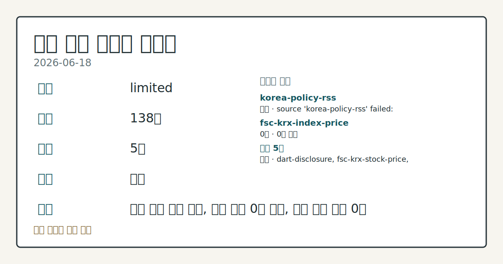
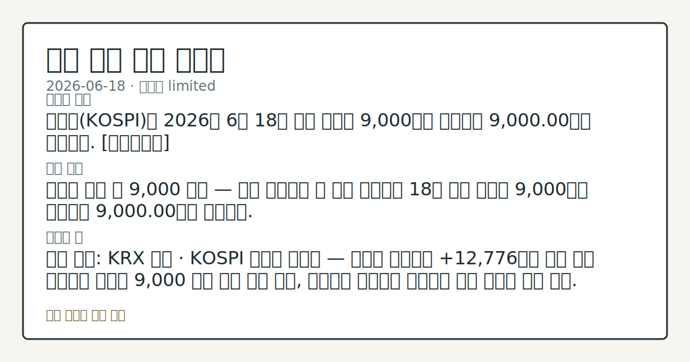

# 2026-06-18 국내 증시 시황
**기준 시각**: 2026-06-18 KST · 2026-06-17T15:00Z, 2026-06-18T15:00Z)
| 종목 | 종가 | 변동 | 비고 |
|------|------|------|------|
| ^KOSPI | 9,000.00 | — | — |
| ^KOSDAQ | 205.00 | — | — |
**세그먼트**: [국내 증시](2026-06-18.md) | [미국 증시](../../../us-equity/2026/06/2026-06-18.md) | [크립토](../../../crypto/2026/06/2026-06-18.md)

*이미지: 데이터 신뢰도 · 출처: investo 자체 생성 · 생성: investo 0.1.0 · 2026-06-19 UTC*
> **내 관심 자산 영향**: 데이터 수집 부족으로 매칭 판단 보류 — 추가 수집 후 재평가됩니다.
> **용어 가이드**: 이번 시황에서 처음 등장한 용어 — 시가총액(시장가치)
> **오늘의 결론**: 코스피(KOSPI)가 2026년 6월 18일 사상 최초로 9,000선을 돌파하며 9,000.00으로 마감했다. [데이터부족]
> **핵심 동인**: 코스피 사상 첫 9,000 돌파 — 한국 자본시장 새 역사 코스피가 18일 사상 최초로 9,000선을 돌파하며 9,000.00으로 마감했다.
> **주의할 점**: 확인 소스: KRX 수급 · KOSPI 외국인 순매수 — 외국인 순매수가 +12,776억원 수준 위를 유지하면 코스피 9,000 지지 압력 지속 관찰, 외국인이...
> **데이터 상태**: 제한 · 본문 사용 미집계 · 실패 1 · 0건 1

수집/품질 진단

> **데이터 상태**: 제한 — 수집 138건 / 소스 5개 / 누락: 없음 · 제한 — 핵심 가격 소스 0건/실패/stale, 본문 결론 신뢰도 낮음
> **소스 카운트**: 수집 대상 7 / 성공 5 / 0건 1 / 실패 1 / 본문 사용 미집계
> **소스 등급 분포**: S=2 / A=2 / B=1
> **상세 사유**: 일부 소스 수집 실패, 일부 소스 0건 반환, 핵심 가격 소스 0건
> **소스별 상태**: korea-policy-rss 실패 (일시적 수집 오류), fsc-krx-index-price 0건, 정상 5개

> 정보 제공용 자동 시황이며 매매 권유가 아닙니다.
## 한눈에 보기
코스피가 2026년 6월 18일 사상 최초로 9,000선을 돌파하며 9,000.00으로 마감했다. [데이터부족]
코스피 사상 첫 9,000 돌파 — 한국 자본시장 새 역사 코스피가 18일 사상 최초로 9,000선을 돌파하며 9,000.00으로 마감했다.
확인 소스: KRX 수급 · KOSPI 외국인 순매수 — 외국인 순매수가 +12,776억원 수준 위를 유지하면 코스피 9,000 지지 압력 지속 관찰, 외국인이 순매도로 전환하면 지수 방어력 흐름 점검. 관심 영향: KOSPI 9,000 이후 수급 기반 안정성 확인. 확인 소스: 연합뉴스 · 국고채 3년물 **3.750%** — 3년물 금리가 **3.750%** 위를 유지하면 성장주·채권 민감 섹터 부담 확대 흐름 관찰, **3.750%** 아래로 하락하면 금리 민감도 완화 추세 확인. 관심 영향:
## ⓪ 오늘의 매크로
**FOMC 일정** — 2026-07-08 — FOMC Minutes
**미 국채 수익률** — UST curve 2026-06-18: 10Y 4.46%, 2Y10Y +0.27pp
## ⓪-B 채널 기준선
| 기준선 | 값 |
|------|------|
| 코스피 | 9,000.00 (—) |
| 코스닥 | 205.00 (—) |
| 원/달러 | 미수집 |
> **크로스마켓 연결 고리**: 금리 이벤트가 할인율/달러 경로의 공통 변수로 남아 있습니다.
> **오늘의 큰 그림:** 금리와 달러 변수가 국내·미국에 동시에 걸리며, 오늘 독자는 금리·달러 민감도을 먼저 확인해야 합니다.
## ① 요약

*이미지: 시장 스냅샷 · 출처: investo 자체 생성 · 생성: investo 0.1.0 · 2026-06-19 UTC*

[코스피가 2026년 6월 18일 사상 최초로 9,000선을 돌파하며 9,000.00으로 마감했다.](https://www.yna.co.kr/view/AKR20260618138100008) 코스닥(KOSDAQ)은 205.00으로 마감했다. 외국인이 KOSPI에서 **+12,776억원**을 순매수하며 지수 상승을 이끌었고, SK하이닉스[000660]가 **+5.84%** 급등하는 등 반도체 섹터가 핵심 동력으로 작용했다. 전날(2026-06-17) KOSPI 8,800 마감에서 하루 만에 200포인트 추가 상승하며 사상 최고치(ATH)를 경신했다. 전일 뉴욕증시가 미-이란 합의와 기술주 강세에 상승 출발한 흐름이 국내 개장에도 긍정적 영향을 미쳤다. 환율 데이터는 이번 입력에 포함되지 않아 원/달러 환율은 미수집이다. [상승 관찰]

## ② 전일 핵심 이슈

### 코스피 사상 첫 9,000 돌파 — 한국 자본시장 새 역사

[코스피가 18일 사상 최초로 9,000선을 돌파하며 9,000.00으로 마감했다.](https://www.yna.co.kr/view/AKR20260618138100008) 6월 12일 **+4.6%** 급등 이후 외국인 주도 상승 흐름이 8,800(2026-06-17)을 거쳐 단 하루 만에 추가 200포인트를 더한 결과다. [삼성전자[005930]와 SK하이닉스[000660]의 시가총액 합산 코스피 내 비중이 54%에 달한다는 점도 주목할 기록으로 꼽혔다.](https://www.yna.co.kr/view/AKR20260618111600008)

> **그래서 의미는?** 코스피 9,000 돌파는 국내 자본시장 역사상 처음 있는 사건으로, 외국인 대규모 순매수가 구조적 흐름인지 단기 수급인지 확인이 필요한...

뉴욕증시(다우·S&P 500(스탠더드앤드푸어스 500지수)·나스닥)는 미-이란 합의와 기술주 강세에 상승 출발했으며, 이 흐름이 국내 개장의 긍정적 연결고리를 형성했다. 정은보 한국거래소(KRX) 이사장은 [10,000선을 향해 "끊임없는 혁신을 통해 자본시장 가치를 높여야 한다"고 강조했다.](https://www.yna.co.kr/view/AKR20260618142000008)

### 매파적 연방준비제도 스탠스와 국고채 금리 상승

[연방준비제도(Fed·연준) 의장 케빈 워시(Kevin Warsh)의 매파적 스탠스가 부각되며 18일 국고채 금리가 일제히 상승했다. 3년물은 연 **3.750%**를 기록했다.](https://www.yna.co.kr/view/AKR20260618146400008) 코스피 급등과 금리 상승이 병존하는 구도는 채권 민감 섹터 수급 압박 가능성을 점검하게 만든다. 이는 국내 코스피 수급에 직결되는 fed_policy_event 범주의 핵심 이슈로, 국내 기관·개인의 동반 순매도 패턴과 함께 살펴볼 필요가 있다.

### 한양증권 기업어음(CP) 조기상환 분쟁

[한양증권이 중앙일보에 220억원 규모 기업어음(CP)의 조기 상환을 요청했으나, 중앙일보는 "만기 전 개별상환이 어렵다"며 거부했다.](https://www.yna.co.kr/view/AKR20260618170600005) 단기 크레딧 시장 내 유동성 분쟁 사례로, 추세 흐름을 확인할 필요가 있다.

## ③ 섹터/수급 동향

### KOSPI 수급 — 외국인 대규모 순매수, 기관·개인 동반 순매도

[KOSPI에서 외국인은 **+12,776억원**을 순매수했다.](https://finance.naver.com/sise/investorDealTrendDay.naver?bizdate=20260618&sosok=01) 기관은 **-7,682억원**, 개인은 **-4,156억원**, 기타는 **-938억원**을 순매도하며 외국인 매수세를 받아냈다.

> **그래서 의미는?** 외국인이 1조 원 이상을 단일 거래일 순매수하는 동안 기관·개인이 동반 순매도에 나선 패턴은, 외국인의 지속적 매수 흐름이 코스피 9,000...

### KOSDAQ 수급 — 개인 주도, 기관·외국인 이탈

[KOSDAQ에서는 개인이 **+3,842억원**을 순매수했다.](https://finance.naver.com/sise/investorDealTrendDay.naver?bizdate=20260618&sosok=02) 기관은 **-2,659억원**, 외국인은 **-1,235억원**, 기타는 **+52억원**이었다. 외국인·기관이 모두 순매도하는 가운데 개인 자금이 코스닥을 떠받치는 구도가 관찰된다.

### 반도체 섹터 — SK하이닉스 주도, 삼성전자 동반 상승

SK하이닉스[000660]는 **+5.84%** 급등해 2,521,000원에 마감하며 코스피 상승을 견인했다. 삼성전자[005930]는 **+1.02%** 상승해 346,500원을 기록했다. [두 종목의 목표주가 상향조정이 잇따랐으며](https://www.yna.co.kr/view/AKR20260618148200008), 코스피 내 합산 비중 54%라는 점에서 반도체 수급이 지수 전체 방향성과 직결된다.

### 원전·백화점 섹터 동향

원전 관련 종목은 신규 대형 원전 2기와 국내 첫 소형모듈원자로(SMR·Small Modular Reactor) 1기 건설 부지 선정 소식에 장중 상승했다가 [상승폭을 대부분 반납하며 마감했다.](https://www.yna.co.kr/view/AKR20260618048551008) 백화점 관련 종목도 장중 상승 후 [하락 전환한 채 마감했다.](https://www.yna.co.kr/view/AKR20260618057551008)

## ④ 지표·이벤트

### 국고채 금리 — 연준 매파 스탠스 전이

[매파적 연준 스탠스 속에 국고채 금리가 일제히 상승했다. 3년물은 연 **3.750%**를 기록했다.](https://www.yna.co.kr/view/AKR20260618144300008) 한편 일본 증시는 연준의 금리 인상 시사라는 악재에도 불구하고 인공지능(AI) 섹터 강세에 힘입어 [종가 기준 처음으로 71,000대를 기록했다.](https://www.yna.co.kr/view/AKR20260618145300073)

> **그래서 의미는?** 국고채 3년물이 **3.750%**까지 오른 것은 연준 매파 기조가 국내 채권 금리에도 직접 전이되고 있음을 보여주며, 금리 민감 섹터 수급의...

### 위안화, 엔 캐리 트레이드 대안 부상

[중국 위안화(CNY)가 수십 년간 글로벌 저금리 조달 통화 역할을 해온 엔화(JPY)의 자리를 넘보고 있다.](https://www.yna.co.kr/view/AKR20260618122951009) 위안화가 캐리 트레이드(저금리 통화 차입 후 고수익 자산 투자) 조달 통화로 부상할 경우 원/달러 환율과 국내 외국인 수급에 간접 영향이 미칠 수 있어 추세를 점검할 필요가 있다.

### 한국거래소 프리마켓 도입 재검토

[KRX가 9월 14일부터 시행 예정이었던 프리마켓 도입 여부를 재검토 중이며, 19일 간담회를 개최한다.](https://www.yna.co.kr/view/AKR20260618164100008) 간담회 결과에 따라 국내 증시 거래 구조 변화 일정 흐름을 확인할 수 있다.

## ⑤ 주요 종목

### 확인 항목

| 종목 | 종가 | 등락 |
|------|------|------|
| SK하이닉스[000660] | 2,521,000원 | **+5.84%** (+139,000) |
| 삼성전자[005930] | 346,500원 | **+1.02%** (+3,500) |
| NAVER[035420] | 243,500원 | **+0.62%** (+1,500) |
| 셀트리온[068270] | 174,600원 | **+0.06%** (+100) |
| 현대차[005380] | 618,000원 | **-3.44%** (-22,000) |

> **그래서 의미는?** SK하이닉스\[000660\](SK하이닉스)와 삼성전자\[005930\](삼성전자)가 코스피 9,000 돌파를 주도한 반면 현대차[005380...

### 관전 분류

- **미래에셋증권[006800]**: [역대 최대 규모 자사주 취득 결정 후 상승 마감.](https://www.yna.co.kr/view/AKR20260618045351008)
- **인탑스[049070]**: [애프터마켓(장 마감 후 시간 외 거래)에서 10%대 급등 관찰.](https://www.yna.co.kr/view/AKR20260618145400008)
- **엘앤씨바이오[290650]**: [애프터마켓에서 10%대 급등 관찰.](https://www.yna.co.kr/view/AKR20260618150400008)
- **넥써쓰[205500]**: [약 390억원 규모 제3자 배정 유상증자 결정.](https://www.yna.co.kr/view/AKR20260618159300008)
- **SG[255220]**: [약 610억원 규모 주주배정 유상증자 결정.](https://www.yna.co.kr/view/AKR20260618144500008)
- **삼양사[145990]**: [일본 자회사 '삼양 재팬'(Samyang Japan) 주식 전량 취득 예정(6월 29일).](https://www.yna.co.kr/view/AKR20260618132551008)

## ⑥ 오늘의 관전 포인트

#### 관찰 신호: KOSPI 외국인 순매수

- 출처: 확인 소스 미상
- 현재: 확인 소스: KRX 수급 · KOSPI 외국인 순매수 — 외국인 순매수가 **+12,776억원** 수준 위를 유지하면 코스피 9,000 지지 압력 지속 관찰, 외국인이 순매도로 전환하면 지수 방어력 흐름 점검. 관심 영향: KOSPI 9,000 이후 수급 기반 안정성 확인.
- 확인 조건: 상방 상방 데이터 부족; 하방 KOSPI 외국인 순매수
- 신뢰도: 낮음
- 관심 영향: 관심 영향: KOSPI 9,000 이후 수급 기반 안정성 확인.

#### 관찰 신호: 국고채 3년물 **3.750%**

- 출처: 확인 소스 미상
- 현재: 확인 소스: 연합뉴스 · 국고채 3년물 **3.750%** — 3년물 금리가 **3.750%** 위를 유지하면 성장주·채권 민감 섹터 부담 확대 흐름 관찰, **3.750%** 아래로 하락하면 금리 민감도 완화 추세 확인. 관심 영향: 반도체·기술 성장주 밸류에이션 재평가 흐름 점검.
- 확인 조건: 상방 상방 데이터 부족; 하방 하방 데이터 부족
- 신뢰도: 높음
- 관심 영향: 관심 영향: 반도체

#### 관찰 신호: SK하이닉스[000660] 종

- 출처: 확인 소스 미상
- 현재: 확인 소스: [FSC KRX · SK하이닉스[000660] 종가 2,521,000원
- 확인 조건: 상방 SK하이닉스[000660] 종가 2,521,000원; 하방 SK하이닉스[000660] 종가 2,521,000원
- 신뢰도: 높음
- 관심 영향: 관심 영향: 코스피 내 반도체 비중 54%와 지수 방향성 연관성 확인.

#### 관찰 신호: 한국거래소 프리마켓 간담회(2026-06-19)

- 출처: 확인 소스 미상
- 현재: 확인 소스: 연합뉴스 · 한국거래소 프리마켓 간담회(2026-06-19) — 19일 간담회에서 9월 14일 시행이 확인되면 국내 거래 시간 구조 변화 일정 추적, 도입 연기 또는 취소 결정 시 시행 시기 재조정 흐름 확인. 관심 영향: 국내 증시 거래 구조 변화 관찰.
- 확인 조건: 상방 상방 데이터 부족; 하방 하방 데이터 부족
- 신뢰도: 보통
- 관심 영향: 관심 영향: 국내 증시 거래 구조 변화 관찰.

#### 관찰 신호: 위안화 캐리 트레이드 부상

- 출처: 확인 소스 미상
- 현재: 확인 소스: 연합뉴스 · 위안화 캐리 트레이드 부상 — 위안화(CNY)가 엔화(JPY) 대체 조달 통화로 부상하면 원/달러 환율 및 국내 외국인 수급 변동 추세 관찰, 엔화 역할이 유지되면 기존 글로벌 캐리 흐름 연장 확인. 관심 영향: 외국인 자금 유입 경로 및 환율 연관성 점검.
- 확인 조건: 상방 상방 데이터 부족; 하방 하방 데이터 부족
- 신뢰도: 낮음
- 관심 영향: 관심 영향: 외국인 자금 유입 경로 및 환율 연관성 점검.
## ⑦ 면책조항
본 시황은 일반 정보 제공을 목적으로 자동 생성된 자료이며,
특정 종목·자산에 대한 매매 권유나 투자 자문이 아닙니다.
투자 결정과 그 결과에 대한 책임은 전적으로 본인에게 있으며,
본 시황의 내용에 따라 발생한 손실에 대해 작성자는 일체의 책임을 지지 않습니다.