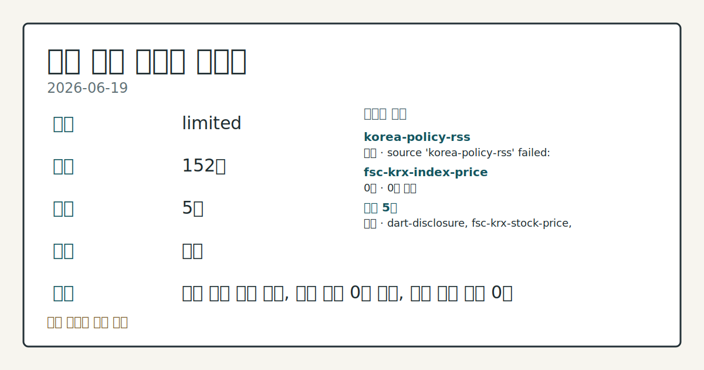
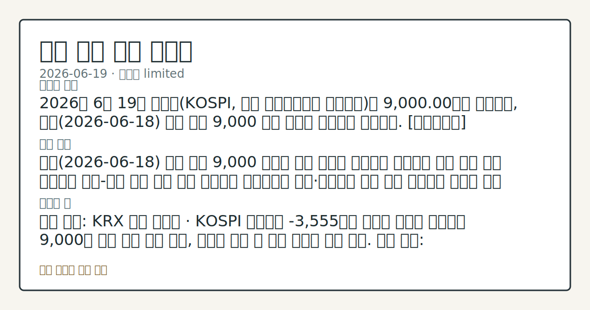

# 2026-06-19 국내 증시 시황
**기준 시각**: 2026-06-19 KST · 2026-06-18T15:00Z, 2026-06-19T15:00Z)
| 종목 | 종가 | 변동 | 비고 |
|------|------|------|------|
| ^KOSPI | 9,000.00 | — | — |
| ^KOSDAQ | 376.00 | — | — |
**세그먼트**: [국내 증시](2026-06-19.md) | [미국 증시](../../../us-equity/2026/06/2026-06-19.md) | [크립토](../../../crypto/2026/06/2026-06-19.md)

*이미지: 데이터 신뢰도 · 출처: investo 자체 생성 · 생성: investo 0.1.0 · 2026-06-20 UTC*
> **내 관심 자산 영향**: 데이터 수집 부족으로 매칭 판단 보류 — 추가 수집 후 재평가됩니다.
> **오늘의 결론**: 2026년 6월 19일 코스피는 9,000.00으로 마감하며 전일 사상 최고치 돌파 이후 소폭 하락세로 9,000선 턱걸이를 이어갔다. [데이터부족]
> **핵심 동인**: 코스피 9,000 턱걸이 — 전일 ATH 경신 후 차익·불확실성 교차 코스피는 전일(2026-06-18) 사상 최초로 9,000선을 돌파한 데 이어, 19일에는 단기 급등에 따른 차익 매물 출현과 미국·이란 종전 합의 이행 불확실성이 맞물리며 소폭 하락 마감했다.
> **주의할 점**: 확인 소스: KRX 코스피 수급 · 코스피 외국인 순매수가 플러스(+)로 전환되면 상방 수급 회복 신호 관찰, -3,555억원 순매도 기조가 연장되면 9...
> **데이터 상태**: 제한 · 본문 사용 미집계 · 실패 1 · 0건 1

수집/품질 진단

> **데이터 상태**: 제한 — 수집 152건 / 소스 5개 / 누락: 없음 · 제한 — 핵심 가격 소스 0건/실패/stale, 본문 결론 신뢰도 낮음
> **소스 카운트**: 수집 대상 7 / 성공 5 / 0건 1 / 실패 1 / 본문 사용 미집계
> **소스 등급 분포**: S=2 / A=2 / B=1
> **상세 사유**: 일부 소스 수집 실패, 일부 소스 0건 반환, 핵심 가격 소스 0건
> **소스별 상태**: korea-policy-rss 실패 (일시적 수집 오류), fsc-krx-index-price 0건, 정상 5개

> 정보 제공용 자동 시황이며 매매 권유가 아닙니다.
## 한눈에 보기
코스피(KOSPI) **9,000**선 턱걸이 마감, 전일 ATH(사상 최고치) 경신 직후 장중 **553p** 변동폭으로 출렁이며 소폭 하락 종료
**SK하이닉스[000660]** **+6.51%**, **삼성전자[005930]** **+4.62%** — 반도체 대형주 동반 강세로 지수 낙폭 제한
코스피 개인 순매수 **+16,478억원** vs 기관 **-12,244억원** · 외국인 **-3,555억원** 순매도 — §③ 수급 구도 점검
## ⓪ 오늘의 매크로
**FOMC 일정** — 2026-07-08 — FOMC Minutes
**미 국채 수익률** — UST curve 2026-06-18: 10Y 4.46%, 2Y10Y +0.27pp
## ⓪-B 채널 기준선
| 기준선 | 값 |
|------|------|
| 코스피 | 9,000.00 (—) |
| 코스닥 | 376.00 (—) |
| 원/달러 | 미수집 |
> **크로스마켓 연결 고리**: 금리 이벤트가 할인율/달러 경로의 공통 변수로 남아 있습니다.
> **오늘의 큰 그림:** 금리와 달러 변수가 국내·미국에 동시에 걸리며, 오늘 독자는 금리·달러 민감도을 먼저 확인해야 합니다.
## ① 요약

*이미지: 시장 스냅샷 · 출처: investo 자체 생성 · 생성: investo 0.1.0 · 2026-06-20 UTC*

2026년 6월 19일 코스피는 **9,000.00**으로 마감하며 [전일 사상 최고치 돌파 이후 소폭 하락세](https://www.yna.co.kr/view/AKR20260619132500008)로 9,000선 턱걸이를 이어갔다. 장중 최대 변동폭이 **553p**에 달해 상당한 변동성이 나타났다. 코스닥(KOSDAQ)은 **376.00**에 마감했다. 전일 미국장 지수 데이터는 미수집이나, 미국·이란 종전 합의 이행 불확실성이 외국인 수급 이탈 경로로 연결됐다는 것이 국내 언론 보도에서 관찰된다. 원/달러 환율 종가 수치는 미수집 상태이며, 국고채(KTB) 금리는 일제히 상승해 추가 변수로 작용했다. 반도체(삼성전자 **+4.62%**, SK하이닉스 **+6.51%**)는 강세를 보인 반면 NAVER[035420] **-3.49%**, 현대차[005380] **-2.75%** 등 주요 대형주가 하락해 업종별 흐름이 엇갈렸다. [혼재]

## ② 전일 핵심 이슈

### 코스피 9,000 턱걸이 — 전일 ATH 경신 후 차익·불확실성 교차

[코스피는 전일(2026-06-18) 사상 최초로 9,000선을 돌파](https://www.yna.co.kr/view/AKR20260619132500008)한 데 이어, 19일에는 단기 급등에 따른 차익 매물 출현과 미국·이란 종전 합의 이행 불확실성이 맞물리며 소폭 하락 마감했다. 어제(2026-06-18) ATH 경신의 상승 흐름에서 오늘은 차익 매물 우세 구도로 전환됐으며, 장중 변동폭 **553p**는 매수세와 매도세가 강하게 맞부딪혔음을 보여준다.

> **그래서 의미는?** ATH 돌파 직후 차익 매물이 출현하는 것은 시장이 신규 고점 수준을 재검증하는 과정으로, 9,000선 지지력에 대한 재점검 국면임을...

### 미국·이란 종전 합의 이행 불확실성 — 외국인 수급 이탈 경로

미국·이란 종전 합의의 이행 불확실성이 외국인 투자 심리를 눌러 코스피 외국인 순매도 **-3,555억원**의 배경 요인으로 관찰된다. 지정학 리스크 경로로서 국내 증시 관점에서는 외국인 수급 이탈과 원/달러 환율 변동성 확대로 연결된 흐름이다.

### 중앙일보 CP(기업어음) 최종 부도 · 워크아웃 공식 신청

[중앙일보가 220억원 규모의 CP를 최종 부도 처리하고 워크아웃을 공식 신청했다](https://www.yna.co.kr/view/AKR20260619023252005). 개별 기업 신용 이슈이나 단기 자금 시장 신용도 점검 맥락에서 추적 가능하다.

### KRX(한국거래소) '7시 프리마켓' 개장 내년 말로 연기

[한국거래소가 9월 14일 예정이던 프리마켓 개장을 내년 말로 연기하기로 결정했다](https://www.yna.co.kr/view/AKR20260619124251008). 시장 운영 제도 변화이나 당일 가격에 대한 직접 영향은 없다.

## ③ 섹터/수급 동향

### 코스피 수급 — 개인 독자 지지, 기관·외국인 동반 순매도

[코스피 2026-06-19 수급](https://finance.naver.com/sise/investorDealTrendDay.naver?bizdate=20260619&sosok=01) 기준 개인이 **+16,478억원** 순매수로 지수 하단을 지지했다. 반면 기관 **-12,244억원**, 외국인 **-3,555억원**, 기타 **-679억원** 등 세 주체가 동시에 순매도했다. 개인 대(對) 기관·외국인 구도가 선명하게 드러난 하루였다.

> **그래서 의미는?** 개인이 홀로 지수를 받치는 수급 구도는 단기적으로 낙폭을 제한하지만, 외국인·기관의 매도 기조 지속 여부에 따라 9,000선 지지력이 달라질...

### 코스닥 수급 — 외국인 강한 순매수

[코스닥 2026-06-19 수급](https://finance.naver.com/sise/investorDealTrendDay.naver?bizdate=20260619&sosok=02) 기준 외국인이 **+4,977억원** 순매수를 기록하며 코스피와 상반된 흐름을 보였다. 기관은 **-5,838억원** 순매도로 외국인 유입을 부분 상쇄했으며, 개인 **+750억원**, 기타 **+112억원** 순매수가 함께 집계됐다.

### 전력기기·발전 패시브 ETF(상장지수펀드) 5종 신규 상장 예정

[삼성, 한국, 한화, IBK 자산운용의 ETF 5종이 오는 23일 유가증권시장에 신규 상장 예정](https://www.yna.co.kr/view/AKR20260619137700008)이다. 전력기기·발전 섹터 패시브 수급에 영향을 줄 수 있어 점검 항목으로 분류한다.

## ④ 지표·이벤트

### 국고채 금리 일제히 상승 — 3년물 연 **3.784%**

[환율 불안이 겹친 가운데 국고채 금리가 일제히 상승해 3년물 기준 연 **3.784%**를 기록했다](https://www.yna.co.kr/view/AKR20260619138051008). 원/달러 환율은 급등 출발 후 하락 마감하며 장중 상당한 변동성을 보였으나 종가 수치는 미수집 상태다.

> **그래서 의미는?** 국고채 금리 상승은 시중 금리 상방 압력으로 이어지며, 금리 민감도가 높은 인터넷·플랫폼주 등 성장주의 할인율 변화 추이 점검 항목으로...

### 검찰 주가조작 수사 — 증권사 3곳 압수수색

[1천억원대 주가조작 사건 관련 검찰이 증권사 3곳을 압수수색했다](https://www.yna.co.kr/view/AKR20260619164400004). 수사 대상 종목 상세는 입력에 없어 시장 전반 직접 영향은 제한적이나 불법 거래 감시 강화 신호로 확인한다.

## ⑤ 주요 종목

### 주요 관찰 항목

| 종목 | 종가 | 등락 |
|------|------|------|
| 삼성전자[005930] | 362,500원 | **+4.62%** (+16,000) |
| SK하이닉스[000660] | 2,685,000원 | **+6.51%** (+164,000) |
| NAVER[035420] | 235,000원 | **-3.49%** (-8,500) |
| 현대차[005380] | 601,000원 | **-2.75%** (-17,000) |
| 셀트리온[068270] | 173,600원 | **-0.57%** (-1,000) |

> **그래서 의미는?** 삼성전자(반도체·가전)와 SK하이닉스(메모리 반도체)의 동반 강세는 반도체 섹터 수급 유입으로 관찰되며, NAVER(인터넷·플랫폼)와...

### 애프터마켓 체크리스트

- [카카오게임즈[293490]](https://www.yna.co.kr/view/AKR20260619149800008): [라인야후 출자 법인으로 최대주주 변경 완료](https://www.yna.co.kr/view/AKR20260619154600017) 이후 애프터마켓에서 11%대 급등
- [미래에셋생명[085620]](https://www.yna.co.kr/view/AKR20260619153300008): 애프터마켓에서 10%대 급락 (원인 미수집)
- [STX엔진[077970]](https://www.yna.co.kr/view/AKR20260619136400008): 애프터마켓에서 10%대 급등
- [대신증권[003540]](https://www.yna.co.kr/view/AKR20260619138100008): 애프터마켓에서 10%대 급등

### 공시 확인 항목

- 제테마[216080]: 운영자금 70억원 조달 목적 제3자배정 유상증자 결정 ([연합뉴스](https://www.yna.co.kr/view/AKR20260619129900008))
- SK시그넷: 유상증자결정 주요사항보고서 ([DART](https://dart.fss.or.kr/dsaf001/main.do?rcpNo=20260619000622))
- 씨아이테크: 자기주식취득결과보고서 ([DART](https://dart.fss.or.kr/dsaf001/main.do?rcpNo=20260619000638))

## ⑥ 오늘의 관전 포인트

#### 관찰 신호: 확인 소스: KRX 코스피 수급 · 코스피 외국인 순매…

- 출처: 확인 소스 미상
- 현재: 확인 소스: KRX 코스피 수급 · 코스피 외국인 순매수가 플러스로 전환되면 상방 수급 회복 신호 관찰, **-3,555억원** 순매도 기조가 연장되면 9,000선 하방 지지력 재확인. 관심 영향: 기관·외국인 동반 매도 지속 여부에 따른 지수 방향 흐름 점검.
- 확인 조건: 상방 코스피 외국인 순매수가 플러스로 전환되면 상방 수급 회복 신호 관찰, **-3,555억원** 순매도 기조가 연장되면 9,000선 하방 지지력 재확인; 하방 코스피 외국인 순매수가 플러스로 전환되면 상방 수급 회복 신호 관찰, **-3,555억원** 순매도 기조가 연장되면 9,000선 하방 지지력 재확인
- 신뢰도: 낮음
- 관심 영향: 관심 영향: 기관

#### 관찰 신호: 확인 소스: 연합뉴스 지정학 보도 · 미국·이란 종전…

- 출처: 확인 소스 미상
- 현재: 확인 소스: 연합뉴스 지정학 보도 · 미국·이란 종전 합의 이행이 구체화되면 외국인 수급 개선 방향 흐름 관찰, 이행 불확실성이 재부각되면 외국인 순매도 경로 지속 추이 살피기. 관심 영향: 지정학 변수가 국내 외국인 매매 경로에 미치는 영향 추세 확인.
- 확인 조건: 상방 상방 데이터 부족; 하방 하방 데이터 부족
- 신뢰도: 보통
- 관심 영향: 관심 영향: 지정학 변수가 국내 외국인 매매 경로에 미치는 영향 추세 확인.

#### 관찰 신호: 확인 소스: 국고채 금리 자료 · KTB 3년물 금리…

- 출처: 확인 소스 미상
- 현재: 확인 소스: 국고채 금리 자료 · KTB 3년물 금리 연 **3.784%** 기준으로 추가 상승 시 성장주 할인율 부담 관찰, 금리가 하향 전환되면 인터넷·플랫폼주 할인율 완화 여부 데이터 비교. 관심 영향: NAVER[035420] 등 성장주 수급 추세 살피기.
- 확인 조건: 상방 상방 데이터 부족; 하방 하방 데이터 부족
- 신뢰도: 높음
- 관심 영향: 관심 영향: NAVER[035420] 등 성장주 수급 추세 살피기.

#### 관찰 신호: 확인 소스: KRX 코스닥 수급 · 코스닥 외국인 순매…

- 출처: 확인 소스 미상
- 현재: 확인 소스: KRX 코스닥 수급 · 코스닥 외국인 순매수 **+4,977억원** 기조가 지속되면 코스닥 지지 상방 흐름 관찰, 기관 순매도 **-5,838억원** 확대 시 외국인 유입 상쇄 여부 데이터 비교. 관심 영향: 중소형 성장주 수급 방향 추세 확인.
- 확인 조건: 상방 코스닥 외국인 순매수 **+4,977억원** 기조가 지속되면 코스닥 지지 상방 흐름 관찰, 기관 순매도 **-5,838억원** 확대 시 외국인 유입 상쇄 여부 데이터 비교; 하방 하방 데이터 부족
- 신뢰도: 보통
- 관심 영향: 관심 영향: 중소형 성장주 수급 방향 추세 확인.

#### 관찰 신호: 확인 소스: 연합뉴스 ETF 신규 상장 · 오

- 출처: 확인 소스 미상
- 현재: 확인 소스: 연합뉴스 ETF 신규 상장 · 오는 23일 전력기기·발전 패시브 ETF 5종 신규 상장 전후 관련 섹터 패시브 수급 유입이 가시화되면 상방 흐름 관찰, 상장 이후 수급 유입 미미 시 섹터 영향 제한 확인. 관심 영향: 전력기기·발전 관련 종목 수급 변동 추세 관찰.
- 확인 조건: 상방 발전 패시브 ETF 5종 신규 상장 전후 관련 섹터 패시브 수급 유입이 가시화되면 상방 흐름 관찰, 상장 이후 수급 유입 미미 시 섹터 영향 제한 확인; 하방 하방 데이터 부족
- 신뢰도: 보통
- 관심 영향: 관심 영향: 전력기기
## ⑦ 면책조항
본 시황은 일반 정보 제공을 목적으로 자동 생성된 자료이며,
특정 종목·자산에 대한 매매 권유나 투자 자문이 아닙니다.
투자 결정과 그 결과에 대한 책임은 전적으로 본인에게 있으며,
본 시황의 내용에 따라 발생한 손실에 대해 작성자는 일체의 책임을 지지 않습니다.