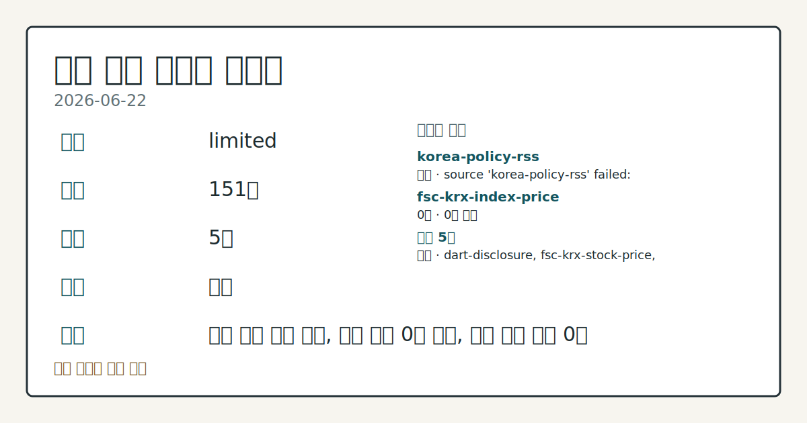
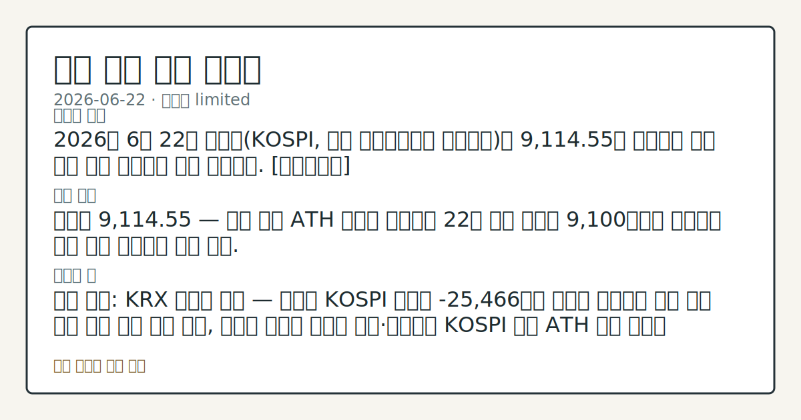

# 2026-06-22 국내 증시 시황
**기준 시각**: 2026-06-22 KST · 2026-06-21T15:00Z, 2026-06-22T15:00Z)
| 종목 | 종가 | 변동 | 비고 |
|------|------|------|------|
| ^KOSPI | 900.00 | — | — |
| ^KOSDAQ | 417.00 | — | — |
**세그먼트**: [국내 증시](2026-06-22.md) | [미국 증시](../../../us-equity/2026/06/2026-06-22.md) | [크립토](../../../crypto/2026/06/2026-06-22.md)

*이미지: 데이터 신뢰도 · 출처: investo 자체 생성 · 생성: investo 0.1.0 · 2026-06-23 UTC*
> **내 관심 자산 영향**: 데이터 수집 부족으로 매칭 판단 보류 — 추가 수집 후 재평가됩니다.
> **오늘의 결론**: 2026년 6월 22일 코스피(KOSPI, 한국 유가증권시장 종합지수)는 9,114.55로 마감하며 종가 기준 사상 최고치를 재차 경신했다. [데이터부족]
> **핵심 동인**: 코스피 9,114.55 — 종가 기준 ATH 재경신 코스피가 22일 소폭 상승해 9,100대에서 마감하며 종가 기준 최고치를 다시 썼다.
> **주의할 점**: 확인 소스: KRX 외국인 수급 — 외국인 KOSPI 순매도 -25,466억원 흐름이 지속되면 개인 단독 수급 의존 구조 심화 관찰, 외국인 순매도 규모가 축소...
> **데이터 상태**: 제한 · 본문 사용 미집계 · 실패 1 · 0건 1

수집/품질 진단

> **데이터 상태**: 제한 — 수집 151건 / 소스 5개 / 누락: 없음 · 제한 — 핵심 가격 소스 0건/실패/stale, 본문 결론 신뢰도 낮음
> **소스 카운트**: 수집 대상 7 / 성공 5 / 0건 1 / 실패 1 / 본문 사용 미집계
> **소스 등급 분포**: S=2 / A=2 / B=1
> **상세 사유**: 일부 소스 수집 실패, 일부 소스 0건 반환, 핵심 가격 소스 0건
> **소스별 상태**: korea-policy-rss 실패 (수집 불가), fsc-krx-index-price 0건, 정상 5개

> 정보 제공용 자동 시황이며 매매 권유가 아닙니다.
## 한눈에 보기
코스피(KOSPI)가 **9,114.55**로 마감하며 종가 기준 사상 최고치를 재경신 — 6월 18일 9,000선 첫 돌파 이후 상승 흐름 연장.
**SK하이닉스[000660]**가 **+2.94%** 상승한 **2,764,000원**으로 마감, 삼성전자[005930]를 제치고 보통주 기준 시총 1위에 등극.
확인 소스: KRX(한국거래소) 수급 — 외국인 KOSPI 순매도 **-25,466억원** vs. 개인 순매수 **+21,506억원**; 수급 구조 §③에서 점검.
## ⓪ 오늘의 매크로
**FOMC 일정** — 2026-07-08 — FOMC Minutes
**국제 유가** — CFTC WTI crude oil managed_money net +96228 contracts
**미 국채 수익률** — UST curve 2026-06-22: 10Y 4.51%, 2Y10Y +0.27pp
## ⓪-B 채널 기준선
| 기준선 | 값 |
|------|------|
| 코스피 | 900.00 (—) |
| 코스닥 | 417.00 (—) |
| 원/달러 | 미수집 |
> **크로스마켓 연결 고리**: 유가/지정학 이슈가 여러 자산군의 변동성 연결 고리로 관찰됩니다. / 금리 이벤트가 할인율/달러 경로의 공통 변수로 남아 있습니다.
> **오늘의 큰 그림:** 금리와 달러 변수가 국내·미국·가상자산에 동시에 걸리며, 오늘 독자는 금리·달러 민감도을 먼저 확인해야 합니다.
## ① 요약

*이미지: 시장 스냅샷 · 출처: investo 자체 생성 · 생성: investo 0.1.0 · 2026-06-23 UTC*

2026년 6월 22일 코스피는 **9,114.55**로 마감하며 종가 기준 사상 최고치를 재차 경신했다. 6월 18일 9,000선 사상 첫 돌파 이후 연속 최고치 갱신 흐름이다. 코스닥(KOSDAQ) 종가는 수집된 데이터의 신뢰성 제한으로 확인되지 않으며, 원/달러 환율 수치도 미수집이나 환율 급등이 보도됐다. 전일 뉴욕증시는 미-이란 종전 양해각서(MOU) 협상 성과를 소화하며 혼조세였으나, 국내 증시는 독자적 강세로 ATH(사상 최고치)를 경신했다. [상승 관찰]

## ② 전일 핵심 이슈

### 코스피 9,114.55 — 종가 기준 ATH 재경신

[코스피가 22일 소폭 상승해 9,100대에서 마감하며 종가 기준 최고치를 다시 썼다](https://www.yna.co.kr/view/AKR20260622116751008). 어제(2026-06-19) 9,000선 안착을 확인한 데 이어 오늘 **9,114.55**로 레벨이 추가 상향됐다. 6월 18일 이후 국내 증시가 연속으로 최고치를 갱신하는 흐름이 지속되고 있다.

> **그래서 의미는?** 코스피가 역사적 고점권에서 매 거래일 신고점을 쓰는 상황으로, 상승 동력의 내용(수급·업종 주도력)과 쏠림 여부를 함께 살펴야 하는 시점이다.

### SK하이닉스, 삼성전자 제치고 보통주 시총 1위 등극

[SK하이닉스[000660]가 22일 급등 마감하며 삼성전자\[005930\](보통주 기준)를 제치고 시총 1위에 올랐다고 연합뉴스가 전했다](https://www.yna.co.kr/view/AKR20260622063152008). 반도체 업황에 대한 긍정적 기대가 수급을 집중시켰으며, SK하이닉스의 관계사 SK스퀘어[402340]도 주가 200만원에 육박하는 급등세를 나타냈다. 반면 삼성전자는 **-2.34%** 하락하며 대조적인 흐름을 보였다.

### ETF(상장지수펀드) 규제 이슈 동시 부각

[금융감독원장이 삼성전자·SK하이닉스 단일종목 레버리지 ETF 도입의 부작용 우려를 강하게 표명](https://www.yna.co.kr/view/AKR20260622089251002)했으며, [한국투자신탁운용은 스페이스X 공모주 포함 ETF 광고와 관련해 진정이 접수](https://www.yna.co.kr/view/AKR20260622147600004)됐다. 투자자 보호 규율과 광고 적정성에 관한 규제 리스크가 같은 날 복수로 부각됐다.

## ③ 섹터/수급 동향

### KOSPI 수급 — 외국인 대규모 순매도, 개인·기관 동반 순매수

[KRX 수급 데이터](https://finance.naver.com/sise/investorDealTrendDay.naver?bizdate=20260622&sosok=01)에 따르면, 2026년 6월 22일 KOSPI에서 외국인이 **-25,466억원** 순매도한 반면 개인이 **+21,506억원**, 기관이 **+3,034억원**을 각각 순매수했다. 기타 투자자도 **+926억원**을 더했다. 지수가 ATH를 경신하는 과정에서 외국인이 대거 이탈하고 개인이 받아낸 수급 구조다.

> **그래서 의미는?** 최고점 부근에서 외국인 대규모 순매도와 개인 적극 순매수가 맞서는 구조는, 상승 지속을 위한 수급 기반의 다양성 확인이 필요하다는 점에서 관찰...

### KOSDAQ 수급 — 외국인·기관 순매수, 개인 순매도

[KOSDAQ 수급](https://finance.naver.com/sise/investorDealTrendDay.naver?bizdate=20260622&sosok=02)에서는 KOSPI와 반대로 외국인이 **+3,152억원**, 기관이 **+1,456억원**을 순매수한 반면 개인은 **-4,634억원** 순매도했다. 기타 투자자는 **+26억원**이었다.

### 반도체 섹터 내 차별화 — SK하이닉스↑ vs 삼성전자↓

SK하이닉스[000660]가 **+2.94%** 상승해 종가 **2,764,000원**을 기록한 반면 삼성전자[005930]는 **-2.34%** 하락해 종가 **354,000원**으로 마감했다. 반도체 섹터 내에서도 종목별 차별화 흐름이 뚜렷했다.

## ④ 지표·이벤트

### 국고채(국내 국채) 금리 상승 — 3년물 연 **3.810%**

[환율 급등의 영향으로 22일 국고채 금리가 일제히 상승 마감하며 3년물이 연 **3.810%**를 기록했다](https://www.yna.co.kr/view/AKR20260622131051008). AI(인공지능) 인프라 투자 확대 역시 채권시장에 구조적 부담 요인으로 작용할 수 있다는 분석이 제기됐다.

> **그래서 의미는?** 국고채 금리 상승은 성장주 밸류에이션(기업 가치 평가) 압박 요인으로 연결되며, 코스닥 기술주 및 고PER(주가수익비율) 종목의 수급 흐름...

### 뉴욕증시 혼조 — 미-이란 종전 협상 소화

[미국과 이란의 종전 MOU 협상 성과를 소화하며 뉴욕증시 3대 주가지수는 혼조세로 출발](https://www.yna.co.kr/view/AKR20260622161100009)한 것으로 전해졌다. 국내 증시는 이 같은 대외 혼조 환경에도 코스피 ATH 경신이라는 독자적 강세를 보였으며, 지정학 관련 국제 유가 변동 경로를 통해 국내 에너지·화학 관련 종목과 원/달러 환율에 간접 영향이 이어질 수 있다.

### 코리아 디스카운트(한국 증시 저평가) 해소 평가

[한국거래소 정은보 이사장은 22일 외신 간담회에서 국내 증시가 상당한 정도의 코리아 디스카운트를 해소하고 있다고 평가했다](https://www.yna.co.kr/view/AKR20260622139300008). 코스피 ATH 경신 시점과 맞물린 발언으로, 외국인 수급 변화와 함께 시장 신뢰 회복 추세를 비교할 수 있다.

## ⑤ 주요 종목

> **그래서 의미는?** SK하이닉스(반도체 메모리)가 시총 1위에 오르고 현대차(자동차)가 상승하는 반면, 삼성전자·NAVER(포털)·셀트리온(바이오)은 하락하는...

### 상승 관찰

| 종목 | 종가 | 등락률 |
|------|------|--------|
| SK하이닉스[000660] | 2,764,000원 | **+2.94%** (+79,000) |
| 현대차[005380] | 613,000원 | **+2.00%** (+12,000) |

### 하락 관찰

| 종목 | 종가 | 등락률 |
|------|------|--------|
| 삼성전자[005930] | 354,000원 | **-2.34%** (-8,500) |
| NAVER[035420] | 229,500원 | **-2.34%** (-5,500) |
| 셀트리온[068270] | 170,300원 | **-1.90%** (-3,300) |

### 확인 항목

- [한올바이오파마[009420]](https://www.yna.co.kr/view/AKR20260622146100008): 22일 애프터마켓에서 10%대 급등 보고.
- [SK스퀘어[402340]](https://www.yna.co.kr/view/AKR20260622063951008): SK하이닉스 시총 1위 효과에 주가 200만원 육박.
- [신영증권[001720]](https://www.yna.co.kr/view/AKR20260622129600008): 애프터마켓 10%대 급등 보고.
- [부국증권[001270]](https://www.yna.co.kr/view/AKR20260622131400008): 애프터마켓 10%대 급등 보고.
- [트리니티항공[091810]](https://www.yna.co.kr/view/AKR20260622143700008): 운영자금 약 800억원 제3자배정 유상증자(신주 발행을 통한 자금 조달) 결정 공시.

## ⑥ 오늘의 관전 포인트

#### 관찰 신호: 전환되면 KOSPI 추

- 출처: KRX 외국인 수급 — 외국인 KOSPI 순매도 **-25
- 현재: 확인 소스: KRX 외국인 수급 — 외국인 KOSPI 순매도 **-25,466억원** 흐름이 지속되면 개인 단독 수급 의존 구조 심화 관찰, 외국인 순매도 규모가 축소·전환되면 KOSPI 추가 ATH 연장 가능성 점검. 관심 영향: 지수 상승 지속성의 수급 기반 추세 확인.
- 확인 조건: 상방 상방 데이터 부족; 하방 하방 데이터 부족
- 신뢰도: 낮음
- 관심 영향: 관심 영향: 지수 상승 지속성의 수급 기반 추세 확인.

#### 관찰 신호: 확대하면 HBM 수혜 업종 집중 흐름 관찰, 삼성전자

- 출처: KRX 반도체 섹터 — SK하이닉스[000660]가 시총 1위를 유지
- 현재: 확인 소스: KRX 반도체 섹터 — SK하이닉스[000660]가 시총 1위를 유지·확대하면 HBM 수혜 업종 집중 흐름 관찰, 삼성전자[005930]의 추가 하락이 지속되면 반도체 섹터 내 차별화 구도 심화 여부 점검. 관심 영향: KOSPI 시총 구조 변화 추세 확인.
- 확인 조건: 상방 상방 데이터 부족; 하방 하방 데이터 부족
- 신뢰도: 보통
- 관심 영향: 관심 영향: KOSPI 시총 구조 변화 추세 확인.

#### 관찰 신호: 확인 소스: 국고채 3년물 금리 — **3.810%**…

- 출처: 국고채 3년물 금리 — **3
- 현재: 확인 소스: 국고채 3년물 금리 — **3.810%**를 상회하는 흐름이 지속되면 코스닥 기술·성장주 밸류에이션 압박 확대 관찰, 금리가 안정 또는 하락 전환되면 고PER 종목 수급 회복 가능성 흐름 점검. 관심 영향: NAVER·셀트리온 등 성장주 수급 변동 확인.
- 확인 조건: 상방 확인 소스: 국고채 3년물 금리 — **3.810%**를 상회하는 흐름이 지속되면 코스닥 기술; 하방 하방 데이터 부족
- 신뢰도: 높음
- 관심 영향: 관심 영향: NAVER

#### 관찰 신호: 한국투자신탁운용 — 단일종목 레버리지 ETF 및 스페…

- 출처: 금감원
- 현재: 확인 소스: 금감원·한국투자신탁운용 — 단일종목 레버리지 ETF 및 스페이스X ETF 광고 논란이 공식 조사·제재로 진전되면 ETF 시장 규제 리스크 확대 흐름 관찰, 행정 지도 수준에서 일단락되면 영향 제한적 흐름 비교. 관심 영향: ETF 운용사 관련 상품 및 투자자 수급 변화 추세 확인.
- 확인 조건: 상방 상방 데이터 부족; 하방 하방 데이터 부족
- 신뢰도: 보통
- 관심 영향: 관심 영향: ETF 운용사 관련 상품 및 투자자 수급 변화 추세 확인.
## ⑦ 면책조항
본 시황은 일반 정보 제공을 목적으로 자동 생성된 자료이며,
특정 종목·자산에 대한 매매 권유나 투자 자문이 아닙니다.
투자 결정과 그 결과에 대한 책임은 전적으로 본인에게 있으며,
본 시황의 내용에 따라 발생한 손실에 대해 작성자는 일체의 책임을 지지 않습니다.