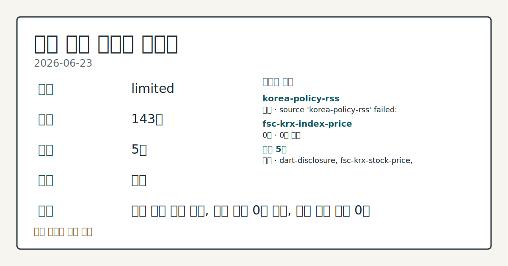
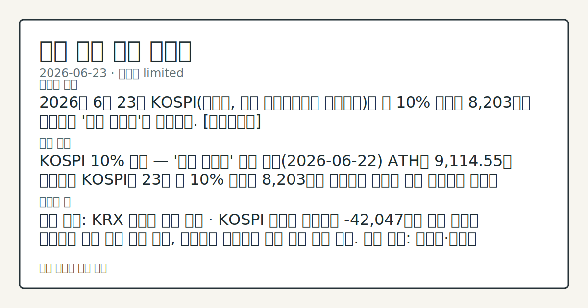

# 2026-06-23 국내 증시 시황
**기준 시각**: 2026-06-23 KST · 2026-06-22T15:00Z, 2026-06-23T15:00Z)
| 종목 | 종가 | 변동 | 비고 |
|------|------|------|------|
| ^KOSPI | 377.00 | — | — |
| ^KOSDAQ | 484.00 | — | — |
**세그먼트**: [국내 증시](2026-06-23.md) | [미국 증시](../../../us-equity/2026/06/2026-06-23.md) | [크립토](../../../crypto/2026/06/2026-06-23.md)

*이미지: 데이터 신뢰도 · 출처: investo 자체 생성 · 생성: investo 0.1.0 · 2026-06-23 UTC*
> **내 관심 자산 영향**: 데이터 수집 부족으로 매칭 판단 보류 — 추가 수집 후 재평가됩니다.
> **오늘의 결론**: 2026년 6월 23일 KOSPI(코스피, 한국 유가증권시장 종합지수)가 약 10% 폭락해 8,203으로 마감하며 '검은 화요일'을 기록했다. [데이터부족]
> **핵심 동인**: KOSPI 10% 급락 — '검은 화요일' 조정 어제(2026-06-22) ATH인 9,114.55를 기록했던 KOSPI가 23일 약 10% 폭락해 8,203으로 마감하며 어제의 상승 흐름에서 완전히 이탈했다.
> **주의할 점**: 확인 소스: KRX 외국인 수급 집계 · KOSPI 외국인 순매도가 -42,047억원 규모 수준을 이어가면 하방 압력 지속 관찰, 순매수로 전환되면 수급 안정...
> **데이터 상태**: 제한 · 본문 사용 미집계 · 실패 1 · 0건 1

수집/품질 진단

> **데이터 상태**: 제한 — 수집 143건 / 소스 5개 / 누락: 없음 · 제한 — 핵심 가격 소스 0건/실패/stale, 본문 결론 신뢰도 낮음
> **소스 카운트**: 수집 대상 7 / 성공 5 / 0건 1 / 실패 1 / 본문 사용 미집계
> **소스 등급 분포**: S=2 / A=2 / B=1
> **상세 사유**: 일부 소스 수집 실패, 일부 소스 0건 반환, 핵심 가격 소스 0건
> **소스별 상태**: korea-policy-rss 실패 (일시적 수집 오류), fsc-krx-index-price 0건, 정상 5개

> 정보 제공용 자동 시황이며 매매 권유가 아닙니다.
## 한눈에 보기
코스피(KOSPI) 약 **10%** 폭락 — 8,203) 마감, '검은 화요일' 기록적 낙폭; 코스닥(KOSDAQ) **-7.9%** 동반 급락
외국인 KOSPI 순매도 **-42,047억원** · 기관 **-44,760억원** 동반 투매 — 개인 홀로 **+85,910억원** 역방향 대응
단일종목 레버리지 ETF(상장지수펀드) **25%** 급락 · 금감원 안전장치 착수 — 본문 §②·§④ 참조
## ⓪ 오늘의 매크로
**FOMC 일정** — 2026-07-08 — FOMC Minutes
**미 국채 수익률** — UST curve 2026-06-23: 10Y 4.50%, 2Y10Y +0.34pp
## ⓪-B 채널 기준선
| 기준선 | 값 |
|------|------|
| 코스피 | 377.00 (—) |
| 코스닥 | 484.00 (—) |
| 원/달러 | 미수집 |
> **크로스마켓 연결 고리**: 금리 이벤트가 할인율/달러 경로의 공통 변수로 남아 있습니다.
> **오늘의 큰 그림:** 금리와 달러 변수가 국내·미국에 동시에 걸리며, 오늘 독자는 금리·달러 민감도을 먼저 확인해야 합니다.
## ① 요약

*이미지: 시장 스냅샷 · 출처: investo 자체 생성 · 생성: investo 0.1.0 · 2026-06-23 UTC*

2026년 6월 23일 KOSPI가 [약 10% 폭락해 8,203으로 마감](https://www.yna.co.kr/view/AKR20260623128251008)하며 '검은 화요일'을 기록했다. 전일(6월 22일) 사상 최고치인 9,114.55에서 하루 만에 대규모 조정이 발생했으며, KOSDAQ(코스닥)도 [**-7.9%** 급락](https://www.yna.co.kr/view/AKR20260623128251008)했다. 외국인과 기관이 동반 대규모 순매도에 나선 가운데, 반도체 대형주 쏠림 구조가 급격히 해소되는 과정이 관찰되었다. 뉴욕증시 기술주 매도세가 국내 개장 전 하방 압력으로 연결된 점도 함께 확인된다. 원/달러 환율 데이터 미수집. [하락 관찰]

## ② 전일 핵심 이슈

### KOSPI 10% 급락 — '검은 화요일' 조정

어제(2026-06-22) ATH인 9,114.55를 기록했던 KOSPI가 23일 [약 10% 폭락해 8,203으로 마감](https://www.yna.co.kr/view/AKR20260623128251008)하며 어제의 상승 흐름에서 완전히 이탈했다. 극단적인 반도체 대형주 쏠림으로 누적된 구조적 불균형이 하루 만에 해소되는 과정으로, KOSDAQ 역시 **-7.9%** 급락해 동반 조정을 받았다. 증권사 주요 전문가들은 ["펀더멘털 변화없어, 상승 후 숨고르기"](https://www.yna.co.kr/view/AKR20260623159300008)라는 관찰을 내놓으며 구조적 추세 전환보다 단기 쏠림 해소 가능성을 언급했다.

> **그래서 의미는?** 전일 ATH에서 하루 만에 10% 급락은 반도체 쏠림 해소와 외국인 투매가 결합된 복합 조정으로, 단순 숨고르기인지 추세 전환인지 확인이...

### 삼성전자·SK하이닉스 — 장중 12%대 폭락, 17년여만 최대 하락률

[연합뉴스 보도](https://www.yna.co.kr/view/AKR20260623043452008)에 따르면, 삼성전자[005930]와 SK하이닉스[000660]가 23일 외국인의 투매에 동반 폭락했으며 하락률은 17년여만에 최대 수준으로 관찰되었다. 장중 양 종목 모두 12%대 이상의 낙폭이 기록된 것으로 전해졌다. 뉴욕증시 기술주가 [하락 출발](https://www.yna.co.kr/view/AKR20260623174000009)한 사실이 국내 반도체 섹터 수급에 추가 하방 압력으로 연결되었으며, 외국인 투매가 국내 영향을 증폭시킨 흐름이다.

### 단일종목 레버리지 ETF — 25% 급락, 당국 안전장치 착수

[연합뉴스 보도](https://www.yna.co.kr/view/AKR20260623145600002)에 따르면, 금융감독원이 삼성전자·SK하이닉스 단일종목 레버리지 ETF 관련 안전장치 마련에 착수했다. 이찬진 금융감독원장은 해당 상품 도입을 후회한다고 밝혔으며, 레버리지 ETF가 [**25%** 급락](https://www.yna.co.kr/view/AKR20260623133500008)하는 과정에서 쏠림과 초단타 매매 문제가 집중 부각되었다.

## ③ 섹터/수급 동향

### KOSPI 투자자별 수급

[네이버 파이낸스 KRX 수급 데이터](https://finance.naver.com/sise/investorDealTrendDay.naver?bizdate=20260623&sosok=01) 기준, 23일 KOSPI에서 외국인이 **-42,047억원** 순매도, 기관이 **-44,760억원** 순매도를 기록하며 외국인·기관 동반 투매 구도가 형성되었다. 개인 투자자는 **+85,910억원** 대규모 순매수로 역방향에 섰으며, 기타 수급은 **+898억원** 순매수였다.

> **그래서 의미는?** 외국인·기관이 동시에 대거 순매도하는 날 개인이 홀로 대규모 매수에 나선 구도는, 저가 분할매수인지 추가 하방 여력이 남은 구도인지 이후 수급...

### KOSDAQ 투자자별 수급

[KOSDAQ 수급 데이터](https://finance.naver.com/sise/investorDealTrendDay.naver?bizdate=20260623&sosok=02) 기준, KOSDAQ에서는 외국인 **+2,746억원** 순매수, 기관 **+1,329억원** 순매수로 KOSPI와 역전된 수급 흐름이 관찰되었다. 개인은 **-3,979억원** 순매도, 기타는 **-96억원** 순매도였다. KOSPI에서 외국인·기관이 대규모 순매도를 보인 것과 달리, KOSDAQ에서는 동일 주체가 순매수로 대응했다는 점에서 시장 간 수급 분화가 확인된다.

## ④ 지표·이벤트

### 국고채 금리 하락 — 3년물 연 **3.770%**

[연합뉴스 보도](https://www.yna.co.kr/view/AKR20260623142051008)에 따르면, 정부가 7월부터 국고채 바이백(기발행 국채 재매입)을 시행할 것이라고 예고한 가운데, 23일 국고채 금리가 단기물을 중심으로 하락 마감했다. 3년물 국고채 금리는 연 **3.770%**를 기록했다.

> **그래서 의미는?** 주식시장 급락과 동시에 채권 금리가 하락(채권 가격 상승)한 것은 안전자산 선호 흐름의 전형적인 관찰 신호입니다.

### 단일종목 레버리지 ETF 규제 — 당국·업계 시각차 부상

[연합뉴스 보도](https://www.yna.co.kr/view/AKR20260623155500008)에 따르면, 황성엽 금융투자협회(금투협)장은 이찬진 금감원장의 "레버리지 증권사만 배불린다" 지적에 대해 "오해"라고 반박했다. 당국과 업계 간 단일종목 레버리지 ETF 규제 방향을 둘러싼 의견 충돌이 본격화되는 흐름이다.

## ⑤ 주요 종목

종가 기준 데이터는 [공공데이터포털 KRX 시세](https://www.data.go.kr/data/15094808/openapi.do) 기준이며, 당일 수급·이슈별 관찰 항목으로 분류한다.

> **그래서 의미는?** '검은 화요일' 속에서도 삼성전자(Samsung Electronics), SK하이닉스, NAVER, 셀트리온(Celltrion...

### 종가 확인
| 종목 | 종가 | 등락률 | 등락(원) |
|------|------|--------|---------|
| SK하이닉스[000660] | 2,919,000원 | **+5.61%** | +155,000 |
| 삼성전자[005930] | 353,500원 | **-0.14%** | -500 |
| 셀트리온[068270] | 168,500원 | **-1.06%** | -1,800 |
| NAVER[035420] | 222,000원 | **-3.27%** | -7,500 |
| 현대차[005380] | 581,000원 | **-5.22%** | -32,000 |

### 공시 확인 항목
- 카카오페이[377300]: 카카오페이증권 주식을 [약 1,730억원에 추가취득](https://www.yna.co.kr/view/AKR20260623141500008), 완전자회사로 전환
- 경남제약[053950]: 약 65억원 유상증자 — (주)엑스에 제3자배정 (운영자금 목적)
- 인콘[083640]: 약 80억원 유상증자 — 미래아이앤지에 제3자배정 (시설자금 목적)
- 광주신세계[037710]: 애프터마켓에서 10%대 급등
- 도우인시스[484120]: 애프터마켓에서 10%대 급등

## ⑥ 오늘의 관전 포인트

#### 관찰 신호: KOSPI 외국인 순매도

- 출처: KRX 외국인 수급 집계
- 현재: 확인 소스: KRX 외국인 수급 집계 · KOSPI 외국인 순매도가 **-42,047억원** 규모 수준을 이어가면 하방 압력 지속 관찰, 순매수로 전환되면 수급 안정 흐름 점검. 관심 영향: 반도체·대형주 종목군 수급 복원 추세 확인.
- 확인 조건: 상방 상방 데이터 부족; 하방 KOSPI 외국인 순매도가 **-42,047억원** 규모 수준을 이어가면 하방 압력 지속 관찰, 순매수로 전환되면 수급 안정 흐름 점검
- 신뢰도: 낮음
- 관심 영향: 관심 영향: 반도체

#### 관찰 신호: 금융투자협회 레버리지 ETF 관련 공식 발표 · 삼성전…

- 출처: 금융감독원
- 현재: 확인 소스: 금융감독원·금융투자협회 레버리지 ETF 관련 공식 발표 · 삼성전자·SK하이닉스 단일종목 레버리지 ETF가 **25%** 급락 이후 추가 조정을 받으면 반도체 섹터 변동성 확대 관찰, 당국 안전장치 내용이 구체화되면 시장 불확실성 완화 흐름 점검. 관심 영향: 레버리지 ETF 수급·반도체 종목 연동 변동 확인.
- 확인 조건: 상방 상방 데이터 부족; 하방 하방 데이터 부족
- 신뢰도: 높음
- 관심 영향: 관심 영향: 레버리지 ETF 수급

#### 관찰 신호: KOSDAQ 외국인 순매수 **+2,746억원**·기관…

- 출처: KRX KOSDAQ 수급 데이터
- 현재: 확인 소스: KRX KOSDAQ 수급 데이터 · KOSDAQ 외국인 순매수 **+2,746억원**·기관 순매수 **+1,329억원** 흐름이 유지되면 KOSPI 대비 KOSDAQ 상대 강도 관찰, 수급이 역전되면 전 시장 동반 하방 압력 확대 흐름 점검. 관심 영향: KOSPI-KOSDAQ 수급 분화 지속 여부 추세 살피기.
- 확인 조건: 상방 상방 데이터 부족; 하방 기관 순매수 **+1,329억원** 흐름이 유지되면 KOSPI 대비 KOSDAQ 상대 강도 관찰, 수급이 역전되면 전 시장 동반 하방 압력 확대 흐름 점검
- 신뢰도: 보통
- 관심 영향: 관심 영향: KOSPI-KOSDAQ 수급 분화 지속 여부 추세 살피기.

#### 관찰 신호: 연 **3.770%** 기준으로 추

- 출처: 채권시장 국고채 3년물 금리
- 현재: 확인 소스: 채권시장 국고채 3년물 금리 · 연 **3.770%** 기준으로 추가 하락 시 안전자산 선호 흐름 지속 관찰, 금리가 반등하면 위험선호 회복 여부 점검. 관심 영향: 채권-주식 상관 변동 및 국내 유동성 흐름 확인.
- 확인 조건: 상방 연 **3.770%** 기준으로 추가 하락 시 안전자산 선호 흐름 지속 관찰, 금리가 반등하면 위험선호 회복 여부 점검; 하방 하방 데이터 부족
- 신뢰도: 높음
- 관심 영향: 관심 영향: 채권-주식 상관 변동 및 국내 유동성 흐름 확인.

#### 관찰 신호: 7월 바이백(기발행 국채 재매입) 규모와 일정

- 출처: 정부 국고채 바이백 시행 세부 일정
- 현재: 확인 소스: 정부 국고채 바이백 시행 세부 일정 · 7월 바이백(기발행 국채 재매입) 규모와 일정이 구체화되면 단기 금리 하락 압력 관찰, 시행 범위가 예상보다 축소되면 채권 시장 영향 제한 흐름 점검. 관심 영향: 단기 채권 수급과 국내 유동성 흐름 확인.
- 확인 조건: 상방 상방 데이터 부족; 하방 하방 데이터 부족
- 신뢰도: 보통
- 관심 영향: 관심 영향: 단기 채권 수급과 국내 유동성 흐름 확인.
## ⑦ 면책조항
본 시황은 일반 정보 제공을 목적으로 자동 생성된 자료이며,
특정 종목·자산에 대한 매매 권유나 투자 자문이 아닙니다.
투자 결정과 그 결과에 대한 책임은 전적으로 본인에게 있으며,
본 시황의 내용에 따라 발생한 손실에 대해 작성자는 일체의 책임을 지지 않습니다.