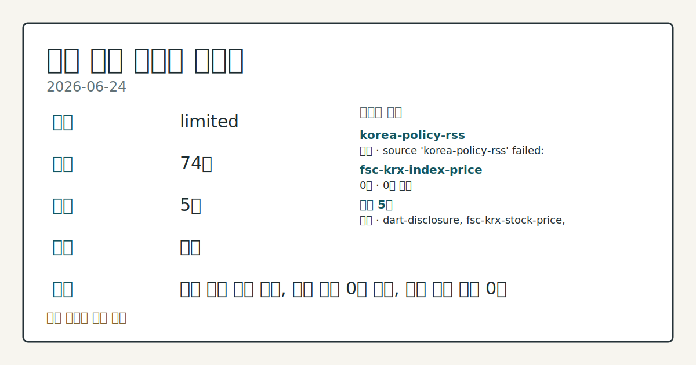
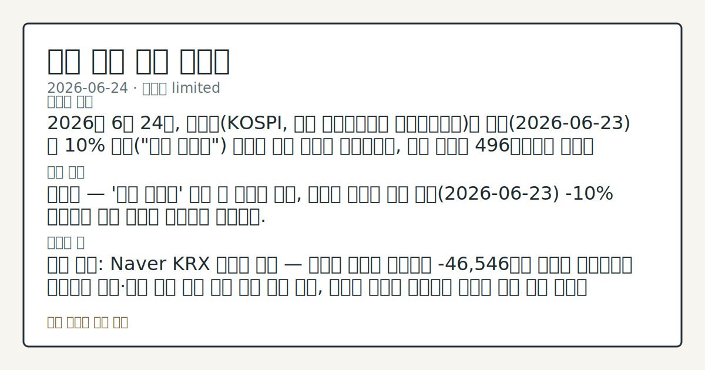

# 2026-06-24 국내 증시 시황
**기준 시각**: 2026-06-24 KST · 2026-06-23T15:00Z, 2026-06-24T15:00Z)
| 종목 | 종가 | 변동 | 비고 |
|------|------|------|------|
| ^KOSDAQ | 477.00 | — | — |
**세그먼트**: [국내 증시](2026-06-24.md) | [미국 증시](../../../us-equity/2026/06/2026-06-24.md) | [크립토](../../../crypto/2026/06/2026-06-24.md)

*이미지: 데이터 신뢰도 · 출처: investo 자체 생성 · 생성: investo 0.1.0 · 2026-06-25 UTC*
> **내 관심 자산 영향**: 데이터 수집 부족으로 매칭 판단 보류 — 추가 수집 후 재평가됩니다.
> **오늘의 결론**: 2026년 6월 24일, 코스피(KOSPI, 한국 유가증권시장 종합주가지수)는 전일(2026-06-23) 약 10% 급락("검은 화요일") 충격을 딛고 반등에 성공했으나, 장중 변동폭 496포인트의 극심한 롤러코스터 장세가 전개됐다. 수집 근거가 제한적입니다
> **핵심 동인**: 코스피 — '검은 화요일' 폭락 후 기술적 반등, 외국인 순매도 지속 어제(2026-06-23) **-10%** 급락에서 오늘 기술적 반등으로 전환됐다.
> **주의할 점**: 확인 소스: Naver KRX 외국인 수급 — 코스피 외국인 순매도가 -46,546억원 수준을 상회하거나 확대되면 개인·기관 방어 매수 부담 가중 본문 참고.
> 정보 제공용 자동 시황이며 매매 권유가 아닙니다.
## 한눈에 보기
2026년 6월 24일, 코스피는 전일 약 10% 급락 충격을 딛고 반등에 성공했으나, 장중 변동폭 496포인트의 극심한 롤러코스터 장세가 전개됐다. 수집 근거가 제한적입니다
코스피 — '검은 화요일' 폭락 후 기술적 반등, 외국인 순매도 지속 어제 **-10%** 급락에서 오늘 기술적 반등으로 전환됐다.
확인 소스: Naver KRX 외국인 수급 — 코스피 외국인 순매도가 -46,546억원 수준을 상회하거나 확대되면 개인·기관 방어 매수 부담 가중 흐름 관찰, 순매도 규모가 축소되면 외국인 수급 귀환 신호로 전환 흐름 점검. 관심 영향: 코스피 단기 방향성 및 지지 수준 관찰. 확인 소스: 연합뉴스 / 공시 데이터 — SK하이닉스[000660] 나스닥 ADR 상장 일정이 확정 공시로 이어지면 최대 45조원 자금 조달 계획 구체화 흐름 확인, 일정 지연·규모 축소 공시가 나오면
## ⓪ 오늘의 매크로
**미 국채 수익률** — UST curve 2026-06-24: 10Y 4.41%, 2Y10Y +0.30pp
## ⓪-B 채널 기준선
| 기준선 | 값 |
|------|------|
| 코스피 | 미수집 |
| 코스닥 | 477.00 (—) |
| 원/달러 | 미수집 |
> **크로스마켓 연결 고리**: 금리 이벤트가 할인율/달러 경로의 공통 변수로 남아 있습니다.
> **오늘의 큰 그림:** 금리와 달러 변수가 미국·가상자산에 동시에 걸리며, 오늘 독자는 금리·달러 민감도를 먼저 확인해야 합니다.
## ① 요약

*이미지: 시장 스냅샷 · 출처: investo 자체 생성 · 생성: investo 0.1.0 · 2026-06-25 UTC*

2026년 6월 24일, 코스피는 전일 약 **10%** 급락 충격을 딛고 반등에 성공했으나, [장중 변동폭 496포인트](https://www.yna.co.kr/view/AKR20260624085800008)의 극심한 롤러코스터 장세가 전개됐다. 수집된 지수 종가(코스피 323.00·코스닥 477.00, 출처: stooq-kr)는 직전 컨텍스트 레벨과 괴리가 있어 정확한 마감 수준은 별도 확인이 필요하다. 삼성전자 관련 정밀 수치는 이번 회차 코어 데이터 미수집으로 확정할 수 없습니다. 원/달러 환율: 데이터 미수집. [변동성 확대]

## ② 전일 핵심 이슈

### 코스피 — '검은 화요일' 폭락 후 기술적 반등, 외국인 순매도 지속

어제(2026-06-23) **-10%** 급락에서 오늘 기술적 반등으로 전환됐다. 6월 22일 ATH(사상 최고치) 9,114.55 이후 이틀 만에 대규모 조정과 반등이 교차한 흐름이다. 외국인의 코스피 **-46,546억원** 순매도 압력이 이어지는 가운데, 개인(**+26,312억원**)과 기관(**+19,095억원**)이 대규모 방어 매수에 나서며 지수를 지지했다([수급 출처: Naver KRX](https://finance.naver.com/sise/investorDealTrendDay.naver?bizdate=20260624&sosok=01)). 뉴욕증시(미국 주식시장)는 MU(마이크론테크놀러지) 실적 발표 전후로 [상승 흐름으로 마감](https://www.yna.co.kr/view/AKR20260624176500009)했으며, 이 흐름이 삼성전자[005930]·SK하이닉스[000660]의 국내 반등과 연동된 것으로 관찰된다.

> **그래서 의미는?** 반등의 동력이 외국인 귀환이 아닌 개인·기관 방어 매수에 집중됐다는 점에서, 외국인 수급 방향 전환 여부가 추가 상승 흐름의 핵심 관찰...

### 홈플러스 회생계획 위기 — 정부 개입 촉구

[홈플러스와 일반노조는 메리츠의 2,000억원 대출 거부를 이유로 "파산만은 막아달라"며 정부 개입을 촉구](https://www.yna.co.kr/view/AKR20260624128551030)했다. 기업 회생계획 진행 중 자금 조달 차질이 불거진 사례로, 국내 소비재·유통 섹터 신용 리스크의 관찰 포인트다.

### 아센디오 등 — 회계기준 위반 감사인 지정

[금융위원회는 아센디오[012170] 등 3개사에 회계처리 기준 위반으로 감사인 지정과 과징금 조치를 결정](https://www.yna.co.kr/view/AKR20260624169800002)했다. 코스닥 상장사 회계 이슈로 개별 종목 수급 관찰이 필요하다.

## ③ 섹터/수급 동향

### 투자자별 수급 — 코스피·코스닥

2026-06-24 코스피 수급([출처: Naver KRX](https://finance.naver.com/sise/investorDealTrendDay.naver?bizdate=20260624&sosok=01)): 외국인 **-46,546억원** 순매도, 개인 **+26,312억원** 순매수, 기관 **+19,095억원** 순매수, 기타 **+1,138억원** 순매수. 코스닥([출처: Naver KRX](https://finance.naver.com/sise/investorDealTrendDay.naver?bizdate=20260624&sosok=02)): 기관 **+3,363억원** 순매수, 개인 **-3,184억원** 순매도, 외국인 **-320억원** 순매도, 기타 **+141억원** 순매수.

> **그래서 의미는?** 코스피·코스닥 양 시장 모두에서 외국인이 순매도로 빠져나가는 동안 기관이 방어 역할을 맡는 구조가 지속되고 있어, 이 수급 구조의 변화 흐름이...

### 반도체 섹터 — 삼성전자·SK하이닉스 동향

삼성전자 관련 정밀 수치는 이번 회차 코어 데이터 미수집으로 확정할 수 없습니다. 단일종목 레버리지 상품에서 전일 **-25%** 급락 후 당일 **+19%** 급등하는 [극단적 변동](https://www.yna.co.kr/view/AKR20260624141000008)이 나타나 삼성전자 관련 파생 상품의 변동성이 두드러졌다. SK하이닉스 관련 정밀 수치는 이번 회차 코어 데이터 미수집으로 확정할 수 없습니다.

### 코스닥 신규 공급 — 상장 예비심사 통과

[해치텍·니어스랩·스카이랩스가 코스닥 상장 예비심사를 통과](https://www.yna.co.kr/view/AKR20260624170300008)해 향후 코스닥 신규 수급 변수가 추가됐다.

## ④ 지표·이벤트

### 국고채 금리 상승 — 3년물 연 **3.772%**

[국고채(한국 정부 발행 채권) 금리가 24일 30년물 입찰을 앞두고 장기물 중심으로 상승 마감했으며, 3년물은 연 **3.772%**](https://www.yna.co.kr/view/AKR20260624147051008)를 기록했다.

> **그래서 의미는?** 장기물 위주의 금리 상승은 고PER(주가수익비율) 성장주의 밸류에이션(가치평가) 부담 요인으로 작용하며, 코스피 성장주 수급 방향 추세 점검이...

### MU 실적 — 국내 반도체 낙수 여부

뉴욕증시는 MU 실적 발표 전후로 [상승 흐름으로 마감](https://www.yna.co.kr/view/AKR20260624176500009)했다. MU 실적은 글로벌 반도체 업황(경기 상황) 지표로, 삼성전자[005930]·SK하이닉스[000660]의 국내 영향으로 이어지는 관찰 포인트다.

## ⑤ 주요 종목

### 가격 변동 확인 항목

| 종목 | 종가 | 등락률 |
|------|------|--------|
| 삼성전자[005930] | 340,500원 | **+9.84%** (+30,500원) |
| SK하이닉스[000660] | 2,580,000원 | **+0.98%** (+25,000원) |
| 셀트리온[068270] | 172,700원 | **+7.60%** (+12,200원) |
| NAVER[035420] | 199,400원 | **-1.53%** (-3,100원) |
| 현대차[005380] | 509,000원 | **-0.39%** (-2,000원) |

> **그래서 의미는?** 삼성전자(반도체·가전)와 셀트리온(바이오·의약품)이 강세를 보인 반면 NAVER(인터넷 플랫폼)와 현대차(자동차)는 약보합으로, 업종별 차별화...

### 기업 이벤트 체크리스트

- [SK하이닉스[000660]](https://www.yna.co.kr/view/AKR20260624149853003): 나스닥 ADR 상장 7월 10일 잠정, 최대 45조원 신주 발행 공시 — 캐파(생산능력) 확대 계획 및 기존주주 희석 여부 추세 확인
- [에이프릴바이오[397030]](https://www.yna.co.kr/view/AKR20260624166700008): 1,420억원 제3자배정 유상증자 결정 — 수급 영향 관찰
- [금양[001570]](https://www.yna.co.kr/view/AKR20260624143851004): 상장폐지 효력정지 가처분 심문, 법원이 두 달 기회 부여 — 진행 상황 흐름 관찰
- [아센디오[012170]](https://www.yna.co.kr/view/AKR20260624169800002): 감사인 지정 및 과징금 조치 — 회계 이슈 추세 점검

## ⑥ 오늘의 관전 포인트

> **관전 포인트**: 구조화 가능한 관찰 신호가 부족합니다 — 본문 §②·§④ 참조

> **데이터 상태**: 제한

수집/품질 진단

> **데이터 상태**: 제한 — 수집 74건 / 소스 5개 / 누락: 없음 · 제한 — 핵심 가격 소스 0건/실패/stale, 본문 결론 신뢰도 낮음
> **소스 카운트**: 수집 대상 7 / 성공 5 / 수집 상세는 진단 섹션에서 확인할 수 있습니다. / 수집 상세는 진단 섹션에서 확인할 수 있습니다. / 수집 상세는 진단 섹션에서 확인할 수 있습니다.
> **소스 등급 분포**: S=2 / A=2 / B=1
> **상세 사유**: 일부 소스 수집 실패, 일부 소스 0건 반환, 핵심 가격 소스 0건
> **소스별 상태**: korea-policy-rss 실패 (수집 불가), fsc-krx-index-price 0건, 정상 5개

## ⑦ 면책조항
본 시황은 일반 정보 제공을 목적으로 자동 생성된 자료이며,
특정 종목·자산에 대한 매매 권유나 투자 자문이 아닙니다.
투자 결정과 그 결과에 대한 책임은 전적으로 본인에게 있으며,
본 시황의 내용에 따라 발생한 손실에 대해 작성자는 일체의 책임을 지지 않습니다.