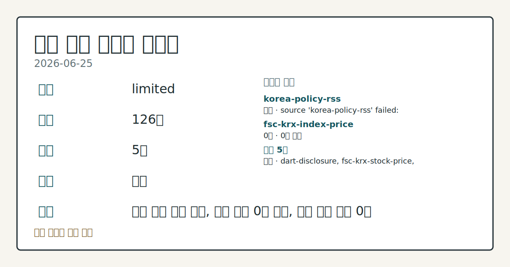
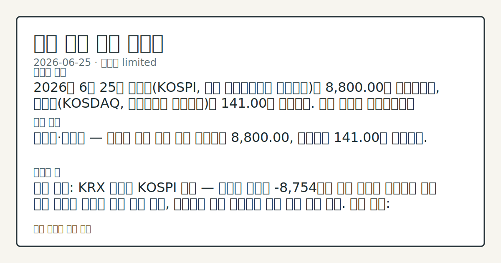

# 2026-06-25 국내 증시 시황
**기준 시각**: 2026-06-25 KST · 2026-06-24T15:00Z, 2026-06-25T15:00Z)
| 종목 | 종가 | 변동 | 비고 |
|------|------|------|------|
| ^KOSPI | 8,800.00 | — | — |
**세그먼트**: [국내 증시](2026-06-25.md) | [미국 증시](../../../us-equity/2026/06/2026-06-25.md) | [크립토](../../../crypto/2026/06/2026-06-25.md)

*이미지: 데이터 신뢰도 · 출처: investo 자체 생성 · 생성: investo 0.1.0 · 2026-06-26 UTC*
> **내 관심 자산 영향**: 데이터 수집 부족으로 매칭 판단 보류 — 추가 수집 후 재평가됩니다.
> **오늘의 결론**: 2026년 6월 25일 코스피(KOSPI, 한국 유가증권시장 종합지수)는 8,800.00에 마감했으며, 코스닥(KOSDAQ, 코스닥시장 종합지수)은 141.00을 기록했다. 수집 근거가 제한적입니다
> **핵심 동인**: 코스피·코스닥 — 이틀째 반등 흐름 연장 코스피는 8,800.00, 코스닥은 141.00에 마감했다.
> **주의할 점**: 확인 소스: KRX 외국인 KOSPI 수급 — 외국인 순매도 -8,754억원 대비 규모가 확대되면 기관 주도 반등의 지속력 약화 흐름 관찰 본문 참고.
> 정보 제공용 자동 시황이며 매매 권유가 아닙니다.
## 한눈에 보기
삼성전자 관련 정밀 수치는 이번 회차 코어 데이터 미수집으로 확정할 수 없습니다.
기관, KOSPI 순매수 **+33,244억원** 집중 투입 — '검은 화요일' 폭락 후 이틀째 반등 연장
외국인 KOSPI 순매도 **-8,754억원** 지속 — 수급 반전 여부가 추가 상승 연속성의 핵심 확인 변수
## ⓪ 오늘의 매크로
**국제 유가** — CFTC WTI crude oil managed_money net +96228 contracts
**미 국채 수익률** — UST curve 2026-06-25: 10Y 4.40%, 2Y10Y +0.31pp
## ⓪-B 채널 기준선
| 기준선 | 값 |
|------|------|
| 코스피 | 8,800.00 (—) |
| 코스닥 | 미수집 |
| 원/달러 | 미수집 |
> **크로스마켓 연결 고리**: 유가/지정학 이슈가 여러 자산군의 변동성 연결 고리로 관찰됩니다. / 금리 이벤트가 할인율/달러 경로의 공통 변수로 남아 있습니다.
> **오늘의 큰 그림:** 유가와 지정학 변수가 공통 변수지만, 원/달러와 국내 수급를 먼저 확인해야 합니다.
## ① 요약

*이미지: 시장 스냅샷 · 출처: investo 자체 생성 · 생성: investo 0.1.0 · 2026-06-26 UTC*

2026년 6월 25일 코스피는 **8,800.00**에 마감했으며, 코스닥은 **141.00**을 기록했다. 2026-06-23 '검은 화요일' 폭락 이후 이틀 연속 반등 흐름이 이어졌다. 삼성전자 관련 정밀 수치는 이번 회차 코어 데이터 미수집으로 확정할 수 없습니다. 기관이 KOSPI에서 **+33,244억원** 순매수를 집행해 반등장을 지지했다. 전일 미국 증시가 마이크론테크놀러지(Micron Technology) 실적과 PCE(개인소비지출) 데이터를 소화하며 상승 출발한 흐름이 국내 반도체 대형주 매수 심리에 긍정적으로 작용한 것으로 관찰된다. 환율 데이터 미수집. [상승 관찰]

## ② 전일 핵심 이슈

### 코스피·코스닥 — 이틀째 반등 흐름 연장

[코스피](https://www.yna.co.kr/market-plus/all)는 **8,800.00**, [코스닥](https://www.yna.co.kr/market-plus/all)은 **141.00**에 마감했다. 어제(2026-06-24) 기술적 반등에 이어 오늘 대형주 중심의 강한 회복세가 추가로 확인됐다. 기관 KOSPI 순매수 **+33,244억원**이 지수를 지지한 반면, 외국인 **-8,754억원** 순매도는 어제 흐름의 연장으로 관찰됐다.

> **그래서 의미는?** 폭락 이후 이틀째 반등이 확인됐으나, 외국인 순매도가 지속 중인 수급 구조에서 반등 지속성은 점검이 필요한 상황이다.

### 미국 증시 흐름 — 국내 반도체주 연동

전일 뉴욕증시의 3대 지수는 마이크론테크놀러지 실적과 PCE 데이터를 소화하며 [상승 출발](https://www.yna.co.kr/view/AKR20260625173200009)한 것으로 보도됐다. SK하이닉스 관련 정밀 수치는 이번 회차 코어 데이터 미수집으로 확정할 수 없습니다.

## ③ 섹터/수급 동향

### KOSPI 투자자별 수급

[KRX(한국거래소) 수급](https://finance.naver.com/sise/investorDealTrendDay.naver?bizdate=20260625&sosok=01) 기준, KOSPI에서 기관이 **+33,244억원** 순매수를 집행했다. 외국인은 **-8,754억원** 순매도, 개인은 **-24,136억원** 순매도를 기록했다.

> **그래서 의미는?** 기관이 단독으로 반등을 견인한 구조로, 외국인·개인이 동시에 매도에 나선 점은 수급 다변화 여부를 점검해야 할 항목이다.

### KOSDAQ 투자자별 수급

[KOSDAQ 수급](https://finance.naver.com/sise/investorDealTrendDay.naver?bizdate=20260625&sosok=02) 기준, 개인 **+1,452억원** 순매수, 외국인 **+212억원** 순매수, 기관 **-1,707억원** 순매도로 집계됐다.

### 반도체 섹터

삼성전자 관련 정밀 수치는 이번 회차 코어 데이터 미수집으로 확정할 수 없습니다. 마이크론테크놀러지 실적과 연계된 반도체 섹터 전반의 반등 흐름이 국내에 파급된 것으로 확인된다.

### 채권 금리

국제유가 하락을 반영해 국고채 금리가 일제히 내렸으며, 3년물 금리는 [연 **3.757%**](https://www.yna.co.kr/view/AKR20260625142751008)를 기록했다. 7월 국고채 **16조원** 발행과 한국은행 통안증권(통화안정증권) 최대 **7조원** 발행 계획도 함께 공시됐다.

## ④ 지표·이벤트

### 美 5월 PCE · 1분기 GDP

미 상무부 발표 기준, 5월 PCE(개인소비지출) 가격지수는 전년 동월 대비 [**+4.1%**](https://www.yna.co.kr/view/AKR20260625169152072) 상승해 3년여 만에 최대 폭 상승을 기록했다. 미·이란 전쟁에 따른 고유가가 주원인으로 분석됐다. 1분기 GDP(국내총생산) 성장률 확정치는 전기 대비 연율 [**+2.1%**](https://www.yna.co.kr/view/AKR20260625169251072)로, 잠정치보다 **+0.5%p** 상향 조정됐다. 국내 증시 관점에서, 미국 고물가 지속은 연준(Federal Reserve) 금리 인하 기대를 제한하는 변수로 확인된다.

> **그래서 의미는?** 미국 고물가·견조 성장 혼재 데이터는 글로벌 긴축 기조가 당분간 이어질 수 있음을 시사하며, 국내 환율·수출 대형주 수급 경로를 점검할...

### 美 주간 신규 실업수당 청구

미 노동부는 지난주(6월 14~20일) 신규 실업수당 청구 건수가 [**21만5천건**](https://www.yna.co.kr/view/AKR20260625170600072)으로 전망치를 밑돌았다고 발표했다. 노동시장 견조함이 재확인됐다.

### ECB(유럽중앙은행) 추가 금리인상 시사

ECB 집행이사 이자벨 슈나벨은 미·이란 종전 MOU(양해각서) 체결에도 불구하고 [추가 금리인상 가능성](https://www.yna.co.kr/view/AKR20260625173500082)을 시사했다. 글로벌 통화긴축 기조가 유지되는 흐름으로 확인된다.

### JP모건 KOSPI 목표 상향

JP모건은 강세장 시나리오에서 KOSPI [목표치를 기존 10,000에서 15,000으로 상향](https://www.yna.co.kr/view/AKR20260625163800008) 조정했다고 보도됐다. 기관 분석 전망치의 하나로 확인한다.

## ⑤ 주요 종목

### 가격 동향 확인 항목

| 종목 | 종가 | 등락 |
|------|------|------|
| 삼성전자[005930] | **340,500원** | **+9.84%** (+30,500) |
| SK하이닉스[000660] | **2,580,000원** | **+0.98%** (+25,000) |
| 셀트리온[068270] | **172,700원** | **+7.60%** (+12,200) |
| 현대차[005380] | **509,000원** | **-0.39%** (-2,000) |
| NAVER[035420] | **199,400원** | **-1.53%** (-3,100) |

> **그래서 의미는?** 삼성전자(반도체)와 셀트리온(바이오)이 강한 상승을 기록한 반면, 현대차(자동차)와 NAVER(인터넷 플랫폼)는 소폭 하락해 업종별 흐름...

### 기타 공시 확인 항목

- 레몬헬스케어: 일반 공모 청약경쟁률 [**1,511대 1**](https://www.yna.co.kr/view/AKR20260625160000008), 청약증거금 **3.8조원** 집계
- 신성에스티[416180]: 애프터마켓 **13%대** 급락 확인 [(연합뉴스)](https://www.yna.co.kr/view/AKR20260625159900008)
- 신성델타테크[065350]: 애프터마켓 **10%대** 급락 확인 [(연합뉴스)](https://www.yna.co.kr/view/AKR20260625154000008)
- 광주신세계[037710]: 애프터마켓 **10%대** 급등 확인 [(연합뉴스)](https://www.yna.co.kr/view/AKR20260625154800008)
- 한양증권[001750]: **500억원** 규모 제3자 배정 유상증자 결정 [(연합뉴스)](https://www.yna.co.kr/view/AKR20260625135453008)

## ⑥ 오늘의 관전 포인트

> **관전 포인트**: 구조화 가능한 관찰 신호가 부족합니다 — 본문 §②·§④ 참조

> **데이터 상태**: 제한

수집/품질 진단

> **데이터 상태**: 제한 — 수집 126건 / 소스 5개 / 누락: 없음 · 제한 — 핵심 가격 소스 0건/실패/stale, 본문 결론 신뢰도 낮음
> **소스 카운트**: 수집 대상 7 / 성공 5 / 수집 상세는 진단 섹션에서 확인할 수 있습니다. / 수집 상세는 진단 섹션에서 확인할 수 있습니다. / 수집 상세는 진단 섹션에서 확인할 수 있습니다.
> **소스 등급 분포**: S=2 / A=2 / B=1
> **상세 사유**: 일부 소스 수집 실패, 일부 소스 0건 반환, 핵심 가격 소스 0건
> **소스별 상태**: korea-policy-rss 실패 (일시적 수집 오류), fsc-krx-index-price 0건, 정상 5개

## ⑦ 면책조항
본 시황은 일반 정보 제공을 목적으로 자동 생성된 자료이며,
특정 종목·자산에 대한 매매 권유나 투자 자문이 아닙니다.
투자 결정과 그 결과에 대한 책임은 전적으로 본인에게 있으며,
본 시황의 내용에 따라 발생한 손실에 대해 작성자는 일체의 책임을 지지 않습니다.