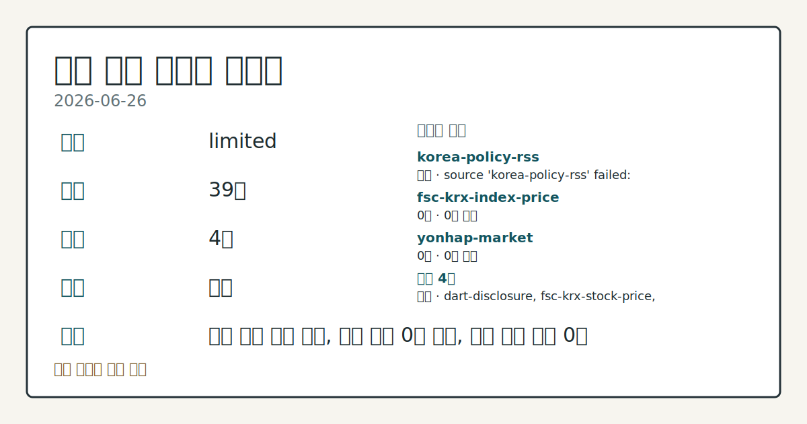
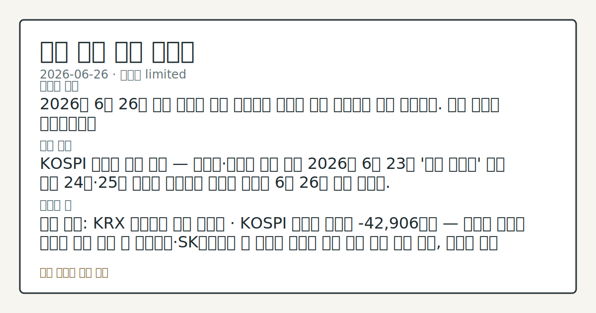

# 2026-06-26 국내 증시 시황
**기준 시각**: 2026-06-26 KST · 2026-06-25T15:00Z, 2026-06-26T15:00Z)
| 종목 | 종가 | 변동 | 비고 |
|------|------|------|------|
| 005930.KS | 339,500.00 | — | — |
**세그먼트**: [국내 증시](2026-06-26.md) | [미국 증시](../../../us-equity/2026/06/2026-06-26.md) | [크립토](../../../crypto/2026/06/2026-06-26.md)

*이미지: 데이터 신뢰도 · 출처: investo 자체 생성 · 생성: investo 0.1.0 · 2026-06-29 UTC*
> **내 관심 자산 영향**: 데이터 수집 부족으로 매칭 판단 보류 — 추가 수집 후 재평가됩니다.
> **용어 가이드**: 이번 시황에서 처음 등장한 용어 — 시가총액(시장가치)
> **오늘의 결론**: 2026년 6월 26일 국내 증시는 직전 이틀간의 기술적 반등 흐름에서 재차 이탈했다. 수집 근거가 제한적입니다
> **핵심 동인**: KOSPI 대형주 반등 이탈 — 반도체·자동차 낙폭 주도 2026년 6월 23일 '검은 화요일' 급락 이후 24일·25일 이틀간 이어지던 기술적 반등이 6월 26일 재차 꺾였다.
> **주의할 점**: 확인 소스: KRX 투자자별 거래 데이터 · KOSPI 외국인 순매도 -42,906억원 — 외국인 순매도 규모가 추가 확대 시 삼성전자·SK하이닉스 본문 참고.
> 정보 제공용 자동 시황이며 매매 권유가 아닙니다.
## 한눈에 보기
2026년 6월 26일 국내 증시는 직전 이틀간의 기술적 반등 흐름에서 재차 이탈했다. 수집 근거가 제한적입니다
KOSPI 대형주 반등 이탈 — 반도체·자동차 낙폭 주도 2026년 6월 23일 '검은 화요일' 급락 이후 24일·25일 이틀간 이어지던 기술적 반등이 6월 26일 재차 꺾였다.
확인 소스: KRX 투자자별 거래 데이터 · KOSPI 외국인 순매도 -42,906억원 — 외국인 순매도 규모가 추가 확대 시 삼성전자·SK하이닉스 등 반도체 대형주 추가 하방 압력 추세 관찰, 순매도 규모 축소 또는 순매수 전환 확인 시 수급 개선 흐름 비교. 관심 영향: 코스피 대형주 수급 방향성 데이터 확인. 확인 소스: FSC·KRX 주가 데이터 · SK하이닉스[000660] 장중 저가 2,600,000원 — 2,600,000원 이하 이탈 확인 시 반도체 섹터 추가 하방 압력 관찰, 장중
## ⓪ 오늘의 매크로
**미 국채 수익률** — UST curve 2026-06-26: 10Y 4.38%, 2Y10Y +0.31pp
> **크로스마켓 연결 고리**: 금리 이벤트가 할인율/달러 경로의 공통 변수로 남아 있습니다.
> **오늘의 큰 그림:** 이 세그먼트의 공통 신호는 제한적입니다. 본문 수급·지표 항목을 먼저 확인하세요.
## ① 요약

*이미지: 시장 스냅샷 · 출처: investo 자체 생성 · 생성: investo 0.1.0 · 2026-06-29 UTC*

2026년 6월 26일 국내 증시는 직전 이틀간의 기술적 반등 흐름에서 재차 이탈했다. 연합뉴스 시황 데이터(stooq 연동) 기준 코스피(KOSPI, 한국 유가증권시장 종합지수)는 **161.00**, 코스닥(KOSDAQ)은 **148.00**으로 집계됐다. 코스피 관련 정밀 수치는 이번 회차 코어 데이터 미수집으로 확정할 수 없습니다. KOSPI에서 외국인 **-42,906억원**, 기관 **-41,224억원**의 동반 순매도가 확인됐으며, 개인투자자가 **+81,919억원**으로 이를 상당 부분 흡수했다. 원/달러 환율 수치는 입력 데이터에 포함되지 않아 인용이 불가하다. [하락 관찰]

## ② 전일 핵심 이슈

### KOSPI 대형주 반등 이탈 — 반도체·자동차 낙폭 주도

2026년 6월 23일 '검은 화요일' 급락 이후 24일·25일 이틀간 이어지던 기술적 반등이 6월 26일 재차 꺾였다. 삼성전자[005930]는 339,500원(**-5.30%**, -19,000원)에 마감하며 장중 321,500원까지 낙폭이 확대됐다. SK하이닉스[000660]는 2,673,000원(**-8.36%**, -244,000원)으로 장중 저가 2,600,000원을 기록했다. 현대차[005380] 480,500원, 셀트리온[068270] 165,900원(**-4.16%**), NAVER[035420] 196,400원(**-1.65%**) 등 업종 대표주들이 일제히 하락 마감했다.

> **그래서 의미는?** 반등 흐름이 이틀 만에 재차 꺾이며 '검은 화요일' 이후 회복 모멘텀이 지속되지 않고 있음을 관찰할 수 있습니다.

### KOSPI 수급: 외국인·기관 동반 순매도, 개인 맞매수

[KRX(한국거래소) 투자자별 거래 데이터](https://finance.naver.com/sise/investorDealTrendDay.naver?bizdate=20260626&sosok=01)에 따르면 KOSPI에서 외국인이 **-42,906억원**, 기관이 **-41,224억원**을 순매도했다. 개인투자자는 **+81,919억원**을 순매수하며 외국인·기관의 매도 물량을 대부분 받아낸 구조가 확인됐다. 기타 법인은 **+2,211억원** 순매수를 기록했다.

## ③ 섹터/수급 동향

### 반도체 섹터 대형 낙폭

삼성전자[005930]와 SK하이닉스[000660]가 각각 **-5.30%**, **-8.36%**의 낙폭을 기록하며 반도체 섹터가 지수 하락을 주도했다. SK하이닉스 관련 정밀 수치는 이번 회차 코어 데이터 미수집으로 확정할 수 없습니다. 삼성전자 역시 시가 354,000원 대비 종가 339,500원으로, 장중 저가 321,500원~고가 356,500원 범위에서 거래됐다. 삼성전자 거래량은 39,735,951주였다.

> **그래서 의미는?** 반도체 양대 대형주의 동반 급락으로 코스피 시가총액 상위 종목 중심의 매도 압력이 집중된 것으로 관찰됩니다.

### KOSDAQ 수급: 외국인·기관 순매수, 코스피와 분리

[KOSDAQ 투자자별 거래 데이터](https://finance.naver.com/sise/investorDealTrendDay.naver?bizdate=20260626&sosok=02)에서 외국인이 **+3,510억원**, 기관이 **+3,084억원**을 순매수했다. 개인은 **-6,688억원** 순매도, 기타는 **+95억원** 순매수를 기록했다. KOSPI와 반대 방향의 외국인·기관 수급 구조가 코스닥에서 관찰됐다.

## ④ 지표·이벤트

### 거시 지표 수집 미흡

이번 세그먼트에서 원/달러 환율, 국고채 금리, 국제 유가 등 주요 거시 지표의 구체적 수치 데이터가 수집되지 않았다. 금일 국내 시장에 직접 영향을 줄 수 있는 예정 경제 지표 발표나 주요 이벤트에 대한 별도 수집 근거도 없는 상태다.

> **그래서 의미는?** 현재 수집 근거가 부족해 방향보다 확인 필요 항목으로만 봅니다.

## ⑤ 주요 종목

### 가격 확인 항목

| 종목 | 종가 | 등락 | 거래량 |
|------|------|------|--------|
| 삼성전자[005930] | 339,500원 | **-5.30%** (-19,000원) | 39,735,951주 |
| SK하이닉스[000660] | 2,673,000원 | **-8.36%** (-244,000원) | 7,467,492주 |
| 현대차[005380] | 480,500원 | **-4.47%** (-22,500원) | 1,567,612주 |
| 셀트리온[068270] | 165,900원 | **-4.16%** (-7,200원) | 596,116주 |
| NAVER[035420] | 196,400원 | **-1.65%** (-3,300원) | 1,473,699주 |

> **그래서 의미는?** 삼성전자(반도체), SK하이닉스(메모리), 현대차(자동차), 셀트리온(바이오), NAVER(IT 플랫폼) 등 업종 대표주들이 일제히 하락해...

### DART(전자공시시스템) 공시 확인 항목

- [AP위성 — 전환사채(CB, 전환사채권) 발행결정](https://dart.fss.or.kr/dsaf001/main.do?rcpNo=20260626000709): 자금 조달 공시
- [TP — 자기주식 처분결정](https://dart.fss.or.kr/dsaf001/main.do?rcpNo=20260626000762): 자사주 매각 공시
- [차바이오텍 — 유상증자결정(종속회사 주요경영사항)](https://dart.fss.or.kr/dsaf001/main.do?rcpNo=20260626901150): 계열사 유상증자
- [성호전자 — 최대주주변경 주식담보제공계약 기재정정](https://dart.fss.or.kr/dsaf001/main.do?rcpNo=20260626901416): 최대주주 담보 변동 정정
- [유일에너테크 — 주식양수도계약 해제·취소](https://dart.fss.or.kr/dsaf001/main.do?rcpNo=20260626901414): 지분 거래 취소

## ⑥ 오늘의 관전 포인트

#### 관찰 신호: KRX 투자자별 거래 데이터 · KOSPI…

- 출처: KRX 투자자별 거래 데이터
- 현재: KRX 투자자별 거래 데이터
- 확인 조건: 상방 KOSPI 외국인 순매도 **-42,906억원** — 외국인 순매도 규모가 추가 확대 시 삼성전자; 하방 SK하이닉스 등 반도체 대형주 추가 하방 압력 추세 관찰
- 신뢰도: 보통
- 관심 영향: 코스피 대형주 수급 방향성 데이터 확인.

#### 관찰 신호: KRX 주

- 출처: FSC
- 현재: KRX 주가 데이터
- 확인 조건: 상방 장중 고가 기준 2,880,000원 수준 회복 여부를 점검하면 반도체 반등 신호 흐름 비교; 하방 SK하이닉스[000660] 장중 저가 2,600,000원 — 2,600,000원 이하 이탈 확인 시 반도체 섹터 추가 하방 압력 관찰
- 신뢰도: 높음
- 관심 영향: 코스피 반도체 섹터 전반 방향성 추세 확인.

#### 관찰 신호: KRX 주

- 출처: FSC
- 현재: KRX 주가 데이터
- 확인 조건: 상방 장중 고가 기준 356,500원 상회 확인 시 상방 회복 흐름 점검; 하방 삼성전자[005930] 장중 저가 321,500원 — 321,500원 이하 이탈 시 추가 조정 압력 추세 관찰
- 신뢰도: 높음
- 관심 영향: 코스피 시가총액 선도 종목 수급 흐름 확인.

> **데이터 상태**: 제한

수집/품질 진단

> **데이터 상태**: 제한 — 수집 39건 / 소스 4개 / 누락: 없음 · 제한 — 핵심 가격 소스 0건/실패/stale, 본문 결론 신뢰도 낮음
> **소스 카운트**: 수집 대상 7 / 성공 4 / 수집 상세는 진단 섹션에서 확인할 수 있습니다. / 수집 상세는 진단 섹션에서 확인할 수 있습니다. / 수집 상세는 진단 섹션에서 확인할 수 있습니다.
> **소스 등급 분포**: S=2 / A=2
> **상세 사유**: 일부 소스 수집 실패, 일부 소스 0건 반환, 핵심 가격 소스 0건
> **소스별 상태**: korea-policy-rss 실패 (일시적 수집 오류), fsc-krx-index-price 0건, yonhap-market 0건, 정상 4개

## ⑦ 면책조항
본 시황은 일반 정보 제공을 목적으로 자동 생성된 자료이며,
특정 종목·자산에 대한 매매 권유나 투자 자문이 아닙니다.
투자 결정과 그 결과에 대한 책임은 전적으로 본인에게 있으며,
본 시황의 내용에 따라 발생한 손실에 대해 작성자는 일체의 책임을 지지 않습니다.