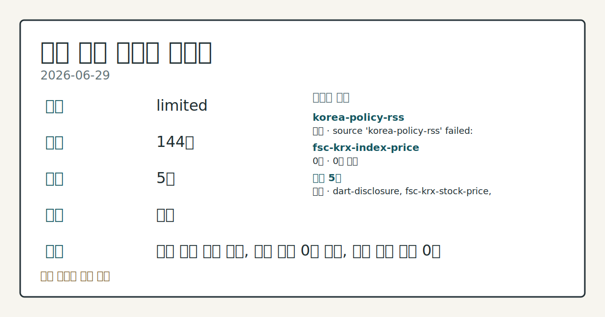
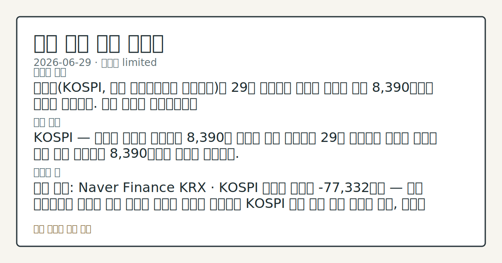

> 정보 제공용 자동 시황이며 매매 권유가 아닙니다.
# 2026-06-29 국내 증시 시황
**기준 시각**: 2026-06-29 KST · 2026-06-28T15:00Z, 2026-06-29T15:00Z)
**세그먼트**: [국내 증시](2026-06-29.md) | [미국 증시](../../../us-equity/2026/06/2026-06-29.md) | [크립토](../../../crypto/2026/06/2026-06-29.md)

*이미지: 데이터 신뢰도 · 출처: investo 자체 생성 · 생성: investo 0.1.0 · 2026-06-29 UTC*
> **내 관심 자산 영향**: 데이터 수집 부족으로 매칭 판단 보류 — 추가 수집 후 재평가됩니다.
> **오늘의 결론**: 코스피(KOSPI, 한국 유가증권시장 종합지수)는 29일 외국인의 역대급 순매도 속에 8,390대에서 약보합 마감했다. 수집 근거가 제한적입니다
> **핵심 동인**: KOSPI — 외국인 역대급 순매도에 8,390대 약보합 마감 코스피는 29일 외국인의 역대급 순매도 속에 장중 등락하다 8,390대에서 약보합 마감했다.
> **주의할 점**: 확인 소스: Naver Finance KRX · KOSPI 외국인 순매도 -77,332억원 — 이후 거래일에서 외국인 매도 규모가 역대급 수준을 본문 참고.
> **크로스마켓 연결 고리**: 금리 이벤트가 할인율/달러 경로의 공통 변수로 남아 있습니다.
> **오늘의 큰 그림:** 금리와 달러 변수가 공통 변수지만, KOSPI·원/달러·외국인 수급를 먼저 확인해야 합니다.
## ① 요약

*이미지: 시장 스냅샷 · 출처: investo 자체 생성 · 생성: investo 0.1.0 · 2026-06-29 UTC*

코스피는 29일 외국인의 역대급 순매도 속에 [8,390대에서 약보합 마감](https://www.yna.co.kr/view/AKR20260629130800008)했다. 코스닥 관련 정밀 수치는 이번 회차 코어 데이터 미수집으로 확정할 수 없습니다. 원/달러 환율은 글로벌 금융위기 이후 최고 수준으로 급등했으며 구체적 종가 환율 수치는 미수집이다. 국고채 금리가 일제히 상승해 3년물이 연 **3.733%**로 마감됐다. 6월 25일 8,800대까지 회복했던 반등 흐름에서 재차 이탈하며 반도체·자동차 등 대형주의 추가 낙폭이 확인됐다. 전날 미국 증시는 중동 긴장 완화를 배경으로 상승 마감했으나 외국인 역대급 매도세와 환율 급등이 맞물려 국내 코스피에 대한 상승 전달 효과는 제한적이었던 것으로 관찰된다. [혼재]

## 한눈에 보기

- 코스피 관련 정밀 수치는 이번 회차 코어 데이터 미수집으로 확정할 수 없습니다.
- 외국인 KOSPI 순매도 **-77,332억원** — 역대급 매도 기록, 개인·기관 방어 매수에도 지수 방어 한계 확인.
- 원/달러 관련 정밀 수치는 이번 회차 코어 데이터 미수집으로 확정할 수 없습니다.

## ⓪ 오늘의 매크로

- **FOMC 일정** — 2026-07-08 — FOMC Minutes
- **미 국채 수익률** — UST curve 2026-06-29: 10Y 4.38%, 2Y10Y +0.28pp

## ② 전일 핵심 이슈

### KOSPI — 외국인 역대급 순매도에 8,390대 약보합 마감

코스피는 [29일 외국인의 역대급 순매도 속에 장중 등락하다 8,390대에서 약보합 마감](https://www.yna.co.kr/view/AKR20260629130800008)했다. 6월 25일 8,800대까지 회복했던 반등 흐름이 재차 이탈한 것으로, 반도체주 투자 심리 약화가 주된 하락 요인으로 확인됐다.

> **그래서 의미는?** 외국인 역대급 매도가 KOSPI 반등 시도를 차단하며 반도체 대형주 중심의 하방 압력이 재확인되는 흐름입니다.

전날 미국 증시는 중동 긴장 완화를 배경으로 상승 마감했으나, 원/달러 환율 급등과 외국인 대량 순매도가 맞물리면서 국내 코스피에 대한 긍정적 전달 효과는 제한적이었던 것으로 관찰된다.

### KOSDAQ — **+8%** 급등, 역대 두 번째 상승률

코스닥 관련 정밀 수치는 이번 회차 코어 데이터 미수집으로 확정할 수 없습니다. 기관이 순매수를 주도한 반면 개인은 순매도로 돌아서 수급 주체별 대응이 엇갈렸다.

### 환율 급등·국고채 금리 동반 상승

원/달러 환율이 [글로벌 금융위기 이후 최고 수준으로 치솟으면서 국고채 금리도 일제히 상승](https://www.yna.co.kr/view/AKR20260629138751008)했다. [3년물은 연 **3.733%**](https://www.yna.co.kr/view/AKR20260629138700008)로 마감됐다.

### 반대매매 고공행진

개인 투자자들의 레버리지 해소 압력이 이어지며 [지난주 2,717억원의 강제처분(반대매매)](https://www.yna.co.kr/view/AKR20260629126500008)이 집행됐다.

## ③ 섹터/수급 동향

### KOSPI 투자주체별 수급 (2026-06-29)

| 투자주체 | [순매수 (억원)](https://finance.naver.com/sise/investorDealTrendDay.naver?bizdate=20260629&sosok=01) |
|---------|------|
| 외국인 | -77,332 |
| 개인 | +45,975 |
| 기관 | +29,327 |
| 기타 | +2,030 |

> **그래서 의미는?** 외국인이 역대급 순매도를 단행하는 가운데 개인·기관이 대거 매수로 유입됐으나 지수 방어에는 한계를 보인 수급 구조가 관찰됩니다.

### KOSDAQ 투자주체별 수급 (2026-06-29)

| 투자주체 | [순매수 ](https://finance.naver.com/sise/investorDealTrendDay.naver?bizdate=20260629&sosok=02) |
|---------|------|
| 외국인 | +266 |
| 기관 | +5,043 |
| 개인 | -5,272 |
| 기타 | -37 |

### 반도체·주요 섹터 흐름

반도체 섹터에서 [삼성전자(005930)는 **-5.30%**](https://www.data.go.kr/data/15094808/openapi.do), [SK하이닉스(000660)는 **-8.36%**](https://www.data.go.kr/data/15094808/openapi.do) 각각 하락하며 투자 심리 약화가 재확인됐다. 자본시장연구원은 삼성전자·SK하이닉스를 기초자산으로 하는 [단일종목 레버리지·인버스 상품이 변동성에 미치는 영향을 분석](https://www.yna.co.kr/view/AKR20260629117500008)했다. SC제일은행은 [하반기 국내에서 반도체주 위주 투자 전략을 제시](https://www.yna.co.kr/view/AKR20260629115300002)했다.

## ④ 지표·이벤트

### 채권·환율

원/달러 환율이 글로벌 금융위기 이후 최고 수준으로 급등하면서 [국고채 금리가 일제히 상승](https://www.yna.co.kr/view/AKR20260629138700008)했다. [3년물 기준 연 **3.733%**](https://www.yna.co.kr/view/AKR20260629138751008)로 마감됐다.

> **그래서 의미는?** 환율과 채권 금리의 동반 상승은 해외 자본 유출 우려와 자금 조달 비용 증가를 동시에 부각하는 신호로 관찰됩니다.

### 해외 기업 이벤트 — 국내 영향 확인 필요

미국 컴캐스트(Comcast)가 [통신 부문과 미디어 부문(NBC유니버설)을 별개 상장회사로 분할한다고 발표](https://www.yna.co.kr/view/AKR20260629169600072)했다. 국내 미디어·통신 업종에 대한 간접적 국내 영향은 별도 확인이 필요하다.

### 중국 하반기 경기 — 한국은행 분석

한국은행은 하반기 [중국의 수출이 반도체 등 제조업 중심으로 늘어나겠지만, 기업 수익성은 저하될 가능성](https://www.yna.co.kr/view/AKR20260629144300083)이 있다고 분석했다.

## ⑤ 주요 종목

### 가격 변동 확인

| 종목 | 종가 (원) | 등락폭 | 등락률 |
|------|----------|--------|-------|
| [삼성전자 ](https://www.data.go.kr/data/15094808/openapi.do) | 339,500 | -19,000 | **-5.30%** |
| [SK하이닉스 ](https://www.data.go.kr/data/15094808/openapi.do) | 2,673,000 | -244,000 | **-8.36%** |
| [현대차 (005380)](https://www.data.go.kr/data/15094808/openapi.do) | 480,500 | -22,500 | **-4.47%** |
| [셀트리온 (068270)](https://www.data.go.kr/data/15094808/openapi.do) | 165,900 | -7,200 | **-4.16%** |
| [NAVER (035420)](https://www.data.go.kr/data/15094808/openapi.do) | 196,400 | -3,300 | **-1.65%** |

> **그래서 의미는?** 삼성전자·SK하이닉스 등 반도체 대형주와 현대차(005380) 자동차주의 동반 하락이 KOSPI 대형주 지수 하방 압력의 주요 경로로...

### 공시·상장 체크리스트

- [코오롱생명과학 (102940)](https://www.yna.co.kr/view/AKR20260629155700008): 애프터마켓에서 10%대 급등
- [큐리옥스바이오시스템즈 (445680)](https://www.yna.co.kr/view/AKR20260629152700008): 애프터마켓에서 10%대 급등
- [매드업](https://www.yna.co.kr/view/AKR20260629159100008): 7월 1일 코스닥 신규 상장 예정
- [SK텔레콤 (017670)](https://www.yna.co.kr/view/AKR20260629153800008): 미국 계열사 주식 3,971억원 취득, 지분율 **0.6%**
- [알엔투테크놀로지 (148250)](https://www.yna.co.kr/view/AKR20260629158500008): 약 70억원 제3자배정 유상증자
- [아이큐어 (175250)](https://www.yna.co.kr/view/AKR20260629154800008): 약 212억원 제3자배정 유상증자
- [올릭스 (226950)](https://www.yna.co.kr/view/AKR20260629143900008): 약 105억원 제3자배정 유상증자

## ⑥ 오늘의 관전 포인트

> **관전 포인트**: 구조화 가능한 관찰 신호가 부족합니다 — 본문 §②·§④ 참조

> **데이터 상태**: 제한

수집/품질 진단

> **데이터 상태**: 제한 — 수집 144건 / 소스 5개 / 누락: 없음 · 제한 — 핵심 가격 소스 0건/실패/stale, 본문 결론 신뢰도 낮음
> **소스 카운트**: 수집 대상 7 / 성공 5 / 수집 상세는 진단 섹션에서 확인할 수 있습니다. / 수집 상세는 진단 섹션에서 확인할 수 있습니다. / 수집 상세는 진단 섹션에서 확인할 수 있습니다.
> **소스 등급 분포**: S=2 / A=2 / B=1
> **상세 사유**: 일부 소스 수집 실패, 일부 소스 0건 반환, 핵심 가격 소스 0건
> **소스별 상태**: korea-policy-rss 실패 (일시적 수집 오류), fsc-krx-index-price 0건, 정상 5개

## ⑦ 면책조항
본 시황은 일반 정보 제공을 목적으로 자동 생성된 자료이며,
특정 종목·자산에 대한 매매 권유나 투자 자문이 아닙니다.
투자 결정과 그 결과에 대한 책임은 전적으로 본인에게 있으며,
본 시황의 내용에 따라 발생한 손실에 대해 작성자는 일체의 책임을 지지 않습니다.