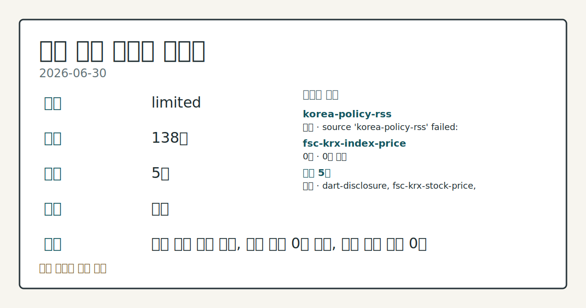
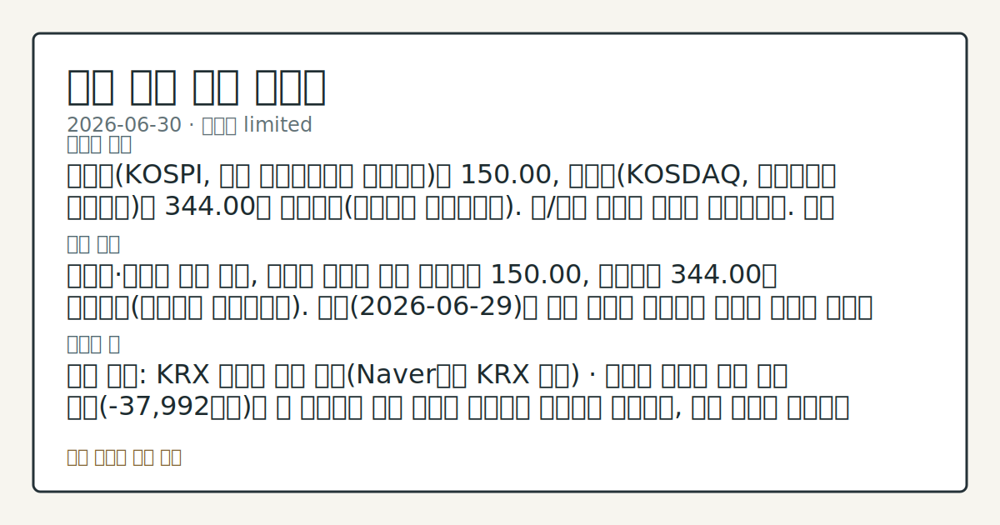

# 2026-06-30 국내 증시 시황
**기준 시각**: 2026-06-30 KST · 2026-06-29T15:00Z, 2026-06-30T15:00Z)
| 종목 | 종가 | 변동 | 비고 |
|------|------|------|------|
| ^KOSDAQ | 344.00 | — | — |
**세그먼트**: [국내 증시](2026-06-30.md) | [미국 증시](../../../us-equity/2026/06/2026-06-30.md) | 크립토(미발행)

*이미지: 데이터 신뢰도 · 출처: investo 자체 생성 · 생성: investo 0.1.0 · 2026-06-30 UTC*
> **내 관심 자산 영향**: 데이터 수집 부족으로 매칭 판단 보류 — 추가 수집 후 재평가됩니다.
> **오늘의 결론**: 코스피(KOSPI, 한국 유가증권시장 종합지수)는 150.00, 코스닥(KOSDAQ, 코스닥시장 종합지수)은 344.00을 나타냈다(연합뉴스 마켓플러스). 원/달러 환율은 데이터 미수집이다. 수집 근거가 제한적입니다
> **핵심 동인**: 코스피·코스닥 동시 마감, 외국인 순매도 연장 코스피는 150.00, 코스닥은 344.00을 나타냈다(연합뉴스 마켓플러스). 전일(2026-06-29)에 이어 코스피 외국인의 대규모 순매도 기조가 이어졌다.
> **주의할 점**: 확인 소스: KRX 외국인 자금 흐름(Naver금융 KRX 미러) · 코스피 외국인 자금 유출 규모(-37,992억원)가 더 확대되면 수급 부담이 본문 참고.
> 정보 제공용 자동 시황이며 매매 권유가 아닙니다.
## 한눈에 보기
SK하이닉스 관련 정밀 수치는 이번 회차 코어 데이터 미수집으로 확정할 수 없습니다.
코스피 외국인은 -37,992억원 순매도, 기관은 +29,332억원 순매수로 수급 주체별 엇갈린 흐름이 뚜렷했다.
에코프로[086520]는 1조2천억원 규모 유상증자를 결정한 가운데 애프터마켓에서 10%대 급락을 나타내, 2차전지 수급 흐름은 본문 §③에서 확인할 수 있다.
## ⓪ 오늘의 매크로
**미 국채 수익률** — UST curve 2026-06-30: 10Y 4.44%, 2Y10Y +0.30pp
## ⓪-B 채널 기준선
| 기준선 | 값 |
|------|------|
| 코스피 | 미수집 |
| 코스닥 | 344.00 (—) |
| 원/달러 | 미수집 |
> **크로스마켓 연결 고리**: 금리 이벤트가 할인율/달러 경로의 공통 변수로 남아 있습니다.
> **오늘의 큰 그림:** 이 세그먼트의 공통 신호는 제한적입니다. 본문 수급·지표 항목을 먼저 확인하세요.
## ① 요약

*이미지: 시장 스냅샷 · 출처: investo 자체 생성 · 생성: investo 0.1.0 · 2026-06-30 UTC*

코스피는 150.00, 코스닥은 344.00을 나타냈다([연합뉴스 마켓플러스](https://www.yna.co.kr/market-plus/all)). 원/달러 환율은 데이터 미수집이다. 삼성전자 관련 정밀 수치는 이번 회차 코어 데이터 미수집으로 확정할 수 없습니다. [혼재]

## ② 전일 핵심 이슈

### 코스피·코스닥 동시 마감, 외국인 순매도 연장

코스피는 150.00, 코스닥은 344.00을 나타냈다([연합뉴스 마켓플러스](https://www.yna.co.kr/market-plus/all)). 전일에 이어 코스피 외국인의 대규모 순매도 기조가 이어졌다. 전일 미국 증시는 기술주 강세 흐름을 보였다는 소식이 전해졌으며([연합뉴스](https://www.yna.co.kr/view/AKR20260630196100009)), 이 같은 분위기는 국내 기술주 투자심리에도 일부 영향을 준 것으로 관찰된다(국내 영향 경로 점검 필요). 한편 이달 들어 매그니피센트7(M7, 미국 대형 기술주 7종목)의 시가총액이 3천600조원 증발했다는 보도가 나왔고([연합뉴스](https://www.yna.co.kr/view/AKR20260630144700009)), 같은 기간 국내 반도체 대형주인 삼성전자[005930]·SK하이닉스[000660]의 수급 흐름도 함께 관찰 대상이다(반도체 수급 영향 점검).

> **그래서 의미는?** 미국 기술주 분위기와 국내 반도체 대형주 수급이 같은 방향으로 엮여 움직이는지 지켜볼 구간입니다.

## ③ 섹터/수급 동향

### KOSPI 수급 — 외국인 대규모 순매도, 기관이 상쇄

코스피에서는 30일 외국인이 -37,992억원 순매도, 개인이 +8,401억원 순매수, 기관이 +29,332억원 순매수, 기타가 +259억원 순매수를 기록했다([Naver금융 KRX(한국거래소) 미러](https://finance.naver.com/sise/investorDealTrendDay.naver?bizdate=20260630&sosok=01)). 코스닥에서는 개인이 +3,909억원 순매수한 반면 기관 -1,428억원, 외국인 -2,464억원, 기타 -17억원으로 순매도를 나타냈다([Naver금융 KRX 미러](https://finance.naver.com/sise/investorDealTrendDay.naver?bizdate=20260630&sosok=02)).

> **그래서 의미는?** 외국인 매도를 기관 매수가 상당 부분 받아낸 모습으로, 수급 주체별 온도차가 뚜렷합니다.

### 반도체·2차전지 — 대형주 등락 엇갈림

반도체 대형주인 삼성전자[005930]는 323,000원(**-4.86%**, -16,500원), SK하이닉스[000660]는 2,628,000원으로 동반 하락했다([공공데이터포털](https://www.data.go.kr/data/15094808/openapi.do)). 2차전지 관련주인 에코프로[086520]는 인도네시아 니켈 제련소 투자 확대를 위해 1조2천억원 규모 유상증자를 결정했다고 공시했으며([연합뉴스](https://www.yna.co.kr/view/AKR20260630145551008)), 같은 종목은 애프터마켓에서 10%대 급락을 나타냈다([연합뉴스](https://www.yna.co.kr/view/AKR20260630160400008)). 이 밖에 이동통신 3사의 정보보호 투자가 전년 대비 22% 늘었다는 보도도 있었다([연합뉴스](https://www.yna.co.kr/view/AKR20260630165900017)).

## ④ 지표·이벤트

### 미국 경제지표 — 소비자신뢰지수 호전, 구인 호조

미국의 6월 소비자신뢰지수가 유가 하락 영향으로 호전됐으나 구직여건 인식은 악화된 것으로 나타났다([연합뉴스](https://www.yna.co.kr/view/AKR20260630196900072)). 5월 구인 규모는 2년 만에 최대치로 시장 예상을 웃돌았고([연합뉴스](https://www.yna.co.kr/view/AKR20260630195600072)), 4월 주택가격은 전년대비 **0.8%** 상승했으나 물가를 반영한 실질가격은 11개월째 하락세를 지속했다([연합뉴스](https://www.yna.co.kr/view/AKR20260630194300072)).

> **그래서 의미는?** 미국 노동·소비 지표가 엇갈리며 향후 통화정책 경로 해석도 갈릴 수 있는 구간입니다.

### 국내 채권·부동산 — 국고채 금리 하락, 가계부채 점검

외국인의 국채선물 순매수에 힘입어 30일 국고채 금리가 일제히 하락했고, 3년물은 연 **3.703%**를 기록했다([연합뉴스](https://www.yna.co.kr/view/AKR20260630159051008)). 한편 당국은 동탄·기흥·구리를 규제지역·토지거래허가구역으로 추가 지정하며 가계부채 점검회의를 열었다([연합뉴스](https://www.yna.co.kr/view/AKR20260630086951002)).

## ⑤ 주요 종목

### 가격 변동 체크리스트

NAVER[035420]는 204,000원, 셀트리온[068270]는 179,200원(**+8.02%**, +13,300원), 현대차[005380]는 497,000원으로 거래를 마쳤다([공공데이터포털](https://www.data.go.kr/data/15094808/openapi.do)).

> **그래서 의미는?** 네이버(NAVER), 셀트리온, 현대차 등 업종이 다른 종목들이 동시에 상승해 특정 섹터에 국한되지 않은 흐름이 확인됩니다.

### 애프터마켓 변동 확인 항목

롯데렌탈\[089860\]([연합뉴스](https://www.yna.co.kr/view/AKR20260630163600008))·카카오게임즈\[293490\]([연합뉴스](https://www.yna.co.kr/view/AKR20260630159100008))·대화제약\[067080\]([연합뉴스](https://www.yna.co.kr/view/AKR20260630161700008))·코세스\[089890\]([연합뉴스](https://www.yna.co.kr/view/AKR20260630157900008))는 30일 애프터마켓에서 10%대 급등을 나타냈다.

### 자본거래·공시 확인 항목

이노진[344860]은 운영자금 등 34억원 조달을 위한 제3자배정 유상증자를 결정했다고 DART(전자공시시스템) 공시를 통해 밝혔고([DART](https://dart.fss.or.kr/dsaf001/main.do?rcpNo=20260630001080)), 넥스트아이[137940]도 19억원 규모 제3자배정 유상증자를 결정했다([DART](https://dart.fss.or.kr/dsaf001/main.do?rcpNo=20260630001076)). 위메이드[112040]는 박관호 대표의 지분 전량을 중국 알리바바 관계사에 매각하는 최대주주 변경 계약을 정정 공시했다([DART](https://dart.fss.or.kr/dsaf001/main.do?rcpNo=20260630901591)).

## ⑥ 오늘의 관전 포인트

> **관전 포인트**: 구조화 가능한 관찰 신호가 부족합니다 — 본문 §②·§④ 참조

> **데이터 상태**: 제한

수집/품질 진단

> **데이터 상태**: 제한 — 수집 138건 / 소스 5개 / 누락: 없음 · 제한 — 핵심 가격 소스 0건/실패/stale, 본문 결론 신뢰도 낮음
> **소스 카운트**: 수집 대상 7 / 성공 5 / 수집 상세는 진단 섹션에서 확인할 수 있습니다. / 수집 상세는 진단 섹션에서 확인할 수 있습니다. / 수집 상세는 진단 섹션에서 확인할 수 있습니다.
> **소스 등급 분포**: S=2 / A=2 / B=1
> **상세 사유**: 일부 소스 수집 실패, 일부 소스 0건 반환, 핵심 가격 소스 0건
> **소스별 상태**: korea-policy-rss 실패 (일시적 수집 오류), fsc-krx-index-price 0건, 정상 5개

## ⑦ 면책조항
본 시황은 일반 정보 제공을 목적으로 자동 생성된 자료이며,
특정 종목·자산에 대한 매매 권유나 투자 자문이 아닙니다.
투자 결정과 그 결과에 대한 책임은 전적으로 본인에게 있으며,
본 시황의 내용에 따라 발생한 손실에 대해 작성자는 일체의 책임을 지지 않습니다.