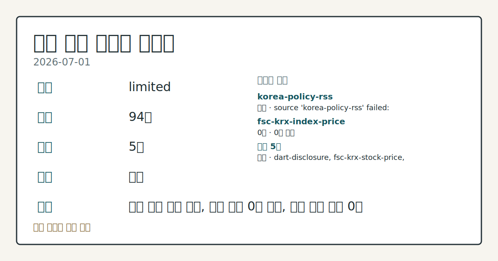
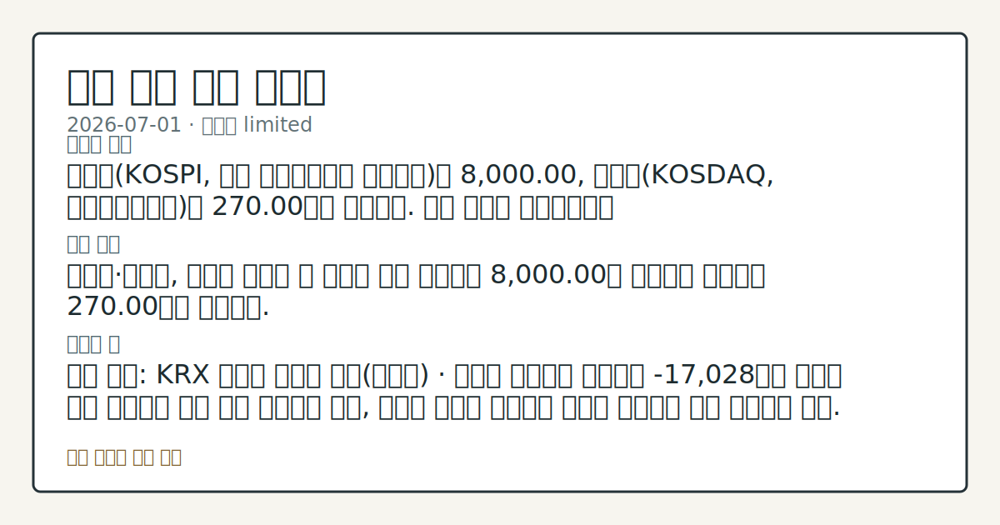

# 2026-07-01 국내 증시 시황
**기준 시각**: 2026-07-01 KST · 2026-06-30T15:00Z, 2026-07-01T15:00Z)
| 종목 | 종가 | 변동 | 비고 |
|------|------|------|------|
| ^KOSPI | 8,000.00 | — | — |
| 005930.KS | 314,500.00 | — | — |
**세그먼트**: [국내 증시](2026-07-01.md) | [미국 증시](../../../us-equity/2026/07/2026-07-01.md) | [크립토](../../../crypto/2026/07/2026-07-01.md)

*이미지: 데이터 신뢰도 · 출처: investo 자체 생성 · 생성: investo 0.1.0 · 2026-07-02 UTC*
> **내 관심 자산 영향**: 데이터 수집 부족으로 매칭 판단 보류 — 추가 수집 후 재평가됩니다.
> **오늘의 결론**: 코스피(KOSPI, 한국 유가증권시장 종합지수)는 8,000.00, 코스닥(KOSDAQ, 코스닥시장지수)은 270.00으로 집계됐다. 수집 근거가 제한적입니다
> **핵심 동인**: 코스피·코스닥, 외국인 매도세 속 엇갈린 마감 코스피는 8,000.00을 기록했고 코스닥은 270.00으로 집계됐다.
> **주의할 점**: 확인 소스: KRX 외국인 순매매 동향(코스피) · 외국인 순매도가 확대되며 -17,028억원 규모를 재차 하회하면 매도 압력 지속으로 관찰 본문 참고.
> 정보 제공용 자동 시황이며 매매 권유가 아닙니다.
## 한눈에 보기
코스피는 외국인 매도세 속에 약세, 삼성전자는 **-5.84%** 급락하며 반도체 대형주 부담이 두드러졌다.
국민연금의 국내주식 보유비중 조정 유예 조치가 만료된 첫날, 코스피 외국인은 -17,028억원 순매도한 반면 코스닥 외국인은 +2,472억원 순매수했다.
원/달러 관련 정밀 수치는 이번 회차 코어 데이터 미수집으로 확정할 수 없습니다.
## ⓪ 오늘의 매크로
**미 국채 수익률** — UST curve 2026-07-01: 10Y 4.48%, 2Y10Y +0.31pp
## ⓪-B 채널 기준선
| 기준선 | 값 |
|------|------|
| 코스피 | 8,000.00 (—) |
| 코스닥 | 미수집 |
| 원/달러 | 미수집 |
> **크로스마켓 연결 고리**: 금리 이벤트가 할인율/달러 경로의 공통 변수로 남아 있습니다.
> **오늘의 큰 그림:** 이 세그먼트의 공통 신호는 제한적입니다. 본문 수급·지표 항목을 먼저 확인하세요.
## ① 요약

*이미지: 시장 스냅샷 · 출처: investo 자체 생성 · 생성: investo 0.1.0 · 2026-07-02 UTC*

코스피는 8,000.00, 코스닥은 270.00으로 집계됐다. 코스닥 관련 정밀 수치는 이번 회차 코어 데이터 미수집으로 확정할 수 없습니다. 원/달러 환율은 구체적 수치가 입력 데이터에 없어 환율 데이터 미수집으로 남긴다. 전일 [뉴욕증시가 기술주 매도세에 하락 출발](https://www.yna.co.kr/view/AKR20260701199500009)한 점이 이날 국내 반도체 대형주 매도 압력과 맞물렸다는 관측이 나온다. [혼재]

## ② 전일 핵심 이슈

### 코스피·코스닥, 외국인 매도세 속 엇갈린 마감

코스피는 8,000.00을 기록했고 코스닥은 270.00으로 집계됐다. 코스닥 관련 정밀 수치는 이번 회차 코어 데이터 미수집으로 확정할 수 없습니다. 지난 며칠간 코스피에서 이어졌던 외국인 순매도 흐름이 이날도 이어진 반면, 코스닥에서는 흐름 이탈(외국인 순매수 전환)이 나타난 점이 특징이다.

> **그래서 의미는?** 외국인이 코스피를 팔고 코스닥을 사는 엇갈린 흐름이 확인된다.

### 뉴욕증시 하락 출발, 국내 개장 영향 관측

[연합뉴스는 뉴욕증시 3대 지수가 기술주 매도세에 하락세로 출발했다](https://www.yna.co.kr/view/AKR20260701199500009)고 전했다. 전일 미국 기술주 약세가 이날 국내 반도체 대형주(삼성전자·SK하이닉스) 매도 압력으로 이어졌다는 관측이 제기되나, 이는 국내 수급에 한정된 해석이며 미국 세그먼트의 결론을 대신하지 않는다.

## ③ 섹터/수급 동향

### 코스피 외국인 대규모 순매도, 코스닥은 외국인 순매수 전환

KRX(한국거래소) 자료 기준, 코스피에서는 외국인이 -17,028억원 순매도한 반면 개인은 +17,370억원 순매수하며 수급을 방어했고 기관은 -700억원, 기타는 +359억원이었다. 코스닥에서는 반대로 외국인이 +2,472억원 순매수했고, 개인(-1,082억원)·기관(-1,255억원)·기타(-134억원)는 모두 순매도했다.

> **그래서 의미는?** 외국인 자금이 코스피에서 빠져나와 코스닥으로 이동하는 모습이 보인다.

### 반도체·2차전지 등 섹터 흐름

SK하이닉스 관련 정밀 수치는 이번 회차 코어 데이터 미수집으로 확정할 수 없습니다. 2차전지 관련주인 에코프로비엠[247540]은 [1.2조원 규모 유상증자 소식에 **-6.9%** 하락](https://www.yna.co.kr/view/AKR20260701046651008)했다. 국민연금은 [국내주식 보유비중 조정 유예 조치가 만료되며 수급 관심이 커지고 있다](https://www.yna.co.kr/view/AKR20260701080751008)고 전해졌고, 6월 한 달간 개인 투자자의 반대매매는 [1.1조원으로 올해 최대치](https://www.yna.co.kr/view/AKR20260701164100008)를 기록했다.

## ④ 지표·이벤트

### 국고채 금리, 원/달러 환율 급등 속 상승

[원/달러 환율 급등에 국고채 금리가 일제히 상승했다](https://www.yna.co.kr/view/AKR20260701164551008) — 3년물은 연 **3.791%**를 기록했다. 환율 자체의 구체적 수치는 입력 데이터에 포함되지 않아 인용하지 않는다.

> **그래서 의미는?** 환율 급등이 채권 금리까지 밀어올리는 압력으로 번지는 모습이다.

## ⑤ 주요 종목

### 가격 동향 확인 항목

| 종목 | 종가 | 등락률 |
|---|---|---|
| NAVER[035420] | 197,400원 | -0.80% |
| SK하이닉스[000660] | 2,560,000원 | -3.40% |
| 삼성전자[005930] | 314,500원 | -5.84% |
| 셀트리온[068270] | 174,500원 | +0.69% |
| 현대차[005380] | 487,500원 | -1.52% |

> **그래서 의미는?** 삼성전자(반도체)·SK하이닉스(반도체) 등 대형주가 동반 약세를 보였다.

### 실적 발표

- 기아는 [상반기 163만988대 판매로 역대 1∼6월 기준 최대 실적](https://www.yna.co.kr/view/AKR20260701153500003)을 기록했다.
- 롯데관광개발[032350]의 제주 드림타워는 [2분기 매출 1,926억원으로 분기 역대 최대](https://www.yna.co.kr/view/AKR20260701152500030)를 기록했다.

### 확인 항목

- 한화에어로스페이스는 [한국항공우주산업(KAI)[047810] 지분을 **11.21%**까지 확대](https://www.yna.co.kr/view/AKR20260701191600003)했다.
- 노타[486990]와 필에너지[378340]는 애프터마켓에서 각각 [10%대 급등](https://www.yna.co.kr/view/AKR20260701157200008) / [10%대 급등](https://www.yna.co.kr/view/AKR20260701149500008) 중이라고 전해졌다.
- 롯데쇼핑[023530]은 [롯데시네마-메가박스 합병 절차를 중단하고 MOU를 종료](https://www.yna.co.kr/view/AKR20260701152700030)했다고 밝혔다.
- 에코프로비엠[247540]은 유상증자 소식에 **-6.9%** 하락했다(§③ 참조).
- DART(전자공시시스템) 공시에 따르면 한솔케미칼은 [최대주주등소유주식변동신고서](https://dart.fss.or.kr/dsaf001/main.do?rcpNo=20260701801006) 및 [최대주주변경](https://dart.fss.or.kr/dsaf001/main.do?rcpNo=20260701801017) 신고를 제출했다.

## ⑥ 오늘의 관전 포인트

#### 관찰 신호: 외국인 순매수

- 출처: KRX 외국인 순매매 동향
- 현재: KRX 외국인 순매매 동향 · 외국인 순매수가 +2,472억원 이상으로 확대되면 코스닥 자금 유입 지속으로 관찰, 순매수세가 꺾여 순매도로 전환하면 자금 이탈 신호로 관찰. 관심 영향: 코스피-코스닥 간 자금 이동 방향 점검.
- 확인 조건: 상방 외국인 순매수가 +2,472억원 이상으로 확대되면 코스닥 자금 유입 지속으로 관찰; 하방 순매수세가 꺾여 순매도로 전환하면 자금 이탈 신호로 관찰
- 신뢰도: 보통
- 관심 영향: 코스피-코스닥 간 자금 이동 방향 점검.

> **데이터 상태**: 제한

수집/품질 진단

> **데이터 상태**: 제한 — 수집 94건 / 소스 5개 / 누락: 없음 · 제한 — 핵심 가격 소스 0건/실패/stale, 본문 결론 신뢰도 낮음
> **소스 카운트**: 수집 대상 7 / 성공 5 / 수집 상세는 진단 섹션에서 확인할 수 있습니다. / 수집 상세는 진단 섹션에서 확인할 수 있습니다. / 수집 상세는 진단 섹션에서 확인할 수 있습니다.
> **소스 등급 분포**: S=2 / A=2 / B=1
> **상세 사유**: 일부 소스 수집 실패, 일부 소스 0건 반환, 핵심 가격 소스 0건
> **소스별 상태**: korea-policy-rss 실패 (일시적 수집 오류), fsc-krx-index-price 0건, 정상 5개

## ⑦ 면책조항
본 시황은 일반 정보 제공을 목적으로 자동 생성된 자료이며,
특정 종목·자산에 대한 매매 권유나 투자 자문이 아닙니다.
투자 결정과 그 결과에 대한 책임은 전적으로 본인에게 있으며,
본 시황의 내용에 따라 발생한 손실에 대해 작성자는 일체의 책임을 지지 않습니다.