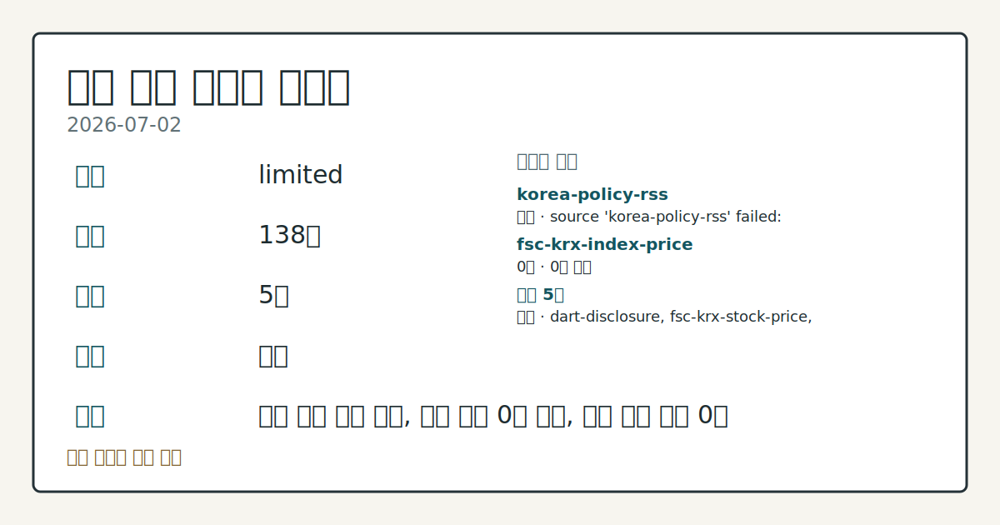
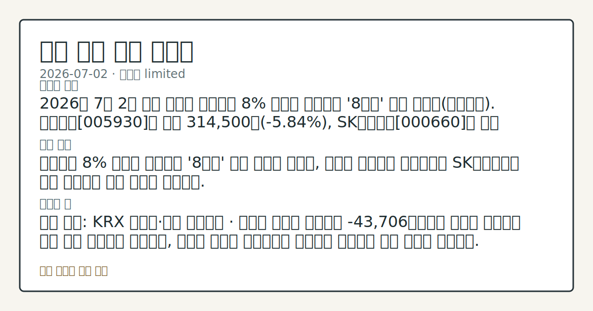

# 2026-07-02 국내 증시 시황
**기준 시각**: 2026-07-02 KST · 2026-07-01T15:00Z, 2026-07-02T15:00Z)
| 종목 | 종가 | 변동 | 비고 |
|------|------|------|------|
| ^KOSDAQ | 377.00 | — | — |
**세그먼트**: [국내 증시](2026-07-02.md) | [미국 증시](../../../us-equity/2026/07/2026-07-02.md) | [크립토](../../../crypto/2026/07/2026-07-02.md)

*이미지: 데이터 신뢰도 · 출처: investo 자체 생성 · 생성: investo 0.1.0 · 2026-07-02 UTC*
> **내 관심 자산 영향**: 데이터 수집 부족으로 매칭 판단 보류 — 추가 수집 후 재평가됩니다.
> **오늘의 결론**: 코스피 관련 정밀 수치는 이번 회차 코어 데이터 미수집으로 확정할 수 없습니다. SK하이닉스 관련 정밀 수치는 이번 회차 코어 데이터 미수집으로 확정할 수 없습니다. 코스닥 지수 종가 수치와 원/달러 환율은 이번 수집 항목에 포함되지 않아 확인되지 않는다. 수집 근거가 제한적입니다
> **핵심 동인**: 코스피 관련 정밀 수치는 이번 회차 코어 데이터 미수집으로 확정할 수 없습니다.
> **주의할 점**: 확인 소스: KRX 외국인·기관 매매동향 · 코스피 외국인 순매도가 -43,706억원에서 추가로 확대되면 하방 압력 지속으로 관찰되고, 순매도 본문 참고.
> 정보 제공용 자동 시황이며 매매 권유가 아닙니다.
## 한눈에 보기
코스피(KOSPI, 한국 유가증권시장 종합지수)가 **8%** 가까이 급락하며 '8천피' 선을 이탈했고, 코스닥(KOSDAQ, 코스닥시장지수)도 동반 약세 흐름을 보였다.
SK하이닉스[000660]가 17년 만의 최대 낙폭이라는 평가를 받을 정도로 급락했다는 보도가 이날 가장 두드러진 단일 이슈였다.
코스피 외국인 순매도 -43,706억원 규모가 오늘 본문 §③에서 확인할 핵심 변수다.
## ⓪ 오늘의 매크로
**국제 유가** — CFTC WTI crude oil managed_money net +82872 contracts
**미 국채 수익률** — UST curve 2026-07-02: 10Y 4.49%, 2Y10Y +0.35pp
## ⓪-B 채널 기준선
| 기준선 | 값 |
|------|------|
| 코스피 | 미수집 |
| 코스닥 | 377.00 (—) |
| 원/달러 | 미수집 |
> **크로스마켓 연결 고리**: 유가/지정학 이슈가 여러 자산군의 변동성 연결 고리로 관찰됩니다. / 금리 이벤트가 할인율/달러 경로의 공통 변수로 남아 있습니다.
> **오늘의 큰 그림:** 유가와 지정학 변수가 공통 변수지만, 원/달러와 국내 수급를 먼저 확인해야 합니다.
## ① 요약

*이미지: 시장 스냅샷 · 출처: investo 자체 생성 · 생성: investo 0.1.0 · 2026-07-02 UTC*

코스피 관련 정밀 수치는 이번 회차 코어 데이터 미수집으로 확정할 수 없습니다. SK하이닉스 관련 정밀 수치는 이번 회차 코어 데이터 미수집으로 확정할 수 없습니다. 코스닥 지수 종가 수치와 원/달러 환율은 이번 수집 항목에 포함되지 않아 확인되지 않는다. 뉴욕증시가 미국 6월 비농업 고용지표를 소화하며 상승 출발한 점([연합뉴스](https://www.yna.co.kr/view/AKR20260702171500009))은 이날 국내 개장 초반 투자심리에 참고가 됐던 것으로 보이나, 장중 반도체 대형주의 급격한 낙폭이 부각되며 지수는 이를 상쇄하고 하락 마감했다. 최근 며칠간 이어져 온 외국인 순매도 흐름이 오늘도 이어진 모습이다.

[하락 관찰]

## ② 전일 핵심 이슈

코스피 관련 정밀 수치는 이번 회차 코어 데이터 미수집으로 확정할 수 없습니다. 뉴욕증시는 전일 미국 6월 비농업 고용지표를 소화하며 상승 출발했으나, 이는 국내 개장 초반 심리에만 참고 요인으로 작용했을 뿐 반도체 대형주 낙폭을 상쇄하지는 못했다.

> **그래서 의미는?** 반도체 대형주 급락이 지수 하락을 이끌었다는 점을 보여줍니다.

### 코스피, '8천피' 이탈하며 하락 마감

2일 코스피가 8% 가까이 내려 '8천피'를 내준 가운데, 한동안 고공행진을 보이던 코스피 변동성지수는 오히려 하락하는 엇갈린 모습을 보였다([연합뉴스](https://www.yna.co.kr/view/AKR20260702122000008)). 이는 지수 급락과 시장 체감 불안 지표 간 괴리를 보여주는 대목이다.

### 삼성전자·SK하이닉스 동반 급락

삼성전자 관련 정밀 수치는 이번 회차 코어 데이터 미수집으로 확정할 수 없습니다. 공시 데이터 기준 종가는 삼성전자 314,500원(**-5.84%**), SK하이닉스 2,560,000원(**-3.40%**)으로 집계됐다([공시 데이터](https://www.data.go.kr/data/15094808/openapi.do)).

## ③ 섹터/수급 동향

코스피·코스닥 모두 외국인과 기관이 동반 순매도에 나선 가운데 개인이 순매수로 대응한 하루였다. 2차전지 관련 종목의 가격 데이터는 이번 수집 항목에 포함되지 않았다.

> **그래서 의미는?** 외국인과 기관의 동반 매도가 반도체 수급 부담으로 이어졌음을 뜻합니다.

### 외국인·기관 동반 매도, 개인 순매수로 대응

KRX(한국거래소) 매매동향에 따르면 코스피에서는 외국인이 -43,706억원, 기관이 -20,825억원 순매도한 반면 개인은 +62,413억원 순매수했다. 코스닥에서도 외국인 -1,942억원, 기관 -3,091억원 순매도 속에 개인이 +4,859억원 순매수했다([Naver finance KRX mirror](https://finance.naver.com/sise/investorDealTrendDay.naver?bizdate=20260702&sosok=01)).

### 반도체 대형주 급락과 레버리지 상품 손실

삼성전자와 SK하이닉스의 급락이 이어진 가운데, 미국발 기술주 한파에 두 종목의 단일종목 레버리지 상품 수익률도 연이틀 급락했다는 보도가 나왔다([연합뉴스](https://www.yna.co.kr/view/AKR20260702084051008)).

### 국민연금 자산배분 조정과 대체거래소(NXT) 확대

정은경 보건복지부 장관은 국민연금의 자산배분 조정이 시장에 미치는 영향을 최소화하도록 운용 과정을 모니터링하겠다고 밝혔다([연합뉴스](https://www.yna.co.kr/view/AKR20260702153800530)). 한편 국내 첫 대체거래소인 NXT(넥스트레이드)에는 모간스탠리증권 서울지점과 메릴린치증권 서울지점이 합류하며 외국계 회원사가 3곳으로 늘었다([연합뉴스](https://www.yna.co.kr/view/AKR20260702151000008)).

## ④ 지표·이벤트

미국 6월 고용 지표가 예상을 하회한 가운데, 국내 국고채 금리는 물가 상승 발표에도 일제히 하락했다.

> **그래서 의미는?** 미국 고용 둔화와 국내 금리 하락이 겹쳐 통화정책 기대가 흔들릴 수 있습니다.

### 미국 6월 비농업 고용, 예상 하회

미 노동부 노동통계국은 6월 비농업 일자리가 전월 대비 5만7천명 증가했다고 밝혔으며, 이는 시장 예상치를 크게 밑도는 수준이다. 실업률은 **4.2%**로 집계됐다([연합뉴스](https://www.yna.co.kr/view/AKR20260702169600072)).

### 국고채 금리 하락, 3년물 **3.747%**

2일 국고채 금리는 지난달 소비자 물가가 큰 폭으로 올랐다는 발표에도 일제히 하락 마감했으며, 3년물은 연 **3.747%**를 기록했다([연합뉴스](https://www.yna.co.kr/view/AKR20260702144751008)).

## ⑤ 주요 종목

NAVER[035420], 셀트리온[068270], 현대차[005380] 등 대형주 가격 변동과 함께 여러 종목의 지분·자본 변동, 신규 상장 이슈가 확인됐다.

> **그래서 의미는?** NAVER(네이버), 현대차 등 대형주 약세 속 개별 종목 이슈도 함께 살펴볼 대목입니다.

### 가격 변동 확인

NAVER[035420]는 197,400원(**-0.80%**), 현대차[005380]는 487,500원으로 하락 마감했다. 셀트리온[068270]은 174,500원으로 상승 마감했다([공시 데이터](https://www.data.go.kr/data/15094808/openapi.do)).

### 지분·자본 변동 확인 항목

한미그룹 창업주 차남인 임종훈 한미정밀화학 대표가 한미사이언스[008930] 지분 **2.5%**를 매각했다([연합뉴스](https://www.yna.co.kr/view/AKR20260702161700017)). 큐에이드[377460]는 위니아 주식 849억원어치를 취득해 지분율 **19.7%**를 확보했다고 밝혔다([연합뉴스](https://www.yna.co.kr/view/AKR20260702157300008)). 광진실업[026910]은 제3자배정 유상증자로 50억원을 조달하기로 했고([연합뉴스](https://www.yna.co.kr/view/AKR20260702156300008)), 아이엘[307180]은 종속회사 아이엘모빌리티 주식을 100억원에 추가 취득했다([연합뉴스](https://www.yna.co.kr/view/AKR20260702154300008)). 삼성전기[009150]는 유리기판 소재 합작법인 '글라셈'을 설립해 지분 66%를 확보했다([연합뉴스](https://www.yna.co.kr/view/AKR20260702138951008)).

### 신규 상장 및 애프터마켓 변동 체크리스트

레몬헬스케어는 코스닥 신규 상장이 승인돼 6일 거래가 개시될 예정이다([연합뉴스](https://www.yna.co.kr/view/AKR20260702159600008)). 포스코엠텍[009520]과 DI동일[001530]은 이날 애프터마켓에서 각각 11%대, 10%대 급등을 나타냈다([연합뉴스](https://www.yna.co.kr/view/AKR20260702148200008), [연합뉴스](https://www.yna.co.kr/view/AKR20260702140700008)).

## ⑥ 오늘의 관전 포인트

> **관전 포인트**: 구조화 가능한 관찰 신호가 부족합니다 — 본문 §②·§④ 참조

> **데이터 상태**: 제한

수집/품질 진단

> **데이터 상태**: 제한 — 수집 138건 / 소스 5개 / 누락: 없음 · 제한 — 핵심 가격 소스 0건/실패/stale, 본문 결론 신뢰도 낮음
> **소스 카운트**: 수집 대상 7 / 성공 5 / 수집 상세는 진단 섹션에서 확인할 수 있습니다. / 수집 상세는 진단 섹션에서 확인할 수 있습니다. / 수집 상세는 진단 섹션에서 확인할 수 있습니다.
> **소스 등급 분포**: S=2 / A=2 / B=1
> **상세 사유**: 일부 소스 수집 실패, 일부 소스 0건 반환, 핵심 가격 소스 0건
> **소스별 상태**: korea-policy-rss 실패 (일시적 수집 오류), fsc-krx-index-price 0건, 정상 5개

## ⑦ 면책조항
본 시황은 일반 정보 제공을 목적으로 자동 생성된 자료이며,
특정 종목·자산에 대한 매매 권유나 투자 자문이 아닙니다.
투자 결정과 그 결과에 대한 책임은 전적으로 본인에게 있으며,
본 시황의 내용에 따라 발생한 손실에 대해 작성자는 일체의 책임을 지지 않습니다.