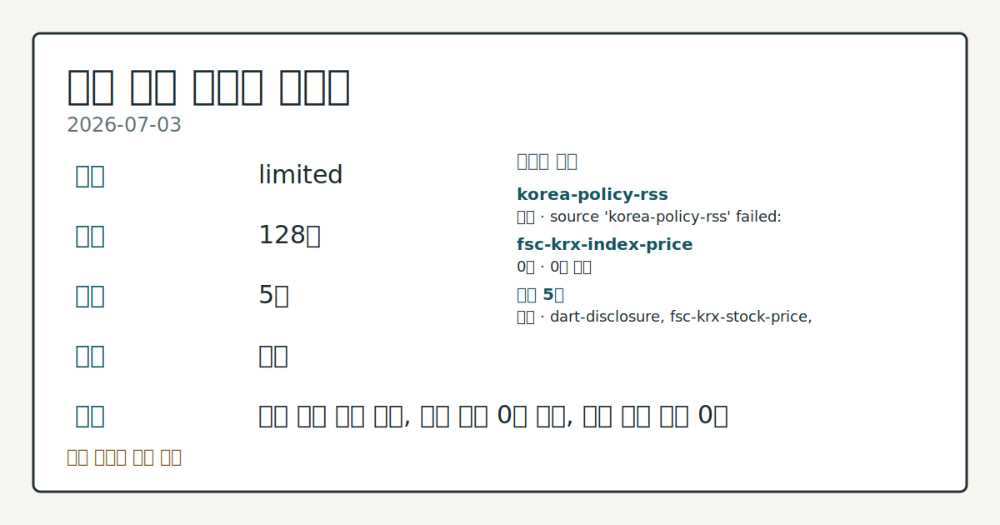
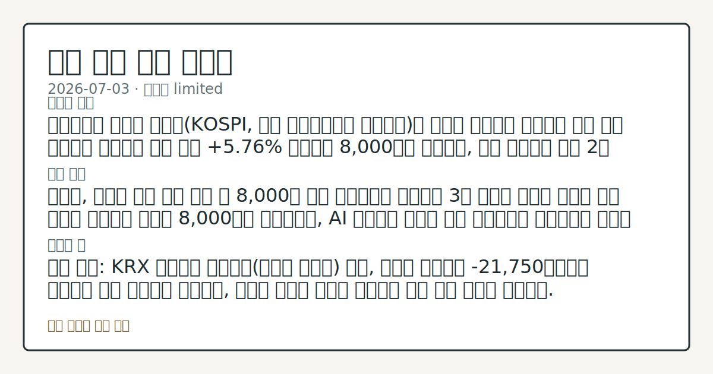

# 2026-07-03 국내 증시 시황
**기준 시각**: 2026-07-03 KST · 2026-07-02T15:00Z, 2026-07-03T15:00Z)
| 종목 | 종가 | 변동 | 비고 |
|------|------|------|------|
| ^KOSDAQ | 340.00 | — | — |
**세그먼트**: [국내 증시](2026-07-03.md) | [미국 증시](../../../us-equity/2026/07/2026-07-03.md) | [크립토](../../../crypto/2026/07/2026-07-03.md)

*이미지: 데이터 신뢰도 · 출처: investo 자체 생성 · 생성: investo 0.1.0 · 2026-07-04 UTC*
> **내 관심 자산 영향**: 데이터 수집 부족으로 매칭 판단 보류 — 추가 수집 후 재평가됩니다.
> **오늘의 결론**: 코스피 관련 정밀 수치는 이번 회차 코어 데이터 미수집으로 확정할 수 없습니다. 수집 근거가 제한적입니다
> **핵심 동인**: 코스피(KOSPI, 한국 유가증권시장 종합지수), 반도체 대형주 반등 보도에도 개별 종목은 큰 폭 하락 전일(2026-07-02) 컨텍스트는 코어 데이터 미수집으로 결론을 확정하지 못했던 반면, 오늘은 연합뉴스가 "코스피, **5.76%** 급반등 8,000선 회복…장중 변동폭 역대 2위"라고 보도(연합뉴스)하며 반도체 대형주 중심의 반발 매수세가 지수 반등을 이끌었다고 전했다.
> **주의할 점**: 삼성전자 관련 정밀 수치는 이번 회차 코어 데이터 미수집으로 확정할 수 없습니다. 관심 영향: 반도체 대형주 수급 확인. 확인 소스: 공공데이터포털 본문 참고.
> 정보 제공용 자동 시황이며 매매 권유가 아닙니다.
## 한눈에 보기
코스피 관련 정밀 수치는 이번 회차 코어 데이터 미수집으로 확정할 수 없습니다.
SK하이닉스 관련 정밀 수치는 이번 회차 코어 데이터 미수집으로 확정할 수 없습니다.
코스피 외국인은 -21,750억원 순매도를 이어갔고 기관은 +44,079억원 순매수로 대응했다 — 수급 엇갈림 지속 여부는 본문 §③에서 확인 가능하다.
## ⓪ 오늘의 매크로
**FOMC 일정** — 2026-07-08 — FOMC Minutes
**국제 유가** — CFTC WTI crude oil managed_money net +82872 contracts
**미 국채 수익률** — UST curve 2026-07-02: 10Y 4.49%, 2Y10Y +0.35pp
## ⓪-B 채널 기준선
| 기준선 | 값 |
|------|------|
| 코스피 | 미수집 |
| 코스닥 | 340.00 (—) |
| 원/달러 | 미수집 |
> **크로스마켓 연결 고리**: 유가/지정학 이슈가 여러 자산군의 변동성 연결 고리로 관찰됩니다. / 금리 이벤트가 할인율/달러 경로의 공통 변수로 남아 있습니다.
> **오늘의 큰 그림:** 금리와 달러 변수가 공통 변수지만, KOSPI·원/달러·외국인 수급를 먼저 확인해야 합니다.
## ① 요약

*이미지: 시장 스냅샷 · 출처: investo 자체 생성 · 생성: investo 0.1.0 · 2026-07-04 UTC*

코스피 관련 정밀 수치는 이번 회차 코어 데이터 미수집으로 확정할 수 없습니다. 원/달러 환율은 이번 회차 입력 자료에 포함되지 않아 환율 데이터 미수집 상태다. 전일 미국 3대 지수(다우·S&P 500·나스닥) 관련 자료는 이번 회차에 수집되지 않아 금일 국내 개장에 대한 구체적 연관성은 확인이 어렵다. 삼성전자 관련 정밀 수치는 이번 회차 코어 데이터 미수집으로 확정할 수 없습니다. [혼재]

## ② 전일 핵심 이슈

### 코스피, 반도체 대형주 반등 보도에도 개별 종목은 큰 폭 하락

전일(2026-07-02) 컨텍스트는 코어 데이터 미수집으로 결론을 확정하지 못했던 반면, 오늘은 연합뉴스가 "코스피, **5.76%** 급반등 8,000선 회복…장중 변동폭 역대 2위"라고 보도([연합뉴스](https://www.yna.co.kr/view/AKR20260703118500008))하며 반도체 대형주 중심의 반발 매수세가 지수 반등을 이끌었다고 전했다. 그러나 같은 날 개별 종목 데이터 기준으로는 삼성전자[005930]가 286,000원(**-9.06%**, -28,500원)([자료](https://www.data.go.kr/data/15094808/openapi.do)), SK하이닉스[000660]가 2,187,000원([자료](https://www.data.go.kr/data/15094808/openapi.do))으로 마감해 지수 서사와 개별 종목 등락이 엇갈렸다. 시세 데이터 기준 코스닥(KOSDAQ, 코스닥시장 지수)은 340.00으로 집계됐다([자료](https://www.yna.co.kr/market-plus/all)).

> **그래서 의미는?** 지수는 반등했다는 보도지만 반도체 대장주 두 곳은 큰 폭 하락해 방향이 엇갈린다.

### 코스닥, 개인 순매수 속 기관·외국인 순매도

코스닥에서는 개인이 +1,075억원 순매수([자료](https://finance.naver.com/sise/investorDealTrendDay.naver?bizdate=20260703&sosok=02))한 반면 기관은 -1,037억원, 외국인은 -202억원 순매도를 기록해 개인과 기관·외국인 수급이 엇갈렸다.

## ③ 섹터/수급 동향

### 코스피 수급, 기관 순매수가 개인·외국인 순매도 상당폭 상쇄

코스피에서는 기관이 +44,079억원 순매수, 기타 부문이 +614억원 순매수를 기록한 반면, 개인은 -22,942억원, 외국인은 -21,750억원 순매도를 나타냈다([자료](https://finance.naver.com/sise/investorDealTrendDay.naver?bizdate=20260703&sosok=01)).

> **그래서 의미는?** 개인·외국인이 던진 물량을 기관이 받아내는 구조로 수급 주체가 엇갈린다.

### 반도체 대형주, 지수 반등 서사와 달리 큰 폭 하락 마감

코스피 관련 정밀 수치는 이번 회차 코어 데이터 미수집으로 확정할 수 없습니다. 2차전지 관련 종목의 가격 데이터는 이번 회차 입력에 포함되지 않았다.

## ④ 지표·이벤트

### ETF(상장지수펀드) 2종, 7일 유가증권시장 상장 예정

한국거래소는 키움투자자산운용과 한국투자신탁운용의 ETF(상장지수펀드) 총 2종목이 오는 7일 유가증권시장에 상장한다고 밝혔다([연합뉴스](https://www.yna.co.kr/view/AKR20260703119700008)).

> **그래서 의미는?** 새로운 테마 ETF 상장으로 관련 자금 유입 경로가 하나 늘어난다.

### 국고채 금리 혼조, 3년물 연 **3.748%**

국고채 금리는 이날 혼조세를 보였으며 3년물은 연 **3.748%**를 기록했다([연합뉴스](https://www.yna.co.kr/view/AKR20260703129151008)). 전국 경유 가격은 1천800원대로 하락세를 이어갔고 휘발윳값도 하락세가 지속됐다([연합뉴스](https://www.yna.co.kr/view/AKR20260703136100003)).

## ⑤ 주요 종목

### 확인 항목: 가격 변동 확인

NAVER[035420]는 199,900원(**+1.27%**, +2,500원)([자료](https://www.data.go.kr/data/15094808/openapi.do)), 셀트리온[068270]은 176,600원(**+1.20%**, +2,100원)([자료](https://www.data.go.kr/data/15094808/openapi.do))으로 상승 마감했고, 현대차[005380]는 482,000원([자료](https://www.data.go.kr/data/15094808/openapi.do))으로 하락 마감했다.

> **그래서 의미는?** NAVER(네이버)·셀트리온은 소폭 상승, 현대차는 소폭 하락으로 방향이 엇갈렸다.

### 체크리스트: 자금조달·공시 확인

미래에셋증권[006800]이 1조원이 넘는 자금조달을 추진 중인 것으로 전해졌다([연합뉴스](https://www.yna.co.kr/view/AKR20260703151000008)). 코스닥 상장사 시선AI[340810]는 약 10억원 규모의 제3자배정 유상증자를 결정했고([연합뉴스](https://www.yna.co.kr/view/AKR20260703144200008); [DART](https://dart.fss.or.kr/dsaf001/main.do?rcpNo=20260703000651)), 베노티앤알[206400]은 100억원([연합뉴스](https://www.yna.co.kr/view/AKR20260703136400008); [DART](https://dart.fss.or.kr/dsaf001/main.do?rcpNo=20260703000577)), 케이피엠테크[042040]는 225억원 규모의 제3자배정 유상증자를 각각 결정했다고 DART(전자공시시스템)에 공시했다([연합뉴스](https://www.yna.co.kr/view/AKR20260703129000008)).

### 관전 분류: 이슈 코멘트

메리츠금융그룹은 홈플러스 회생계획안의 법원 폐지 결정에 대해 "매우 안타깝게 생각한다"며 최대주주 MBK의 책임을 언급했다([연합뉴스](https://www.yna.co.kr/view/AKR20260703122200008)). 깨끗한나라[004540]는 공공생리대 지원 시범사업 소식에 상승했다([연합뉴스](https://www.yna.co.kr/view/AKR20260703033951008)).

## ⑥ 오늘의 관전 포인트

#### 관찰 신호: SK하이닉스[000660] 종

- 출처: 공공데이터포털 KRX 종목시세
- 현재: 공공데이터포털 KRX 종목시세 · SK하이닉스[000660] 종가 2,187,000원이 당일 고가 2,448,000원 방향으로 회복되는지 확인, 당일 저가와 같은 2,187,000원을 추가로 이탈하는지 점검. 관심 영향: 반도체 밸류체인 전반의 변동성 확대 여부.
- 확인 조건: 상방 SK하이닉스[000660] 종가 2,187,000원이 당일 고가 2,448,000원 방향으로 회복되는지 확인; 하방 당일 저가와 같은 2,187,000원을 추가로 이탈하는지 점검
- 신뢰도: 높음
- 관심 영향: 반도체 밸류체인 전반의 변동성 확대 여부.

#### 관찰 신호: 코스피

- 출처: 연합뉴스 마켓+
- 현재: 연합뉴스 마켓+ · 코스피가 8,000선을 상회 유지하면 반등 흐름 지속 관찰, 8,000선을 하회 이탈하면 되돌림 흐름 점검. 관심 영향: 지수 반등의 지속성 확인.
- 확인 조건: 상방 코스피가 8,000선을 상회 유지하면 반등 흐름 지속 관찰; 하방 8,000선을 하회 이탈하면 되돌림 흐름 점검
- 신뢰도: 낮음
- 관심 영향: 지수 반등의 지속성 확인.

#### 관찰 신호: 국고채 3년물 금리

- 출처: 연합뉴스 채권 시황
- 현재: 연합뉴스 채권 시황 · 국고채 3년물 금리가 **3.748%**를 상회하면 금리 부담 재부각 관찰, **3.748%**를 하회 안정되면 금리 하향 안정 흐름 점검. 관심 영향: 금리 민감 업종 밸류에이션 재평가 필요가 있다.
- 확인 조건: 상방 국고채 3년물 금리가 **3.748%**를 상회하면 금리 부담 재부각 관찰; 하방 **3.748%**를 하회 안정되면 금리 하향 안정 흐름 점검
- 신뢰도: 높음
- 관심 영향: 금리 민감 업종 밸류에이션 재평가 필요가 있다.

> **데이터 상태**: 제한

수집/품질 진단

> **데이터 상태**: 제한 — 수집 140건 / 소스 5개 / 누락: 없음 · 제한 — 핵심 가격 소스 0건/실패/stale, 본문 결론 신뢰도 낮음
> **소스 카운트**: 수집 대상 7 / 성공 5 / 수집 상세는 진단 섹션에서 확인할 수 있습니다. / 수집 상세는 진단 섹션에서 확인할 수 있습니다. / 수집 상세는 진단 섹션에서 확인할 수 있습니다.
> **소스 등급 분포**: S=2 / A=2 / B=1
> **상세 사유**: 일부 소스 수집 실패, 일부 소스 0건 반환, 핵심 가격 소스 0건
> **소스별 상태**: korea-policy-rss 실패 (수집 불가), fsc-krx-index-price 0건, 정상 5개

## ⑦ 면책조항
본 시황은 일반 정보 제공을 목적으로 자동 생성된 자료이며,
특정 종목·자산에 대한 매매 권유나 투자 자문이 아닙니다.
투자 결정과 그 결과에 대한 책임은 전적으로 본인에게 있으며,
본 시황의 내용에 따라 발생한 손실에 대해 작성자는 일체의 책임을 지지 않습니다.