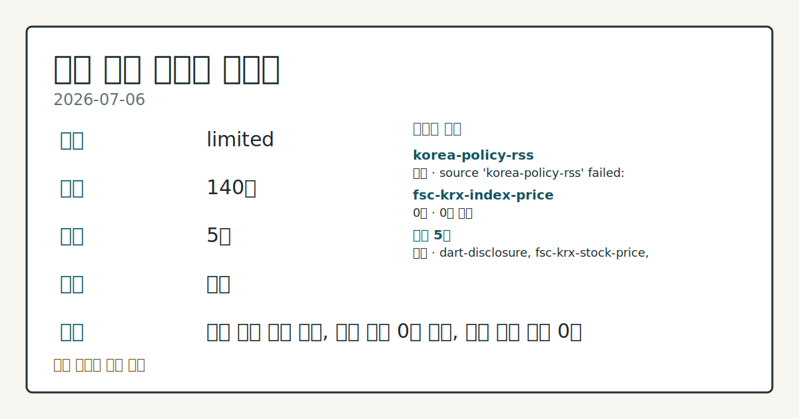
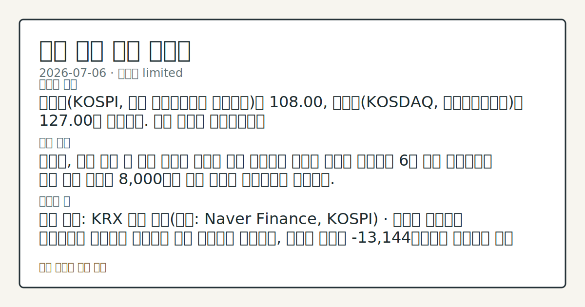

# 2026-07-06 국내 증시 시황
**기준 시각**: 2026-07-06 KST · 2026-07-05T15:00Z, 2026-07-06T15:00Z)
**세그먼트**: [국내 증시](2026-07-06.md) | [미국 증시](../../../us-equity/2026/07/2026-07-06.md) | [크립토](../../../crypto/2026/07/2026-07-06.md)

*이미지: 데이터 신뢰도 · 출처: investo 자체 생성 · 생성: investo 0.1.0 · 2026-07-06 UTC*
> **내 관심 자산 영향**: 데이터 수집 부족으로 매칭 판단 보류 — 추가 수집 후 재평가됩니다.
> **오늘의 결론**: 코스피(KOSPI, 한국 유가증권시장 종합지수)는 108.00, 코스닥(KOSDAQ, 코스닥종합지수)은 127.00을 나타냈다. 수집 근거가 제한적입니다
> **핵심 동인**: 코스피, 상승 출발 후 하락 전환해 약보합 마감 연합뉴스 보도에 따르면 코스피는 6일 상승 출발했으나 장중 하락 전환해 8,000선을 겨우 지키는 약보합으로 마감했다.
> **주의할 점**: 확인 소스: KRX 수급 동향(출처: Naver Finance, KOSPI) · 외국인 순매도가 축소되거나 순매수로 전환되면 수급 개선으로 관찰하고 본문 참고.
> 정보 제공용 자동 시황이며 매매 권유가 아닙니다.
## 한눈에 보기
코스피는 **108.00**, 코스닥은 **127.00**을 나타냈으며, 코스피는 상승 출발 후 하락 전환해 8,000선을 겨우 지키는 약보합 마감을 기록했다.
SK하이닉스 관련 정밀 수치는 이번 회차 코어 데이터 미수집으로 확정할 수 없습니다.
KOSPI 외국인 순매도(-13,144억원)·기관 순매도(-14,618억원) 규모가 개인 순매수(+26,829억원)와 엇갈렸다 — 수급 방향은 본문 §③ 참조.
## ⓪ 오늘의 매크로
**미 국채 수익률** — UST curve 2026-07-06: 10Y 4.48%, 2Y10Y +0.35pp
> **크로스마켓 연결 고리**: 금리 이벤트가 할인율/달러 경로의 공통 변수로 남아 있습니다.
> **오늘의 큰 그림:** 이 세그먼트의 공통 신호는 제한적입니다. 본문 수급·지표 항목을 먼저 확인하세요.
## ① 요약

*이미지: 시장 스냅샷 · 출처: investo 자체 생성 · 생성: investo 0.1.0 · 2026-07-06 UTC*

코스피는 108.00, 코스닥은 127.00을 나타냈다. [연합뉴스](https://www.yna.co.kr/view/AKR20260706113951008)에 따르면 코스피는 6일 상승 출발한 뒤 하락 전환해 8,000선을 겨우 지키는 약보합 마감을 기록했다. 원/달러 환율은 이번 회차 입력에 수치가 없어 환율 데이터 미수집으로 남겨둔다. 삼성전자 관련 정밀 수치는 이번 회차 코어 데이터 미수집으로 확정할 수 없습니다. [혼재]

## ② 전일 핵심 이슈

### 코스피, 상승 출발 후 하락 전환해 약보합 마감

[연합뉴스](https://www.yna.co.kr/view/AKR20260706113951008) 보도에 따르면 코스피는 6일 상승 출발했으나 장중 하락 전환해 8,000선을 겨우 지키는 약보합으로 마감했다. 같은 시점 [stooq-kr-market] 코스피 108.00, 코스닥 127.00으로 나타났다. 지난 3일 반도체 반발 매수 흐름 속에 8,000선을 회복했던 것과 달리, 이번에는 장 초반 상승분을 반납하며 되돌림을 보였다는 점에서 최근 흐름과 이탈이 나타난다.

> **그래서 의미는?** 코스피가 오전 상승분을 반납하며 8,000선까지 후퇴했다는 뜻입니다.

### 뉴욕증시 혼조 출발, 국내 개장 심리에 영향

[연합뉴스](https://www.yna.co.kr/view/AKR20260706156200009)에 따르면 뉴욕증시 3대 지수는 기술주가 반등하는 가운데 혼조세로 출발했다. 이 흐름은 국내 개장 초반 코스피가 상승 출발한 배경 중 하나로 관찰되며, 이후 국내 장중 자체 수급(외국인·기관 순매도)에 의해 되돌림이 이어진 것으로 볼 수 있다 — 이는 국내 개장 심리에 대한 영향으로 한정한 해석이다.

## ③ 섹터/수급 동향

### 코스피·코스닥 수급, 외국인·기관 순매도 속 개인 순매수 확대

[KRX 수급 동향](https://finance.naver.com/sise/investorDealTrendDay.naver?bizdate=20260706&sosok=01)에 따르면 KOSPI에서 개인은 +26,829억원 순매수, 기관은 -14,618억원 순매도, 외국인은 -13,144억원 순매도, 기타는 +933억원 순매수를 기록했다. [KOSDAQ 수급](https://finance.naver.com/sise/investorDealTrendDay.naver?bizdate=20260706&sosok=02) 역시 개인 +2,591억원 순매수, 기관 -2,244억원 순매도, 외국인 -447억원 순매도, 기타 +100억원 순매수로 유사한 구도를 보였다.

> **그래서 의미는?** 반도체주는 급등했지만 외국인·기관 자금은 순매도로 빠져나갔다는 뜻입니다.

### 반도체 대형주, 급등 흐름

삼성전자 관련 정밀 수치는 이번 회차 코어 데이터 미수집으로 확정할 수 없습니다. 2차전지 관련 종목의 가격 데이터는 이번 회차 입력에 포함되지 않았다.

### 폴더블폰 패널 시장, 회복 기대감

[연합뉴스](https://www.yna.co.kr/view/AKR20260706121000017)는 지난해 조정기를 거친 폴더블 스마트폰 패널 시장이 애플 참전 기대 속에 올해 다시 성장세로 돌아설 것이라는 분석을 전했다.

## ④ 지표·이벤트

### 국고채 금리, 3년물 연 **3.776%**로 상승 마감

[연합뉴스](https://www.yna.co.kr/view/AKR20260706127351008)에 따르면 6일 국고채(국가가 발행하는 채권) 금리가 일제히 상승 마감했으며, 3년물은 연 **3.776%**를 기록했다. 환율 상승 이후 국고채 금리는 하락했다가 다시 반등한 것으로 [보도](https://www.yna.co.kr/view/AKR20260706127300008)됐다.

> **그래서 의미는?** 국고채 금리 상승은 시장 전반의 자금 조달 비용과 연관된 지표라는 뜻입니다.

### 홈플러스 피해기업 지원 및 코스닥 상장예비심사

[연합뉴스](https://www.yna.co.kr/view/AKR20260706136300002)에 따르면 신용보증기금(신보)이 홈플러스 회생절차 폐지로 피해를 본 중소·중견기업에 최대 3천억원 규모의 긴급 유동성을 지원할 계획이다. 또한 [연합뉴스](https://www.yna.co.kr/view/AKR20260706132600008)에 따르면 동승·셀트릭스·에프엠더블유·엠디에스코리아 등 4개사가 코스닥시장본부에 상장예비심사를 신청했다.

## ⑤ 주요 종목

### 지수 구성 대형주

[fsc-krx-stock-price](https://www.data.go.kr/data/15094808/openapi.do) 자료에 따르면 NAVER[035420]는 **-2.05%** 하락한 195,800원, 셀트리온[068270]은 **+3.96%** 상승한 183,600원, 현대차[005380]는 **+2.07%** 상승한 492,000원을 기록했다.

> **그래서 의미는?** NAVER·셀트리온·현대차 등 대형주 등락이 오늘 지수 구성에 영향을 줬다는 뜻입니다.

### 애프터마켓 변동 종목

[연합뉴스](https://www.yna.co.kr/view/AKR20260706134500008)에 따르면 LX세미콘[108320]이 애프터마켓에서 10%대 급등했고, [인투셀](https://www.yna.co.kr/view/AKR20260706132900008)[287840]과 [한일시멘트](https://www.yna.co.kr/view/AKR20260706127600008)[300720] 역시 애프터마켓에서 10%대 급등했다.

### 지배구조·자본거래 공시

[연합뉴스](https://www.yna.co.kr/view/AKR20260706134900003)에 따르면 SK하이닉스는 최근 주가를 반영해 ADR(미국주식예탁증서) 발행 총액을 45조원에서 43조원으로 정정했다. [연합뉴스](https://www.yna.co.kr/view/AKR20260706125800017)에 따르면 네이버파이낸셜의 두나무 완전자회사 포함을 위한 주식교환 일정이 12월31일로 다시 연기됐다. DART(전자공시시스템)에는 [롯데바이오로직스 유상증자결정](https://dart.fss.or.kr/dsaf001/main.do?rcpNo=20260706000510), [롯데지주 유상증자결정](https://dart.fss.or.kr/dsaf001/main.do?rcpNo=20260706800855), [삼부토건 최대주주변경](https://dart.fss.or.kr/dsaf001/main.do?rcpNo=20260706800854), [위메이드 대량보유상황보고서](https://dart.fss.or.kr/dsaf001/main.do?rcpNo=20260706000473), [호텔신라 자기주식처분 정정](https://dart.fss.or.kr/dsaf001/main.do?rcpNo=20260706000509) 등이 접수됐다.

## ⑥ 오늘의 관전 포인트

#### 관찰 신호: 3년물 국고채 금리

- 출처: 연합뉴스 국고채 금리 보도
- 현재: 연합뉴스 국고채 금리 보도 · 3년물 국고채 금리가 연 **3.776%**를 상회하는 흐름이 이어지면 금리 상승 압력으로 관찰하고, **3.776%**를 하회로 반전하면 안정 신호로 관찰한다. 관심 영향: 채권시장 변동 추세 살피기.
- 확인 조건: 상방 3년물 국고채 금리가 연 **3.776%**를 상회하는 흐름이 이어지면 금리 상승 압력으로 관찰하고; 하방 **3.776%**를 하회로 반전하면 안정 신호로 관찰한다
- 신뢰도: 높음
- 관심 영향: 채권시장 변동 추세 살피기.

> **데이터 상태**: 제한

수집/품질 진단

> **데이터 상태**: 제한 — 수집 140건 / 소스 5개 / 누락: 없음 · 제한 — 핵심 가격 소스 0건/실패/stale, 본문 결론 신뢰도 낮음
> **소스 카운트**: 수집 대상 7 / 성공 5 / 수집 상세는 진단 섹션에서 확인할 수 있습니다. / 수집 상세는 진단 섹션에서 확인할 수 있습니다. / 수집 상세는 진단 섹션에서 확인할 수 있습니다.
> **소스 등급 분포**: S=2 / A=2 / B=1
> **상세 사유**: 일부 소스 수집 실패, 일부 소스 0건 반환, 핵심 가격 소스 0건
> **소스별 상태**: korea-policy-rss 실패 (수집 불가), fsc-krx-index-price 0건, 정상 5개

## ⑦ 면책조항
본 시황은 일반 정보 제공을 목적으로 자동 생성된 자료이며,
특정 종목·자산에 대한 매매 권유나 투자 자문이 아닙니다.
투자 결정과 그 결과에 대한 책임은 전적으로 본인에게 있으며,
본 시황의 내용에 따라 발생한 손실에 대해 작성자는 일체의 책임을 지지 않습니다.