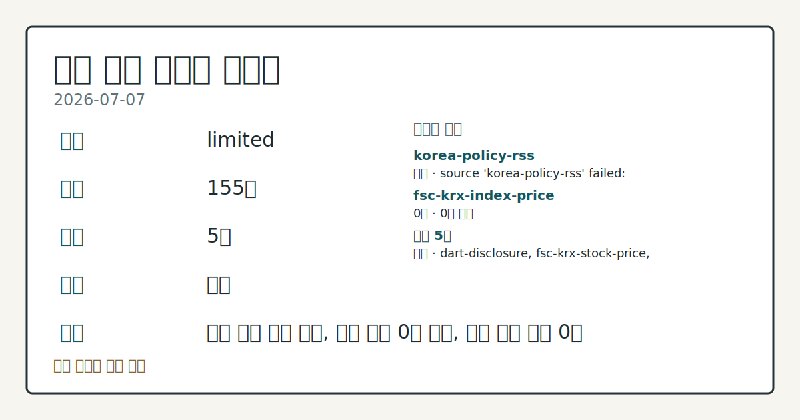
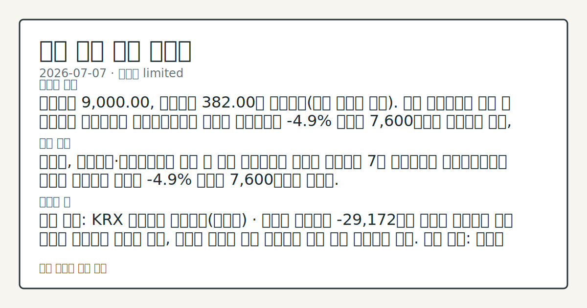

# 2026-07-07 국내 증시 시황
**기준 시각**: 2026-07-07 KST · 2026-07-06T15:00Z, 2026-07-07T15:00Z)
| 종목 | 종가 | 변동 | 비고 |
|------|------|------|------|
| ^KOSPI | 9,000.00 | — | — |
| ^KOSDAQ | 382.00 | — | — |
**세그먼트**: [국내 증시](2026-07-07.md) | [미국 증시](../../../us-equity/2026/07/2026-07-07.md) | 크립토(미발행)

*이미지: 데이터 신뢰도 · 출처: investo 자체 생성 · 생성: investo 0.1.0 · 2026-07-07 UTC*
> **내 관심 자산 영향**: 데이터 수집 부족으로 매칭 판단 보류 — 추가 수집 후 재평가됩니다.
> **오늘의 결론**: 코스피는 9,000.00, 코스닥은 382.00을 나타냈다(시황 데이터 기준). 다만 연합뉴스는 같은 날 코스피가 사이드카와 서킷브레이커를 연달아 발동시키며 **-4.9%** 급락해 7,600선까지 밀렸다고 전해, 출처 간 수치 차이가 확인된다. 수집 근거가 제한적입니다
> **핵심 동인**: 코스피, 사이드카·서킷브레이커 발동 속 급락 연합뉴스에 따르면 코스피는 7일 사이드카와 서킷브레이커가 잇따라 발동되는 가운데 **-4.9%** 급락해 7,600선까지 밀렸다.
> **주의할 점**: 확인 소스: KRX 투자자별 매매동향(코스피) · 외국인 순매도가 -29,172억원 수준을 유지하면 수급 공백이 이어지는 것으로 관찰, 순매도 본문 참고.
> 정보 제공용 자동 시황이며 매매 권유가 아닙니다.
## 한눈에 보기
코스피(KOSPI, 한국 유가증권시장 종합지수), 사이드카·서킷브레이커 발동 속 **-4.9%** 급락해 7,600선까지 밀렸고 코스닥(KOSDAQ, 코스닥시장 지수)은 382.00 마감.
삼성전자, 역대급 2분기 영업이익 발표에도 연합뉴스 기준 7% 가까이 급락.
코스피 외국인 순매도 -29,172억원 — 본문 §③ 참조.
## ⓪ 오늘의 매크로
**미 국채 수익률** — UST curve 2026-07-07: 10Y 4.55%, 2Y10Y +0.36pp
## ⓪-B 채널 기준선
| 기준선 | 값 |
|------|------|
| 코스피 | 9,000.00 (—) |
| 코스닥 | 382.00 (—) |
| 원/달러 | 미수집 |
> **크로스마켓 연결 고리**: 금리 이벤트가 할인율/달러 경로의 공통 변수로 남아 있습니다.
> **오늘의 큰 그림:** 이 세그먼트의 공통 신호는 제한적입니다. 본문 수급·지표 항목을 먼저 확인하세요.
## ① 요약

*이미지: 시장 스냅샷 · 출처: investo 자체 생성 · 생성: investo 0.1.0 · 2026-07-07 UTC*

코스피는 9,000.00, 코스닥은 382.00을 나타냈다. 다만 연합뉴스는 같은 날 코스피가 사이드카와 서킷브레이커를 연달아 발동시키며 **-4.9%** 급락해 7,600선까지 밀렸다고 전해, 출처 간 수치 차이가 확인된다. 원/달러 환율은 데이터 미수집으로 확인되지 않는다. 삼성전자는 역대급 분기 영업이익 발표에도 급락하며 지수 변동성을 키웠다. [변동성 확대]

## ② 전일 핵심 이슈

### 코스피, 사이드카·서킷브레이커 발동 속 급락

연합뉴스에 따르면 코스피는 7일 사이드카와 서킷브레이커가 잇따라 발동되는 가운데 **-4.9%** 급락해 7,600선까지 밀렸다. 같은 날 별도 시황 데이터는 코스피 종가를 9,000.00으로 나타내 두 출처 간 수치 차이가 확인된다. 간밤 뉴욕증시는 반도체주 매도세 속에 3대 지수가 혼조 흐름을 보였고, 이는 반도체 비중이 높은 코스피의 변동성 확대에도 영향을 미친 것으로 관찰된다. 어제(2026-07-06) 약보합 마감과 비교하면 오늘은 급격한 매도 전환이 나타났으며, 코스피 외국인 순매도가 확대된 점이 이 흐름의 한 축으로 관찰된다.

> **그래서 의미는?** 지수 수치가 출처마다 달라 사이드카·서킷브레이커 발동만큼은 확인된 사실로 봐야 합니다.

### 삼성전자[005930], 역대급 실적에도 급락

연합뉴스는 삼성전자가 2분기 전망치를 웃도는, 사실상 100조원을 넘어서는 역대급 분기 영업이익을 기록했음에도 발표 이후 7% 가까이 급락했다고 전했다. 반면 KRX(한국거래소) 시세 데이터는 같은 날 삼성전자 종가를 318,000원(**+2.75%**, +8,500원)으로 집계해, 집계 기준 시점에 따라 상반된 수치가 나타난다. 보름 새 서킷브레이커가 세 차례 발동되는 등 급등락이 일상화됐다는 평가도 나온다.

## ③ 섹터/수급 동향

KRX(한국거래소) 투자자별 매매동향에 따르면 코스피는 개인이 +31,359억원 순매수한 반면 외국인은 -29,172억원 순매도했고 기관도 -3,108억원 순매도했다. 코스닥에서는 외국인이 +3,742억원 순매수한 반면 개인은 -3,616억원 순매도해 코스피와 반대 방향의 수급이 나타났다.

> **그래서 의미는?** 외국인 매도가 코스피에 집중되고 코스닥엔 사려는 흐름이 엇갈려 나타났습니다.

### 반도체 업종

SK하이닉스[000660]는 2,343,000원으로 마감했고, 삼성전자[005930]는 KRX 시세 기준 318,000원을 기록했다. 연합뉴스는 외국인의 반도체주 매도가 이어지며 삼성전자에 대한 외국인 보유율이 금융위기 이후 최저 수준으로 낮아졌다고 전했다.

### 2차전지 업종

LG에너지솔루션[373220]은 2분기 영업이익이 시장 기대치를 밑돈 가운데 6% 넘게 급락하며 마감했다고 연합뉴스가 전했다.

### 수급 여건

투자자예탁금은 하루 새 6조원 감소해 3개월 만에 최저 수준을 나타냈고, 코스피 회전율도 이달 들어 올해 최저치로 떨어졌다고 연합뉴스는 전했다.

## ④ 지표·이벤트

연합뉴스에 따르면 뉴욕증시 3대 지수는 반도체주 매도세가 나타나는 가운데 혼조 흐름을 보였다. 국내 국고채 금리는 외국인 매도 속 대체로 상승해 3년물이 연 **3.780%**를 기록했다.

> **그래서 의미는?** 미국 반도체주 약세와 국내 금리 상승이 겹치며 위험자산 심리에 부담 요인으로 관찰됩니다.

## ⑤ 주요 종목

KRX 시세 데이터와 연합뉴스 특징주 보도를 종합하면 다음과 같은 관전 항목이 확인된다.

> **그래서 의미는?** 실적·자본거래·레버리지 상품까지 다양한 재료가 동시에 움직인 하루로 관찰됩니다.

### 대형주 시세

- NAVER[035420] 196,600원(**+0.41%**, +800원)
- 셀트리온[068270] 175,900원(**-4.19%**, -7,700원)
- 현대차[005380] 502,000원

### 애프터마켓 특징주

- 동운아나텍[094170]: 애프터마켓에서 10%대 급등([연합뉴스](https://www.yna.co.kr/view/AKR20260707166100008))
- 범한퓨얼셀[382900]: 애프터마켓에서 10%대 급등([연합뉴스](https://www.yna.co.kr/view/AKR20260707146000008))

### 공시·자본거래 확인 항목

- APS[054620]: 유피아이 지분 100% 취득 목적으로 주식 180억원어치 취득 공시([연합뉴스](https://www.yna.co.kr/view/AKR20260707161600008))
- 삼성전자: DX부문 성과급 지급 목적으로 자사주 3,445억원 처분([연합뉴스](https://www.yna.co.kr/view/AKR20260707156900003))

### 레버리지 상품 점검

삼성전자 관련 정밀 수치는 이번 회차 코어 데이터 미수집으로 확정할 수 없습니다.

## ⑥ 오늘의 관전 포인트

> **관전 포인트**: 구조화 가능한 관찰 신호가 부족합니다 — 본문 §②·§④ 참조

> **데이터 상태**: 제한

수집/품질 진단

> **데이터 상태**: 제한 — 수집 155건 / 소스 5개 / 누락: 없음 · 제한 — 핵심 가격 소스 0건/실패/stale, 본문 결론 신뢰도 낮음
> **소스 카운트**: 수집 대상 7 / 성공 5 / 수집 상세는 진단 섹션에서 확인할 수 있습니다. / 수집 상세는 진단 섹션에서 확인할 수 있습니다. / 수집 상세는 진단 섹션에서 확인할 수 있습니다.
> **소스 등급 분포**: S=2 / A=2 / B=1
> **상세 사유**: 일부 소스 수집 실패, 일부 소스 0건 반환, 핵심 가격 소스 0건
> **소스별 상태**: korea-policy-rss 실패 (수집 불가), fsc-krx-index-price 0건, 정상 5개

## ⑦ 면책조항
본 시황은 일반 정보 제공을 목적으로 자동 생성된 자료이며,
특정 종목·자산에 대한 매매 권유나 투자 자문이 아닙니다.
투자 결정과 그 결과에 대한 책임은 전적으로 본인에게 있으며,
본 시황의 내용에 따라 발생한 손실에 대해 작성자는 일체의 책임을 지지 않습니다.