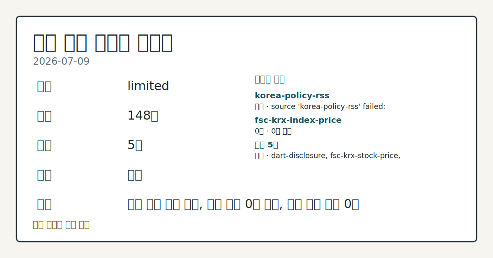
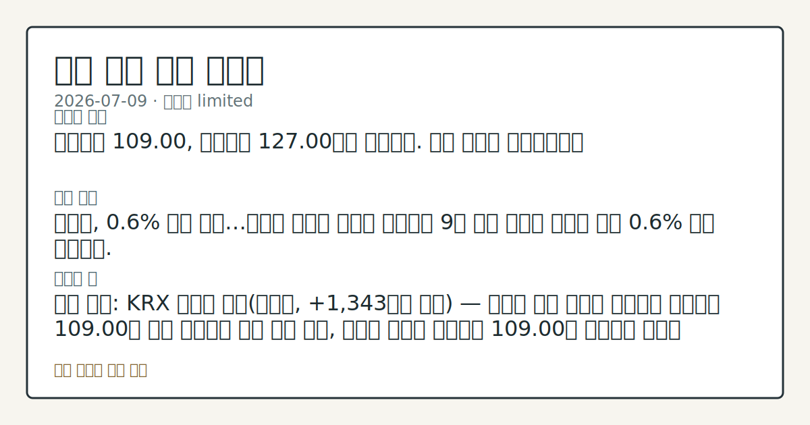

# 2026-07-09 국내 증시 시황
**기준 시각**: 2026-07-09 KST · 2026-07-08T15:00Z, 2026-07-09T15:00Z)
**세그먼트**: [국내 증시](2026-07-09.md) | 미국 증시(미발행) | 크립토(미발행)

*이미지: 데이터 신뢰도 · 출처: investo 자체 생성 · 생성: investo 0.1.0 · 2026-07-09 UTC*
> **내 관심 자산 영향**: 데이터 수집 부족으로 매칭 판단 보류 — 추가 수집 후 재평가됩니다.
> **용어 가이드**: 이번 시황에서 처음 등장한 용어 — 거래대금(거래총액)
> **오늘의 결론**: 코스피는 109.00, 코스닥은 127.00으로 마감했다. 수집 근거가 제한적입니다
> **핵심 동인**: 코스피 관련 정밀 수치는 이번 회차 코어 데이터 미수집으로 확정할 수 없습니다.
> **주의할 점**: 확인 소스: KRX 외국인 수급(코스피, +1,343억원 유입) — 외국인 수급 유입이 이어지며 코스피가 109.00을 상회 유지하면 반등 흐름 본문 참고.
> 정보 제공용 자동 시황이며 매매 권유가 아닙니다.
## 한눈에 보기
**코스피**(KOSPI, 한국 유가증권시장 종합지수)가 이틀 연속 급락 이후 **0.6%** 반등 마감했고, **코스닥**(KOSDAQ, 코스닥 종합지수)은 종가 127.00을 기록했다.
SK하이닉스 관련 정밀 수치는 이번 회차 코어 데이터 미수집으로 확정할 수 없습니다.
**3.778%** 국고채 3년물 금리가 트럼프·신현송 발언 이후 상승폭을 축소 — 본문 §④ 참조.
## ⓪ 오늘의 매크로
**미 국채 수익률** — UST curve 2026-07-09: 10Y 4.54%, 2Y10Y +0.38pp
> **크로스마켓 연결 고리**: 금리 이벤트가 할인율/달러 경로의 공통 변수로 남아 있습니다.
## ① 요약

*이미지: 시장 스냅샷 · 출처: investo 자체 생성 · 생성: investo 0.1.0 · 2026-07-09 UTC*

코스피는 109.00, 코스닥은 127.00으로 마감했다. 코스피 관련 정밀 수치는 이번 회차 코어 데이터 미수집으로 확정할 수 없습니다. 원/달러 환율은 환율 데이터 미수집이다. 전날 [뉴욕증시가 반도체주 강세 속 상승 출발](https://www.yna.co.kr/view/AKR20260709201600009)했다는 소식에도 국내 반도체 대형주인 삼성전자[005930]와 SK하이닉스[000660]는 각각 **-6.25%**, **-5.68%** 급락하며 지수 반등과 엇갈린 흐름을 보였다. [혼재]

## ② 전일 핵심 이슈

### 코스피, **0.6%** 반등 마감…외국인 이틀째 순매수

코스피 관련 정밀 수치는 이번 회차 코어 데이터 미수집으로 확정할 수 없습니다. 이틀 연속 급락을 거친 뒤 나온 반등으로, 외국인은 코스피에서 이틀째 순매수를 기록했다(외국인 순매수 +1,343억원, KRX(한국거래소) 집계 기준). 코스닥은 127.00을 나타냈다.

> **그래서 의미는?** 코스피는 반등했지만 반도체 대형주는 급락해 지수와 종목 흐름이 엇갈립니다.

### 삼성전자·SK하이닉스 급락에도 지수는 반등

SK하이닉스 관련 정밀 수치는 이번 회차 코어 데이터 미수집으로 확정할 수 없습니다. 두 종목의 거래대금이 국내 증시 전체에서 차지하는 비중은 [한 달 반 새 30%에서 51%로 확대](https://www.yna.co.kr/view/AKR20260709151851008)됐다는 연합뉴스 보도가 나왔다. 반도체 대형주 낙폭에도 코스피 지수 자체는 반등해, 지수와 대형 종목 간 온도차가 나타났다.

## ③ 섹터/수급 동향

### 코스피 수급, 외국인·기관 유입에도 개인은 순매도

코스피에서는 외국인이 +1,343억원, 기관이 +12,884억원 순매수했고, 개인은 -13,278억원 순매도, 기타는 -950억원 순매도를 기록했다(2026-07-09, [Naver금융 KRX 미러](https://finance.naver.com/sise/investorDealTrendDay.naver?bizdate=20260709&sosok=01) 기준).

> **그래서 의미는?** 외국인·기관 수급은 유입됐지만 개인은 유출을 보여 수급 주체별 온도차가 있습니다.

### 코스닥 수급, 기관 순매수·개인 순매도 엇갈림

코스닥에서는 기관이 +3,081억원 순매수, 외국인이 +221억원 순매수를 기록한 반면 개인은 -3,217억원 순매도, 기타는 -86억원 순매도였다(2026-07-09, [Naver금융 KRX 미러](https://finance.naver.com/sise/investorDealTrendDay.naver?bizdate=20260709&sosok=02) 기준).

### 반도체 대형주 거래대금 집중도 확대

삼성전자와 SK하이닉스의 거래대금이 국내 증시 전체에서 차지하는 비중은 [최근 한 달 반 새 30%에서 51%로 확대](https://www.yna.co.kr/view/AKR20260709151800008)됐다. SK하이닉스 관련 정밀 수치는 이번 회차 코어 데이터 미수집으로 확정할 수 없습니다. 2차전지 관련 종목의 가격 데이터는 이번 회차 입력에서 수집 근거 제한이다.

## ④ 지표·이벤트

### 국고채 3년물 **3.778%**…트럼프·신현송 발언에 상승폭 축소

9일 국고채 금리는 [일제히 상승했다가 트럼프 대통령과 신현송 한국은행 총재의 발언 이후 상승폭을 축소](https://www.yna.co.kr/view/AKR20260709175200008)했다. 3년물은 연 **3.778%**를 나타냈으며, [국고채 금리는 혼조세](https://www.yna.co.kr/view/AKR20260709169100008)를 보였다.

> **그래서 의미는?** 국고채 금리는 발언 이후 상승폭이 줄어 금리 부담 완화 흐름인지 점검이 필요합니다.

## ⑤ 주요 종목

### 가격 변동 확인

NAVER[035420]는 192,700원(**-2.28%**), 셀트리온[068270]은 176,800원(**-0.79%**), 현대차[005380]는 462,500원(**-3.55%**)으로 마감했다. 애프터마켓에서는 [펩트론[087010]이 10%대 급락](https://www.yna.co.kr/view/AKR20260709173700008), [금호타이어[073240]가 10%대 급등](https://www.yna.co.kr/view/AKR20260709169700008) 중인 것으로 나타났다.

> **그래서 의미는?** 종목별로 실적·공시·수급 재료가 엇갈려 개별 이슈 확인이 중요합니다.

### 실적·공시 체크리스트

비츠로셀[082920]은 [2분기 영업이익 196억원으로 전년 동기 대비 **21.3%** 증가](https://www.yna.co.kr/view/AKR20260709167300527)했다고 공시했다. DART(전자공시시스템)에는 [미원화학의 현금·현물배당 결정](https://dart.fss.or.kr/dsaf001/main.do?rcpNo=20260709800680), [태웅로직스의 자기주식취득 결정](https://dart.fss.or.kr/dsaf001/main.do?rcpNo=20260709000650), [주성코퍼레이션의 유상증자 결정](https://dart.fss.or.kr/dsaf001/main.do?rcpNo=20260709000695) 및 [전환사채권 발행 결정](https://dart.fss.or.kr/dsaf001/main.do?rcpNo=20260709000693), [성호전자의 최대주주 변경 수반 주식담보제공계약 정정](https://dart.fss.or.kr/dsaf001/main.do?rcpNo=20260709900708) 공시가 올라왔다. 주성코퍼레이션은 [150억원 규모 제3자배정 유상증자](https://www.yna.co.kr/view/AKR20260709184500008)를 결정했다고 별도로 보도됐다.

### 반도체 관전 항목

SK하이닉스[000660]는 [10일 ADR(미국주식예탁증서) 상장을 앞두고 있으며 티커는 'SKHY'](https://www.yna.co.kr/view/AKR20260709071751008)로 확인됐다. 한편 BNK증권은 [SK하이닉스에 대해 현재 주가보다 낮은 수준의 평가를 담은 보고서](https://www.yna.co.kr/view/AKR20260709189600008)를 내놓았다.

## ⑥ 오늘의 관전 포인트

> **관전 포인트**: 구조화 가능한 관찰 신호가 부족합니다 — 본문 §②·§④ 참조

> **데이터 상태**: 제한

수집/품질 진단

> **데이터 상태**: 제한 — 수집 148건 / 소스 5개 / 누락: 없음 · 제한 — 핵심 가격 소스 0건/실패/stale, 본문 결론 신뢰도 낮음
> **소스 카운트**: 수집 대상 7 / 성공 5 / 수집 상세는 진단 섹션에서 확인할 수 있습니다. / 수집 상세는 진단 섹션에서 확인할 수 있습니다. / 수집 상세는 진단 섹션에서 확인할 수 있습니다.
> **소스 등급 분포**: S=2 / A=2 / B=1
> **상세 사유**: 일부 소스 수집 실패, 일부 소스 0건 반환, 핵심 가격 소스 0건
> **소스별 상태**: korea-policy-rss 실패 (일시적 수집 오류), fsc-krx-index-price 0건, 정상 5개

## ⑦ 면책조항
본 시황은 일반 정보 제공을 목적으로 자동 생성된 자료이며,
특정 종목·자산에 대한 매매 권유나 투자 자문이 아닙니다.
투자 결정과 그 결과에 대한 책임은 전적으로 본인에게 있으며,
본 시황의 내용에 따라 발생한 손실에 대해 작성자는 일체의 책임을 지지 않습니다.