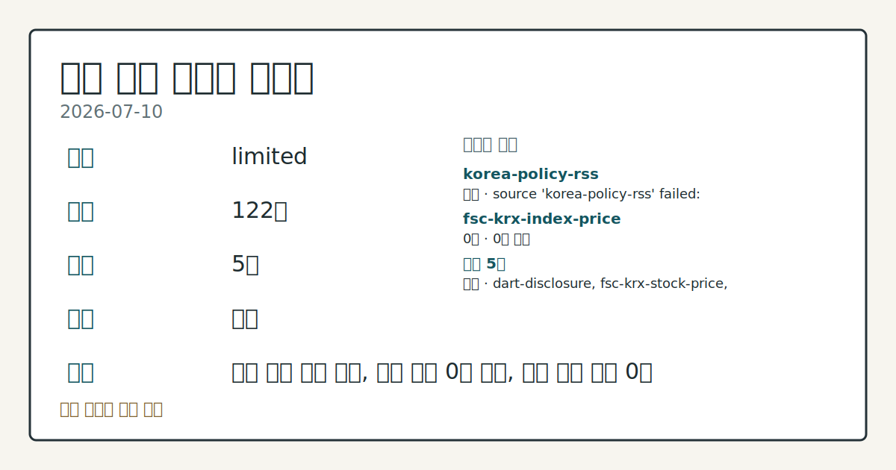
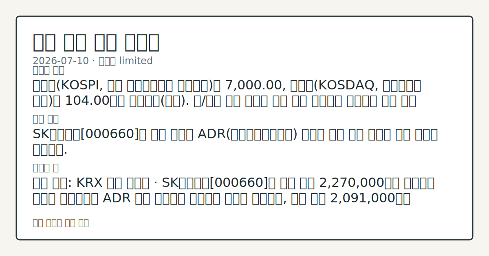

# 2026-07-10 국내 증시 시황
**기준 시각**: 2026-07-10 KST · 2026-07-09T15:00Z, 2026-07-10T15:00Z)
| 종목 | 종가 | 변동 | 비고 |
|------|------|------|------|
| ^KOSPI | 7,000.00 | — | — |
**세그먼트**: [국내 증시](2026-07-10.md) | [미국 증시](../../../us-equity/2026/07/2026-07-10.md) | 크립토(미발행)

*이미지: 데이터 신뢰도 · 출처: investo 자체 생성 · 생성: investo 0.1.0 · 2026-07-11 UTC*
> **내 관심 자산 영향**: 데이터 수집 부족으로 매칭 판단 보류 — 추가 수집 후 재평가됩니다.
> **오늘의 결론**: 코스피(KOSPI, 한국 유가증권시장 종합지수)는 7,000.00, 코스닥(KOSDAQ, 코스닥시장 지수)은 104.00으로 마감했다(출처). 원/달러 환율 수치는 이번 회차 입력에서 확인되지 않아 환율 데이터 미수집으로 남긴다. 수집 근거가 제한적입니다
> **핵심 동인**: SK하이닉스[000660]의 미국 나스닥 ADR(미국주식예탁증서) 상장이 이날 국내 증시의 최대 이슈로 부상했다.
> **주의할 점**: 확인 소스: KRX 주가 데이터 · SK하이닉스[000660]가 장중 고가 2,270,000원을 상회하는 흐름을 재확인하면 ADR 상장 모멘텀이 본문 참고.
> 정보 제공용 자동 시황이며 매매 권유가 아닙니다.
## 한눈에 보기
SK하이닉스 관련 정밀 수치는 이번 회차 코어 데이터 미수집으로 확정할 수 없습니다.
SK하이닉스의 미국 나스닥 상장이 이날 국내 증시 최대 이슈로 부상했고, 최태원 SK그룹 회장은 이를 "역사적 순간"으로 언급했다.
국고채 3년물 금리가 연 **3.768%**로 하락한 점이 환율·수급 경로에 주는 영향 — 본문 §④ 참조.
## ⓪ 오늘의 매크로
**국제 유가** — CFTC WTI crude oil managed_money net +64041 contracts
**미 국채 수익률** — UST curve 2026-07-10: 10Y 4.56%, 2Y10Y +0.35pp
## ⓪-B 채널 기준선
| 기준선 | 값 |
|------|------|
| 코스피 | 7,000.00 (—) |
| 코스닥 | 미수집 |
| 원/달러 | 미수집 |
> **크로스마켓 연결 고리**: 유가/지정학 이슈가 여러 자산군의 변동성 연결 고리로 관찰됩니다. / 금리 이벤트가 할인율/달러 경로의 공통 변수로 남아 있습니다.
> **오늘의 큰 그림:** 유가와 지정학 변수가 공통 변수지만, 원/달러와 국내 수급를 먼저 확인해야 합니다.
## ① 요약

*이미지: 시장 스냅샷 · 출처: investo 자체 생성 · 생성: investo 0.1.0 · 2026-07-11 UTC*

코스피는 **7,000.00**, 코스닥은 **104.00**으로 마감했다([출처](https://www.yna.co.kr/market-plus/all)). 원/달러 환율 수치는 이번 회차 입력에서 확인되지 않아 환율 데이터 미수집으로 남긴다. SK하이닉스 관련 정밀 수치는 이번 회차 코어 데이터 미수집으로 확정할 수 없습니다. [혼재]

## ② 전일 핵심 이슈

SK하이닉스[000660]의 미국 나스닥 ADR 상장이 이날 국내 증시의 최대 이슈로 부상했다. 전일(2026-07-09) 브리핑에서는 코어 데이터 미비로 코스피·코스닥 정밀 수치를 확인하지 못했으나, 오늘은 코스피 7,000.00·코스닥 104.00 종가가 확인됐다.

> **그래서 의미는?** SK하이닉스의 나스닥 상장이 국내 반도체 수급 심리에 미치는 영향을 확인할 필요가 있다는 의미다.

### SK하이닉스[000660], 나스닥 ADR 상장 속 국내외 반응

[연합뉴스](https://www.yna.co.kr/view/AKR20260710172100071)에 따르면 최태원 SK그룹 회장은 10일(현지시간) "역사적 순간"이라며 AI 분야 대규모 투자 계획을 언급했고, [곽노정 SK하이닉스 대표](https://www.yna.co.kr/view/AKR20260710170500003)는 "전 세계 투자자들에게 새로운 문을 열기 위해 나스닥 시장에 왔다"고 말했다. SK하이닉스 관련 정밀 수치는 이번 회차 코어 데이터 미수집으로 확정할 수 없습니다.

### 뉴욕증시 상승 출발과 국내 개장 연결고리

[연합뉴스](https://www.yna.co.kr/view/AKR20260710170600009)는 뉴욕증시 3대 지수가 SK하이닉스 ADR 상장 속 상승 출발했다고 전했다. 전일 미국장이 상승 출발한 흐름은 오늘 국내 반도체 관련주 수급 심리에 우호적인 배경으로 작용했다고 관찰되나, 이는 국내 종목 개별 수급으로 한정해 해석할 필요가 있다.

## ③ 섹터/수급 동향

코스피·코스닥 모두 기관 순매수, 개인·외국인 순매도 구도가 나타났다. 코스피에서는 기관이 **+11,314억원** 순매수한 반면 개인은 **-7,805억원**, 외국인은 **-3,228억원**, 기타는 **-282억원** 순매도했다([KRX(한국거래소) 투자자별 매매동향](https://finance.naver.com/sise/investorDealTrendDay.naver?bizdate=20260710&sosok=01)). 코스닥에서도 기관이 **+5,825억원** 순매수한 반면 개인은 **-4,213억원**, 외국인은 **-1,563억원**, 기타는 **-49억원** 순매도했다([KRX 투자자별 매매동향](https://finance.naver.com/sise/investorDealTrendDay.naver?bizdate=20260710&sosok=02)).

> **그래서 의미는?** 기관과 개인·외국인의 매매 방향이 엇갈려 수급 주체별 온도차를 점검할 필요가 있다는 의미다.

### 반도체 대형주: SK하이닉스 급등, 삼성전자 소폭 상승

삼성전자 관련 정밀 수치는 이번 회차 코어 데이터 미수집으로 확정할 수 없습니다. 다만 2차전지 관련 종목의 가격 데이터는 이번 회차 입력에 포함되지 않아 확인이 제한적이다. 주간 기준 거래소 기관·외국인 순매수도 상위종목 표도 함께 공개됐다([기관 순매수도 상위종목](https://www.yna.co.kr/view/AKR20260710155600008), [외국인 순매수도 상위종목](https://www.yna.co.kr/view/AKR20260710155500008)).

## ④ 지표·이벤트

코스피는 **7,000.00**, 코스닥은 **104.00**으로 마감했다([출처](https://www.yna.co.kr/market-plus/all)). 국고채 금리는 환율 약세와 일본 국채 금리 하락 영향으로 일제히 떨어졌고, 3년물은 연 **3.768%**를 기록했다([연합뉴스](https://www.yna.co.kr/view/AKR20260710136951008)).

> **그래서 의미는?** 금리 하락과 환율 흐름이 국내 수급 경로에 미치는 영향을 확인할 필요가 있다는 의미다.

### 신규 상장 이벤트

한국거래소는 '미국 AI 광통신주 투자' 등 ETF(상장지수펀드) 6종목이 오는 14일 신규 상장한다고 밝혔다([연합뉴스](https://www.yna.co.kr/view/AKR20260710137300008)). 이와 함께 엠에스바이오와 네오사피엔스는 코스닥시장 상장예비심사를 통과했다([연합뉴스](https://www.yna.co.kr/view/AKR20260710153000008)).

## ⑤ 주요 종목

주요 대형주 가격이 확인됐다: SK하이닉스[000660] **+5.30%**(2,186,000원), 삼성전자[005930] **+0.18%**(278,000원), NAVER\[035420\](네이버) **-4.31%**(184,400원), 셀트리온[068270] **-2.09%**(173,100원), 현대차[005380] **-3.68%**(445,500원).

> **그래서 의미는?** SK하이닉스(반도체)·삼성전자(반도체)·NAVER(인터넷 플랫폼)·셀트리온(바이오)·현대차(자동차) 등 업종별 대형주 흐름이 엇갈려 개별...

### 관전 분류: 애프터마켓 변동 확인 항목

원익머트리얼즈[104830]와 한국피아이엠[448900]이 애프터마켓에서 10%대 급등을 나타냈다([원익머트리얼즈](https://www.yna.co.kr/view/AKR20260710157500008), [한국피아이엠](https://www.yna.co.kr/view/AKR20260710154200008)). 한국피아이엠은 같은 날 전환사채권발행결정 관련 DART(전자공시시스템) 주요사항보고서도 공시했다([DART](https://dart.fss.or.kr/dsaf001/main.do?rcpNo=20260710000677)).

## ⑥ 오늘의 관전 포인트

#### 관찰 신호: SK하이닉스[000660]

- 출처: KRX 주가 데이터
- 현재: KRX 주가 데이터 · SK하이닉스[000660]가 장중 고가 2,270,000원을 상회하는 흐름을 재확인하면 ADR 상장 모멘텀이 이어지는 것으로 관찰되고, 장중 저가 2,091,000원을 하회하면 상장 이후 거래 리스크 관리 압력으로 해석된다. 관심 영향: 반도체 대형주 수급 흐름 점검.
- 확인 조건: 상방 SK하이닉스[000660]가 장중 고가 2,270,000원을 상회하는 흐름을 재확인하면 ADR 상장 모멘텀이 이어지는 것으로 관찰되고; 하방 장중 저가 2,091,000원을 하회하면 상장 이후 거래 리스크 관리 압력으로 해석된다
- 신뢰도: 높음
- 관심 영향: 반도체 대형주 수급 흐름 점검.

#### 관찰 신호: 삼성전자[005930]

- 출처: KRX 주가 데이터
- 현재: KRX 주가 데이터 · 삼성전자[005930]가 장중 고가 291,500원을 재차 상회하면 반도체 업황 기대가 확대되는 것으로 관찰되고, 장중 저가 267,500원을 하회하면 수급 약화 신호로 해석된다. 관심 영향: 대형 반도체주 추세 확인.
- 확인 조건: 상방 삼성전자[005930]가 장중 고가 291,500원을 재차 상회하면 반도체 업황 기대가 확대되는 것으로 관찰되고; 하방 장중 저가 267,500원을 하회하면 수급 약화 신호로 해석된다
- 신뢰도: 높음
- 관심 영향: 대형 반도체주 추세 확인.

> **데이터 상태**: 제한

수집/품질 진단

> **데이터 상태**: 제한 — 수집 152건 / 소스 5개 / 누락: 없음 · 제한 — 핵심 가격 소스 0건/실패/stale, 본문 결론 신뢰도 낮음
> **소스 카운트**: 수집 대상 7 / 성공 5 / 수집 상세는 진단 섹션에서 확인할 수 있습니다. / 수집 상세는 진단 섹션에서 확인할 수 있습니다. / 수집 상세는 진단 섹션에서 확인할 수 있습니다.
> **소스 등급 분포**: S=2 / A=2 / B=1
> **상세 사유**: 일부 소스 수집 실패, 일부 소스 0건 반환, 핵심 가격 소스 0건
> **소스별 상태**: korea-policy-rss 실패 (일시적 수집 오류), fsc-krx-index-price 0건, 정상 5개

## ⑦ 면책조항
본 시황은 일반 정보 제공을 목적으로 자동 생성된 자료이며,
특정 종목·자산에 대한 매매 권유나 투자 자문이 아닙니다.
투자 결정과 그 결과에 대한 책임은 전적으로 본인에게 있으며,
본 시황의 내용에 따라 발생한 손실에 대해 작성자는 일체의 책임을 지지 않습니다.