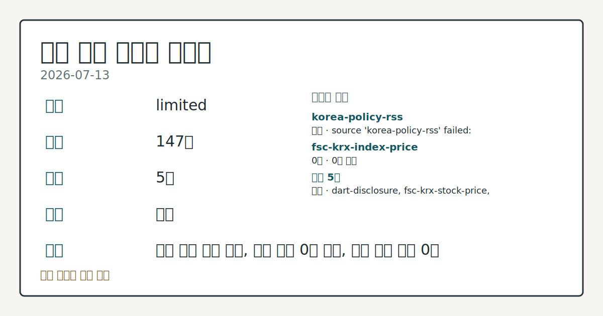
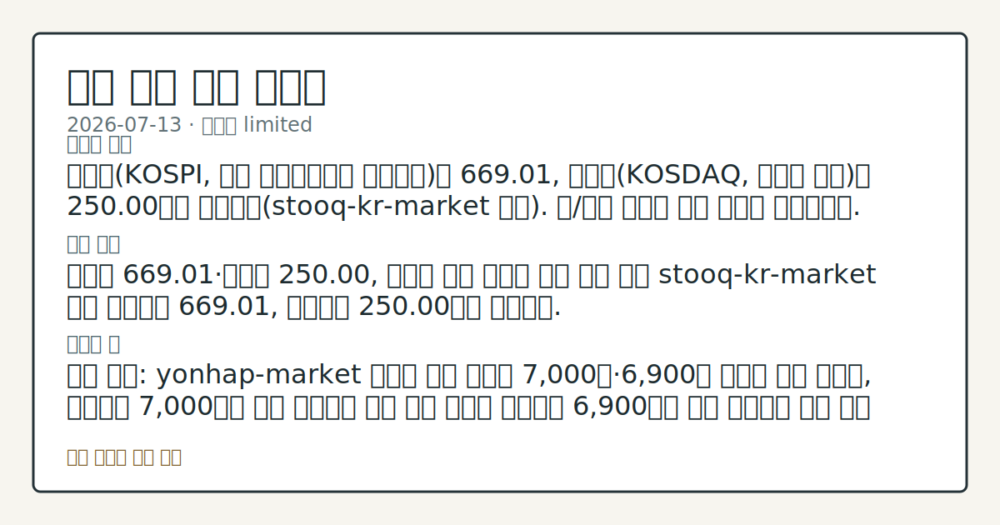

# 2026-07-13 국내 증시 시황
**기준 시각**: 2026-07-13 KST · 2026-07-12T15:00Z, 2026-07-13T15:00Z)
**세그먼트**: [국내 증시](2026-07-13.md) | [미국 증시](../../../us-equity/2026/07/2026-07-13.md) | [크립토](../../../crypto/2026/07/2026-07-13.md)

*이미지: 데이터 신뢰도 · 출처: investo 자체 생성 · 생성: investo 0.1.0 · 2026-07-13 UTC*
> **내 관심 자산 영향**: 데이터 수집 부족으로 매칭 판단 보류 — 추가 수집 후 재평가됩니다.
> **오늘의 결론**: 코스피(KOSPI, 한국 유가증권시장 종합지수)는 669.01, 코스닥(KOSDAQ, 코스닥 시장)은 250.00으로 집계됐다(stooq-kr-market 기준). 원/달러 환율은 환율 데이터 미수집이다. 수집 근거가 제한적입니다
> **핵심 동인**: 코스피 669.01·코스닥 250.00, 반도체 급락 여진과 반등 흐름 혼재 stooq-kr-market 기준 코스피는 669.01, 코스닥은 250.00으로 집계됐다.
> **주의할 점**: 확인 소스: yonhap-market 코스피 지수 보도가 7,000선·6,900선 이탈을 전한 가운데, 코스피가 7,000선을 다시 회복하면 낙폭 본문 참고.
> 정보 제공용 자동 시황이며 매매 권유가 아닙니다.
## 한눈에 보기
코스피 관련 정밀 수치는 이번 회차 코어 데이터 미수집으로 확정할 수 없습니다.
SK하이닉스[000660] ADR(주식예탁증서)이 나스닥 상장 첫날 흥행한 것과 달리 국내 본주는 장중 **15.4%** 낙폭을 기록했다가 종가 기준 **-0.27%**로 낙폭을 줄였다.
국고채 3년물 금리가 **3.809%**로 상승 마감 — 본문 §④ 참조.
## ⓪ 오늘의 매크로
**국제 유가** — CFTC WTI crude oil managed_money net +64041 contracts
**미 국채 수익률** — UST curve 2026-07-13: 10Y 4.62%, 2Y10Y +0.36pp
> **크로스마켓 연결 고리**: 유가/지정학 이슈가 여러 자산군의 변동성 연결 고리로 관찰됩니다. / 금리 이벤트가 할인율/달러 경로의 공통 변수로 남아 있습니다.
> **오늘의 큰 그림:** 유가와 지정학 변수가 공통 변수지만, 원/달러와 국내 수급를 먼저 확인해야 합니다.
## ① 요약

*이미지: 시장 스냅샷 · 출처: investo 자체 생성 · 생성: investo 0.1.0 · 2026-07-13 UTC*

코스피는 669.01, 코스닥은 250.00으로 집계됐다. 원/달러 환율은 환율 데이터 미수집이다. 코스피 관련 정밀 수치는 이번 회차 코어 데이터 미수집으로 확정할 수 없습니다. 다만 국내 대형주 종가 데이터를 보면 삼성전자[005930]가 **+2.52%**, 현대차[005380]가 **+2.69%**, NAVER[035420]가 **+3.74%** 오르며 개별 종목과 지수 보도 사이에 엇갈린 흐름이 나타났다. 코스피·코스닥 모두 외국인 순매도가 이어져 수급 측면에서는 경계감이 유지됐다. [혼재]

## ② 전일 핵심 이슈

### 코스피 669.01·코스닥 250.00, 반도체 급락 여진과 반등 흐름 혼재

stooq-kr-market 기준 코스피는 669.01, 코스닥은 250.00으로 집계됐다. 코스피 관련 정밀 수치는 이번 회차 코어 데이터 미수집으로 확정할 수 없습니다. [또 다른 연합뉴스 기사](https://www.yna.co.kr/view/AKR20260713083551008)는 7,000선에 이어 6,900선도 무너졌다고 전했다. 반도체 대형주 쪽에서는 [SK하이닉스[000660] ADR이 나스닥 상장 첫날 흥행했음에도 본주는 장중 15%대 낙폭](https://www.yna.co.kr/view/AKR20260713059551008)을 겪었고, [다른 보도](https://www.yna.co.kr/view/AKR20260713035052008)는 SK하이닉스 **15.4%**, 삼성전자 **10.7%**의 장중 낙폭을 전했다. SK하이닉스 관련 정밀 수치는 이번 회차 코어 데이터 미수집으로 확정할 수 없습니다. [연합뉴스](https://www.yna.co.kr/view/AKR20260713166000009)에 따르면 미국 3대 지수는 미국과 이란 간 무력 충돌 속 혼조 흐름으로 마감(post-close)한 것으로 전해졌으며, 이는 국내 개장 심리에 경계 요인으로 작용한 것으로 관찰된다.

> **그래서 의미는?** 지수 급락 보도와 대형주 종가 반등이 함께 나타나 방향성 판단에 확인이 더 필요합니다.

## ③ 섹터/수급 동향

### 반도체·정유주 수급, 코스피·코스닥 투자자별 매매 동향

SK하이닉스 관련 정밀 수치는 이번 회차 코어 데이터 미수집으로 확정할 수 없습니다. 국제유가 급등 국면에서는 [연합뉴스 특징주 보도](https://www.yna.co.kr/view/AKR20260713034651008)에 따르면 정유주가 줄줄이 상승했다. krx-foreign-flows 데이터 기준 코스피는 개인 순매수 +38,869억원, 기관 순매도 -22,338억원, 외국인 순매도 -16,705억원, 기타 순매수 +175억원을 기록했고, 코스닥은 개인 순매수 +1,833억원, 기관 순매수 +1,843억원, 외국인 순매도 -3,878억원, 기타 순매수 +203억원으로 집계됐다.

> **그래서 의미는?** 개인이 순매수를 늘린 반면 외국인은 양 시장에서 모두 순매도해 주체별 힘겨루기가 이어지는 모습입니다.

## ④ 지표·이벤트

### 국고채 금리, 지정학적 긴장 속 상승 마감

[연합뉴스](https://www.yna.co.kr/view/AKR20260713136951008)에 따르면 미국과 이란 간 긴장이 다시 고조되면서 13일 국고채 금리가 일제히 상승 마감했으며, 3년물은 연 **3.809%**를 기록했다. 별도 [연합뉴스 기사](https://www.yna.co.kr/view/AKR20260713136900008)도 동일한 3년물 금리 수준을 전했다. 이날 요구되는 매크로 실측치(Required macro actuals)는 별도로 제시되지 않았다.

> **그래서 의미는?** 지정학적 긴장이 채권 금리에도 반영되며 금리와 주식시장이 함께 움직이는 흐름입니다.

## ⑤ 주요 종목

### 대형주 확인 항목

fsc-krx-stock-price 종가 기준으로 NAVER[035420]는 191,300원(**+3.74%**), SK하이닉스[000660]는 2,180,000원(**-0.27%**), 삼성전자[005930]는 285,000원, 셀트리온[068270]은 175,200원(**+1.21%**), 현대차[005380]는 457,500원(**+2.69%**)으로 마감했다.

> **그래서 의미는?** NAVER(네이버), 삼성전자, 현대차 등 대형주 종가는 반등했지만 SK하이닉스는 소폭 하락으로 갈렸습니다.

### 실적 발표

[연합뉴스 보도](https://www.yna.co.kr/view/AKR20260713130800003)에 따르면 대한항공[003490]은 올해 2분기 별도 기준 매출 5조199억원을 기록했으나 유가 상승 영향으로 영업이익이 **34%** 감소했다고 밝혔으며, 화물 부문은 호조를 보였다.

### 관전 분류 (애프터마켓 변동)

[연합뉴스](https://www.yna.co.kr/view/AKR20260713153700008)에 따르면 알테오젠[196170]은 애프터마켓에서 10%대 급락 중이며, [별도 보도](https://www.yna.co.kr/view/AKR20260713140100008)는 쓰리빌리언[394800]이 애프터마켓에서 10%대 급등 중이라고 전했다.

### 체크리스트 (자본조달·지분 변동)

[연합뉴스](https://www.yna.co.kr/view/AKR20260713155300030)에 따르면 한화갤러리아는 서울 강남구 신사동 토지를 2천367억원에 매입해 사업다각화에 나섰고, [그래피[318060]](https://www.yna.co.kr/view/AKR20260713145500008)는 제3자배정 유상증자로 약 121억원을 조달하기로 했으며, [비엘팜텍[065170]](https://www.yna.co.kr/view/AKR20260713127200008)은 광동헬스바이오 주식을 10억원에 추가 취득해 지분율 14%를 확보했다고 밝혔다.

## ⑥ 오늘의 관전 포인트

#### 관찰 신호: 6,900선 이탈을 전한 가운데, 코스피

- 출처: yonhap-market 코스피 지수 보도가 7,000선
- 현재: 코스닥 전반의 변동성 확대 여부를 점검.
- 확인 조건: 상방 코스피가 7,000선을 다시 회복하면 낙폭 축소 흐름을 관찰하고 6,900선을 재차 하회하면 추가 하락 압력으로 해석해 지수 방향성을 점검한다; 하방 6,900선 이탈을 전한 가운데
- 신뢰도: 보통
- 관심 영향: 코스피

> **데이터 상태**: 제한

수집/품질 진단

> **데이터 상태**: 제한 — 수집 147건 / 소스 5개 / 누락: 없음 · 제한 — 핵심 가격 소스 0건/실패/stale, 본문 결론 신뢰도 낮음
> **소스 카운트**: 수집 대상 7 / 성공 5 / 수집 상세는 진단 섹션에서 확인할 수 있습니다. / 수집 상세는 진단 섹션에서 확인할 수 있습니다. / 수집 상세는 진단 섹션에서 확인할 수 있습니다.
> **소스 등급 분포**: S=2 / A=2 / B=1
> **상세 사유**: 일부 소스 수집 실패, 일부 소스 0건 반환, 핵심 가격 소스 0건
> **소스별 상태**: korea-policy-rss 실패 (일시적 수집 오류), fsc-krx-index-price 0건, 정상 5개

## ⑦ 면책조항
본 시황은 일반 정보 제공을 목적으로 자동 생성된 자료이며,
특정 종목·자산에 대한 매매 권유나 투자 자문이 아닙니다.
투자 결정과 그 결과에 대한 책임은 전적으로 본인에게 있으며,
본 시황의 내용에 따라 발생한 손실에 대해 작성자는 일체의 책임을 지지 않습니다.