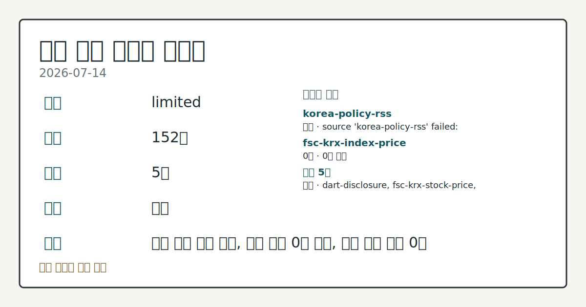
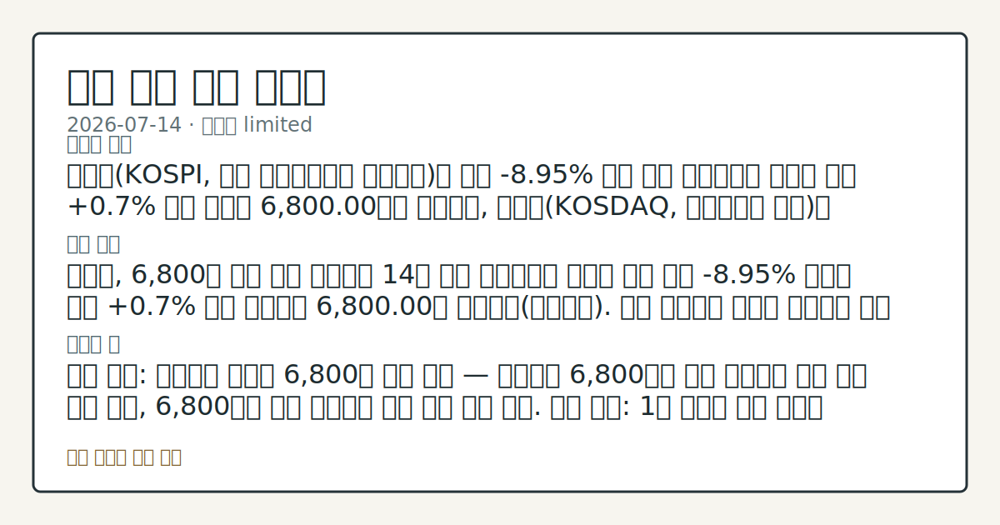

# 2026-07-14 국내 증시 시황
**기준 시각**: 2026-07-14 KST · 2026-07-13T15:00Z, 2026-07-14T15:00Z)
| 종목 | 종가 | 변동 | 비고 |
|------|------|------|------|
| ^KOSPI | 6,800.00 | — | — |
**세그먼트**: [국내 증시](2026-07-14.md) | [미국 증시](../../../us-equity/2026/07/2026-07-14.md) | [크립토](../../../crypto/2026/07/2026-07-14.md)

*이미지: 데이터 신뢰도 · 출처: investo 자체 생성 · 생성: investo 0.1.0 · 2026-07-14 UTC*
> **내 관심 자산 영향**: 데이터 수집 부족으로 매칭 판단 보류 — 추가 수집 후 재평가됩니다.
> **용어 가이드**: 이번 시황에서 처음 등장한 용어 — CPI(소비자물가)
> **오늘의 결론**: 코스피(KOSPI, 한국 유가증권시장 종합지수)는 전날 **-8.95%** 급락 이후 오르내림을 거듭한 끝에 **+0.7%** 소폭 상승해 6,800.00으로 마감했고, 코스닥(KOSDAQ, 코스닥시장 지수)은 225.00을 나타냈다(연합뉴스). 원/달러 환율은 이번 입력 데이터에 포함되지 않아 환율 데이터 미수집 상태다. 수집 근거가 제한적입니다
> **핵심 동인**: 코스피, 6,800선 진정 시도 코스피는 14일 장중 오르내림을 반복한 끝에 전날 **-8.95%** 급락을 딛고 **+0.7%** 상승 마감하며 6,800.00을 기록했다(연합뉴스). 다른 연합뉴스 보도는 코스피가 한때 9,000선을 넘봤던 데서 후퇴해 6,800선에서 지지선을 시험하고 있으며, 골드만삭스가 1차 지지선을 제시했다고 전했다(연합뉴스). 이달 들어 코스피·코스닥 상장사 전체 시가총액은 19% 증발해 6천조원 선이 위태롭다는 진단도 나왔다(연합뉴스). 그래서 의미는?
> **주의할 점**: 확인 소스: 연합뉴스 코스피 6,800선 지지 여부 — 코스피가 6,800선을 상회 유지하면 반등 흐름 지속 관찰, 6,800선을 하회 이탈하면 본문 참고.
> 정보 제공용 자동 시황이며 매매 권유가 아닙니다.
## 한눈에 보기
코스피가 전날 **-8.95%** 급락 이후 **+0.7%** 소폭 반등해 6,800.00을 기록했다.
SK하이닉스 관련 정밀 수치는 이번 회차 코어 데이터 미수집으로 확정할 수 없습니다.
국고채 3년물 금리가 중동 정세 우려 속 **3.887%**로 상승 — 본문 §④ 참조.
## ⓪ 오늘의 매크로
**FOMC 일정** — 2026-07-29 — FOMC Meeting
**국제 유가** — CFTC WTI crude oil managed_money net +64041 contracts
**미 국채 수익률** — UST curve 2026-07-14: 10Y 4.58%, 2Y10Y +0.40pp
## ⓪-B 채널 기준선
| 기준선 | 값 |
|------|------|
| 코스피 | 6,800.00 (—) |
| 코스닥 | 미수집 |
| 원/달러 | 미수집 |
> **크로스마켓 연결 고리**: 유가/지정학 이슈가 여러 자산군의 변동성 연결 고리로 관찰됩니다. / 금리 이벤트가 할인율/달러 경로의 공통 변수로 남아 있습니다.
> **오늘의 큰 그림:** 금리와 달러 변수가 공통 변수지만, KOSPI·원/달러·외국인 수급를 먼저 확인해야 합니다.
## ① 요약

*이미지: 시장 스냅샷 · 출처: investo 자체 생성 · 생성: investo 0.1.0 · 2026-07-14 UTC*

코스피는 전날 **-8.95%** 급락 이후 오르내림을 거듭한 끝에 **+0.7%** 소폭 상승해 6,800.00으로 마감했고, 코스닥은 225.00을 나타냈다([연합뉴스](https://www.yna.co.kr/view/AKR20260714141900008)). 원/달러 환율은 이번 입력 데이터에 포함되지 않아 환율 데이터 미수집 상태다. 이날 뉴욕증시가 소비자물가지수(CPI) 상승률 둔화(전년대비 **3.5%**, 예상 하회)를 소화하며 상승 출발한 점이 국내 투자심리에 우호적 배경으로 작용했다는 해석이 나온다([연합뉴스](https://www.yna.co.kr/view/AKR20260714185600009)). 삼성전자(**-10.70%**)와 SK하이닉스(**-15.37%**) 등 반도체 대형주의 낙폭이 두드러지며 지수 내 변동성은 여전히 크게 유지됐다. [변동성 확대]

## ② 전일 핵심 이슈

### 코스피, 6,800선 진정 시도

코스피는 14일 장중 오르내림을 반복한 끝에 전날 **-8.95%** 급락을 딛고 **+0.7%** 상승 마감하며 6,800.00을 기록했다([연합뉴스](https://www.yna.co.kr/view/AKR20260714141900008)). 다른 연합뉴스 보도는 코스피가 한때 9,000선을 넘봤던 데서 후퇴해 6,800선에서 지지선을 시험하고 있으며, 골드만삭스가 1차 지지선을 제시했다고 전했다([연합뉴스](https://www.yna.co.kr/view/AKR20260714076600008)). 이달 들어 코스피·코스닥 상장사 전체 시가총액은 19% 증발해 6천조원 선이 위태롭다는 진단도 나왔다([연합뉴스](https://www.yna.co.kr/view/AKR20260714093300008)).

> **그래서 의미는?** 급락 이후 지수가 지지선 부근에서 버티는 국면이라 추가 변동 가능성을 확인할 필요가 있다.

### 뉴욕증시 흐름과 국내 연결고리

뉴욕증시 3대 지수는 미국 소비자물가지수(CPI) 상승률이 전년대비 **3.5%**로 시장 예상치를 하회하며 상승 출발했다([연합뉴스](https://www.yna.co.kr/view/AKR20260714185600009); [연합뉴스](https://www.yna.co.kr/view/AKR20260714181452072)). 국내 증시 관점에서는 이 같은 미국 물가 둔화 소식이 이날 코스피의 반등 시도에 우호적 재료로 작용했다는 해석이 나오며, 환율 경로를 통한 외국인 수급 변화 여부는 후속 확인이 필요하다.

## ③ 섹터/수급 동향

### 반도체 섹터 흐름

반도체 대형주는 이날 큰 폭 조정을 받았다. 삼성전자 관련 정밀 수치는 이번 회차 코어 데이터 미수집으로 확정할 수 없습니다. 2차전지 관련 종목의 가격 데이터는 이번 입력에 포함되지 않아 2차전지 섹터 흐름은 확인이 어렵다.

> **그래서 의미는?** 반도체 대형주 낙폭이 지수 하방 압력의 핵심 축으로 작용했음을 보여준다.

### 수급 동향 (투자자별 매매)

코스피에서는 외국인이 +9,565억원 순매수한 반면 개인은 -41,411억원 순매도했고 기관은 +32,117억원 순매수했다(한국거래소(KRX) 통계, [Naver 금융](https://finance.naver.com/sise/investorDealTrendDay.naver?bizdate=20260714&sosok=01)). 코스닥에서는 개인 +698억원, 기관 +1,587억원 순매수가 나타난 반면 외국인은 -2,471억원 순매도했다([Naver 금융](https://finance.naver.com/sise/investorDealTrendDay.naver?bizdate=20260714&sosok=02)).

### 레버리지 ETF 리스크 관리 및 신용융자

증권업계는 단일종목 레버리지 상장지수펀드(ETF)를 둘러싼 손실·변동성 우려가 커지자 기본예탁금을 올리고 매매 시점을 분산하는 방안을 추진 중이다([연합뉴스](https://www.yna.co.kr/view/AKR20260714168700008)). 한편 신용융자 잔고는 6거래일 연속 감소해 약 3개월 만에 최저 수준을 나타냈다([연합뉴스](https://www.yna.co.kr/view/AKR20260714142600008)).

## ④ 지표·이벤트

### 국고채 금리 상승

14일 국고채 금리는 중동전 재개 우려에 따른 국제 유가 급등 여파로 일제히 상승했다. 3년물은 연 **3.887%**를 기록했다([연합뉴스](https://www.yna.co.kr/view/AKR20260714150551008)).

> **그래서 의미는?** 지정학적 유가 리스크가 국내 채권 금리에도 번지고 있음을 보여준다.

## ⑤ 주요 종목

### 반도체 관전

삼성전자[005930] 254,500원(**-10.70%**, -30,500원), SK하이닉스[000660] 1,845,000원(**-15.37%**, -335,000원)([금융위 시세](https://www.data.go.kr/data/15094808/openapi.do)). 삼성전자는 미국주식예탁증서(ADR) 상장 가능성에 대해 "검토하지 않는다"는 입장을 밝혔다([연합뉴스](https://www.yna.co.kr/view/AKR20260714165800003)).

> **그래서 의미는?** 반도체 대형주 낙폭과 ADR 이슈가 겹치며 관련 종목 확인이 필요한 구간이다.

### 대형주 동향

NAVER[035420] 188,000원, 셀트리온[068270] 175,100원(**-0.06%**, -100원), 현대차[005380] 444,000원([금융위 시세](https://www.data.go.kr/data/15094808/openapi.do)).

### 코스닥 개별 이슈

피에스케이홀딩스[031980]는 애프터마켓에서 10%대 급등세를 보였고([연합뉴스](https://www.yna.co.kr/view/AKR20260714163600008)), 온코닉테라퓨틱스[476060] 역시 애프터마켓에서 10%대 급등세를 나타냈다([연합뉴스](https://www.yna.co.kr/view/AKR20260714160100008)).

### 공시 확인 항목

전자공시시스템(DART)에는 엑시온그룹의 최대주주변경([공시](https://dart.fss.or.kr/dsaf001/main.do?rcpNo=20260714900835))과 텔콘RF제약의 최대주주변경([공시](https://dart.fss.or.kr/dsaf001/main.do?rcpNo=20260714900804)), 케이엠제약의 유상증자 결정([공시](https://dart.fss.or.kr/dsaf001/main.do?rcpNo=20260714000515)) 등이 공시됐다.

## ⑥ 오늘의 관전 포인트

> **관전 포인트**: 구조화 가능한 관찰 신호가 부족합니다 — 본문 §②·§④ 참조

> **데이터 상태**: 제한

수집/품질 진단

> **데이터 상태**: 제한 — 수집 152건 / 소스 5개 / 누락: 없음 · 제한 — 핵심 가격 소스 0건/실패/stale, 본문 결론 신뢰도 낮음
> **소스 카운트**: 수집 대상 7 / 성공 5 / 수집 상세는 진단 섹션에서 확인할 수 있습니다. / 수집 상세는 진단 섹션에서 확인할 수 있습니다. / 수집 상세는 진단 섹션에서 확인할 수 있습니다.
> **소스 등급 분포**: S=2 / A=2 / B=1
> **상세 사유**: 일부 소스 수집 실패, 일부 소스 0건 반환, 핵심 가격 소스 0건
> **소스별 상태**: korea-policy-rss 실패 (일시적 수집 오류), fsc-krx-index-price 0건, 정상 5개

## ⑦ 면책조항
본 시황은 일반 정보 제공을 목적으로 자동 생성된 자료이며,
특정 종목·자산에 대한 매매 권유나 투자 자문이 아닙니다.
투자 결정과 그 결과에 대한 책임은 전적으로 본인에게 있으며,
본 시황의 내용에 따라 발생한 손실에 대해 작성자는 일체의 책임을 지지 않습니다.