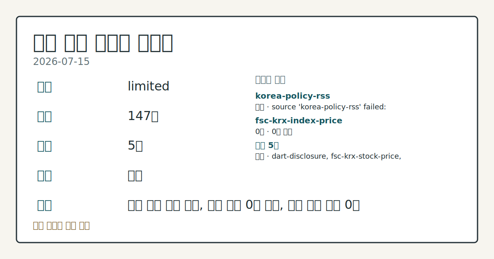
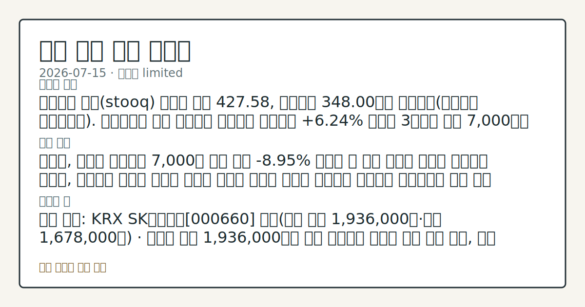

# 2026-07-15 국내 증시 시황
**기준 시각**: 2026-07-15 KST · 2026-07-14T15:00Z, 2026-07-15T15:00Z)
| 종목 | 종가 | 변동 | 비고 |
|------|------|------|------|
| ^KOSDAQ | 348.00 | — | — |
**세그먼트**: [국내 증시](2026-07-15.md) | 미국 증시(미발행) | [크립토](../../../crypto/2026/07/2026-07-15.md)

*이미지: 데이터 신뢰도 · 출처: investo 자체 생성 · 생성: investo 0.1.0 · 2026-07-15 UTC*
> **내 관심 자산 영향**: 데이터 수집 부족으로 매칭 판단 보류 — 추가 수집 후 재평가됩니다.
> **오늘의 결론**: 코스피는 스톡(stooq) 데이터 기준 427.58, 코스닥은 348.00으로 집계됐다(연합뉴스 마켓플러스). 코스피 관련 정밀 수치는 이번 회차 코어 데이터 미수집으로 확정할 수 없습니다. 삼성전자[005930]와 SK하이닉스[000660] 등 반도체 대형주가 각각 **+3.34%**, **+3.69%** 오르며 지수 반등을 이끌었다는 관측이 나온다(연합뉴스). 원/달러 환율은 데이터가 수집되지 수집 근거가 제한적입니다
> **핵심 동인**: 코스피, 반도체 쌍끌이로 7,000선 회복 전날 **-8.95%** 급락과 그 이후 이어진 변동성 국면에서 벗어나, 코스피는 반도체 대형주 반등과 외국인 순매수 전환을 동력으로 상승세로 돌아섰다는 것이 오늘 흐름의 핵심 변화다.
> **주의할 점**: SK하이닉스 관련 정밀 수치는 이번 회차 코어 데이터 미수집으로 확정할 수 없습니다. 관심 영향: 반도체 대형주 수급 흐름 점검. 삼성전자 관련 본문 참고.
> 정보 제공용 자동 시황이며 매매 권유가 아닙니다.
## 한눈에 보기
코스피(KOSPI, 한국 유가증권시장 종합지수)는 연합뉴스 보도 기준 전일대비 **+6.24%** 급등해 3거래일 만에 7,000선을 회복했고, 코스닥(KOSDAQ, 코스닥시장 지수)은 스톡(stooq) 데이터 기준 348.00을 기록했다.
**SK하이닉스**가 **+3.69%** 오른 1,913,000원에 거래를 마쳤다.
**3.866%** 국고채 3년물 금리 하락 — 본문 §④ 참조가 필요하다.
## ⓪ 오늘의 매크로
**FOMC 일정** — 2026-07-29 — FOMC Meeting
**미 국채 수익률** — UST curve 2026-07-15: 10Y 4.55%, 2Y10Y +0.42pp
## ⓪-B 채널 기준선
| 기준선 | 값 |
|------|------|
| 코스피 | 미수집 |
| 코스닥 | 348.00 (—) |
| 원/달러 | 미수집 |
> **크로스마켓 연결 고리**: 금리 이벤트가 할인율/달러 경로의 공통 변수로 남아 있습니다.
> **오늘의 큰 그림:** 이 세그먼트의 공통 신호는 제한적입니다. 본문 수급·지표 항목을 먼저 확인하세요.
## ① 요약

*이미지: 시장 스냅샷 · 출처: investo 자체 생성 · 생성: investo 0.1.0 · 2026-07-15 UTC*

코스피는 스톡 데이터 기준 427.58, 코스닥은 348.00으로 집계됐다([연합뉴스 마켓플러스](https://www.yna.co.kr/market-plus/all)). 코스피 관련 정밀 수치는 이번 회차 코어 데이터 미수집으로 확정할 수 없습니다. 삼성전자[005930]와 SK하이닉스[000660] 등 반도체 대형주가 각각 **+3.34%**, **+3.69%** 오르며 지수 반등을 이끌었다는 관측이 나온다([연합뉴스](https://www.yna.co.kr/view/AKR20260715077052008)). 원/달러 환율은 데이터가 수집되지 않았다. [상승 관찰]

## ② 전일 핵심 이슈

### 코스피, 반도체 쌍끌이로 7,000선 회복

전날 **-8.95%** 급락과 그 이후 이어진 변동성 국면에서 벗어나, 코스피는 반도체 대형주 반등과 외국인 순매수 전환을 동력으로 상승세로 돌아섰다는 것이 오늘 흐름의 핵심 변화다. 코스피 관련 정밀 수치는 이번 회차 코어 데이터 미수집으로 확정할 수 없습니다.

> **그래서 의미는?** 반도체 대형주 반등이 지수 상승을 이끌었다는 뜻으로, 수급 주체 변화를 함께 확인할 대목입니다.

### 전일 미국장, PPI(생산자물가지수) 소화하며 상승 출발

전일 뉴욕증시는 예상을 밑돈 PPI(생산자물가지수) 결과를 소화하며 3대 지수가 상승 출발했다([연합뉴스](https://www.yna.co.kr/view/AKR20260715183300009)). 이날 오전 발표된 미 6월 생산자물가는 전월대비 **0.3%** 하락해 예상 밖 둔화를 나타냈다([연합뉴스](https://www.yna.co.kr/view/AKR20260715180951072)). 이 같은 미국발 물가 안도감은 국내 개장 심리에도 우호적 배경으로 작용했다는 관측이 나오며, 반도체 대형주 반등과 겹치며 국내 수급 개선 흐름을 뒷받침했다는 해석이 가능하다.

## ③ 섹터/수급 동향

KRX(한국거래소) 데이터 미러 기준 15일 투자자별 순매수 현황은 다음과 같다([출처](https://finance.naver.com/sise/investorDealTrendDay.naver?bizdate=20260715&sosok=01)).

| 시장 | 투자자 | 순매수(억원) |
|---|---|---|
| 코스피 | 외국인 | +23,031 |
| 코스피 | 기관 | +1,992 |
| 코스피 | 기타 | -357 |
| 코스피 | 개인 | -24,666 |
| 코스닥 | 기관 | +1,086 |
| 코스닥 | 외국인 | +231 |
| 코스닥 | 기타 | +226 |
| 코스닥 | 개인 | -1,542 |

> **그래서 의미는?** 코스피는 외국인이, 코스닥은 기관이 순매수를 주도했다는 뜻으로, 개인 매도세와의 수급 엇갈림을 확인할 대목입니다.

반도체 대형주는 이날 나란히 상승했다. 삼성전자[005930]는 263,000원으로 **+3.34%**(+8,500원) 올랐고, 장중 고가 270,000원·저가 247,000원 사이에서 거래됐다. SK하이닉스 관련 정밀 수치는 이번 회차 코어 데이터 미수집으로 확정할 수 없습니다. 2차전지 관련 종목은 이번 입력에 정형 가격 데이터가 없어 섹터 흐름 서술을 생략한다.

## ④ 지표·이벤트

미 6월 생산자물가는 전월대비 **0.3%** 하락하며 에너지 가격 하락에 힘입어 예상 밖 둔화를 나타냈다([연합뉴스](https://www.yna.co.kr/view/AKR20260715180951072)). 이에 따라 국내 국고채 금리도 15일 일제히 하락했으며, 3년물은 연 **3.866%**를 기록했다([연합뉴스](https://www.yna.co.kr/view/AKR20260715152351008), [연합뉴스](https://www.yna.co.kr/view/AKR20260715152300008)).

> **그래서 의미는?** 물가 지표 둔화가 채권금리 하락으로 이어졌다는 뜻으로, 성장주 밸류에이션 부담 완화 관측과 연결됩니다.

## ⑤ 주요 종목

### 가격 변동 확인 종목

NAVER(네이버)[035420]는 183,200원으로 **-2.55%**(-4,800원) 내렸다. 셀트리온[068270]은 172,800원으로 **-1.31%**(-2,300원) 내렸다. 현대차[005380]는 424,500원으로 **-4.39%**(-19,500원) 내렸으며, 장중 고가 434,000원·저가 403,250원 사이에서 거래됐다. 한편 삼성전자·SK하이닉스 급등에 반대로 하락 베팅을 했던 '곱버스(인버스 2배 레버리지 상품)' 투자자들은 상당한 손실을 본 것으로 전해졌다([연합뉴스](https://www.yna.co.kr/view/AKR20260715106951008)).

> **그래서 의미는?** 가격이 크게 움직인 종목과 공시 이슈가 섞여 있다는 뜻으로, 종목별 재료 성격을 구분해 확인할 필요가 있습니다.

### 공시·자본정책 확인 항목

LS일렉트릭은 직원 3,200명에게 61억원 규모 자사주를 지급한다고 공시했다([연합뉴스](https://www.yna.co.kr/view/AKR20260715166900003)). DART(전자공시시스템)에도 엘에스일렉트릭의 자기주식처분결정 보고서가 접수됐다([DART](https://dart.fss.or.kr/dsaf001/main.do?rcpNo=20260715000510)). 남양유업[003920]은 220억원 규모 자기주식을 소각하며 주주환원 활동을 지속한다고 밝혔다([연합뉴스](https://www.yna.co.kr/view/AKR20260715152800030)). 코스맥스엔비티[222040]는 호주 자회사 지분을 104억원에 추가취득한다고 공시했다([연합뉴스](https://www.yna.co.kr/view/AKR20260715146400008)). LS 역시 자회사 관련 자기주식처분결정 주요사항보고서를 제출했다([DART](https://dart.fss.or.kr/dsaf001/main.do?rcpNo=20260715800794)).

### 수급 이슈 체크리스트

엔켐[348370]은 농식품 공급망 추적 솔루션 업체 GROWHUB에 5,969억원을 출자한다고 밝혔고, 같은 날 애프터마켓(시간외 단일가 매매)에서 10%대 급등을 나타냈다([연합뉴스](https://www.yna.co.kr/view/AKR20260715166300008), [연합뉴스](https://www.yna.co.kr/view/AKR20260715163900008)). NICE평가정보[030190]도 애프터마켓에서 10%대 급등을 나타냈다([연합뉴스](https://www.yna.co.kr/view/AKR20260715154700008)). LS증권[078020]은 법원 화해권고에 따라 현대차증권과의 CERCG(중국국저에너지화공집단) 관련 ABCP(자산유동화기업어음) 소송을 종결했다고 밝혔다([연합뉴스](https://www.yna.co.kr/view/AKR20260715166400008)).

## ⑥ 오늘의 관전 포인트

> **관전 포인트**: 구조화 가능한 관찰 신호가 부족합니다 — 본문 §②·§④ 참조

> **데이터 상태**: 제한

수집/품질 진단

> **데이터 상태**: 제한 — 수집 147건 / 소스 5개 / 누락: 없음 · 제한 — 핵심 가격 소스 0건/실패/stale, 본문 결론 신뢰도 낮음
> **소스 카운트**: 수집 대상 7 / 성공 5 / 수집 상세는 진단 섹션에서 확인할 수 있습니다. / 수집 상세는 진단 섹션에서 확인할 수 있습니다. / 수집 상세는 진단 섹션에서 확인할 수 있습니다.
> **소스 등급 분포**: S=2 / A=2 / B=1
> **상세 사유**: 일부 소스 수집 실패, 일부 소스 0건 반환, 핵심 가격 소스 0건
> **소스별 상태**: korea-policy-rss 실패 (일시적 수집 오류), fsc-krx-index-price 0건, 정상 5개

## ⑦ 면책조항
본 시황은 일반 정보 제공을 목적으로 자동 생성된 자료이며,
특정 종목·자산에 대한 매매 권유나 투자 자문이 아닙니다.
투자 결정과 그 결과에 대한 책임은 전적으로 본인에게 있으며,
본 시황의 내용에 따라 발생한 손실에 대해 작성자는 일체의 책임을 지지 않습니다.