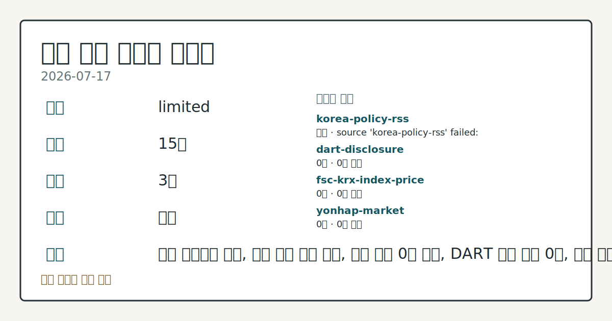
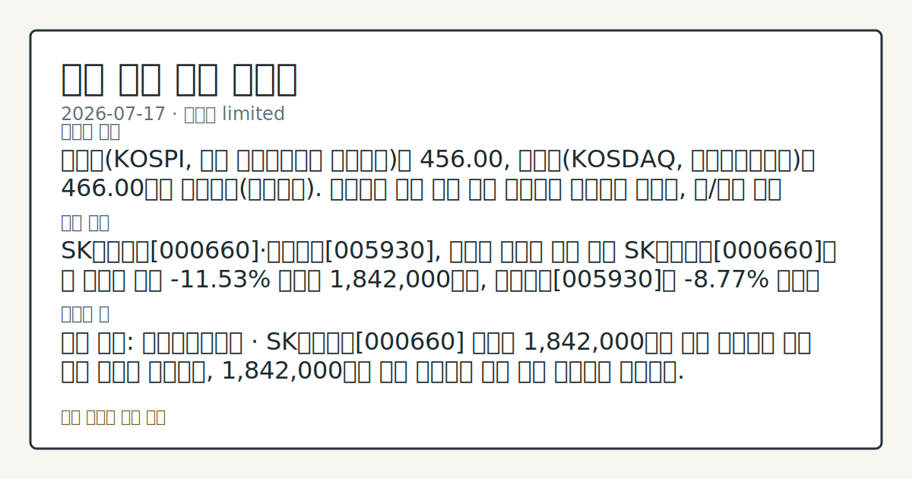

# 2026-07-17 국내 증시 시황
**기준 시각**: 2026-07-17 KST · 수집창 2026-07-16T15:00Z ~ 2026-07-17T15:00Z (종료 미포함)
| 종목 | 종가 | 변동 | 비고 |
|------|------|------|------|
| ^KOSPI | 9,000.00 | — | — |
**세그먼트**: [국내 증시](2026-07-17.md) | [미국 증시](../../../us-equity/2026/07/2026-07-17.md) | 크립토(미발행)

*이미지: 데이터 신뢰도 · 출처: investo 자체 생성 · 생성: investo 0.1.0 · 2026-07-19 UTC*
> **내 관심 자산 영향**: 데이터 수집 부족으로 매칭 판단 보류 — 추가 수집 후 재평가됩니다.
> **오늘의 결론**: 코스피는 9,000.00, 코스닥은 100.00으로 집계됐다(연합뉴스). 원/달러 환율은 입력 데이터에 포함되지 않아 환율 데이터 미수집 상태다 본문 참고.
> **핵심 동인**: 코스피 9,000선·코스닥 100선 마감 코스피는 9,000.00, 코스닥은 100.00으로 집계됐다. 최근 며칠간 반도체 업종을 중심으로 변동성 본문 참고.
> **주의할 점**: SK하이닉스 관련 정밀 수치는 이번 회차 코어 데이터 미수집으로 확정할 수 없습니다. 관심 영향: 반도체 대형주 수급 흐름 점검. 삼성전자 관련 본문 참고.
> 정보 제공용 자동 시황이며 매매 권유가 아닙니다.
## 한눈에 보기
삼성전자 관련 정밀 수치는 이번 회차 코어 데이터 미수집으로 확정할 수 없습니다.
SK하이닉스가 **+8.83%**로 2,082,000원까지 오르며 개인 순매수세를 이끌었다.
KOSPI 외국인 순매도 -13,665억원과 기관 순매도 -23,831억원이 반도체 강세와 엇갈린 수급 신호 — 본문 §③ 참조.
## ⓪ 오늘의 매크로
**미 국채 수익률** — UST curve 2026-07-17: 10Y 4.55%, 2Y10Y +0.37pp
## ⓪-B 채널 기준선
| 기준선 | 값 |
|------|------|
| 코스피 | 9,000.00 (—) |
| 코스닥 | 미수집 |
| 원/달러 | 미수집 |
> **크로스마켓 연결 고리**: 금리 이벤트가 할인율/달러 경로의 공통 변수로 남아 있습니다.
> **오늘의 큰 그림:** 이 세그먼트의 공통 신호는 제한적입니다. 본문 수급·지표 항목을 먼저 확인하세요.
## ① 요약

*이미지: 시장 스냅샷 · 출처: investo 자체 생성 · 생성: investo 0.1.0 · 2026-07-19 UTC*

코스피는 9,000.00, 코스닥은 100.00으로 집계됐다([연합뉴스](https://www.yna.co.kr/market-plus/all)). 원/달러 환율은 입력 데이터에 포함되지 않아 환율 데이터 미수집 상태다. 전날 뉴욕증시가 반도체주 매도세에 하락 출발한 가운데([연합뉴스](https://www.yna.co.kr/view/AKR20260717063100009)), 국내 장에서는 오히려 삼성전자가 **+6.27%**, SK하이닉스가 **+8.83%** 오르며 반대 방향 흐름을 보였다. 그러나 KOSPI·KOSDAQ 모두 외국인·기관은 순매도를 기록해([Naver금융 KRX mirror](https://finance.naver.com/sise/investorDealTrendDay.naver?bizdate=20260716&sosok=01)) 가격 상승과 수급 이탈이 엇갈리는 모습이다. [혼재]

## ② 전일 핵심 이슈

### 코스피 9,000선·코스닥 100선 마감

코스피는 9,000.00, 코스닥은 100.00으로 집계됐다([연합뉴스](https://www.yna.co.kr/market-plus/all)). 최근 며칠간 반도체 업종을 중심으로 변동성 장세가 이어진 가운데, 전날 뉴욕증시는 거센 반도체주 매도세에 하락 출발했으나([연합뉴스](https://www.yna.co.kr/view/AKR20260717063100009)), 국내 개장에서는 삼성전자·SK하이닉스가 강세를 보이며 반대 방향으로 움직였다 — 국내 반도체 수급에는 뉴욕발 약세 심리가 그대로 전이되지 않은 모습이다.

> **그래서 의미는?** 뉴욕 반도체 약세가 국내 개장에 그대로 이어지지는 않았다는 뜻입니다.

### 레버리지 파생상품발 변동성 관련 정치권 발언

오세훈 서울시장이 국내 증시의 변동성을 초래한 레버리지 파생상품 문제를 지적하는 발언을 했다고 연합뉴스가 보도했다([연합뉴스](https://www.yna.co.kr/view/AKR20260717028300004)). 해당 보도는 정책 논쟁 맥락의 발언이며 구체적 수치는 확인되지 않았다.

## ③ 섹터/수급 동향

### 삼성전자·SK하이닉스 반도체 강세

전날 뉴욕증시가 반도체주 매도세로 하락 출발한 것과 달리, 국내 장에서는 삼성전자[005930]가 279,500원(**+6.27%**, +16,500)([공공데이터포털](https://www.data.go.kr/data/15094808/openapi.do)), SK하이닉스[000660]가 2,082,000원(**+8.83%**, +169,000)으로 마감하며 반도체 대형주가 동반 상승했다. 거래대금은 SK하이닉스가 12,789,651,669,000원, 삼성전자가 6,952,196,477,350원으로 집계됐다.

> **그래서 의미는?** 뉴욕 반도체 매도세와 달리 국내 반도체 대형주는 상승해 방향이 엇갈렸습니다.

### 수급: 개인 순매수 vs 외국인·기관 순매도

2026-07-16 기준 KOSPI에서는 개인이 +36,647억원 순매수한 반면 외국인은 -13,665억원, 기관은 -23,831억원 순매도를 기록했고 기타는 +849억원 순매수였다([Naver금융 KRX mirror](https://finance.naver.com/sise/investorDealTrendDay.naver?bizdate=20260716&sosok=01)). KOSDAQ에서도 개인 +4,184억원 순매수, 외국인 -2,919억원 순매도, 기관 -1,553억원 순매도, 기타 +287억원 순매수로 유사한 구도가 나타났다([Naver금융 KRX mirror](https://finance.naver.com/sise/investorDealTrendDay.naver?bizdate=20260716&sosok=02)).

## ④ 지표·이벤트

이번 세션에는 국내 증시에 배정된 거시지표·이벤트 데이터가 수집되지 않아 별도로 확인된 일정은 없다.

> **그래서 의미는?** 현재 수집 근거가 부족해 방향보다 확인 필요 항목으로만 봅니다.

## ⑤ 주요 종목

### 확인 종목

NAVER[035420]는 189,600원(**+3.49%**, +6,400)([공공데이터포털](https://www.data.go.kr/data/15094808/openapi.do)), 셀트리온[068270]은 175,700원(**+1.68%**, +2,900), 현대차[005380]는 434,000원으로 각각 마감했다.

> **그래서 의미는?** NAVER·셀트리온·현대차 등 대형주가 고르게 상승 마감했다는 의미입니다.

## ⑥ 오늘의 관전 포인트

> **관전 포인트**: 구조화 가능한 관찰 신호가 부족합니다 — 본문 §②·§④ 참조

> **데이터 상태**: 제한

수집/품질 진단

> **데이터 상태**: 제한 — 수집 19건 / 소스 4개 / 누락: 없음 · 제한 — 핵심 가격 소스 0건/실패/stale, 본문 결론 신뢰도 낮음
> **소스 카운트**: 수집 대상 7 / 성공 4 / 수집 상세는 진단 섹션에서 확인할 수 있습니다. / 수집 상세는 진단 섹션에서 확인할 수 있습니다. / 수집 상세는 진단 섹션에서 확인할 수 있습니다.
> **소스 등급 분포**: S=1 / A=2 / B=1
> **상세 사유**: 일부 소스 수집 실패, 일부 소스 0건 반환, DART 주요 공시 0건, 핵심 가격 소스 0건
> **소스별 상태**: korea-policy-rss 실패 (수집 불가), dart-disclosure 0건, fsc-krx-index-price 0건, 정상 4개

## ⑦ 면책조항
본 시황은 일반 정보 제공을 목적으로 자동 생성된 자료이며,
특정 종목·자산에 대한 매매 권유나 투자 자문이 아닙니다.
투자 결정과 그 결과에 대한 책임은 전적으로 본인에게 있으며,
본 시황의 내용에 따라 발생한 손실에 대해 작성자는 일체의 책임을 지지 않습니다.